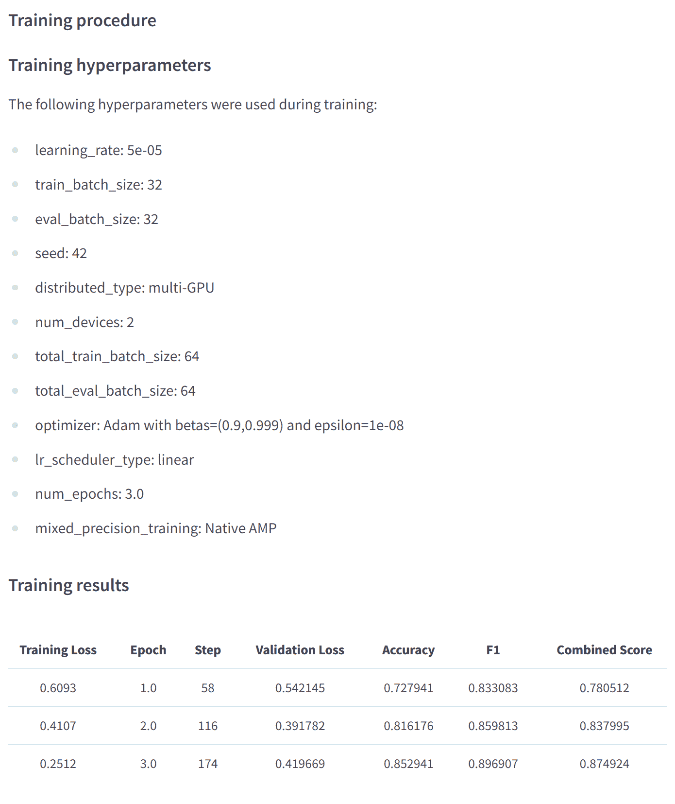
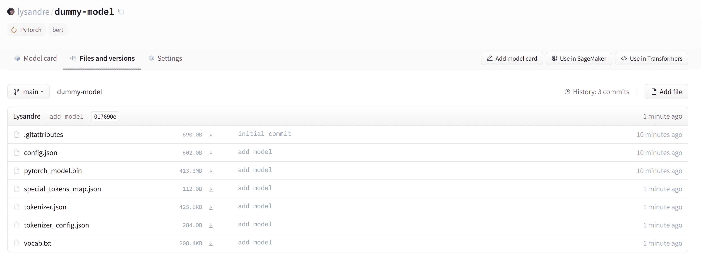
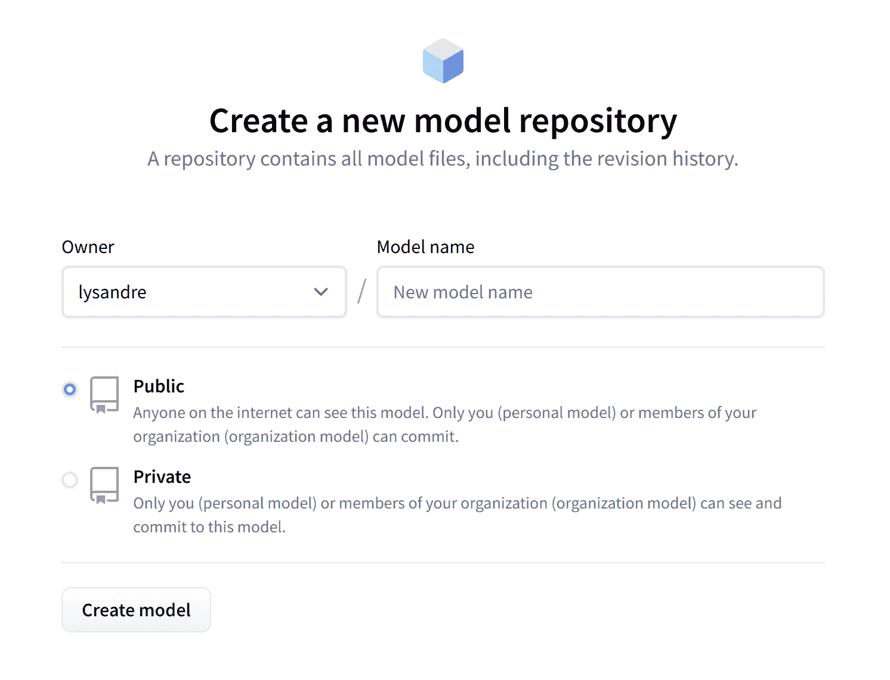
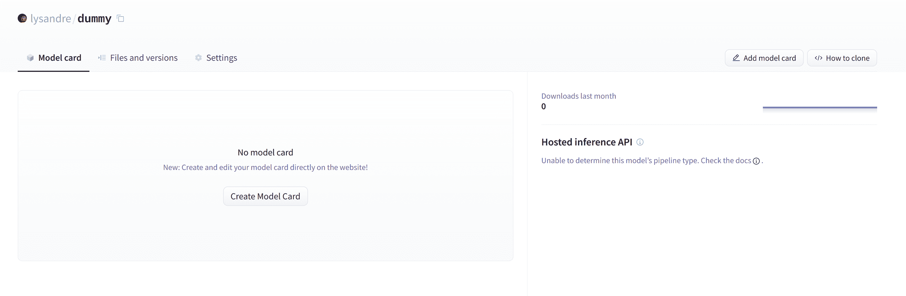
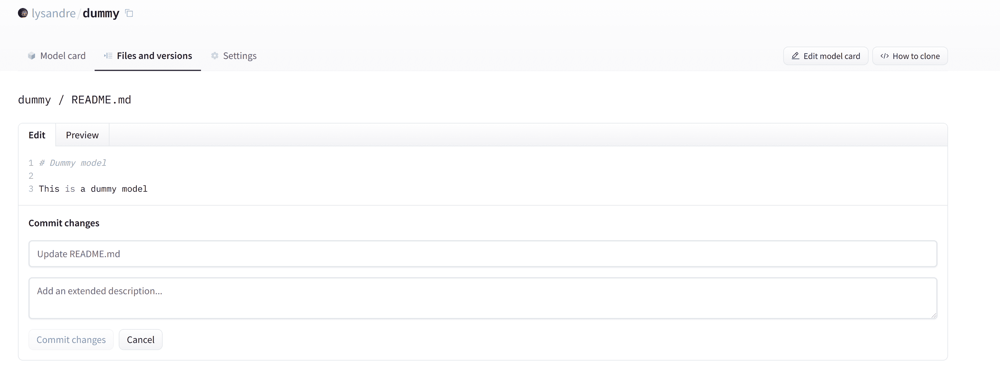
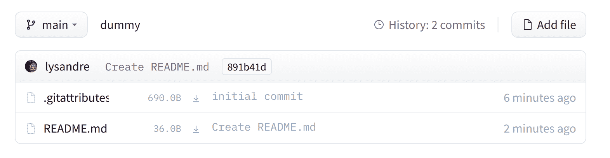
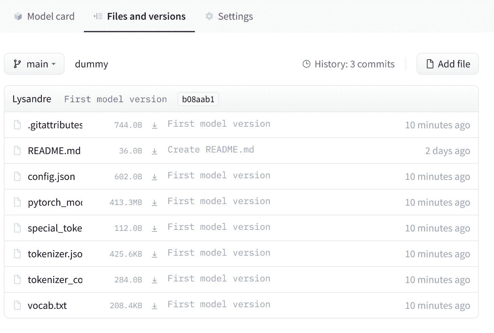
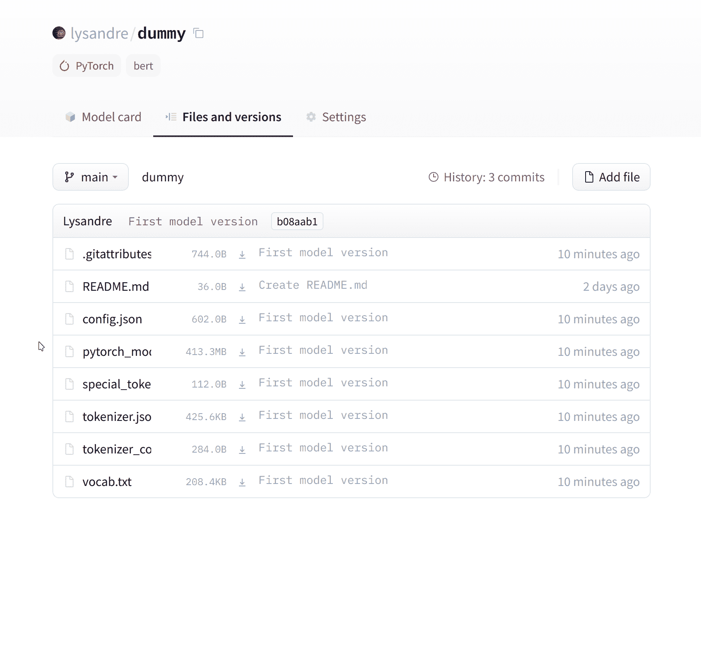

# 共享预训练模型

> 原文：[`huggingface.co/learn/nlp-course/zh-CN/chapter4/3?fw=pt`](https://huggingface.co/learn/nlp-course/zh-CN/chapter4/3?fw=pt)

                 Pytorch TensorFlow  

在下面的步骤中，我们将看看将预训练模型分享到 🤗 Hub 的最简单方法。有可用的工具和实用程序可以让直接在 Hub 上共享和更新模型变得简单，我们将在下面进行探讨。

[`www.youtube-nocookie.com/embed/9yY3RB_GSPM`](https://www.youtube-nocookie.com/embed/9yY3RB_GSPM)

我们鼓励所有训练模型的用户通过与社区共享来做出贡献——共享模型，即使是在非常特定的数据集上进行训练，也将帮助他人，节省他们的时间和计算资源，并提供对有用的训练工件的访问。反过来，您可以从其他人所做的工作中受益！

创建新模型存储库的方法有以下三种：

*   使用 push_to_hub API 接口
*   使用 huggingface_hub Python 库
*   使用 web 界面

创建存储库后，您可以通过 git 和 git-lfs 将文件上传到其中。我们将在以下部分引导您创建模型存储库并将文件上传到它们

## 使用 push_to_hub API

[`www.youtube-nocookie.com/embed/Zh0FfmVrKX0`](https://www.youtube-nocookie.com/embed/Zh0FfmVrKX0)

将文件上传到集线器的最简单方法是利用 **push_to_hub** API 接口。

在继续之前，您需要生成一个身份验证令牌，以便 **huggingface_hub** API 知道您是谁以及您对哪些名称空间具有写入权限。确保你在一个环境中 **transformers** 已安装（见 Setup）。如果您在笔记本中，可以使用以下功能登录：

```py
from huggingface_hub import notebook_login

notebook_login()
```

在终端中，您可以运行：

```py
huggingface-cli login
```

在这两种情况下，系统都会提示您输入用户名和密码，这与您用于登录 Hub 的用户名和密码相同。如果您还没有 Hub 配置文件，则应该创建一个[here](https://huggingface.co/join)。

好的！您现在已将身份验证令牌存储在缓存文件夹中。让我们创建一些存储库！

如果你玩过 **Trainer** 用于训练模型的 API，将其上传到 Hub 的最简单方法是设置 **push_to_hub=True** 当你定义你的 **TrainingArguments** ：

```py
from transformers import TrainingArguments

training_args = TrainingArguments(
    "bert-finetuned-mrpc", save_strategy="epoch", push_to_hub=True
)
```

你声明 **trainer.train()** 的时候， 这 **Trainer** 然后每次将您的模型保存到您的命名空间中的存储库中时（这里是每个时代），它将上传到集线器。该存储库将命名为您选择的输出目录（此处 **bert-finetuned-mrpc** ) 但您可以选择不同的名称 **hub_model_id = a_different_name** 。

要将您的模型上传到您所属的组织，只需将其传递给 **hub_model_id = my_organization/my_repo_name** 。

训练结束后，你应该做最后的 **trainer.push_to_hub()** 上传模型的最新版本。它还将生成包含所有相关元数据的模型卡，报告使用的超参数和评估结果！以下是您可能会在此类模型卡中找到的内容示例：



在较低级别，可以通过模型、标记器和配置对象直接访问模型中心 **push_to_hub()** 方法。此方法负责创建存储库并将模型和标记器文件直接推送到存储库。与我们将在下面看到的 API 不同，不需要手动处理。

为了了解它是如何工作的，让我们首先初始化一个模型和一个标记器：

```py
from transformers import AutoModelForMaskedLM, AutoTokenizer

checkpoint = "camembert-base"

model = AutoModelForMaskedLM.from_pretrained(checkpoint)
tokenizer = AutoTokenizer.from_pretrained(checkpoint)
```

你可以自由地用这些做任何你想做的事情——向标记器添加标记，训练模型，微调它。一旦您对生成的模型、权重和标记器感到满意，您就可以利用 **push_to_hub()** 方法直接在 **model** 中：

```py
model.push_to_hub("dummy-model")
```

这将创建新的存储库 **dummy-model** 在您的个人资料中，并用您的模型文件填充它。 对标记器执行相同的操作，以便所有文件现在都可以在此存储库中使用：

```py
tokenizer.push_to_hub("dummy-model")
```

如果您属于一个组织，只需指定 **organization** 上传到该组织的命名空间的参数：

```py
tokenizer.push_to_hub("dummy-model", organization="huggingface")
```

如果您希望使用特定的 Hugging Face 令牌，您可以自由地将其指定给 **push_to_hub()** 方法也是：

```py
tokenizer.push_to_hub("dummy-model", organization="huggingface", use_auth_token="<TOKEN>")
```

现在前往模型中心找到您新上传的模型：*[`huggingface.co/user-or-organization/dummy-model`](https://huggingface.co/user-or-organization/dummy-model)*。

单击“文件和版本”选项卡，您应该会在以下屏幕截图中看到可见的文件：



✏️ **试试看**！获取与检查点关联的模型和标记器，并使用该方法将它们上传到您的命名空间中的存储库。在删除之前，请仔细检查该存储库是否正确显示在您的页面上。

如您所见， **push_to_hub()** 方法接受多个参数，从而可以上传到特定的存储库或组织命名空间，或使用不同的 API 令牌。我们建议您查看直接在[🤗 Transformers documentation](https://huggingface.co/transformers/model_sharing.html)了解什么是可能的

这 **push_to_hub()** 方法由[huggingface_hub](https://github.com/huggingface/huggingface_hub)Python 包，为 Hugging Face Hub 提供直接 API。它集成在 🤗 Transformers 和其他几个机器学习库中，例如[allenlp](https://github.com/allenai/allennlp).虽然我们在本章中专注于 🤗 Transformers 集成，但将其集成到您自己的代码或库中很简单。

跳到最后一部分，了解如何将文件上传到新创建的存储库！

## 使用 huggingface_hub python 库

这 **huggingface_hub** Python 库是一个包，它为模型和数据集中心提供了一组工具。它为常见任务提供了简单的方法和类，例如 获取有关集线器上存储库的信息并对其进行管理。它提供了在 git 之上工作的简单 API 来管理这些存储库的内容并集成 Hub 在您的项目和库中。

类似于使用 **push_to_hub** API，这将要求您将 API 令牌保存在缓存中。为此，您需要使用 **login** 来自 CLI 的命令，如上一节所述（同样，确保在这些命令前面加上 **!** 字符（如果在 Google Colab 中运行）：

```py
huggingface-cli login
```

这 **huggingface_hub** 包提供了几种对我们有用的方法和类。首先，有几种方法可以管理存储库的创建、删除等：

```py
from huggingface_hub import (
    # User management
    login,
    logout,
    whoami,

    # Repository creation and management
    create_repo,
    delete_repo,
    update_repo_visibility,

    # And some methods to retrieve/change information about the content
    list_models,
    list_datasets,
    list_metrics,
    list_repo_files,
    upload_file,
    delete_file,
)
```

此外，它还提供了非常强大的 **Repository** 用于管理本地存储库的类。我们将在接下来的几节中探讨这些方法和该类，以了解如何利用它们。

这 **create_repo** 方法可用于在集线器上创建新存储库：

```py
from huggingface_hub import create_repo

create_repo("dummy-model")
```

这将创建存储库 **dummy-model** 在您的命名空间中。如果愿意，您可以使用 **organization** 争论：

```py
from huggingface_hub import create_repo

create_repo("dummy-model", organization="huggingface")
```

这将创建 **dummy-model** 存储库中的 **huggingface** 命名空间，假设您属于该组织。 其他可能有用的参数是：

*   private 以指定存储库是否应对其他人可见。
*   token 如果您想用给定的令牌覆盖存储在缓存中的令牌。
*   repo_type 如果你想创建一个或一个替代一个的而不是模型。接受的值和 datasetspace “dataset""space”。

创建存储库后，我们应该向其中添加文件！跳到下一部分以查看可以处理此问题的三种方法。

## 使用网络界面

Web 界面提供了直接在 Hub 中管理存储库的工具。使用该界面，您可以轻松创建存储库、添加文件（甚至是大文件！）、探索模型、可视化差异等等。

要创建新的存储库，请访问[huggingface.co/new](https://huggingface.co/new)：



首先，指定存储库的所有者：这可以是您或您所属的任何组织。如果您选择一个组织，该模型将出现在该组织的页面上，并且该组织的每个成员都可以为存储库做出贡献。

接下来，输入您的模型名称。这也将是存储库的名称。最后，您可以指定您的模型是公开的还是私有的。私人模特要求您拥有付费 Hugging Face 帐户，并允许您将模特隐藏在公众视野之外。

创建模型存储库后，您应该看到如下页面：



这是您的模型将被托管的地方。要开始填充它，您可以直接从 Web 界面添加 README 文件。



README 文件在 Markdown 中 - 随意使用它！本章的第三部分致力于构建模型卡。这些对于为您的模型带来价值至关重要，因为它们是您告诉其他人它可以做什么的地方。

如果您查看“文件和版本”选项卡，您会发现那里还没有很多文件——只有自述文件你刚刚创建和.git 属性跟踪大文件的文件。



接下来我们将看看如何添加一些新文件。

## 上传模型文件

Hugging Face Hub 上的文件管理系统基于用于常规文件的 git 和 git-lfs（代表[Git Large File Storage](https://git-lfs.github.com/)) 对于较大的文件。

在下一节中，我们将介绍将文件上传到 Hub 的三种不同方式：通过 **huggingface_hub** 并通过 git 命令。

### The upload_file approach

使用 **upload_file** 不需要在您的系统上安装 git 和 git-lfs。它使用 HTTP POST 请求将文件直接推送到 🤗 Hub。这种方法的一个限制是它不能处理大于 5GB 的文件。 如果您的文件大于 5GB，请按照下面详述的另外两种方法进行操作。API 可以按如下方式使用：

```py
from huggingface_hub import upload_file

upload_file(
    "<path_to_file>/config.json",
    path_in_repo="config.json",
    repo_id="<namespace>/dummy-model",
)
```

这将上传文件 **config.json** 可在 **path_to_file** 到存储库的根目录 **config.json** , 到 **dummy-model** 存储库。 其他可能有用的参数是：

*   token，如果要通过给定的令牌覆盖缓存中存储的令牌。
*   repo_type, 如果你想要上传一个 `dataset` 或一个 `space` 而不是模型。 接受的值为 `"dataset"` 和 `"space"`.

### The Repository class

以类似 git 的方式管理本地存储库。它抽象了 git 可能遇到的大部分痛点，以提供我们需要的所有功能。

使用这个类需要安装 git 和 git-lfs，所以确保你已经安装了 git-lfs（参见[here](https://git-lfs.github.com/)安装说明）并在开始之前进行设置。

为了开始使用我们刚刚创建的存储库，我们可以通过克隆远程存储库将其初始化到本地文件夹开始：

```py
from huggingface_hub import Repository

repo = Repository("<path_to_dummy_folder>", clone_from="<namespace>/dummy-model")
```

这创建了文件夹 **path_to_dummy_folder** 在我们的工作目录中。该文件夹仅包含 **.gitattributes** 文件，因为这是通过实例化存储库时创建的唯一文件 **create_repo**。

从现在开始，我们可以利用几种传统的 git 方法：

```py
repo.git_pull()
repo.git_add()
repo.git_commit()
repo.git_push()
repo.git_tag()
```

另外！我们建议您查看 **Repository** 可用文件[here](https://github.com/huggingface/huggingface_hub/tree/main/src/huggingface_hub#advanced-programmatic-repository-management)有关所有可用方法的概述。

目前，我们有一个模型和一个标记器，我们希望将其推送到集线器。我们已经成功克隆了存储库，因此我们可以将文件保存在该存储库中。

我们首先通过拉取最新更改来确保我们的本地克隆是最新的：

```py
repo.git_pull()
```

完成后，我们保存模型和标记器文件：

```py
model.save_pretrained("<path_to_dummy_folder>")
tokenizer.save_pretrained("<path_to_dummy_folder>")
```

这 **path_to_dummy_folder** 现在包含所有模型和标记器文件。我们遵循通常的 git 工作流程，将文件添加到暂存区，提交它们并将它们推送到集线器：

```py
repo.git_add()
repo.git_commit("Add model and tokenizer files")
repo.git_push()
```

恭喜！您刚刚将第一个文件推送到 hub 上。

### The git-based approach

这是上传文件的非常简单的方法：我们将直接使用 git 和 git-lfs 来完成。大多数困难都被以前的方法抽象掉了，但是下面的方法有一些警告，所以我们将遵循一个更复杂的用例。

使用这个类需要安装 git 和 git-lfs，所以请确保你有[git-lfs](https://git-lfs.github.com/)安装（请参阅此处了解安装说明）并在开始之前进行设置。

首先从初始化 git-lfs 开始：

```py
git lfs install
```

```py
Updated git hooks.
Git LFS initialized.
```

完成后，第一步是克隆您的模型存储库：

```py
git clone https://huggingface.co/<namespace>/<your-model-id>
```

我的用户名是 **lysandre** 我使用了模型名称 **dummy** ，所以对我来说，命令最终如下所示：

```py
git clone https://huggingface.co/lysandre/dummy
```

我现在有一个名为的文件夹假在我的工作目录中。我能 **cd** 进入文件夹并查看内容：

```py
cd dummy && ls
```

```py
README.md
```

如果您刚刚使用 Hugging Face Hub 创建了您的存储库 **create_repo** 方法，这个文件夹应该只包含一个隐藏的 **.gitattributes** 文件。如果您按照上一节中的说明使用 Web 界面创建存储库，则该文件夹应包含一个自述文件文件旁边的隐藏 **.gitattributes** 文件，如图所示。

添加一个常规大小的文件，例如配置文件、词汇文件，或者基本上任何几兆字节以下的文件，就像在任何基于 git 的系统中所做的一样。但是，更大的文件必须通过 git-lfs 注册才能将它们推送到拥抱脸。

让我们回到 Python 来生成我们想要提交到我们的虚拟存储库的模型和标记器：

```py
from transformers import AutoModelForMaskedLM, AutoTokenizer

checkpoint = "camembert-base"

model = AutoModelForMaskedLM.from_pretrained(checkpoint)
tokenizer = AutoTokenizer.from_pretrained(checkpoint)

# Do whatever with the model, train it, fine-tune it...

model.save_pretrained("<path_to_dummy_folder>")
tokenizer.save_pretrained("<path_to_dummy_folder>")
```

现在我们已经保存了一些模型和标记器工件，让我们再看看假文件夹：

```py
ls
```

```py
config.json  pytorch_model.bin  README.md  sentencepiece.bpe.model  special_tokens_map.json tokenizer_config.json  tokenizer.json
```

If you look at the file sizes (for example, with `ls -lh`), you should see that the model state dict file (*pytorch_model.bin*) is the only outlier, at more than 400 MB.

✏️ 从 web 界面创建存储库时，*.gitattributes* 文件会自动设置为将具有某些扩展名的文件，例如 *.bin* 和 *.h5* 视为大文件，git-lfs 会对其进行跟踪您无需进行必要的设置。

我们现在可以继续进行，就像我们通常使用传统 Git 存储库一样。我们可以使用以下命令将所有文件添加到 Git 的暂存环境中 **git add** 命令：

```py
git add .
```

然后我们可以查看当前暂存的文件：

```py
git status
```

```py
On branch main
Your branch is up to date with 'origin/main'.

Changes to be committed:
  (use "git restore --staged <file>..." to unstage)
  modified:   .gitattributes
	new file:   config.json
	new file:   pytorch_model.bin
	new file:   sentencepiece.bpe.model
	new file:   special_tokens_map.json
	new file:   tokenizer.json
	new file:   tokenizer_config.json
```

同样，我们可以确保 git-lfs 使用其跟踪正确的文件 **status** 命令：

```py
git lfs status
```

```py
On branch main
Objects to be pushed to origin/main:

Objects to be committed:

	config.json (Git: bc20ff2)
	pytorch_model.bin (LFS: 35686c2)
	sentencepiece.bpe.model (LFS: 988bc5a)
	special_tokens_map.json (Git: cb23931)
	tokenizer.json (Git: 851ff3e)
	tokenizer_config.json (Git: f0f7783)

Objects not staged for commit:

```

我们可以看到所有文件都有 **Git** 作为处理程序，除了其中有 **LFS**的*pytorch_model.bin* 和 *sentencepiece.bpe.model*。

Let’s proceed to the final steps, committing and pushing to 让我们继续最后的步骤，提交并推动拥抱脸远程仓库：

```py
git commit -m "First model version"
```

```py
[main b08aab1] First model version
 7 files changed, 29027 insertions(+)
  6 files changed, 36 insertions(+)
 create mode 100644 config.json
 create mode 100644 pytorch_model.bin
 create mode 100644 sentencepiece.bpe.model
 create mode 100644 special_tokens_map.json
 create mode 100644 tokenizer.json
 create mode 100644 tokenizer_config.json
```

推送可能需要一些时间，具体取决于您的互联网连接速度和文件大小：

```py
git push
```

```py
Uploading LFS objects: 100% (1/1), 433 MB | 1.3 MB/s, done.
Enumerating objects: 11, done.
Counting objects: 100% (11/11), done.
Delta compression using up to 12 threads
Compressing objects: 100% (9/9), done.
Writing objects: 100% (9/9), 288.27 KiB | 6.27 MiB/s, done.
Total 9 (delta 1), reused 0 (delta 0), pack-reused 0
To https://huggingface.co/lysandre/dummy
   891b41d..b08aab1  main -> main
```

If we take a look at the model repository when this is finished, we can see all the recently added files:



UI 允许您浏览模型文件和提交，并查看每个提交引入的差异：

