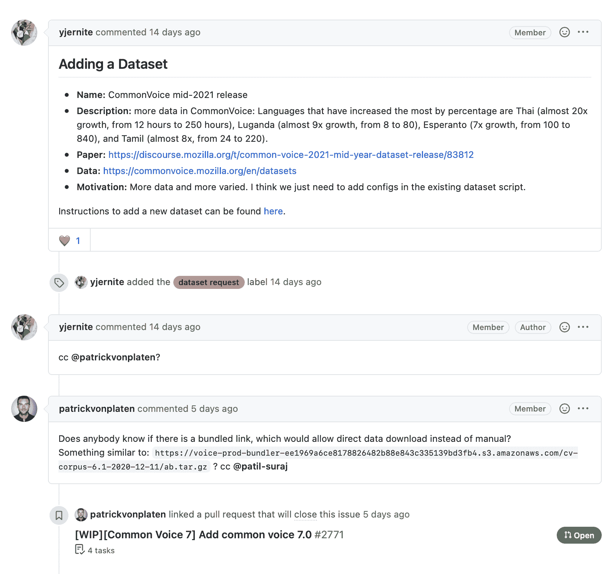
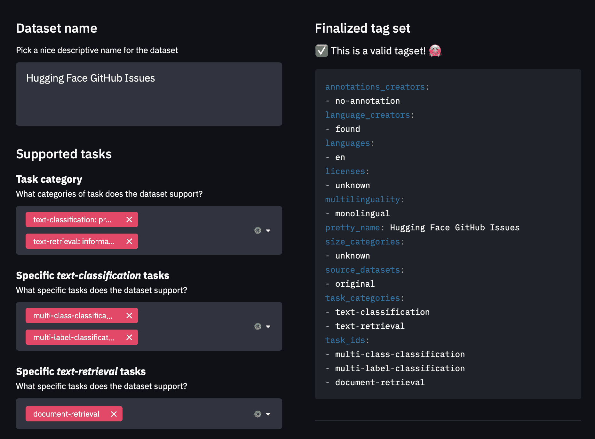
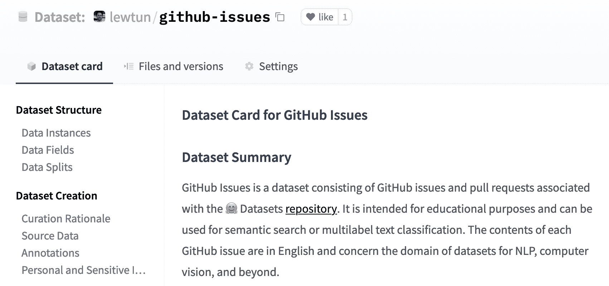

# 创建自己的数据集

> 原文：[`huggingface.co/learn/nlp-course/zh-CN/chapter5/5?fw=pt`](https://huggingface.co/learn/nlp-course/zh-CN/chapter5/5?fw=pt)

                  

有时，不存在合适的数据集适用于您构建 NLP 应用，因此您需要自己创建。在本节中，我们将向您展示如何创建一个[GitHub issues](https://github.com/features/issues/)的语料库，GitHub issues 通常用于跟踪 GitHub 存储库中的错误或功能。该语料库可用于各种目的，包括：

*   探索关闭未解决的 issue 或拉取请求需要多长时间
*   训练一个*多标签分类器*可以根据 issue 的描述（例如，“错误”、“增强”或“issue”）用元数据标记 issue
*   创建语义搜索引擎以查找与用户查询匹配的 issue

在这里，我们将专注于创建语料库，在下一节中，我们将探索语义搜索。我们将使用与流行的开源项目相关的 GitHub issue：🤗 Datasets！接下来让我们看看如何获取数据并探索这些 issue 中包含的信息。

## 获取数据

您可以浏览 🤗 Datasets 中的所有 issue[Issues tab](https://github.com/huggingface/datasets/issues).如以下屏幕截图所示，在撰写本文时，有 331 个未解决的 issue 和 668 个已关闭的 issue。


如果您单击其中一个 issue，您会发现它包含一个标题、一个描述和一组表征该 issue 的标签。下面的屏幕截图显示了一个示例.


要下载所有存储库的 issue，我们将使用[GitHub REST API](https://docs.github.com/en/rest)投票[Issues endpoint](https://docs.github.com/en/rest/reference/issues#list-repository-issues).此节点返回一个 JSON 对象列表，每个对象包含大量字段，其中包括标题和描述以及有关 issue 状态的元数据等。

下载 issue 的一种便捷方式是通过 **requests** 库，这是用 Python 中发出 HTTP 请求的标准方式。您可以通过运行以下的代码来安装库：

```py
!pip install requests
```

安装库后，您通过调用 **requests.get()** 功能来获取**Issues**节点。例如，您可以运行以下命令来获取第一页上的第一个 Issues：

```py
import requests

url = "https://api.github.com/repos/huggingface/datasets/issues?page=1&per_page=1"
response = requests.get(url)
```

这 **response** 对象包含很多关于请求的有用信息，包括 HTTP 状态码：

```py
response.status_code
```

```py
200
```

其中一个状态码 **200** 表示请求成功（您可以[在这里](https://en.wikipedia.org/wiki/List_of_HTTP_status_codes)找到可能的 HTTP 状态代码列表）。然而，我们真正感兴趣的是有效的信息，由于我们知道我们的 issues 是 JSON 格式，让我们按如下方式查看所有的信息：

```py
response.json()
```

```py
[{'url': 'https://api.github.com/repos/huggingface/datasets/issues/2792',
  'repository_url': 'https://api.github.com/repos/huggingface/datasets',
  'labels_url': 'https://api.github.com/repos/huggingface/datasets/issues/2792/labels{/name}',
  'comments_url': 'https://api.github.com/repos/huggingface/datasets/issues/2792/comments',
  'events_url': 'https://api.github.com/repos/huggingface/datasets/issues/2792/events',
  'html_url': 'https://github.com/huggingface/datasets/pull/2792',
  'id': 968650274,
  'node_id': 'MDExOlB1bGxSZXF1ZXN0NzEwNzUyMjc0',
  'number': 2792,
  'title': 'Update GooAQ',
  'user': {'login': 'bhavitvyamalik',
   'id': 19718818,
   'node_id': 'MDQ6VXNlcjE5NzE4ODE4',
   'avatar_url': 'https://avatars.githubusercontent.com/u/19718818?v=4',
   'gravatar_id': '',
   'url': 'https://api.github.com/users/bhavitvyamalik',
   'html_url': 'https://github.com/bhavitvyamalik',
   'followers_url': 'https://api.github.com/users/bhavitvyamalik/followers',
   'following_url': 'https://api.github.com/users/bhavitvyamalik/following{/other_user}',
   'gists_url': 'https://api.github.com/users/bhavitvyamalik/gists{/gist_id}',
   'starred_url': 'https://api.github.com/users/bhavitvyamalik/starred{/owner}{/repo}',
   'subscriptions_url': 'https://api.github.com/users/bhavitvyamalik/subscriptions',
   'organizations_url': 'https://api.github.com/users/bhavitvyamalik/orgs',
   'repos_url': 'https://api.github.com/users/bhavitvyamalik/repos',
   'events_url': 'https://api.github.com/users/bhavitvyamalik/events{/privacy}',
   'received_events_url': 'https://api.github.com/users/bhavitvyamalik/received_events',
   'type': 'User',
   'site_admin': False},
  'labels': [],
  'state': 'open',
  'locked': False,
  'assignee': None,
  'assignees': [],
  'milestone': None,
  'comments': 1,
  'created_at': '2021-08-12T11:40:18Z',
  'updated_at': '2021-08-12T12:31:17Z',
  'closed_at': None,
  'author_association': 'CONTRIBUTOR',
  'active_lock_reason': None,
  'pull_request': {'url': 'https://api.github.com/repos/huggingface/datasets/pulls/2792',
   'html_url': 'https://github.com/huggingface/datasets/pull/2792',
   'diff_url': 'https://github.com/huggingface/datasets/pull/2792.diff',
   'patch_url': 'https://github.com/huggingface/datasets/pull/2792.patch'},
  'body': '[GooAQ](https://github.com/allenai/gooaq) dataset was recently updated after splits were added for the same. This PR contains new updated GooAQ with train/val/test splits and updated README as well.',
  'performed_via_github_app': None}]
```

哇，这是很多信息！我们可以看到有用的字段，例如 **标题** , **内容** ， **参与的成员**， **issue 的描述信息**，以及打开 issue 的 GitHub 用户的信息。

✏️ 试试看！单击上面 JSON 中的几个 URL，以了解每个 GitHub issue 中我 url 链接到的实际的地址。

如 GitHub[文档](https://docs.github.com/en/rest/overview/resources-in-the-rest-api#rate-limiting) 中所述，未经身份验证的请求限制为每小时 60 个请求。虽然你可以增加 **per_page** 查询参数以减少您发出的请求数量，您仍然会遭到任何超过几千个 issue 的存储库的速率限制。因此，您应该关注 GitHub 的[创建个人身份令牌](https://docs.github.com/en/github/authenticating-to-github/creating-a-personal-access-token)，创建一个个人访问令牌这样您就可以将速率限制提高到每小时 5,000 个请求。获得令牌后，您可以将其包含在请求标头中：

```py
GITHUB_TOKEN = xxx  # Copy your GitHub token here
headers = {"Authorization": f"token {GITHUB_TOKEN}"}
```

⚠️ 不要与陌生人共享存在 GITHUB 令牌的笔记本。我们建议您在使用完后将 GITHUB 令牌删除，以避免意外泄漏此信息。一个更好的做法是，将令牌存储在.env 文件中，并使用 [`python-dotenv` library](https://github.com/theskumar/python-dotenv) 为您自动将其作为环境变量加载。

现在我们有了访问令牌，让我们创建一个可以从 GitHub 存储库下载所有 issue 的函数：

```py
import time
import math
from pathlib import Path
import pandas as pd
from tqdm.notebook import tqdm

def fetch_issues( owner="huggingface",
    repo="datasets",
    num_issues=10_000,
    rate_limit=5_000,
    issues_path=Path("."), ):
    if not issues_path.is_dir():
        issues_path.mkdir(exist_ok=True)

    batch = []
    all_issues = []
    per_page = 100  # Number of issues to return per page
    num_pages = math.ceil(num_issues / per_page)
    base_url = "https://api.github.com/repos"

    for page in tqdm(range(num_pages)):
        # Query with state=all to get both open and closed issues
        query = f"issues?page={page}&per_page={per_page}&state=all"
        issues = requests.get(f"{base_url}/{owner}/{repo}/{query}", headers=headers)
        batch.extend(issues.json())

        if len(batch) > rate_limit and len(all_issues) < num_issues:
            all_issues.extend(batch)
            batch = []  # Flush batch for next time period
            print(f"Reached GitHub rate limit. Sleeping for one hour ...")
            time.sleep(60 * 60 + 1)

    all_issues.extend(batch)
    df = pd.DataFrame.from_records(all_issues)
    df.to_json(f"{issues_path}/{repo}-issues.jsonl", orient="records", lines=True)
    print(
        f"Downloaded all the issues for {repo}! Dataset stored at {issues_path}/{repo}-issues.jsonl"
    )
```

现在我们可以调用 **fetch_issues()** 批量下载所有 issue，避免超过 GitHub 每小时的请求数限制；结果将存储在 repository_name-issues.jsonl 文件，其中每一行都是一个 JSON 对象，代表一个 issue。让我们使用这个函数从 🤗 Datasets 中抓取所有 issue：

```py
# Depending on your internet connection, this can take several minutes to run...
fetch_issues()
```

下载 issue 后，我们可以使用我们 section 2 新学会的方法在本地加载它们:

```py
issues_dataset = load_dataset("json", data_files="datasets-issues.jsonl", split="train")
issues_dataset
```

```py
Dataset({
    features: ['url', 'repository_url', 'labels_url', 'comments_url', 'events_url', 'html_url', 'id', 'node_id', 'number', 'title', 'user', 'labels', 'state', 'locked', 'assignee', 'assignees', 'milestone', 'comments', 'created_at', 'updated_at', 'closed_at', 'author_association', 'active_lock_reason', 'pull_request', 'body', 'timeline_url', 'performed_via_github_app'],
    num_rows: 3019
})
```

太好了，我们已经从头开始创建了我们的第一个数据集！但是为什么会有几千个 issue，而🤗 Datasets 存储库中的[Issues 选项卡](https://github.com/huggingface/datasets/issues)总共却只显示了大约 1,000 个 issue🤔？如 GitHub [文档](https://docs.github.com/en/rest/reference/issues#list-issues-assigned-to-the-authenticated-user)中所述，那是因为我们也下载了所有的拉取请求：

> Git Hub 的 REST API v3 认为每个 pull 请求都是一个 issue，但并不是每个 issue 都是一个 pull 请求。因此，“Issues”节点可能在响应中同时返回 issue 和拉取请求。你可以通过 pull_request 的 key 来辨别 pull 请求。请注意，从“Issues”节点返回的 pull 请求的 id 将是一个 issue id。

由于 issue 和 pull request 的内容有很大的不同，我们先做一些小的预处理，让我们能够区分它们。

## 清理数据

上面来自 GitHub 文档的片段告诉我们， **pull_request** 列可用于区分 issue 和拉取请求。让我们随机挑选一些样本，看看有什么不同。我们将使用在第三节, 学习的方法，使用 **Dataset.shuffle()** 和 **Dataset.select()** 抽取一个随机样本，然后将 **html_url** 和 **pull_request** 列使用 zip 函数打包，以便我们可以比较各种 URL：

```py
sample = issues_dataset.shuffle(seed=666).select(range(3))

# Print out the URL and pull request entries
for url, pr in zip(sample["html_url"], sample["pull_request"]):
    print(f">> URL: {url}")
    print(f">> Pull request: {pr}\n")
```

```py
>> URL: https://github.com/huggingface/datasets/pull/850
>> Pull request: {'url': 'https://api.github.com/repos/huggingface/datasets/pulls/850', 'html_url': 'https://github.com/huggingface/datasets/pull/850', 'diff_url': 'https://github.com/huggingface/datasets/pull/850.diff', 'patch_url': 'https://github.com/huggingface/datasets/pull/850.patch'}

>> URL: https://github.com/huggingface/datasets/issues/2773
>> Pull request: None

>> URL: https://github.com/huggingface/datasets/pull/783
>> Pull request: {'url': 'https://api.github.com/repos/huggingface/datasets/pulls/783', 'html_url': 'https://github.com/huggingface/datasets/pull/783', 'diff_url': 'https://github.com/huggingface/datasets/pull/783.diff', 'patch_url': 'https://github.com/huggingface/datasets/pull/783.patch'}
```

这里我们可以看到，每个 pull 请求都与各种 url 相关联，而普通 issue 只有一个 None 条目。我们可以使用这一点不同来创建一个新的 is_pull_request 列通过检查 pull_request 字段是否为 None 来区分它们:

```py
issues_dataset = issues_dataset.map(
    lambda x: {"is_pull_request": False if x["pull_request"] is None else True}
)
```

✏️ 试试看！计算在 🤗 Datasets 中解决 issue 所需的平均时间。您可能会发现 Dataset.filter()函数对于过滤拉取请求和未解决的 issue 很有用，并且您可以使用 Dataset.set_format()函数将数据集转换为 DataFrame，以便您可以轻松地按照需求修改创建和关闭的时间的格式（以时间戳格式）。

尽管我们可以通过删除或重命名某些列来进一步清理数据集，但在此阶段尽可能保持数据集“原始”状态通常是一个很好的做法，以便它可以在多个应用程序中轻松使用。在我们将数据集推送到 Hugging Face Hub 之前，让我们再添加一些缺少的数据：与每个 issue 和拉取请求相关的评论。我们接下来将添加它们——你猜对了——我们将依然使用 GitHub REST API！

## 扩充数据集

如以下屏幕截图所示，与 issue 或拉取请求相关的评论提供了丰富的信息，特别是如果我们有兴趣构建搜索引擎来回答用户对这个项目的疑问。



GitHub REST API 提供了一个 [评论节点](https://docs.github.com/en/rest/reference/issues#list-issue-comments) 返回与 issue 编号相关的所有评论。让我们测试节点以查看它返回的内容：

```py
issue_number = 2792
url = f"https://api.github.com/repos/huggingface/datasets/issues/{issue_number}/comments"
response = requests.get(url, headers=headers)
response.json()
```

```py
[{'url': 'https://api.github.com/repos/huggingface/datasets/issues/comments/897594128',
  'html_url': 'https://github.com/huggingface/datasets/pull/2792#issuecomment-897594128',
  'issue_url': 'https://api.github.com/repos/huggingface/datasets/issues/2792',
  'id': 897594128,
  'node_id': 'IC_kwDODunzps41gDMQ',
  'user': {'login': 'bhavitvyamalik',
   'id': 19718818,
   'node_id': 'MDQ6VXNlcjE5NzE4ODE4',
   'avatar_url': 'https://avatars.githubusercontent.com/u/19718818?v=4',
   'gravatar_id': '',
   'url': 'https://api.github.com/users/bhavitvyamalik',
   'html_url': 'https://github.com/bhavitvyamalik',
   'followers_url': 'https://api.github.com/users/bhavitvyamalik/followers',
   'following_url': 'https://api.github.com/users/bhavitvyamalik/following{/other_user}',
   'gists_url': 'https://api.github.com/users/bhavitvyamalik/gists{/gist_id}',
   'starred_url': 'https://api.github.com/users/bhavitvyamalik/starred{/owner}{/repo}',
   'subscriptions_url': 'https://api.github.com/users/bhavitvyamalik/subscriptions',
   'organizations_url': 'https://api.github.com/users/bhavitvyamalik/orgs',
   'repos_url': 'https://api.github.com/users/bhavitvyamalik/repos',
   'events_url': 'https://api.github.com/users/bhavitvyamalik/events{/privacy}',
   'received_events_url': 'https://api.github.com/users/bhavitvyamalik/received_events',
   'type': 'User',
   'site_admin': False},
  'created_at': '2021-08-12T12:21:52Z',
  'updated_at': '2021-08-12T12:31:17Z',
  'author_association': 'CONTRIBUTOR',
  'body': "@albertvillanova my tests are failing here:\r\n```\r\ndataset_name = 'gooaq'\r\n\r\n    def test_load_dataset(self, dataset_name):\r\n        configs = self.dataset_tester.load_all_configs(dataset_name, is_local=True)[:1]\r\n>       self.dataset_tester.check_load_dataset(dataset_name, configs, is_local=True, use_local_dummy_data=True)\r\n\r\ntests/test_dataset_common.py:234: \r\n_ _ _ _ _ _ _ _ _ _ _ _ _ _ _ _ _ _ _ _ _ _ _ _ _ _ _ _ _ _ _ _ _ _ _ _ _ _ _ _ \r\ntests/test_dataset_common.py:187: in check_load_dataset\r\n    self.parent.assertTrue(len(dataset[split]) > 0)\r\nE   AssertionError: False is not true\r\n```py\r\nWhen I try loading dataset on local machine it works fine. Any suggestions on how can I avoid this error?",
  'performed_via_github_app': None}]
```

我们可以看到注释存储在 body 字段中，所以让我们编写一个简单的函数，通过在 response.json()中为每个元素挑选 body 内容来返回与某个 issue 相关的所有评论：

```py
def get_comments(issue_number):
    url = f"https://api.github.com/repos/huggingface/datasets/issues/{issue_number}/comments"
    response = requests.get(url, headers=headers)
    return [r["body"] for r in response.json()]

# Test our function works as expected
get_comments(2792)
```

```py
["@albertvillanova my tests are failing here:\r\n```\r\ndataset_name = 'gooaq'\r\n\r\n    def test_load_dataset(self, dataset_name):\r\n        configs = self.dataset_tester.load_all_configs(dataset_name, is_local=True)[:1]\r\n>       self.dataset_tester.check_load_dataset(dataset_name, configs, is_local=True, use_local_dummy_data=True)\r\n\r\ntests/test_dataset_common.py:234: \r\n_ _ _ _ _ _ _ _ _ _ _ _ _ _ _ _ _ _ _ _ _ _ _ _ _ _ _ _ _ _ _ _ _ _ _ _ _ _ _ _ \r\ntests/test_dataset_common.py:187: in check_load_dataset\r\n    self.parent.assertTrue(len(dataset[split]) > 0)\r\nE   AssertionError: False is not true\r\n```py\r\nWhen I try loading dataset on local machine it works fine. Any suggestions on how can I avoid this error?"]
```

这看起来不错，所以让我们使用 **Dataset.map()** 方法在我们数据集中每个 issue 的添加一个**comments**列：

```py
# Depending on your internet connection, this can take a few minutes...
issues_with_comments_dataset = issues_dataset.map(
    lambda x: {"comments": get_comments(x["number"])}
)
```

最后一步是将我们的数据集推送到 Hub，让我们一起看看该怎么推送：

## 将数据集上传到 Hugging Face Hub

[`www.youtube-nocookie.com/embed/HaN6qCr_Afc`](https://www.youtube-nocookie.com/embed/HaN6qCr_Afc)

现在我们有了增强的数据集，是时候将它推送到 Hub 以便我们可以与社区共享它了！ 上传数据集非常简单：就像 🤗 Transformers 中的模型和分词器一样，我们可以使用 `push_to_hub()` 方法来推送数据集。 为此，我们需要一个身份验证令牌，它可以通过首先使用 `notebook_login()` 函数登录到 Hugging Face Hub 来获得：

```py
from huggingface_hub import notebook_login

notebook_login()
```

这将创建一个小部件，您可以在其中输入您的用户名和密码， API 令牌将保存在~/.huggingface/令牌.如果您在终端中运行代码，则可以改为通过 CLI 登录：

```py
huggingface-cli login
```

完成此操作后，我们可以通过运行下面的代码上传我们的数据集：

```py
issues_with_comments_dataset.push_to_hub("github-issues")
```

之后，任何人都可以通过便捷地提供带有存储库 ID 作为 path 参数的 load_dataset() 来下载数据集：

```py
remote_dataset = load_dataset("lewtun/github-issues", split="train")
remote_dataset
```

```py
Dataset({
    features: ['url', 'repository_url', 'labels_url', 'comments_url', 'events_url', 'html_url', 'id', 'node_id', 'number', 'title', 'user', 'labels', 'state', 'locked', 'assignee', 'assignees', 'milestone', 'comments', 'created_at', 'updated_at', 'closed_at', 'author_association', 'active_lock_reason', 'pull_request', 'body', 'performed_via_github_app', 'is_pull_request'],
    num_rows: 2855
})
```

很酷，我们已经将我们的数据集推送到 Hub，其他人可以使用它！只剩下一件重要的事情要做：添加一个数据卡这解释了语料库是如何创建的，并为使用数据集的其他提供一些其他有用的信息。

💡 您还可以使用一些 Git 魔法直接从终端将数据集上传到 Hugging Face Hub。有关如何执行此操作的详细信息，请参阅 [🤗 Datasets guide](https://huggingface.co/docs/datasets/share#share-a-dataset-using-the-cli) 指南。

## 创建数据集卡片

有据可查的数据集更有可能对其他人（包括你未来的自己！）有用，因为它们提供了上下文，使用户能够决定数据集是否与他们的任务相关，并评估任何潜在的偏见或与使用相关的风险。在 Hugging Face Hub 上，此信息存储在每个数据集存储库的自述文件文件。在创建此文件之前，您应该执行两个主要步骤：

1.  使用[数据集标签应用程序](https://huggingface.co/datasets/tagging/) 创建 YAML 格式的元数据标签。这些标签用于各种各样的搜索功能，并确保您的数据集可以很容易地被社区成员找到。因为我们已经在这里创建了一个自定义数据集，所以您需要克隆数据集标签存储库并在本地运行应用程序。它的界面是这样的:



2.阅读[🤗 Datasets guide](https://github.com/huggingface/datasets/blob/master/templates/README_guide.md) 关于创建信息性数据集卡片的指南，并将其作为模板使用。

您可以创建自述文件文件直接在 Hub 上，你可以在里面找到模板数据集卡片 **lewtun/github-issues** 数据集存储库。填写好的数据集卡片的屏幕截图如下所示。!



✏️试试看！使用应用程序和 [🤗 Datasets guide](https://github.com/huggingface/datasets/blob/master/templates/README_guide.md) 指南来完成 GitHub issue 数据集的 README.md 文件。

很好! 我们在本节中看到，创建一个好的数据集可能非常复杂，但幸运的是，将其上传并与社区共享会很容易实现。在下一节中，我们将使用我们的新数据集创建一个带有 🤗 Datasets 的语义搜索引擎，该数据集可以将 issue 与最相关的 issue 和评论进行匹配。

✏️ 试试看！按照我们在本节中采取的步骤为您最喜欢的开源库创建一个 GitHub issue 数据集（当然，选择 🤗 Datasets 以外的其他东西！）。对于奖励积分，微调多标签分类器以预测该领域中存在的标签。