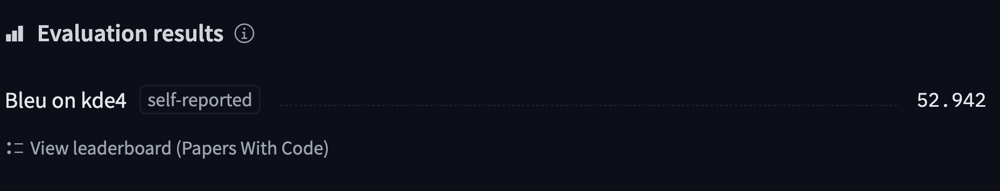
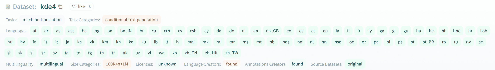

# 翻译

> 原文：[`huggingface.co/learn/nlp-course/zh-CN/chapter7/4?fw=pt`](https://huggingface.co/learn/nlp-course/zh-CN/chapter7/4?fw=pt)

                Pytorch TensorFlow 

现在让我们深入研究翻译。这是另一个 sequence-to-sequence 任务，这意味着这是一个可以表述为从一个序列到另一个序列的问题。从这个意义上说，这个问题非常类似文本摘要，并且您可以将我们将在此处学习到的一些内容迁移到其他的序列到序列问题，例如：

*   **风格迁移** : 创建一个模型将某种风格迁移到一段文本（例如，正式的风格迁移到休闲的风格或莎士比亚英语到现代英语）
*   **生成问题的回答** ：创建一个模型，在给定上下文的情况下生成问题的答案

[`www.youtube-nocookie.com/embed/1JvfrvZgi6c`](https://www.youtube-nocookie.com/embed/1JvfrvZgi6c)

如果您有足够大的两种（或更多）语言的文本语料库，您可以从头开始训练一个新的翻译模型，就像我们在因果语言建模部分中所做的那样。然而，微调现有的翻译模型会更快，无论是从像 mT5 或 mBART 这样的多语言模型微调到特定的语言对，或者是专门用于从一种语言翻译成另一种语言的模型。

在本节中，我们将对[KDE4 数据集](https://huggingface.co/datasets/kde4)上的 Marian 模型进行微调，该模型经过了从英语到法语的翻译预训练(因为很多“ Hugging Face”的员工会说这两种语言)，它是[KDE 应用程序](https://apps.kde.org/)本地化文件的数据集。我们将使用的模型已经在从[Opus 数据集](https://opus.nlpl.eu/)(实际上包含 KDE4 数据集)中提取的法语和英语文本的大型语料库上进行了预先训练。但是，即使我们使用的预训练模型在其预训练期间使用了这部分数据集，我们也会看到，经过微调后，我们可以得到一个更好的版本。

完成后，我们将拥有一个模型，可以进行这样的翻译：

[`course-demos-marian-finetuned-kde4-en-to-fr.hf.space`](https://course-demos-marian-finetuned-kde4-en-to-fr.hf.space)

](/huggingface-course/marian-finetuned-kde4-en-to-fr)

与前面的部分一样，您可以使用以下代码找到我们将训练并上传到 Hub 的实际模型，并[在这里](https://huggingface.co/huggingface-course/marian-finetuned-kde4-en-to-fr?text=This+plugin+allows+you+to+automatically+translate+web+pages+between+several+languages.)查看模型输出的结果

## 准备数据

为了从头开始微调或训练翻译模型，我们需要一个适合该任务的数据集。如前所述，我们将使用[KDE4 数据集](https://huggingface.co/datasets/kde4)在本节中，但您可以很容易地调整代码以使用您自己的数据，只要您有要互译的两种语言的句子对。如果您需要复习如何将自定义数据加载到 **Dataset** 可以复习一下第五章.

### KDE4 数据集

像往常一样，我们使用 **load_dataset()** 函数：

```py
from datasets import load_dataset

raw_datasets = load_dataset("kde4", lang1="en", lang2="fr")
```

如果您想使用不同的语言对，您可以使用它们的代码来指定它们。该数据集共有 92 种语言可用；您可以通过[数据集卡片](https://huggingface.co/datasets/kde4)展开其上的语言标签来查看它们.



我们来看看数据集：

```py
raw_datasets
```

```py
DatasetDict({
    train: Dataset({
        features: ['id', 'translation'],
        num_rows: 210173
    })
})
```

我们有 210,173 对句子，但在一次训练过程中，我们需要创建自己的验证集。正如我们在第五章学的的那样, **Dataset** 有一个 **train_test_split()** 方法,可以帮我们拆分数据集。我们将设定固定的随机数种子：

```py
split_datasets = raw_datasets["train"].train_test_split(train_size=0.9, seed=20)
split_datasets
```

```py
DatasetDict({
    train: Dataset({
        features: ['id', 'translation'],
        num_rows: 189155
    })
    test: Dataset({
        features: ['id', 'translation'],
        num_rows: 21018
    })
})
```

我们可以将 **test** 的键重命名为 **validation** 像这样：

```py
split_datasets["validation"] = split_datasets.pop("test")
```

现在让我们看一下数据集的一个元素：

```py
split_datasets["train"][1]["translation"]
```

```py
{'en': 'Default to expanded threads',
 'fr': 'Par défaut, développer les fils de discussion'}
```

我们得到一个字典，其中包含我们请求的两种语言的两个句子。这个充满技术计算机科学术语的数据集的一个特殊之处在于它们都完全用法语翻译。然而，法国工程师通常很懒惰，在交谈时，大多数计算机科学专用词汇都用英语表述。例如，“threads”这个词很可能出现在法语句子中，尤其是在技术对话中；但在这个数据集中，它被翻译成更正确的“fils de Discussion”。我们使用的预训练模型已经在一个更大的法语和英语句子语料库上进行了预训练，采用了更简单的选择，即保留单词的原样:

```py
from transformers import pipeline

model_checkpoint = "Helsinki-NLP/opus-mt-en-fr"
translator = pipeline("translation", model=model_checkpoint)
translator("Default to expanded threads")
```

```py
[{'translation_text': 'Par défaut pour les threads élargis'}]
```

这种情况的另一个例子是“plugin”这个词，它不是正式的法语词，但大多数母语人士都能理解，也不会费心去翻译。 在 KDE4 数据集中，这个词在法语中被翻译成更正式的“module d’extension”：

```py
split_datasets["train"][172]["translation"]
```

```py
{'en': 'Unable to import %1 using the OFX importer plugin. This file is not the correct format.',
 'fr': "Impossible d'importer %1 en utilisant le module d'extension d'importation OFX. Ce fichier n'a pas un format correct."}
```

然而，我们的预训练模型坚持使用简练而熟悉的英文单词：

```py
translator(
    "Unable to import %1 using the OFX importer plugin. This file is not the correct format."
)
```

```py
[{'translation_text': "Impossible d'importer %1 en utilisant le plugin d'importateur OFX. Ce fichier n'est pas le bon format."}]
```

看看我们的微调模型是否能识别数据集的这些特殊性。（剧透警告：它会）。

[`www.youtube-nocookie.com/embed/0Oxphw4Q9fo`](https://www.youtube-nocookie.com/embed/0Oxphw4Q9fo)

✏️ **轮到你了！** 另一个在法语中经常使用的英语单词是“email”。在训练数据集中找到使用这个词的第一个样本。它是如何翻译的？预训练模型如何翻译同一个英文句子？

### 处理数据

[`www.youtube-nocookie.com/embed/XAR8jnZZuUs`](https://www.youtube-nocookie.com/embed/XAR8jnZZuUs)

您现在应该知道我们的下一步该做些什么了：所有文本都需要转换为 token ID，以便模型能够理解它们。对于这个任务，我们需要同时标记输入和目标。我们的首要任务是创建我们的 **tokenizer** 对象。如前所述，我们将使用 Marian 英语到法语的预训练模型。如果您使用另一对语言尝试此代码，请确保调整模型 Checkpoint。[Helsinki-NLP](https://huggingface.co/Helsinki-NLP)组织提供了多种语言的一千多种模型。

```py
from transformers import AutoTokenizer

model_checkpoint = "Helsinki-NLP/opus-mt-en-fr"
tokenizer = AutoTokenizer.from_pretrained(model_checkpoint, return_tensors="pt")
```

您可以将 **model_checkpoint** 更换为[Hub](https://huggingface.co/models)上你喜欢的任何其他型号，或本地保存的预训练模型和标记器。

💡 如果正在使用 mart、mBART-50 或 M2 M100 等多语言标记器，则需要在 tokenizer 中设置 tokenizer.src_lang 和 tokenizer.tgt_lang 为正确的输入和目标的语言代码。

我们的数据准备非常简单。 只有一件事要记住； 您需要确保分词器以输出语言（此处为法语）处理目标。 您可以通过将目标传递给分词器的 **call** 方法的 text_targets 参数来完成此操作。

为了了解这是如何工作的，让我们处理训练集中每种语言的一个样本：

```py
en_sentence = split_datasets["train"][1]["translation"]["en"]
fr_sentence = split_datasets["train"][1]["translation"]["fr"]

inputs = tokenizer(en_sentence, text_target=fr_sentence)
inputs
```

```py
{'input_ids': [47591, 12, 9842, 19634, 9, 0], 'attention_mask': [1, 1, 1, 1, 1, 1], 'labels': [577, 5891, 2, 3184, 16, 2542, 5, 1710, 0]}
```

正如我们所见，输出包含与英语句子关联的输入 ID，而与法语句子关联的 ID 存储在“labels”字段中。 如果您忘记表明您正在对标签进行分词，它们将由输入分词器进行分词，这在 Marian 模型的情况下根本不会顺利进行：

```py
wrong_targets = tokenizer(fr_sentence)
print(tokenizer.convert_ids_to_tokens(wrong_targets["input_ids"]))
print(tokenizer.convert_ids_to_tokens(inputs["labels"]))
```

```py
['▁Par', '▁dé', 'f', 'aut', ',', '▁dé', 've', 'lop', 'per', '▁les', '▁fil', 's', '▁de', '▁discussion', '</s>']
['▁Par', '▁défaut', ',', '▁développer', '▁les', '▁fils', '▁de', '▁discussion', '</s>']
```

正如我们所看到的，使用英语标记器来预处理法语句子会产生更多的标记，因为标记器不知道任何法语单词(除了那些也出现在英语语言中的单词，比如“discussion”)。

由于“inputs”是一个包含我们常用键（输入 ID、注意掩码等）的字典，最后一步是定义我们将应用于数据集的预处理函数：

```py
max_length = 128

def preprocess_function(examples):
    inputs = [ex["en"] for ex in examples["translation"]]
    targets = [ex["fr"] for ex in examples["translation"]]
    model_inputs = tokenizer(
        inputs, text_target=targets, max_length=max_length, truncation=True
    )
    return model_inputs
```

请注意，我们为输入和输出设置了相同的最大长度。由于我们处理的文本看起来很短，我们使用 128。

💡如果你使用的是 T5 模型(更具体地说，是 T5 -xxx 检查点之一)，模型将需要文本输入有一个前缀来表示正在进行的任务，例如从英语到法语的翻译

⚠️ 我们不关注目标的注意力掩码，因为模型不会需要它。相反，对应于填充标记的标签应设置为-100，以便在 loss 计算中忽略它们。这将在稍后由我们的数据整理器完成，因为我们正在应用动态填充，但是如果您在此处使用填充，您应该调整预处理函数以将与填充标记对应的所有标签设置为 -100。

我们现在可以对数据集的所有数据一次性应用该预处理：

```py
tokenized_datasets = split_datasets.map(
    preprocess_function,
    batched=True,
    remove_columns=split_datasets["train"].column_names,
)
```

现在数据已经过预处理，我们准备好微调我们的预训练模型！

## 使用 Trainer API 微调模型

使用 `Trainer` 的实际代码将与以前相同，只是稍作改动：我们在这里使用 [`Seq2SeqTrainer`](https://huggingface.co/transformers/main_classes/trainer.html#seq2seqtrainer)， 它是 `Trainer` 的子类，它可以正确处理这种序列到序列的评估，并使用 `generate()` 方法来预测输入的输出。 当我们讨论评估指标时，我们将更详细地探讨这一点。

首先，我们需要一个实际的模型来进行微调。 我们将使用通常的 `AutoModel` API：

```py
from transformers import AutoModelForSeq2SeqLM

model = AutoModelForSeq2SeqLM.from_pretrained(model_checkpoint)
```

请注意，这次我们使用的是在翻译任务上训练过的模型，并且实际上已经可以使用，因此没有关于丢失权重或新初始化权重的警告。

### 数据整理

我们需要一个数据整理器来处理动态批处理的填充。在本例中，我们不能像第三章那样使用带填充的**DataCollatorWithPadding**，因为它只填充输入（输入 ID、注意掩码和令牌类型 ID）。我们的标签也应该填充到标签中遇到的最大长度。而且，如前所述，用于填充标签的填充值应为-100，而不是标记器的填充标记，以确保在损失计算中忽略这些填充值。

这一切都可以由 [`DataCollatorForSeq2Seq`](https://huggingface.co/transformers/main_classes/data_collator.html#datacollatorforseq2seq) 完成。 与 `DataCollatorWithPadding` 一样，它采用用于预处理输入的`tokenizer`，但它也采用`model`。 这是因为数据整理器还将负责准备解码器输入 ID，它们是标签偏移之后形成的，开头带有特殊标记。 由于不同架构的这种转变略有不同，因此“DataCollatorForSeq2Seq”需要知道“模型”对象：

```py
from transformers import DataCollatorForSeq2Seq

data_collator = DataCollatorForSeq2Seq(tokenizer, model=model)
```

为了在几个样本上进行测试，我们只需在我们标记化训练集中的部分数据上调用它：

```py
batch = data_collator([tokenized_datasets["train"][i] for i in range(1, 3)])
batch.keys()
```

```py
dict_keys(['attention_mask', 'input_ids', 'labels', 'decoder_input_ids'])
```

我们可以检查我们的标签是否已使用 **-100** 填充到批次的最大长度：

```py
batch["labels"]
```

```py
tensor([[  577,  5891,     2,  3184,    16,  2542,     5,  1710,     0,  -100,
          -100,  -100,  -100,  -100,  -100,  -100],
        [ 1211,     3,    49,  9409,  1211,     3, 29140,   817,  3124,   817,
           550,  7032,  5821,  7907, 12649,     0]])
```

我们还可以查看解码器输入 ID，看看它们是标签的偏移形成的版本：

```py
batch["decoder_input_ids"]
```

```py
tensor([[59513,   577,  5891,     2,  3184,    16,  2542,     5,  1710,     0,
         59513, 59513, 59513, 59513, 59513, 59513],
        [59513,  1211,     3,    49,  9409,  1211,     3, 29140,   817,  3124,
           817,   550,  7032,  5821,  7907, 12649]])
```

以下是我们数据集中第一个和第二个元素的标签：

```py
for i in range(1, 3):
    print(tokenized_datasets["train"][i]["labels"])
```

```py
[577, 5891, 2, 3184, 16, 2542, 5, 1710, 0]
[1211, 3, 49, 9409, 1211, 3, 29140, 817, 3124, 817, 550, 7032, 5821, 7907, 12649, 0]
```

我们将把这个 `data_collator` 传递给 `Seq2SeqTrainer`。 接下来，让我们看一下评估指标。

### 评估指标

[`www.youtube-nocookie.com/embed/M05L1DhFqcw`](https://www.youtube-nocookie.com/embed/M05L1DhFqcw)

`Seq2SeqTrainer` 添加到其超类 `Trainer` 的功能是在评估或预测期间使用 `generate()` 方法的能力。 在训练期间，模型将使用带有注意掩码的“decoder_input_ids”，以确保它不使用预测的标记之后的标记，以加快训练速度。 在推理过程中，我们将无法使用预测的标记之后的标记，因为我们没有标签，因此使用相同的设置使用带有注意掩码的“decoder_input_ids”，评估我们的模型是个好主意。

正如我们在第一章看到的，解码器通过一个一个地预测标记来执行推理——这是🤗 Transformers 在幕后通过 **generate()** 方法实现的。如果我们设置 predict_with_generate=True，Seq2 Seq Trainer 将允许我们使用该方法进行评估。

用于翻译的传统指标是[BLEU 分数](https://en.wikipedia.org/wiki/BLEU), 由 Kishore Papineni 等人在[2002 年的一篇文章](https://aclanthology.org/P02-1040.pdf)中引入。BLEU 分数评估翻译与其标签的接近程度。它不衡量模型生成输出的可懂度或语法正确性，而是使用统计规则来确保生成输出中的所有单词也出现在目标中。此外，如果相同单词在目标中没有重复，则有规则惩罚相同单词的重复（以避免模型输出类似 **the the the the the**的句子 ) 并输出比目标中短的句子（以避免模型输出像 **the** 这样的句子）。

BLEU 的一个缺点是它需要文本已经被分词，这使得比较使用不同标记器的模型之间的分数变得困难。因此，当今用于基准翻译模型的最常用指标是[SacreBLEU](https://github.com/mjpost/sacrebleu)，它通过标准化标记化步骤解决了这个缺点（和其他的一些缺点）。要使用此指标，我们首先需要安装 SacreBLEU 库：

```py
!pip install sacrebleu
```

然后我们可以就像我们在第三章那样通过 **evaluate.load()** 加载它 ：

```py
import evaluate

metric = evaluate.load("sacrebleu")
```

该指标将文本作为输入和目标结果。它旨在接受多个可接受的目标，因为同一个句子通常有多个可接受的翻译——我们使用的数据集只提供一个，但在 NLP 中找到将多个句子作为标签的数据集不是一个难题。因此，预测结果应该是一个句子列表，而参考应该是一个句子列表的列表。

让我们尝试一个例子：

```py
predictions = [
    "This plugin lets you translate web pages between several languages automatically."
]
references = [
    [
        "This plugin allows you to automatically translate web pages between several languages."
    ]
]
metric.compute(predictions=predictions, references=references)
```

```py
{'score': 46.750469682990165,
 'counts': [11, 6, 4, 3],
 'totals': [12, 11, 10, 9],
 'precisions': [91.67, 54.54, 40.0, 33.33],
 'bp': 0.9200444146293233,
 'sys_len': 12,
 'ref_len': 13}
```

这得到了 46.75 的 BLEU 分数，这是相当不错的——作为参考，原始 Transformer 模型在[“Attention Is All You Need” 论文](https://arxiv.org/pdf/1706.03762.pdf)类似的英语和法语翻译任务中获得了 41.8 的 BLEU 分数！ （有关各个指标的更多信息，例如 **counts** 和 **bp** ，见[SacreBLEU 仓库](https://github.com/mjpost/sacrebleu/blob/078c440168c6adc89ba75fe6d63f0d922d42bcfe/sacrebleu/metrics/bleu.py#L74).) 另一方面，如果我们尝试使用翻译模型中经常出现的两种糟糕的预测类型（大量重复或太短），我们将得到相当糟糕的 BLEU 分数：

```py
predictions = ["This This This This"]
references = [
    [
        "This plugin allows you to automatically translate web pages between several languages."
    ]
]
metric.compute(predictions=predictions, references=references)
```

```py
{'score': 1.683602693167689,
 'counts': [1, 0, 0, 0],
 'totals': [4, 3, 2, 1],
 'precisions': [25.0, 16.67, 12.5, 12.5],
 'bp': 0.10539922456186433,
 'sys_len': 4,
 'ref_len': 13}
```

```py
predictions = ["This plugin"]
references = [
    [
        "This plugin allows you to automatically translate web pages between several languages."
    ]
]
metric.compute(predictions=predictions, references=references)
```

```py
{'score': 0.0,
 'counts': [2, 1, 0, 0],
 'totals': [2, 1, 0, 0],
 'precisions': [100.0, 100.0, 0.0, 0.0],
 'bp': 0.004086771438464067,
 'sys_len': 2,
 'ref_len': 13}
```

分数可以从 0 到 100，越高越好。

为了从模型输出到度量可以使用的文本，我们将使用 `tokenizer.batch_decode()` 方法。 我们只需要清理标签中的所有 `-100`（标记器将自动对填充标记执行相同操作）：

```py
import numpy as np

def compute_metrics(eval_preds):
    preds, labels = eval_preds
    # In case the model returns more than the prediction logits
    if isinstance(preds, tuple):
        preds = preds[0]

    decoded_preds = tokenizer.batch_decode(preds, skip_special_tokens=True)

    # Replace -100s in the labels as we can't decode them
    labels = np.where(labels != -100, labels, tokenizer.pad_token_id)
    decoded_labels = tokenizer.batch_decode(labels, skip_special_tokens=True)

    # Some simple post-processing
    decoded_preds = [pred.strip() for pred in decoded_preds]
    decoded_labels = [[label.strip()] for label in decoded_labels]

    result = metric.compute(predictions=decoded_preds, references=decoded_labels)
    return {"bleu": result["score"]}
```

现在这已经完成了，我们已经准备好微调我们的模型了！

### 微调模型

第一步是登录 Hugging Face，这样您就可以将结果上传到模型中心。有一个方便的功能可以帮助您在 notebook 中完成此操作：

```py
from huggingface_hub import notebook_login

notebook_login()
```

这将显示一个小部件，您可以在其中输入您的 Hugging Face 登录凭据。

如果您不是在 notebook 上运行代码，只需在终端中输入以下行：

```py
huggingface-cli login
```

一旦完成，我们就可以定义我们的 `Seq2SeqTrainingArguments`。 与 `Trainer` 一样，我们使用 `TrainingArguments` 的子类，其中包含更多可以设置的字段：

```py
from transformers import Seq2SeqTrainingArguments

args = Seq2SeqTrainingArguments(
    f"marian-finetuned-kde4-en-to-fr",
    evaluation_strategy="no",
    save_strategy="epoch",
    learning_rate=2e-5,
    per_device_train_batch_size=32,
    per_device_eval_batch_size=64,
    weight_decay=0.01,
    save_total_limit=3,
    num_train_epochs=3,
    predict_with_generate=True,
    fp16=True,
    push_to_hub=True,
)
```

除了通常的超参数（如学习率、训练轮数、批次大小和一些权重衰减）之外，与我们在前几节中看到的相比，这里有一些变化：

*   我们没有设置任何定期评估，因为评估需要耗费一定的时间；我们只会在训练开始之前和结束之后评估我们的模型一次。
*   我们设置 fp16=True，这可以加快支持 fp16 的 GPU 上的训练速度。
*   和上面我们讨论的那样，我们设置 predict_with_generate=True
*   我们用 push_to_hub=True 在每个 epoch 结束时将模型上传到 Hub。

请注意，您可以使用 `hub_model_id` 参数指定要推送到的存储库的名称（当您想把模型推送到指定的组织的时候，您也必须使用此参数）。 例如，当我们将模型推送到 [`huggingface-course` 组织](https://huggingface.co/huggingface-course) 时，我们添加了 `hub_model_id="huggingface-course/marian-finetuned-kde4-en- to-fr"` 到 `Seq2SeqTrainingArguments`。 默认情况下，使用的存储库将在您的命名空间中，并以您设置的输出目录命名，因此这里将是 `"sgugger/marian-finetuned-kde4-en-to-fr"`。

💡如果您使用的输出目录已经存在，则它需要是您要推送到的存储库的本地克隆。如果不是，您将在定义您的名称时会遇到错误，并且需要设置一个新名称。

最后，我们需要将所有内容传递给 **Seq2SeqTrainer** ：

```py
from transformers import Seq2SeqTrainer

trainer = Seq2SeqTrainer(
    model,
    args,
    train_dataset=tokenized_datasets["train"],
    eval_dataset=tokenized_datasets["validation"],
    data_collator=data_collator,
    tokenizer=tokenizer,
    compute_metrics=compute_metrics,
)
```

在训练之前，我们将首先查看我们的模型获得的分数，以仔细检查我们的微调没有让事情变得更糟。此命令需要一些时间，因此您可以在执行时喝杯咖啡：

```py
trainer.evaluate(max_length=max_length)
```

```py
{'eval_loss': 1.6964408159255981,
 'eval_bleu': 39.26865061007616,
 'eval_runtime': 965.8884,
 'eval_samples_per_second': 21.76,
 'eval_steps_per_second': 0.341}
```

BLEU 的分数还不错，这反映了我们的模型已经擅长将英语句子翻译成法语句子。

接下来是训练，这也需要一些时间：

```py
trainer.train()
```

请注意，当训练发生时，每次保存模型时（这里是每个时期），它都会在后台上传到 Hub。这样，如有必要，您将能够在另一台机器上继续您的训练。

训练完成后，我们再次评估我们的模型——希望我们会看到 BLEU 分数有所改善！

```py
trainer.evaluate(max_length=max_length)
```

```py
{'eval_loss': 0.8558505773544312,
 'eval_bleu': 52.94161337775576,
 'eval_runtime': 714.2576,
 'eval_samples_per_second': 29.426,
 'eval_steps_per_second': 0.461,
 'epoch': 3.0}
```

这是近 14 点的改进，这很棒。

最后，我们使用 **push_to_hub()** 方法来确保我们上传模型的最新版本。这 **Trainer** 还创建了一张包含所有评估结果的模型卡并上传。此模型卡包含可帮助模型中心为推理演示选择小部件的元数据。通常不需要做额外的更改，因为它可以从模型类中推断出正确的小部件，但在这种情况下，相同的模型类可以用于所有类型的序列到序列问题，所以我们指定它是一个翻译模型：

```py
trainer.push_to_hub(tags="translation", commit_message="Training complete")
```

如果您想检查命令执行的结果，此命令将返回它刚刚执行的提交的 URL，可以打开 url 进行检查：

```py
'https://huggingface.co/sgugger/marian-finetuned-kde4-en-to-fr/commit/3601d621e3baae2bc63d3311452535f8f58f6ef3'
```

在此阶段，您可以使用模型中心上的推理小部件来测试您的模型并与您的朋友分享。您已成功微调翻译任务的模型 - 恭喜！

如果您想更深入地了解训练循环，我们现在将向您展示如何使用 🤗 Accelerate 做同样的事情。

## 自定义训练循环

现在让我们看一下完整的训练循环，以便您可以轻松自定义所需的部分。它看起来很像我们在本章第二节和第三章第四小节所做的。

### 准备训练所需的一切

您已经多次看到所有这些，因此这一块会简略进行。首先我们将构建我们的数据集的**DataLoader** ，在将数据集设置为 **torch** 格式，我们就得到了 PyTorch 张量：

```py
from torch.utils.data import DataLoader

tokenized_datasets.set_format("torch")
train_dataloader = DataLoader(
    tokenized_datasets["train"],
    shuffle=True,
    collate_fn=data_collator,
    batch_size=8,
)
eval_dataloader = DataLoader(
    tokenized_datasets["validation"], collate_fn=data_collator, batch_size=8
)
```

接下来我们重新实例化我们的模型，以确保我们不会继续上一节的微调，而是再次从预训练模型开始重新训练：

```py
model = AutoModelForSeq2SeqLM.from_pretrained(model_checkpoint)
```

然后我们需要一个优化器：

```py
from transformers import AdamW

optimizer = AdamW(model.parameters(), lr=2e-5)
```

一旦我们拥有所有这些对象，我们就可以将它们发送到 `accelerator.prepare()` 方法。 请记住，如果您想在 Colab 笔记本训练中使用 TPU，则需要将所有这些代码移动到训练函数中，并且不应执行任何实例化“加速器”的对象。

```py
from accelerate import Accelerator

accelerator = Accelerator()
model, optimizer, train_dataloader, eval_dataloader = accelerator.prepare(
    model, optimizer, train_dataloader, eval_dataloader
)
```

现在我们已经发送了我们的 **train_dataloader** 到 **accelerator.prepare()** ，我们可以使用它的长度来计算训练步骤的数量。请记住，我们应该始终在准备好数据加载器后执行此操作，因为该方法会更改 **DataLoader** .我们使用从学习率衰减到 0 的经典线性学习率调度：

```py
from transformers import get_scheduler

num_train_epochs = 3
num_update_steps_per_epoch = len(train_dataloader)
num_training_steps = num_train_epochs * num_update_steps_per_epoch

lr_scheduler = get_scheduler(
    "linear",
    optimizer=optimizer,
    num_warmup_steps=0,
    num_training_steps=num_training_steps,
)
```

最后，要将我们的模型推送到 Hub，我们需要创建一个 **Repository** 工作文件夹中的对象。如果您尚未登录，请先登录 Hugging Face。我们将从我们想要为模型提供的模型 ID 中确定存储库名称（您可以自由地用自己的选择替换 **repo_name** ；它需要包含您的用户名，可以使用**get_full_repo_name()**函数的查看目前的 repo_name）：

```py
from huggingface_hub import Repository, get_full_repo_name

model_name = "marian-finetuned-kde4-en-to-fr-accelerate"
repo_name = get_full_repo_name(model_name)
repo_name
```

```py
'sgugger/marian-finetuned-kde4-en-to-fr-accelerate'
```

然后我们可以在本地文件夹中克隆该存储库。如果它已经存在，这个本地文件夹应该是我们正在使用的存储库的克隆：

```py
output_dir = "marian-finetuned-kde4-en-to-fr-accelerate"
repo = Repository(output_dir, clone_from=repo_name)
```

我们现在可以通过调用 **repo.push_to_hub()** 方法上传我们保存的任何内容 **output_dir** 。这将帮助我们在每个 epoch 结束时上传过程中的模型。

### 训练循环

我们现在准备编写完整的训练循环。为了简化它的评估部分，我们定义了这个 **postprocess()** 函数接收预测结果和正确标签并将它们转换为我们 **metric** 对象所需要的字符串列表：

```py
def postprocess(predictions, labels):
    predictions = predictions.cpu().numpy()
    labels = labels.cpu().numpy()

    decoded_preds = tokenizer.batch_decode(predictions, skip_special_tokens=True)

    # Replace -100 in the labels as we can't decode them.
    labels = np.where(labels != -100, labels, tokenizer.pad_token_id)
    decoded_labels = tokenizer.batch_decode(labels, skip_special_tokens=True)

    # Some simple post-processing
    decoded_preds = [pred.strip() for pred in decoded_preds]
    decoded_labels = [[label.strip()] for label in decoded_labels]
    return decoded_preds, decoded_labels
```

训练循环看起来和本章第二节与第三章很像，在评估部分有一些不同 - 所以让我们专注于这一点！

首先要注意的是我们使用 `generate()` 方法来计算预测，但这是我们基础模型上的一个方法，而不是包装模型🤗 Accelerate 在 `prepare()` 方法中创建。 这就是为什么我们先解包模型，然后调用这个方法。

第二件事是，就像 token 分类，两个进程可能将输入和标签填充为不同的形状，因此我们在调用 **gather()** 方法之前使用 **accelerator.pad_across_processes()** 使预测和标签具有相同的形状。如果我们不这样做，评估要么出错，要么永远在阻塞。

```py
from tqdm.auto import tqdm
import torch

progress_bar = tqdm(range(num_training_steps))

for epoch in range(num_train_epochs):
    # Training
    model.train()
    for batch in train_dataloader:
        outputs = model(**batch)
        loss = outputs.loss
        accelerator.backward(loss)

        optimizer.step()
        lr_scheduler.step()
        optimizer.zero_grad()
        progress_bar.update(1)

    # Evaluation
    model.eval()
    for batch in tqdm(eval_dataloader):
        with torch.no_grad():
            generated_tokens = accelerator.unwrap_model(model).generate(
                batch["input_ids"],
                attention_mask=batch["attention_mask"],
                max_length=128,
            )
        labels = batch["labels"]

        # Necessary to pad predictions and labels for being gathered
        generated_tokens = accelerator.pad_across_processes(
            generated_tokens, dim=1, pad_index=tokenizer.pad_token_id
        )
        labels = accelerator.pad_across_processes(labels, dim=1, pad_index=-100)

        predictions_gathered = accelerator.gather(generated_tokens)
        labels_gathered = accelerator.gather(labels)

        decoded_preds, decoded_labels = postprocess(predictions_gathered, labels_gathered)
        metric.add_batch(predictions=decoded_preds, references=decoded_labels)

    results = metric.compute()
    print(f"epoch {epoch}, BLEU score: {results['score']:.2f}")

    # Save and upload
    accelerator.wait_for_everyone()
    unwrapped_model = accelerator.unwrap_model(model)
    unwrapped_model.save_pretrained(output_dir, save_function=accelerator.save)
    if accelerator.is_main_process:
        tokenizer.save_pretrained(output_dir)
        repo.push_to_hub(
            commit_message=f"Training in progress epoch {epoch}", blocking=False
        )
```

```py
epoch 0, BLEU score: 53.47
epoch 1, BLEU score: 54.24
epoch 2, BLEU score: 54.44
```

完成此操作后，您应该有一个模型，其结果与使用 `Seq2SeqTrainer` 训练的模型非常相似。 您可以在 *huggingface-course/marian-finetuned-kde4-en-to-fr-accelerate* 如果您想测试对训练循环的任何调整，您可以通过编辑上面显示的代码直接实现它们！

## 使用微调后的模型

我们已经向您展示了如何将我们在模型中心微调的模型与推理小部件一起使用。 要在“管道”中本地使用它，我们只需要指定正确的模型标识符：

```py
from transformers import pipeline

# Replace this with your own checkpoint
model_checkpoint = "huggingface-course/marian-finetuned-kde4-en-to-fr"
translator = pipeline("translation", model=model_checkpoint)
translator("Default to expanded threads")
```

```py
[{'translation_text': 'Par défaut, développer les fils de discussion'}]
```

正如预期的那样，我们的预训练模型将其知识适应了我们对其进行微调的语料库，而不是单独留下英文单词“threads”，而是将其翻译成法语官方版本。 “”的翻译也是一样的：

```py
translator(
    "Unable to import %1 using the OFX importer plugin. This file is not the correct format."
)
```

```py
[{'translation_text': "Impossible d'importer %1 en utilisant le module externe d'importation OFX. Ce fichier n'est pas le bon format."}]
```

风格适应的另一个很好的例子！

✏️ **轮到你了！** “电子邮件”这个词在模型返回了什么？