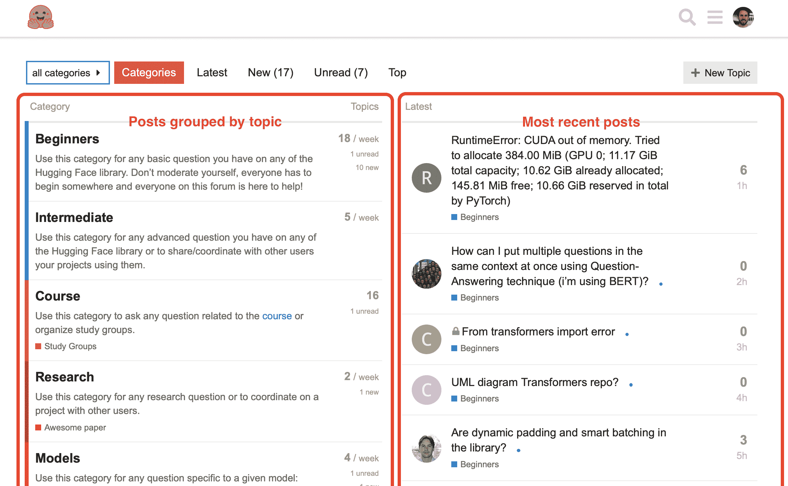
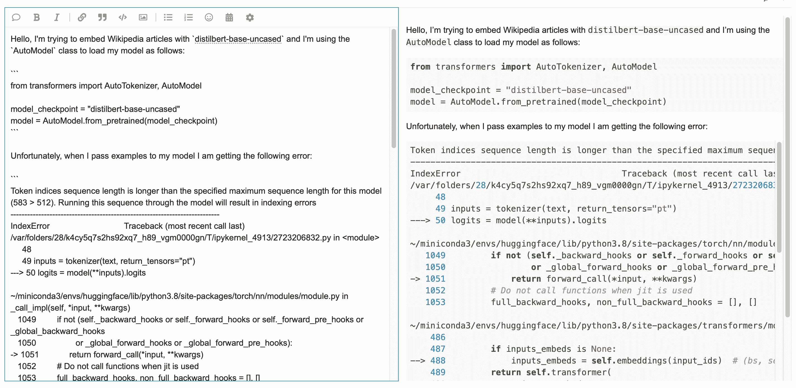
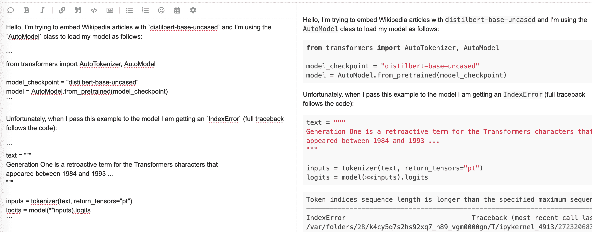

# 在论坛上寻求帮助

> 原文：[`huggingface.co/learn/nlp-course/zh-CN/chapter8/3?fw=pt`](https://huggingface.co/learn/nlp-course/zh-CN/chapter8/3?fw=pt)

               

[`www.youtube-nocookie.com/embed/S2EEG3JIt2A`](https://www.youtube-nocookie.com/embed/S2EEG3JIt2A)

[Hugging Face 论坛](https://discuss.huggingface.co) 是从开源团队和更广泛的 Hugging Face 社区获得帮助的好地方。以下是论坛某一天的主页面：



在左侧，您可以看到各种主题分组的所有类别，而右侧显示了最新的主题。主题是包含标题、类别和描述的帖子；它与我们在创建自己的数据集时看到的 GitHub 问题格式非常相似 Chapter 5.顾名思义，[Beginners](https://discuss.huggingface.co/c/beginners/5)类别主要面向刚开始使用 Hugging Face 库和生态系统的人。欢迎对任何库提出任何问题，无论是调试一些代码还是寻求有关如何做某事的帮助。 （也就是说，如果您的问题特别涉及某个图书馆，您可能应该前往论坛上的相应图书馆类别。）

同样，the [Intermediate](https://discuss.huggingface.co/c/intermediate/6)和[Research](https://discuss.huggingface.co/c/research/7)类别用于更高级的问题，例如关于图书馆或您想讨论的一些很酷的新 NLP 研究。

当然，我们也应该提到[Course](https://discuss.huggingface.co/c/course/20)类别，您可以在其中提出与 Hugging Face 课程相关的任何问题！

选择类别后，您就可以编写第一个主题了。 你可以找一些[guidelines](https://discuss.huggingface.co/t/how-to-request-support/3128) 在有关如何执行此操作的论坛中，在本节中，我们将看看构成一个好的主题的一些功能。

## 写一篇好的论坛帖子

作为一个运行示例，假设我们试图从 Wikipedia 文章生成嵌入表示以创建自定义搜索引擎。像往常一样，我们按如下方式加载分词器和模型：

```py
from transformers import AutoTokenizer, AutoModel

model_checkpoint = "distilbert-base-uncased"
tokenizer = AutoTokenizer.from_pretrained(model_checkpoint)
model = AutoModel.from_pretrained(model_checkpoint)
```

现在我们尝试将[变形金刚的维基百科](https://en.wikipedia.org/wiki/Transformers)的一整段进行嵌入表示（热知识：变形金刚的英文就是 Transformers ，而现在 Transformers 作为一个 🤗 Python 库也被越来越多人熟知）：

```py
text = """
Generation One is a retroactive term for the Transformers characters that
appeared between 1984 and 1993\. The Transformers began with the 1980s Japanese
toy lines Micro Change and Diaclone. They presented robots able to transform
into everyday vehicles, electronic items or weapons. Hasbro bought the Micro
Change and Diaclone toys, and partnered with Takara. Marvel Comics was hired by
Hasbro to create the backstory; editor-in-chief Jim Shooter wrote an overall
story, and gave the task of creating the characthers to writer Dennis O'Neil.
Unhappy with O'Neil's work (although O'Neil created the name "Optimus Prime"),
Shooter chose Bob Budiansky to create the characters.

The Transformers mecha were largely designed by Shōji Kawamori, the creator of
the Japanese mecha anime franchise Macross (which was adapted into the Robotech
franchise in North America). Kawamori came up with the idea of transforming
mechs while working on the Diaclone and Macross franchises in the early 1980s
(such as the VF-1 Valkyrie in Macross and Robotech), with his Diaclone mechs
later providing the basis for Transformers.

The primary concept of Generation One is that the heroic Optimus Prime, the
villainous Megatron, and their finest soldiers crash land on pre-historic Earth
in the Ark and the Nemesis before awakening in 1985, Cybertron hurtling through
the Neutral zone as an effect of the war. The Marvel comic was originally part
of the main Marvel Universe, with appearances from Spider-Man and Nick Fury,
plus some cameos, as well as a visit to the Savage Land.

The Transformers TV series began around the same time. Produced by Sunbow
Productions and Marvel Productions, later Hasbro Productions, from the start it
contradicted Budiansky's backstories. The TV series shows the Autobots looking
for new energy sources, and crash landing as the Decepticons attack. Marvel
interpreted the Autobots as destroying a rogue asteroid approaching Cybertron.
Shockwave is loyal to Megatron in the TV series, keeping Cybertron in a
stalemate during his absence, but in the comic book he attempts to take command
of the Decepticons. The TV series would also differ wildly from the origins
Budiansky had created for the Dinobots, the Decepticon turned Autobot Jetfire
(known as Skyfire on TV), the Constructicons (who combine to form
Devastator),[19][20] and Omega Supreme. The Marvel comic establishes early on
that Prime wields the Creation Matrix, which gives life to machines. In the
second season, the two-part episode The Key to Vector Sigma introduced the
ancient Vector Sigma computer, which served the same original purpose as the
Creation Matrix (giving life to Transformers), and its guardian Alpha Trion.
"""

inputs = tokenizer(text, return_tensors="pt")
logits = model(**inputs).logits
```

```py
IndexError: index out of range in self
```

呃，我们遇到了一个问题——错误信息比我们看到的要神秘得多 section 2!我们无法确定完整回溯的正面或反面，因此我们决定转向 Hugging Face 论坛寻求帮助。我们如何设计主题？

首先，我们需要点击右上角的“新建主题”按钮（注意，要创建主题，我们需要登录）：


这会出现一个写作界面，我们可以在其中输入我们的主题标题，选择一个类别，并起草内容：


由于错误似乎仅与 🤗 Transformers 有关，因此我们将为该类别选择此错误。我们第一次尝试解释这个问题可能看起来像这样：


尽管本主题包含我们需要帮助的错误消息，但其编写方式存在一些问题：

1.  标题描述性不是很强，因此浏览论坛的任何人都无法在不阅读正文的情况下分辨出主题的内容。

2.  正文没有提供足够的信息，说明错误来自何处以及如何重现错误。

3.  这个话题直接用一种有点苛刻的语气标记了几个人。

像这样的主题不太可能很快得到答案（如果他们得到了答案），那么让我们看看如何改进它。我们将从选择一个好标题的第一个问题开始。

### 选择描述性标题

如果您想就代码中的错误寻求帮助，一个好的经验法则是在标题中包含足够的信息，以便其他人可以快速确定他们是否认为他们可以回答您的问题。在我们的运行示例中，我们知道正在引发的异常的名称，并有一些提示它是在模型的前向传递中触发的，我们调用 **model(**inputs)** .为了传达这一点，一个可能的标题可能是：

> 自动建模正向传递中的索引错误的来源？

这个标题告诉读者在哪里你认为错误来自，如果他们遇到了 **IndexError** 在此之前，他们很有可能知道如何调试它。当然，标题可以是您想要的任何内容，也可以是其他变体，例如：

> 为什么我的模型会产生索引错误？

也可以。现在我们有了一个描述性的标题，让我们来看看改善主体。

### 设置代码段的格式

如：也可以。现在我们有了一个描述性的标题，让我们来看看改善身体。在 IDE 中阅读源代码已经够难的了，但是当将代码复制粘贴为纯文本时就更难了！幸运的是，Hugging Face 论坛支持使用 Markdown，因此您应该始终用三个反引号 (```) 将代码块括起来，以便更容易阅读。让我们这样做来美化错误消息——在我们这样做的时候，让我们让正文比我们的原始版本更有礼貌：


正如您在屏幕截图中看到的，将代码块括在反引号中会将原始文本转换为格式化代码，并带有颜色样式！另请注意，单个反引号可用于格式化内联变量，就像我们所做的那样 **distilbert-base-uncased** .这个主题看起来好多了，如果幸运的话，我们可能会在社区中找到可以猜测错误是什么的人。然而，与其依靠运气，不如让我们在其完整的血腥细节中包含回溯，让生活更轻松！

### 包括完整的回溯

由于回溯的最后一行通常足以调试您自己的代码，因此很容易在您的主题中提供它以“节省空间”。虽然本意是好的，但这实际上使它更难供其他人调试问题，因为回溯中较高的信息也非常有用。因此，一个好的做法是复制并粘贴所有的回溯，同时确保它的格式很好。由于这些回溯可能会很长，有些人更喜欢在解释了源代码之后再展示它们。我们开工吧。现在，我们的论坛主题如下所示：



这提供了更多信息，细心的读者可能会指出问题似乎是由于回溯中的这一行而传递了一个长输入：

> 令牌索引序列长度长于为此模型指定的最大序列长度 （583 > 512）。

但是，通过提供触发错误的实际代码，我们可以让他们更轻松。我们现在就这样做。

### 提供可重复的示例

如果您曾经尝试过调试其他人的代码，那么您可能首先尝试重现他们报告的问题，以便您可以开始通过回溯来查明错误。在论坛上获得（或提供）帮助时没有什么不同，所以如果你能提供一个重现错误的小例子真的很有帮助。有一半的时间，简单地完成这个练习将帮助你找出问题所在。在任何情况下，我们的示例缺少的部分是显示输入我们提供给模型的。这样做会为我们提供类似于以下完整示例的内容：



该主题现在包含相当多的信息，并且它的编写方式更可能吸引社区的注意力并获得有用的答案。有了这些基本指南，您现在可以创建很棒的主题来找到您的 🤗 Transformers 问题的答案！