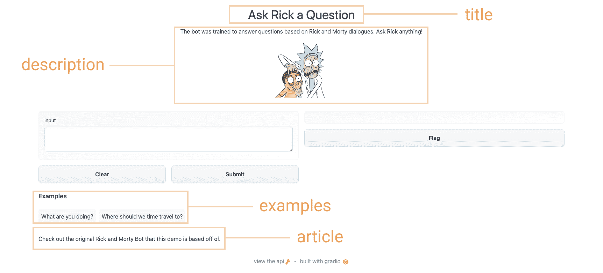
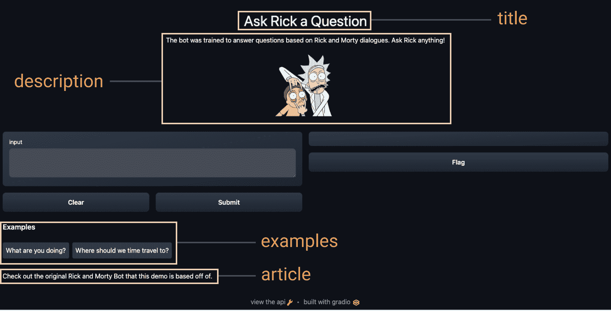

# 与他人分享演示

> 原文：[`huggingface.co/learn/nlp-course/zh-CN/chapter9/4?fw=pt`](https://huggingface.co/learn/nlp-course/zh-CN/chapter9/4?fw=pt)

               

现在您已经构建了一个演示，您可能希望与其他人分享它。 梯度演示 可以通过两种方式共享：使用 ***temporary share link*** 或 ***permanent hosting on Spaces***。

我们将很快介绍这两种方法。 但在分享演示之前，您可能需要完善它 💅.

### 打磨你的 Gradio 演示:

 

为了给你的演示添加额外的内容，`Interface` 类支持一些可选参数：

*   `title`：你可以给你的演示一个标题，它出现在输入和输出组件的上方。
*   `description`：您可以为界面提供描述（文本、Markdown 或 HTML），显示在输入和输出组件的上方和标题下方。
*   `article`：您还可以编写扩展文章（文本、Markdown 或 HTML）来解释界面。如果提供，它会出现在输入和输出组件的 _ 下方。
*   `theme`：不喜欢默认颜色？将主题设置为使用 `default`、`huggingface`、`grass`、`peach` 之一。您还可以添加 `dark-` 前缀，例如`dark-peach` 用于深色主题（或者只是 `dark` 用于默认的深色主题）。
*   `examples`：为了让您的演示*更易于使用*，您可以为函数提供一些示例输入。它们出现在 UI 组件下方，可用于填充界面。这些应该作为嵌套列表提供，其中外部列表​​由样本组成，每个内部列表对应于每个输入组件的输入组成。
*   `live`：如果你想让你的演示“活”，这意味着你的模型每次输入更改时都会重新运行，你可以设置 `live=True`。这对使用快速模型很有意义（我们将在本节末尾看到一个示例） 使用上面的选项，我们最终得到了一个更完整的界面。 运行下面的代码，以便与 Rick and Morty 聊天：

```py
title = "Ask Rick a Question"
description = """
The bot was trained to answer questions based on Rick and Morty dialogues. Ask Rick anything!

"""

article = "Check out [the original Rick and Morty Bot](https://huggingface.co/spaces/kingabzpro/Rick_and_Morty_Bot) that this demo is based off of."

gr.Interface(
    fn=predict,
    inputs="textbox",
    outputs="text",
    title=title,
    description=description,
    article=article,
    examples=[["What are you doing?"], ["Where should we time travel to?"]],
).launch()
```

使用上面的选项，我们最终得到了一个更完整的界面。 试试下面的界面：

[`course-demos-Rick-and-Morty-QA.hf.space`](https://course-demos-Rick-and-Morty-QA.hf.space)

### 使用临时链接分享您的演示

现在我们已经有了机器学习模型的工作演示，让我们学习如何轻松共享指向我们界面的链接。 通过在 `launch()` 方法中设置 `share=True` 可以轻松地公开共享接口：

```py
gr.Interface(classify_image, "image", "label").launch(share=True)
```

这会生成一个公开的、可共享的链接，您可以将其发送给任何人！ 当您发送此链接时，另一方的用户可以在浏览器中试用该模型长达 72 小时。 因为处理发生在您的设备上（只要您的设备保持开启！），您不必担心打包任何依赖项。 如果您使用 Google Colab 笔记本工作，则始终会自动创建共享链接。 它通常看起来像这样：**XXXXX.gradio.app**。 虽然链接是通过 Gradio 链接提供的，但我们只是您本地服务器的代理，不会存储通过接口发送的任何数据。

但是请记住，这些链接是可公开访问的，这意味着任何人都可以使用您的模型进行预测！ 因此，请确保不要通过您编写的函数公开任何敏感信息，或允许在您的设备上发生任何关键更改。 如果设置 `share=False`（默认值），则仅创建本地链接。

### 在 Hugging Face Spaces 上托管您的演示

可以传递给同事的共享链接很酷，但是如何永久托管您的演示并让它存在于互联网上自己的“空间”中？

Hugging Face Spaces 提供了在互联网上永久托管 Gradio 模型的基础设施，**免费**！ Spaces 允许您创建并推送到（公共或私人）存储库， 你的 Gradio 在哪里 接口代码将存在于 `app.py` 文件中。 [阅读分步教程](https://huggingface.co/blog/gradio-spaces) 开始使用，或观看下面的示例视频。

[`www.youtube-nocookie.com/embed/LS9Y2wDVI0k`](https://www.youtube-nocookie.com/embed/LS9Y2wDVI0k)

## ✏️ 让我们应用它!

使用到目前为止我们在各节中学到的知识，让我们创建我们在本章第一节中看到的草图识别演示。 让我们为我们的界面添加一些自定义并设置 `share=True` 以创建一个我们可以传递的公共链接。

我们可以从 [class_names.txt](https://huggingface.co/spaces/dawood/Sketch-Recognition/blob/main/class_names.txt) 加载标签，并从 [pytorch_model.bin](https://huggingface.co/spaces/dawood/Sketch-Recognition/blob/main/pytorch_model.bin)加载预训练的 pytorch 模型 。 通过点击链接并单击文件预览左上角的下载来下载这些文件。 让我们看看下面的代码，看看我们如何使用这些文件来加载我们的模型并创建一个`predict()`函数：

```py
from pathlib import Path
import torch
import gradio as gr
from torch import nn

LABELS = Path("class_names.txt").read_text().splitlines()

model = nn.Sequential(
    nn.Conv2d(1, 32, 3, padding="same"),
    nn.ReLU(),
    nn.MaxPool2d(2),
    nn.Conv2d(32, 64, 3, padding="same"),
    nn.ReLU(),
    nn.MaxPool2d(2),
    nn.Conv2d(64, 128, 3, padding="same"),
    nn.ReLU(),
    nn.MaxPool2d(2),
    nn.Flatten(),
    nn.Linear(1152, 256),
    nn.ReLU(),
    nn.Linear(256, len(LABELS)),
)
state_dict = torch.load("pytorch_model.bin", map_location="cpu")
model.load_state_dict(state_dict, strict=False)
model.eval()

def predict(im):
    x = torch.tensor(im, dtype=torch.float32).unsqueeze(0).unsqueeze(0) / 255.0
    with torch.no_grad():
        out = model(x)
    probabilities = torch.nn.functional.softmax(out[0], dim=0)
    values, indices = torch.topk(probabilities, 5)
    return {LABELS[i]: v.item() for i, v in zip(indices, values)}
```

现在我们有了一个`predict()`函数。 下一步是定义并启动我们的渐变界面：

```py
interface = gr.Interface(
    predict,
    inputs="sketchpad",
    outputs="label",
    theme="huggingface",
    title="Sketch Recognition",
    description="Who wants to play Pictionary? Draw a common object like a shovel or a laptop, and the algorithm will guess in real time!",
    article="<p style='text-align: center'>Sketch Recognition | Demo Model</p>",
    live=True,
)
interface.launch(share=True)
```

[`course-demos-Sketch-Recognition.hf.space`](https://course-demos-Sketch-Recognition.hf.space)

注意 `Interface` 中的 `live=True` 参数，这意味着草图演示使 每次有人在画板上画画时的预测（没有提交按钮！）。

此外，我们还在 `launch()` 方法中设置了 `share=True` 参数。 这将创建一个公共链接，您可以发送给任何人！ 当您发送此链接时，对方的用户可以尝试草图识别模型。 重申一下，您还可以在 Hugging Face Spaces 上托管模型，这就是我们能够嵌入上面的演示的方式。

接下来，我们将介绍 Gradio 可用于 Hugging Face 生态系统的其他方式！