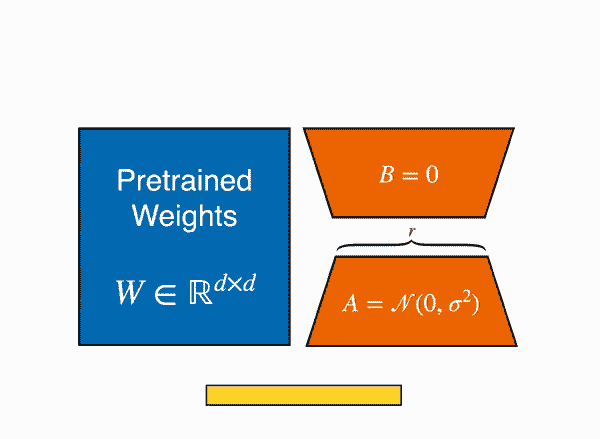
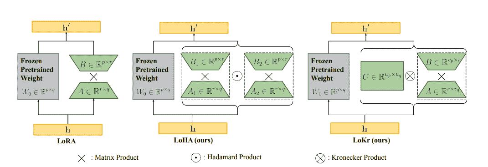

# 适配器

> 原文链接：[`huggingface.co/docs/peft/conceptual_guides/adapter`](https://huggingface.co/docs/peft/conceptual_guides/adapter)

基于适配器的方法在冻结的预训练模型的注意力和全连接层之后添加额外的可训练参数，以减少内存使用量并加快训练速度。适配器的方法因适配器而异，它可能只是添加一个额外的层，也可能将权重更新∆W 表示为权重矩阵的低秩分解。无论如何，适配器通常很小，但表现与完全微调模型相当，并且使得用更少资源训练更大模型成为可能。

本指南将简要介绍 PEFT 支持的适配器方法（如果您对学习特定方法的更多细节感兴趣，请查看链接的论文）。

## 低秩适应（LoRA）

LoRA 是最受欢迎的 PEFT 方法之一，如果您刚开始使用 PEFT，这是一个很好的起点。最初是为大型语言模型开发的，但由于其效率和有效性，它成为扩散模型的非常流行的训练方法。

如前面简要提到的，[LoRA](https://hf.co/papers/2106.09685)是一种加速微调大型模型的技术，同时消耗更少内存。

LoRA 通过低秩分解用两个较小的矩阵（称为*更新矩阵*）表示权重更新∆W。这些新矩阵可以训练以适应新数据，同时保持总参数数量较低。原始权重矩阵保持冻结，不再接收任何更新。为了生成最终结果，将原始和额外适应的权重组合在一起。您还可以将适配器权重与基础模型合并，以消除推理延迟。

这种方法有许多优点：

+   LoRA 通过大幅减少可训练参数的数量，使微调更加高效。

+   原始的预训练权重保持冻结，这意味着您可以基于它们构建多个轻量且便携的 LoRA 模型，用于各种下游任务。

+   LoRA 与其他参数高效方法正交，并且可以与许多方法结合使用。

+   使用 LoRA 微调的模型的性能与完全微调模型的性能相当。

原则上，LoRA 可以应用于神经网络中的任何权重矩阵子集，以减少可训练参数的数量。但是，为了简单起见和进一步的参数效率，LoRA 通常仅应用于 Transformer 模型中的注意力块。LoRA 模型中的可训练参数数量取决于更新矩阵的大小，主要由秩`r`和原始权重矩阵的形状确定。

[导航文本到图像定制：从 LyCORIS 微调到模型评估](https://hf.co/papers/2103.10385)

## 低秩 Hadamard 乘积（LoHa）

低秩分解可能会影响性能，因为权重更新受限于低秩空间，这可能会限制模型的表达能力。但是，您不一定希望使用更大的秩，因为这会增加可训练参数的数量。为了解决这个问题，[LoHa](https://huggingface.co/papers/2108.06098)（最初为计算机视觉开发的方法）被应用于扩散模型，其中生成多样化图像的能力是一个重要考虑因素。LoHa 也应该适用于一般的模型类型，但嵌入层目前尚未在 PEFT 中实现。

LoHa 使用[Hadamard 乘积](https://en.wikipedia.org/wiki/Hadamard_product_(matrices))（逐元素乘积）代替矩阵乘积。∆W 由四个较小的矩阵代替两个 - 就像在 LoRA 中一样 - 每对这些低秩矩阵通过 Hadamard 乘积组合。因此，∆W 可以具有相同数量的可训练参数，但具有更高的秩和表达能力。

## 低秩 Kronecker 乘积（LoKr）

[LoKr](https://hf.co/papers/2309.14859)与 LoRA 和 LoHa 非常相似，主要应用于扩散模型，尽管您也可以将其用于其他模型类型。LoKr 将矩阵乘积替换为[Kronecker 乘积](https://en.wikipedia.org/wiki/Kronecker_product)。Kronecker 乘积分解创建一个保留原始权重矩阵秩的块矩阵。Kronecker 乘积的另一个好处是可以通过堆叠矩阵列来向量化。这可以加快过程，因为您避免了完全重建∆W。

## 正交微调（OFT）

[通过正交微调控制文本到图像扩散](https://hf.co/papers/2306.07280)

OFT 是一种主要关注在微调模型中保留预训练模型生成性能的方法。它试图保持层中所有成对神经元之间的余弦相似度（超球能量）相同，因为这更好地捕捉神经元之间的语义信息。这意味着 OFT 更擅长保留主题，对于可控生成更好（类似于[ControlNet](https://huggingface.co/docs/diffusers/using-diffusers/controlnet)）。

OFT 通过学习一个正交变换来保持神经元之间的余弦相似度不变来保留超球能量。在实践中，这意味着使用正交矩阵与预训练权重矩阵的矩阵乘积。然而，为了参数高效，正交矩阵被表示为具有秩`r`块的块对角矩阵。LoRA 通过低秩结构减少可训练参数的数量，OFT 通过稀疏块对角矩阵结构减少可训练参数的数量。

## 自适应低秩适应（AdaLoRA）

[AdaLoRA](https://hf.co/papers/2303.10512)通过为更适合任务的重要权重矩阵分配更多参数（即更高的秩`r`），管理 LoRA 引入的参数预算，并修剪不太重要的权重矩阵。秩由类似于奇异值分解（SVD）的方法控制。∆W 由两个正交矩阵和一个包含奇异值的对角矩阵参数化。这种参数化方法避免了计算昂贵的迭代应用 SVD。根据这种方法，根据重要性评分调整∆W 的秩。∆W 被分成三元组，每个三元组根据其对模型性能的贡献进行评分。重要性评分低的三元组被修剪，重要性评分高的三元组被保留用于微调。

## Llama-Adapter

[Llama-Adapter](https://hf.co/papers/2303.16199)是一种将 Llama 调整为指令跟踪模型的方法。为了帮助调整模型以进行指令跟踪，适配器使用了一个包含 52K 个指令-输出数据集的训练。

一组可学习的适应提示被添加到输入指令标记之前。这些提示被插入到模型的上层，因为最好使用预训练模型的更高级语义进行学习。添加到输入的指令-输出标记引导适应提示生成上下文响应。

[LLaMA-Adapter：使用零初始化注意力高效微调语言模型](https://hf.co/papers/2303.16199)

为了避免向标记添加噪音，适配器使用零初始化的注意力。除此之外，适配器还添加了一个可学习的门控因子（初始化为零），在训练过程中逐渐向模型添加信息。这可以防止新学习的指令过多地压倒模型的预训练知识。
