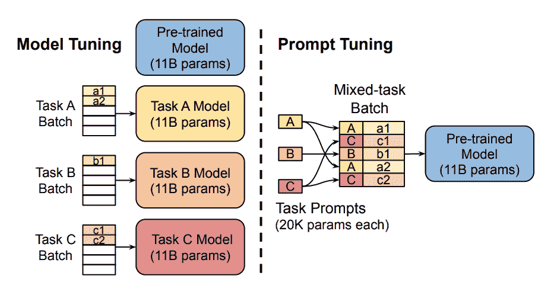
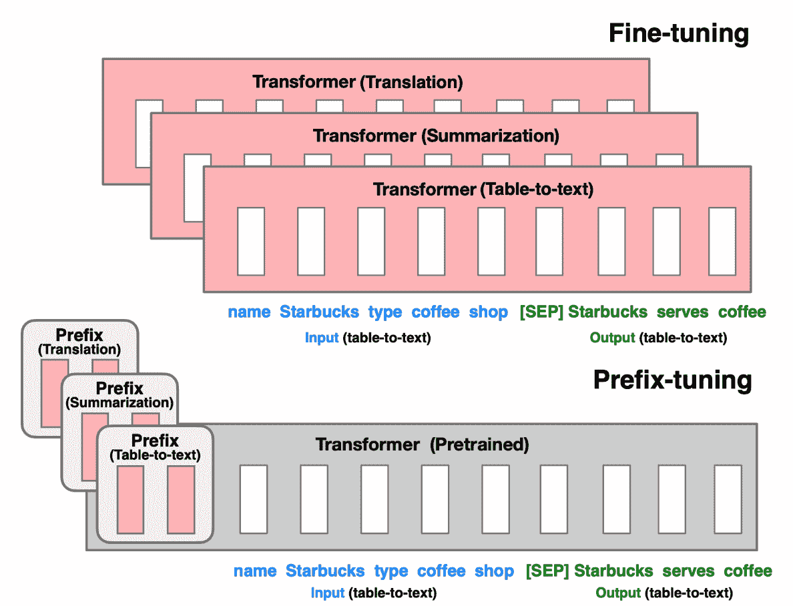
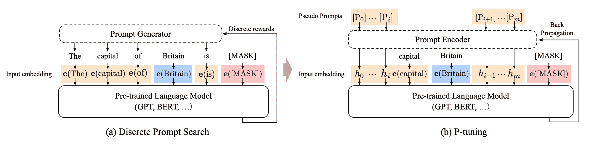
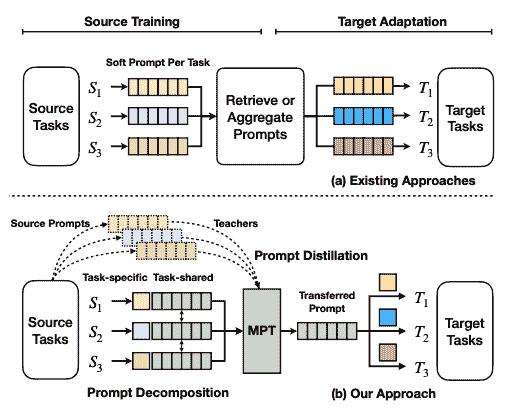
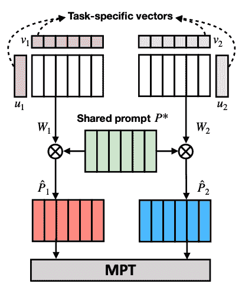

# 软提示

> 原文链接：[`huggingface.co/docs/peft/conceptual_guides/prompting`](https://huggingface.co/docs/peft/conceptual_guides/prompting)

训练大型预训练语言模型非常耗时和计算密集。随着它们不断增大，人们对更高效的训练方法（如*提示*）越来越感兴趣。提示通过包含描述任务或甚至演示任务示例的文本提示来为特定下游任务准备一个冻结的预训练模型。通过提示，您可以避免为每个下游任务完全训练一个单独的模型，而是使用相同的冻结的预训练模型。这样做更容易，因为您可以为多个不同任务使用相同的模型，并且训练和存储一小组提示参数要比训练所有模型参数要高效得多。

提示方法有两类：

+   硬提示是手工制作的具有离散输入标记的文本提示；缺点是需要大量努力来创建一个好的提示

+   软提示是可学习的张量，与输入嵌入连接在一起，可以优化到数据集；缺点是它们不易阅读，因为你没有将这些“虚拟标记”与真实单词的嵌入匹配起来

这个概念指南提供了包含在🤗 PEFT 中的软提示方法的简要概述：提示调整，前缀调整，P 调整和多任务提示调整。

## 提示调整

只训练和存储一组显著较小的任务特定提示参数[(图片来源)](https://hf.co/papers/2104.08691)。

[提示调整](https://hf.co/papers/2104.08691)是为 T5 模型上的文本分类任务开发的，所有下游任务都被视为文本生成任务。例如，序列分类通常将单个类标签分配给一系列文本。通过将其视为文本生成任务，构成类标签的标记被*生成*。提示被添加到输入中作为一系列标记。通常，模型参数是固定的，这意味着提示标记也由模型参数固定。

提示调整的关键思想是提示标记有自己的参数，这些参数是独立更新的。这意味着您可以保持预训练模型的参数冻结，只更新提示标记嵌入的梯度。结果与传统的训练整个模型的方法相当，提示调整的性能随着模型大小的增加而提高。

查看因果语言建模的提示调整以了解如何使用提示调整训练模型的逐步指南。

## 前缀调整

为每个任务优化前缀参数[(图片来源)](https://hf.co/papers/2101.00190)。

[前缀调整](https://hf.co/papers/2101.00190)是为 GPT 模型上的自然语言生成（NLG）任务设计的。它与提示调整非常相似；前缀调整还在输入之前添加了一系列任务特定向量，可以在保持其余预训练模型参数冻结的同时进行训练和更新。

主要区别在于前缀参数插入在**所有**模型层中，而提示调整仅将提示参数添加到模型输入嵌入中。前缀参数也通过单独的前馈网络（FFN）进行优化，而不是直接在软提示上进行训练，因为这会导致不稳定性并影响性能。在更新软提示后，FFN 被丢弃。

因此，作者发现前缀调整表现与完全微调模型相当，尽管参数少了 1000 倍，而且在低数据情况下表现得更好。

查看条件生成的前缀调整以了解如何使用前缀调整训练模型的逐步指南。

## P-tuning

提示标记可以插入输入序列的任何位置，并通过提示编码器进行优化[(图片来源)](https://hf.co/papers/2103.10385)。

[P-tuning](https://hf.co/papers/2103.10385)设计用于自然语言理解（NLU）任务和所有语言模型。这是软提示方法的另一种变体；P-tuning 还添加了一个可训练的嵌入张量，可以优化以找到更好的提示，并使用提示编码器（双向长短期记忆网络或 LSTM）来优化提示参数。不过，与前缀调整不同：

+   提示标记可以插入输入序列的任何位置，不仅限于开头

+   提示标记仅添加到输入中，而不是添加到模型的每一层。

+   引入*锚*标记可以提高性能，因为它们指示输入序列中组件的特征

结果表明，P-tuning 比手动制作提示更有效，并使类似 GPT 的模型能够在 NLU 任务上与类似 BERT 的模型竞争。

查看用于序列分类的 P-tuning 以了解如何使用 P-tuning 训练模型的逐步指南。

## 多任务提示调整

[多任务提示调整实现参数高效的迁移学习](https://hf.co/papers/2103.10385)。

[多任务提示调整（MPT）](https://hf.co/papers/2103.10385)从数据中为多种任务类型学习单个提示，可以共享给不同的目标任务。其他现有方法学习为每个任务单独的软提示，需要检索或聚合以适应目标任务。MPT 包括两个阶段：

1.  源训练 - 对于每个任务，其软提示被分解为特定于任务的向量。这些特定于任务的向量相乘形成另一个矩阵 W，并且在 W 和共享提示矩阵 P 之间使用 Hadamard 乘积生成特定于任务的提示矩阵。特定于任务的提示被提炼成一个在所有任务中共享的单个提示矩阵。这个提示通过多任务训练进行训练。

1.  目标适应 - 为了使单个提示适应目标任务，初始化目标提示并将其表示为共享提示矩阵和特定于任务的低秩提示矩阵的 Hadamard 乘积。

[提示分解](https://hf.co/papers/2103.10385)。
