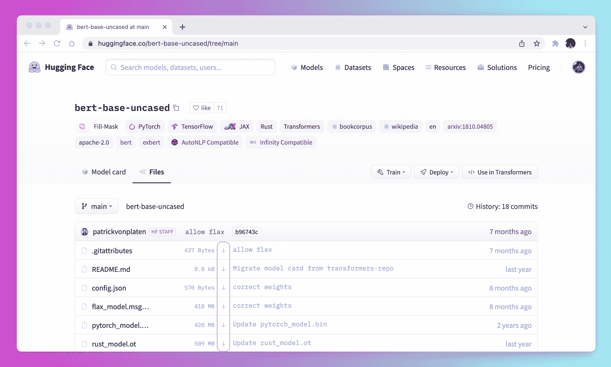

# 安装

> 原文：[`huggingface.co/docs/transformers/v4.37.2/en/installation`](https://huggingface.co/docs/transformers/v4.37.2/en/installation)

为您正在使用的任何深度学习库安装🤗 Transformers，设置您的缓存，并可选择配置🤗 Transformers 以离线运行。

🤗 Transformers 在 Python 3.6+、PyTorch 1.1.0+、TensorFlow 2.0+和 Flax 上进行了测试。按照下面的安装说明为您正在使用的深度学习库安装：

+   [PyTorch](https://pytorch.org/get-started/locally/)安装说明。

+   [TensorFlow 2.0](https://www.tensorflow.org/install/pip)安装说明。

+   [Flax](https://flax.readthedocs.io/en/latest/)安装说明。

## 使用 pip 安装

您应该在[virtual environment](https://docs.python.org/3/library/venv.html)中安装🤗 Transformers。如果您不熟悉 Python 虚拟环境，请查看这个[guide](https://packaging.python.org/guides/installing-using-pip-and-virtual-environments/)。虚拟环境使得管理不同项目更容易，并避免依赖项之间的兼容性问题。

首先在项目目录中创建一个虚拟环境：

```py
python -m venv .env
```

激活虚拟环境。在 Linux 和 MacOs 上：

```py
source .env/bin/activate
```

在 Windows 上激活虚拟环境

```py
.env/Scripts/activate
```

现在您可以使用以下命令安装🤗 Transformers：

```py
pip install transformers
```

仅支持 CPU 的情况下，您可以方便地在一行中安装🤗 Transformers 和一个深度学习库。例如，使用以下命令安装🤗 Transformers 和 PyTorch：

```py
pip install 'transformers[torch]'
```

🤗 Transformers 和 TensorFlow 2.0：

```py
pip install 'transformers[tf-cpu]'
```

M1 / ARM 用户

在安装 TensorFLow 2.0 之前，您需要安装以下内容

```py
brew install cmake
brew install pkg-config
```

🤗 Transformers 和 Flax：

```py
pip install 'transformers[flax]'
```

最后，通过运行以下命令检查🤗 Transformers 是否已正确安装。它将下载一个预训练模型：

```py
python -c "from transformers import pipeline; print(pipeline('sentiment-analysis')('we love you'))"
```

然后打印标签和分数：

```py
[{'label': 'POSITIVE', 'score': 0.9998704791069031}]
```

## 从源代码安装

使用以下命令从源代码安装🤗 Transformers：

```py
pip install git+https://github.com/huggingface/transformers
```

此命令安装最新的`stable`版本而不是最新的`main`版本。`main`版本对于保持与最新发展保持最新是有用的。例如，如果自上次官方发布以来修复了错误但尚未推出新版本。但是，这意味着`main`版本可能不总是稳定的。我们努力保持`main`版本的运行，并且大多数问题通常在几个小时或一天内解决。如果遇到问题，请打开一个[Issue](https://github.com/huggingface/transformers/issues)，以便我们更快地解决！

通过运行以下命令检查🤗 Transformers 是否已正确安装：

```py
python -c "from transformers import pipeline; print(pipeline('sentiment-analysis')('I love you'))"
```

## 可编辑安装

如果您想要，您将需要一个可编辑的安装：

+   使用源代码的`main`版本。

+   为🤗 Transformers 做出贡献并需要测试代码更改。

克隆存储库并使用以下命令安装🤗 Transformers：

```py
git clone https://github.com/huggingface/transformers.git
cd transformers
pip install -e .
```

这些命令将链接您克隆存储库的文件夹和您的 Python 库路径。现在 Python 将在您克隆到的文件夹中查找，除了正常的库路径。例如，如果您的 Python 包通常安装在`~/anaconda3/envs/main/lib/python3.7/site-packages/`中，Python 还将搜索您克隆到的文件夹：`~/transformers/`。

如果要继续使用该库，必须保留`transformers`文件夹。

现在您可以使用以下命令轻松将克隆更新到最新版本的🤗 Transformers：

```py
cd ~/transformers/
git pull
```

您的 Python 环境将在下一次运行时找到🤗 Transformers 的`main`版本。

## 使用 conda 安装

从 conda 频道`conda-forge`安装：

```py
conda install conda-forge::transformers
```

## 缓存设置

预训练模型将被下载并在`~/.cache/huggingface/hub`中本地缓存。这是由 shell 环境变量`TRANSFORMERS_CACHE`给出的默认目录。在 Windows 上，默认目录由`C:\Users\username\.cache\huggingface\hub`给出。您可以更改下面显示的 shell 环境变量 - 以优先顺序列出 - 以指定不同的缓存目录：

1.  Shell 环境变量（默认）：`HUGGINGFACE_HUB_CACHE`或`TRANSFORMERS_CACHE`。

1.  Shell 环境变量：`HF_HOME`。

1.  Shell 环境变量：`XDG_CACHE_HOME` + `/huggingface`。

🤗 Transformers 将使用 shell 环境变量`PYTORCH_TRANSFORMERS_CACHE`或`PYTORCH_PRETRAINED_BERT_CACHE`，如果您来自此库的早期版本并设置了这些环境变量，除非您指定 shell 环境变量`TRANSFORMERS_CACHE`。

## 离线模式

通过设置环境变量`TRANSFORMERS_OFFLINE=1`在防火墙或离线环境中运行🤗 Transformers，并使用本地缓存文件。

通过环境变量`HF_DATASETS_OFFLINE=1`将[🤗 Datasets](https://huggingface.co/docs/datasets/)添加到您的离线训练工作流程。

```py
HF_DATASETS_OFFLINE=1 TRANSFORMERS_OFFLINE=1 \
python examples/pytorch/translation/run_translation.py --model_name_or_path t5-small --dataset_name wmt16 --dataset_config ro-en ...
```

此脚本应该可以在不挂起或等待超时的情况下运行，因为它不会尝试从 Hub 下载模型。

您还可以通过`local_files_only`参数在每个 from_pretrained()调用中绕过从 Hub 加载模型。当设置为`True`时，只加载本地文件：

```py
from transformers import T5Model

model = T5Model.from_pretrained("./path/to/local/directory", local_files_only=True)
```

### 获取模型和分词器以离线使用

另一种离线使用🤗 Transformers 的选项是提前下载文件，然后在需要离线使用时指向它们的本地路径。有三种方法可以做到这一点：

+   通过点击↓图标在[Model Hub](https://huggingface.co/models)上的用户界面下载文件。

    

+   使用 PreTrainedModel.from_pretrained()和 PreTrainedModel.save_pretrained()工作流程：

    1.  使用 PreTrainedModel.from_pretrained()提前下载您的文件：

        ```py
        >>> from transformers import AutoTokenizer, AutoModelForSeq2SeqLM

        >>> tokenizer = AutoTokenizer.from_pretrained("bigscience/T0_3B")
        >>> model = AutoModelForSeq2SeqLM.from_pretrained("bigscience/T0_3B")
        ```

    1.  使用 PreTrainedModel.save_pretrained()将文件保存到指定目录：

        ```py
        >>> tokenizer.save_pretrained("./your/path/bigscience_t0")
        >>> model.save_pretrained("./your/path/bigscience_t0")
        ```

    1.  现在当您离线时，通过从指定目录重新加载您的文件使用 PreTrainedModel.from_pretrained()：

        ```py
        >>> tokenizer = AutoTokenizer.from_pretrained("./your/path/bigscience_t0")
        >>> model = AutoModel.from_pretrained("./your/path/bigscience_t0")
        ```

+   使用[huggingface_hub](https://github.com/huggingface/huggingface_hub/tree/main/src/huggingface_hub)库以编程方式下载文件：

    1.  在您的虚拟环境中安装`huggingface_hub`库：

        ```py
        python -m pip install huggingface_hub
        ```

    1.  使用[`hf_hub_download`](https://huggingface.co/docs/hub/adding-a-library#download-files-from-the-hub)函数将文件下载到特定路径。例如，以下命令将从[T0](https://huggingface.co/bigscience/T0_3B)模型下载`config.json`文件到您想要的路径：

        ```py
        >>> from huggingface_hub import hf_hub_download

        >>> hf_hub_download(repo_id="bigscience/T0_3B", filename="config.json", cache_dir="./your/path/bigscience_t0")
        ```

一旦您的文件被下载并本地缓存，指定它的本地路径以加载和使用它：

```py
>>> from transformers import AutoConfig

>>> config = AutoConfig.from_pretrained("./your/path/bigscience_t0/config.json")
```

查看[如何从 Hub 下载文件](https://huggingface.co/docs/hub/how-to-downstream)部分，了解有关下载存储在 Hub 上的文件的更多详细信息。
