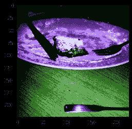

# 预处理

> 原始文本：[`huggingface.co/docs/transformers/v4.37.2/en/preprocessing`](https://huggingface.co/docs/transformers/v4.37.2/en/preprocessing)

在您可以在数据集上训练模型之前，需要将其预处理为预期的模型输入格式。无论您的数据是文本、图像还是音频，都需要将其转换并组装成张量批次。🤗 Transformers 提供了一组预处理类来帮助准备数据供模型使用。在本教程中，您将了解到：

+   文本，使用 Tokenizer 将文本转换为一系列标记，创建标记的数值表示，并将它们组装成张量。

+   语音和音频，使用 Feature extractor 从音频波形中提取序列特征并将其转换为张量。

+   图像输入使用 ImageProcessor 将图像转换为张量。

+   多模态输入，使用 Processor 来结合一个分词器和一个特征提取器或图像处理器。

`AutoProcessor` **总是**有效，并自动选择您正在使用的模型的正确类别，无论您是使用分词器、图像处理器、特征提取器还是处理器。

在开始之前，请安装🤗数据集，以便加载一些数据集进行实验：

```py
pip install datasets
```

## 自然语言处理

[`www.youtube-nocookie.com/embed/Yffk5aydLzg`](https://www.youtube-nocookie.com/embed/Yffk5aydLzg)

预处理文本数据的主要工具是 tokenizer。分词器根据一组规则将文本分割为*标记*。这些标记被转换为数字，然后成为模型输入的张量。分词器会添加模型所需的任何额外输入。

如果您打算使用预训练模型，重要的是使用相关的预训练分词器。这确保文本被分割的方式与预训练语料库相同，并且在预训练期间使用相同的对应标记索引（通常称为*词汇表*）。

通过 AutoTokenizer.from_pretrained()方法加载预训练的分词器来开始。这会下载模型预训练时使用的*词汇表*：

```py
>>> from transformers import AutoTokenizer

>>> tokenizer = AutoTokenizer.from_pretrained("bert-base-cased")
```

然后将您的文本传递给分词器：

```py
>>> encoded_input = tokenizer("Do not meddle in the affairs of wizards, for they are subtle and quick to anger.")
>>> print(encoded_input)
{'input_ids': [101, 2079, 2025, 19960, 10362, 1999, 1996, 3821, 1997, 16657, 1010, 2005, 2027, 2024, 11259, 1998, 4248, 2000, 4963, 1012, 102],
 'token_type_ids': [0, 0, 0, 0, 0, 0, 0, 0, 0, 0, 0, 0, 0, 0, 0, 0, 0, 0, 0, 0, 0],
 'attention_mask': [1, 1, 1, 1, 1, 1, 1, 1, 1, 1, 1, 1, 1, 1, 1, 1, 1, 1, 1, 1, 1]}
```

分词器返回一个包含三个重要项目的字典：

+   input_ids 是句子中每个标记对应的索引。

+   attention_mask 指示一个标记是否应该被关注。

+   token_type_ids 标识一个标记属于哪个序列，当有多个序列时。

通过解码`input_ids`返回您的输入：

```py
>>> tokenizer.decode(encoded_input["input_ids"])
'[CLS] Do not meddle in the affairs of wizards, for they are subtle and quick to anger. [SEP]'
```

正如您所看到的，分词器添加了两个特殊标记 - `CLS`和`SEP`（分类器和分隔符）- 到句子中。并非所有模型都需要特殊标记，但如果需要，分词器会自动为您添加它们。

如果有几个句子需要预处理，将它们作为列表传递给分词器：

```py
>>> batch_sentences = [
...     "But what about second breakfast?",
...     "Don't think he knows about second breakfast, Pip.",
...     "What about elevensies?",
... ]
>>> encoded_inputs = tokenizer(batch_sentences)
>>> print(encoded_inputs)
{'input_ids': [[101, 1252, 1184, 1164, 1248, 6462, 136, 102],
               [101, 1790, 112, 189, 1341, 1119, 3520, 1164, 1248, 6462, 117, 21902, 1643, 119, 102],
               [101, 1327, 1164, 5450, 23434, 136, 102]],
 'token_type_ids': [[0, 0, 0, 0, 0, 0, 0, 0],
                    [0, 0, 0, 0, 0, 0, 0, 0, 0, 0, 0, 0, 0, 0, 0],
                    [0, 0, 0, 0, 0, 0, 0]],
 'attention_mask': [[1, 1, 1, 1, 1, 1, 1, 1],
                    [1, 1, 1, 1, 1, 1, 1, 1, 1, 1, 1, 1, 1, 1, 1],
                    [1, 1, 1, 1, 1, 1, 1]]}
```

### 填充

句子长度不总是相同，这可能是一个问题，因为张量，即模型输入，需要具有统一的形状。填充是一种确保张量是矩形的策略，通过向较短的句子添加一个特殊的*填充标记*。

将`padding`参数设置为`True`，以将批次中较短的序列填充到与最长序列相匹配的长度：

```py
>>> batch_sentences = [
...     "But what about second breakfast?",
...     "Don't think he knows about second breakfast, Pip.",
...     "What about elevensies?",
... ]
>>> encoded_input = tokenizer(batch_sentences, padding=True)
>>> print(encoded_input)
{'input_ids': [[101, 1252, 1184, 1164, 1248, 6462, 136, 102, 0, 0, 0, 0, 0, 0, 0],
               [101, 1790, 112, 189, 1341, 1119, 3520, 1164, 1248, 6462, 117, 21902, 1643, 119, 102],
               [101, 1327, 1164, 5450, 23434, 136, 102, 0, 0, 0, 0, 0, 0, 0, 0]],
 'token_type_ids': [[0, 0, 0, 0, 0, 0, 0, 0, 0, 0, 0, 0, 0, 0, 0],
                    [0, 0, 0, 0, 0, 0, 0, 0, 0, 0, 0, 0, 0, 0, 0],
                    [0, 0, 0, 0, 0, 0, 0, 0, 0, 0, 0, 0, 0, 0, 0]],
 'attention_mask': [[1, 1, 1, 1, 1, 1, 1, 1, 0, 0, 0, 0, 0, 0, 0],
                    [1, 1, 1, 1, 1, 1, 1, 1, 1, 1, 1, 1, 1, 1, 1],
                    [1, 1, 1, 1, 1, 1, 1, 0, 0, 0, 0, 0, 0, 0, 0]]}
```

第一句和第三句现在用`0`填充，因为它们较短。

### 截断

另一方面，有时一个序列可能太长，模型无法处理。在这种情况下，您需要将序列截断为较短的长度。

将`truncation`参数设置为`True`，将序列截断为模型接受的最大长度：

```py
>>> batch_sentences = [
...     "But what about second breakfast?",
...     "Don't think he knows about second breakfast, Pip.",
...     "What about elevensies?",
... ]
>>> encoded_input = tokenizer(batch_sentences, padding=True, truncation=True)
>>> print(encoded_input)
{'input_ids': [[101, 1252, 1184, 1164, 1248, 6462, 136, 102, 0, 0, 0, 0, 0, 0, 0],
               [101, 1790, 112, 189, 1341, 1119, 3520, 1164, 1248, 6462, 117, 21902, 1643, 119, 102],
               [101, 1327, 1164, 5450, 23434, 136, 102, 0, 0, 0, 0, 0, 0, 0, 0]],
 'token_type_ids': [[0, 0, 0, 0, 0, 0, 0, 0, 0, 0, 0, 0, 0, 0, 0],
                    [0, 0, 0, 0, 0, 0, 0, 0, 0, 0, 0, 0, 0, 0, 0],
                    [0, 0, 0, 0, 0, 0, 0, 0, 0, 0, 0, 0, 0, 0, 0]],
 'attention_mask': [[1, 1, 1, 1, 1, 1, 1, 1, 0, 0, 0, 0, 0, 0, 0],
                    [1, 1, 1, 1, 1, 1, 1, 1, 1, 1, 1, 1, 1, 1, 1],
                    [1, 1, 1, 1, 1, 1, 1, 0, 0, 0, 0, 0, 0, 0, 0]]}
```

查看填充和截断概念指南，了解更多不同的填充和截断参数。

### 构建张量

最后，您希望分词器返回实际馈送到模型的张量。

将`return_tensors`参数设置为`pt`以供 PyTorch 使用，或设置为`tf`以供 TensorFlow 使用：

Pytorch 隐藏 Pytorch 内容

```py
>>> batch_sentences = [
...     "But what about second breakfast?",
...     "Don't think he knows about second breakfast, Pip.",
...     "What about elevensies?",
... ]
>>> encoded_input = tokenizer(batch_sentences, padding=True, truncation=True, return_tensors="pt")
>>> print(encoded_input)
{'input_ids': tensor([[101, 1252, 1184, 1164, 1248, 6462, 136, 102, 0, 0, 0, 0, 0, 0, 0],
                      [101, 1790, 112, 189, 1341, 1119, 3520, 1164, 1248, 6462, 117, 21902, 1643, 119, 102],
                      [101, 1327, 1164, 5450, 23434, 136, 102, 0, 0, 0, 0, 0, 0, 0, 0]]),
 'token_type_ids': tensor([[0, 0, 0, 0, 0, 0, 0, 0, 0, 0, 0, 0, 0, 0, 0],
                           [0, 0, 0, 0, 0, 0, 0, 0, 0, 0, 0, 0, 0, 0, 0],
                           [0, 0, 0, 0, 0, 0, 0, 0, 0, 0, 0, 0, 0, 0, 0]]),
 'attention_mask': tensor([[1, 1, 1, 1, 1, 1, 1, 1, 0, 0, 0, 0, 0, 0, 0],
                           [1, 1, 1, 1, 1, 1, 1, 1, 1, 1, 1, 1, 1, 1, 1],
                           [1, 1, 1, 1, 1, 1, 1, 0, 0, 0, 0, 0, 0, 0, 0]])}
```

TensorFlow 隐藏 TensorFlow 内容

```py
>>> batch_sentences = [
...     "But what about second breakfast?",
...     "Don't think he knows about second breakfast, Pip.",
...     "What about elevensies?",
... ]
>>> encoded_input = tokenizer(batch_sentences, padding=True, truncation=True, return_tensors="tf")
>>> print(encoded_input)
{'input_ids': <tf.Tensor: shape=(2, 9), dtype=int32, numpy=
array([[101, 1252, 1184, 1164, 1248, 6462, 136, 102, 0, 0, 0, 0, 0, 0, 0],
       [101, 1790, 112, 189, 1341, 1119, 3520, 1164, 1248, 6462, 117, 21902, 1643, 119, 102],
       [101, 1327, 1164, 5450, 23434, 136, 102, 0, 0, 0, 0, 0, 0, 0, 0]],
      dtype=int32)>,
 'token_type_ids': <tf.Tensor: shape=(2, 9), dtype=int32, numpy=
array([[0, 0, 0, 0, 0, 0, 0, 0, 0, 0, 0, 0, 0, 0, 0],
       [0, 0, 0, 0, 0, 0, 0, 0, 0, 0, 0, 0, 0, 0, 0],
       [0, 0, 0, 0, 0, 0, 0, 0, 0, 0, 0, 0, 0, 0, 0]], dtype=int32)>,
 'attention_mask': <tf.Tensor: shape=(2, 9), dtype=int32, numpy=
array([[1, 1, 1, 1, 1, 1, 1, 1, 0, 0, 0, 0, 0, 0, 0],
       [1, 1, 1, 1, 1, 1, 1, 1, 1, 1, 1, 1, 1, 1, 1],
       [1, 1, 1, 1, 1, 1, 1, 0, 0, 0, 0, 0, 0, 0, 0]], dtype=int32)>}
```

不同的管道以不同的方式在其`__call__()`中支持分词器参数。`text-2-text-generation`管道仅支持（即传递）`truncation`。`text-generation`管道支持`max_length`、`truncation`、`padding`和`add_special_tokens`。在`fill-mask`管道中，分词器参数可以在`tokenizer_kwargs`参数（字典）中传递。

## 音频

对于音频任务，您将需要一个特征提取器来准备您的数据集以供模型使用。特征提取器旨在从原始音频数据中提取特征，并将其转换为张量。

加载[MInDS-14](https://huggingface.co/datasets/PolyAI/minds14)数据集（查看🤗[Datasets 教程](https://huggingface.co/docs/datasets/load_hub)以获取有关如何加载数据集的更多详细信息）以查看如何在音频数据集中使用特征提取器：

```py
>>> from datasets import load_dataset, Audio

>>> dataset = load_dataset("PolyAI/minds14", name="en-US", split="train")
```

访问`audio`列的第一个元素以查看输入。调用`audio`列会自动加载和重新采样音频文件：

```py
>>> dataset[0]["audio"]
{'array': array([ 0.        ,  0.00024414, -0.00024414, ..., -0.00024414,
         0.        ,  0.        ], dtype=float32),
 'path': '/root/.cache/huggingface/datasets/downloads/extracted/f14948e0e84be638dd7943ac36518a4cf3324e8b7aa331c5ab11541518e9368c/en-US~JOINT_ACCOUNT/602ba55abb1e6d0fbce92065.wav',
 'sampling_rate': 8000}
```

这将返回三个项目：

+   `array`是加载的语音信号 - 可能已重新采样 - 作为 1D 数组。

+   `path`指向音频文件的位置。

+   `sampling_rate`指的是每秒测量的语音信号中有多少数据点。

在本教程中，您将使用[Wav2Vec2](https://huggingface.co/facebook/wav2vec2-base)模型。查看模型卡片，您将了解到 Wav2Vec2 是在 16kHz 采样的语音音频上进行预训练的。重要的是，您的音频数据的采样率要与用于预训练模型的数据集的采样率匹配。如果您的数据采样率不同，则需要对数据进行重新采样。

1.  使用🤗 Datasets 的[cast_column](https://huggingface.co/docs/datasets/v2.16.1/en/package_reference/main_classes#datasets.Dataset.cast_column)方法将采样率上采样至 16kHz：

```py
>>> dataset = dataset.cast_column("audio", Audio(sampling_rate=16_000))
```

1.  再次调用`audio`列以重新采样音频文件：

```py
>>> dataset[0]["audio"]
{'array': array([ 2.3443763e-05,  2.1729663e-04,  2.2145823e-04, ...,
         3.8356509e-05, -7.3497440e-06, -2.1754686e-05], dtype=float32),
 'path': '/root/.cache/huggingface/datasets/downloads/extracted/f14948e0e84be638dd7943ac36518a4cf3324e8b7aa331c5ab11541518e9368c/en-US~JOINT_ACCOUNT/602ba55abb1e6d0fbce92065.wav',
 'sampling_rate': 16000}
```

接下来，加载一个特征提取器来对输入进行归一化和填充。在填充文本数据时，会为较短的序列添加`0`。相同的思想也适用于音频数据。特征提取器会向`array`中添加一个`0` - 被解释为静音。

使用 AutoFeatureExtractor.from_pretrained()加载特征提取器：

```py
>>> from transformers import AutoFeatureExtractor

>>> feature_extractor = AutoFeatureExtractor.from_pretrained("facebook/wav2vec2-base")
```

将音频`array`传递给特征提取器。我们还建议在特征提取器中添加`sampling_rate`参数，以更好地调试可能发生的任何静默错误。

```py
>>> audio_input = [dataset[0]["audio"]["array"]]
>>> feature_extractor(audio_input, sampling_rate=16000)
{'input_values': [array([ 3.8106556e-04,  2.7506407e-03,  2.8015103e-03, ...,
        5.6335266e-04,  4.6588284e-06, -1.7142107e-04], dtype=float32)]}
```

与分词器一样，您可以应用填充或截断来处理批处理中的可变序列。查看这两个音频样本的序列长度：

```py
>>> dataset[0]["audio"]["array"].shape
(173398,)

>>> dataset[1]["audio"]["array"].shape
(106496,)
```

创建一个函数来预处理数据集，使音频样本具有相同的长度。指定最大样本长度，特征提取器将填充或截断序列以匹配它：

```py
>>> def preprocess_function(examples):
...     audio_arrays = [x["array"] for x in examples["audio"]]
...     inputs = feature_extractor(
...         audio_arrays,
...         sampling_rate=16000,
...         padding=True,
...         max_length=100000,
...         truncation=True,
...     )
...     return inputs
```

对数据集中的前几个示例应用`preprocess_function`：

```py
>>> processed_dataset = preprocess_function(dataset[:5])
```

现在样本长度相同并与指定的最大长度匹配。现在可以将处理过的数据集传递给模型了！

```py
>>> processed_dataset["input_values"][0].shape
(100000,)

>>> processed_dataset["input_values"][1].shape
(100000,)
```

## 计算机视觉

对于计算机视觉任务，您将需要一个图像处理器来准备您的数据集以供模型使用。图像预处理包括几个步骤，将图像转换为模型期望的输入。这些步骤包括但不限于调整大小、归一化、颜色通道校正以及将图像转换为张量。

图像预处理通常遵循某种形式的图像增强。图像预处理和图像增强都会转换图像数据，但它们有不同的目的：

+   图像增强以一种可以帮助防止过拟合并增加模型鲁棒性的方式改变图像。您可以在数据增强中发挥创造力 - 调整亮度和颜色，裁剪，旋转，调整大小，缩放等。但是，请注意不要通过增强改变图像的含义。

+   图像预处理确保图像与模型期望的输入格式匹配。在微调计算机视觉模型时，图像必须与模型最初训练时的预处理方式完全相同。

您可以使用任何您喜欢的库进行图像增强。对于图像预处理，请使用与模型关联的`ImageProcessor`。

加载[food101](https://huggingface.co/datasets/food101)数据集（请参阅🤗[数据集教程](https://huggingface.co/docs/datasets/load_hub)以获取有关如何加载数据集的更多详细信息），以查看如何在计算机视觉数据集中使用图像处理器：

使用🤗数据集`split`参数仅加载训练集中的一小部分样本，因为数据集非常大！

```py
>>> from datasets import load_dataset

>>> dataset = load_dataset("food101", split="train[:100]")
```

接下来，看一下带有🤗数据集[`Image`](https://huggingface.co/docs/datasets/package_reference/main_classes?highlight=image#datasets.Image)特征的图像：

```py
>>> dataset[0]["image"]
```


使用 AutoImageProcessor.from_pretrained()加载图像处理器：

```py
>>> from transformers import AutoImageProcessor

>>> image_processor = AutoImageProcessor.from_pretrained("google/vit-base-patch16-224")
```

首先，让我们添加一些图像增强。您可以使用任何您喜欢的库，但在本教程中，我们将使用 torchvision 的[`transforms`](https://pytorch.org/vision/stable/transforms.html)模块。如果您有兴趣使用其他数据增强库，请在[Albumentations](https://colab.research.google.com/github/huggingface/notebooks/blob/main/examples/image_classification_albumentations.ipynb)或[Kornia notebooks](https://colab.research.google.com/github/huggingface/notebooks/blob/main/examples/image_classification_kornia.ipynb)中学习如何使用。

1.  在这里，我们使用[`Compose`](https://pytorch.org/vision/master/generated/torchvision.transforms.Compose.html)来链接一些转换 - [`RandomResizedCrop`](https://pytorch.org/vision/main/generated/torchvision.transforms.RandomResizedCrop.html)和[`ColorJitter`](https://pytorch.org/vision/main/generated/torchvision.transforms.ColorJitter.html)。请注意，对于调整大小，我们可以从`image_processor`获取图像大小要求。对于某些模型，期望精确的高度和宽度，对于其他模型只定义了`shortest_edge`。

```py
>>> from torchvision.transforms import RandomResizedCrop, ColorJitter, Compose

>>> size = (
...     image_processor.size["shortest_edge"]
...     if "shortest_edge" in image_processor.size
...     else (image_processor.size["height"], image_processor.size["width"])
... )

>>> _transforms = Compose([RandomResizedCrop(size), ColorJitter(brightness=0.5, hue=0.5)])
```

1.  模型接受`pixel_values`作为其输入。`ImageProcessor`可以负责归一化图像，并生成适当的张量。创建一个函数，将图像增强和图像预处理组合为一批图像，并生成`pixel_values`：

```py
>>> def transforms(examples):
...     images = [_transforms(img.convert("RGB")) for img in examples["image"]]
...     examples["pixel_values"] = image_processor(images, do_resize=False, return_tensors="pt")["pixel_values"]
...     return examples
```

在上面的示例中，我们设置了`do_resize=False`，因为我们已经在图像增强转换中调整了图像的大小，并利用了适当的`image_processor`的`size`属性。如果您在图像增强期间不调整图像大小，请省略此参数。默认情况下，`ImageProcessor`将处理调整大小。

如果希望将图像归一化作为增强转换的一部分，请使用`image_processor.image_mean`和`image_processor.image_std`值。

1.  然后使用🤗数据集[set_transform](https://huggingface.co/docs/datasets/v2.16.1/en/package_reference/main_classes#datasets.Dataset.set_transform)来动态应用转换：

```py
>>> dataset.set_transform(transforms)
```

1.  现在当您访问图像时，您会注意到图像处理器已添加了`pixel_values`。现在您可以将处理过的数据集传递给模型了！

```py
>>> dataset[0].keys()
```

这是应用转换后的图像样子。图像已被随机裁剪，其颜色属性不同。

```py
>>> import numpy as np
>>> import matplotlib.pyplot as plt

>>> img = dataset[0]["pixel_values"]
>>> plt.imshow(img.permute(1, 2, 0))
```



对于目标检测、语义分割、实例分割和全景分割等任务，`ImageProcessor`提供后处理方法。这些方法将模型的原始输出转换为有意义的预测，如边界框或分割地图。

### 填充

在某些情况下，例如在微调 DETR 时，模型会在训练时应用尺度增强。这可能导致批处理中的图像大小不同。您可以使用来自 DetrImageProcessor 的`DetrImageProcessor.pad()`，并定义一个自定义的`collate_fn`来将图像批处理在一起。

```py
>>> def collate_fn(batch):
...     pixel_values = [item["pixel_values"] for item in batch]
...     encoding = image_processor.pad(pixel_values, return_tensors="pt")
...     labels = [item["labels"] for item in batch]
...     batch = {}
...     batch["pixel_values"] = encoding["pixel_values"]
...     batch["pixel_mask"] = encoding["pixel_mask"]
...     batch["labels"] = labels
...     return batch
```

## 多模态

对于涉及多模态输入的任务，您将需要一个处理器来为模型准备您的数据集。处理器将两个处理对象（如标记器和特征提取器）耦合在一起。

加载[LJ Speech](https://huggingface.co/datasets/lj_speech)数据集（查看🤗[数据集教程](https://huggingface.co/docs/datasets/load_hub)以获取有关如何加载数据集的更多详细信息），以查看如何使用处理器进行自动语音识别（ASR）：

```py
>>> from datasets import load_dataset

>>> lj_speech = load_dataset("lj_speech", split="train")
```

对于 ASR，您主要关注`音频`和`文本`，因此可以删除其他列：

```py
>>> lj_speech = lj_speech.map(remove_columns=["file", "id", "normalized_text"])
```

现在看一下`音频`和`文本`列：

```py
>>> lj_speech[0]["audio"]
{'array': array([-7.3242188e-04, -7.6293945e-04, -6.4086914e-04, ...,
         7.3242188e-04,  2.1362305e-04,  6.1035156e-05], dtype=float32),
 'path': '/root/.cache/huggingface/datasets/downloads/extracted/917ece08c95cf0c4115e45294e3cd0dee724a1165b7fc11798369308a465bd26/LJSpeech-1.1/wavs/LJ001-0001.wav',
 'sampling_rate': 22050}

>>> lj_speech[0]["text"]
'Printing, in the only sense with which we are at present concerned, differs from most if not from all the arts and crafts represented in the Exhibition'
```

记住，你应该始终重新采样你的音频数据集的采样率，以匹配用于预训练模型的数据集的采样率！

```py
>>> lj_speech = lj_speech.cast_column("audio", Audio(sampling_rate=16_000))
```

使用 AutoProcessor.from_pretrained()加载一个处理器：

```py
>>> from transformers import AutoProcessor

>>> processor = AutoProcessor.from_pretrained("facebook/wav2vec2-base-960h")
```

1.  创建一个函数来处理`array`中包含的音频数据为`input_values`，并将`文本`标记化为`标签`。这些是模型的输入：

```py
>>> def prepare_dataset(example):
...     audio = example["audio"]

...     example.update(processor(audio=audio["array"], text=example["text"], sampling_rate=16000))

...     return example
```

1.  将`prepare_dataset`函数应用到一个样本中：

```py
>>> prepare_dataset(lj_speech[0])
```

处理器现在已经添加了`input_values`和`labels`，采样率也已经正确降采样到 16kHz。现在您可以将处理过的数据集传递给模型了！
