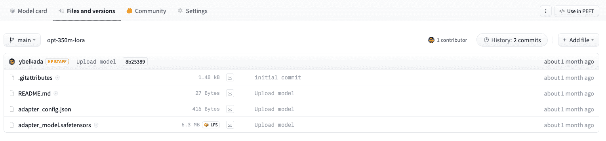

# 使用🤗 PEFT 加载适配器

> 原始文本：[`huggingface.co/docs/transformers/v4.37.2/en/peft`](https://huggingface.co/docs/transformers/v4.37.2/en/peft)

[参数高效微调（PEFT）](https://huggingface.co/blog/peft)方法在微调期间冻结预训练模型参数，并在其上添加少量可训练参数（适配器）。适配器被训练以学习特定任务的信息。这种方法已被证明在使用更低的计算资源的同时产生与完全微调模型相媲美的结果时非常节省内存。

使用 PEFT 训练的适配器通常比完整模型小一个数量级，这样方便分享、存储和加载。



存储在 Hub 上的 OPTForCausalLM 模型的适配器权重仅约为 6MB，而模型权重的完整大小可能约为 700MB。

如果您想了解更多关于🤗 PEFT 库的信息，请查看[文档](https://huggingface.co/docs/peft/index)。

## 设置

通过安装🤗 PEFT 来开始：

```py
pip install peft
```

如果您想尝试全新的功能，您可能会对从源代码安装库感兴趣：

```py
pip install git+https://github.com/huggingface/peft.git
```

## 支持的 PEFT 模型

🤗 Transformers 原生支持一些 PEFT 方法，这意味着您可以加载本地或 Hub 上存储的适配器权重，并使用几行代码轻松运行或训练它们。支持以下方法：

+   [低秩适配器](https://huggingface.co/docs/peft/conceptual_guides/lora)

+   [IA3](https://huggingface.co/docs/peft/conceptual_guides/ia3)

+   [AdaLoRA](https://arxiv.org/abs/2303.10512)

如果您想使用其他 PEFT 方法，如提示学习或提示调整，或者了解🤗 PEFT 库的一般信息，请参考[文档](https://huggingface.co/docs/peft/index)。

## 加载 PEFT 适配器

加载和使用🤗 Transformers 中的 PEFT 适配器模型时，请确保 Hub 存储库或本地目录包含一个`adapter_config.json`文件和适配器权重，如上面的示例图所示。然后，您可以使用`AutoModelFor`类加载 PEFT 适配器模型。例如，要加载用于因果语言建模的 PEFT 适配器模型：

1.  指定 PEFT 模型 ID

1.  将其传递给 AutoModelForCausalLM 类

```py
from transformers import AutoModelForCausalLM, AutoTokenizer

peft_model_id = "ybelkada/opt-350m-lora"
model = AutoModelForCausalLM.from_pretrained(peft_model_id)
```

您可以使用`AutoModelFor`类或基本模型类（如`OPTForCausalLM`或`LlamaForCausalLM`）加载 PEFT 适配器。

您还可以通过调用`load_adapter`方法加载 PEFT 适配器：

```py
from transformers import AutoModelForCausalLM, AutoTokenizer

model_id = "facebook/opt-350m"
peft_model_id = "ybelkada/opt-350m-lora"

model = AutoModelForCausalLM.from_pretrained(model_id)
model.load_adapter(peft_model_id)
```

## 以 8 位或 4 位加载

`bitsandbytes`集成支持 8 位和 4 位精度数据类型，对于加载大型模型很有用，因为它节省内存（请参阅`bitsandbytes`集成指南以了解更多）。将`load_in_8bit`或`load_in_4bit`参数添加到 from_pretrained()中，并设置`device_map="auto"`以有效地将模型分配到您的硬件：

```py
from transformers import AutoModelForCausalLM, AutoTokenizer

peft_model_id = "ybelkada/opt-350m-lora"
model = AutoModelForCausalLM.from_pretrained(peft_model_id, device_map="auto", load_in_8bit=True)
```

## 添加一个新适配器

您可以使用`~peft.PeftModel.add_adapter`将一个新适配器添加到具有现有适配器的模型中，只要新适配器与当前适配器的类型相同。例如，如果您有一个已经连接到模型的现有 LoRA 适配器：

```py
from transformers import AutoModelForCausalLM, OPTForCausalLM, AutoTokenizer
from peft import LoraConfig

model_id = "facebook/opt-350m"
model = AutoModelForCausalLM.from_pretrained(model_id)

lora_config = LoraConfig(
    target_modules=["q_proj", "k_proj"],
    init_lora_weights=False
)

model.add_adapter(lora_config, adapter_name="adapter_1")
```

添加一个新适配器：

```py
# attach new adapter with same config
model.add_adapter(lora_config, adapter_name="adapter_2")
```

现在您可以使用`~peft.PeftModel.set_adapter`来设置要使用的适配器：

```py
# use adapter_1
model.set_adapter("adapter_1")
output = model.generate(**inputs)
print(tokenizer.decode(output_disabled[0], skip_special_tokens=True))

# use adapter_2
model.set_adapter("adapter_2")
output_enabled = model.generate(**inputs)
print(tokenizer.decode(output_enabled[0], skip_special_tokens=True))
```

## 启用和禁用适配器

一旦您向模型添加了适配器，您可以启用或禁用适配器模块。要启用适配器模块：

```py
from transformers import AutoModelForCausalLM, OPTForCausalLM, AutoTokenizer
from peft import PeftConfig

model_id = "facebook/opt-350m"
adapter_model_id = "ybelkada/opt-350m-lora"
tokenizer = AutoTokenizer.from_pretrained(model_id)
text = "Hello"
inputs = tokenizer(text, return_tensors="pt")

model = AutoModelForCausalLM.from_pretrained(model_id)
peft_config = PeftConfig.from_pretrained(adapter_model_id)

# to initiate with random weights
peft_config.init_lora_weights = False

model.add_adapter(peft_config)
model.enable_adapters()
output = model.generate(**inputs)
```

要禁用适配器模块：

```py
model.disable_adapters()
output = model.generate(**inputs)
```

## 训练一个 PEFT 适配器

PEFT 适配器受 Trainer 类支持，因此您可以为特定用例训练一个适配器。只需要添加几行代码。例如，要训练一个 LoRA 适配器：

如果您不熟悉使用 Trainer 微调模型，请查看微调预训练模型教程。

1.  使用任务类型和超参数定义您的适配器配置（有关超参数的详细信息，请参阅`~peft.LoraConfig`）。

```py
from peft import LoraConfig

peft_config = LoraConfig(
    lora_alpha=16,
    lora_dropout=0.1,
    r=64,
    bias="none",
    task_type="CAUSAL_LM",
)
```

1.  将适配器添加到模型中。

```py
model.add_adapter(peft_config)
```

1.  现在您可以将模型传递给 Trainer！

```py
trainer = Trainer(model=model, ...)
trainer.train()
```

保存您训练过的适配器并加载回来：

```py
model.save_pretrained(save_dir)
model = AutoModelForCausalLM.from_pretrained(save_dir)
```

## 向 PEFT 适配器添加额外的可训练层

您还可以通过在 PEFT 配置中传递`modules_to_save`来在已附加适配器的模型顶部微调额外的可训练适配器。例如，如果您想在具有 LoRA 适配器的模型顶部也微调 lm_head：

```py
from transformers import AutoModelForCausalLM, OPTForCausalLM, AutoTokenizer
from peft import LoraConfig

model_id = "facebook/opt-350m"
model = AutoModelForCausalLM.from_pretrained(model_id)

lora_config = LoraConfig(
    target_modules=["q_proj", "k_proj"],
    modules_to_save=["lm_head"],
)

model.add_adapter(lora_config)
```
