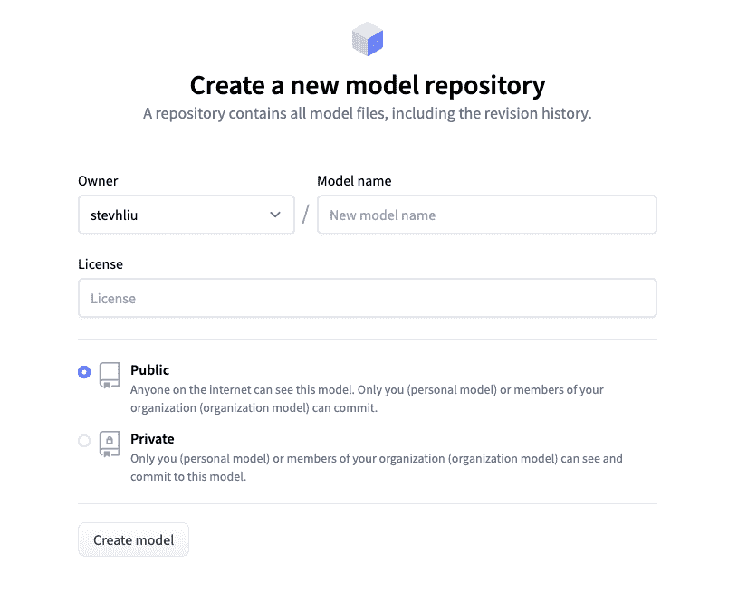

# 分享模型

> 原始文本：[`huggingface.co/docs/transformers/v4.37.2/en/model_sharing`](https://huggingface.co/docs/transformers/v4.37.2/en/model_sharing)

最后两个教程展示了如何使用 PyTorch、Keras 和🤗加速进行分布式设置对模型进行微调。下一步是与社区分享您的模型！在 Hugging Face，我们相信公开分享知识和资源，以使人人都能民主化人工智能。我们鼓励您考虑与社区分享您的模型，以帮助他人节省时间和资源。

在本教程中，您将学习两种在[模型中心](https://huggingface.co/models)上分享经过训练或微调模型的方法：

+   通过程序将文件推送到 Hub。

+   通过 Web 界面将文件拖放到 Hub 中。

[`www.youtube.com/embed/XvSGPZFEjDY`](https://www.youtube.com/embed/XvSGPZFEjDY)

要与社区分享模型，您需要在[huggingface.co](https://huggingface.co/join)上拥有一个帐户。您还可以加入现有组织或创建一个新组织。

## 存储库功能

模型中心上的每个存储库的行为类似于典型的 GitHub 存储库。我们的存储库提供版本控制、提交历史记录和可视化差异的功能。

模型中心内置的版本控制基于 git 和[git-lfs](https://git-lfs.github.com/)。换句话说，您可以将一个模型视为一个存储库，实现更大的访问控制和可扩展性。版本控制允许*修订*，这是通过提交哈希、标签或分支固定模型的特定版本的方法。

因此，您可以使用`revision`参数加载特定模型版本：

```py
>>> model = AutoModel.from_pretrained(
...     "julien-c/EsperBERTo-small", revision="v2.0.1"  # tag name, or branch name, or commit hash
... )
```

文件也可以在存储库中轻松编辑，您还可以查看提交历史记录以及差异：


## 设置

在将模型分享到 Hub 之前，您将需要您的 Hugging Face 凭据。如果您可以访问终端，请在安装🤗 Transformers 的虚拟环境中运行以下命令。这将在您的 Hugging Face 缓存文件夹（默认为`~/.cache/`）中存储您的访问令牌：

```py
huggingface-cli login
```

如果您正在使用 Jupyter 或 Colaboratory 等笔记本，请确保已安装[`huggingface_hub`](https://huggingface.co/docs/hub/adding-a-library)库。该库允许您以编程方式与 Hub 进行交互。

```py
pip install huggingface_hub
```

然后使用`notebook_login`登录到 Hub，并按照链接[此处](https://huggingface.co/settings/token)生成一个令牌以登录：

```py
>>> from huggingface_hub import notebook_login

>>> notebook_login()
```

## 将模型转换为所有框架

为确保您的模型可以被使用不同框架的人使用，我们建议您将您的模型转换并上传为 PyTorch 和 TensorFlow 检查点。虽然用户仍然可以从不同框架加载您的模型，如果您跳过此步骤，加载速度会较慢，因为🤗 Transformers 需要即时转换检查点。

将另一个框架的检查点转换为另一个框架很容易。确保您已安装 PyTorch 和 TensorFlow（请参阅此处获取安装说明），然后在另一个框架中找到适合您任务的特定模型。

Pytorch 隐藏 Pytorch 内容

指定`from_tf=True`以将 TensorFlow 的检查点转换为 PyTorch：

```py
>>> pt_model = DistilBertForSequenceClassification.from_pretrained("path/to/awesome-name-you-picked", from_tf=True)
>>> pt_model.save_pretrained("path/to/awesome-name-you-picked")
```

TensorFlow 隐藏 TensorFlow 内容

指定`from_pt=True`以将 PyTorch 的检查点转换为 TensorFlow：

```py
>>> tf_model = TFDistilBertForSequenceClassification.from_pretrained("path/to/awesome-name-you-picked", from_pt=True)
```

然后，您可以使用新的检查点保存您的新 TensorFlow 模型：

```py
>>> tf_model.save_pretrained("path/to/awesome-name-you-picked")
```

JAX 隐藏 JAX 内容

如果一个模型在 Flax 中可用，您也可以将 PyTorch 的检查点转换为 Flax：

```py
>>> flax_model = FlaxDistilBertForSequenceClassification.from_pretrained(
...     "path/to/awesome-name-you-picked", from_pt=True
... )
```

## 在训练期间推送模型

Pytorch 隐藏 Pytorch 内容

[`www.youtube-nocookie.com/embed/Z1-XMy-GNLQ`](https://www.youtube-nocookie.com/embed/Z1-XMy-GNLQ)

将模型共享到 Hub 就像添加一个额外的参数或回调一样简单。请记住来自微调教程中，TrainingArguments 类是您指定超参数和额外训练选项的地方。其中一个训练选项包括直接将模型推送到 Hub 的能力。在您的 TrainingArguments 中设置`push_to_hub=True`：

```py
>>> training_args = TrainingArguments(output_dir="my-awesome-model", push_to_hub=True)
```

像往常一样将您的训练参数传递给 Trainer：

```py
>>> trainer = Trainer(
...     model=model,
...     args=training_args,
...     train_dataset=small_train_dataset,
...     eval_dataset=small_eval_dataset,
...     compute_metrics=compute_metrics,
... )
```

在微调您的模型后，调用 push_to_hub()在 Trainer 上将训练好的模型推送到 Hub。🤗 Transformers 甚至会自动将训练超参数、训练结果和框架版本添加到您的模型卡中！

```py
>>> trainer.push_to_hub()
```

TensorFlow 隐藏 TensorFlow 内容

使用 PushToHubCallback 将模型共享到 Hub。在 PushToHubCallback 函数中，添加：

+   一个用于您的模型的输出目录。

+   一个分词器。

+   `hub_model_id`，即您的 Hub 用户名和模型名称。

```py
>>> from transformers import PushToHubCallback

>>> push_to_hub_callback = PushToHubCallback(
...     output_dir="./your_model_save_path", tokenizer=tokenizer, hub_model_id="your-username/my-awesome-model"
... )
```

将回调添加到[`fit`](https://keras.io/api/models/model_training_apis/)，🤗 Transformers 将推送训练好的模型到 Hub：

```py
>>> model.fit(tf_train_dataset, validation_data=tf_validation_dataset, epochs=3, callbacks=push_to_hub_callback)
```

## 使用`push_to_hub`函数

您还可以直接在您的模型上调用`push_to_hub`来将其上传到 Hub。

在`push_to_hub`中指定您的模型名称：

```py
>>> pt_model.push_to_hub("my-awesome-model")
```

这将在您的用户名下创建一个名为`my-awesome-model`的模型存储库。用户现在可以使用`from_pretrained`函数加载您的模型：

```py
>>> from transformers import AutoModel

>>> model = AutoModel.from_pretrained("your_username/my-awesome-model")
```

如果您属于一个组织，并希望将您的模型推送到组织名称下，只需将其添加到`repo_id`中：

```py
>>> pt_model.push_to_hub("my-awesome-org/my-awesome-model")
```

`push_to_hub`函数也可以用于向模型存储库添加其他文件。例如，向模型存储库添加一个分词器：

```py
>>> tokenizer.push_to_hub("my-awesome-model")
```

或者您可能想要添加您微调的 PyTorch 模型的 TensorFlow 版本：

```py
>>> tf_model.push_to_hub("my-awesome-model")
```

现在当您导航到您的 Hugging Face 个人资料时，您应该看到您新创建的模型存储库。点击**文件**选项卡将显示您上传到存储库的所有文件。

有关如何创建和上传文件到存储库的更多详细信息，请参考 Hub 文档[这里](https://huggingface.co/docs/hub/how-to-upstream)。

## 使用 Web 界面上传

喜欢无代码方法的用户可以通过 Hub 的 Web 界面上传模型。访问[huggingface.co/new](https://huggingface.co/new)创建一个新存储库：



在这里，添加有关您的模型的一些信息：

+   选择存储库的**所有者**。这可以是您自己或您所属的任何组织。

+   为您的模型选择一个名称，这也将是存储库名称。

+   选择您的模型是公开的还是私有的。

+   为您的模型指定许可证使用情况。

现在点击**文件**选项卡，然后点击**添加文件**按钮将新文件上传到您的存储库。然后拖放文件进行上传并添加提交消息。


## 添加一个模型卡

为确保用户了解您的模型的功能、限制、潜在偏见和道德考虑，请向您的存储库添加一个模型卡。模型卡在`README.md`文件中定义。您可以通过以下方式添加模型卡：

+   手动创建和上传`README.md`文件。

+   点击您的模型存储库中的**编辑模型卡**按钮。

查看 DistilBert 的[模型卡片](https://huggingface.co/distilbert-base-uncased)，这是模型卡片应包含的信息类型的一个很好的例子。有关您可以在`README.md`文件中控制的其他选项的更多详细信息，例如模型的碳足迹或小部件示例，请参考[此处的文档](https://huggingface.co/docs/hub/models-cards)。
