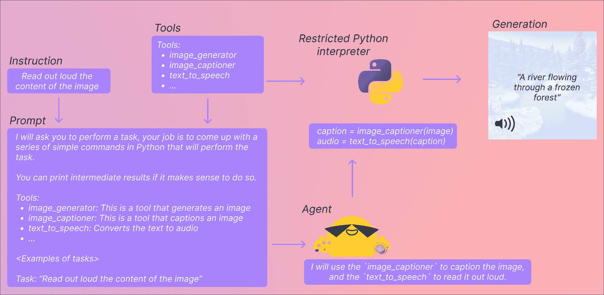

# Transformers Agents

> 原始文本：[`huggingface.co/docs/transformers/v4.37.2/en/transformers_agents`](https://huggingface.co/docs/transformers/v4.37.2/en/transformers_agents)

Transformers Agents 是一个实验性 API，随时可能会发生变化。由代理返回的结果可能会有所不同，因为 API 或基础模型容易发生变化。

Transformers 版本 v4.29.0，构建在*工具*和*代理*的概念之上。您可以在[此 colab](https://colab.research.google.com/drive/1c7MHD-T1forUPGcC_jlwsIptOzpG3hSj)中进行操作。

简而言之，它提供了一个自然语言 API，基于 transformers：我们定义了一组精心策划的工具，并设计了一个代理来解释自然语言并使用这些工具。它是可扩展的设计；我们策划了一些相关工具，但我们将向您展示系统如何轻松扩展以使用社区开发的任何工具。

让我们从几个示例开始，展示这个新 API 可以实现的功能。当涉及多模态任务时，它特别强大，因此让我们试一试生成图像并大声朗读文本。

```py
agent.run("Caption the following image", image=image)
```

| **输入** | **输出** |
| --- | --- |
|  | 一只海狸正在水中游泳 |

* * *

```py
agent.run("Read the following text out loud", text=text)
```

| **输入** | **输出** |
| --- | --- |
| 一只海狸正在水中游泳 |

<https://huggingface.co/datasets/huggingface/documentation-images/resolve/main/transformers/tts_example.wav>

您的浏览器不支持音频元素。 |

* * *

```py
agent.run(
    "In the following `document`, where will the TRRF Scientific Advisory Council Meeting take place?",
    document=document,
)
```

| **输入** | **输出** |
| --- | --- |
|  | 舞厅门厅 |

## 快速开始

在能够使用`agent.run`之前，您需要实例化一个代理，这是一个大型语言模型（LLM）。我们支持 openAI 模型以及来自 BigCode 和 OpenAssistant 的开源替代方案。openAI 模型表现更好（但需要您拥有 openAI API 密钥，因此不能免费使用）；Hugging Face 为 BigCode 和 OpenAssistant 模型提供免费访问端点。

首先，请安装`agents`额外组件以安装所有默认依赖项。

```py
pip install transformers[agents]
```

要使用 openAI 模型，您需要在安装`openai`依赖项后实例化 OpenAiAgent：

```py
pip install openai
```

```py
from transformers import OpenAiAgent

agent = OpenAiAgent(model="text-davinci-003", api_key="<your_api_key>")
```

要使用 BigCode 或 OpenAssistant，请先登录以访问推理 API：

```py
from huggingface_hub import login

login("<YOUR_TOKEN>")
```

然后，实例化代理

```py
from transformers import HfAgent

# Starcoder
agent = HfAgent("https://api-inference.huggingface.co/models/bigcode/starcoder")
# StarcoderBase
# agent = HfAgent("https://api-inference.huggingface.co/models/bigcode/starcoderbase")
# OpenAssistant
# agent = HfAgent(url_endpoint="https://api-inference.huggingface.co/models/OpenAssistant/oasst-sft-4-pythia-12b-epoch-3.5")
```

这是目前 Hugging Face 免费提供的推理 API。如果您有自己的推理端点用于此模型（或其他模型），可以用您的 URL 端点替换上面的 URL。

StarCoder 和 OpenAssistant 是免费使用的，并在简单任务上表现出色。但是，在处理更复杂的提示时，检查点无法保持。如果您遇到此类问题，我们建议尝试 OpenAI 模型，尽管遗憾的是，它不是开源的，但在当前时间表现更好。

现在您可以开始了！让我们深入了解您现在可以使用的两个 API。

### 单次执行（运行）

单次执行方法是使用代理的 run()方法：

```py
agent.run("Draw me a picture of rivers and lakes.")
```


它会自动选择适合您要执行的任务的工具（或工具），并适当运行它们。它可以在同一指令中执行一个或多个任务（尽管您的指令越复杂，代理失败的可能性就越大）。

```py
agent.run("Draw me a picture of the sea then transform the picture to add an island")
```


每个 run()操作都是独立的，因此您可以连续运行多次，执行不同的任务。

请注意，您的`代理`只是一个大型语言模型，因此提示中的细微变化可能会产生完全不同的结果。尽可能清楚地解释您想要执行的任务是很重要的。我们在这里更深入地讨论如何编写良好的提示这里。

如果您想在执行过程中保持状态或向代理传递非文本对象，可以通过指定您希望代理使用的变量来实现。例如，您可以生成河流和湖泊的第一幅图像，并要求模型更新该图片以添加一个岛屿，方法如下：

```py
picture = agent.run("Generate a picture of rivers and lakes.")
updated_picture = agent.run("Transform the image in `picture` to add an island to it.", picture=picture)
```

当模型无法理解您的请求并混合工具时，这可能会有所帮助。一个例子是：

```py
agent.run("Draw me the picture of a capybara swimming in the sea")
```

在这里，模型可以以两种方式解释：

+   让`text-to-image`生成一只在海里游泳的水豚

+   或者，让`text-to-image`生成水豚，然后使用`image-transformation`工具让它在海里游泳

如果您想强制执行第一个场景，可以通过将提示作为参数传递给它来实现：

```py
agent.run("Draw me a picture of the `prompt`", prompt="a capybara swimming in the sea")
```

### 基于聊天的执行（chat）

代理还采用了基于聊天的方法，使用 chat()方法：

```py
agent.chat("Generate a picture of rivers and lakes")
```


```py
agent.chat("Transform the picture so that there is a rock in there")
```


当您想要跨指令保持状态时，这是一种有趣的方法。这对于实验很有帮助，但往往更擅长单个指令，而不是复杂指令（run()方法更擅长处理）。

如果您想传递非文本类型或特定提示，这种方法也可以接受参数。

### ⚠️ 远程执行

出于演示目的，以便可以与所有设置一起使用，我们已经为代理可以访问的默认工具的几个远程执行器创建了。这些是使用[inference endpoints](https://huggingface.co/inference-endpoints)创建的。

我们现在已经关闭了这些，但为了看到如何设置远程执行工具，我们建议阅读自定义工具指南。

### 这里发生了什么？什么是工具，什么是代理？



#### 代理

这里的“代理”是一个大型语言模型，我们正在提示它，以便它可以访问特定的一组工具。

LLMs 在生成小样本代码方面表现得相当不错，因此这个 API 利用 LLM 的这一特点，通过提示 LLM 给出执行任务的一组工具的小样本代码。然后，您给代理的任务和您给它的工具描述完成这个提示。这样它就可以访问您正在使用的工具的文档，特别是它们的预期输入和输出，并生成相关的代码。

#### 工具

工具非常简单：它们是一个函数，带有名称和描述。然后我们使用这些工具的描述来提示代理。通过提示，我们向代理展示如何利用工具执行查询中请求的任务。

这里使用全新的工具而不是流水线，因为代理使用非常原子化的工具编写更好的代码。流水线更加重构，通常将多个任务合并为一个。工具旨在专注于一个非常简单的任务。

#### 代码执行？！

然后，这段代码将在我们的小型 Python 解释器上执行，同时传递您的工具和输入集。我们听到您在后面尖叫“任意代码执行！”，但让我们解释为什么情况并非如此。

只能调用您提供的工具和打印函数，因此可以执行的内容已经受到限制。如果限制在 Hugging Face 工具上，那么您应该是安全的。

然后，我们不允许任何属性查找或导入（对于传递输入/输出到一小组函数来说，这些都不应该是必要的），因此所有最明显的攻击（无论如何，您需要提示 LLM 输出它们）都不应该是问题。如果您想更加安全，可以执行带有额外参数 return_code=True 的 run()方法，这样代理将只返回要执行的代码，您可以决定是否执行。

如果尝试执行非法操作或代码生成的 Python 错误时，执行将停止。

### 精心挑选的工具

我们确定了一组可以增强这些代理的工具。以下是我们在`transformers`中集成的工具的更新列表：

+   **文档问答**：给定一个文档（如 PDF）的图像格式，回答关于该文档的问题（Donut）

+   **文本问答**：给定一段长文本和一个问题，在文本中回答问题（Flan-T5）

+   **无条件图像字幕**：给图像加上字幕！（BLIP）

+   **图像问答**：给定一幅图像，在这幅图像上回答一个问题（VILT）

+   **图像分割**：给定一幅图像和一个提示，输出该提示的分割蒙版（CLIPSeg）

+   **语音转文本**：给定一个人说话的音频录音，将语音转录为文本（Whisper）

+   **文本转语音**：将文本转换为语音（SpeechT5）

+   **零样本文本分类**：给定一个文本和一个标签列表，确定文本对应于哪个标签最多（BART）

+   **文本摘要**：将长文本总结为一句或几句话（BART）

+   **翻译**：将文本翻译成指定语言（NLLB）

这些工具已经在 transformers 中集成，也可以手动使用，例如：

```py
from transformers import load_tool

tool = load_tool("text-to-speech")
audio = tool("This is a text to speech tool")
```

### 自定义工具

虽然我们确定了一组精心挑选的工具，但我们坚信这个实现提供的主要价值是快速创建和共享自定义工具的能力。

通过将工具的代码推送到 Hugging Face Space 或模型存储库，您就能直接利用代理。我们已经向[`huggingface-tools`组织](https://huggingface.co/huggingface-tools)添加了一些**transformers-agnostic**工具：

+   **文本下载器**：从网址下载文本

+   **文本转图像**：根据提示生成一幅图像，利用稳定的扩散

+   **图像转换**：根据初始图像和提示修改图像，利用指导 pix2pix 稳定扩散

+   **文本到视频**：根据提示生成一个小视频，利用 damo-vilab

我们从一开始就在使用的文本到图像工具是一个远程工具，位于[*huggingface-tools/text-to-image*](https://huggingface.co/spaces/huggingface-tools/text-to-image)！我们将继续在这个和其他组织上发布这样的工具，以进一步增强这个实现。

默认情况下，代理可以访问位于[`huggingface-tools`](https://huggingface.co/huggingface-tools)上的工具。我们将解释如何编写和共享您的工具，以及如何利用存储在 Hub 上的任何自定义工具的以下指南。

### 代码生成

到目前为止，我们已经展示了如何使用代理来为您执行操作。然而，代理只是生成代码，然后我们使用一个非常受限的 Python 解释器来执行。如果您想在不同的环境中使用生成的代码，可以提示代理返回代码，以及工具定义和准确的导入。

例如，以下指令

```py
agent.run("Draw me a picture of rivers and lakes", return_code=True)
```

返回以下代码

```py
from transformers import load_tool

image_generator = load_tool("huggingface-tools/text-to-image")

image = image_generator(prompt="rivers and lakes")
```

然后您可以修改并自行执行。
