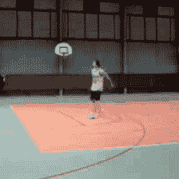
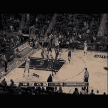

# 视频分类

> 原始文本：[`huggingface.co/docs/transformers/v4.37.2/en/tasks/video_classification`](https://huggingface.co/docs/transformers/v4.37.2/en/tasks/video_classification)

视频分类是将标签或类别分配给整个视频的任务。预期每个视频只有一个类别。视频分类模型将视频作为输入，并返回关于视频属于哪个类别的预测。这些模型可用于对视频内容进行分类。视频分类的现实应用是动作/活动识别，对于健身应用非常有用。对于视力受损的个体，尤其是在通勤时，这也是有帮助的。

本指南将向您展示如何：

1.  在[UCF101](https://www.crcv.ucf.edu/data/UCF101.php)数据集的子集上对[VideoMAE](https://huggingface.co/docs/transformers/main/en/model_doc/videomae)进行微调。

1.  使用您微调的模型进行推断。

本教程中所示的任务由以下模型架构支持：

TimeSformer, VideoMAE, ViViT

在开始之前，请确保您已安装所有必要的库：

```py
pip install -q pytorchvideo transformers evaluate
```

您将使用[PyTorchVideo](https://pytorchvideo.org/)（称为`pytorchvideo`）来处理和准备视频。

我们鼓励您登录您的 Hugging Face 帐户，这样您就可以上传和与社区分享您的模型。提示时，请输入您的令牌以登录：

```py
>>> from huggingface_hub import notebook_login

>>> notebook_login()
```

## 加载 UCF101 数据集

首先加载[UCF-101 数据集](https://www.crcv.ucf.edu/data/UCF101.php)的子集。这将让您有机会进行实验，并确保一切正常，然后再花更多时间在完整数据集上进行训练。

```py
>>> from huggingface_hub import hf_hub_download

>>> hf_dataset_identifier = "sayakpaul/ucf101-subset"
>>> filename = "UCF101_subset.tar.gz"
>>> file_path = hf_hub_download(repo_id=hf_dataset_identifier, filename=filename, repo_type="dataset")
```

在下载子集后，您需要提取压缩存档：

```py
>>> import tarfile

>>> with tarfile.open(file_path) as t:
...      t.extractall(".")
```

在高层次上，数据集的组织方式如下：

```py
UCF101_subset/
    train/
        BandMarching/
            video_1.mp4
            video_2.mp4
            ...
        Archery
            video_1.mp4
            video_2.mp4
            ...
        ...
    val/
        BandMarching/
            video_1.mp4
            video_2.mp4
            ...
        Archery
            video_1.mp4
            video_2.mp4
            ...
        ...
    test/
        BandMarching/
            video_1.mp4
            video_2.mp4
            ...
        Archery
            video_1.mp4
            video_2.mp4
            ...
        ...
```

（排序后的）视频路径看起来像这样：

```py
...
'UCF101_subset/train/ApplyEyeMakeup/v_ApplyEyeMakeup_g07_c04.avi',
'UCF101_subset/train/ApplyEyeMakeup/v_ApplyEyeMakeup_g07_c06.avi',
'UCF101_subset/train/ApplyEyeMakeup/v_ApplyEyeMakeup_g08_c01.avi',
'UCF101_subset/train/ApplyEyeMakeup/v_ApplyEyeMakeup_g09_c02.avi',
'UCF101_subset/train/ApplyEyeMakeup/v_ApplyEyeMakeup_g09_c06.avi'
...
```

您会注意到有属于同一组/场景的视频片段，其中组在视频文件路径中用`g`表示。例如，`v_ApplyEyeMakeup_g07_c04.avi`和`v_ApplyEyeMakeup_g07_c06.avi`。

对于验证和评估拆分，您不希望从同一组/场景中获取视频片段，以防止[数据泄漏](https://www.kaggle.com/code/alexisbcook/data-leakage)。本教程中使用的子集考虑了这些信息。

接下来，您将推导数据集中存在的标签集。还要创建两个在初始化模型时有用的字典：

+   `label2id`：将类名映射到整数。

+   `id2label`：将整数映射到类名。

```py
>>> class_labels = sorted({str(path).split("/")[2] for path in all_video_file_paths})
>>> label2id = {label: i for i, label in enumerate(class_labels)}
>>> id2label = {i: label for label, i in label2id.items()}

>>> print(f"Unique classes: {list(label2id.keys())}.")

# Unique classes: ['ApplyEyeMakeup', 'ApplyLipstick', 'Archery', 'BabyCrawling', 'BalanceBeam', 'BandMarching', 'BaseballPitch', 'Basketball', 'BasketballDunk', 'BenchPress'].
```

有 10 个独特的类别。每个类别在训练集中有 30 个视频。

## 加载一个模型进行微调

从预训练的检查点和其关联的图像处理器实例化一个视频分类模型。模型的编码器带有预训练参数，分类头是随机初始化的。当为我们的数据集编写预处理流水线时，图像处理器会派上用场。

```py
>>> from transformers import VideoMAEImageProcessor, VideoMAEForVideoClassification

>>> model_ckpt = "MCG-NJU/videomae-base"
>>> image_processor = VideoMAEImageProcessor.from_pretrained(model_ckpt)
>>> model = VideoMAEForVideoClassification.from_pretrained(
...     model_ckpt,
...     label2id=label2id,
...     id2label=id2label,
...     ignore_mismatched_sizes=True,  # provide this in case you're planning to fine-tune an already fine-tuned checkpoint
... )
```

当模型加载时，您可能会注意到以下警告：

```py
Some weights of the model checkpoint at MCG-NJU/videomae-base were not used when initializing VideoMAEForVideoClassification: [..., 'decoder.decoder_layers.1.attention.output.dense.bias', 'decoder.decoder_layers.2.attention.attention.key.weight']
- This IS expected if you are initializing VideoMAEForVideoClassification from the checkpoint of a model trained on another task or with another architecture (e.g. initializing a BertForSequenceClassification model from a BertForPreTraining model).
- This IS NOT expected if you are initializing VideoMAEForVideoClassification from the checkpoint of a model that you expect to be exactly identical (initializing a BertForSequenceClassification model from a BertForSequenceClassification model).
Some weights of VideoMAEForVideoClassification were not initialized from the model checkpoint at MCG-NJU/videomae-base and are newly initialized: ['classifier.bias', 'classifier.weight']
You should probably TRAIN this model on a down-stream task to be able to use it for predictions and inference.
```

警告告诉我们，我们正在丢弃一些权重（例如`classifier`层的权重和偏差），并随机初始化其他一些权重和偏差（新`classifier`层的权重和偏差）。在这种情况下，这是预期的，因为我们正在添加一个新的头部，我们没有预训练的权重，所以库警告我们在使用它进行推断之前应该微调这个模型，这正是我们要做的。

**请注意**，[此检查点](https://huggingface.co/MCG-NJU/videomae-base-finetuned-kinetics)在此任务上表现更好，因为该检查点是在一个具有相当大领域重叠的类似下游任务上微调得到的。您可以查看[此检查点](https://huggingface.co/sayakpaul/videomae-base-finetuned-kinetics-finetuned-ucf101-subset)，该检查点是通过微调`MCG-NJU/videomae-base-finetuned-kinetics`获得的。

## 为训练准备数据集

为了对视频进行预处理，您将利用[PyTorchVideo 库](https://pytorchvideo.org/)。首先导入我们需要的依赖项。

```py
>>> import pytorchvideo.data

>>> from pytorchvideo.transforms import (
...     ApplyTransformToKey,
...     Normalize,
...     RandomShortSideScale,
...     RemoveKey,
...     ShortSideScale,
...     UniformTemporalSubsample,
... )

>>> from torchvision.transforms import (
...     Compose,
...     Lambda,
...     RandomCrop,
...     RandomHorizontalFlip,
...     Resize,
... )
```

对于训练数据集的转换，使用统一的时间子采样、像素归一化、随机裁剪和随机水平翻转的组合。对于验证和评估数据集的转换，保持相同的转换链，除了随机裁剪和水平翻转。要了解这些转换的详细信息，请查看[PyTorchVideo 的官方文档](https://pytorchvideo.org)。

使用与预训练模型相关联的`image_processor`来获取以下信息：

+   用于归一化视频帧像素的图像均值和标准差。

+   将视频帧调整为的空间分辨率。

首先定义一些常量。

```py
>>> mean = image_processor.image_mean
>>> std = image_processor.image_std
>>> if "shortest_edge" in image_processor.size:
...     height = width = image_processor.size["shortest_edge"]
>>> else:
...     height = image_processor.size["height"]
...     width = image_processor.size["width"]
>>> resize_to = (height, width)

>>> num_frames_to_sample = model.config.num_frames
>>> sample_rate = 4
>>> fps = 30
>>> clip_duration = num_frames_to_sample * sample_rate / fps
```

现在，分别定义数据集特定的转换和数据集。从训练集开始：

```py
>>> train_transform = Compose(
...     [
...         ApplyTransformToKey(
...             key="video",
...             transform=Compose(
...                 [
...                     UniformTemporalSubsample(num_frames_to_sample),
...                     Lambda(lambda x: x / 255.0),
...                     Normalize(mean, std),
...                     RandomShortSideScale(min_size=256, max_size=320),
...                     RandomCrop(resize_to),
...                     RandomHorizontalFlip(p=0.5),
...                 ]
...             ),
...         ),
...     ]
... )

>>> train_dataset = pytorchvideo.data.Ucf101(
...     data_path=os.path.join(dataset_root_path, "train"),
...     clip_sampler=pytorchvideo.data.make_clip_sampler("random", clip_duration),
...     decode_audio=False,
...     transform=train_transform,
... )
```

相同的工作流程顺序可以应用于验证集和评估集：

```py
>>> val_transform = Compose(
...     [
...         ApplyTransformToKey(
...             key="video",
...             transform=Compose(
...                 [
...                     UniformTemporalSubsample(num_frames_to_sample),
...                     Lambda(lambda x: x / 255.0),
...                     Normalize(mean, std),
...                     Resize(resize_to),
...                 ]
...             ),
...         ),
...     ]
... )

>>> val_dataset = pytorchvideo.data.Ucf101(
...     data_path=os.path.join(dataset_root_path, "val"),
...     clip_sampler=pytorchvideo.data.make_clip_sampler("uniform", clip_duration),
...     decode_audio=False,
...     transform=val_transform,
... )

>>> test_dataset = pytorchvideo.data.Ucf101(
...     data_path=os.path.join(dataset_root_path, "test"),
...     clip_sampler=pytorchvideo.data.make_clip_sampler("uniform", clip_duration),
...     decode_audio=False,
...     transform=val_transform,
... )
```

**注意**：上述数据集管道取自[官方 PyTorchVideo 示例](https://pytorchvideo.org/docs/tutorial_classification#dataset)。我们使用[`pytorchvideo.data.Ucf101()`](https://pytorchvideo.readthedocs.io/en/latest/api/data/data.html#pytorchvideo.data.Ucf101)函数，因为它专为 UCF-101 数据集定制。在内部，它返回一个[`pytorchvideo.data.labeled_video_dataset.LabeledVideoDataset`](https://pytorchvideo.readthedocs.io/en/latest/api/data/data.html#pytorchvideo.data.LabeledVideoDataset)对象。`LabeledVideoDataset`类是 PyTorchVideo 数据集中所有视频相关内容的基类。因此，如果您想使用 PyTorchVideo 不支持的自定义数据集，可以相应地扩展`LabeledVideoDataset`类。请参考`data` API [文档](https://pytorchvideo.readthedocs.io/en/latest/api/data/data.html)以了解更多。此外，如果您的数据集遵循类似的结构（如上所示），那么使用`pytorchvideo.data.Ucf101()`应该可以正常工作。

您可以访问`num_videos`参数以了解数据集中的视频数量。

```py
>>> print(train_dataset.num_videos, val_dataset.num_videos, test_dataset.num_videos)
# (300, 30, 75)
```

## 可视化预处理后的视频以进行更好的调试

```py
>>> import imageio
>>> import numpy as np
>>> from IPython.display import Image

>>> def unnormalize_img(img):
...     """Un-normalizes the image pixels."""
...     img = (img * std) + mean
...     img = (img * 255).astype("uint8")
...     return img.clip(0, 255)

>>> def create_gif(video_tensor, filename="sample.gif"):
...     """Prepares a GIF from a video tensor.
...     
...     The video tensor is expected to have the following shape:
...     (num_frames, num_channels, height, width).
...     """
...     frames = []
...     for video_frame in video_tensor:
...         frame_unnormalized = unnormalize_img(video_frame.permute(1, 2, 0).numpy())
...         frames.append(frame_unnormalized)
...     kargs = {"duration": 0.25}
...     imageio.mimsave(filename, frames, "GIF", **kargs)
...     return filename

>>> def display_gif(video_tensor, gif_name="sample.gif"):
...     """Prepares and displays a GIF from a video tensor."""
...     video_tensor = video_tensor.permute(1, 0, 2, 3)
...     gif_filename = create_gif(video_tensor, gif_name)
...     return Image(filename=gif_filename)

>>> sample_video = next(iter(train_dataset))
>>> video_tensor = sample_video["video"]
>>> display_gif(video_tensor)
```



## 训练模型

利用🤗 Transformers 中的[`Trainer`](https://huggingface.co/docs/transformers/main_classes/trainer)来训练模型。要实例化一个`Trainer`，您需要定义训练配置和一个评估指标。最重要的是[`TrainingArguments`](https://huggingface.co/transformers/main_classes/trainer.html#transformers.TrainingArguments)，这是一个包含所有属性以配置训练的类。它需要一个输出文件夹名称，用于保存模型的检查点。它还有助于将模型存储库中的所有信息同步到🤗 Hub 中。

大多数训练参数都是不言自明的，但这里有一个非常重要的参数是`remove_unused_columns=False`。这个参数将删除模型调用函数未使用的任何特征。默认情况下是`True`，因为通常最好删除未使用的特征列，这样更容易将输入解压缩到模型的调用函数中。但是，在这种情况下，您需要未使用的特征（特别是‘video’）以便创建`pixel_values`（这是我们的模型在输入中期望的一个必需键）。

```py
>>> from transformers import TrainingArguments, Trainer

>>> model_name = model_ckpt.split("/")[-1]
>>> new_model_name = f"{model_name}-finetuned-ucf101-subset"
>>> num_epochs = 4

>>> args = TrainingArguments(
...     new_model_name,
...     remove_unused_columns=False,
...     evaluation_strategy="epoch",
...     save_strategy="epoch",
...     learning_rate=5e-5,
...     per_device_train_batch_size=batch_size,
...     per_device_eval_batch_size=batch_size,
...     warmup_ratio=0.1,
...     logging_steps=10,
...     load_best_model_at_end=True,
...     metric_for_best_model="accuracy",
...     push_to_hub=True,
...     max_steps=(train_dataset.num_videos // batch_size) * num_epochs,
... )
```

`pytorchvideo.data.Ucf101()`返回的数据集没有实现`__len__`方法。因此，在实例化`TrainingArguments`时，我们必须定义`max_steps`。

接下来，您需要定义一个函数来计算从预测中得出的指标，该函数将使用您现在将加载的`metric`。您唯一需要做的预处理是取出我们预测的 logits 的 argmax：

```py
import evaluate

metric = evaluate.load("accuracy")

def compute_metrics(eval_pred):
    predictions = np.argmax(eval_pred.predictions, axis=1)
    return metric.compute(predictions=predictions, references=eval_pred.label_ids)
```

**关于评估的说明**：

在[VideoMAE 论文](https://arxiv.org/abs/2203.12602)中，作者使用以下评估策略。他们在测试视频的几个剪辑上评估模型，并对这些剪辑应用不同的裁剪，并报告聚合得分。然而，出于简单和简洁的考虑，我们在本教程中不考虑这一点。

此外，定义一个`collate_fn`，用于将示例批处理在一起。每个批次包括 2 个键，即`pixel_values`和`labels`。

```py
>>> def collate_fn(examples):
...     # permute to (num_frames, num_channels, height, width)
...     pixel_values = torch.stack(
...         [example["video"].permute(1, 0, 2, 3) for example in examples]
...     )
...     labels = torch.tensor([example["label"] for example in examples])
...     return {"pixel_values": pixel_values, "labels": labels}
```

然后，将所有这些与数据集一起传递给`Trainer`：

```py
>>> trainer = Trainer(
...     model,
...     args,
...     train_dataset=train_dataset,
...     eval_dataset=val_dataset,
...     tokenizer=image_processor,
...     compute_metrics=compute_metrics,
...     data_collator=collate_fn,
... )
```

您可能想知道为什么在预处理数据时将`image_processor`作为标记器传递。这只是为了确保图像处理器配置文件（存储为 JSON）也将上传到 Hub 上的存储库中。

现在通过调用`train`方法对我们的模型进行微调：

```py
>>> train_results = trainer.train()
```

训练完成后，使用 push_to_hub()方法将您的模型共享到 Hub，以便每个人都可以使用您的模型：

```py
>>> trainer.push_to_hub()
```

## 推断

很好，现在您已经对模型进行了微调，可以将其用于推断！

加载视频进行推断：

```py
>>> sample_test_video = next(iter(test_dataset))
```



尝试使用您微调的模型进行推断的最简单方法是在[`pipeline`](https://huggingface.co/docs/transformers/main/en/main_classes/pipelines#transformers.VideoClassificationPipeline)中使用它。使用您的模型实例化一个视频分类的`pipeline`，并将视频传递给它：

```py
>>> from transformers import pipeline

>>> video_cls = pipeline(model="my_awesome_video_cls_model")
>>> video_cls("https://huggingface.co/datasets/sayakpaul/ucf101-subset/resolve/main/v_BasketballDunk_g14_c06.avi")
[{'score': 0.9272987842559814, 'label': 'BasketballDunk'},
 {'score': 0.017777055501937866, 'label': 'BabyCrawling'},
 {'score': 0.01663011871278286, 'label': 'BalanceBeam'},
 {'score': 0.009560945443809032, 'label': 'BandMarching'},
 {'score': 0.0068979403004050255, 'label': 'BaseballPitch'}]
```

如果愿意，您也可以手动复制`pipeline`的结果。

```py
>>> def run_inference(model, video):
...     # (num_frames, num_channels, height, width)
...     perumuted_sample_test_video = video.permute(1, 0, 2, 3)
...     inputs = {
...         "pixel_values": perumuted_sample_test_video.unsqueeze(0),
...         "labels": torch.tensor(
...             [sample_test_video["label"]]
...         ),  # this can be skipped if you don't have labels available.
...     }

...     device = torch.device("cuda" if torch.cuda.is_available() else "cpu")
...     inputs = {k: v.to(device) for k, v in inputs.items()}
...     model = model.to(device)

...     # forward pass
...     with torch.no_grad():
...         outputs = model(**inputs)
...         logits = outputs.logits

...     return logits
```

现在，将您的输入传递给模型并返回`logits`：

```py
>>> logits = run_inference(trained_model, sample_test_video["video"])
```

解码`logits`，我们得到：

```py
>>> predicted_class_idx = logits.argmax(-1).item()
>>> print("Predicted class:", model.config.id2label[predicted_class_idx])
# Predicted class: BasketballDunk
```
