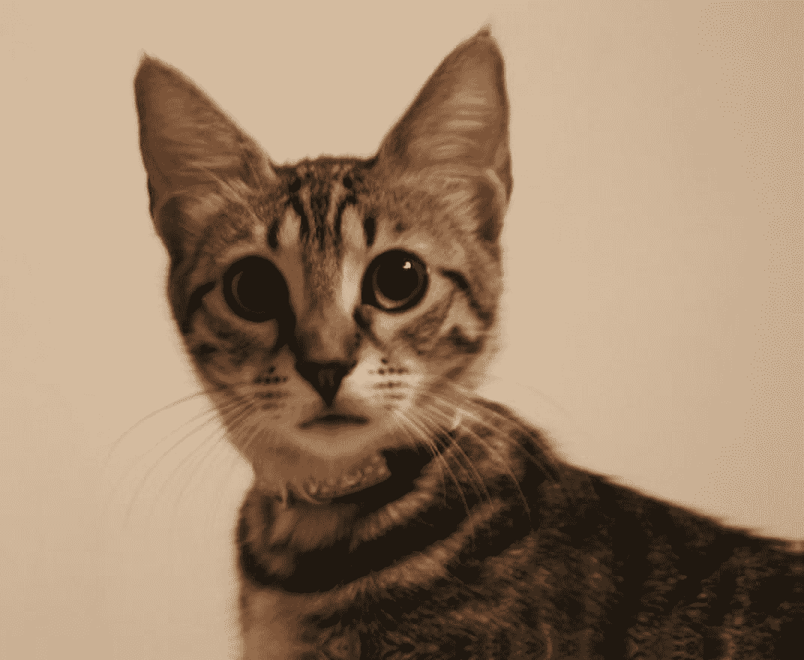

# 图像到图像任务指南

> 原文链接：[`huggingface.co/docs/transformers/v4.37.2/en/tasks/image_to_image`](https://huggingface.co/docs/transformers/v4.37.2/en/tasks/image_to_image)

图像到图像任务是一个应用程序接收图像并输出另一幅图像的任务。这包括各种子任务，包括图像增强（超分辨率、低光增强、去雨等）、图像修补等。

本指南将向您展示如何：

+   使用图像到图像管道进行超分辨率任务，

+   运行相同任务的图像到图像模型，而不使用管道。

请注意，截至本指南发布时，`图像到图像`管道仅支持超分辨率任务。

让我们开始安装必要的库。

```py
pip install transformers
```

现在我们可以使用[Swin2SR 模型](https://huggingface.co/caidas/swin2SR-lightweight-x2-64)初始化管道。然后，通过调用图像来推断管道。目前，此管道仅支持[Swin2SR 模型](https://huggingface.co/models?sort=trending&search=swin2sr)。

```py
from transformers import pipeline

device = torch.device('cuda' if torch.cuda.is_available() else 'cpu')
pipe = pipeline(task="image-to-image", model="caidas/swin2SR-lightweight-x2-64", device=device)
```

现在，让我们加载一张图像。

```py
from PIL import Image
import requests

url = "https://huggingface.co/datasets/huggingface/documentation-images/resolve/main/transformers/tasks/cat.jpg"
image = Image.open(requests.get(url, stream=True).raw)

print(image.size)
```

```py
# (532, 432)
```


现在我们可以使用管道进行推断。我们将得到一张猫图像的放大版本。

```py
upscaled = pipe(image)
print(upscaled.size)
```

```py
# (1072, 880)
```

如果您希望自己进行推断而不使用管道，可以使用 transformers 的`Swin2SRForImageSuperResolution`和`Swin2SRImageProcessor`类。我们将使用相同的模型检查点。让我们初始化模型和处理器。

```py
from transformers import Swin2SRForImageSuperResolution, Swin2SRImageProcessor 

model = Swin2SRForImageSuperResolution.from_pretrained("caidas/swin2SR-lightweight-x2-64").to(device)
processor = Swin2SRImageProcessor("caidas/swin2SR-lightweight-x2-64")
```

`pipeline`抽象了我们必须自己完成的预处理和后处理步骤，因此让我们对图像进行预处理。我们将图像传递给处理器，然后将像素值移动到 GPU。

```py
pixel_values = processor(image, return_tensors="pt").pixel_values
print(pixel_values.shape)

pixel_values = pixel_values.to(device)
```

现在我们可以通过将像素值传递给模型来推断图像。

```py
import torch

with torch.no_grad():
  outputs = model(pixel_values)
```

输出是一个类型为`ImageSuperResolutionOutput`的对象，看起来像下面这样👇

```py
(loss=None, reconstruction=tensor([[[[0.8270, 0.8269, 0.8275,  ..., 0.7463, 0.7446, 0.7453],
          [0.8287, 0.8278, 0.8283,  ..., 0.7451, 0.7448, 0.7457],
          [0.8280, 0.8273, 0.8269,  ..., 0.7447, 0.7446, 0.7452],
          ...,
          [0.5923, 0.5933, 0.5924,  ..., 0.0697, 0.0695, 0.0706],
          [0.5926, 0.5932, 0.5926,  ..., 0.0673, 0.0687, 0.0705],
          [0.5927, 0.5914, 0.5922,  ..., 0.0664, 0.0694, 0.0718]]]],
       device='cuda:0'), hidden_states=None, attentions=None)
```

我们需要获取`reconstruction`并对其进行后处理以进行可视化。让我们看看它是什么样子的。

```py
outputs.reconstruction.data.shape
# torch.Size([1, 3, 880, 1072])
```

我们需要挤压输出并去掉轴 0，裁剪值，然后将其转换为 numpy 浮点数。然后我们将排列轴以获得形状[1072, 880]，最后将输出带回范围[0, 255]。

```py
import numpy as np

# squeeze, take to CPU and clip the values
output = outputs.reconstruction.data.squeeze().cpu().clamp_(0, 1).numpy()
# rearrange the axes
output = np.moveaxis(output, source=0, destination=-1)
# bring values back to pixel values range
output = (output * 255.0).round().astype(np.uint8)
Image.fromarray(output)
```


