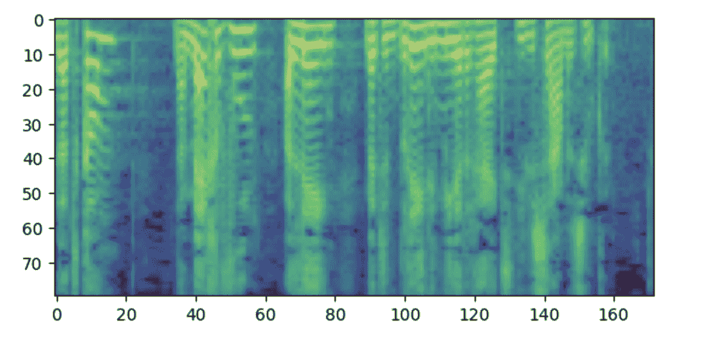

# 文本到语音

> 原始文本：[`huggingface.co/docs/transformers/v4.37.2/en/tasks/text-to-speech`](https://huggingface.co/docs/transformers/v4.37.2/en/tasks/text-to-speech)

文本到语音（TTS）是从文本创建自然语音的任务，语音可以用多种语言和多个说话者生成。目前在🤗 Transformers 中有几种文本到语音模型，如 Bark、MMS、VITS 和 SpeechT5。

您可以轻松使用`"text-to-audio"`流水线（或其别名`"text-to-speech"`）生成音频。一些模型，如 Bark，还可以被调节以生成非语言交流，如笑声、叹息和哭泣，甚至添加音乐。以下是您如何使用`"text-to-speech"`流水线与 Bark 的示例：

```py
>>> from transformers import pipeline

>>> pipe = pipeline("text-to-speech", model="suno/bark-small")
>>> text = "[clears throat] This is a test ... and I just took a long pause."
>>> output = pipe(text)
```

以下是一个代码片段，您可以使用它在笔记本中听取生成的音频：

```py
>>> from IPython.display import Audio
>>> Audio(output["audio"], rate=output["sampling_rate"])
```

有关 Bark 和其他预训练 TTS 模型的更多示例，请参考我们的[音频课程](https://huggingface.co/learn/audio-course/chapter6/pre-trained_models)。

如果您想要微调 TTS 模型，目前在🤗 Transformers 中唯一可用的文本到语音模型是 SpeechT5 和 FastSpeech2Conformer，未来将会添加更多。SpeechT5 在文本到语音和语音到文本数据的组合上进行了预训练，使其能够学习文本和语音共享的隐藏表示空间。这意味着相同的预训练模型可以用于不同的任务。此外，SpeechT5 通过 x-vector 说话者嵌入支持多个说话者。

本指南的其余部分将说明如何：

1.  微调 SpeechT5，该模型最初是在英语语音上进行训练的，在[VoxPopuli](https://huggingface.co/datasets/facebook/voxpopuli)数据集的荷兰语（`nl`）语言子集上。

1.  使用您精炼的模型进行推理的两种方式之一：使用流水线或直接。

在开始之前，请确保已安装所有必要的库：

```py
pip install datasets soundfile speechbrain accelerate
```

从源代码安装🤗Transformers，因为并非所有 SpeechT5 功能都已合并到官方发布中：

```py
pip install git+https://github.com/huggingface/transformers.git
```

要按照本指南操作，您将需要一个 GPU。如果您在笔记本中工作，请运行以下命令以检查 GPU 是否可用：

```py
!nvidia-smi
```

或者适用于 AMD GPU：

```py
!rocm-smi
```

我们鼓励您登录您的 Hugging Face 账户，将您的模型上传并与社区分享。在提示时，输入您的令牌以登录：

```py
>>> from huggingface_hub import notebook_login

>>> notebook_login()
```

## 加载数据集

[VoxPopuli](https://huggingface.co/datasets/facebook/voxpopuli)是一个大规模的多语音语料库，包含 2009-2020 年欧洲议会活动录音的数据。它包含了 15 种欧洲语言的带标签音频转录数据。在本指南中，我们使用荷兰语子集，可以随意选择其他子集。

请注意，VoxPopuli 或任何其他自动语音识别（ASR）数据集可能不是训练 TTS 模型的最佳选择。对于 ASR 有益的特性，如过多的背景噪音，在 TTS 中通常是不希望的。然而，找到高质量、多语言和多说话者的 TTS 数据集可能会非常具有挑战性。

让我们加载数据：

```py
>>> from datasets import load_dataset, Audio

>>> dataset = load_dataset("facebook/voxpopuli", "nl", split="train")
>>> len(dataset)
20968
```

20968 个示例应该足够进行微调。SpeechT5 期望音频数据的采样率为 16 kHz，因此请确保数据集中的示例符合此要求：

```py
dataset = dataset.cast_column("audio", Audio(sampling_rate=16000))
```

## 预处理数据

让我们首先定义要使用的模型检查点并加载适当的处理器：

```py
>>> from transformers import SpeechT5Processor

>>> checkpoint = "microsoft/speecht5_tts"
>>> processor = SpeechT5Processor.from_pretrained(checkpoint)
```

### SpeechT5 分词的文本清理

首先清理文本数据。您将需要处理文本的分词器部分：

```py
>>> tokenizer = processor.tokenizer
```

数据集示例包含`raw_text`和`normalized_text`特征。在决定使用哪个特征作为文本输入时，请考虑 SpeechT5 分词器没有任何数字标记。在`normalized_text`中，数字被写成文本。因此，它更适合，我们建议使用`normalized_text`作为输入文本。

因为 SpeechT5 是在英语上进行训练的，可能无法识别荷兰数据集中的某些字符。如果保持原样，这些字符将被转换为`<unk>`标记。然而，在荷兰语中，像`à`这样的特定字符用于强调音节。为了保留文本的含义，我们可以用普通的`a`替换这个字符。

为了识别不支持的标记，使用`SpeechT5Tokenizer`提取数据集中的所有唯一字符，该分词器使用字符作为标记。为此，编写`extract_all_chars`映射函数，将所有示例的转录连接成一个字符串，并将其转换为字符集。确保在`dataset.map()`中设置`batched=True`和`batch_size=-1`，以便所有转录都可以一次性用于映射函数。

```py
>>> def extract_all_chars(batch):
...     all_text = " ".join(batch["normalized_text"])
...     vocab = list(set(all_text))
...     return {"vocab": [vocab], "all_text": [all_text]}

>>> vocabs = dataset.map(
...     extract_all_chars,
...     batched=True,
...     batch_size=-1,
...     keep_in_memory=True,
...     remove_columns=dataset.column_names,
... )

>>> dataset_vocab = set(vocabs["vocab"][0])
>>> tokenizer_vocab = {k for k, _ in tokenizer.get_vocab().items()}
```

现在您有两组字符：一组来自数据集的词汇表，另一组来自分词器的词汇表。为了识别数据集中的任何不支持的字符，您可以取这两组之间的差集。结果集将包含数据集中存在但不在分词器中的字符。

```py
>>> dataset_vocab - tokenizer_vocab
{' ', 'à', 'ç', 'è', 'ë', 'í', 'ï', 'ö', 'ü'}
```

为了处理前一步骤中识别出的不支持的字符，定义一个函数，将这些字符映射到有效的标记。请注意，分词器中的空格已经被替换为`▁`，不需要单独处理。

```py
>>> replacements = [
...     ("à", "a"),
...     ("ç", "c"),
...     ("è", "e"),
...     ("ë", "e"),
...     ("í", "i"),
...     ("ï", "i"),
...     ("ö", "o"),
...     ("ü", "u"),
... ]

>>> def cleanup_text(inputs):
...     for src, dst in replacements:
...         inputs["normalized_text"] = inputs["normalized_text"].replace(src, dst)
...     return inputs

>>> dataset = dataset.map(cleanup_text)
```

现在您已经处理了文本中的特殊字符，是时候将重点转移到音频数据上了。

### 发言者

VoxPopuli 数据集包含多位发言者的讲话，但数据集中代表了多少位发言者？为了确定这一点，我们可以计算独特发言者的数量以及每位发言者对数据集的贡献示例数量。在数据集中共有 20,968 个示例，这些信息将帮助我们更好地了解数据中发言者和示例的分布。

```py
>>> from collections import defaultdict

>>> speaker_counts = defaultdict(int)

>>> for speaker_id in dataset["speaker_id"]:
...     speaker_counts[speaker_id] += 1
```

通过绘制直方图，您可以了解每位发言者的数据量。

```py
>>> import matplotlib.pyplot as plt

>>> plt.figure()
>>> plt.hist(speaker_counts.values(), bins=20)
>>> plt.ylabel("Speakers")
>>> plt.xlabel("Examples")
>>> plt.show()
```


直方图显示，数据集中大约三分之一的发言者拥有少于 100 个示例，而大约有十位发言者拥有超过 500 个示例。为了提高训练效率并平衡数据集，我们可以将数据限制在具有 100 到 400 个示例之间的发言者。

```py
>>> def select_speaker(speaker_id):
...     return 100 <= speaker_counts[speaker_id] <= 400

>>> dataset = dataset.filter(select_speaker, input_columns=["speaker_id"])
```

让我们检查还剩下多少发言者：

```py
>>> len(set(dataset["speaker_id"]))
42
```

让我们看看还剩下多少示例：

```py
>>> len(dataset)
9973
```

您现在剩下大约 40 位独特发言者的不到 10,000 个示例，这应该足够了。

请注意，一些示例较少的发言者实际上可能有更多的音频可用，如果示例很长。然而，确定每位发言者的总音频量需要扫描整个数据集，这是一个耗时的过程，涉及加载和解码每个音频文件。因此，我们选择跳过这一步骤。

### 发言者嵌入

为了使 TTS 模型能够区分多个发言者，您需要为每个示例创建一个发言者嵌入。发言者嵌入是模型的另一个输入，捕捉特定发言者的语音特征。为了生成这些发言者嵌入，使用 SpeechBrain 中的预训练[spkrec-xvect-voxceleb](https://huggingface.co/speechbrain/spkrec-xvect-voxceleb)模型。

创建一个名为`create_speaker_embedding()`的函数，该函数接受输入音频波形，并输出一个包含相应发言者嵌入的 512 元素向量。

```py
>>> import os
>>> import torch
>>> from speechbrain.pretrained import EncoderClassifier

>>> spk_model_name = "speechbrain/spkrec-xvect-voxceleb"

>>> device = "cuda" if torch.cuda.is_available() else "cpu"
>>> speaker_model = EncoderClassifier.from_hparams(
...     source=spk_model_name,
...     run_opts={"device": device},
...     savedir=os.path.join("/tmp", spk_model_name),
... )

>>> def create_speaker_embedding(waveform):
...     with torch.no_grad():
...         speaker_embeddings = speaker_model.encode_batch(torch.tensor(waveform))
...         speaker_embeddings = torch.nn.functional.normalize(speaker_embeddings, dim=2)
...         speaker_embeddings = speaker_embeddings.squeeze().cpu().numpy()
...     return speaker_embeddings
```

重要的是要注意，`speechbrain/spkrec-xvect-voxceleb`模型是在 VoxCeleb 数据集的英语语音上训练的，而本指南中的训练示例是荷兰语。虽然我们相信这个模型仍然会为我们的荷兰数据集生成合理的说话者嵌入，但这种假设在所有情况下可能并不成立。

为了获得最佳结果，我们建议首先在目标语音上训练一个 X-vector 模型。这将确保模型更好地捕捉荷兰语中存在的独特语音特征。

### 处理数据集

最后，让我们将数据处理成模型期望的格式。创建一个`prepare_dataset`函数，该函数接受一个单个示例，并使用`SpeechT5Processor`对象对输入文本进行标记化，并将目标音频加载到对数梅尔频谱图中。它还应该添加说话者嵌入作为额外输入。

```py
>>> def prepare_dataset(example):
...     audio = example["audio"]

...     example = processor(
...         text=example["normalized_text"],
...         audio_target=audio["array"],
...         sampling_rate=audio["sampling_rate"],
...         return_attention_mask=False,
...     )

...     # strip off the batch dimension
...     example["labels"] = example["labels"][0]

...     # use SpeechBrain to obtain x-vector
...     example["speaker_embeddings"] = create_speaker_embedding(audio["array"])

...     return example
```

通过查看单个示例来验证处理是否正确：

```py
>>> processed_example = prepare_dataset(dataset[0])
>>> list(processed_example.keys())
['input_ids', 'labels', 'stop_labels', 'speaker_embeddings']
```

说话者嵌入应该是一个 512 元素向量：

```py
>>> processed_example["speaker_embeddings"].shape
(512,)
```

标签应该是一个具有 80 个 mel 频率箱的对数梅尔频谱图。

```py
>>> import matplotlib.pyplot as plt

>>> plt.figure()
>>> plt.imshow(processed_example["labels"].T)
>>> plt.show()
```



侧记：如果您觉得这个频谱图令人困惑，可能是因为您熟悉将低频放在底部，高频放在顶部的惯例。然而，在使用 matplotlib 库将频谱图绘制为图像时，y 轴是翻转的，频谱图看起来是倒置的。

现在将处理函数应用于整个数据集。这将需要 5 到 10 分钟。

```py
>>> dataset = dataset.map(prepare_dataset, remove_columns=dataset.column_names)
```

您将看到一个警告，说数据集中的一些示例比模型可以处理的最大输入长度（600 个标记）要长。从数据集中删除这些示例。在这里，我们甚至进一步去除了超过 200 个标记的任何内容，以允许更大的批次大小。

```py
>>> def is_not_too_long(input_ids):
...     input_length = len(input_ids)
...     return input_length < 200

>>> dataset = dataset.filter(is_not_too_long, input_columns=["input_ids"])
>>> len(dataset)
8259
```

接下来，创建一个基本的训练/测试拆分：

```py
>>> dataset = dataset.train_test_split(test_size=0.1)
```

### 数据整理器

为了将多个示例组合成一个批次，您需要定义一个自定义数据整理器。这个整理器将用填充标记填充较短的序列，确保所有示例具有相同的长度。对于频谱图标签，填充部分将替换为特殊值`-100`。这个特殊值指示模型在计算频谱图损失时忽略该部分频谱图。

```py
>>> from dataclasses import dataclass
>>> from typing import Any, Dict, List, Union

>>> @dataclass
... class TTSDataCollatorWithPadding:
...     processor: Any

...     def __call__(self, features: List[Dict[str, Union[List[int], torch.Tensor]]]) -> Dict[str, torch.Tensor]:
...         input_ids = [{"input_ids": feature["input_ids"]} for feature in features]
...         label_features = [{"input_values": feature["labels"]} for feature in features]
...         speaker_features = [feature["speaker_embeddings"] for feature in features]

...         # collate the inputs and targets into a batch
...         batch = processor.pad(input_ids=input_ids, labels=label_features, return_tensors="pt")

...         # replace padding with -100 to ignore loss correctly
...         batch["labels"] = batch["labels"].masked_fill(batch.decoder_attention_mask.unsqueeze(-1).ne(1), -100)

...         # not used during fine-tuning
...         del batch["decoder_attention_mask"]

...         # round down target lengths to multiple of reduction factor
...         if model.config.reduction_factor > 1:
...             target_lengths = torch.tensor([len(feature["input_values"]) for feature in label_features])
...             target_lengths = target_lengths.new(
...                 [length - length % model.config.reduction_factor for length in target_lengths]
...             )
...             max_length = max(target_lengths)
...             batch["labels"] = batch["labels"][:, :max_length]

...         # also add in the speaker embeddings
...         batch["speaker_embeddings"] = torch.tensor(speaker_features)

...         return batch
```

在 SpeechT5 中，模型的解码器部分的输入减少了 2 倍。换句话说，它会丢弃目标序列中的每隔一个时间步。然后解码器会预测一个长度是原来两倍的序列。由于原始目标序列长度可能是奇数，数据整理器确保将批次的最大长度向下舍入为 2 的倍数。

```py
>>> data_collator = TTSDataCollatorWithPadding(processor=processor)
```

## 训练模型

从与您用于加载处理器的相同检查点加载预训练模型：

```py
>>> from transformers import SpeechT5ForTextToSpeech

>>> model = SpeechT5ForTextToSpeech.from_pretrained(checkpoint)
```

`use_cache=True`选项与梯度检查点不兼容。在训练时禁用它。

```py
>>> model.config.use_cache = False
```

定义训练参数。在训练过程中，我们不计算任何评估指标。相反，我们只关注损失：

```py
>>> from transformers import Seq2SeqTrainingArguments

>>> training_args = Seq2SeqTrainingArguments(
...     output_dir="speecht5_finetuned_voxpopuli_nl",  # change to a repo name of your choice
...     per_device_train_batch_size=4,
...     gradient_accumulation_steps=8,
...     learning_rate=1e-5,
...     warmup_steps=500,
...     max_steps=4000,
...     gradient_checkpointing=True,
...     fp16=True,
...     evaluation_strategy="steps",
...     per_device_eval_batch_size=2,
...     save_steps=1000,
...     eval_steps=1000,
...     logging_steps=25,
...     report_to=["tensorboard"],
...     load_best_model_at_end=True,
...     greater_is_better=False,
...     label_names=["labels"],
...     push_to_hub=True,
... )
```

实例化`Trainer`对象，并将模型、数据集和数据整理器传递给它。

```py
>>> from transformers import Seq2SeqTrainer

>>> trainer = Seq2SeqTrainer(
...     args=training_args,
...     model=model,
...     train_dataset=dataset["train"],
...     eval_dataset=dataset["test"],
...     data_collator=data_collator,
...     tokenizer=processor,
... )
```

有了这些，您现在可以开始训练了！训练将需要几个小时。根据您的 GPU，当您开始训练时可能会遇到 CUDA“内存不足”错误。在这种情况下，您可以逐步减少`per_device_train_batch_size`，每次减少 2 倍，并将`gradient_accumulation_steps`增加 2 倍以补偿。

```py
>>> trainer.train()
```

为了能够使用您的检查点进行管道处理，请确保将处理器与检查点一起保存：

```py
>>> processor.save_pretrained("YOUR_ACCOUNT_NAME/speecht5_finetuned_voxpopuli_nl")
```

将最终模型推送到🤗 Hub：

```py
>>> trainer.push_to_hub()
```

## 推断

### 使用管道进行推断

很好，现在您已经对模型进行了微调，可以用它进行推断了！首先，让我们看看如何在相应的管道中使用它。让我们使用您的检查点创建一个`"text-to-speech"`管道：

```py
>>> from transformers import pipeline

>>> pipe = pipeline("text-to-speech", model="YOUR_ACCOUNT_NAME/speecht5_finetuned_voxpopuli_nl")
```

选择一段荷兰语文本，例如：

```py
>>> text = "hallo allemaal, ik praat nederlands. groetjes aan iedereen!"
```

要在管道中使用 SpeechT5，您需要一个说话者嵌入。让我们从测试数据集中的一个示例中获取它：

```py
>>> example = dataset["test"][304]
>>> speaker_embeddings = torch.tensor(example["speaker_embeddings"]).unsqueeze(0)
```

现在您可以将文本和说话者嵌入传递给管道，它会处理剩下的部分：

```py
>>> forward_params = {"speaker_embeddings": speaker_embeddings}
>>> output = pipe(text, forward_params=forward_params)
>>> output
{'audio': array([-6.82714235e-05, -4.26525949e-04,  1.06134125e-04, ...,
        -1.22392643e-03, -7.76011671e-04,  3.29112721e-04], dtype=float32),
 'sampling_rate': 16000}
```

然后您可以听结果：

```py
>>> from IPython.display import Audio
>>> Audio(output['audio'], rate=output['sampling_rate']) 
```

### 手动运行推断

您可以在不使用管道的情况下实现相同的推断结果，但是需要更多的步骤。

从🤗 Hub 加载模型：

```py
>>> model = SpeechT5ForTextToSpeech.from_pretrained("YOUR_ACCOUNT/speecht5_finetuned_voxpopuli_nl")
```

从测试数据集中选择一个示例获取说话者嵌入。

```py
>>> example = dataset["test"][304]
>>> speaker_embeddings = torch.tensor(example["speaker_embeddings"]).unsqueeze(0)
```

定义输入文本并对其进行标记化。

```py
>>> text = "hallo allemaal, ik praat nederlands. groetjes aan iedereen!"
>>> inputs = processor(text=text, return_tensors="pt")
```

使用您的模型创建一个频谱图：

```py
>>> spectrogram = model.generate_speech(inputs["input_ids"], speaker_embeddings)
```

如果您愿意，可视化频谱图：

```py
>>> plt.figure()
>>> plt.imshow(spectrogram.T)
>>> plt.show()
```

！[生成的对数梅尔频谱图]（../Images/8bcf491c8356ebfa61722c3c271cd0f7.png）

最后，使用声码器将频谱图转换为声音。

```py
>>> with torch.no_grad():
...     speech = vocoder(spectrogram)

>>> from IPython.display import Audio

>>> Audio(speech.numpy(), rate=16000)
```

根据我们的经验，从这个模型获得令人满意的结果可能具有挑战性。说话者嵌入的质量似乎是一个重要因素。由于 SpeechT5 是用英语 x-vectors 预训练的，因此在使用英语说话者嵌入时表现最佳。如果合成的语音听起来很差，尝试使用不同的说话者嵌入。

增加训练持续时间也可能会提高结果的质量。即使如此，语音明显是荷兰语而不是英语，并且它捕捉到说话者的声音特征（与示例中的原始音频进行比较）。另一个要尝试的是模型的配置。例如，尝试使用`config.reduction_factor = 1`，看看是否会改善结果。

最后，重要的是考虑道德考量。尽管 TTS 技术有许多有用的应用，但也可能被用于恶意目的，例如未经他们的知识或同意冒充某人的声音。请明智和负责任地使用 TTS。
