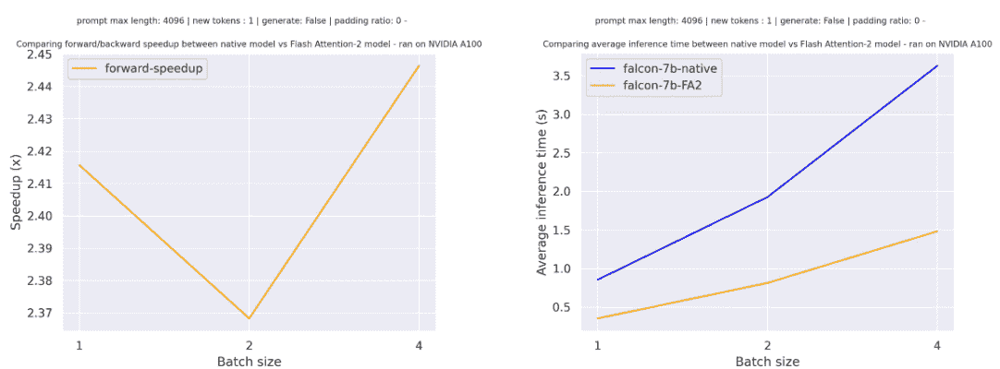
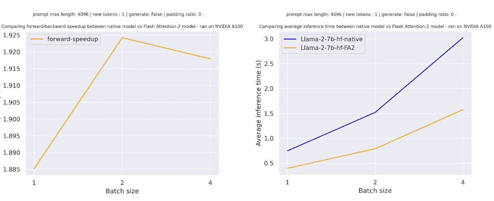
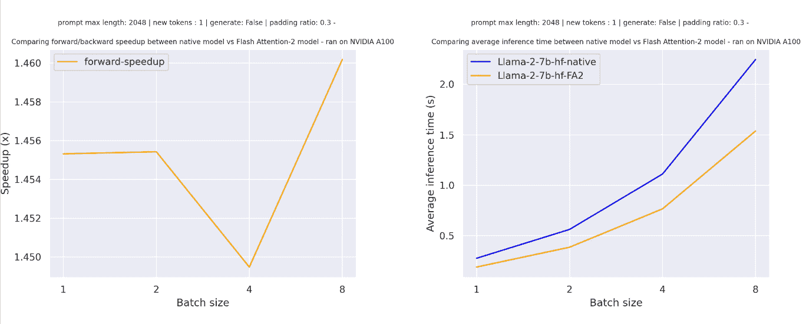

# GPU 推理

> 原文：[`huggingface.co/docs/transformers/v4.37.2/en/perf_infer_gpu_one`](https://huggingface.co/docs/transformers/v4.37.2/en/perf_infer_gpu_one)

与 CPU 不同，GPU 是机器学习的标准硬件选择，因为它们针对内存带宽和并行性进行了优化。为了跟上现代模型的更大尺寸或在现有和较旧的硬件上运行这些大型模型，您可以使用几种优化方法来加速 GPU 推理。在本指南中，您将学习如何使用 FlashAttention-2（一种更节省内存的注意力机制）、BetterTransformer（PyTorch 本地快速执行路径）和 bitsandbytes 将模型量化为较低精度。最后，学习如何使用🤗 Optimum 在 Nvidia 和 AMD GPU 上加速推理。

这里描述的大多数优化也适用于多 GPU 设置！

## FlashAttention-2

FlashAttention-2 是实验性的，未来版本可能会发生较大变化。

[FlashAttention-2](https://huggingface.co/papers/2205.14135)是标准注意力机制的更快、更高效的实现，可以通过以下方式显著加速推理：

1.  此外，可以通过在序列长度上并行化注意力计算来优化

1.  将工作分区在 GPU 线程之间，以减少它们之间的通信和共享内存读/写

目前支持以下架构的 FlashAttention-2：

+   [Bark](https://huggingface.co/docs/transformers/model_doc/bark#transformers.BarkModel)

+   [Bart](https://huggingface.co/docs/transformers/model_doc/bart#transformers.BartModel)

+   [DistilBert](https://huggingface.co/docs/transformers/model_doc/distilbert#transformers.DistilBertModel)

+   [GPTBigCode](https://huggingface.co/docs/transformers/model_doc/gpt_bigcode#transformers.GPTBigCodeModel)

+   [GPTNeo](https://huggingface.co/docs/transformers/model_doc/gpt_neo#transformers.GPTNeoModel)

+   [GPTNeoX](https://huggingface.co/docs/transformers/model_doc/gpt_neox#transformers.GPTNeoXModel)

+   [Falcon](https://huggingface.co/docs/transformers/model_doc/falcon#transformers.FalconModel)

+   [Llama](https://huggingface.co/docs/transformers/model_doc/llama#transformers.LlamaModel)

+   [Llava](https://huggingface.co/docs/transformers/model_doc/llava)

+   [VipLlava](https://huggingface.co/docs/transformers/model_doc/vipllava)

+   [MBart](https://huggingface.co/docs/transformers/model_doc/mbart#transformers.MBartModel)

+   [Mistral](https://huggingface.co/docs/transformers/model_doc/mistral#transformers.MistralModel)

+   [Mixtral](https://huggingface.co/docs/transformers/model_doc/mixtral#transformers.MixtralModel)

+   [OPT](https://huggingface.co/docs/transformers/model_doc/opt#transformers.OPTModel)

+   [Phi](https://huggingface.co/docs/transformers/model_doc/phi#transformers.PhiModel)

+   [Qwen2](https://huggingface.co/docs/transformers/model_doc/qwen2#transformers.Qwen2Model)

+   [Whisper](https://huggingface.co/docs/transformers/model_doc/whisper#transformers.WhisperModel)

您可以通过打开 GitHub Issue 或 Pull Request 来请求为另一个模型添加 FlashAttention-2 支持。

在开始之前，请确保已安装 FlashAttention-2。

NVIDIAAMD

```py
pip install flash-attn --no-build-isolation
```

我们强烈建议参考详细的[安装说明](https://github.com/Dao-AILab/flash-attention?tab=readme-ov-file#installation-and-features)以了解更多支持的硬件和数据类型！

要启用 FlashAttention-2，请将参数`attn_implementation="flash_attention_2"`传递给 from_pretrained()：

```py
import torch
from transformers import AutoModelForCausalLM, AutoTokenizer, LlamaForCausalLM

model_id = "tiiuae/falcon-7b"
tokenizer = AutoTokenizer.from_pretrained(model_id)

model = AutoModelForCausalLM.from_pretrained(
    model_id, 
    torch_dtype=torch.bfloat16, 
    attn_implementation="flash_attention_2",
)
```

只有当模型的 dtype 为`fp16`或`bf16`时，才能使用 FlashAttention-2。在使用 FlashAttention-2 之前，请确保将模型转换为适当的 dtype 并加载到支持的设备上。

您还可以设置`use_flash_attention_2=True`来启用 FlashAttention-2，但已被弃用，推荐使用`attn_implementation="flash_attention_2"`。

FlashAttention-2 可以与其他优化技术（如量化）结合，以进一步加速推理。例如，您可以将 FlashAttention-2 与 8 位或 4 位量化结合使用：

```py
import torch
from transformers import AutoModelForCausalLM, AutoTokenizer, LlamaForCausalLM

model_id = "tiiuae/falcon-7b"
tokenizer = AutoTokenizer.from_pretrained(model_id)

# load in 8bit
model = AutoModelForCausalLM.from_pretrained(
    model_id, 
    load_in_8bit=True,
    attn_implementation="flash_attention_2",
)

# load in 4bit
model = AutoModelForCausalLM.from_pretrained(
    model_id, 
    load_in_4bit=True,
    attn_implementation="flash_attention_2",
)
```

### 预期的加速

您可以从推理中获得相当大的加速，特别是对于具有长序列的输入。但是，由于 FlashAttention-2 不支持使用填充令牌计算注意力分数，因此在序列包含填充令牌时，您必须手动填充/取消填充注意力分数以进行批量推理。这会导致使用填充令牌进行批量生成时出现显着减速。

为了克服这一点，在训练期间应该使用不带填充令牌的 FlashAttention-2（通过打包数据集或[连接序列](https://github.com/huggingface/transformers/blob/main/examples/pytorch/language-modeling/run_clm.py#L516)直到达到最大序列长度）。

对于在[tiiuae/falcon-7b](https://hf.co/tiiuae/falcon-7b)上进行单次前向传递，序列长度为 4096，各种批量大小且没有填充令牌，预期的加速是：



对于在[meta-llama/Llama-7b-hf](https://hf.co/meta-llama/Llama-7b-hf)上进行单次前向传递，序列长度为 4096，各种批量大小且没有填充令牌，预期的加速是：



对于具有填充令牌的序列（使用填充令牌生成），您需要取消填充/填充输入序列以正确计算注意力分数。对于相对较小的序列长度，单次前向传递会产生额外开销，导致轻微加速（在下面的示例中，输入的 30%填充有填充令牌）：


但是对于更大的序列长度，您可以期望获得更多的加速效益：

FlashAttention 更具内存效率，这意味着您可以在更大的序列长度上进行训练，而不会遇到内存不足的问题。对于更大的序列长度，您可以将内存使用量降低多达 20 倍。查看[flash-attention](https://github.com/Dao-AILab/flash-attention)存储库以获取更多详细信息。



## PyTorch 缩放点积注意力

PyTorch 的[`torch.nn.functional.scaled_dot_product_attention`](https://pytorch.org/docs/master/generated/torch.nn.functional.scaled_dot_product_attention.html)（SDPA）也可以在底层调用 FlashAttention 和内存高效的注意力核。当可用实现时，SDPA 支持目前正在 Transformers 中本地添加，并且在`torch>=2.1.1`时默认用于`torch`。

目前，Transformers 支持以下架构的 SDPA 推理和训练：

+   [Bart](https://huggingface.co/docs/transformers/model_doc/bart#transformers.BartModel)

+   [GPTBigCode](https://huggingface.co/docs/transformers/model_doc/gpt_bigcode#transformers.GPTBigCodeModel)

+   [Falcon](https://huggingface.co/docs/transformers/model_doc/falcon#transformers.FalconModel)

+   [Llama](https://huggingface.co/docs/transformers/model_doc/llama#transformers.LlamaModel)

+   [Idefics](https://huggingface.co/docs/transformers/model_doc/idefics#transformers.IdeficsModel)

+   [Whisper](https://huggingface.co/docs/transformers/model_doc/whisper#transformers.WhisperModel)

+   [Mistral](https://huggingface.co/docs/transformers/model_doc/mistral#transformers.MistralModel)

+   [Mixtral](https://huggingface.co/docs/transformers/model_doc/mixtral#transformers.MixtralModel)

+   [Qwen2](https://huggingface.co/docs/transformers/model_doc/qwen2#transformers.Qwen2Model)

FlashAttention 只能用于具有`fp16`或`bf16` torch 类型的模型，因此请确保首先将您的模型转换为适当的类型。

默认情况下，SDPA 选择最高效的可用内核，但您可以使用[`torch.backends.cuda.sdp_kernel`](https://pytorch.org/docs/master/backends.html#torch.backends.cuda.sdp_kernel)作为上下文管理器来检查在给定设置（硬件、问题大小）中是否有可用的后端：

```py
import torch
from transformers import AutoModelForCausalLM, AutoTokenizer

tokenizer = AutoTokenizer.from_pretrained("facebook/opt-350m")
model = AutoModelForCausalLM.from_pretrained("facebook/opt-350m", torch_dtype=torch.float16).to("cuda")
# convert the model to BetterTransformer
model.to_bettertransformer()

input_text = "Hello my dog is cute and"
inputs = tokenizer(input_text, return_tensors="pt").to("cuda")

+ with torch.backends.cuda.sdp_kernel(enable_flash=True, enable_math=False, enable_mem_efficient=False):
    outputs = model.generate(**inputs)

print(tokenizer.decode(outputs[0], skip_special_tokens=True))
```

如果您看到下面的回溯中有错误，请尝试使用 PyTorch 的夜间版本，这可能对 FlashAttention 有更广泛的覆盖范围：

```py
RuntimeError: No available kernel. Aborting execution.

# install PyTorch nightly
pip3 install -U --pre torch torchvision torchaudio --index-url https://download.pytorch.org/whl/nightly/cu118
```

## BetterTransformer

一些 BetterTransformer 功能正在被上游到 Transformers，支持本机`torch.nn.scaled_dot_product_attention`。BetterTransformer 仍然比 Transformers SDPA 集成具有更广泛的覆盖范围，但您可以期望越来越多的架构在 Transformers 中本地支持 SDPA。

查看我们在[PyTorch 2.0 中使用 BetterTransformer 和缩放点积注意力的开箱即用加速和内存节省](https://pytorch.org/blog/out-of-the-box-acceleration/)中的基准测试，并在[BetterTransformer](https://medium.com/pytorch/bettertransformer-out-of-the-box-performance-for-huggingface-transformers-3fbe27d50ab2)博客文章中了解更多关于快速执行的信息。

BetterTransformer 通过其快速路径（Transformer 函数的本机 PyTorch 专用实现）执行加速推断。快速路径执行中的两个优化是：

1.  融合，将多个连续操作组合成一个单一的“内核”，以减少计算步骤的数量

1.  跳过填充令牌的固有稀疏性，以避免使用嵌套张量进行不必要的计算

BetterTransformer 还将所有注意力操作转换为更节省内存的[scaled dot product attention (SDPA)](https://pytorch.org/docs/master/generated/torch.nn.functional.scaled_dot_product_attention)，并在底层调用优化的内核，如[FlashAttention](https://huggingface.co/papers/2205.14135)。

在开始之前，请确保您已安装🤗 Optimum [（已安装）](https://huggingface.co/docs/optimum/installation)。

然后，您可以使用 PreTrainedModel.to_bettertransformer()方法启用 BetterTransformer：

```py
model = model.to_bettertransformer()
```

您可以使用 reverse_bettertransformer()方法返回原始的 Transformers 模型。在保存模型之前，应该使用这个方法来使用规范的 Transformers 建模：

```py
model = model.reverse_bettertransformer()
model.save_pretrained("saved_model")
```

## bitsandbytes

bitsandbytes 是一个包含对 4 位和 8 位量化支持的量化库。与其原生全精度版本相比，量化可以减小模型大小，使其更容易适应内存有限的 GPU。

确保您已安装 bitsandbytes 和🤗 Accelerate：

```py
# these versions support 8-bit and 4-bit
pip install bitsandbytes>=0.39.0 accelerate>=0.20.0

# install Transformers
pip install transformers
```

### 4 位

要在 4 位模型中进行推断，使用`load_in_4bit`参数。`device_map`参数是可选的，但我们建议将其设置为`"auto"`，以便🤗 Accelerate 根据环境中的可用资源自动高效地分配模型。

```py
from transformers import AutoModelForCausalLM

model_name = "bigscience/bloom-2b5"
model_4bit = AutoModelForCausalLM.from_pretrained(model_name, device_map="auto", load_in_4bit=True)
```

要在多个 GPU 上加载 4 位模型进行推断，您可以控制要为每个 GPU 分配多少 GPU RAM。例如，将 600MB 的内存分配给第一个 GPU，将 1GB 的内存分配给第二个 GPU：

```py
max_memory_mapping = {0: "600MB", 1: "1GB"}
model_name = "bigscience/bloom-3b"
model_4bit = AutoModelForCausalLM.from_pretrained(
    model_name, device_map="auto", load_in_4bit=True, max_memory=max_memory_mapping
)
```

### 8 位

如果您对 8 位量化的概念感兴趣并想了解更多信息，请阅读[Hugging Face Transformers、Accelerate 和 bitsandbytes 使用规模化变压器进行 8 位矩阵乘法的初步介绍](https://huggingface.co/blog/hf-bitsandbytes-integration)博客文章。

要在 8 位模型中进行推断，使用`load_in_8bit`参数。`device_map`参数是可选的，但我们建议将其设置为`"auto"`，以便🤗 Accelerate 根据环境中的可用资源自动高效地分配模型：

```py
from transformers import AutoModelForCausalLM

model_name = "bigscience/bloom-2b5"
model_8bit = AutoModelForCausalLM.from_pretrained(model_name, device_map="auto", load_in_8bit=True)
```

如果您要加载 8 位模型进行文本生成，应该使用 generate()方法，而不是未经优化的 Pipeline 函数，后者对 8 位模型不适用且速度较慢。一些采样策略，如核采样，也不受 Pipeline 支持。您还应该将所有输入放在与模型相同的设备上：

```py
from transformers import AutoModelForCausalLM, AutoTokenizer

model_name = "bigscience/bloom-2b5"
tokenizer = AutoTokenizer.from_pretrained(model_name)
model_8bit = AutoModelForCausalLM.from_pretrained(model_name, device_map="auto", load_in_8bit=True)

prompt = "Hello, my llama is cute"
inputs = tokenizer(prompt, return_tensors="pt").to("cuda")
generated_ids = model.generate(**inputs)
outputs = tokenizer.batch_decode(generated_ids, skip_special_tokens=True)
```

要在多个 GPU 上加载 4 位模型进行推断，您可以控制要为每个 GPU 分配多少 GPU RAM。例如，要将 1GB 内存分配给第一个 GPU，将 2GB 内存分配给第二个 GPU：

```py
max_memory_mapping = {0: "1GB", 1: "2GB"}
model_name = "bigscience/bloom-3b"
model_8bit = AutoModelForCausalLM.from_pretrained(
    model_name, device_map="auto", load_in_8bit=True, max_memory=max_memory_mapping
)
```

随意尝试在 Google Colab 的免费 GPU 上运行一个拥有 110 亿参数的[T5 模型](https://colab.research.google.com/drive/1YORPWx4okIHXnjW7MSAidXN29mPVNT7F?usp=sharing)或 30 亿参数的[BLOOM 模型](https://colab.research.google.com/drive/1qOjXfQIAULfKvZqwCen8-MoWKGdSatZ4?usp=sharing)进行推断！

## 🤗 Optimum

了解有关在[NVIDIA GPU 上进行加速推断](https://huggingface.co/docs/optimum/onnxruntime/usage_guides/gpu#accelerated-inference-on-nvidia-gpus)和[AMD GPU 上进行加速推断](https://huggingface.co/docs/optimum/onnxruntime/usage_guides/amdgpu#accelerated-inference-on-amd-gpus)的指南中使用 ORT 的更多详细信息。本节仅提供简要且简单的示例。

ONNX Runtime（ORT）是一个模型加速器，支持在 Nvidia GPU 和使用[ROCm](https://www.amd.com/en/products/software/rocm.html)堆栈的 AMD GPU 上进行加速推断。ORT 使用优化技术，如将常见操作融合为单个节点和常量折叠，以减少执行的计算量并加快推断速度。ORT 还将计算密集型操作放在 GPU 上，其余操作放在 CPU 上，智能地在两个设备之间分配工作负载。

ORT 受🤗 Optimum 支持，可以在🤗 Transformers 中使用。您需要使用一个[ORTModel](https://huggingface.co/docs/optimum/v1.16.2/en/onnxruntime/package_reference/modeling_ort#optimum.onnxruntime.ORTModel)来解决您的任务，并指定`provider`参数，可以设置为[`CUDAExecutionProvider`](https://huggingface.co/docs/optimum/onnxruntime/usage_guides/gpu#cudaexecutionprovider)、[`ROCMExecutionProvider`](https://huggingface.co/docs/optimum/onnxruntime/usage_guides/amdgpu)或[`TensorrtExecutionProvider`](https://huggingface.co/docs/optimum/onnxruntime/usage_guides/gpu#tensorrtexecutionprovider)。如果要加载尚未导出为 ONNX 的模型，可以设置`export=True`将您的模型即时转换为 ONNX 格式：

```py
from optimum.onnxruntime import ORTModelForSequenceClassification

ort_model = ORTModelForSequenceClassification.from_pretrained(
  "distilbert-base-uncased-finetuned-sst-2-english",
  export=True,
  provider="CUDAExecutionProvider",
)
```

现在您可以自由地使用模型进行推断：

```py
from optimum.pipelines import pipeline
from transformers import AutoTokenizer

tokenizer = AutoTokenizer.from_pretrained("distilbert-base-uncased-finetuned-sst-2-english")

pipeline = pipeline(task="text-classification", model=ort_model, tokenizer=tokenizer, device="cuda:0")
result = pipeline("Both the music and visual were astounding, not to mention the actors performance.")
```

## 结合优化

通常可以结合上述描述的多种优化技术，以获得最佳的推断性能。例如，您可以加载一个 4 位模型，然后启用带有 FlashAttention 的 BetterTransformer：

```py
import torch
from transformers import AutoModelForCausalLM, AutoTokenizer, BitsAndBytesConfig

# load model in 4-bit
quantization_config = BitsAndBytesConfig(
    load_in_4bit=True,
    bnb_4bit_compute_dtype=torch.float16
)

tokenizer = AutoTokenizer.from_pretrained("facebook/opt-350m")
model = AutoModelForCausalLM.from_pretrained("facebook/opt-350m", quantization_config=quantization_config)

# enable BetterTransformer
model = model.to_bettertransformer()

input_text = "Hello my dog is cute and"
inputs = tokenizer(input_text, return_tensors="pt").to("cuda")

# enable FlashAttention
with torch.backends.cuda.sdp_kernel(enable_flash=True, enable_math=False, enable_mem_efficient=False):
    outputs = model.generate(**inputs)

print(tokenizer.decode(outputs[0], skip_special_tokens=True))
```
