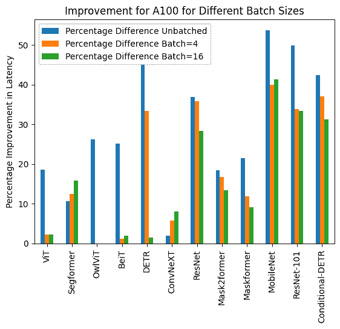
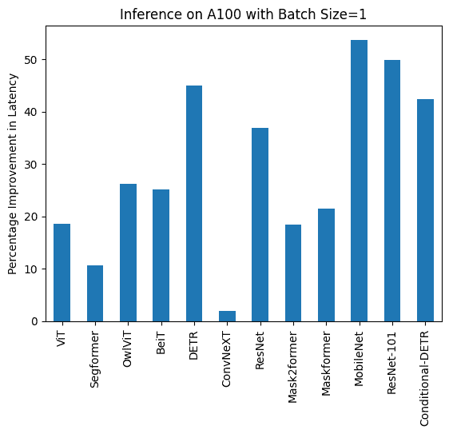
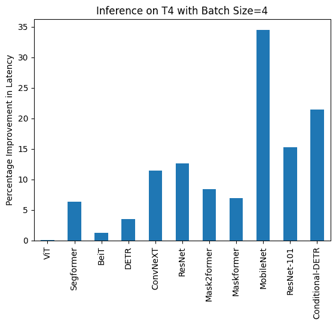

# 使用 torch.compile() 优化推理

> [`huggingface.co/docs/transformers/v4.37.2/en/perf_torch_compile`](https://huggingface.co/docs/transformers/v4.37.2/en/perf_torch_compile)

本指南旨在提供有关在🤗 Transformers 中使用 [`torch.compile()`](https://pytorch.org/tutorials/intermediate/torch_compile_tutorial.html) 为计算机视觉模型引入的推理加速的基准测试信息。

## torch.compile 的好处

根据模型和 GPU，`torch.compile()` 在推理过程中可以提高高达 30%的速度。要使用 `torch.compile()`，只需安装任何版本高于 2.0 的`torch`。

编译模型需要时间，因此如果您只编译模型一次而不是每次推理时都编译，这将非常有用。要编译您选择的任何计算机视觉模型，请按照以下示例在模型上调用 `torch.compile()`：

```py
from transformers import AutoModelForImageClassification

model = AutoModelForImageClassification.from_pretrained(MODEL_ID).to("cuda")
+ model = torch.compile(model)
```

`compile()` 有多种编译模式，它们在编译时间和推理开销方面有所不同。`max-autotune` 比 `reduce-overhead` 花费更长的时间，但推理速度更快。默认模式在编译速度上最快，但与 `reduce-overhead` 相比在推理时间上效率不高。在本指南中，我们使用了默认模式。您可以在[这里](https://pytorch.org/get-started/pytorch-2.0/#user-experience)了解更多信息。

我们对`torch.compile`在不同的计算机视觉模型、任务、硬件类型和批处理大小上进行了基准测试，使用的是`torch`版本 2.0.1。

## 基准测试代码

下面您可以找到每个任务的基准测试代码。我们在推理之前对 GPU 进行预热，并使用相同的图像进行 300 次推理的平均时间。

### 使用 ViT 进行图像分类

```py
import torch
from PIL import Image
import requests
import numpy as np
from transformers import AutoImageProcessor, AutoModelForImageClassification

url = 'http://images.cocodataset.org/val2017/000000039769.jpg'
image = Image.open(requests.get(url, stream=True).raw)

processor = AutoImageProcessor.from_pretrained("google/vit-base-patch16-224")
model = AutoModelForImageClassification.from_pretrained("google/vit-base-patch16-224").to("cuda")
model = torch.compile(model)

processed_input = processor(image, return_tensors='pt').to(device="cuda")

with torch.no_grad():
    _ = model(**processed_input)

```

#### 使用 DETR 进行目标检测

```py
from transformers import AutoImageProcessor, AutoModelForObjectDetection

processor = AutoImageProcessor.from_pretrained("facebook/detr-resnet-50")
model = AutoModelForObjectDetection.from_pretrained("facebook/detr-resnet-50").to("cuda")
model = torch.compile(model)

texts = ["a photo of a cat", "a photo of a dog"]
inputs = processor(text=texts, images=image, return_tensors="pt").to("cuda")

with torch.no_grad():
    _ = model(**inputs)
```

#### 使用 Segformer 进行图像分割

```py
from transformers import SegformerImageProcessor, SegformerForSemanticSegmentation

processor = SegformerImageProcessor.from_pretrained("nvidia/segformer-b0-finetuned-ade-512-512")
model = SegformerForSemanticSegmentation.from_pretrained("nvidia/segformer-b0-finetuned-ade-512-512").to("cuda")
model = torch.compile(model)
seg_inputs = processor(images=image, return_tensors="pt").to("cuda")

with torch.no_grad():
    _ = model(**seg_inputs)
```

下面您可以找到我们进行基准测试的模型列表。

**图像分类**

+   [google/vit-base-patch16-224](https://huggingface.co/google/vit-base-patch16-224)

+   [microsoft/beit-base-patch16-224-pt22k-ft22k](https://huggingface.co/microsoft/beit-base-patch16-224-pt22k-ft22k)

+   [facebook/convnext-large-224](https://huggingface.co/facebook/convnext-large-224)

+   [microsoft/resnet-50](https://huggingface.co/)

**图像分割**

+   [nvidia/segformer-b0-finetuned-ade-512-512](https://huggingface.co/nvidia/segformer-b0-finetuned-ade-512-512)

+   [facebook/mask2former-swin-tiny-coco-panoptic](https://huggingface.co/facebook/mask2former-swin-tiny-coco-panoptic)

+   [facebook/maskformer-swin-base-ade](https://huggingface.co/facebook/maskformer-swin-base-ade)

+   [google/deeplabv3_mobilenet_v2_1.0_513](https://huggingface.co/google/deeplabv3_mobilenet_v2_1.0_513)

**目标检测**

+   [google/owlvit-base-patch32](https://huggingface.co/google/owlvit-base-patch32)

+   [facebook/detr-resnet-101](https://huggingface.co/facebook/detr-resnet-101)

+   [microsoft/conditional-detr-resnet-50](https://huggingface.co/microsoft/conditional-detr-resnet-50)

下面您可以找到使用和不使用 `torch.compile()` 的推理持续时间的可视化，以及每个模型在不同硬件和批处理大小下的百分比改进。






下面您可以找到每个模型使用和不使用 `compile()` 的推理持续时间（毫秒）。请注意，OwlViT 在较大批处理大小时会导致 OOM。

### A100（批处理大小：1）

| **任务/模型** | **torch 2.0 - 无编译** | **torch 2.0 - 编译** |
| :-: | :-: | :-: |
| 图像分类/ViT | 9.325 | 7.584 |
| 图像分割/Segformer | 11.759 | 10.500 |
| 目标检测/OwlViT | 24.978 | 18.420 |
| 图像分类/BeiT | 11.282 | 8.448 |
| 目标检测/DETR | 34.619 | 19.040 |
| 图像分类/ConvNeXT | 10.410 | 10.208 |
| 图像分类/ResNet | 6.531 | 4.124 |
| 图像分割/Mask2former | 60.188 | 49.117 |
| 图像分割/Maskformer | 75.764 | 59.487 |
| 图像分割/MobileNet | 8.583 | 3.974 |
| 目标检测/Resnet-101 | 36.276 | 18.197 |
| 目标检测/Conditional-DETR | 31.219 | 17.993 |

### A100（批量大小：4）

| **任务/模型** | **torch 2.0 - 无编译** | **torch 2.0 - 编译** |
| :-: | :-: | :-: |
| 图像分类/ViT | 14.832 | 14.499 |
| 图像分割/Segformer | 18.838 | 16.476 |
| 图像分类/BeiT | 13.205 | 13.048 |
| 目标检测/DETR | 48.657 | 32.418 |
| 图像分类/ConvNeXT | 22.940 | 21.631 |
| 图像分类/ResNet | 6.657 | 4.268 |
| 图像分割/Mask2former | 74.277 | 61.781 |
| 图像分割/Maskformer | 180.700 | 159.116 |
| 图像分割/MobileNet | 14.174 | 8.515 |
| 目标检测/Resnet-101 | 68.101 | 44.998 |
| 目标检测/Conditional-DETR | 56.470 | 35.552 |

### A100（批量大小：16）

| **任务/模型** | **torch 2.0 - 无编译** | **torch 2.0 - 编译** |
| :-: | :-: | :-: |
| 图像分类/ViT | 40.944 | 40.010 |
| 图像分割/Segformer | 37.005 | 31.144 |
| 图像分类/BeiT | 41.854 | 41.048 |
| 目标检测/DETR | 164.382 | 161.902 |
| 图像分类/ConvNeXT | 82.258 | 75.561 |
| 图像分类/ResNet | 7.018 | 5.024 |
| 图像分割/Mask2former | 178.945 | 154.814 |
| 图像分割/Maskformer | 638.570 | 579.826 |
| 图像分割/MobileNet | 51.693 | 30.310 |
| 目标检测/Resnet-101 | 232.887 | 155.021 |
| 目标检测/Conditional-DETR | 180.491 | 124.032 |

### V100（批量大小：1）

| **任务/模型** | **torch 2.0 - 无编译** | **torch 2.0 - 编译** |
| :-: | :-: | :-: |
| 图像分类/ViT | 10.495 | 6.00 |
| 图像分割/Segformer | 13.321 | 5.862 |
| 目标检测/OwlViT | 25.769 | 22.395 |
| 图像分类/BeiT | 11.347 | 7.234 |
| 目标检测/DETR | 33.951 | 19.388 |
| 图像分类/ConvNeXT | 11.623 | 10.412 |
| 图像分类/ResNet | 6.484 | 3.820 |
| 图像分割/Mask2former | 64.640 | 49.873 |
| 图像分割/Maskformer | 95.532 | 72.207 |
| 图像分割/MobileNet | 9.217 | 4.753 |
| 目标检测/Resnet-101 | 52.818 | 28.367 |
| 目标检测/Conditional-DETR | 39.512 | 20.816 |

### V100（批量大小：4）

| **任务/模型** | **torch 2.0 - 无编译** | **torch 2.0 - 编译** |
| :-: | :-: | :-: |
| 图像分类/ViT | 15.181 | 14.501 |
| 图像分割/Segformer | 16.787 | 16.188 |
| 图像分类/BeiT | 15.171 | 14.753 |
| 目标检测/DETR | 88.529 | 64.195 |
| 图像分类/ConvNeXT | 29.574 | 27.085 |
| 图像分类/ResNet | 6.109 | 4.731 |
| 图像分割/Mask2former | 90.402 | 76.926 |
| 图像分割/Maskformer | 234.261 | 205.456 |
| 图像分割/MobileNet | 24.623 | 14.816 |
| 目标检测/Resnet-101 | 134.672 | 101.304 |
| 目标检测/Conditional-DETR | 97.464 | 69.739 |

### V100（批量大小：16）

| **任务/模型** | **torch 2.0 - 无编译** | **torch 2.0 - 编译** |
| :-: | :-: | :-: |
| 图像分类/ViT | 52.209 | 51.633 |
| 图像分割/Segformer | 61.013 | 55.499 |
| 图像分类/BeiT | 53.938 | 53.581 |
| 目标检测/DETR | OOM | OOM |
| 图像分类/ConvNeXT | 109.682 | 100.771 |
| 图像分类/ResNet | 14.857 | 12.089 |
| 图像分割/Mask2former | 249.605 | 222.801 |
| 图像分割/Maskformer | 831.142 | 743.645 |
| 图像分割/MobileNet | 93.129 | 55.365 |
| 目标检测/Resnet-101 | 482.425 | 361.843 |
| 目标检测/Conditional-DETR | 344.661 | 255.298 |

### T4（批量大小：1）

| **任务/模型** | **torch 2.0 - 无编译** | **torch 2.0 - 编译** |
| :-: | :-: | :-: |
| 图像分类/ViT | 16.520 | 15.786 |
| 图像分割/Segformer | 16.116 | 14.205 |
| 目标检测/OwlViT | 53.634 | 51.105 |
| 图像分类/BeiT | 16.464 | 15.710 |
| 目标检测/DETR | 73.100 | 53.99 |
| 图像分类/ConvNeXT | 32.932 | 30.845 |
| 图像分类/ResNet | 6.031 | 4.321 |
| 图像分割/Mask2former | 79.192 | 66.815 |
| 图像分割/Maskformer | 200.026 | 188.268 |
| 图像分割/MobileNet | 18.908 | 11.997 |
| 目标检测/Resnet-101 | 106.622 | 82.566 |
| 目标检测/Conditional-DETR | 77.594 | 56.984 |

### T4（批量大小：4）

| **任务/模型** | **torch 2.0 - 无编译** | **torch 2.0 - 编译** |
| :-: | :-: | :-: |
| 图像分类/ViT | 43.653 | 43.626 |
| 图像分割/Segformer | 45.327 | 42.445 |
| 图像分类/BeiT | 52.007 | 51.354 |
| 目标检测/DETR | 277.850 | 268.003 |
| 图像分类/ConvNeXT | 119.259 | 105.580 |
| 图像分类/ResNet | 13.039 | 11.388 |
| 图像分割/Mask2former | 201.540 | 184.670 |
| 图像分割/Maskformer | 764.052 | 711.280 |
| 图像分割/MobileNet | 74.289 | 48.677 |
| 目标检测/Resnet-101 | 421.859 | 357.614 |
| 目标检测/Conditional-DETR | 289.002 | 226.945 |

### T4（批量大小：16）

| **任务/模型** | **torch 2.0 - 无编译** | **torch 2.0 - 编译** |
| :-: | :-: | :-: |
| 图像分类/ViT | 163.914 | 160.907 |
| 图像分割/Segformer | 192.412 | 163.620 |
| 图像分类/BeiT | 188.978 | 187.976 |
| 目标检测/DETR | OOM | OOM |
| 图像分类/ConvNeXT | 422.886 | 388.078 |
| 图像分类/ResNet | 44.114 | 37.604 |
| 图像分割/Mask2former | 756.337 | 695.291 |
| 图像分割/Maskformer | 2842.940 | 2656.88 |
| 图像分割/MobileNet | 299.003 | 201.942 |
| 目标检测/Resnet-101 | 1619.505 | 1262.758 |
| 目标检测/Conditional-DETR | 1137.513 | 897.390 |

## PyTorch Nightly

我们还在 PyTorch nightly（2.1.0dev，可以在[这里](https://download.pytorch.org/whl/nightly/cu118)找到）上进行了基准测试，并观察到未编译和编译模型的延迟均有所改善。

### A100

| **任务/模型** | **批量大小** | **torch 2.0 - 无编译** | **torch 2.0 - 编译** |
| :-: | :-: | :-: | :-: |
| 图像分类/BeiT | 未分批 | 12.462 | 6.954 |
| 图像分类/BeiT | 4 | 14.109 | 12.851 |
| 图像分类/BeiT | 16 | 42.179 | 42.147 |
| 目标检测/DETR | 未分批 | 30.484 | 15.221 |
| 目标检测/DETR | 4 | 46.816 | 30.942 |
| 目标检测/DETR | 16 | 163.749 | 163.706 |

### T4

| **任务/模型** | **批量大小** | **torch 2.0 - 无编译** | **torch 2.0 - 编译** |
| :-: | :-: | :-: | :-: |
| 图像分类/BeiT | 未分批 | 14.408 | 14.052 |
| 图像分类/BeiT | 4 | 47.381 | 46.604 |
| 图像分类/BeiT | 16 | 42.179 | 42.147 |
| 目标检测/DETR | 未分批 | 68.382 | 53.481 |
| 目标检测/DETR | 4 | 269.615 | 204.785 |
| 目标检测/DETR | 16 | OOM | OOM |

### V100

| **任务/模型** | **批量大小** | **torch 2.0 - 无编译** | **torch 2.0 - 编译** |
| :-: | :-: | :-: | :-: |
| 图像分类/BeiT | 未分批 | 13.477 | 7.926 |
| 图像分类/BeiT | 4 | 15.103 | 14.378 |
| 图像分类/BeiT | 16 | 52.517 | 51.691 |
| 目标检测/DETR | 未分批 | 28.706 | 19.077 |
| 目标检测/DETR | 4 | 88.402 | 62.949 |
| 目标检测/DETR | 16 | OOM | OOM |

## 减少开销

我们在夜间对 A100 和 T4 进行了`reduce-overhead`编译模式的基准测试。

### A100

| **任务/模型** | **批量大小** | **torch 2.0 - 无编译** | **torch 2.0 - 编译** |
| :-: | :-: | :-: | :-: |
| 图像分类/ConvNeXT | 未分批 | 11.758 | 7.335 |
| 图像分类/ConvNeXT | 4 | 23.171 | 21.490 |
| 图像分类/ResNet | 未分批 | 7.435 | 3.801 |
| 图像分类/ResNet | 4 | 7.261 | 2.187 |
| 目标检测/条件 DETR | 未批处理 | 32.823 | 11.627 |
| 目标检测/条件 DETR | 4 | 50.622 | 33.831 |
| 图像分割/MobileNet | 未批处理 | 9.869 | 4.244 |
| 图像分割/MobileNet | 4 | 14.385 | 7.946 |

### T4

| **任务/模型** | **批处理大小** | **torch 2.0 - 无编译** | **torch 2.0 - 编译** |
| :-: | :-: | :-: | :-: |
| 图像分类/ConvNeXT | 未批处理 | 32.137 | 31.84 |
| 图像分类/ConvNeXT | 4 | 120.944 | 110.209 |
| 图像分类/ResNet | 未批处理 | 9.761 | 7.698 |
| 图像分类/ResNet | 4 | 15.215 | 13.871 |
| 目标检测/条件 DETR | 未批处理 | 72.150 | 57.660 |
| 目标检测/条件 DETR | 4 | 301.494 | 247.543 |
| 图像分割/MobileNet | 未批处理 | 22.266 | 19.339 |
| 图像分割/MobileNet | 4 | 78.311 | 50.983 |
