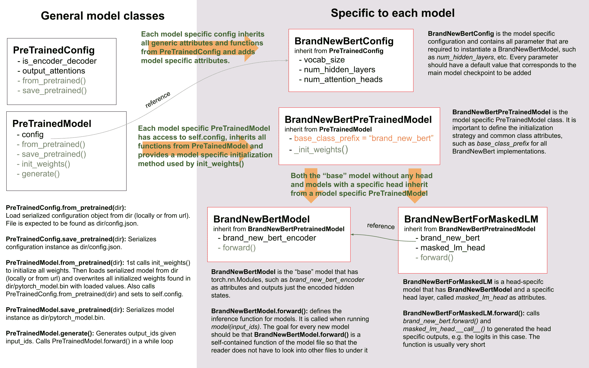

# 如何将模型添加到🤗 Transformers？

> 原文链接：[`huggingface.co/docs/transformers/v4.37.2/en/add_new_model`](https://huggingface.co/docs/transformers/v4.37.2/en/add_new_model)

🤗 Transformers 库通常能够通过社区贡献者提供新模型。但这可能是一个具有挑战性的项目，需要深入了解🤗 Transformers 库和要实现的模型。在 Hugging Face，我们正在努力赋予更多社区成员积极添加模型的能力，并为您提供这个指南，以指导您添加一个 PyTorch 模型（确保您已经[安装了 PyTorch](https://pytorch.org/get-started/locally/)）。

如果您有兴趣实现一个 TensorFlow 模型，请查看如何将🤗 Transformers 模型转换为 TensorFlow 指南！

沿途，您将：

+   了解开源最佳实践

+   了解最受欢迎的深度学习库背后的设计原则

+   学习如何有效地测试大型模型

+   学习如何集成 Python 实用程序，如`black`、`ruff`和`make fix-copies`，以确保代码整洁可读

Hugging Face 团队成员将随时为您提供帮助，因此您永远不会孤单。🤗 ❤️

要开始，请为您想在🤗 Transformers 中看到的模型打开一个[新模型添加](https://github.com/huggingface/transformers/issues/new?assignees=&labels=New+model&template=new-model-addition.yml)问题。如果您对贡献特定模型不是特别挑剔，您可以按[New model label](https://github.com/huggingface/transformers/labels/New%20model)进行筛选，看看是否有任何未认领的模型请求并开始处理。

一旦您打开了一个新模型请求，如果您还不熟悉🤗 Transformers，第一步是熟悉它！

## 🤗 Transformers 的概述

首先，您应该对🤗 Transformers 有一个总体了解。🤗 Transformers 是一个非常主观的库，因此您可能不同意一些库的理念或设计选择。然而，根据我们的经验，我们发现库的基本设计选择和理念对于有效扩展🤗 Transformers 并保持维护成本在合理水平上至关重要。

更好地了解库的一个很好的起点是阅读我们哲学的文档。由于我们的工作方式，有一些选择我们试图应用于所有模型：

+   通常更喜欢组合而不是抽象

+   复制代码并不总是坏事，如果它极大地提高了模型的可读性或可访问性

+   模型文件尽可能自包含，这样当您阅读特定模型的代码时，理想情况下只需查看相应的 `modeling_....py` 文件。

在我们看来，库的代码不仅仅是提供产品的手段，*例如*使用 BERT 进行推断的能力，而且也是我们想要改进的产品本身。因此，当添加一个模型时，用户不仅是将使用您的模型的人，还有所有将阅读、尝试理解和可能调整您的代码的人。

有了这个想法，让我们更深入地了解一下一般的库设计。

### 模型概述

要成功添加一个模型，重要的是要理解您的模型与其配置、PreTrainedModel 和 PretrainedConfig 之间的交互。为了举例说明，我们将要添加到🤗 Transformers 的模型称为`BrandNewBert`。

让我们看一看：



正如您所看到的，我们在🤗 Transformers 中确实使用了继承，但我们将抽象级别保持到绝对最低限度。库中任何模型的抽象级别永远不会超过两个。`BrandNewBertModel`继承自`BrandNewBertPreTrainedModel`，后者又继承自 PreTrainedModel，就是这样。一般规则是，我们希望确保新模型仅依赖于 PreTrainedModel。自动提供给每个新模型的重要功能是 from_pretrained()和 save_pretrained()，用于序列化和反序列化。所有其他重要功能，如`BrandNewBertModel.forward`，应完全在新的`modeling_brand_new_bert.py`脚本中定义。接下来，我们要确保具有特定头层的模型，如`BrandNewBertForMaskedLM`，不继承自`BrandNewBertModel`，而是使用`BrandNewBertModel`作为可以在其前向传递中调用的组件，以保持抽象级别低。每个新模型都需要一个配置类，称为`BrandNewBertConfig`。此配置始终存储为 PreTrainedModel 中的属性，因此可以通过`config`属性访问所有继承自`BrandNewBertPreTrainedModel`的类：

```py
model = BrandNewBertModel.from_pretrained("brandy/brand_new_bert")
model.config  # model has access to its config
```

与模型类似，配置从 PretrainedConfig 继承基本的序列化和反序列化功能。请注意，配置和模型始终以两种不同的格式进行序列化 - 模型保存为*pytorch_model.bin*文件，配置保存为*config.json*文件。调用 save_pretrained()将自动调用 save_pretrained()，以便同时保存模型和配置。

### 代码风格

在编写新模型时，请记住 Transformers 是一个持有意见的库，关于代码应该如何编写，我们有自己的一些怪癖 :-)

1.  您的模型的前向传递应完全在建模文件中编写，同时完全独立于库中的其他模型。如果要重用另一个模型中的块，请复制代码并在顶部添加`# Copied from`注释（请参见[此处](https://github.com/huggingface/transformers/blob/v4.17.0/src/transformers/models/roberta/modeling_roberta.py#L160)以获取一个很好的示例，以及此处以获取有关复制的更多文档）。

1.  代码应该是完全可理解的，即使对于非母语英语的人也是如此。这意味着您应该选择描述性的变量名称并避免缩写。例如，`activation`比`act`更受欢迎。除非是循环中的索引，否则强烈不建议使用一个字母的变量名。

1.  总的来说，我们更喜欢长而明确的代码，而不是短而神奇的代码。

1.  在 PyTorch 中避免对`nn.Sequential`进行子类化，而是对`nn.Module`进行子类化并编写前向传递，以便使用您的代码的任何人都可以通过添加打印语句或断点来快速调试它。

1.  您的函数签名应该有类型注释。对于其余部分，良好的变量名称比类型注释更可读和可理解。

### 分词器概述

还不太准备好 :-( 此部分将很快添加！

## 将模型添加到🤗 Transformers 的逐步配方

每个人对如何移植模型都有不同的偏好，因此查看其他贡献者如何将模型移植到 Hugging Face 可能会对您非常有帮助。以下是关于如何移植模型的社区博客文章列表：

1.  [移植 GPT2 模型](https://medium.com/huggingface/from-tensorflow-to-pytorch-265f40ef2a28) by [Thomas](https://huggingface.co/thomwolf)

1.  [移植 WMT19 MT 模型](https://huggingface.co/blog/porting-fsmt) by [Stas](https://huggingface.co/stas)

根据经验，我们可以告诉您在添加模型时要牢记的最重要的事情是：

+   不要重复造轮子！您将为新的🤗 Transformers 模型添加的大部分代码已经存在于🤗 Transformers 的某个地方。花些时间找到类似的、已经存在的模型和分词器，您可以从中复制。[grep](https://www.gnu.org/software/grep/)和[rg](https://github.com/BurntSushi/ripgrep)是您的朋友。请注意，您的模型的分词器可能基于一个模型实现，而您的模型的建模代码可能基于另一个模型实现。*例如*，FSMT 的建模代码基于 BART，而 FSMT 的分词器代码基于 XLM。

+   这更多是一个工程挑战而不是一个科学挑战。您应该花更多时间创建一个高效的调试环境，而不是试图理解论文中模型的所有理论方面。

+   当您遇到困难时，请寻求帮助！模型是🤗 Transformers 的核心组件，因此我们在 Hugging Face 非常乐意在每个步骤帮助您添加您的模型。如果您发现自己没有取得进展，请不要犹豫询问。

接下来，我们尝试为您提供一个我们在将模型移植到🤗 Transformers 时发现最有用的一般步骤。

以下列表总结了添加模型时必须完成的所有工作，并可以作为待办事项清单使用：

□ （可选）理解模型的理论方面

□ 准备🤗 Transformers 开发环境

□ 设置原始存储库的调试环境

□ 创建脚本，成功使用原始存储库和检查点运行`forward()`传递

□ 成功将模型骨架添加到🤗 Transformers

□ 成功将原始检查点转换为🤗 Transformers 检查点

□ 在🤗 Transformers 中成功运行`forward()`传递，输出与原始检查点相同

□ 在🤗 Transformers 中完成模型测试

□ 在🤗 Transformers 中成功添加了分词器

□ 运行端到端集成测试

□ 完成文档

□ 将模型权重上传到 Hub

□ 提交拉取请求

□ （可选）添加演示笔记本

通常建议首先对`BrandNewBert`有一个良好的理论理解。但是，如果您更喜欢在工作中理解模型的理论方面，那么直接深入`BrandNewBert`的代码库也是完全可以的。如果您的工程技能比理论技能更强，如果您难以理解`BrandNewBert`的论文，或者如果您更喜欢编程而不是阅读科学论文，那么这个选项可能更适合您。

### 1\. （可选）BrandNewBert 的理论方面

您应该花些时间阅读*BrandNewBert*的论文，如果存在这样的描述性工作。论文中可能有一些难以理解的大段内容。如果是这种情况，没关系 - 不要担心！目标不是深入理解论文，而是提取在🤗 Transformers 中有效重新实现模型所需的必要信息。也就是说，您不必花太多时间在理论方面，而是要专注于实践方面，即：

+   *brand_new_bert*是什么类型的模型？类似 BERT 的仅编码器模型？类似 GPT2 的仅解码器模型？类似 BART 的编码器-解码器模型？如果您对这些之间的区别不熟悉，请查看[model_summary]。

+   *brand_new_bert*的应用是什么？文本分类？文本生成？Seq2Seq 任务，例如，摘要？

+   该模型的新特性是什么，使其与 BERT/GPT-2/BART 不同？

+   已经存在的[🤗 Transformers 模型](https://huggingface.co/transformers/#contents)中哪一个与*brand_new_bert*最相似？

+   使用了什么类型的分词器？是句子片段分词器？词片段分词器？它是否与 BERT 或 BART 使用的相同的分词器？

当您感觉对模型的架构有了很好的概述后，您可能希望向 Hugging Face 团队发送任何可能有的问题。这可能包括有关模型架构、注意力层等的问题。我们将非常乐意帮助您。

### 2. 接下来准备您的环境

1.  点击存储库页面上的“Fork”按钮来 fork 这个[存储库](https://github.com/huggingface/transformers)。这将在您的 GitHub 用户账户下创建代码的副本。

1.  将您的`transformers` fork 克隆到本地磁盘，并将基本存储库添加为远程：

```py
git clone https://github.com/[your Github handle]/transformers.git
cd transformers
git remote add upstream https://github.com/huggingface/transformers.git
```

1.  设置一个开发环境，例如通过运行以下命令：

```py
python -m venv .env
source .env/bin/activate
pip install -e ".[dev]"
```

根据您的操作系统，由于 Transformers 的可选依赖项数量正在增加，您可能会在此命令中遇到失败。如果是这种情况，请确保安装您正在使用的深度学习框架（PyTorch、TensorFlow 和/或 Flax），然后执行：

```py
pip install -e ".[quality]"
```

这对于大多数用例应该足够了。然后您可以返回到父目录

```py
cd ..
```

1.  我们建议将 PyTorch 版本的*brand_new_bert*添加到 Transformers 中。要安装 PyTorch，请按照[`pytorch.org/get-started/locally/`](https://pytorch.org/get-started/locally/)上的说明操作。

**注意：** 您不需要安装 CUDA。使新模型在 CPU 上运行就足够了。

1.  要移植*brand_new_bert*，您还需要访问其原始存储库：

```py
git clone https://github.com/org_that_created_brand_new_bert_org/brand_new_bert.git
cd brand_new_bert
pip install -e .
```

现在您已经设置好了一个开发环境，可以将*brand_new_bert*移植到🤗 Transformers。

### 3.-4. 在原始存储库中运行预训练检查点

首先，您将在原始*brand_new_bert*存储库上工作。通常，原始实现非常“研究性”。这意味着文档可能缺失，代码可能难以理解。但这应该正是您重新实现*brand_new_bert*的动力所在。在 Hugging Face，我们的主要目标之一是让人们“站在巨人的肩膀上”，这在这里非常好地体现为拿一个可用的模型并重写它，使其尽可能**易于访问、用户友好和美观**。这是重新实现模型到🤗 Transformers 的首要动机 - 尝试使复杂的新 NLP 技术对**每个人**都可访问。

因此，您应该首先深入研究原始存储库。

在原始存储库中成功运行官方预训练模型通常是**最困难**的一步。根据我们的经验，花一些时间熟悉原始代码库非常重要。您需要弄清楚以下内容：

+   在哪里找到预训练权重？

+   如何将预训练权重加载到相应的模型中？

+   如何独立于模型运行分词器？

+   跟踪一次前向传递，以便了解哪些类和函数需要进行简单的前向传递。通常，您只需要重新实现这些函数。

+   能够找到模型的重要组件：模型的类在哪里？是否有模型子类，例如 EncoderModel，DecoderModel？自注意力层在哪里？是否有多个不同的注意力层，例如 self-attention，cross-attention...？

+   如何在存储库的原始环境中调试模型？您是否需要添加*print*语句，是否可以使用交互式调试器如*ipdb*，或者是否应该使用高效的 IDE 来调试模型，如 PyCharm？

在开始移植过程之前，非常重要的是您可以**有效地**调试原始存储库中的代码！还要记住，您正在使用一个开源库，因此不要犹豫在原始存储库中打开问题，甚至提交拉取请求。这个存储库的维护者很可能会对有人查看他们的代码感到非常高兴！

在这一点上，真的取决于您更喜欢使用哪种调试环境和策略来调试原始模型。我们强烈建议不要设置昂贵的 GPU 环境，而是在开始深入研究原始存储库和开始编写🤗 Transformers 模型实现时都使用 CPU。只有在模型已经成功移植到🤗 Transformers 后，才应验证模型在 GPU 上是否按预期工作。

一般来说，有两种可能的调试环境可用于运行原始模型

+   [Jupyter 笔记本](https://jupyter.org/) / [google colab](https://colab.research.google.com/notebooks/intro.ipynb)

+   本地 python 脚本。

Jupyter 笔记本的优势在于它们允许逐个单元格执行，这有助于更好地将逻辑组件彼此分离，并且具有更快的调试周期，因为中间结果可以被存储。此外，笔记本通常更容易与其他贡献者共享，如果您想要向 Hugging Face 团队寻求帮助，这可能非常有帮助。如果您熟悉 Jupyter 笔记本，我们强烈建议您使用它们。

Jupyter 笔记本的明显缺点是，如果您不习惯使用它们，您将不得不花费一些时间适应新的编程环境，可能无法再使用您已知的调试工具，如`ipdb`。

对于每个代码库，一个很好的第一步总是加载一个**小**的预训练检查点，并能够使用一个虚拟整数向量的输入 ID 进行单个前向传递。这样的脚本可能如下所示（伪代码）：

```py
model = BrandNewBertModel.load_pretrained_checkpoint("/path/to/checkpoint/")
input_ids = [0, 4, 5, 2, 3, 7, 9]  # vector of input ids
original_output = model.predict(input_ids)
```

接下来，关于调试策略，通常有几种选择：

+   将原始模型分解为许多小的可测试组件，并在每个组件上运行前向传递以进行验证

+   将原始模型仅分解为原始*tokenizer*和原始*model*，在这些上运行前向传递，并使用中间打印语句或断点进行验证

再次，选择哪种策略取决于你。通常，根据原始代码库的情况，一种或另一种策略都有优势。

如果原始代码库允许您将模型分解为较小的子组件，*例如*，如果原始代码库可以轻松在急切模式下运行，那么通常值得这样做。在一开始采取更困难的道路有一些重要的优势：

+   在稍后阶段，当将原始模型与 Hugging Face 实现进行比较时，您可以自动验证每个组件是否与🤗 Transformers 实现的相应组件匹配，而不是依赖通过打印语句进行视觉比较

+   它可以让您将将模型移植为较小问题的大问题分解为仅将单个组件移植为结构化工作的更好的方法。

+   将模型分解为逻辑有意义的组件将有助于更好地了解模型的设计，从而更好地理解模型

+   在稍后阶段，这些逐个组件的测试有助于确保在继续更改代码时不会发生退化

[Lysandre 的](https://gist.github.com/LysandreJik/db4c948f6b4483960de5cbac598ad4ed) ELECTRA 集成检查为如何执行此操作提供了一个很好的示例。

然而，如果原始代码库非常复杂，或者只允许以编译模式运行中间组件，那么将模型分解为可测试的较小子组件可能会耗费太多时间，甚至是不可能的。一个很好的例子是[T5 的 MeshTensorFlow](https://github.com/tensorflow/mesh/tree/master/mesh_tensorflow)库，它非常复杂，没有提供将模型分解为子组件的简单方法。对于这种库，人们通常依赖于验证打印语句。

无论您选择哪种策略，推荐的程序通常是相同的，即应该从调试起始图层开始，最后调试结束图层。

建议按照以下顺序检索以下图层的输出，可以通过打印语句或子组件函数来实现：

1.  检索传递给模型的输入 ID

1.  检索单词嵌入

1.  检索第一个 Transformer 层的输入

1.  检索第一个 Transformer 层的输出

1.  检索以下 n-1 个 Transformer 层的输出

1.  检索整个 BrandNewBert 模型的输出

输入 ID 应该由整数数组组成，例如 `input_ids = [0, 4, 4, 3, 2, 4, 1, 7, 19]`

以下图层的输出通常由多维浮点数组组成，可能如下所示：

```py
[[
 [-0.1465, -0.6501,  0.1993,  ...,  0.1451,  0.3430,  0.6024],
 [-0.4417, -0.5920,  0.3450,  ..., -0.3062,  0.6182,  0.7132],
 [-0.5009, -0.7122,  0.4548,  ..., -0.3662,  0.6091,  0.7648],
 ...,
 [-0.5613, -0.6332,  0.4324,  ..., -0.3792,  0.7372,  0.9288],
 [-0.5416, -0.6345,  0.4180,  ..., -0.3564,  0.6992,  0.9191],
 [-0.5334, -0.6403,  0.4271,  ..., -0.3339,  0.6533,  0.8694]]],
```

我们期望每个添加到🤗 Transformers 的模型都经过几个集成测试，这意味着原始模型和🤗 Transformers 中重新实现的版本必须在精度为 0.001 的情况下给出完全相同的输出！由于相同模型在不同库中编写可能会根据库框架给出略有不同的输出，我们接受 1e-3（0.001）的误差容限。如果模型给出的输出几乎相同是不够的，它们必须几乎完全相同。因此，您肯定会多次将🤗 Transformers 版本的中间输出与*brand_new_bert*的原始实现的中间输出进行比较，在这种情况下，原始存储库的**高效**调试环境绝对重要。以下是一些建议，以使您的调试环境尽可能高效。

+   找到调试中间结果的最佳方法。原始存储库是用 PyTorch 编写的吗？那么您可能需要花时间编写一个更长的脚本，将原始模型分解为较小的子组件以检索中间值。原始存储库是用 Tensorflow 1 编写的吗？那么您可能需要依赖 TensorFlow 的打印操作，如 [tf.print](https://www.tensorflow.org/api_docs/python/tf/print) 来输出中间值。原始存储库是用 Jax 编写的吗？那么请确保在运行前向传递时模型**未被 jit 编译**，例如查看 [此链接](https://github.com/google/jax/issues/196)。

+   使用您能找到的最小的预训练检查点。检查点越小，您的调试周期就越快。如果您的预训练模型太大，导致前向传递超过 10 秒，那就不高效了。如果只有非常大的检查点可用，可能更有意义的是在新环境中创建一个带有随机初始化权重的虚拟模型，并保存这些权重以便与您模型的🤗 Transformers 版本进行比较。

+   确保您正在使用原始存储库中调用前向传递的最简单方法。理想情况下，您希望找到原始存储库中**仅**调用单个前向传递的函数，即通常称为 `predict`、`evaluate`、`forward` 或 `__call__`。您不希望调试多次调用 `forward` 的函数，例如生成文本的 `autoregressive_sample`、`generate`。

+   尝试将标记化与模型的*forward*传递分开。如果原始存储库显示示例，您必须输入一个字符串，则尝试找出在前向调用中字符串输入何时更改为输入 id，并从此点开始。这可能意味着您可能需要自己编写一个小脚本或更改原始代码，以便您可以直接输入 id 而不是输入字符串。

+   确保您调试设置中的模型**不**处于训练模式，这通常会导致模型由于模型中的多个 dropout 层而产生随机输出。确保您调试环境中的前向传递是**确定性**的，以便不使用 dropout 层。或者如果旧实现和新实现在同一框架中，则使用*transformers.utils.set_seed*。

下一节将为您提供有关如何为*brand_new_bert*执行此操作的更具体详细信息/提示。

### 5.-14\. 将 BrandNewBert 移植到🤗 Transformers

接下来，您可以开始向🤗 Transformers 添加新代码。进入您🤗 Transformers 分支的克隆：

```py
cd transformers
```

在特殊情况下，如果您要添加的模型的架构与现有模型的模型架构完全匹配，则只需添加一个转换脚本，如此部分所述。在这种情况下，您可以直接重用已存在模型的整个模型架构。

否则，让我们开始生成一个新模型。您在这里有两个选择：

+   `transformers-cli add-new-model-like`以添加一个类似于现有模型的新模型

+   `transformers-cli add-new-model`以从我们的模板中添加一个新模型（将看起来像 BERT 或 Bart，具体取决于您选择的模型类型）

在这两种情况下，您将被提示填写有关您的模型的基本信息的问卷。第二个命令需要安装`cookiecutter`，您可以在[这里](https://github.com/huggingface/transformers/tree/main/templates/adding_a_new_model)找到更多信息。

**在主 huggingface/transformers 仓库上打开一个拉取请求**

在开始调整自动生成的代码之前，现在是时候在🤗 Transformers 中打开一个“进行中的工作（WIP）”拉取请求，例如“[WIP]添加*brand_new_bert*”，以便您和 Hugging Face 团队可以并肩合作将模型集成到🤗 Transformers 中。

您应该执行以下操作：

1.  从主分支创建一个具有描述性名称的分支

```py
git checkout -b add_brand_new_bert
```

1.  提交自动生成的代码：

```py
git add .
git commit
```

1.  获取并 rebase 到当前主分支

```py
git fetch upstream
git rebase upstream/main
```

1.  使用以下命令将更改推送到您的帐户：

```py
git push -u origin a-descriptive-name-for-my-changes
```

1.  一旦您满意，转到 GitHub 上您的分支的网页。点击“拉取请求”。确保将 Hugging Face 团队的一些成员的 GitHub 句柄添加为审阅者，以便 Hugging Face 团队在将来的更改中收到通知。

1.  点击 GitHub 拉取请求网页右侧的“转换为草稿”将 PR 转换为草稿。

在接下来的过程中，每当您取得一些进展时，不要忘记提交您的工作并将其推送到您的帐户，以便在拉取请求中显示。此外，您应该确保不时使用以下方法更新您的工作与当前主分支：

```py
git fetch upstream
git merge upstream/main
```

总的来说，您可能对模型或您的实现有任何问题都应该在您的 PR 中提出，并在 PR 中讨论/解决。这样，当您提交新代码或有问题时，Hugging Face 团队将始终收到通知。将 Hugging Face 团队指向您添加的代码通常非常有帮助，以便 Hugging Face 团队可以高效地理解您的问题或疑问。

为此，您可以转到“更改的文件”选项卡，在那里您可以看到所有更改，转到您想要提问的行，并单击“+”符号添加评论。每当问题或问题得到解决时，您可以单击已创建评论的“解决”按钮。

同样，Hugging Face 团队在审查您的代码时会开放评论。我们建议在 GitHub 上的 PR 上提出大多数问题。对于一些对公众不太有用的非常一般性的问题，可以通过 Slack 或电子邮件联系 Hugging Face 团队。

**5\. 为 brand_new_bert 调整生成的模型代码**

首先，我们将只关注模型本身，不关心分词器。所有相关代码应该在生成的文件`src/transformers/models/brand_new_bert/modeling_brand_new_bert.py`和`src/transformers/models/brand_new_bert/configuration_brand_new_bert.py`中找到。

现在您可以开始编码了 :). 生成的代码在`src/transformers/models/brand_new_bert/modeling_brand_new_bert.py`中将具有与 BERT 相同的架构（如果是仅编码器模型）或与 BART 相同的架构（如果是编码器-解码器模型）。此时，您应该回想起您在开始时学到的关于模型理论方面的知识：“该模型与 BERT 或 BART 有何不同？”实现这些变化通常意味着更改*self-attention*层，规范化层的顺序等等...再次强调，查看 Transformers 中已经存在的类似模型的架构通常是有用的，以更好地了解如何实现您的模型。

**注意**，在这一点上，您不必非常确定您的代码是否完全正确或干净。相反，建议将原始代码的第一个*不干净*、复制粘贴版本添加到`src/transformers/models/brand_new_bert/modeling_brand_new_bert.py`，直到您觉得所有必要的代码都已添加。根据我们的经验，快速添加所需代码的第一个版本，并使用下一节中描述的转换脚本迭代地改进/纠正代码效率更高。在这一点上，唯一需要工作的是您可以实例化🤗 Transformers 实现的*brand_new_bert*，即以下命令应该可以工作：

```py
from transformers import BrandNewBertModel, BrandNewBertConfig

model = BrandNewBertModel(BrandNewBertConfig())
```

上述命令将根据`BrandNewBertConfig()`中定义的默认参数创建一个模型，具有随机权重，从而确保所有组件的`init()`方法正常工作。

请注意，所有随机初始化应该在您的`BrandnewBertPreTrainedModel`类的`_init_weights`方法中进行。它应该根据配置的变量初始化所有叶子模块。这里有一个使用 BERT `_init_weights`方法的示例：

```py
def _init_weights(self, module):
    """Initialize the weights"""
    if isinstance(module, nn.Linear):
        module.weight.data.normal_(mean=0.0, std=self.config.initializer_range)
        if module.bias is not None:
            module.bias.data.zero_()
    elif isinstance(module, nn.Embedding):
        module.weight.data.normal_(mean=0.0, std=self.config.initializer_range)
        if module.padding_idx is not None:
            module.weight.data[module.padding_idx].zero_()
    elif isinstance(module, nn.LayerNorm):
        module.bias.data.zero_()
        module.weight.data.fill_(1.0)
```

如果需要某些模块的特殊初始化，您可以使用一些自定义方案。例如，在`Wav2Vec2ForPreTraining`中，最后两个线性层需要使用常规 PyTorch `nn.Linear`的初始化，但所有其他层应该使用上述初始化。这样编码：

```py
def _init_weights(self, module):
    """Initialize the weights"""
    if isinstnace(module, Wav2Vec2ForPreTraining):
        module.project_hid.reset_parameters()
        module.project_q.reset_parameters()
        module.project_hid._is_hf_initialized = True
        module.project_q._is_hf_initialized = True
    elif isinstance(module, nn.Linear):
        module.weight.data.normal_(mean=0.0, std=self.config.initializer_range)
        if module.bias is not None:
            module.bias.data.zero_()
```

`_is_hf_initialized`标志在内部用于确保我们只初始化一个子模块一次。通过将其设置为`True`，我们确保自定义初始化不会被后来覆盖，`_init_weights`函数不会应用于它们。

**6\. 编写转换脚本**

接下来，您应该编写一个转换脚本，让您可以将您在原始存储库中用于调试*brand_new_bert*的检查点转换为与您刚刚创建的🤗 Transformers 实现*brand_new_bert*兼容的检查点。不建议从头开始编写转换脚本，而是查看🤗 Transformers 中已经存在的转换脚本，找到一个已经用于转换与*brand_new_bert*相同框架编写的类似模型的脚本。通常，复制一个已经存在的转换脚本并稍微调整以适应您的用例就足够了。不要犹豫向 Hugging Face 团队询问是否有类似的已经存在的转换脚本适用于您的模型。

+   如果您正在将模型从 TensorFlow 转换到 PyTorch，一个很好的起点可能是 BERT 的转换脚本[此处](https://github.com/huggingface/transformers/blob/7acfa95afb8194f8f9c1f4d2c6028224dbed35a2/src/transformers/models/bert/modeling_bert.py#L91)

+   如果您正在将模型从 PyTorch 转换到 PyTorch，一个很好的起点可能是 BART 的转换脚本[此处](https://github.com/huggingface/transformers/blob/main/src/transformers/models/bart/convert_bart_original_pytorch_checkpoint_to_pytorch.py)

接下来，我们将快速解释 PyTorch 模型如何存储层权重并定义层名称。在 PyTorch 中，层的名称由您给予该层的类属性的名称定义。让我们在 PyTorch 中定义一个名为`SimpleModel`的虚拟模型，如下所示：

```py
from torch import nn

class SimpleModel(nn.Module):
    def __init__(self):
        super().__init__()
        self.dense = nn.Linear(10, 10)
        self.intermediate = nn.Linear(10, 10)
        self.layer_norm = nn.LayerNorm(10)
```

现在我们可以创建此模型定义的实例，该实例将填充所有权重：`dense`、`intermediate`、`layer_norm`，使用随机权重。我们可以打印模型以查看其架构

```py
model = SimpleModel()

print(model)
```

这将打印如下内容：

```py
SimpleModel(
  (dense): Linear(in_features=10, out_features=10, bias=True)
  (intermediate): Linear(in_features=10, out_features=10, bias=True)
  (layer_norm): LayerNorm((10,), eps=1e-05, elementwise_affine=True)
)
```

我们可以看到层的名称由 PyTorch 中类属性的名称定义。您可以打印特定层的权重值：

```py
print(model.dense.weight.data)
```

查看权重是否已随机初始化

```py
tensor([[-0.0818,  0.2207, -0.0749, -0.0030,  0.0045, -0.1569, -0.1598,  0.0212,
         -0.2077,  0.2157],
        [ 0.1044,  0.0201,  0.0990,  0.2482,  0.3116,  0.2509,  0.2866, -0.2190,
          0.2166, -0.0212],
        [-0.2000,  0.1107, -0.1999, -0.3119,  0.1559,  0.0993,  0.1776, -0.1950,
         -0.1023, -0.0447],
        [-0.0888, -0.1092,  0.2281,  0.0336,  0.1817, -0.0115,  0.2096,  0.1415,
         -0.1876, -0.2467],
        [ 0.2208, -0.2352, -0.1426, -0.2636, -0.2889, -0.2061, -0.2849, -0.0465,
          0.2577,  0.0402],
        [ 0.1502,  0.2465,  0.2566,  0.0693,  0.2352, -0.0530,  0.1859, -0.0604,
          0.2132,  0.1680],
        [ 0.1733, -0.2407, -0.1721,  0.1484,  0.0358, -0.0633, -0.0721, -0.0090,
          0.2707, -0.2509],
        [-0.1173,  0.1561,  0.2945,  0.0595, -0.1996,  0.2988, -0.0802,  0.0407,
          0.1829, -0.1568],
        [-0.1164, -0.2228, -0.0403,  0.0428,  0.1339,  0.0047,  0.1967,  0.2923,
          0.0333, -0.0536],
        [-0.1492, -0.1616,  0.1057,  0.1950, -0.2807, -0.2710, -0.1586,  0.0739,
          0.2220,  0.2358]]).
```

在转换脚本中，您应该使用相应层中的确切权重填充这些随机初始化的权重。*例如*

```py
# retrieve matching layer weights, e.g. by
# recursive algorithm
layer_name = "dense"
pretrained_weight = array_of_dense_layer

model_pointer = getattr(model, "dense")

model_pointer.weight.data = torch.from_numpy(pretrained_weight)
```

在执行此操作时，您必须验证您的 PyTorch 模型的每个随机初始化权重及其对应的预训练检查点权重在**形状和名称**上完全匹配。为此，**必须**添加形状的 assert 语句并打印出检查点权重的名称。例如，您应该添加类似以下语句：

```py
assert (
    model_pointer.weight.shape == pretrained_weight.shape
), f"Pointer shape of random weight {model_pointer.shape} and array shape of checkpoint weight {pretrained_weight.shape} mismatched"
```

此外，您还应该打印出两个权重的名称，以确保它们匹配，*例如*

```py
logger.info(f"Initialize PyTorch weight {layer_name} from {pretrained_weight.name}")
```

如果形状或名称不匹配，则您可能将错误的检查点权重分配给了🤗 Transformers 实现的随机初始化层。

不正确的形状很可能是由于在`BrandNewBertConfig()`中不正确设置配置参数，这些参数与您要转换的检查点使用的参数不完全匹配。但是，也可能是 PyTorch 的层实现要求在之前对权重进行转置。

最后，您还应该检查**所有**必需的权重是否已初始化，并打印出所有未用于初始化的检查点权重，以确保模型已正确转换。完全正常的是，转换尝试可能会因为错误的形状语句或错误的名称分配而失败。这很可能是因为您在`BrandNewBertConfig()`中使用了不正确的参数，在🤗 Transformers 实现中有错误的架构，您在🤗 Transformers 实现的一个组件的`init()`函数中有错误，或者您需要转置一个检查点权重。

应该通过前面的步骤迭代此步骤，直到正确加载所有检查点的权重到 Transformers 模型中。正确加载检查点到🤗 Transformers 实现后，您可以将模型保存在您选择的文件夹中`/path/to/converted/checkpoint/folder`，该文件夹应包含一个`pytorch_model.bin`文件和一个`config.json`文件：

```py
model.save_pretrained("/path/to/converted/checkpoint/folder")
```

**7. 实现正向传递**

成功将预训练权重正确加载到🤗 Transformers 实现中后，现在应确保正向传递已正确实现。在熟悉原始存储库中，您已经创建了一个脚本，该脚本使用原始存储库运行模型的正向传递。现在，您应该编写一个类似的脚本，使用🤗 Transformers 实现而不是原始实现。它应该如下所示：

```py
model = BrandNewBertModel.from_pretrained("/path/to/converted/checkpoint/folder")
input_ids = [0, 4, 4, 3, 2, 4, 1, 7, 19]
output = model(input_ids).last_hidden_states
```

🤗 Transformers 实现和原始模型实现很可能不会在第一次给出完全相同的输出，或者前向传递会出错。不要失望 - 这是预期的！首先，您应该确保前向传递不会出错。经常发生使用了错误的维度导致 *维度不匹配* 错误，或者使用了错误的数据类型对象，例如 `torch.long` 而不是 `torch.float32`。如果您无法解决某些错误，请毫不犹豫地向 Hugging Face 团队寻求帮助。

确保 🤗 Transformers 实现正确工作的最后一部分是确保输出精度达到 `1e-3`。首先，您应该确保输出形状相同，即脚本的 `outputs.shape` 应该对 🤗 Transformers 实现和原始实现产生相同的值。接下来，您应该确保输出值也相同。这是添加新模型中最困难的部分之一。输出不相同的常见错误包括：

+   某些层未添加，即未添加 *激活* 层，或者遗忘了残差连接。

+   单词嵌入矩阵未绑定

+   使用了错误的位置嵌入，因为原始实现使用了偏移

+   在前向传递期间应用了辍学。要修复此问题，请确保 *model.training 为 False*，并且在前向传递期间不会误激活任何辍学层，即将 *self.training* 传递给 [PyTorch 的功能性辍学](https://pytorch.org/docs/stable/nn.functional.html?highlight=dropout#torch.nn.functional.dropout)

通常修复问题的最佳方法是同时查看原始实现和 🤗 Transformers 实现的前向传递，并检查是否有任何差异。理想情况下，您应该调试/打印出两个实现的前向传递的中间输出，以找到 🤗 Transformers 实现显示与原始实现不同输出的网络中的确切位置。首先，确保两个脚本中硬编码的 `input_ids` 是相同的。接下来，验证 `input_ids` 的第一个转换的输出（通常是单词嵌入）是否相同。然后逐层向网络的最后一层工作。在某个时候，您会注意到两个实现之间的差异，这应该指向 🤗 Transformers 实现中的错误。根据我们的经验，一个简单而有效的方法是在原始实现和 🤗 Transformers 实现中的相同位置分别添加许多打印语句，并逐步删除显示中间表示值相同的打印语句。

当您确信两个实现产生相同输出时，使用 `torch.allclose(original_output, output, atol=1e-3)` 验证输出，您已经完成了最困难的部分！恭喜 - 剩下的工作应该很轻松 😊。

**8\. 添加所有必要的模型测试**

在这一点上，您已成功添加了一个新模型。但是，很可能该模型尚未完全符合所需的设计。为确保实现与 🤗 Transformers 完全兼容，所有常见测试都应该通过。Cookiecutter 应该已自动为您的模型添加了一个测试文件，可能位于相同的 `tests/models/brand_new_bert/test_modeling_brand_new_bert.py` 下。运行此测试文件以验证所有常见测试是否通过：

```py
pytest tests/models/brand_new_bert/test_modeling_brand_new_bert.py
```

在修复所有常见测试后，现在至关重要的是确保您所做的所有工作都经过了充分测试，以便

+   a) 社区可以通过查看 *brand_new_bert* 的特定测试轻松理解您的工作

+   b) 对模型的未来更改不会破坏模型的任何重要功能。

首先，应添加集成测试。这些集成测试基本上与您早期用于将模型实现到🤗 Transformers 的调试脚本相同。Cookiecutter 已经添加了这些模型测试的模板，称为`BrandNewBertModelIntegrationTests`，您只需填写即可。为确保这些测试通过，请运行

```py
RUN_SLOW=1 pytest -sv tests/models/brand_new_bert/test_modeling_brand_new_bert.py::BrandNewBertModelIntegrationTests
```

如果您使用 Windows，应将`RUN_SLOW=1`替换为`SET RUN_SLOW=1`。

其次，*brand_new_bert*特有的所有功能还应在`BrandNewBertModelTester`/`BrandNewBertModelTest`下的单独测试中进行额外测试。这部分经常被遗忘，但在两个方面非常有用：

+   通过展示*brand_new_bert*的特殊功能应该如何工作，将您在模型添加过程中获得的知识传递给社区是有帮助的。

+   未来的贡献者可以通过运行这些特殊测试快速测试模型的更改。

**9. 实现分词器**

接下来，我们应该添加*brand_new_bert*的分词器。通常，分词器等同于或非常类似于🤗 Transformers 的已有分词器。

找到/提取原始的分词器文件并成功加载到🤗 Transformers 的分词器实现中非常重要。

为了确保分词器正常工作，建议首先在原始存储库中创建一个脚本，输入一个字符串并返回`input_ids`。它可能看起来类似于这样（伪代码）：

```py
input_str = "This is a long example input string containing special characters .$?-, numbers 2872 234 12 and words."
model = BrandNewBertModel.load_pretrained_checkpoint("/path/to/checkpoint/")
input_ids = model.tokenize(input_str)
```

您可能需要再次深入研究原始存储库，找到正确的分词器函数，或者甚至可能需要对原始存储库的克隆进行更改，以仅输出`input_ids`。编写了一个使用原始存储库的功能性分词脚本后，应创建一个类似于🤗 Transformers 的脚本。它应该看起来类似于这样：

```py
from transformers import BrandNewBertTokenizer

input_str = "This is a long example input string containing special characters .$?-, numbers 2872 234 12 and words."

tokenizer = BrandNewBertTokenizer.from_pretrained("/path/to/tokenizer/folder/")

input_ids = tokenizer(input_str).input_ids
```

当`input_ids`产生相同的值时，最后一步应该添加一个分词器测试文件。

类似于*brand_new_bert*的建模测试文件，*brand_new_bert*的分词测试文件应包含一些硬编码的集成测试。

**10. 运行端到端集成测试**

添加了分词器后，还应在🤗 Transformers 的`tests/models/brand_new_bert/test_modeling_brand_new_bert.py`中添加一些端到端集成测试，使用模型和分词器。这样的测试应该在一个有意义的文本对文本示例上展示🤗 Transformers 的实现是否符合预期。有意义的文本对文本示例可以包括*例如*源到目标翻译对、文章到摘要对、问题到答案对等。如果没有任何迁移检查点在下游任务上进行了微调，仅依赖于模型测试就足够了。为了确保模型完全功能正常，建议您还在 GPU 上运行所有测试。有时您可能会忘记向模型的内部张量添加一些`.to(self.device)`语句，在这样的测试中会显示错误。如果您无法访问 GPU，Hugging Face 团队可以负责为您运行这些测试。

**11. 添加文档字符串**

现在，*brand_new_bert*所需的所有功能都已添加 - 您几乎完成了！唯一剩下的是添加一个良好的文档字符串和文档页面。Cookiecutter 应该已经添加了一个名为`docs/source/model_doc/brand_new_bert.md`的模板文件，您应该填写该文件。您的模型用户通常会在使用您的模型之前首先查看此页面。因此，文档必须易于理解和简洁。向社区添加一些*提示*以显示模型应如何使用是非常有用的。不要犹豫与 Hugging Face 团队联系有关文档字符串。

接下来，确保添加到`src/transformers/models/brand_new_bert/modeling_brand_new_bert.py`的文档字符串是正确的，并包含所有必要的输入和输出。我们有关于编写文档和我们的文档字符串格式的详细指南在这里。值得提醒自己的是，文档应该至少像🤗 Transformers 中的代码一样小心对待，因为文档通常是社区与模型的第一个接触点。

**代码重构**

很好，现在你已经为*brand_new_bert*添加了所有必要的代码。在这一点上，你应该通过运行以下代码来纠正一些潜在的不正确的代码风格：

```py
make style
```

并验证你的编码风格是否通过了质量检查：

```py
make quality
```

在🤗 Transformers 中还有一些其他非常严格的设计测试可能仍然失败，这会在你的拉取请求的测试中显示出来。这往往是因为文档字符串中缺少一些信息或一些名称不正确。如果你遇到困难，Hugging Face 团队肯定会帮助你。

最后，经过确保代码正确运行后，重新设计代码总是一个好主意。现在所有的测试都通过了，现在是一个好时机再次检查添加的代码并进行一些重构。

恭喜！你现在已经完成了编码部分，太棒了！🎉 你真棒！😎

**12\. 将模型上传到模型中心**

在这最后一部分，你应该将所有检查点转换并上传到模型中心，并为每个上传的模型检查点添加一个模型卡片。你可以通过阅读我们的模型分享和上传页面来熟悉中心的功能。在这里，你应该与 Hugging Face 团队一起工作，决定为每个检查点选择一个合适的名称，并获得所需的访问权限，以便能够将模型上传到作者组织*brand_new_bert*下。`transformers`中的所有模型中都有`push_to_hub`方法，这是将你的检查点快速有效地推送到中心的方法。下面是一个小片段：

```py
brand_new_bert.push_to_hub("brand_new_bert")
# Uncomment the following line to push to an organization.
# brand_new_bert.push_to_hub("<organization>/brand_new_bert")
```

值得花一些时间为每个检查点创建合适的模型卡片。模型卡片应该突出显示这个特定检查点的特定特征，*例如*这个检查点是在哪个数据集上进行预训练/微调的？这个模型应该用于哪个下游任务？还应该包括一些关于如何正确使用模型的代码。

**13\. （可选）添加笔记本**

添加一个展示*brand_new_bert*如何用于推理和/或在下游任务上进行微调的详细笔记本非常有帮助。这不是合并你的 PR 所必需的，但对社区非常有用。

**14\. 提交你完成的 PR**

你现在已经完成了编程工作，可以进入最后一步，即将你的 PR 合并到主分支。通常情况下，Hugging Face 团队在这一点上应该已经帮助过你了，但值得花一些时间为你的完成的 PR 添加一个好的描述，并最终为你的代码添加注释，如果你想指出某些设计选择给你的审阅者。

### 分享你的工作！

现在，是时候从社区中获得一些对你工作的认可了！完成模型添加是对 Transformers 和整个 NLP 社区的重大贡献。你的代码和移植的预训练模型肯定会被数百甚至数千名开发人员和研究人员使用。你应该为自己的工作感到自豪，并与社区分享你的成就。

**你又制作了一个对社区中每个人都很容易访问的模型！🤯**
