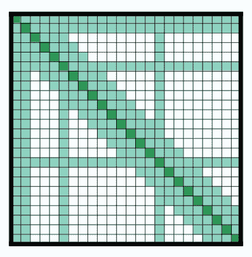

# 注意机制

> 原文链接：[`huggingface.co/docs/transformers/v4.37.2/en/attention`](https://huggingface.co/docs/transformers/v4.37.2/en/attention)

大多数 transformer 模型在注意力矩阵是方形的意义上使用全注意力。当处理长文本时，这可能是一个巨大的计算瓶颈。Longformer 和 reformer 是试图更高效并使用注意力矩阵的稀疏版本来加速训练的模型。

## LSH 注意力

Reformer 使用 LSH 注意力。在 softmax(QK^t) 中，只有矩阵 QK^t 中最大的元素（在 softmax 维度上）才会提供有用的贡献。因此，对于 Q 中的每个查询 q，我们只考虑与 q 接近的 K 中的键 k。使用哈希函数来确定 q 和 k 是否接近。注意力掩码被修改为掩盖当前标记（除了第一个位置），因为它会给出一个相等的查询和键（因此非常相似）。由于哈希可能有点随机，实践中使用了几个哈希函数（由 n_rounds 参数确定），然后对它们进行平均。

## 本地注意力

Longformer 使用本地注意力：通常，局部上下文（例如，左右两个标记是什么？）足以为给定标记采取行动。此外，通过堆叠具有小窗口的注意力层，最后一层将具有超出窗口中标记的感受野，使它们能够构建整个句子的表示。

还有一些预选的输入标记也被给予全局注意力：对于这几个标记，注意力矩阵可以访问所有标记，这个过程是对称的：所有其他标记都可以访问这些特定标记（除了它们本地窗口中的标记）。这在论文的图 2d 中显示，下面是一个示例注意力掩码：

使用这些具有更少参数的注意力矩阵使模型能够具有更大的序列长度。

## 其他技巧

### 轴向位置编码

Reformer 使用轴向位置编码：在传统的 Transformer 模型中，位置编码 E 是一个大小为<math><semantics><mrow><mi>l</mi></mrow><annotation encoding="application/x-tex">l</annotation></semantics></math>l 乘以<math><semantics><mrow><mi>d</mi></mrow><annotation encoding="application/x-tex">d</annotation></semantics></math>d 的矩阵，其中<math><semantics><mrow><mi>l</mi></mrow><annotation encoding="application/x-tex">l</annotation></semantics></math>l 是序列长度，<math><semantics><mrow><mi>d</mi></mrow><annotation encoding="application/x-tex">d</annotation></semantics></math>d 是隐藏状态的维度。如果您有非常长的文本，这个矩阵可能会非常庞大，在 GPU 上占用太多空间。为了缓解这个问题，轴向位置编码包括将这个大矩阵 E 分解为两个较小的矩阵 E1 和 E2，其维度分别为<math><semantics><mrow><msub><mi>l</mi><mn>1</mn></msub><mo>×</mo><msub><mi>d</mi><mn>1</mn></msub></mrow><annotation encoding="application/x-tex">l_{1} \times d_{1}</annotation></semantics></math>l1​×d1​和<math><semantics><mrow><msub><mi>l</mi><mn>2</mn></msub><mo>×</mo><msub><mi>d</mi><mn>2</mn></mrow><annotation encoding="application/x-tex">l_{2} \times d_{2}</annotation></semantics></math>l2​×d2​，使得<math><semantics><mrow><msub><mi>l</mi><mn>1</mn></msub><mo>×</mo><msub><mi>l</mi><mn>2</mn></msub><mo>=</mo><mi>l</mi></mrow><annotation encoding="application/x-tex">l_{1} \times l_{2} = l</annotation></semantics></math>l1​×l2​=l 和<math><semantics><mrow><msub><mi>d</mi><mn>1</mn></msub><mo>+</mo><msub><mi>d</mi><mn>2</mn></mrow><annotation encoding="application/x-tex">d_{1} + d_{2} = d</annotation></semantics></math>d1​+d2​=d（长度的乘积使得结果变得更小）。在矩阵 E 中，时间步<math><semantics><mrow><mi>j</mi></mrow><annotation encoding="application/x-tex">j</annotation></semantics></math>j 的嵌入是通过将 E1 中时间步<math><semantics><mrow><mi>j</mi><mi mathvariant="normal">%</mi><mi>l</mi><mn>1</mn></mrow><annotation encoding="application/x-tex">j \% l1</annotation></semantics></math>j%l1 的嵌入和 E2 中时间步<math><semantics><mrow><mi>j</mi><mi mathvariant="normal">/</mi><mi mathvariant="normal">/</mi><mi>l</mi><mn>1</mn></mrow><annotation encoding="application/x-tex">j // l1</annotation></semantics></math>j//l1 的嵌入进行连接获得的。
