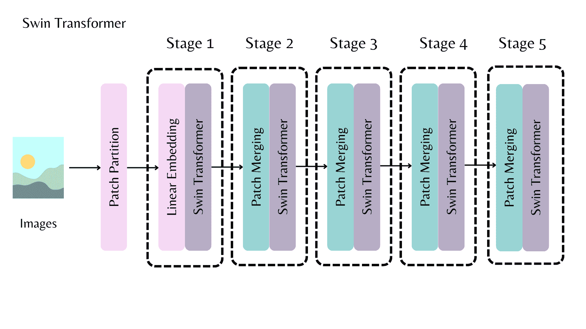
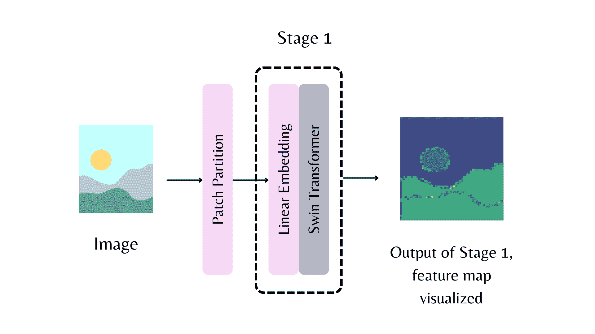

# 骨干

> 原文链接：[`huggingface.co/docs/transformers/v4.37.2/en/main_classes/backbones`](https://huggingface.co/docs/transformers/v4.37.2/en/main_classes/backbones)

骨干是用于计算机视觉任务的特征提取模型。可以通过两种方式之一将模型用作骨干：

+   使用预训练模型初始化`AutoBackbone`类，

+   初始化支持的骨干配置并将其传递给模型架构。

## 使用 AutoBackbone

您可以使用`AutoBackbone`类初始化一个模型作为骨干，并获取任何阶段的特征图。您可以定义`out_indices`来指示您想要从哪些层获取特征图。如果您知道层的名称，也可以使用`out_features`。您可以互换使用它们。如果同时使用`out_indices`和`out_features`，请确保它们是一致的。不传递任何特征图参数将使骨干产生最后一层的特征图。为了可视化各个阶段的外观，让我们以 Swin 模型为例。每个阶段负责特征提取，输出特征图。



第一阶段的特征图如下所示。



让我们通过一个示例来看看。请注意，`out_indices=(0,)`会导致产生模型的 stem。Stem 指的是第一个特征提取阶段之前的阶段。在上图中，它指的是 patch 分区。我们希望从 stem、第一阶段和第二阶段获取特征图。

```py
>>> from transformers import AutoImageProcessor, AutoBackbone
>>> import torch
>>> from PIL import Image
>>> import requests

>>> processor = AutoImageProcessor.from_pretrained("microsoft/swin-tiny-patch4-window7-224")
>>> model = AutoBackbone.from_pretrained("microsoft/swin-tiny-patch4-window7-224", out_indices=(0,1,2))
>>> url = "http://images.cocodataset.org/val2017/000000039769.jpg"
>>> image = Image.open(requests.get(url, stream=True).raw)

>>> inputs = processor(image, return_tensors="pt")
>>> outputs = model(**inputs)
>>> feature_maps = outputs.feature_maps
```

`feature_maps`对象现在有三个特征图，每个都可以像下面这样访问。假设我们想要获取 stem 的特征图。

```py
>>> list(feature_maps[0].shape)
[1, 96, 56, 56]
```

我们可以像下面这样获取第一阶段和第二阶段的特征图。

```py
>>> list(feature_maps[1].shape)
[1, 96, 56, 56]
>>> list(feature_maps[2].shape)
[1, 192, 28, 28]
```

## 初始化骨干配置

在计算机视觉中，模型由骨干、neck 和头部组成。骨干提取特征，neck 转换骨干的输出，头部用于主要任务（例如目标检测）。您可以通过将模型配置传递给`backbone_config`来使用模型骨干初始化 neck 和头部。例如，您可以看到如何使用 ResNet 骨干初始化带有实例分割头部的 MaskFormer 模型。

```py
from transformers import MaskFormerConfig, MaskFormerForInstanceSegmentation, ResNetConfig

backbone_config = ResNetConfig.from_pretrained("microsoft/resnet-50")
config = MaskFormerConfig(backbone_config=backbone_config)
model = MaskFormerForInstanceSegmentation(config)
```

您还可以使用随机权重初始化骨干，以初始化模型的 neck。

```py
backbone_config = ResNetConfig()
config = MaskFormerConfig(backbone_config=backbone_config)
model = MaskFormerForInstanceSegmentation(config)
```

通过`TimmBackbone`和`TimmBackboneConfig`，transformers 还支持`timm`模型。

```py
from transformers import TimmBackboneConfig, TimmBackbone

backbone_config = TimmBackboneConfig("resnet50")
model = TimmBackbone(config=backbone_config)
```
