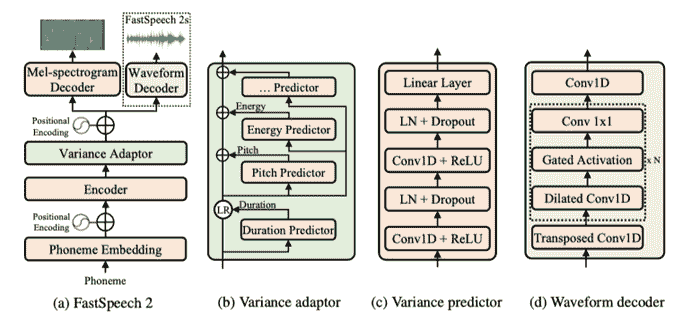
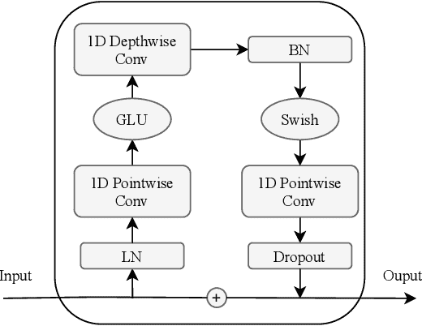

# FastSpeech2Conformer

> 原始文本：[`huggingface.co/docs/transformers/v4.37.2/en/model_doc/fastspeech2_conformer`](https://huggingface.co/docs/transformers/v4.37.2/en/model_doc/fastspeech2_conformer)

## 概述

FastSpeech2Conformer 模型是由 Pengcheng Guo、Florian Boyer、Xuankai Chang、Tomoki Hayashi、Yosuke Higuchi、Hirofumi Inaguma、Naoyuki Kamo、Chenda Li、Daniel Garcia-Romero、Jiatong Shi、Jing Shi、Shinji Watanabe、Kun Wei、Wangyou Zhang 和 Yuekai Zhang 在论文 [Recent Developments On Espnet Toolkit Boosted By Conformer](https://arxiv.org/abs/2010.13956) 中提出的。

原始 FastSpeech2 论文的摘要如下：

*非自回归文本到语音（TTS）模型，如 FastSpeech（Ren 等，2019），可以比以前的具有可比质量的自回归模型更快地合成语音。FastSpeech 模型的训练依赖于自回归教师模型进行持续时间预测（提供更多信息作为输入）和知识蒸馏（简化输出中的数据分布），这可以缓解 TTS 中的一对多映射问题（即，多种语音变体对应相同的文本）。然而，FastSpeech 有几个缺点：1）教师-学生蒸馏流程复杂且耗时，2）从教师模型提取的持续时间不够准确，从教师模型蒸馏的目标 mel-频谱图由于数据简化而遭受信息丢失，这两者限制了语音质量。在本文中，我们提出了 FastSpeech 2，它解决了 FastSpeech 中的问题，并通过以下方式更好地解决了 TTS 中的一对多映射问题：1）直接使用地面真实目标训练模型，而不是来自教师的简化输出，2）引入更多语音变体信息（例如，音高、能量和更准确的持续时间）作为条件输入。具体来说，我们从语音波形中提取持续时间、音高和能量，并直接将它们作为条件输入进行训练，并在推断中使用预测值。我们进一步设计了 FastSpeech 2s，这是第一次尝试从文本中并行直接生成语音波形，享受完全端到端推断的好处。实验结果表明：1）FastSpeech 2 比 FastSpeech 实现了 3 倍的训练加速，FastSpeech 2s 甚至享有更快的推断速度；2）FastSpeech 2 和 2s 在语音质量上优于 FastSpeech，FastSpeech 2 甚至可以超越自回归模型。音频样本可在 [`speechresearch.github.io/fastspeech2/`](https://speechresearch.github.io/fastspeech2/) 上找到。*

此模型由 [Connor Henderson](https://huggingface.co/connor-henderson) 贡献。原始代码可以在 [这里](https://github.com/espnet/espnet/blob/master/espnet2/tts/fastspeech2/fastspeech2.py) 找到。

## 🤗 模型架构

FastSpeech2 的一般结构与 Mel 频谱图解码器一起实现，并且传统的 transformer blocks 被 ESPnet 库中的 conformer blocks 替换。

#### FastSpeech2 模型架构



#### Conformer Blocks


#### 卷积模块



## 🤗 Transformers 使用

您可以在 🤗 Transformers 库中本地运行 FastSpeech2Conformer。

1.  首先安装 🤗 [Transformers 库](https://github.com/huggingface/transformers)，g2p-en：

```py
pip install --upgrade pip
pip install --upgrade transformers g2p-en
```

1.  通过 Transformers 建模代码分别运行推断，使用模型和 hifigan

```py

from transformers import FastSpeech2ConformerTokenizer, FastSpeech2ConformerModel, FastSpeech2ConformerHifiGan
import soundfile as sf

tokenizer = FastSpeech2ConformerTokenizer.from_pretrained("espnet/fastspeech2_conformer")
inputs = tokenizer("Hello, my dog is cute.", return_tensors="pt")
input_ids = inputs["input_ids"]

model = FastSpeech2ConformerModel.from_pretrained("espnet/fastspeech2_conformer")
output_dict = model(input_ids, return_dict=True)
spectrogram = output_dict["spectrogram"]

hifigan = FastSpeech2ConformerHifiGan.from_pretrained("espnet/fastspeech2_conformer_hifigan")
waveform = hifigan(spectrogram)

sf.write("speech.wav", waveform.squeeze().detach().numpy(), samplerate=22050)
```

1.  通过 Transformers 建模代码结合模型和 hifigan 运行推断

```py
from transformers import FastSpeech2ConformerTokenizer, FastSpeech2ConformerWithHifiGan
import soundfile as sf

tokenizer = FastSpeech2ConformerTokenizer.from_pretrained("espnet/fastspeech2_conformer")
inputs = tokenizer("Hello, my dog is cute.", return_tensors="pt")
input_ids = inputs["input_ids"]

model = FastSpeech2ConformerWithHifiGan.from_pretrained("espnet/fastspeech2_conformer_with_hifigan")
output_dict = model(input_ids, return_dict=True)
waveform = output_dict["waveform"]

sf.write("speech.wav", waveform.squeeze().detach().numpy(), samplerate=22050)
```

1.  使用管道运行推断，并指定要使用的声码器

```py
from transformers import pipeline, FastSpeech2ConformerHifiGan
import soundfile as sf

vocoder = FastSpeech2ConformerHifiGan.from_pretrained("espnet/fastspeech2_conformer_hifigan")
synthesiser = pipeline(model="espnet/fastspeech2_conformer", vocoder=vocoder)

speech = synthesiser("Hello, my dog is cooler than you!")

sf.write("speech.wav", speech["audio"].squeeze(), samplerate=speech["sampling_rate"])
```

## FastSpeech2ConformerConfig

### `class transformers.FastSpeech2ConformerConfig`

[<来源>](https://github.com/huggingface/transformers/blob/v4.37.2/src/transformers/models/fastspeech2_conformer/configuration_fastspeech2_conformer.py#L39)

```py
( hidden_size = 384 vocab_size = 78 num_mel_bins = 80 encoder_num_attention_heads = 2 encoder_layers = 4 encoder_linear_units = 1536 decoder_layers = 4 decoder_num_attention_heads = 2 decoder_linear_units = 1536 speech_decoder_postnet_layers = 5 speech_decoder_postnet_units = 256 speech_decoder_postnet_kernel = 5 positionwise_conv_kernel_size = 3 encoder_normalize_before = False decoder_normalize_before = False encoder_concat_after = False decoder_concat_after = False reduction_factor = 1 speaking_speed = 1.0 use_macaron_style_in_conformer = True use_cnn_in_conformer = True encoder_kernel_size = 7 decoder_kernel_size = 31 duration_predictor_layers = 2 duration_predictor_channels = 256 duration_predictor_kernel_size = 3 energy_predictor_layers = 2 energy_predictor_channels = 256 energy_predictor_kernel_size = 3 energy_predictor_dropout = 0.5 energy_embed_kernel_size = 1 energy_embed_dropout = 0.0 stop_gradient_from_energy_predictor = False pitch_predictor_layers = 5 pitch_predictor_channels = 256 pitch_predictor_kernel_size = 5 pitch_predictor_dropout = 0.5 pitch_embed_kernel_size = 1 pitch_embed_dropout = 0.0 stop_gradient_from_pitch_predictor = True encoder_dropout_rate = 0.2 encoder_positional_dropout_rate = 0.2 encoder_attention_dropout_rate = 0.2 decoder_dropout_rate = 0.2 decoder_positional_dropout_rate = 0.2 decoder_attention_dropout_rate = 0.2 duration_predictor_dropout_rate = 0.2 speech_decoder_postnet_dropout = 0.5 max_source_positions = 5000 use_masking = True use_weighted_masking = False num_speakers = None num_languages = None speaker_embed_dim = None is_encoder_decoder = True **kwargs )
```

参数

+   `hidden_size` (`int`, *optional*, defaults to 384) — 隐藏层的维度。

+   `vocab_size` (`int`, *optional*, defaults to 78) — 词汇表的大小。

+   `num_mel_bins` (`int`, *optional*, defaults to 80) — 滤波器组中使用的 mel 滤波器数量。

+   `encoder_num_attention_heads` (`int`, *optional*, defaults to 2) — 编码器中的注意力头数。

+   `encoder_layers` (`int`, *optional*, defaults to 4) — 编码器中的层数。

+   `encoder_linear_units` (`int`, *optional*, defaults to 1536) — 编码器中线性层的单元数。

+   `decoder_layers` (`int`, *optional*, defaults to 4) — 解码器中的层数。

+   `decoder_num_attention_heads` (`int`, *optional*, defaults to 2) — 解码器中的注意力头数。

+   `decoder_linear_units` (`int`, *optional*, defaults to 1536) — 解码器中线性层的单元数。

+   `speech_decoder_postnet_layers` (`int`, *optional*, defaults to 5) — 语音解码器后处理网络中的层数。

+   `speech_decoder_postnet_units` (`int`, *optional*, defaults to 256) — 语音解码器后处理网络中的单元数。

+   `speech_decoder_postnet_kernel` (`int`, *optional*, defaults to 5) — 语音解码器后处理网络中的卷积核大小。

+   `positionwise_conv_kernel_size` (`int`, *optional*, defaults to 3) — 位置感知层中使用的卷积核大小。

+   `encoder_normalize_before` (`bool`, *optional*, defaults to `False`) — 指定是否在编码器层之前进行归一化。

+   `decoder_normalize_before` (`bool`, *optional*, defaults to `False`) — 指定是否在解码器层之前进行归一化。

+   `encoder_concat_after` (`bool`, *optional*, defaults to `False`) — 指定是否在编码器层之后进行连接。

+   `decoder_concat_after` (`bool`, *optional*, defaults to `False`) — 指定是否在解码器层之后进行连接。

+   `reduction_factor` (`int`, *optional*, defaults to 1) — 语音帧速率减少的因子。

+   `speaking_speed` (`float`, *optional*, defaults to 1.0) — 生成语音的速度。

+   `use_macaron_style_in_conformer` (`bool`, *optional*, defaults to `True`) — 指定是否在 conformer 中使用 macaron 风格。

+   `use_cnn_in_conformer` (`bool`, *optional*, defaults to `True`) — 指定是否在 conformer 中使用卷积神经网络。

+   `encoder_kernel_size` (`int`, *optional*, defaults to 7) — 编码器中使用的卷积核大小。

+   `decoder_kernel_size` (`int`, *optional*, defaults to 31) — 解码器中使用的卷积核大小。

+   `duration_predictor_layers` (`int`, *optional*, defaults to 2) — 预测器中的层数。

+   `duration_predictor_channels` (`int`, *optional*, defaults to 256) — 预测器中通道的数量。

+   `duration_predictor_kernel_size` (`int`, *optional*, defaults to 3) — 预测器中使用的卷积核大小。

+   `energy_predictor_layers` (`int`, *optional*, defaults to 2) — 能量预测器中的层数。

+   `energy_predictor_channels` (`int`, *optional*, defaults to 256) — 能量预测器中的通道数。

+   `energy_predictor_kernel_size` (`int`, *optional*, defaults to 3) — 能量预测器中使用的卷积核大小。

+   `energy_predictor_dropout` (`float`, *optional*, defaults to 0.5) — 能量预测器中的 dropout 率。

+   `energy_embed_kernel_size` (`int`, *optional*, defaults to 1) — 能量嵌入层中使用的卷积核大小。

+   `energy_embed_dropout` (`float`, *optional*, defaults to 0.0) — 能量嵌入层中的 dropout 率。

+   `stop_gradient_from_energy_predictor` (`bool`, *optional*, defaults to `False`) — 指定是否从能量预测器中停止梯度。

+   `pitch_predictor_layers` (`int`, *optional*, defaults to 5) — 音高预测器中的层数。

+   `pitch_predictor_channels` (`int`, *optional*, defaults to 256) — 音高预测器中的通道数。

+   `pitch_predictor_kernel_size` (`int`, *optional*, defaults to 5) — 音高预测器中使用的内核大小。

+   `pitch_predictor_dropout` (`float`, *optional*, defaults to 0.5) — 音高预测器中的 dropout 率。

+   `pitch_embed_kernel_size` (`int`, *optional*, defaults to 1) — 音高嵌入层中使用的内核大小。

+   `pitch_embed_dropout` (`float`, *optional*, defaults to 0.0) — 音高嵌入层中的 dropout 率。

+   `stop_gradient_from_pitch_predictor` (`bool`, *optional*, defaults to `True`) — 指定是否停止来自音高预测器的梯度。

+   `encoder_dropout_rate` (`float`, *optional*, defaults to 0.2) — 编码器中的 dropout 率。

+   `encoder_positional_dropout_rate` (`float`, *optional*, defaults to 0.2) — 编码器中的位置 dropout 率。

+   `encoder_attention_dropout_rate` (`float`, *optional*, defaults to 0.2) — 编码器中的注意力 dropout 率。

+   `decoder_dropout_rate` (`float`, *optional*, defaults to 0.2) — 解码器中的 dropout 率。

+   `decoder_positional_dropout_rate` (`float`, *optional*, defaults to 0.2) — 解码器中的位置 dropout 率。

+   `decoder_attention_dropout_rate` (`float`, *optional*, defaults to 0.2) — 解码器中的注意力 dropout 率。

+   `duration_predictor_dropout_rate` (`float`, *optional*, defaults to 0.2) — 持续时间预测器中的 dropout 率。

+   `speech_decoder_postnet_dropout` (`float`, *optional*, defaults to 0.5) — 语音解码器后置网络中的 dropout 率。

+   `max_source_positions` (`int`, *optional*, defaults to 5000) — 如果使用“相对”位置嵌入，则定义最大源输入位置。

+   `use_masking` (`bool`, *optional*, defaults to `True`) — 指定模型是否使用掩码。

+   `use_weighted_masking` (`bool`, *optional*, defaults to `False`) — 指定模型是否使用加权掩码。

+   `num_speakers` (`int`, *optional*) — 说话者数量。如果设置为 > 1，则假定说话者 id 将作为输入提供，并使用说话者 id 嵌入层。

+   `num_languages` (`int`, *optional*) — 语言数量。如果设置为 > 1，则假定语言 id 将作为输入提供，并使用语言 id 嵌入层。

+   `speaker_embed_dim` (`int`, *optional*) — 说话者嵌入维度。如果设置为 > 0，则假定将提供说话者嵌入作为输入。

+   `is_encoder_decoder` (`bool`, *optional*, defaults to `True`) — 指定模型是否为编码器-解码器。

这是用于存储 FastSpeech2ConformerModel 配置的配置类。根据指定的参数实例化一个 FastSpeech2Conformer 模型，定义模型架构。使用默认值实例化配置将产生类似于 FastSpeech2Conformer [espnet/fastspeech2_conformer](https://huggingface.co/espnet/fastspeech2_conformer)架构的配置。

配置对象继承自 PretrainedConfig，可用于控制模型输出。阅读来自 PretrainedConfig 的文档以获取更多信息。

示例：

```py
>>> from transformers import FastSpeech2ConformerModel, FastSpeech2ConformerConfig

>>> # Initializing a FastSpeech2Conformer style configuration
>>> configuration = FastSpeech2ConformerConfig()

>>> # Initializing a model from the FastSpeech2Conformer style configuration
>>> model = FastSpeech2ConformerModel(configuration)

>>> # Accessing the model configuration
>>> configuration = model.config
```

## FastSpeech2ConformerHifiGanConfig

### `class transformers.FastSpeech2ConformerHifiGanConfig`

[<来源>](https://github.com/huggingface/transformers/blob/v4.37.2/src/transformers/models/fastspeech2_conformer/configuration_fastspeech2_conformer.py#L340)

```py
( model_in_dim = 80 upsample_initial_channel = 512 upsample_rates = [8, 8, 2, 2] upsample_kernel_sizes = [16, 16, 4, 4] resblock_kernel_sizes = [3, 7, 11] resblock_dilation_sizes = [[1, 3, 5], [1, 3, 5], [1, 3, 5]] initializer_range = 0.01 leaky_relu_slope = 0.1 normalize_before = True **kwargs )
```

参数

+   `model_in_dim` (`int`, *optional*, defaults to 80) — 输入对数梅尔频谱图中的频率箱数。

+   `upsample_initial_channel` (`int`, *可选*, 默认为 512) — 进入上采样网络的输入通道数。

+   `upsample_rates` (`Tuple[int]` 或 `List[int]`, *可选*, 默认为 `[8, 8, 2, 2]`) — 一个整数元组，定义了上采样网络中每个 1D 卷积层的步幅。*upsample_rates* 的长度定义了卷积层的数量，并且必须与 *upsample_kernel_sizes* 的长度匹配。

+   `upsample_kernel_sizes` (`Tuple[int]` 或 `List[int]`, *可选*, 默认为 `[16, 16, 4, 4]`) — 一个整数元组，定义了上采样网络中每个 1D 卷积层的内核大小。*upsample_kernel_sizes* 的长度定义了卷积层的数量，并且必须与 *upsample_rates* 的长度匹配。

+   `resblock_kernel_sizes` (`Tuple[int]` 或 `List[int]`, *可选*, 默认为 `[3, 7, 11]`) — 一个整数元组，定义了多接受域融合（MRF）模块中 1D 卷积层的内核大小。

+   `resblock_dilation_sizes` (`Tuple[Tuple[int]]` 或 `List[List[int]]`, *可选*, 默认为 `[[1, 3, 5], [1, 3, 5], [1, 3, 5]]`) — 一个嵌套的整数元组，定义了多接受域融合（MRF）模块中扩张的 1D 卷积层的扩张率。

+   `initializer_range` (`float`, *可选*, 默认为 0.01) — 用于初始化所有权重矩阵的截断正态初始化器的标准差。

+   `leaky_relu_slope` (`float`, *可选*, 默认为 0.1) — leaky ReLU 激活函数使用的负斜率的角度。

+   `normalize_before` (`bool`, *可选*, 默认为 `True`) — 是否在使用语音合成器的学习均值和方差进行声谱归一化之前对声谱进行归一化。

这是用于存储 `FastSpeech2ConformerHifiGanModel` 配置的配置类。根据指定的参数实例化一个 FastSpeech2Conformer HiFi-GAN 语音合成模型，定义模型架构。使用默认值实例化一个配置将产生类似于 FastSpeech2Conformer [espnet/fastspeech2_conformer_hifigan](https://huggingface.co/espnet/fastspeech2_conformer_hifigan) 架构的配置。

配置对象继承自 PretrainedConfig，可用于控制模型输出。阅读来自 PretrainedConfig 的文档以获取更多信息。

示例：

```py
>>> from transformers import FastSpeech2ConformerHifiGan, FastSpeech2ConformerHifiGanConfig

>>> # Initializing a FastSpeech2ConformerHifiGan configuration
>>> configuration = FastSpeech2ConformerHifiGanConfig()

>>> # Initializing a model (with random weights) from the configuration
>>> model = FastSpeech2ConformerHifiGan(configuration)

>>> # Accessing the model configuration
>>> configuration = model.config
```

## FastSpeech2ConformerWithHifiGanConfig

### `class transformers.FastSpeech2ConformerWithHifiGanConfig`

[< source >](https://github.com/huggingface/transformers/blob/v4.37.2/src/transformers/models/fastspeech2_conformer/configuration_fastspeech2_conformer.py#L419)

```py
( model_config: Dict = None vocoder_config: Dict = None **kwargs )
```

参数

+   `model_config` (`typing.Dict`, *可选*) — 文本到语音模型的配置。

+   `vocoder_config` (`typing.Dict`, *可选*) — 语音合成模型的配置。

这是用于存储 FastSpeech2ConformerWithHifiGan 配置的配置类。根据指定的子模型配置实例化一个 `FastSpeech2ConformerWithHifiGanModel` 模型，定义模型架构。

使用默认值实例化一个配置将产生类似于 FastSpeech2ConformerModel [espnet/fastspeech2_conformer](https://huggingface.co/espnet/fastspeech2_conformer) 和 FastSpeech2ConformerHifiGan [espnet/fastspeech2_conformer_hifigan](https://huggingface.co/espnet/fastspeech2_conformer_hifigan) 架构的配置。

配置对象继承自 PretrainedConfig，可用于控制模型输出。阅读 PretrainedConfig 的文档以获取更多信息。

model_config（FastSpeech2ConformerConfig，*optional*）：文本到语音模型的配置。vocoder_config（`FastSpeech2ConformerHiFiGanConfig`，*optional*）：声码器模型的配置。

示例：

```py
>>> from transformers import (
...     FastSpeech2ConformerConfig,
...     FastSpeech2ConformerHifiGanConfig,
...     FastSpeech2ConformerWithHifiGanConfig,
...     FastSpeech2ConformerWithHifiGan,
... )

>>> # Initializing FastSpeech2ConformerWithHifiGan sub-modules configurations.
>>> model_config = FastSpeech2ConformerConfig()
>>> vocoder_config = FastSpeech2ConformerHifiGanConfig()

>>> # Initializing a FastSpeech2ConformerWithHifiGan module style configuration
>>> configuration = FastSpeech2ConformerWithHifiGanConfig(model_config.to_dict(), vocoder_config.to_dict())

>>> # Initializing a model (with random weights)
>>> model = FastSpeech2ConformerWithHifiGan(configuration)

>>> # Accessing the model configuration
>>> configuration = model.config
```

## FastSpeech2ConformerTokenizer

### `class transformers.FastSpeech2ConformerTokenizer`

[<来源>](https://github.com/huggingface/transformers/blob/v4.37.2/src/transformers/models/fastspeech2_conformer/tokenization_fastspeech2_conformer.py#L43)

```py
( vocab_file bos_token = '<sos/eos>' eos_token = '<sos/eos>' pad_token = '<blank>' unk_token = '<unk>' should_strip_spaces = False **kwargs )
```

参数

+   `vocab_file` (`str`) — 词汇表文件的路径。

+   `bos_token` (`str`, *optional*, defaults to `"<sos/eos>"`) — 序列开始标记。请注意，对于 FastSpeech2，它与`eos_token`相同。

+   `eos_token` (`str`, *optional*, defaults to `"<sos/eos>"`) — 序列结束标记。请注意，对于 FastSpeech2，它与`bos_token`相同。

+   `pad_token` (`str`, *optional*, defaults to `"<blank>"`) — 用于填充的标记，例如在批处理不同长度的序列时使用。

+   `unk_token` (`str`, *optional*, defaults to `"<unk>"`) — 未知标记。词汇表中没有的标记无法转换为 ID，而是设置为此标记。

+   `should_strip_spaces` (`bool`, *optional*, defaults to `False`) — 是否去除标记列表中的空格。

构建一个 FastSpeech2Conformer 分词器。

#### `__call__`

[<来源>](https://github.com/huggingface/transformers/blob/v4.37.2/src/transformers/tokenization_utils_base.py#L2729)

```py
( text: Union = None text_pair: Union = None text_target: Union = None text_pair_target: Union = None add_special_tokens: bool = True padding: Union = False truncation: Union = None max_length: Optional = None stride: int = 0 is_split_into_words: bool = False pad_to_multiple_of: Optional = None return_tensors: Union = None return_token_type_ids: Optional = None return_attention_mask: Optional = None return_overflowing_tokens: bool = False return_special_tokens_mask: bool = False return_offsets_mapping: bool = False return_length: bool = False verbose: bool = True **kwargs ) → export const metadata = 'undefined';BatchEncoding
```

参数

+   `text` (`str`, `List[str]`, `List[List[str]]`, *optional*) — 要编码的序列或批处理的序列。每个序列可以是字符串或字符串列表（预先标记化的字符串）。如果将序列提供为字符串列表（预先标记化），则必须设置`is_split_into_words=True`（以消除与批处理序列的歧义）。

+   `text_pair` (`str`, `List[str]`, `List[List[str]]`, *optional*) — 要编码的序列或批处理的序列。每个序列可以是字符串或字符串列表（预先标记化的字符串）。如果将序列提供为字符串列表（预先标记化），则必须设置`is_split_into_words=True`（以消除与批处理序列的歧义）。

+   `text_target` (`str`, `List[str]`, `List[List[str]]`, *optional*) — 要编码为目标文本的序列或批处理的序列。每个序列可以是字符串或字符串列表（预先标记化的字符串）。如果将序列提供为字符串列表（预先标记化），则必须设置`is_split_into_words=True`（以消除与批处理序列的歧义）。

+   `text_pair_target` (`str`, `List[str]`, `List[List[str]]`, *optional*) — 要编码为目标文本的序列或批处理的序列。每个序列可以是字符串或字符串列表（预先标记化的字符串）。如果将序列提供为字符串列表（预先标记化），则必须设置`is_split_into_words=True`（以消除与批处理序列的歧义）。

+   `add_special_tokens` (`bool`, *optional*, defaults to `True`) — 在编码序列时是否添加特殊标记。这将使用底层的`PretrainedTokenizerBase.build_inputs_with_special_tokens`函数，该函数定义了自动添加到输入 ID 的标记。如果要自动添加`bos`或`eos`标记，则这很有用。

+   `padding` (`bool`, `str` or PaddingStrategy, *optional*, defaults to `False`) — 激活和控制填充。接受以下值：

    +   `True` 或 `'longest'`: 填充到批次中最长的序列（如果只提供了单个序列，则不填充）。

    +   `'max_length'`: 填充到由参数 `max_length` 指定的最大长度，或者如果未提供该参数，则填充到模型的最大可接受输入长度。

    +   `False` 或 `'do_not_pad'` (默认): 不填充（即，可以输出具有不同长度序列的批次）。

+   `truncation` (`bool`, `str` 或 TruncationStrategy, *可选*, 默认为 `False`) — 激活和控制截断。接受以下值：

    +   `True` 或 `'longest_first'`: 截断到由参数 `max_length` 指定的最大长度，或者如果未提供该参数，则截断到模型的最大可接受输入长度。如果提供了一对序列（或一批对序列），则逐标记截断，从一对序列中最长的序列中删除一个标记。

    +   `'only_first'`: 截断到由参数 `max_length` 指定的最大长度，或者如果未提供该参数，则截断到模型的最大可接受输入长度。如果提供了一对序列（或一批对序列），则仅截断第一个序列。

    +   `'only_second'`: 截断到由参数 `max_length` 指定的最大长度，或者如果未提供该参数，则截断到模型的最大可接受输入长度。如果提供了一对序列（或一批对序列），则仅截断第二个序列。

    +   `False` 或 `'do_not_truncate'` (默认): 不截断（即，可以输出序列长度大于模型最大可接受输入大小的批次）。

+   `max_length` (`int`, *可选*) — 控制截断/填充参数使用的最大长度。

    如果未设置或设置为 `None`，则如果截断/填充参数中需要最大长度，则将使用预定义的模型最大长度。如果模型没有特定的最大输入长度（如 XLNet），则将禁用截断/填充到最大长度。

+   `stride` (`int`, *可选*, 默认为 0) — 如果与 `max_length` 一起设置为一个数字，则当 `return_overflowing_tokens=True` 时返回的溢出标记将包含截断序列末尾的一些标记，以提供截断和溢出序列之间的一些重叠。该参数的值定义了重叠标记的数量。

+   `is_split_into_words` (`bool`, *可选*, 默认为 `False`) — 输入是否已经预分词（例如，已分割为单词）。如果设置为 `True`，分词器将假定输入已经分割为单词（例如，通过在空格上分割），然后对其进行分词。这对于命名实体识别或标记分类很有用。

+   `pad_to_multiple_of` (`int`, *可选*) — 如果设置，将序列填充到提供的值的倍数。需要激活 `padding`。这对于在具有计算能力 `>= 7.5`（Volta）的 NVIDIA 硬件上启用 Tensor Cores 特别有用。

+   `return_tensors` (`str` 或 TensorType, *可选*) — 如果设置，将返回张量而不是 Python 整数列表。可接受的值为：

    +   `'tf'`: 返回 TensorFlow `tf.constant` 对象。

    +   `'pt'`: 返回 PyTorch `torch.Tensor` 对象。

    +   `'np'`: 返回 Numpy `np.ndarray` 对象。

+   `return_token_type_ids` (`bool`, *可选*) — 是否返回标记类型 ID。如果保持默认设置，将根据特定分词器的默认设置返回标记类型 ID，由 `return_outputs` 属性定义。

    什么是标记类型 ID？

+   `return_attention_mask` (`bool`, *可选*) — 是否返回注意力遮罩。如果保持默认设置，将根据特定分词器的默认设置返回注意力遮罩，由 `return_outputs` 属性定义。

    什么是注意力掩码？

+   `return_overflowing_tokens` (`bool`，*可选*，默认为`False`) — 是否返回溢出的令牌序列。如果提供了一对输入 ID 序列（或一批对），并且`truncation_strategy = longest_first`或`True`，则会引发错误，而不是返回溢出的令牌。

+   `return_special_tokens_mask` (`bool`，*可选*，默认为`False`) — 是否返回特殊令牌掩码信息。

+   `return_offsets_mapping` (`bool`，*可选*，默认为`False`) — 是否返回每个令牌的`(char_start，char_end)`。

    仅适用于继承自 PreTrainedTokenizerFast 的快速分词器，如果使用 Python 的分词器，此方法将引发`NotImplementedError`。

+   `return_length` (`bool`，*可选*，默认为`False`) — 是否返回编码输入的长度。

+   `verbose` (`bool`，*可选*，默认为`True`) — 是否打印更多信息和警告。**kwargs — 传递给`self.tokenize()`方法

返回

BatchEncoding

具有以下字段的 BatchEncoding：

+   `input_ids` — 要馈送到模型的令牌 ID 列表。

    什么是输入 ID？

+   `token_type_ids` — 要馈送到模型的令牌类型 ID 列表（当`return_token_type_ids=True`或*`token_type_ids`*在`self.model_input_names`中时）。

    什么是令牌类型 ID？

+   `attention_mask` — 指定哪些令牌应由模型关注的索引列表（当`return_attention_mask=True`或*`attention_mask`*在`self.model_input_names`中时）。

    什么是注意力掩码？

+   `overflowing_tokens` — 溢出令牌序列的列表（当指定`max_length`并且`return_overflowing_tokens=True`时）。

+   `num_truncated_tokens` — 截断的令牌数（当指定`max_length`并且`return_overflowing_tokens=True`时）。

+   `special_tokens_mask` — 由 0 和 1 组成的列表，其中 1 指定添加的特殊令牌，0 指定常规序列令牌（当`add_special_tokens=True`和`return_special_tokens_mask=True`时）。

+   `length` — 输入的长度（当`return_length=True`时）

对一个或多个序列或一个或多个序列对进行标记化和准备模型的主要方法。

#### `save_vocabulary`

[<来源>](https://github.com/huggingface/transformers/blob/v4.37.2/src/transformers/models/fastspeech2_conformer/tokenization_fastspeech2_conformer.py#L159)

```py
( save_directory: str filename_prefix: Optional = None ) → export const metadata = 'undefined';Tuple(str)
```

参数

+   `save_directory`（`str`） — 要保存词汇表的目录。

返回

`Tuple(str)`

保存的文件路径。

将词汇表和特殊令牌文件保存到目录。

#### `decode`

[<来源>](https://github.com/huggingface/transformers/blob/v4.37.2/src/transformers/models/fastspeech2_conformer/tokenization_fastspeech2_conformer.py#L146)

```py
( token_ids **kwargs )
```

#### `batch_decode`

[<来源>](https://github.com/huggingface/transformers/blob/v4.37.2/src/transformers/tokenization_utils_base.py#L3692)

```py
( sequences: Union skip_special_tokens: bool = False clean_up_tokenization_spaces: bool = None **kwargs ) → export const metadata = 'undefined';List[str]
```

参数

+   `sequences`（`Union[List[int]，List[List[int]]，np.ndarray，torch.Tensor，tf.Tensor]`） — 标记化输入 ID 的列表。可以使用`__call__`方法获得。

+   `skip_special_tokens` (`bool`，*可选*，默认为`False`) — 是否在解码中删除特殊令牌。

+   `clean_up_tokenization_spaces` (`bool`，*可选*） — 是否清理标记化空格。如果为`None`，将默认为`self.clean_up_tokenization_spaces`。

+   `kwargs`（附加关键字参数，*可选*） — 将传递给底层模型特定的解码方法。

返回

`List[str]`

解码句子列表。

通过调用解码将令牌 ID 列表的列表转换为字符串列表。

## FastSpeech2ConformerModel

### `class transformers.FastSpeech2ConformerModel`

[<来源>](https://github.com/huggingface/transformers/blob/v4.37.2/src/transformers/models/fastspeech2_conformer/modeling_fastspeech2_conformer.py#L1100)

```py
( config: FastSpeech2ConformerConfig )
```

参数

+   `config`（FastSpeech2ConformerConfig）- 具有模型所有参数的模型配置类。使用配置文件初始化不会加载与模型关联的权重，只加载配置。查看 from_pretrained()方法以加载模型权重。

FastSpeech2Conformer 模型。该模型继承自 PreTrainedModel。检查超类文档以获取库为其所有模型实现的通用方法（例如下载或保存、调整输入嵌入、修剪头等）。

该模型也是 PyTorch [torch.nn.Module](https://pytorch.org/docs/stable/nn.html#torch.nn.Module)子类。将其用作常规 PyTorch 模块，并参考 PyTorch 文档以获取与一般用法和行为相关的所有事项。

FastSpeech 2 模块。

这是 FastSpeech 2 中描述的模块，详见‘FastSpeech 2: Fast and High-Quality End-to-End Text to Speech’ [`arxiv.org/abs/2006.04558`](https://arxiv.org/abs/2006.04558)。我们使用 FastPitch 中引入的令牌平均值，而不是量化音高和能量。编码器和解码器是 Conformers 而不是常规 Transformers。

#### `forward`

[<来源>](https://github.com/huggingface/transformers/blob/v4.37.2/src/transformers/models/fastspeech2_conformer/modeling_fastspeech2_conformer.py#L1181)

```py
( input_ids: LongTensor attention_mask: Optional = None spectrogram_labels: Optional = None duration_labels: Optional = None pitch_labels: Optional = None energy_labels: Optional = None speaker_ids: Optional = None lang_ids: Optional = None speaker_embedding: Optional = None return_dict: Optional = None output_attentions: Optional = None output_hidden_states: Optional = None ) → export const metadata = 'undefined';transformers.models.fastspeech2_conformer.modeling_fastspeech2_conformer.FastSpeech2ConformerModelOutput or tuple(torch.FloatTensor)
```

参数

+   `input_ids`（形状为`(batch_size, sequence_length)`的`torch.LongTensor`）- 文本向量的输入序列。

+   `attention_mask`（形状为`(batch_size, sequence_length)`的`torch.LongTensor`，*可选*，默认为`None`）- 避免在填充标记索引上执行卷积和注意力的掩码。选择在`[0, 1]`中的掩码值：0 表示**掩码**的标记，1 表示**未掩码**的标记。

+   `spectrogram_labels`（形状为`(batch_size, max_spectrogram_length, num_mel_bins)`的`torch.FloatTensor`，*可选*，默认为`None`）- 填充目标特征的批次。

+   `duration_labels`（形状为`(batch_size, sequence_length + 1)`的`torch.LongTensor`，*可选*，默认为`None`）- 填充的持续时间批次。

+   `pitch_labels`（形状为`(batch_size, sequence_length + 1, 1)`的`torch.FloatTensor`，*可选*，默认为`None`）- 填充的令牌平均音高批次。

+   `energy_labels`（形状为`(batch_size, sequence_length + 1, 1)`的`torch.FloatTensor`，*可选*，默认为`None`）- 填充的令牌平均能量。

+   `speaker_ids`（形状为`(batch_size, 1)`的`torch.LongTensor`，*可选*，默认为`None`）- 用于调节模型输出语音特征的说话者 id。

+   `lang_ids`（形状为`(batch_size, 1)`的`torch.LongTensor`，*可选*，默认为`None`）- 用于调节模型输出语音特征的语言 id。

+   `speaker_embedding`（形状为`(batch_size, embedding_dim)`的`torch.FloatTensor`，*可选*，默认为`None`）- 包含语音特征的调节信号的嵌入。

+   `return_dict`（`bool`，*可选*，默认为`None`）- 是否返回`FastSpeech2ConformerModelOutput`而不是普通元组。

+   `output_attentions`（`bool`，*可选*，默认为`None`）- 是否返回所有注意力层的注意力张量。有关更多详细信息，请参阅返回张量下的`attentions`。

+   `output_hidden_states`（`bool`，*可选*，默认为`None`）- 是否返回所有层的隐藏状态。有关更多详细信息，请参阅返回张量下的`hidden_states`。

返回

`transformers.models.fastspeech2_conformer.modeling_fastspeech2_conformer.FastSpeech2ConformerModelOutput`或`tuple(torch.FloatTensor)`

一个`transformers.models.fastspeech2_conformer.modeling_fastspeech2_conformer.FastSpeech2ConformerModelOutput`或一个`torch.FloatTensor`元组（如果传递了`return_dict=False`或`config.return_dict=False`时）包括各种元素，取决于配置（FastSpeech2ConformerConfig）和输入。

+   `loss`（`torch.FloatTensor`，形状为`(1,)`，*可选*，当提供`labels`时返回）— 频谱图生成损失。

+   `spectrogram`（`torch.FloatTensor`，形状为`(batch_size, sequence_length, num_bins)`）— 预测的频谱图。

+   `encoder_last_hidden_state`（`torch.FloatTensor`，形状为`(batch_size, sequence_length, hidden_size)`，*可选*）— 模型编码器最后一层的隐藏状态序列。

+   `encoder_hidden_states`（`tuple(torch.FloatTensor)`，*可选*，当传递`output_hidden_states=True`或`config.output_hidden_states=True`时返回）— 形状为`(batch_size, sequence_length, hidden_size)`的`torch.FloatTensor`元组（如果模型有嵌入层，则为嵌入输出的一个，加上每一层的输出的一个）。

    编码器在每一层输出的隐藏状态加上初始嵌入输出。

+   `encoder_attentions`（`tuple(torch.FloatTensor)`，*可选*，当传递`output_attentions=True`或`config.output_attentions=True`时返回）— 形状为`(batch_size, num_heads, sequence_length, sequence_length)`的`torch.FloatTensor`元组。

    编码器的注意力权重，在注意力 softmax 之后，用于计算自注意力头中的加权平均值。

+   `decoder_hidden_states`（`tuple(torch.FloatTensor)`，*可选*，当传递`output_hidden_states=True`或`config.output_hidden_states=True`时返回）— 形状为`(batch_size, sequence_length, hidden_size)`的`torch.FloatTensor`元组（如果模型有嵌入层，则为嵌入输出的一个，加上每一层的输出的一个）。

    解码器在每一层输出的隐藏状态加上初始嵌入输出。

+   `decoder_attentions`（`tuple(torch.FloatTensor)`，*可选*，当传递`output_attentions=True`或`config.output_attentions=True`时返回）— 形状为`(batch_size, num_heads, sequence_length, sequence_length)`的`torch.FloatTensor`元组。

    解码器的注意力权重，在注意力 softmax 之后，用于计算自注意力头中的加权平均值。

+   `duration_outputs`（`torch.LongTensor`，形状为`(batch_size, max_text_length + 1)`，*可选*）— 时长预测器的输出。

+   `pitch_outputs`（`torch.FloatTensor`，形状为`(batch_size, max_text_length + 1, 1)`，*可选*）— 音高预测器的输出。

+   `energy_outputs`（`torch.FloatTensor`，形状为`(batch_size, max_text_length + 1, 1)`，*可选*）— 能量预测器的输出。

示例：

```py
>>> from transformers import (
...     FastSpeech2ConformerTokenizer,
...     FastSpeech2ConformerModel,
...     FastSpeech2ConformerHifiGan,
... )

>>> tokenizer = FastSpeech2ConformerTokenizer.from_pretrained("espnet/fastspeech2_conformer")
>>> inputs = tokenizer("some text to convert to speech", return_tensors="pt")
>>> input_ids = inputs["input_ids"]

>>> model = FastSpeech2ConformerModel.from_pretrained("espnet/fastspeech2_conformer")
>>> output_dict = model(input_ids, return_dict=True)
>>> spectrogram = output_dict["spectrogram"]

>>> vocoder = FastSpeech2ConformerHifiGan.from_pretrained("espnet/fastspeech2_conformer_hifigan")
>>> waveform = vocoder(spectrogram)
>>> print(waveform.shape)
torch.Size([1, 49664])
```

## FastSpeech2ConformerHifiGan

### `class transformers.FastSpeech2ConformerHifiGan`

[< source >](https://github.com/huggingface/transformers/blob/v4.37.2/src/transformers/models/fastspeech2_conformer/modeling_fastspeech2_conformer.py#L1446)

```py
( config: FastSpeech2ConformerHifiGanConfig )
```

参数

+   `config`（FastSpeech2ConformerConfig）— 包含模型所有参数的模型配置类。使用配置文件初始化不会加载与模型相关的权重，只会加载配置。查看 from_pretrained()方法以加载模型权重。

HiFi-GAN 语音合成器。此模型继承自 PreTrainedModel。检查超类文档以获取库为所有模型实现的通用方法（如下载或保存、调整输入嵌入、修剪头等）。

此模型还是一个 PyTorch [torch.nn.Module](https://pytorch.org/docs/stable/nn.html#torch.nn.Module) 子类。将其用作常规的 PyTorch 模块，并参考 PyTorch 文档以获取与一般用法和行为相关的所有事项。

#### `forward`

[< source >](https://github.com/huggingface/transformers/blob/v4.37.2/src/transformers/models/fastspeech2_conformer/modeling_fastspeech2_conformer.py#L1516)

```py
( spectrogram: FloatTensor ) → export const metadata = 'undefined';torch.FloatTensor
```

参数

+   `spectrogram` (`torch.FloatTensor`) — 包含对数梅尔频谱图的张量。可以是批量处理的，形状为 `(batch_size, sequence_length, config.model_in_dim)`，也可以是未批量处理的，形状为 `(sequence_length, config.model_in_dim)`。

返回

`torch.FloatTensor`

包含语音波形的张量。如果输入的频谱图是批量处理的，则形状为 `(batch_size, num_frames,)`。如果未批量处理，则形状为 `(num_frames,)`。

将对数梅尔频谱图转换为语音波形。传递一批对数梅尔频谱图将返回一批语音波形。传递单个未批量处理的对数梅尔频谱图将返回单个未批量处理的语音波形。

## FastSpeech2ConformerWithHifiGan

### `class transformers.FastSpeech2ConformerWithHifiGan`

[< source >](https://github.com/huggingface/transformers/blob/v4.37.2/src/transformers/models/fastspeech2_conformer/modeling_fastspeech2_conformer.py#L1564)

```py
( config: FastSpeech2ConformerWithHifiGanConfig )
```

参数

+   `config` (FastSpeech2ConformerWithHifiGanConfig) — 具有模型所有参数的模型配置类。使用配置文件初始化不会加载与模型关联的权重，只加载配置。查看 from_pretrained() 方法以加载模型权重。

FastSpeech2ConformerModel 具有 FastSpeech2ConformerHifiGan 语音合成器头部，执行文本转语音（波形）。此模型继承自 PreTrainedModel。检查超类文档以获取库为所有模型实现的通用方法（如下载或保存、调整输入嵌入、修剪头等）。

此模型还是一个 PyTorch [torch.nn.Module](https://pytorch.org/docs/stable/nn.html#torch.nn.Module) 子类。将其用作常规的 PyTorch 模块，并参考 PyTorch 文档以获取与一般用法和行为相关的所有事项。

#### `forward`

[< source >](https://github.com/huggingface/transformers/blob/v4.37.2/src/transformers/models/fastspeech2_conformer/modeling_fastspeech2_conformer.py#L1579)

```py
( input_ids: LongTensor attention_mask: Optional = None spectrogram_labels: Optional = None duration_labels: Optional = None pitch_labels: Optional = None energy_labels: Optional = None speaker_ids: Optional = None lang_ids: Optional = None speaker_embedding: Optional = None return_dict: Optional = None output_attentions: Optional = None output_hidden_states: Optional = None ) → export const metadata = 'undefined';transformers.models.fastspeech2_conformer.modeling_fastspeech2_conformer.FastSpeech2ConformerWithHifiGanOutput or tuple(torch.FloatTensor)
```

参数

+   `input_ids` (`torch.LongTensor` of shape `(batch_size, sequence_length)`) — 文本向量的输入序列。

+   `attention_mask` (`torch.LongTensor` of shape `(batch_size, sequence_length)`, *optional*, defaults to `None`) — 避免在填充令牌索引上执行卷积和注意力的掩码。掩码值选在 `[0, 1]`：0 表示**掩码**的令牌，1 表示**未掩码**的令牌。

+   `spectrogram_labels` (`torch.FloatTensor` of shape `(batch_size, max_spectrogram_length, num_mel_bins)`, *optional*, defaults to `None`) — 批量填充的目标特征。

+   `duration_labels` (`torch.LongTensor` of shape `(batch_size, sequence_length + 1)`, *optional*, defaults to `None`) — 批量填充的持续时间。

+   `pitch_labels` (`torch.FloatTensor` of shape `(batch_size, sequence_length + 1, 1)`, *optional*, defaults to `None`) — 批量填充的令牌平均音高。

+   `energy_labels` (`torch.FloatTensor` of shape `(batch_size, sequence_length + 1, 1)`, *optional*, defaults to `None`) — 填充的令牌平均能量的批量。

+   `speaker_ids` (`torch.LongTensor` of shape `(batch_size, 1)`, *optional*, defaults to `None`) — 用于调节模型输出语音特征的说话者 id。

+   `lang_ids` (`torch.LongTensor` of shape `(batch_size, 1)`, *optional*, defaults to `None`) — 用于调节模型输出语音特征的语言 id。

+   `speaker_embedding` (`torch.FloatTensor` of shape `(batch_size, embedding_dim)`, *optional*, defaults to `None`) — 包含语音特征调节信号的嵌入。

+   `return_dict` (`bool`, *optional*, defaults to `None`) — 是否返回`FastSpeech2ConformerModelOutput`而不是普通元组。

+   `output_attentions` (`bool`, *optional*, defaults to `None`) — 是否返回所有注意力层的注意力张量。有关更多详细信息，请参见返回张量下的`attentions`。

+   `output_hidden_states` (`bool`, *optional*, defaults to `None`) — 是否返回所有层的隐藏状态。有关更多详细信息，请参见返回张量下的`hidden_states`。

返回

`transformers.models.fastspeech2_conformer.modeling_fastspeech2_conformer.FastSpeech2ConformerWithHifiGanOutput`或`tuple(torch.FloatTensor)`

一个`transformers.models.fastspeech2_conformer.modeling_fastspeech2_conformer.FastSpeech2ConformerWithHifiGanOutput`或一个`torch.FloatTensor`元组（如果传递`return_dict=False`或`config.return_dict=False`，则返回）包含根据配置（`<class 'transformers.models.fastspeech2_conformer.configuration_fastspeech2_conformer.FastSpeech2ConformerWithHifiGanConfig'>`）和输入的各种元素。

+   `waveform` (`torch.FloatTensor` of shape `(batch_size, audio_length)`) — 通过声码器将预测的梅尔频谱图传递后的语音输出。

+   `loss` (`torch.FloatTensor` of shape `(1,)`, *optional*, 当提供`labels`时返回) — 频谱图生成损失。

+   `spectrogram` (`torch.FloatTensor` of shape `(batch_size, sequence_length, num_bins)`) — 预测的频谱图。

+   `encoder_last_hidden_state` (`torch.FloatTensor` of shape `(batch_size, sequence_length, hidden_size)`, *optional*) — 模型编码器最后一层的隐藏状态序列。

+   `encoder_hidden_states` (`tuple(torch.FloatTensor)`, *optional*, 当传递`output_hidden_states=True`或`config.output_hidden_states=True`时返回) — 形状为`(batch_size, sequence_length, hidden_size)`的`torch.FloatTensor`元组。

    编码器每层的隐藏状态加上初始嵌入输出。

+   `encoder_attentions` (`tuple(torch.FloatTensor)`, *optional*, 当传递`output_attentions=True`或`config.output_attentions=True`时返回) — 形状为`(batch_size, num_heads, sequence_length, sequence_length)`的`torch.FloatTensor`元组。

    编码器的注意力权重，在注意力 softmax 之后，用于计算自注意力头中的加权平均值。

+   `decoder_hidden_states` (`tuple(torch.FloatTensor)`, *optional*, 当传递`output_hidden_states=True`或`config.output_hidden_states=True`时返回) — 形状为`(batch_size, sequence_length, hidden_size)`的`torch.FloatTensor`元组。

    每层解码器的输出隐藏状态加上初始嵌入输出。

+   `decoder_attentions` (`tuple(torch.FloatTensor)`, *optional*, 当传递`output_attentions=True`或`config.output_attentions=True`时返回) — 形状为`(batch_size, num_heads, sequence_length, sequence_length)`的`torch.FloatTensor`元组。

    解码器的注意力权重，在注意力 softmax 之后，用于计算自注意力头中的加权平均值。

+   `duration_outputs` (`torch.LongTensor` of shape `(batch_size, max_text_length + 1)`, *optional*) — 持续时间预测器的输出。

+   `pitch_outputs` (`torch.FloatTensor` of shape `(batch_size, max_text_length + 1, 1)`, *optional*) — 音高预测器的输出。

+   `energy_outputs` (`torch.FloatTensor` of shape `(batch_size, max_text_length + 1, 1)`, *optional*) — 能量预测器的输出。

示例：

```py
>>> from transformers import (
...     FastSpeech2ConformerTokenizer,
...     FastSpeech2ConformerWithHifiGan,
... )

>>> tokenizer = FastSpeech2ConformerTokenizer.from_pretrained("espnet/fastspeech2_conformer")
>>> inputs = tokenizer("some text to convert to speech", return_tensors="pt")
>>> input_ids = inputs["input_ids"]

>>> model = FastSpeech2ConformerWithHifiGan.from_pretrained("espnet/fastspeech2_conformer_with_hifigan")
>>> output_dict = model(input_ids, return_dict=True)
>>> waveform = output_dict["waveform"]
>>> print(waveform.shape)
torch.Size([1, 49664])
```
