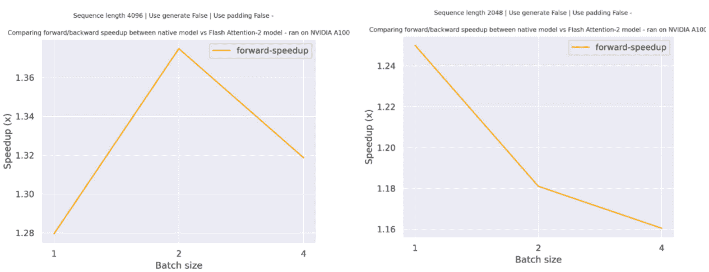

# GPTBigCode

> 原始文本：[`huggingface.co/docs/transformers/v4.37.2/en/model_doc/gpt_bigcode`](https://huggingface.co/docs/transformers/v4.37.2/en/model_doc/gpt_bigcode)

## 概述

GPTBigCode 模型是由 BigCode 在[SantaCoder: don’t reach for the stars!](https://arxiv.org/abs/2301.03988)中提出的。列出的作者包括：Loubna Ben Allal、Raymond Li、Denis Kocetkov、Chenghao Mou、Christopher Akiki、Carlos Munoz Ferrandis、Niklas Muennighoff、Mayank Mishra、Alex Gu、Manan Dey、Logesh Kumar Umapathi、Carolyn Jane Anderson、Yangtian Zi、Joel Lamy Poirier、Hailey Schoelkopf、Sergey Troshin、Dmitry Abulkhanov、Manuel Romero、Michael Lappert、Francesco De Toni、Bernardo García del Río、Qian Liu、Shamik Bose、Urvashi Bhattacharyya、Terry Yue Zhuo、Ian Yu、Paulo Villegas、Marco Zocca、Sourab Mangrulkar、David Lansky、Huu Nguyen、Danish Contractor、Luis Villa、Jia Li、Dzmitry Bahdanau、Yacine Jernite、Sean Hughes、Daniel Fried、Arjun Guha、Harm de Vries、Leandro von Werra。

论文摘要如下：

*BigCode 项目是一个开放的科学合作项目，致力于负责任地开发用于代码的大型语言模型。这份技术报告描述了合作项目直到 2022 年 12 月的进展，概述了个人可识别信息（PII）遮蔽管道的当前状态，用于降低模型架构风险的实验，以及用于训练数据的更好预处理方法的实验。我们在 The Stack 的 Java、JavaScript 和 Python 子集上训练了 1.1B 参数模型，并在 MultiPL-E 文本到代码基准上对其进行评估。我们发现更激进地过滤近似重复内容可以进一步提升性能，并且令人惊讶的是，从拥有 5 个以上 GitHub 星标的存储库中选择文件会显著降低性能。我们的最佳模型在 MultiPL-E 的 Java、JavaScript 和 Python 部分的左到右生成和填充方面优于先前的开源多语言代码生成模型（InCoder-6.7B 和 CodeGen-Multi-2.7B），尽管它是一个规模较小的模型。所有模型都在[此链接](https://huggingface.co/bigcode)下以 OpenRAIL 许可证发布。*

该模型是一个优化的[GPT2 模型](https://huggingface.co/docs/transformers/model_doc/gpt2)，支持多查询注意力。

## 实现细节

与 GPT2 相比的主要区别。

+   增加了对多查询注意力的支持。

+   使用`gelu_pytorch_tanh`代替经典的`gelu`。

+   避免不必要的同步（这已经添加到 GPT2 中＃20061，但在参考代码库中没有）。

+   使用线性层代替 Conv1D（速度提升很好，但会使检查点不兼容）。

+   合并`_attn`和`_upcast_and_reordered_attn`。始终将矩阵乘法与缩放合并。将`reorder_and_upcast_attn`重命名为`attention_softmax_in_fp32`

+   缓存注意力掩码值，以避免每次重新创建它。

+   使用 jit 来融合注意力 fp32 转换、掩码、softmax 和缩放。

+   将注意力和因果掩码合并为一个，为整个模型预先计算，而不是每个层都计算。

+   将键和值缓存合并为一个（这会改变 layer_past/present 的格式，是否会有问题？）

+   使用内存布局（self.num_heads, 3, self.head_dim）而不是`(3, self.num_heads, self.head_dim)`用于具有 MHA 的 QKV 张量。 （防止与合并的键和值产生开销，但使检查点与原始 gpt2 模型不兼容）。

您可以在[原始拉取请求](https://github.com/huggingface/transformers/pull/22575)中阅读更多关于优化的信息。

## 将 Starcoder 和 Flash Attention 2 结合使用

首先，请确保安装最新版本的 Flash Attention 2，以包括滑动窗口注意力功能。

```py
pip install -U flash-attn --no-build-isolation
```

还要确保您有与 Flash-Attention 2 兼容的硬件。在 flash-attn 存储库的官方文档中了解更多信息。还要确保以半精度加载模型（例如`torch.float16“）

要加载和运行使用 Flash Attention 2 的模型，请参考下面的代码片段：

```py
>>> import torch
>>> from transformers import AutoModelForCausalLM, AutoTokenizer
>>> device = "cuda" # the device to load the model onto

>>> model = AutoModelForCausalLM.from_pretrained("bigcode/gpt_bigcode-santacoder", torch_dtype=torch.float16, attn_implementation="flash_attention_2")
>>> tokenizer = AutoTokenizer.from_pretrained("bigcode/gpt_bigcode-santacoder")

>>> prompt = "def hello_world():"

>>> model_inputs = tokenizer([prompt], return_tensors="pt").to(device)
>>> model.to(device)

>>> generated_ids = model.generate(**model_inputs, max_new_tokens=30, do_sample=False)
>>> tokenizer.batch_decode(generated_ids)[0]
'def hello_world():\n    print("hello world")\n\nif __name__ == "__main__":\n    print("hello world")\n<|endoftext|>'
```

### 预期加速

下面是一个预期加速图表，比较了在 transformers 中使用`bigcode/starcoder`检查点的原生实现和使用模型的 Flash Attention 2 版本在两种不同序列长度下的纯推理时间。



## GPTBigCodeConfig

### `class transformers.GPTBigCodeConfig`

[< source >](https://github.com/huggingface/transformers/blob/v4.37.2/src/transformers/models/gpt_bigcode/configuration_gpt_bigcode.py#L28)

```py
( vocab_size = 50257 n_positions = 1024 n_embd = 768 n_layer = 12 n_head = 12 n_inner = None activation_function = 'gelu_pytorch_tanh' resid_pdrop = 0.1 embd_pdrop = 0.1 attn_pdrop = 0.1 layer_norm_epsilon = 1e-05 initializer_range = 0.02 scale_attn_weights = True use_cache = True bos_token_id = 50256 eos_token_id = 50256 attention_softmax_in_fp32 = True scale_attention_softmax_in_fp32 = True multi_query = True **kwargs )
```

参数

+   `vocab_size` (`int`, *optional*, 默认为 50257) — GPT-2 模型的词汇大小。定义了在调用 GPTBigCodeModel 时可以表示的不同标记数量。

+   `n_positions` (`int`, *optional*, 默认为 1024) — 此模型可能使用的最大序列长度。通常将其设置为较大的值以防万一（例如 512、1024 或 2048）。

+   `n_embd` (`int`, *optional*, 默认为 768) — 嵌入和隐藏状态的维度。

+   `n_layer` (`int`, *optional*, 默认为 12) — Transformer 编码器中的隐藏层数量。

+   `n_head` (`int`, *optional*, 默认为 12) — Transformer 编码器中每个注意力层的注意力头数。

+   `n_inner` (`int`, *optional*, 默认为 None) — 内部前馈层的维度。`None`将将其设置为 4 倍的 n_embd。

+   `activation_function` (`str`, *optional*, 默认为`"gelu_pytorch_tanh"`) — 激活函数，可在列表`["relu", "silu", "gelu", "tanh", "gelu_new", "gelu_pytorch_tanh"]`中选择。

+   `resid_pdrop` (`float`, *optional*, 默认为 0.1) — 嵌入、编码器和池化器中所有全连接层的 dropout 概率。

+   `embd_pdrop` (`float`, *optional*, 默认为 0.1) — 嵌入的 dropout 比率。

+   `attn_pdrop` (`float`, *optional*, 默认为 0.1) — 注意力的 dropout 比率。

+   `layer_norm_epsilon` (`float`, *optional*, 默认为 1e-5) — 在层归一化层中使用的 epsilon。

+   `initializer_range` (`float`, *optional*, 默认为 0.02) — 用于初始化所有权重矩阵的截断正态初始化器的标准差。

+   `scale_attn_weights` (`bool`, *optional*, 默认为`True`) — 通过将其除以 sqrt(hidden_size)来缩放注意力权重。

+   `use_cache` (`bool`, *optional*, 默认为`True`) — 模型是否应返回最后的键/值注意力（并非所有模型都使用）。

+   `attention_softmax_in_fp32` (`bool`, *optional*, 默认为`True`) — 是否在 float32 中调用融合 softmax。

+   `scale_attention_softmax_in_fp32` (`bool`, *optional*, 默认为`True`) — 是否在 float32 中缩放注意力 softmax。

+   `attention_type` (`bool`, *optional*, 默认为`True`) — 是否使用多查询注意力(`True`)或多头注意力(`False`)。

这是一个配置类，用于存储 GPTBigCodeModel 的配置。根据指定的参数实例化一个 GPTBigCode 模型，定义模型架构。使用默认值实例化配置将产生类似于 GPTBigCode [gpt_bigcode](https://huggingface.co/gpt_bigcode)架构的配置。

配置对象继承自 PretrainedConfig，可用于控制模型输出。阅读来自 PretrainedConfig 的文档以获取更多信息。

示例：

```py
>>> from transformers import GPTBigCodeConfig, GPTBigCodeModel

>>> # Initializing a GPTBigCode configuration
>>> configuration = GPTBigCodeConfig()

>>> # Initializing a model (with random weights) from the configuration
>>> model = GPTBigCodeModel(configuration)

>>> # Accessing the model configuration
>>> configuration = model.config
```

## GPTBigCodeModel

### `class transformers.GPTBigCodeModel`

[< source >](https://github.com/huggingface/transformers/blob/v4.37.2/src/transformers/models/gpt_bigcode/modeling_gpt_bigcode.py#L903)

```py
( config )
```

参数

+   `config`（GPTBigCodeConfig）- 模型配置类，包含模型的所有参数。使用配置文件初始化不会加载与模型相关的权重，只加载配置。查看 from_pretrained() 方法以加载模型权重。

裸的 GPT_BIGCODE 模型变压器输出原始隐藏状态，没有特定的头部。

此模型继承自 PreTrainedModel。查看超类文档以了解库为所有模型实现的通用方法（如下载或保存、调整输入嵌入、修剪头等）。

此模型还是 PyTorch [torch.nn.Module](https://pytorch.org/docs/stable/nn.html#torch.nn.Module) 的子类。将其用作常规 PyTorch 模块，并参考 PyTorch 文档以获取有关一般用法和行为的所有相关信息。

#### `forward`

[< source >](https://github.com/huggingface/transformers/blob/v4.37.2/src/transformers/models/gpt_bigcode/modeling_gpt_bigcode.py#L939)

```py
( input_ids: Optional = None past_key_values: Optional = None attention_mask: Optional = None token_type_ids: Optional = None position_ids: Optional = None head_mask: Optional = None inputs_embeds: Optional = None encoder_hidden_states: Optional = None encoder_attention_mask: Optional = None use_cache: Optional = None output_attentions: Optional = None output_hidden_states: Optional = None return_dict: Optional = None ) → export const metadata = 'undefined';transformers.modeling_outputs.BaseModelOutputWithPastAndCrossAttentions or tuple(torch.FloatTensor)
```

参数

+   `input_ids`（形状为 `(batch_size, input_ids_length)` 的 `torch.Tensor`）- 如果 `past_key_values` 为 `None`，则 `input_ids_length` = `sequence_length`，否则为 `past_key_values[0][0].shape[-2]`（输入过去键值状态的序列长度）。词汇表中输入序列标记的索引。

    如果使用了 `past_key_values`，则只应传递那些没有计算过去的 `input_ids` 作为 `input_ids`。

    可以使用 AutoTokenizer 获取索引。查看 PreTrainedTokenizer.encode() 和 PreTrainedTokenizer.`call`() 以获取详细信息。

    什么是输入 ID？

+   `past_key_values`（长度为 `config.n_layers` 的 `Tuple[torch.Tensor]`）- 包含由模型计算的预计算隐藏状态（注意力块中的键和值），如模型计算的 `past_key_values` 输出所示。可用于加速顺序解码。已给定其过去的 `input_ids` 不应作为 `input_ids` 传递，因为它们已经计算过。

+   `attention_mask`（形状为 `(batch_size, sequence_length)` 的 `torch.Tensor`，*可选*）- 避免对填充标记索引执行注意力的掩码。掩码值选在 `[0, 1]`：

    +   1 用于“未被掩码”的标记，

    +   0 用于被“掩码”掉的标记。

    如果使用了 `past_key_values`，则 `attention_mask` 需要包含用于 `past_key_values` 的掩码策略。换句话说，`attention_mask` 总是必须具有长度：`len(past_key_values) + len(input_ids)`

    什么是注意力掩码？

+   `token_type_ids`（形状为 `(batch_size, input_ids_length)` 的 `torch.Tensor`，*可选*）- 段标记索引，指示输入的第一部分和第二部分。索引选在 `[0, 1]`：

    +   0 对应于 *句子 A* 标记，

    +   1 对应于 *句子 B* 标记。

    什么是标记类型 ID？

+   `position_ids`（`torch.Tensor`，形状为`(batch_size, sequence_length)`，*可选*）- 每个输入序列标记在位置嵌入中的位置索引。选择范围为`[0, config.max_position_embeddings - 1]`。

    什么是位置 ID？

+   `head_mask`（`torch.Tensor`，形状为`(num_heads,)`或`(num_layers, num_heads)`，*可选*）- 用于使自注意力模块的选定头部失效的掩码。掩码值选择在`[0, 1]`之间：

    +   1 表示头部`未被掩盖`，

    +   0 表示头部`被掩盖`。

+   `inputs_embeds`（`torch.Tensor`，形状为`(batch_size, sequence_length, hidden_size)`，*可选*）- 可选地，可以直接传递嵌入表示而不是传递`input_ids`。如果您想要更多控制如何将`input_ids`索引转换为相关向量，而不是使用模型的内部嵌入查找矩阵，这将非常有用。

    如果使用`past_key_values`，可选地只需输入最后的`inputs_embeds`（参见`past_key_values`输入）。

+   `use_cache`（`bool`，*可选*）- 如果设置为`True`，则返回`past_key_values`键值状态，可用于加速解码（参见`past_key_values`）。

+   `output_attentions`（`bool`，*可选*）- 是否返回所有注意力层的注意力张量。有关更多详细信息，请参见返回张量下的`attentions`。

+   `output_hidden_states`（`bool`，*可选*）- 是否返回所有层的隐藏状态。有关更多详细信息，请参见返回张量下的`hidden_states`。

+   `return_dict`（`bool`，*可选*）- 是否返回 ModelOutput 而不是普通元组。

返回

transformers.modeling_outputs.BaseModelOutputWithPastAndCrossAttentions 或`tuple(torch.FloatTensor)`

一个 transformers.modeling_outputs.BaseModelOutputWithPastAndCrossAttentions 或一个`torch.FloatTensor`元组（如果传递了`return_dict=False`或当`config.return_dict=False`时）包含根据配置（GPTBigCodeConfig）和输入的不同元素。

+   `last_hidden_state`（`torch.FloatTensor`，形状为`(batch_size, sequence_length, hidden_size)`）- 模型最后一层输出的隐藏状态序列。

    如果使用`past_key_values`，则只输出形状为`(batch_size, 1, hidden_size)`的序列的最后一个隐藏状态。

+   `past_key_values`（`tuple(tuple(torch.FloatTensor))`，*可选*，当传递了`use_cache=True`或当`config.use_cache=True`时返回）- 长度为`config.n_layers`的`tuple(torch.FloatTensor)`元组，每个元组有 2 个形状为`(batch_size, num_heads, sequence_length, embed_size_per_head)`的张量，如果`config.is_encoder_decoder=True`还有 2 个额外的形状为`(batch_size, num_heads, encoder_sequence_length, embed_size_per_head)`的张量。

    包含预先计算的隐藏状态（自注意力块中的键和值，以及在交叉注意力块中如果`config.is_encoder_decoder=True`的情况下）可以用于加速顺序解码。

+   `hidden_states`（`tuple(torch.FloatTensor)`，*可选*，当传递了`output_hidden_states=True`或当`config.output_hidden_states=True`时返回）- 形状为`(batch_size, sequence_length, hidden_size)`的`torch.FloatTensor`元组（如果模型有嵌入层的输出，+ 每层的输出）。

    模型在每一层输出的隐藏状态加上可选的初始嵌入输出。

+   `attentions`（`tuple(torch.FloatTensor)`，*可选*，当`output_attentions=True`被传递或当`config.output_attentions=True`时返回）- 形状为`(batch_size, num_heads, sequence_length, sequence_length)`的`torch.FloatTensor`元组（每层一个）。

    在注意力 softmax 之后使用的注意力权重，用于计算自注意力头中的加权平均值。

+   `cross_attentions`（`tuple(torch.FloatTensor)`，*可选*，当`output_attentions=True`和`config.add_cross_attention=True`被传递或当`config.output_attentions=True`时返回）- 形状为`(batch_size, num_heads, sequence_length, sequence_length)`的`torch.FloatTensor`元组（每层一个）。

    解码器的交叉注意力层的注意力权重，在注意力 softmax 之后，用于计算交叉注意力头中的加权平均值。

GPTBigCodeModel 的前进方法，覆盖了`__call__`特殊方法。

虽然前向传递的步骤需要在此函数内定义，但应该在此之后调用`Module`实例，而不是这个，因为前者会处理运行前后处理步骤，而后者会默默地忽略它们。

例子：

```py
>>> from transformers import AutoTokenizer, GPTBigCodeModel
>>> import torch

>>> tokenizer = AutoTokenizer.from_pretrained("bigcode/gpt_bigcode-santacoder")
>>> model = GPTBigCodeModel.from_pretrained("bigcode/gpt_bigcode-santacoder")

>>> inputs = tokenizer("Hello, my dog is cute", return_tensors="pt")
>>> outputs = model(**inputs)

>>> last_hidden_states = outputs.last_hidden_state
```

## GPTBigCodeForCausalLM

### `class transformers.GPTBigCodeForCausalLM`

[<来源>](https://github.com/huggingface/transformers/blob/v4.37.2/src/transformers/models/gpt_bigcode/modeling_gpt_bigcode.py#L1153)

```py
( config )
```

参数

+   `config`（GPTBigCodeConfig）- 具有模型所有参数的模型配置类。使用配置文件初始化不会加载与模型相关联的权重，只会加载配置。查看 from_pretrained()方法以加载模型权重。

GPT_BIGCODE 模型变压器，顶部带有语言建模头（线性层，其权重与输入嵌入相关联）。

此模型继承自 PreTrainedModel。检查超类文档以了解库为其所有模型实现的通用方法（例如下载或保存，调整输入嵌入大小，修剪头等）。

此模型也是 PyTorch [torch.nn.Module](https://pytorch.org/docs/stable/nn.html#torch.nn.Module)子类。将其用作常规 PyTorch 模块，并参考 PyTorch 文档以获取有关一般用法和行为的所有相关信息。

#### `前进`

[<来源>](https://github.com/huggingface/transformers/blob/v4.37.2/src/transformers/models/gpt_bigcode/modeling_gpt_bigcode.py#L1226)

```py
( input_ids: Optional = None past_key_values: Optional = None attention_mask: Optional = None token_type_ids: Optional = None position_ids: Optional = None head_mask: Optional = None inputs_embeds: Optional = None encoder_hidden_states: Optional = None encoder_attention_mask: Optional = None labels: Optional = None use_cache: Optional = None output_attentions: Optional = None output_hidden_states: Optional = None return_dict: Optional = None ) → export const metadata = 'undefined';transformers.modeling_outputs.CausalLMOutputWithCrossAttentions or tuple(torch.FloatTensor)
```

参数

+   `input_ids`（形状为`(batch_size, input_ids_length)`的`torch.Tensor`）- 如果`past_key_values`为`None`，则`input_ids_length`=`sequence_length`，否则`past_key_values[0][0].shape[-2]`（输入过去键值状态的序列长度）。词汇表中输入序列标记的索引。

    如果使用`past_key_values`，则只能将未计算其过去的`input_ids`作为`input_ids`传递。

    可以使用 AutoTokenizer 获取索引。有关详细信息，请参阅 PreTrainedTokenizer.encode()和 PreTrainedTokenizer.`call`()。

    什么是输入 ID？

+   `past_key_values` (`Tuple[torch.Tensor]`，长度为 `config.n_layers`) — 包含由模型计算的预计算隐藏状态（注意力块中的键和值），可用于加速顺序解码。将其过去传递给该模型的 `input_ids` 不应作为 `input_ids` 传递，因为它们已经被计算。

+   `attention_mask` (`torch.Tensor`，形状为 `(batch_size, sequence_length)`，*可选*) — 用于避免在填充令牌索引上执行注意力的掩码。掩码值选在 `[0, 1]`：

    +   对于未被 `masked` 的令牌为 1，

    +   对于被 `masked` 的令牌为 0。

    如果使用了 `past_key_values`，则 `attention_mask` 需要包含用于 `past_key_values` 的掩码策略。换句话说，`attention_mask` 总是需要具有长度：`len(past_key_values) + len(input_ids)`

    注意力掩码是什么？

+   `token_type_ids` (`torch.Tensor`，形状为 `(batch_size, input_ids_length)`，*可选*) — 段令牌索引，用于指示输入的第一部分和第二部分。索引选在 `[0, 1]`：

    +   0 对应于 *句子 A* 令牌，

    +   1 对应于 *句子 B* 令牌。

    令牌类型 ID 是什么？

+   `position_ids` (`torch.Tensor`，形状为 `(batch_size, sequence_length)`，*可选*) — 每个输入序列令牌在位置嵌入中的位置索引。选在范围 `[0, config.max_position_embeddings - 1]`。

    位置 ID 是什么？

+   `head_mask` (`torch.Tensor`，形状为 `(num_heads,)` 或 `(num_layers, num_heads)`，*可选*) — 用于使自注意力模块的选定头部失效的掩码。掩码值选在 `[0, 1]`：

    +   1 表示头部未被 `masked`，

    +   0 表示头部被 `masked`。

+   `inputs_embeds` (`torch.Tensor`，形状为 `(batch_size, sequence_length, hidden_size)`，*可选*) — 可选地，您可以选择直接传递嵌入表示，而不是传递 `input_ids`。如果您想要更多控制权，以便将 `input_ids` 索引转换为相关向量，而不是使用模型的内部嵌入查找矩阵，则这很有用。

    如果使用了 `past_key_values`，则可能只需要输入最后的 `inputs_embeds`（参见 `past_key_values`）。

+   `use_cache` (`bool`，*可选*) — 如果设置为 `True`，将返回 `past_key_values` 键值状态，可用于加速解码（参见 `past_key_values`）。

+   `output_attentions` (`bool`，*可选*) — 是否返回所有注意力层的注意力张量。有关更多详细信息，请参见返回张量下的 `attentions`。

+   `output_hidden_states` (`bool`，*可选*) — 是否返回所有层的隐藏状态。有关更多详细信息，请参见返回张量下的 `hidden_states`。

+   `return_dict` (`bool`，*可选*) — 是否返回一个 ModelOutput 而不是一个普通的元组。

+   `labels` (`torch.Tensor`，形状为 `(batch_size, sequence_length)`，*可选*) — 用于语言建模的标签。请注意，模型内部的标签是**偏移的**，即您可以设置 `labels = input_ids`。索引选在 `[-100, 0, ..., config.vocab_size]` 所有设置为 `-100` 的标签都被忽略（被 `masked`），损失仅计算在 `[0, ..., config.vocab_size]` 的标签上。

返回

transformers.modeling_outputs.CausalLMOutputWithCrossAttentions 或 `tuple(torch.FloatTensor)`

一个 transformers.modeling_outputs.CausalLMOutputWithCrossAttentions 或一个`torch.FloatTensor`元组（如果传递`return_dict=False`或`config.return_dict=False`）包含根据配置（GPTBigCodeConfig）和输入的各种元素。

+   `loss`（形状为`(1,)`的`torch.FloatTensor`，*可选*，当提供`labels`时返回） — 语言建模损失（用于下一个标记预测）。

+   `logits`（形状为`(batch_size, sequence_length, config.vocab_size)`的`torch.FloatTensor`） — 语言建模头的预测分数（SoftMax 之前每个词汇标记的分数）。

+   `hidden_states`（`tuple(torch.FloatTensor)`，*可选*，当传递`output_hidden_states=True`或`config.output_hidden_states=True`时返回） — 形状为`(batch_size, sequence_length, hidden_size)`的`torch.FloatTensor`元组（如果模型有嵌入层的输出，则为嵌入层的输出+每层的输出）。

    模型在每一层输出的隐藏状态以及可选的初始嵌入输出。

+   `attentions`（`tuple(torch.FloatTensor)`，*可选*，当传递`output_attentions=True`或`config.output_attentions=True`时返回） — 形状为`(batch_size, num_heads, sequence_length, sequence_length)`的`torch.FloatTensor`元组（每层一个）。

    注意力 softmax 后的注意力权重，用于计算自注意力头中的加权平均值。

+   `cross_attentions`（`tuple(torch.FloatTensor)`，*可选*，当传递`output_attentions=True`或`config.output_attentions=True`时返回） — 形状为`(batch_size, num_heads, sequence_length, sequence_length)`的`torch.FloatTensor`元组（每层一个）。

    交叉注意力 softmax 后的注意力权重，用于计算交叉注意力头中的加权平均值。

+   `past_key_values`（`tuple(tuple(torch.FloatTensor))`，*可选*，当传递`use_cache=True`或`config.use_cache=True`时返回） — 长度为`config.n_layers`的`torch.FloatTensor`元组，每个元组包含自注意力和交叉注意力层的缓存键、值状态，如果模型用于编码器-解码器设置，则相关。仅在`config.is_decoder = True`时相关。

    包含预先计算的隐藏状态（注意力块中的键和值），可以用来加速顺序解码（参见`past_key_values`输入）。

GPTBigCodeForCausalLM 的前向方法，覆盖了`__call__`特殊方法。

虽然前向传递的方法需要在此函数内定义，但应该在此之后调用`Module`实例，而不是这个，因为前者会负责运行预处理和后处理步骤，而后者会默默地忽略它们。

示例：

```py
>>> import torch
>>> from transformers import AutoTokenizer, GPTBigCodeForCausalLM

>>> tokenizer = AutoTokenizer.from_pretrained("bigcode/gpt_bigcode-santacoder")
>>> model = GPTBigCodeForCausalLM.from_pretrained("bigcode/gpt_bigcode-santacoder")

>>> inputs = tokenizer("Hello, my dog is cute", return_tensors="pt")
>>> outputs = model(**inputs, labels=inputs["input_ids"])
>>> loss = outputs.loss
>>> logits = outputs.logits
```

## GPTBigCodeForSequenceClassification

### `class transformers.GPTBigCodeForSequenceClassification`

[< source >](https://github.com/huggingface/transformers/blob/v4.37.2/src/transformers/models/gpt_bigcode/modeling_gpt_bigcode.py#L1310)

```py
( config )
```

参数

+   `config`（GPTBigCodeConfig） — 包含模型所有参数的模型配置类。使用配置文件初始化不会加载与模型关联的权重，只会加载配置。查看 from_pretrained()方法以加载模型权重。

GPTBigCode 模型变压器，在顶部带有序列分类头（线性层）。

GPTBigCodeForSequenceClassification 使用最后一个令牌来进行分类，就像其他因果模型（例如 GPT-1）一样。

由于它对最后一个令牌进行分类，因此需要知道最后一个令牌的位置。如果在配置中定义了`pad_token_id`，则它会找到每行中不是填充令牌的最后一个令牌。如果未定义`pad_token_id`，则它只需取批处理每行的最后一个值。由于在传递`inputs_embeds`而不是`input_ids`时无法猜测填充令牌，因此它执行相同操作（取批处理每行的最后一个值）。

此模型继承自 PreTrainedModel。检查超类文档以获取库为其所有模型实现的通用方法（例如下载或保存，调整输入嵌入，修剪头等）。

此模型还是 PyTorch [torch.nn.Module](https://pytorch.org/docs/stable/nn.html#torch.nn.Module)子类。将其用作常规 PyTorch 模块，并参考 PyTorch 文档以获取有关一般用法和行为的所有相关信息。

#### `forward`

[<来源>](https://github.com/huggingface/transformers/blob/v4.37.2/src/transformers/models/gpt_bigcode/modeling_gpt_bigcode.py#L1335)

```py
( input_ids: Optional = None past_key_values: Optional = None attention_mask: Optional = None token_type_ids: Optional = None position_ids: Optional = None head_mask: Optional = None inputs_embeds: Optional = None labels: Optional = None use_cache: Optional = None output_attentions: Optional = None output_hidden_states: Optional = None return_dict: Optional = None )
```

参数

+   `input_ids`（形状为`(batch_size, input_ids_length)`的`torch.Tensor`）- 如果`past_key_values`为`None`，则`input_ids_length` = `sequence_length`，否则为`past_key_values[0][0].shape[-2]`（输入过去键值状态的序列长度）。词汇表中输入序列令牌的索引。

    如果使用`past_key_values`，则只应将未计算其过去的`input_ids`作为`input_ids`传递。

    可以使用 AutoTokenizer 获取索引。有关详细信息，请参阅 PreTrainedTokenizer.encode()和 PreTrainedTokenizer.`call`()。

    什么是输入 ID？

+   `past_key_values`（长度为`config.n_layers`的`Tuple[torch.Tensor]`）- 包含由模型计算的预计算隐藏状态（注意力块中的键和值）（请参见下面的`past_key_values`输出）。可用于加速顺序解码。将其过去传递给此模型的`input_ids`不应作为`input_ids`传递，因为它们已经计算过。

+   `attention_mask`（形状为`(batch_size, sequence_length)`的`torch.Tensor`，*可选*）- 用于避免在填充令牌索引上执行注意力的蒙版。蒙版值在`[0, 1]`中选择：

    +   对于未被`掩码`的令牌为 1，

    +   对于被`掩码`的令牌为 0。

    如果使用`past_key_values`，则`attention_mask`需要包含用于`past_key_values`的掩码策略。换句话说，`attention_mask`始终必须具有长度：`len(past_key_values) + len(input_ids)`

    什么是注意力蒙版？

+   `token_type_ids`（形状为`(batch_size, input_ids_length)`的`torch.Tensor`，*可选*）- 段令牌索引，用于指示输入的第一部分和第二部分。索引在`[0, 1]`中选择：

    +   0 对应于*句子 A*令牌，

    +   1 对应于*句子 B*令牌。

    什么是令牌类型 ID？

+   `position_ids`（形状为`(batch_size, sequence_length)`的`torch.Tensor`，*可选*）- 每个输入序列令牌在位置嵌入中的位置索引。在范围`[0, config.max_position_embeddings - 1]`中选择。

    什么是位置 ID？

+   `head_mask` (`torch.Tensor` of shape `(num_heads,)` or `(num_layers, num_heads)`, *optional*) — 用于使自注意力模块的选定头部失效的掩码。掩码值选定在`[0, 1]`范围内：

    +   1 表示头部未被`masked`，

    +   0 表示头部被`masked`。

+   `inputs_embeds` (`torch.Tensor` of shape `(batch_size, sequence_length, hidden_size)`, *optional*) — 可选地，您可以选择直接传递嵌入表示，而不是传递`input_ids`。如果您想要更多控制权，以便将`input_ids`索引转换为相关向量，而不是使用模型的内部嵌入查找矩阵，这将非常有用。

    如果使用`past_key_values`，则可能只需输入最后的`inputs_embeds`（参见`past_key_values`）。

+   `use_cache` (`bool`, *optional*) — 如果设置为`True`，则会返回`past_key_values`键值状态，可以用于加速解码（参见`past_key_values`）。

+   `output_attentions` (`bool`, *optional*) — 是否返回所有注意力层的注意力张量。有关更多详细信息，请参阅返回张量下的`attentions`。

+   `output_hidden_states` (`bool`, *optional*) — 是否返回所有层的隐藏状态。有关更多详细信息，请参阅返回张量下的`hidden_states`。

+   `return_dict` (`bool`, *optional*) — 是否返回一个 ModelOutput 而不是一个普通的元组。

+   `labels` (`torch.Tensor` of shape `(batch_size,)`, *optional*) — 用于计算序列分类/回归损失的标签。索引应在`[0, ..., config.num_labels - 1]`范围内。如果`config.num_labels == 1`，则计算回归损失（均方损失），如果`config.num_labels > 1`，则计算分类损失（交叉熵）。

GPTBigCodeForSequenceClassification 的前向方法，覆盖了`__call__`特殊方法。

虽然前向传递的方法需要在此函数内定义，但应该在此之后调用`Module`实例，而不是在此处调用，因为前者会负责运行前处理和后处理步骤，而后者会默默地忽略它们。

## GPTBigCodeForTokenClassification

### `class transformers.GPTBigCodeForTokenClassification`

[<来源>](https://github.com/huggingface/transformers/blob/v4.37.2/src/transformers/models/gpt_bigcode/modeling_gpt_bigcode.py#L1437)

```py
( config )
```

参数

+   `config`（GPTBigCodeConfig） — 具有模型所有参数的模型配置类。使用配置文件初始化不会加载与模型关联的权重，只加载配置。查看 from_pretrained()方法以加载模型权重。

GPT_BIGCODE 模型，顶部带有一个标记分类头（隐藏状态输出的线性层），例如用于命名实体识别（NER）任务。

这个模型继承自 PreTrainedModel。查看超类文档以获取库为所有模型实现的通用方法（如下载或保存、调整输入嵌入、修剪头等）。

这个模型也是一个 PyTorch [torch.nn.Module](https://pytorch.org/docs/stable/nn.html#torch.nn.Module)子类。将其用作常规的 PyTorch 模块，并参考 PyTorch 文档以获取与一般用法和行为相关的所有事项。

#### `forward`

[<来源>](https://github.com/huggingface/transformers/blob/v4.37.2/src/transformers/models/gpt_bigcode/modeling_gpt_bigcode.py#L1462)

```py
( input_ids: Optional = None past_key_values: Optional = None attention_mask: Optional = None token_type_ids: Optional = None position_ids: Optional = None head_mask: Optional = None inputs_embeds: Optional = None labels: Optional = None use_cache: Optional = None output_attentions: Optional = None output_hidden_states: Optional = None return_dict: Optional = None )
```

参数

+   `input_ids`（形状为`(batch_size, input_ids_length)`的`torch.Tensor`）- 如果`past_key_values`为`None`，则`input_ids_length` = `sequence_length`，否则为`past_key_values[0][0].shape[-2]`（输入过去键值状态的序列长度）。词汇表中输入序列标记的索引。

    如果使用了`past_key_values`，则只有那些未计算过去的`input_ids`应作为`input_ids`传递。

    可以使用 AutoTokenizer 获取索引。有关详细信息，请参见 PreTrainedTokenizer.encode()和 PreTrainedTokenizer.`call`()。

    什么是输入 ID？

+   `past_key_values`（长度为`config.n_layers`的`Tuple[torch.Tensor]`）- 包含由模型计算的预计算隐藏状态（注意力块中的键和值），如下面的`past_key_values`输出所示。可用于加速顺序解码。将其过去给定给该模型的`input_ids`不应作为`input_ids`传递，因为它们已经计算过。

+   `attention_mask`（形状为`(batch_size, sequence_length)`的`torch.Tensor`，*可选*）- 用于避免在填充标记索引上执行注意力的掩码。掩码值在`[0, 1]`中选择：

    +   1 表示未被`masked`的标记，

    +   0 表示被`masked`的标记。

    如果使用了`past_key_values`，则`attention_mask`需要包含用于`past_key_values`的掩码策略。换句话说，`attention_mask`的长度始终必须为：`len(past_key_values) + len(input_ids)`

    什么是注意力掩码？

+   `token_type_ids`（形状为`(batch_size, input_ids_length)`的`torch.Tensor`，*可选*）- 段标记索引，用于指示输入的第一部分和第二部分。索引在`[0, 1]`中选择：

    +   0 对应于*句子 A*标记，

    +   1 对应于*句子 B*标记。

    什么是标记类型 ID？

+   `position_ids`（形状为`(batch_size, sequence_length)`的`torch.Tensor`，*可选*）- 每个输入序列标记在位置嵌入中的位置索引。在范围`[0, config.max_position_embeddings - 1]`中选择。

    什么是位置 ID？

+   `head_mask`（形状为`(num_heads,)`或`(num_layers, num_heads)`的`torch.Tensor`，*可选*）- 用于使自注意力模块的选定头部失效的掩码。掩码值在`[0, 1]`中选择：

    +   1 表示头部未被`masked`，

    +   0 表示头部被`masked`。

+   `inputs_embeds`（形状为`(batch_size, sequence_length, hidden_size)`的`torch.Tensor`，*可选*）- 可选地，您可以选择直接传递嵌入表示，而不是传递`input_ids`。如果您想要更多控制权，以便将`input_ids`索引转换为相关向量，而不是模型的内部嵌入查找矩阵。

    如果使用了`past_key_values`，则只需输入最后的`inputs_embeds`（参见`past_key_values`）。

+   `use_cache`（`bool`，*可选*）- 如果设置为`True`，则返回`past_key_values`键值状态，并可用于加速解码（参见`past_key_values`）。

+   `output_attentions`（`bool`，*可选*）- 是否返回所有注意力层的注意力张量。有关更多详细信息，请参见返回的张量下的`attentions`。

+   `output_hidden_states`（`bool`，*可选*）- 是否返回所有层的隐藏状态。有关更多详细信息，请参见返回的张量下的`hidden_states`。

+   `return_dict`（`bool`，*可选*）- 是否返回 ModelOutput 而不是普通元组。

+   `labels` (`torch.Tensor` of shape `(batch_size, sequence_length)`, *optional*) — 用于计算序列分类/回归损失的标签。索引应在 `[0, ..., config.num_labels - 1]` 范围内。如果 `config.num_labels == 1`，则计算回归损失（均方损失），如果 `config.num_labels > 1`，则计算分类损失（交叉熵）。

GPTBigCodeForTokenClassification 的前向方法重写了 `__call__` 特殊方法。

虽然前向传递的步骤需要在这个函数内定义，但应该在此之后调用 `Module` 实例，而不是这个函数，因为前者会处理运行前后处理步骤，而后者会默默地忽略它们。
