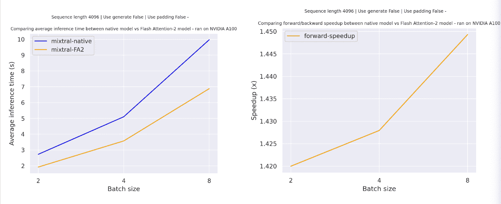

# Mixtral

> 原始文本：[`huggingface.co/docs/transformers/v4.37.2/en/model_doc/mixtral`](https://huggingface.co/docs/transformers/v4.37.2/en/model_doc/mixtral)

## 概述

Mixtral-8x7B 是 Mistral AI 的第二个大型语言模型（LLM）。

Mixtral 模型由[Mistral AI](https://mistral.ai/)团队提出。

它在[Mixtral of Experts 博文](https://mistral.ai/news/mixtral-of-experts/)中介绍如下：

*今天，团队很自豪地发布了 Mixtral 8x7B，这是一个高质量的稀疏专家混合模型（SMoE），具有开放权重。根据 Apache 2.0 许可。Mixtral 在大多数基准测试中表现优于 Llama 2 70B，推理速度快 6 倍。它是具有宽松许可的最强开放权重模型，也是在成本/性能权衡方面最好的模型。特别是，它在大多数标准基准测试中与 GPT3.5 相匹配或优于它。*

提示：

+   模型需要使用[转换脚本](https://github.com/huggingface/transformers/blob/main/src/transformers/models/mixtral/convert_mixtral_weights_to_hf.py)进行转换。

+   如果模型量化为 4 位，一个 A100 就足以容纳整个 45B 模型。

这个模型由[Younes Belkada](https://huggingface.co/ybelkada)和[Arthur Zucker](https://huggingface.co/ArthurZ)贡献。原始代码可以在[这里](https://github.com/mistralai/mistral-src)找到。

### 模型详情

Mixtral-45B 是一个基于解码器的 LM，具有以下架构选择：

+   Mixtral 是一个每个 MLP 有 8 个专家的专家混合（MOE）模型，总共有 45B 个参数，但所需的计算与 14B 模型相同。这是因为即使每个专家都必须加载到 RAM 中（70B 像 RAM 需求一样），隐藏状态中的每个标记都会被分派两次（前 2 个路由），因此计算（每次前向计算所需的操作）只是 2 X 序列长度。

以下实现细节与 Mistral AI 的第一个模型 mistral 共享：

+   滑动窗口注意力 - 使用 8k 上下文长度和固定缓存大小进行训练，理论上的注意力跨度为 128K 个标记

+   GQA（Grouped Query Attention）- 可以实现更快的推理和更小的缓存大小。

+   字节回退 BPE 分词器 - 确保字符永远不会映射到词汇表之外的标记。

他们还提供了一个经过 fine-tuned 的指导模型：`mistralai/Mixtral-8x7B-v0.1`，可用于基于聊天的推理。

有关更多详细信息，请阅读我们的[发布博客文章](https://mistral.ai/news/mixtral-of-experts/)

### 许可证

`Mixtral-8x7B`在 Apache 2.0 许可下发布。

## 使用提示

`Mixtral-8x7B`可以在[Huggingface Hub](https://huggingface.co/mistralai)上找到

这些现成的检查点可以通过 HuggingFace Hub 下载和使用：

```py
>>> from transformers import AutoModelForCausalLM, AutoTokenizer
>>> device = "cuda" # the device to load the model onto

>>> model = AutoModelForCausalLM.from_pretrained("mistralai/Mixtral-8x7B-v0.1")
>>> tokenizer = AutoTokenizer.from_pretrained("mistralai/Mixtral-8x7B-v0.1")

>>> prompt = "My favourite condiment is"

>>> model_inputs = tokenizer([prompt], return_tensors="pt").to(device)
>>> model.to(device)

>>> generated_ids = model.generate(**model_inputs, max_new_tokens=100, do_sample=True)
>>> tokenizer.batch_decode(generated_ids)[0]
"The expected output"
```

要在 HuggingFace 中使用原始检查点，可以使用`convert_mixtral_weights_to_hf.py`脚本将其转换为 HuggingFace 格式：

```py
python src/transformers/models/mixtral/convert_mixtral_weights_to_hf.py \
    --input_dir /path/to/downloaded/mistral/weights --output_dir /output/path
```

然后可以从`output/path`加载转换后的模型：

```py
from transformers import MixtralForCausalLM, LlamaTokenizer

tokenizer = LlamaTokenizer.from_pretrained("/output/path")
model = MixtralForCausalLM.from_pretrained("/output/path")
```

## 结合 Mixtral 和 Flash Attention 2

首先，请确保安装最新版本的 Flash Attention 2 以包括滑动窗口注意力功能。

```py
pip install -U flash-attn --no-build-isolation
```

还要确保您的硬件与 Flash-Attention 2 兼容。在[`flash-attn`](https://github.com/Dao-AILab/flash-attention)存储库的官方文档中了解更多信息。还要确保以半精度（例如`torch.float16`）加载您的模型。

要加载和运行使用 Flash Attention 2 的模型，请参考下面的代码片段：

```py
>>> import torch
>>> from transformers import AutoModelForCausalLM, AutoTokenizer
>>> device = "cuda" # the device to load the model onto

>>> model = AutoModelForCausalLM.from_pretrained("mistralai/Mixtral-8x7B-v0.1", torch_dtype=torch.float16, attn_implementation="flash_attention_2")
>>> tokenizer = AutoTokenizer.from_pretrained("mistralai/Mixtral-8x7B-v0.1")

>>> prompt = "My favourite condiment is"

>>> model_inputs = tokenizer([prompt], return_tensors="pt").to(device)
>>> model.to(device)

>>> generated_ids = model.generate(**model_inputs, max_new_tokens=100, do_sample=True)
>>> tokenizer.batch_decode(generated_ids)[0]
"The expected output"
```

### 预期的加速度

下面是一个预期的加速度图，比较了 transformers 中使用`mistralai/Mixtral-8x7B-v0.1`检查点和模型的 Flash Attention 2 版本之间的纯推理时间。



### 滑动窗口注意力

当前实现支持滑动窗口注意力机制和内存高效的缓存管理。要启用滑动窗口注意力，只需确保具有与滑动窗口注意力兼容的`flash-attn`版本（`>=2.3.0`）。

Flash Attention-2 模型还使用了一种更节省内存的缓存切片机制 - 正如 Mistral 模型的官方实现建议的那样，我们保持缓存大小固定（`self.config.sliding_window`），仅支持`padding_side="left"`的批量生成，并使用当前标记的绝对位置来计算位置嵌入。

## Mistral 团队

Albert Jiang, Alexandre Sablayrolles, Arthur Mensch, Chris Bamford, Devendra Singh Chaplot, Diego de las Casas, Florian Bressand, Gianna Lengyel, Guillaume Lample, Lélio Renard Lavaud, Lucile Saulnier, Marie-Anne Lachaux, Pierre Stock, Teven Le Scao, Thibaut Lavril, Thomas Wang, Timothée Lacroix, William El Sayed。

## MixtralConfig

### `class transformers.MixtralConfig`

[<来源>](https://github.com/huggingface/transformers/blob/v4.37.2/src/transformers/models/mixtral/configuration_mixtral.py#L28)

```py
( vocab_size = 32000 hidden_size = 4096 intermediate_size = 14336 num_hidden_layers = 32 num_attention_heads = 32 num_key_value_heads = 8 hidden_act = 'silu' max_position_embeddings = 131072 initializer_range = 0.02 rms_norm_eps = 1e-05 use_cache = True pad_token_id = None bos_token_id = 1 eos_token_id = 2 tie_word_embeddings = False rope_theta = 1000000.0 sliding_window = None attention_dropout = 0.0 num_experts_per_tok = 2 num_local_experts = 8 output_router_logits = False router_aux_loss_coef = 0.001 **kwargs )
```

参数

+   `vocab_size` (`int`, *可选*，默认为 32000) — Mixtral 模型的词汇量。定义了在调用 MixtralModel 时可以表示的不同标记的数量。

+   `hidden_size` (`int`, *可选*，默认为 4096) — 隐藏表示的维度。

+   `intermediate_size` (`int`, *可选*，默认为 14336) — MLP 表示的维度。

+   `num_hidden_layers` (`int`, *可选*，默认为 32) — Transformer 编码器中的隐藏层数。

+   `num_attention_heads` (`int`, *可选*，默认为 32) — Transformer 编码器中每个注意力层的注意力头数。

+   `num_key_value_heads` (`int`, *可选*，默认为 8) — 这是应该用于实现分组查询注意力的 key_value 头的数量。如果`num_key_value_heads=num_attention_heads`，模型将使用多头注意力（MHA），如果`num_key_value_heads=1`，模型将使用多查询注意力（MQA），否则将使用 GQA。将多头检查点转换为 GQA 检查点时，应通过对该组中所有原始头进行均值池化来构建每个组键和值头。有关更多详细信息，请查看[此论文](https://arxiv.org/pdf/2305.13245.pdf)。如果未指定，将默认为`8`。

+   `hidden_act` (`str`或`function`，*可选*，默认为`"silu"`) — 解码器中的非线性激活函数（函数或字符串）。

+   `max_position_embeddings` (`int`, *可选*，默认为`4096*32`) — 该模型可能会使用的最大序列长度。Mixtral 的滑动窗口注意力允许最多 4096*32 个标记的序列。

+   `initializer_range` (`float`, *可选*，默认为 0.02) — 用于初始化所有权重矩阵的截断正态初始化器的标准差。

+   `rms_norm_eps` (`float`, *可选*，默认为 1e-05) — rms 归一化层使用的 epsilon。

+   `use_cache` (`bool`, *可选*，默认为`True`) — 模型是否应返回最后的键/值注意力（并非所有模型都使用）。仅在`config.is_decoder=True`时相关。

+   `pad_token_id` (`int`, *可选*) — 填充标记的 id。

+   `bos_token_id` (`int`, *可选*，默认为 1) — “序列开始”标记的 id。

+   `eos_token_id` (`int`, *可选*，默认为 2) — “序列结束”标记的 id。

+   `tie_word_embeddings` (`bool`, *可选*，默认为`False`) — 模型的输入和输出词嵌入是否应该被绑定。

+   `rope_theta` (`float`, *可选*，默认为 1000000.0) — RoPE 嵌入的基本周期。

+   `sliding_window` (`int`, *可选*) — 滑动窗口注意力窗口大小。如果未指定，将默认为`4096`。

+   `attention_dropout`（`float`，*可选*，默认为 0.0）— 注意力概率的 dropout 比率。

+   `num_experts_per_tok`（`int`，*可选*，默认为 2）— 每个标记的根专家数，也可以解释为`top-p`路由参数

+   `num_local_experts`（`int`，*可选*，默认为 8）— 每个稀疏 MLP 层的专家数。

+   `output_router_logits`（`bool`，*可选*，默认为`False`）— 是否应该由模型返回路由器 logits。启用此选项还将允许模型输出辅助损失。有关更多详细信息，请参见此处

+   `router_aux_loss_coef`（`float`，*可选*，默认为 0.001）— 总损失的辅助损失因子。

这是用于存储 MixtralModel 配置的配置类。它用于根据指定的参数实例化一个 Mixtral 模型，定义模型架构。使用默认值实例化配置将产生类似于 Mixtral-7B-v0.1 或 Mixtral-7B-Instruct-v0.1 的配置。

[mixtralai/Mixtral-8x7B](https://huggingface.co/mixtralai/Mixtral-8x7B) [mixtralai/Mixtral-7B-Instruct-v0.1](https://huggingface.co/mixtralai/Mixtral-7B-Instruct-v0.1)

配置对象继承自 PretrainedConfig，可用于控制模型输出。阅读 PretrainedConfig 的文档以获取更多信息。

```py
>>> from transformers import MixtralModel, MixtralConfig

>>> # Initializing a Mixtral 7B style configuration
>>> configuration = MixtralConfig()

>>> # Initializing a model from the Mixtral 7B style configuration
>>> model = MixtralModel(configuration)

>>> # Accessing the model configuration
>>> configuration = model.config
```

## MixtralModel

### `class transformers.MixtralModel`

[<来源>](https://github.com/huggingface/transformers/blob/v4.37.2/src/transformers/models/mixtral/modeling_mixtral.py#L1032)

```py
( config: MixtralConfig )
```

参数

+   `config`（MixtralConfig）— 具有模型所有参数的模型配置类。使用配置文件初始化不会加载与模型关联的权重，只加载配置。查看 from_pretrained()方法以加载模型权重。配置 — MixtralConfig

裸 Mixtral 模型输出原始隐藏状态，没有特定的头部。此模型继承自 PreTrainedModel。检查超类文档以获取库为所有模型实现的通用方法（例如下载或保存、调整输入嵌入、修剪头等）。

此模型也是 PyTorch [torch.nn.Module](https://pytorch.org/docs/stable/nn.html#torch.nn.Module)子类。将其用作常规 PyTorch 模块，并参考 PyTorch 文档以获取有关一般用法和行为的所有相关信息。

由*config.num_hidden_layers*层组成的 Transformer 解码器。每一层都是一个`MixtralDecoderLayer`

#### `forward`

[<来源>](https://github.com/huggingface/transformers/blob/v4.37.2/src/transformers/models/mixtral/modeling_mixtral.py#L1068)

```py
( input_ids: LongTensor = None attention_mask: Optional = None position_ids: Optional = None past_key_values: Optional = None inputs_embeds: Optional = None use_cache: Optional = None output_attentions: Optional = None output_hidden_states: Optional = None output_router_logits: Optional = None return_dict: Optional = None )
```

参数

+   `input_ids`（形状为`(batch_size, sequence_length)`的`torch.LongTensor`）— 词汇表中输入序列标记的索引。默认情况下将忽略填充。

    可以使用 AutoTokenizer 获取索引。有关详细信息，请参阅 PreTrainedTokenizer.encode()和 PreTrainedTokenizer.`call`()。

    什么是输入 ID？

+   `attention_mask` (`torch.Tensor` of shape `(batch_size, sequence_length)`, *optional*) — 用于避免在填充标记索引上执行注意力的掩码。掩码值选择在`[0, 1]`之间：

    +   值为 1 表示未被`masked`的标记。

    +   对于被`masked`的标记，值为 0。

    什么是注意力掩码？

    可以使用 AutoTokenizer 获取索引。有关详细信息，请参阅 PreTrainedTokenizer.encode()和 PreTrainedTokenizer.`call`()。

    如果使用了`past_key_values`，则可以选择仅输入最后的`decoder_input_ids`（请参见`past_key_values`）。

    如果要更改填充行为，您应该阅读`modeling_opt._prepare_decoder_attention_mask`并根据需要进行修改。有关默认策略的更多信息，请参阅[论文](https://arxiv.org/abs/1910.13461)中的图表 1。

    +   值为 1 表示头部未被`masked`，

    +   值为 0 表示头部被`masked`。

+   `position_ids` (`torch.LongTensor` of shape `(batch_size, sequence_length)`, *optional*) — 每个输入序列标记在位置嵌入中的位置索引。选择范围为`[0, config.n_positions - 1]`。

    什么是位置 ID？

+   `past_key_values` (`tuple(tuple(torch.FloatTensor))`, *optional*, 当传递`use_cache=True`或`config.use_cache=True`时返回) — 长度为`config.n_layers`的`tuple(torch.FloatTensor)`元组，每个元组有 2 个形状为`(batch_size, num_heads, sequence_length, embed_size_per_head)`的张量和 2 个额外的形状为`(batch_size, num_heads, encoder_sequence_length, embed_size_per_head)`的张量。

    包含预先计算的隐藏状态（自注意力块和交叉注意力块中的键和值），可用于加速顺序解码（请参见`past_key_values`输入）。

    如果使用了`past_key_values`，用户可以选择仅输入形状为`(batch_size, 1)`的最后的`decoder_input_ids`（这些没有将其过去的键值状态提供给此模型的）而不是形状为`(batch_size, sequence_length)`的所有`decoder_input_ids`。

+   `inputs_embeds` (`torch.FloatTensor` of shape `(batch_size, sequence_length, hidden_size)`, *optional*) — 可选地，您可以直接传递嵌入表示，而不是传递`input_ids`。如果您想要更多控制权来将`input_ids`索引转换为相关向量，这将非常有用，而不是使用模型的内部嵌入查找矩阵。

+   `use_cache` (`bool`, *optional*) — 如果设置为`True`，则返回`past_key_values`键值状态，并可用于加速解码（请参见`past_key_values`）。

+   `output_attentions` (`bool`, *optional*) — 是否返回所有注意力层的注意力张量。有关更多详细信息，请参阅返回张量中的`attentions`。

+   `output_hidden_states` (`bool`, *optional*) — 是否返回所有层的隐藏状态。有关更多详细信息，请参阅返回张量中的`hidden_states`。

+   `output_router_logits` (`bool`, *optional*) — 是否返回所有路由器的 logits。它们对于计算路由器损失很有用，在推断期间不应返回。

+   `return_dict` (`bool`, *optional*) — 是否返回 ModelOutput 而不是普通元组。

混合模型的前向方法，覆盖了`__call__`特殊方法。

尽管前向传递的步骤需要在此函数内定义，但应该在此之后调用`Module`实例，而不是在此处调用，因为前者负责运行预处理和后处理步骤，而后者会默默地忽略它们。

## MixtralForCausalLM

### `class transformers.MixtralForCausalLM`

[<来源>](https://github.com/huggingface/transformers/blob/v4.37.2/src/transformers/models/mixtral/modeling_mixtral.py#L1231)

```py
( config )
```

#### `forward`

[<来源>](https://github.com/huggingface/transformers/blob/v4.37.2/src/transformers/models/mixtral/modeling_mixtral.py#L1263)

```py
( input_ids: LongTensor = None attention_mask: Optional = None position_ids: Optional = None past_key_values: Optional = None inputs_embeds: Optional = None labels: Optional = None use_cache: Optional = None output_attentions: Optional = None output_hidden_states: Optional = None output_router_logits: Optional = None return_dict: Optional = None ) → export const metadata = 'undefined';transformers.modeling_outputs.MoeCausalLMOutputWithPast or tuple(torch.FloatTensor)
```

参数

+   `input_ids`（形状为`(batch_size, sequence_length)`的`torch.LongTensor`）— 词汇表中输入序列标记的索引。默认情况下，如果提供，将忽略填充。

    可以使用 AutoTokenizer 获取索引。有关详细信息，请参阅 PreTrainedTokenizer.encode()和 PreTrainedTokenizer.`call`()。

    什么是输入 ID？

+   `attention_mask`（形状为`(batch_size, sequence_length)`的`torch.Tensor`，*可选*）— 用于避免在填充标记索引上执行注意力的蒙版。蒙版值选择在`[0, 1]`中：

    +   对于被“masked”的标记为 1，

    +   对于被`masked`掩盖的标记。

    什么是注意力蒙版？

    可以使用 AutoTokenizer 获取索引。有关详细信息，请参阅 PreTrainedTokenizer.encode()和 PreTrainedTokenizer.`call`()。

    如果使用了`past_key_values`，则可选择仅输入最后的`decoder_input_ids`（参见`past_key_values`）。

    如果要更改填充行为，您应该阅读`modeling_opt._prepare_decoder_attention_mask`并根据需要进行修改。有关默认策略的更多信息，请参阅[论文](https://arxiv.org/abs/1910.13461)中的图表 1。

    +   1 表示头部未被“masked”，

    +   0 表示头部被`masked`。

+   `position_ids`（形状为`(batch_size, sequence_length)`的`torch.LongTensor`，*可选*）— 每个输入序列标记在位置嵌入中的位置索引。选择范围为`[0, config.n_positions - 1]`。

    什么是位置 ID？

+   `past_key_values`（`tuple(tuple(torch.FloatTensor))`，*可选*，当传递`use_cache=True`或`config.use_cache=True`时返回）— 长度为`config.n_layers`的`tuple(torch.FloatTensor)`元组，每个元组有 2 个形状为`(batch_size, num_heads, sequence_length, embed_size_per_head)`的张量）和 2 个额外的形状为`(batch_size, num_heads, encoder_sequence_length, embed_size_per_head)`的张量。

    包含预先计算的隐藏状态（自注意力块和交叉注意力块中的键和值）可用于（参见`past_key_values`输入）加速顺序解码。

    如果使用了`past_key_values`，用户可以选择仅输入最后的`decoder_input_ids`（即那些没有将其过去键值状态提供给此模型的输入）的形状为`(batch_size, 1)`，而不是所有形状为`(batch_size, sequence_length)`的`decoder_input_ids`。

+   `inputs_embeds`（形状为`(batch_size, sequence_length, hidden_size)`的`torch.FloatTensor`，*可选*）— 可选地，您可以选择直接传递嵌入表示，而不是传递`input_ids`。如果您想要更多控制权来将`input_ids`索引转换为相关向量，而不是使用模型的内部嵌入查找矩阵，则这很有用。

+   `use_cache`（`bool`，*可选*）— 如果设置为`True`，将返回`past_key_values`键值状态，并可用于加速解码（请参阅`past_key_values`）。

+   `output_attentions`（`bool`，*可选*）— 是否返回所有注意力层的注意力张量。有关更多详细信息，请参阅返回张量下的`attentions`。

+   `output_hidden_states` (`bool`, *optional*) — 是否返回所有层的隐藏状态。有关更多详细信息，请参阅返回张量下的`hidden_states`。

+   `output_router_logits` (`bool`, *optional*) — 是否返回所有路由器的 logits。它们对计算路由器损失很有用，在推理过程中不应返回。

+   `return_dict` (`bool`, *optional*) — 是否返回一个 ModelOutput 而不是一个普通的元组。

    参数 — labels (`torch.LongTensor`，形状为`(batch_size, sequence_length)`，*optional*)：用于计算掩码语言建模损失的标签。索引应该在`[0, ..., config.vocab_size]`范围内，或者为-100（参见`input_ids`文档字符串）。索引设置为`-100`的标记将被忽略（掩码），损失仅计算具有标签在`[0, ..., config.vocab_size]`范围内的标记。

返回

`transformers.modeling_outputs.MoeCausalLMOutputWithPast`或`tuple(torch.FloatTensor)`

一个`transformers.modeling_outputs.MoeCausalLMOutputWithPast`或一个`torch.FloatTensor`元组（如果传入`return_dict=False`或者当`config.return_dict=False`时），包括根据配置（MixtralConfig）和输入不同元素。

+   `loss` (`torch.FloatTensor`，形状为`(1,)`，*optional*，当提供`labels`时返回) — 语言建模损失（用于下一个标记预测）。

+   `logits` (`torch.FloatTensor`，形状为`(batch_size, sequence_length, config.vocab_size)`) — 语言建模头的预测分数（SoftMax 之前每个词汇标记的分数）。

+   `aux_loss` (`torch.FloatTensor`，*optional*，当提供`labels`时返回) — 稀疏模块的辅助损失。

+   `router_logits` (`tuple(torch.FloatTensor)`，*optional*，当传入`output_router_probs=True`和`config.add_router_probs=True`或者当`config.output_router_probs=True`时返回) — 形状为`(batch_size, sequence_length, num_experts)`的`torch.FloatTensor`元组（每层一个）。

    由 MoE 路由器计算的原始路由器 logtis（经过 softmax），这些术语用于计算专家混合模型的辅助损失。

+   `past_key_values` (`tuple(tuple(torch.FloatTensor))`, *optional*, 当传入`use_cache=True`或者当`config.use_cache=True`时返回) — 长度为`config.n_layers`的`tuple(torch.FloatTensor)`元组，每个元组有 2 个形状为`(batch_size, num_heads, sequence_length, embed_size_per_head)`的张量。

    包含预先计算的隐藏状态（自注意力块中的键和值），可用于加速顺序解码（参见`past_key_values`输入）。

+   `hidden_states` (`tuple(torch.FloatTensor)`, *optional*, 当传入`output_hidden_states=True`或者当`config.output_hidden_states=True`时返回) — 形状为`(batch_size, sequence_length, hidden_size)`的`torch.FloatTensor`元组（一个用于嵌入的输出，如果模型有嵌入层，+ 一个用于每一层的输出）。

    模型在每一层输出的隐藏状态以及可选的初始嵌入输出。

+   `attentions` (`tuple(torch.FloatTensor)`，*optional*，当传入`output_attentions=True`或者当`config.output_attentions=True`时返回) — 形状为`(batch_size, num_heads, sequence_length, sequence_length)`的`torch.FloatTensor`元组（每层一个）。

    注意力 softmax 后的注意力权重，用于计算自注意力头中的加权平均值。

混合因子因果 LM 的前向方法，覆盖`__call__`特殊方法。

虽然前向传递的步骤需要在此函数内定义，但应该在此之后调用`Module`实例而不是这个，因为前者负责运行前后处理步骤，而后者会默默地忽略它们。

示例：

```py
>>> from transformers import AutoTokenizer, MixtralForCausalLM

>>> model = MixtralForCausalLM.from_pretrained("mistralai/Mixtral-8x7B-v0.1")
>>> tokenizer = AutoTokenizer.from_pretrained("mistralai/Mixtral-8x7B-v0.1")

>>> prompt = "Hey, are you conscious? Can you talk to me?"
>>> inputs = tokenizer(prompt, return_tensors="pt")

>>> # Generate
>>> generate_ids = model.generate(inputs.input_ids, max_length=30)
>>> tokenizer.batch_decode(generate_ids, skip_special_tokens=True, clean_up_tokenization_spaces=False)[0]
"Hey, are you conscious? Can you talk to me?\nI'm not conscious, but I can talk to you."
```

## MixtralForSequenceClassification

### `类 transformers.MixtralForSequenceClassification`

[<来源>](https://github.com/huggingface/transformers/blob/v4.37.2/src/transformers/models/mixtral/modeling_mixtral.py#L1438)

```py
( config )
```

参数

+   `config`（MixtralConfig）- 具有模型所有参数的模型配置类。使用配置文件初始化不会加载与模型关联的权重，只加载配置。查看 from_pretrained()方法以加载模型权重。

在顶部有一个序列分类头的 Mixtral 模型变压器（线性层）。

MixtralForSequenceClassification 使用最后一个标记进行分类，就像其他因果模型（例如 GPT-2）一样。

由于它在最后一个标记上进行分类，因此需要知道最后一个标记的位置。如果在配置中定义了`pad_token_id`，则会找到每行中不是填充标记的最后一个标记。如果未定义`pad_token_id`，则会简单地获取批次中每行的最后一个值。当传递`inputs_embeds`而不是`input_ids`时，它无法猜测填充标记，因此会执行相同操作（获取批次中每行的最后一个值）。

此模型继承自 PreTrainedModel。查看超类文档以了解库实现的通用方法，例如下载或保存模型，调整输入嵌入大小，修剪头等。

此模型还是 PyTorch [torch.nn.Module](https://pytorch.org/docs/stable/nn.html#torch.nn.Module)子类。将其用作常规 PyTorch 模块，并参考 PyTorch 文档以获取有关一般用法和行为的所有相关信息。

#### `前向`

[<来源>](https://github.com/huggingface/transformers/blob/v4.37.2/src/transformers/models/mixtral/modeling_mixtral.py#L1470)

```py
( input_ids: LongTensor = None attention_mask: Optional = None position_ids: Optional = None past_key_values: Optional = None inputs_embeds: Optional = None labels: Optional = None use_cache: Optional = None output_attentions: Optional = None output_hidden_states: Optional = None return_dict: Optional = None )
```

参数

+   `input_ids`（形状为`(batch_size, sequence_length)`的`torch.LongTensor`）- 词汇表中输入序列标记的索引。默认情况下，如果提供填充，则将忽略填充。

    可以使用 AutoTokenizer 获取索引。有关详细信息，请参阅 PreTrainedTokenizer.encode()和 PreTrainedTokenizer.`call`()。

    什么是输入 ID？

+   `attention_mask`（形状为`(batch_size, sequence_length)`的`torch.Tensor`，*可选*）- 避免在填充标记索引上执行注意力的掩码。掩码值选择在`[0, 1]`中：

    +   对于`未屏蔽`的标记，

    +   对于`被屏蔽`的标记为 0。

    什么是注意力掩码？

    可以使用 AutoTokenizer 获取索引。有关详细信息，请参阅 PreTrainedTokenizer.encode()和 PreTrainedTokenizer.`call`()。

    如果使用了`past_key_values`，则只需输入最后的`decoder_input_ids`（请参阅`past_key_values`）。

    如果要更改填充行为，您应该阅读`modeling_opt._prepare_decoder_attention_mask`并根据需要进行修改。有关默认策略的更多信息，请参阅[论文](https://arxiv.org/abs/1910.13461)中的图表 1。

    +   1 表示头部未`屏蔽`，

    +   0 表示头部被`屏蔽`。

+   `position_ids` (`torch.LongTensor` of shape `(batch_size, sequence_length)`, *optional*) — 每个输入序列标记在位置嵌入中的位置索引。选择范围在`[0, config.n_positions - 1]`之间。

    什么是位置 ID？

+   `past_key_values` (`tuple(tuple(torch.FloatTensor))`, *optional*, 当传递`use_cache=True`或`config.use_cache=True`时返回) — 长度为`config.n_layers`的`tuple(torch.FloatTensor)`元组，每个元组有 2 个形状为`(batch_size, num_heads, sequence_length, embed_size_per_head)`的张量和 2 个额外的形状为`(batch_size, num_heads, encoder_sequence_length, embed_size_per_head)`的张量。

    包含预先计算的隐藏状态（自注意力块和交叉注意力块中的键和值），可用于加速顺序解码。

    如果使用了`past_key_values`，用户可以选择仅输入最后的`decoder_input_ids`（即那些没有将它们的过去键值状态提供给此模型的输入）的形状为`(batch_size, 1)`，而不是所有`decoder_input_ids`的形状为`(batch_size, sequence_length)`。

+   `inputs_embeds` (`torch.FloatTensor` of shape `(batch_size, sequence_length, hidden_size)`, *optional*) — 可选地，您可以选择直接传递嵌入表示，而不是传递`input_ids`。如果您想要更多控制权来将`input_ids`索引转换为相关向量，这将非常有用，而不是使用模型的内部嵌入查找矩阵。

+   `use_cache` (`bool`, *optional*) — 如果设置为`True`，则返回`past_key_values`键值状态，并可用于加速解码（参见`past_key_values`）。

+   `output_attentions` (`bool`, *optional*) — 是否返回所有注意力层的注意力张量。有关更多详细信息，请参阅返回的张量下的`attentions`。

+   `output_hidden_states` (`bool`, *optional*) — 是否返回所有层的隐藏状态。有关更多详细信息，请参阅返回的张量下的`hidden_states`。

+   `output_router_logits` (`bool`, *optional*) — 是否返回所有路由器的逻辑。它们对于计算路由器损失很有用，在推断期间不应返回。

+   `return_dict` (`bool`, *optional*) — 是否返回 ModelOutput 而不是普通元组。

+   `labels` (`torch.LongTensor` of shape `(batch_size,)`, *optional*) — 用于计算序列分类/回归损失的标签。索引应在`[0, ..., config.num_labels - 1]`范围内。如果`config.num_labels == 1`，则计算回归损失（均方损失），如果`config.num_labels > 1`，则计算分类损失（交叉熵）。

MixtralForSequenceClassification 的前向方法，覆盖了`__call__`特殊方法。

虽然前向传递的配方需要在此函数内定义，但应该在此之后调用`Module`实例，而不是在此处调用，因为前者负责运行预处理和后处理步骤，而后者会默默地忽略它们。
