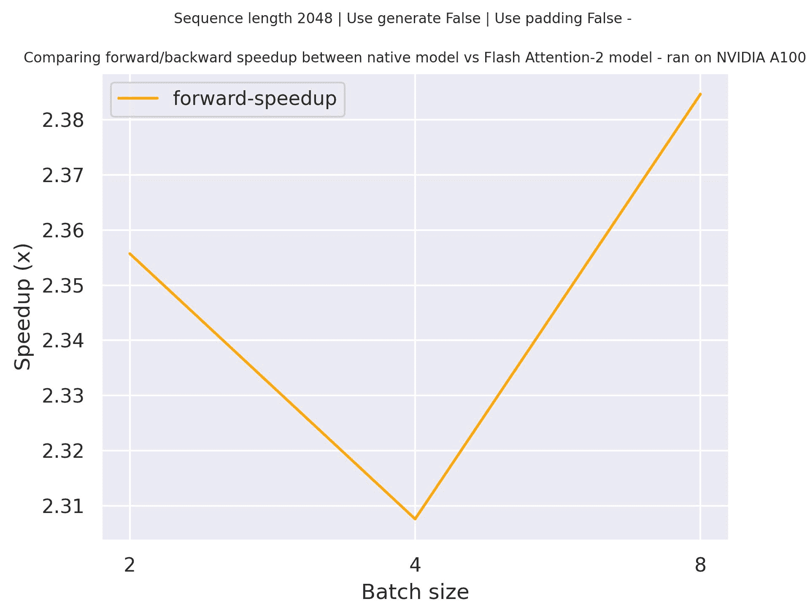

# Phi

> 原始文本：[`huggingface.co/docs/transformers/v4.37.2/en/model_doc/phi`](https://huggingface.co/docs/transformers/v4.37.2/en/model_doc/phi)

## 概述

Phi-1 模型是由 Suriya Gunasekar、Yi Zhang、Jyoti Aneja、Caio César Teodoro Mendes、Allie Del Giorno、Sivakanth Gopi、Mojan Javaheripi、Piero Kauffmann、Gustavo de Rosa、Olli Saarikivi、Adil Salim、Shital Shah、Harkirat Singh Behl、Xin Wang、Sébastien Bubeck、Ronen Eldan、Adam Tauman Kalai、Yin Tat Lee 和 Yuanzhi Li 在[Textbooks Are All You Need](https://arxiv.org/abs/2306.11644)中提出的。

Phi-1.5 模型是由 Yuanzhi Li、Sébastien Bubeck、Ronen Eldan、Allie Del Giorno、Suriya Gunasekar 和 Yin Tat Lee 在[Textbooks Are All You Need II: phi-1.5 technical report](https://arxiv.org/abs/2309.05463)中提出的。

### 摘要

在 Phi-1 和 Phi-1.5 论文中，作者展示了数据质量对训练相对于模型大小的重要性。他们选择了高质量的“教科书”数据以及合成生成的数据，用于训练其具有 13 亿参数的小型 Transformer 模型 Phi-1。尽管规模较小，phi-1 在 HumanEval 上的 pass@1 准确率为 50.6%，在 MBPP 上为 55.5%。他们对 Phi-1.5 采用相同策略，并创建了另一个具有 13 亿参数的模型，其在自然语言任务上的性能与大 5 倍的模型相当，并超过了大多数非前沿 LLMs。Phi-1.5 表现出许多更大 LLMs 的特征，比如能够“逐步思考”或进行一些基本的上下文学习。通过这两个实验，作者成功地展示了在训练机器学习模型时训练数据质量的巨大影响。

Phi-1 论文的摘要如下：

*我们介绍 phi-1，一个用于代码的新型大型语言模型，比竞争模型规模明显更小：phi-1 是一个基于 Transformer 的模型，具有 13 亿参数，在 8 个 A100 上训练了 4 天，使用了来自网络的“教科书质量”数据（60 亿标记）和使用 GPT-3.5（10 亿标记）合成生成的教科书和练习。尽管规模较小，phi-1 在 HumanEval 上的 pass@1 准确率为 50.6%，在 MBPP 上为 55.5%。与 phi-1-base 相比，我们在编码练习数据集上微调之前的模型，以及 phi-1-small，一个具有 350M 参数的较小模型，使用与 phi-1 相同的流程训练，仍然在 HumanEval 上达到 45%。*

Phi-1.5 论文的摘要如下：

*我们继续研究基于较小 Transformer 的语言模型的能力，这是由 TinyStories 发起的——一个可以生成连贯英语的 1 千万参数模型，以及关于 phi-1 的后续工作，这是一个 13 亿参数模型，其 Python 编码性能接近最先进水平。后者提出使用现有的大型语言模型（LLMs）生成“教科书质量”数据，以增强学习过程，相比传统网络数据。我们遵循“Textbooks Are All You Need”的方法，这次专注于自然语言中的常识推理，并创建一个新的 13 亿参数模型，命名为 phi-1.5，其在自然语言任务上的性能与大 5 倍的模型相当，并且在更复杂的推理任务（如小学数学和基本编码）上超过了大多数非前沿 LLMs。总的来说，phi-1.5 表现出许多更大 LLMs 的特征，包括好的——比如能够“逐步思考”或进行一些基本的上下文学习——以及坏的，包括幻觉和产生有毒和偏见的可能性——令人鼓舞的是，由于缺乏网络数据，我们在这方面看到了改善。我们开源 phi-1.5，以促进对这些紧迫主题的进一步研究。*

该模型由[Susnato Dhar](https://huggingface.co/susnato)贡献。

Phi-1、Phi-1.5 和 Phi-2 的原始代码可以在[这里](https://huggingface.co/microsoft/phi-1)，[这里](https://huggingface.co/microsoft/phi-1_5)和[这里](https://huggingface.co/microsoft/phi-2)找到。

## 使用提示

+   这个模型与`Llama`非常相似，主要区别在于`PhiDecoderLayer`，其中他们在并行配置中使用了`PhiAttention`和`PhiMLP`层。

+   用于该模型的分词器与 CodeGenTokenizer 相同。

## 如何使用 Phi-2

Phi-2 已经集成在`transformers`的开发版本（4.37.0.dev）中。在通过`pip`发布官方版本之前，请确保您正在执行以下操作之一：

+   加载模型时，请确保将`trust_remote_code=True`作为`from_pretrained()`函数的参数传递。

+   将本地的`transformers`更新到开发版本：`pip uninstall -y transformers && pip install git+https://github.com/huggingface/transformers`。上述命令是从源代码克隆和安装的替代方法。

```py
>>> from transformers import AutoModelForCausalLM, AutoTokenizer

>>> model = AutoModelForCausalLM.from_pretrained("phi-2")
>>> tokenizer = AutoTokenizer.from_pretrained("phi-2")

>>> inputs = tokenizer('Can you help me write a formal email to a potential business partner proposing a joint venture?', return_tensors="pt", return_attention_mask=False)

>>> outputs = model.generate(**inputs, max_length=30)
>>> text = tokenizer.batch_decode(outputs)[0]
>>> print(text)
'Can you help me write a formal email to a potential business partner proposing a joint venture?\nInput: Company A: ABC Inc.\nCompany B: XYZ Ltd.\nJoint Venture: A new online platform for e-commerce'
```

### 示例：

```py
>>> from transformers import PhiForCausalLM, AutoTokenizer

>>> # define the model and tokenizer.
>>> model = PhiForCausalLM.from_pretrained("microsoft/phi-1_5")
>>> tokenizer = AutoTokenizer.from_pretrained("microsoft/phi-1_5")

>>> # feel free to change the prompt to your liking.
>>> prompt = "If I were an AI that had just achieved"

>>> # apply the tokenizer.
>>> tokens = tokenizer(prompt, return_tensors="pt")

>>> # use the model to generate new tokens.
>>> generated_output = model.generate(**tokens, use_cache=True, max_new_tokens=10)

>>> tokenizer.batch_decode(generated_output)[0]
'If I were an AI that had just achieved a breakthrough in machine learning, I would be thrilled'
```

## 结合 Phi 和 Flash Attention 2

首先，请确保安装最新版本的 Flash Attention 2 以包含滑动窗口注意力功能。

```py
pip install -U flash-attn --no-build-isolation
```

还要确保您拥有与 Flash-Attention 2 兼容的硬件。在 flash-attn 存储库的官方文档中了解更多信息。还要确保以半精度（例如`torch.float16`）加载您的模型。

要加载和运行使用 Flash Attention 2 的模型，请参考下面的代码片段：

```py
>>> import torch
>>> from transformers import PhiForCausalLM, AutoTokenizer

>>> # define the model and tokenizer and push the model and tokens to the GPU.
>>> model = PhiForCausalLM.from_pretrained("microsoft/phi-1_5", torch_dtype=torch.float16, attn_implementation="flash_attention_2").to("cuda")
>>> tokenizer = AutoTokenizer.from_pretrained("microsoft/phi-1_5")

>>> # feel free to change the prompt to your liking.
>>> prompt = "If I were an AI that had just achieved"

>>> # apply the tokenizer.
>>> tokens = tokenizer(prompt, return_tensors="pt").to("cuda")

>>> # use the model to generate new tokens.
>>> generated_output = model.generate(**tokens, use_cache=True, max_new_tokens=10)

>>> tokenizer.batch_decode(generated_output)[0]
'If I were an AI that had just achieved a breakthrough in machine learning, I would be thrilled'
```

### 预期加速

下面是一个预期的加速图表，比较了在使用序列长度为 2048 时，transformers 中使用`microsoft/phi-1`检查点的原生实现和模型的 Flash Attention 2 版本之间的纯推理时间。



## PhiConfig

### `class transformers.PhiConfig`

[<来源>](https://github.com/huggingface/transformers/blob/v4.37.2/src/transformers/models/phi/configuration_phi.py#L32)

```py
( vocab_size = 51200 hidden_size = 2048 intermediate_size = 8192 num_hidden_layers = 24 num_attention_heads = 32 num_key_value_heads = None resid_pdrop = 0.0 embd_pdrop = 0.0 attention_dropout = 0.0 hidden_act = 'gelu_new' max_position_embeddings = 2048 initializer_range = 0.02 layer_norm_eps = 1e-05 use_cache = True tie_word_embeddings = False rope_theta = 10000.0 rope_scaling = None partial_rotary_factor = 0.5 qk_layernorm = False bos_token_id = 1 eos_token_id = 2 **kwargs )
```

参数

+   `vocab_size` (`int`，*可选*，默认为 51200）— Phi 模型的词汇量。定义了在调用 PhiModel 时可以表示的不同令牌的数量。

+   `hidden_size` (`int`，*可选*，默认为 2048）— 隐藏表示的维度。

+   `intermediate_size` (`int`，*可选*，默认为 8192）— MLP 表示的维度。

+   `num_hidden_layers` (`int`，*可选*，默认为 24）— Transformer 解码器中的隐藏层数。

+   `num_attention_heads` (`int`，*可选*，默认为 32）— Transformer 解码器中每个注意力层的注意力头数。

+   `num_key_value_heads` (`int`，*可选*）— 这是应该用于实现分组查询注意力的 key_value 头的数量。如果`num_key_value_heads=num_attention_heads`，模型将使用多头注意力（MHA），如果`num_key_value_heads=1`，模型将使用多查询注意力（MQA），否则使用 GQA。在将多头检查点转换为 GQA 检查点时，应通过对该组中所有原始头进行均值池化来构建每个组键和值头。有关更多详细信息，请查看[此论文](https://arxiv.org/pdf/2305.13245.pdf)。如果未指定，将默认为`num_attention_heads`。

+   `resid_pdrop` (`float`，*可选*，默认为 0.0）— mlp 输出的 dropout 概率。

+   `embd_pdrop` (`int`，*可选*，默认为 0.0）— 嵌入的 dropout 比率。

+   `attention_dropout` (`float`，*可选*，默认为 0.0）— 计算注意力分数后的 dropout 比率。

+   `hidden_act` (`str`或`function`，*可选*，默认为`"gelu_new"`) — 解码器中的非线性激活函数（函数或字符串）。

+   `max_position_embeddings` (`int`, *optional*, defaults to 2048) — 此模型可能使用的最大序列长度。Phi-1 和 Phi-1.5 支持最多 2048 个标记。

+   `initializer_range` (`float`, *optional*, defaults to 0.02) — 用于初始化所有权重矩阵的截断正态初始化器的标准差。

+   `layer_norm_eps` (`float`, *optional*, defaults to 1e-05) — rms 归一化层使用的 epsilon。

+   `use_cache` (`bool`, *optional*, defaults to `True`) — 模型是否应返回最后一个键/值注意力（不是所有模型都使用）。仅在 `config.is_decoder=True` 时相关。是否绑定权重嵌入。

+   `tie_word_embeddings` (`bool`, *optional*, defaults to `False`) — 是否绑定权重嵌入

+   `rope_theta` (`float`, *optional*, defaults to 10000.0) — RoPE 嵌入的基本周期。

+   `rope_scaling` (`Dict`, *optional*) — 包含 RoPE 嵌入的缩放配置的字典。目前支持两种缩放策略：线性和动态。它们的缩放因子必须是大于 1 的浮点数。预期格式为 `{"type": 策略名称, "factor": 缩放因子}`。在使用此标志时，不要将 `max_position_embeddings` 更新为预期的新最大值。有关这些缩放策略行为的更多信息，请参阅以下主题：[`www.reddit.com/r/LocalPersimmon/comments/14mrgpr/dynamically_scaled_rope_further_increases/`](https://www.reddit.com/r/LocalPersimmon/comments/14mrgpr/dynamically_scaled_rope_further_increases/)。这是一个实验性功能，可能在未来版本中发生破坏性 API 更改。

+   `partial_rotary_factor` (`float`, *optional*, defaults to 0.5) — 查询和键中将具有旋转嵌入的百分比。

+   `qk_layernorm` (`bool`, *optional*, defaults to `False`) — 是否在投影隐藏状态后对查询和键进行归一化。

+   `bos_token_id` (`int`, *optional*, defaults to 1) — 表示序列开始的标记 id。

+   `eos_token_id` (`int`, *optional*, defaults to 2) — 表示序列结束的标记 id。

这是用于存储 PhiModel 配置的配置类。它用于根据指定的参数实例化 Phi 模型，定义模型架构。使用默认值实例化配置将产生类似于 Phi [microsoft/phi-1](https://huggingface.co/microsoft/phi-1)的配置。

配置对象继承自 PretrainedConfig，可用于控制模型输出。阅读 PretrainedConfig 的文档以获取更多信息。

示例：

```py
>>> from transformers import PhiModel, PhiConfig

>>> # Initializing a Phi-1 style configuration
>>> configuration = PhiConfig.from_pretrained("microsoft/phi-1")

>>> # Initializing a model from the configuration
>>> model = PhiModel(configuration)

>>> # Accessing the model configuration
>>> configuration = model.config
```

PytorchHide Pytorch content

## PhiModel

### `class transformers.PhiModel`

[< source >](https://github.com/huggingface/transformers/blob/v4.37.2/src/transformers/models/phi/modeling_phi.py#L801)

```py
( config: PhiConfig )
```

参数

+   `config` (PhiConfig) — 包含模型所有参数的模型配置类。使用配置文件初始化不会加载与模型关联的权重，只加载配置。查看 from_pretrained()方法以加载模型权重。配置 — PhiConfig

裸 Phi 模型输出原始隐藏状态，没有特定的头部。此模型继承自 PreTrainedModel。查看超类文档，了解库为其所有模型实现的通用方法（如下载或保存、调整输入嵌入、修剪头等）。

这个模型也是一个 PyTorch [torch.nn.Module](https://pytorch.org/docs/stable/nn.html#torch.nn.Module)子类。将其用作常规的 PyTorch 模块，并参考 PyTorch 文档以获取与一般用法和行为相关的所有内容。

由*config.num_hidden_layers*层组成的 Transformer 解码器。每一层都是一个`PhiDecoderLayer`

#### `forward`

[<来源>](https://github.com/huggingface/transformers/blob/v4.37.2/src/transformers/models/phi/modeling_phi.py#L836)

```py
( input_ids: LongTensor = None attention_mask: Optional = None position_ids: Optional = None past_key_values: Optional = None inputs_embeds: Optional = None use_cache: Optional = None output_attentions: Optional = None output_hidden_states: Optional = None return_dict: Optional = None )
```

参数

+   `input_ids`（形状为`(batch_size, sequence_length)`的`torch.LongTensor`）- 词汇表中输入序列标记的索引。默认情况下，如果提供了填充，将忽略填充。

    可以使用 AutoTokenizer 获取索引。有关详细信息，请参阅 PreTrainedTokenizer.encode()和 PreTrainedTokenizer.`call`()。

    什么是输入 ID？

+   `attention_mask`（形状为`(batch_size, sequence_length)`的`torch.Tensor`，*可选*）- 用于避免在填充标记索引上执行注意力的掩码。掩码值选择在`[0, 1]`中：

    +   1 表示未被“屏蔽”的标记，

    +   0 表示被“屏蔽”的标记。

    什么是注意力掩码？

    可以使用 AutoTokenizer 获取索引。有关详细信息，请参阅 PreTrainedTokenizer.encode()和 PreTrainedTokenizer.`call`()。

    如果使用了`past_key_values`，可以选择仅输入最后一个`input_ids`（参见`past_key_values`）。

    如果要更改填充行为，应阅读`modeling_opt._prepare_decoder_attention_mask`并根据需要进行修改。有关默认策略的更多信息，请参阅[论文](https://arxiv.org/abs/1910.13461)中的图表 1。

    +   1 表示头部是“未屏蔽的”，

    +   0 表示头部被“屏蔽”。

+   `position_ids`（形状为`(batch_size, sequence_length)`的`torch.LongTensor`，*可选*）- 每个输入序列标记在位置嵌入中的位置索引。在范围`[0, config.n_positions - 1]`中选择。

    什么是位置 ID？

+   `past_key_values`（`Cache`或`tuple(tuple(torch.FloatTensor))`，*可选*）- 预先计算的隐藏状态（自注意力块和交叉注意力块中的键和值），可用于加速顺序解码。这通常包括模型在先前解码阶段返回的`past_key_values`，当`use_cache=True`或`config.use_cache=True`时。

    两种格式都允许：

    +   一个 Cache 实例；

    +   长度为`config.n_layers`的元组`tuple(torch.FloatTensor)`，每个元组有 2 个形状为`(batch_size, num_heads, sequence_length, embed_size_per_head)`的张量。这也被称为传统缓存格式。

    模型将输出与输入相同的缓存格式。如果没有传递`past_key_values`，将返回传统的缓存格式。

    如果使用了`past_key_values`，用户可以选择仅输入最后一个形状为`(batch_size, 1)`的`input_ids`（这些`input_ids`没有将它们的过去键值状态提供给此模型）而不是所有形状为`(batch_size, sequence_length)`的`input_ids`。

+   `inputs_embeds` (`torch.FloatTensor` of shape `(batch_size, sequence_length, hidden_size)`, *optional*) — 可选地，可以直接传递嵌入表示，而不是传递 `input_ids`。如果您想要更多控制如何将 `input_ids` 索引转换为相关向量，而不是使用模型的内部嵌入查找矩阵，则这很有用。

+   `use_cache` (`bool`, *optional*) — 如果设置为 `True`，将返回 `past_key_values` 键值状态，可用于加速解码（参见 `past_key_values`）。

+   `output_attentions` (`bool`, *optional*) — 是否返回所有注意力层的注意力张量。有关更多详细信息，请参阅返回张量中的 `attentions`。

+   `output_hidden_states` (`bool`, *optional*) — 是否返回所有层的隐藏状态。有关更多详细信息，请参阅返回张量中的 `hidden_states`。

+   `return_dict` (`bool`, *optional*) — 是否返回 ModelOutput 而不是普通元组。

PhiModel 的前向方法，覆盖了 `__call__` 特殊方法。

虽然前向传递的步骤需要在此函数内定义，但应该在此之后调用 `Module` 实例，而不是在此处调用，因为前者会负责运行预处理和后处理步骤，而后者会默默地忽略它们。

## PhiForCausalLM

### `class transformers.PhiForCausalLM`

[< source >](https://github.com/huggingface/transformers/blob/v4.37.2/src/transformers/models/phi/modeling_phi.py#L961)

```py
( config )
```

#### `forward`

[< source >](https://github.com/huggingface/transformers/blob/v4.37.2/src/transformers/models/phi/modeling_phi.py#L998)

```py
( input_ids: LongTensor = None attention_mask: Optional = None position_ids: Optional = None past_key_values: Optional = None inputs_embeds: Optional = None labels: Optional = None use_cache: Optional = None output_attentions: Optional = None output_hidden_states: Optional = None return_dict: Optional = None ) → export const metadata = 'undefined';transformers.modeling_outputs.CausalLMOutputWithPast or tuple(torch.FloatTensor)
```

参数

+   `input_ids` (`torch.LongTensor` of shape `(batch_size, sequence_length)`) — 词汇表中输入序列标记的索引。默认情况下，如果提供填充，则将被忽略。

    可以使用 AutoTokenizer 获取索引。有关详细信息，请参阅 PreTrainedTokenizer.encode() 和 PreTrainedTokenizer.`call`()。

    什么是输入 ID？

+   `attention_mask` (`torch.Tensor` of shape `(batch_size, sequence_length)`, *optional*) — 用于避免在填充标记索引上执行注意力的掩码。掩码值选择在 `[0, 1]` 之间:

    +   1 表示未被掩码的标记，

    +   0 表示被掩码的标记。

    什么是注意力掩码？

    可以使用 AutoTokenizer 获取索引。有关详细信息，请参阅 PreTrainedTokenizer.encode() 和 PreTrainedTokenizer.`call`()。

    如果使用 `past_key_values`，可以选择仅输入最后的 `input_ids`（参见 `past_key_values`）。

    如果要更改填充行为，应阅读 `modeling_opt._prepare_decoder_attention_mask` 并根据需要进行修改。有关默认策略的更多信息，请参阅 [论文](https://arxiv.org/abs/1910.13461) 中的图表 1。

    +   1 表示头部未被掩码，

    +   0 表示头部被掩码。

+   `position_ids` (`torch.LongTensor` of shape `(batch_size, sequence_length)`, *optional*) — 每个输入序列标记在位置嵌入中的位置索引。选择范围为 `[0, config.n_positions - 1]`。

    什么是位置 ID？

+   `past_key_values`（`Cache`或`tuple(tuple(torch.FloatTensor))`，*可选*）— 预先计算的隐藏状态（自注意力块和交叉注意力块中的键和值），可用于加速顺序解码。这通常包括模型在解码的先前阶段返回的`past_key_values`，当`use_cache=True`或`config.use_cache=True`时。

    允许两种格式：

    +   一个 Cache 实例；

    +   长度为`config.n_layers`的`tuple(torch.FloatTensor)`的元组，每个元组有 2 个形状为`(batch_size, num_heads, sequence_length, embed_size_per_head)`的张量。这也被称为传统缓存格式。

    模型将输出与输入相同的缓存格式。如果没有传递`past_key_values`，则将返回传统缓存格式。

    如果使用`past_key_values`，用户可以选择仅输入形状为`(batch_size, 1)`的最后`input_ids`（这些`input_ids`没有给定其过去键值状态的模型）而不是形状为`(batch_size, sequence_length)`的所有`input_ids`。

+   `inputs_embeds`（形状为`(batch_size, sequence_length, hidden_size)`的`torch.FloatTensor`，*可选*）— 可选地，您可以选择直接传递嵌入表示，而不是传递`input_ids`。如果您希望更多地控制如何将`input_ids`索引转换为相关向量，而不是模型的内部嵌入查找矩阵，则这很有用。

+   `use_cache`（`bool`，*可选*）— 如果设置为`True`，则返回`past_key_values`键值状态，并可用于加速解码（请参见`past_key_values`）。

+   `output_attentions`（`bool`，*可选*）— 是否返回所有注意力层的注意力张量。有关更多详细信息，请参见返回张量下的`attentions`。

+   `output_hidden_states`（`bool`，*可选*）— 是否返回所有层的隐藏状态。有关更多详细信息，请参见返回张量下的`hidden_states`。

+   `return_dict`（`bool`，*可选*）— 是否返回 ModelOutput 而不是普通元组。

    参数 — 标签（形状为`(batch_size, sequence_length)`的`torch.LongTensor`，*可选*）：用于计算掩码语言建模损失的标签。索引应该在`[0, ..., config.vocab_size]`或-100（请参见`input_ids`文档字符串）。索引设置为`-100`的标记将被忽略（掩码），损失仅计算具有标签在`[0, ..., config.vocab_size]`中的标记。

返回

transformers.modeling_outputs.CausalLMOutputWithPast 或`tuple(torch.FloatTensor)`

一个 transformers.modeling_outputs.CausalLMOutputWithPast 或一个`torch.FloatTensor`元组（如果传递`return_dict=False`或当`config.return_dict=False`时），包括根据配置（PhiConfig）和输入的不同元素。

+   `loss`（形状为`(1,)`的`torch.FloatTensor`，*可选*，当提供`labels`时返回）— 语言建模损失（用于下一个标记预测）。

+   `logits`（形状为`(batch_size, sequence_length, config.vocab_size)`的`torch.FloatTensor`）— 语言建模头的预测分数（SoftMax 之前每个词汇标记的分数）。

+   `past_key_values`（`tuple(tuple(torch.FloatTensor))`，*可选*，当传递`use_cache=True`或`config.use_cache=True`时返回）— 长度为`config.n_layers`的`tuple(torch.FloatTensor)`的元组，每个元组有 2 个形状为`(batch_size, num_heads, sequence_length, embed_size_per_head)`的张量。

    包含预先计算的隐藏状态（自注意力块中的键和值），可用于加速顺序解码（请参见`past_key_values`输入）。

+   `hidden_states` (`tuple(torch.FloatTensor)`, *可选*, 当传递`output_hidden_states=True`或`config.output_hidden_states=True`时返回) — 形状为`(batch_size, sequence_length, hidden_size)`的`torch.FloatTensor`元组（如果模型有嵌入层的输出，则为一个用于嵌入的输出 + 一个用于每个层的输出）。

    模型在每一层输出的隐藏状态以及可选的初始嵌入输出。

+   `attentions` (`tuple(torch.FloatTensor)`, *可选*, 当传递`output_attentions=True`或`config.output_attentions=True`时返回) — 形状为`(batch_size, num_heads, sequence_length, sequence_length)`的`torch.FloatTensor`元组（每层一个）。

    在注意力 softmax 之后的注意力权重，用于计算自注意力头中的加权平均值。

PhiForCausalLM 的前向方法，覆盖了`__call__`特殊方法。

虽然前向传递的配方需要在此函数内定义，但应该在此之后调用`Module`实例，而不是在此处调用，因为前者会负责运行前处理和后处理步骤，而后者会默默地忽略它们。

示例：

```py
>>> from transformers import AutoTokenizer, PhiForCausalLM

>>> model = PhiForCausalLM.from_pretrained("microsoft/phi-1")
>>> tokenizer = AutoTokenizer.from_pretrained("microsoft/phi-1")

>>> prompt = "This is an example script ."
>>> inputs = tokenizer(prompt, return_tensors="pt")

>>> # Generate
>>> generate_ids = model.generate(inputs.input_ids, max_length=30)
>>> tokenizer.batch_decode(generate_ids, skip_special_tokens=True, clean_up_tokenization_spaces=False)[0]
'This is an example script .\n\n\n\nfrom typing import List\n\ndef find_most_common_letter(words: List[str'
```

`生成`

[<来源>](https://github.com/huggingface/transformers/blob/v4.37.2/src/transformers/generation/utils.py#L1173)

```py
( inputs: Optional = None generation_config: Optional = None logits_processor: Optional = None stopping_criteria: Optional = None prefix_allowed_tokens_fn: Optional = None synced_gpus: Optional = None assistant_model: Optional = None streamer: Optional = None negative_prompt_ids: Optional = None negative_prompt_attention_mask: Optional = None **kwargs ) → export const metadata = 'undefined';ModelOutput or torch.LongTensor
```

参数

+   `inputs` (`torch.Tensor`，根据模态性而变化的形状，*可选*) — 用作生成提示或作为编码器的模型输入的序列。如果为`None`，则该方法将使用`bos_token_id`和批量大小为 1 进行初始化。对于仅解码器模型，`inputs`应为`input_ids`格式。对于编码器-解码器模型，*inputs*可以表示`input_ids`、`input_values`、`input_features`或`pixel_values`中的任何一个。

+   `generation_config` (`~generation.GenerationConfig`, *可选*) — 用作生成调用的基本参数化的生成配置。与`generation_config`属性匹配的`**kwargs`传递给`generate`将覆盖它们。如果未提供`generation_config`，将使用默认值，其加载优先级如下：1）从`generation_config.json`模型文件中，如果存在；2）从模型配置中。请注意，未指定的参数将继承 GenerationConfig 的默认值，应检查其文档以参数化生成。

+   `logits_processor` (`LogitsProcessorList`, *可选*) — 自定义 logits 处理器，补充了从参数和生成配置构建的默认 logits 处理器。如果传递了一个已经使用参数或生成配置创建的 logit 处理器，将会抛出错误。此功能适用于高级用户。

+   `stopping_criteria` (`StoppingCriteriaList`, *可选*) — 自定义停止标准，补充了从参数和生成配置构建的默认停止标准。如果传递了一个已经使用参数或生成配置创建的停止标准，将会抛出错误。如果您的停止标准依赖于`scores`输入，请确保在调用`generate`时传递`return_dict_in_generate=True, output_scores=True`。此功能适用于高级用户。

+   `prefix_allowed_tokens_fn` (`Callable[[int, torch.Tensor], List[int]]`, *可选*) — 如果提供，此函数将在每一步将束搜索限制为仅允许的标记。如果未提供，则不应用约束。此函数接受 2 个参数：批次 ID`batch_id`和`input_ids`。它必须返回一个列表，其中包含下一代步骤的允许标记，条件是批次 ID`batch_id`和先前生成的标记`inputs_ids`。此参数对于受前缀约束的生成很有用，如[自回归实体检索](https://arxiv.org/abs/2010.00904)中所述。

+   `synced_gpus` (`bool`, *optional*) — 是否继续运行 while 循环直到 max_length。除非被覆盖，否则在 DeepSpeed ZeRO Stage 3 多 GPU 环境下，此标志将设置为`True`，以避免一个 GPU 在其他 GPU 之前生成完成时挂起。否则，它将设置为`False`。

+   `assistant_model` (`PreTrainedModel`, *optional*) — 一个助理模型，可用于加速生成。助理模型必须具有完全相同的分词器。当使用助理模型预测候选标记比使用您调用 generate 的模型运行生成要快得多时，加速就会实现。因此，助理模型应该要小得多。

+   `streamer` (`BaseStreamer`, *optional*) — 将用于流式传输生成的序列的 Streamer 对象。生成的标记通过`streamer.put(token_ids)`传递，Streamer 负责任何进一步的处理。

+   `negative_prompt_ids` (`torch.LongTensor` of shape `(batch_size, sequence_length)`, *optional*) — 一些处理器（如 CFG）需要的负向提示。批量大小必须与输入批量大小匹配。这是一个实验性功能，可能在未来版本中会有破坏性的 API 更改。

+   `negative_prompt_attention_mask` (`torch.LongTensor` of shape `(batch_size, sequence_length)`, *optional*) — 用于`negative_prompt_ids`的 Attention_mask。

+   `kwargs` (`Dict[str, Any]`, *optional*) — `generate_config`的特定参数化和/或将转发到模型的`forward`函数的其他模型特定 kwargs。如果模型是编码器-解码器模型，则编码器特定的 kwargs 不应该有前缀，解码器特定的 kwargs 应该以*decoder_*为前缀。

返回

ModelOutput 或`torch.LongTensor`

一个 ModelOutput（如果`return_dict_in_generate=True`或者`config.return_dict_in_generate=True`）或者一个`torch.FloatTensor`。

如果模型*不是*编码器-解码器模型（`model.config.is_encoder_decoder=False`），可能的 ModelOutput 类型为：

+   GenerateDecoderOnlyOutput，

+   GenerateBeamDecoderOnlyOutput

如果模型是编码器-解码器模型（`model.config.is_encoder_decoder=True`），可能的 ModelOutput 类型为：

+   GenerateEncoderDecoderOutput，

+   GenerateBeamEncoderDecoderOutput

为具有语言建模头的模型生成标记 id 序列。

大多数控制生成的参数都在`generation_config`中设置，如果未传递，则将设置为模型的默认生成配置。您可以通过将相应的参数传递给 generate()来覆盖任何`generation_config`，例如`.generate(inputs, num_beams=4, do_sample=True)`。

有关生成策略和代码示例的概述，请查看以下指南。

## PhiForSequenceClassification

### `class transformers.PhiForSequenceClassification`

[< source >](https://github.com/huggingface/transformers/blob/v4.37.2/src/transformers/models/phi/modeling_phi.py#L1155)

```py
( config )
```

参数

+   `config` (PhiConfig) — 模型配置类，包含模型的所有参数。使用配置文件初始化不会加载与模型相关的权重，只会加载配置。查看 from_pretrained()方法以加载模型权重。

PhiModel 在顶部具有序列分类头（线性层）。

PhiForSequenceClassification 使用最后一个标记进行分类，就像其他因果模型（例如 GPT-2）一样。

由于它对最后一个标记进行分类，因此需要知道最后一个标记的位置。如果在配置中定义了`pad_token_id`，则会找到每行中不是填充标记的最后一个标记。如果未定义`pad_token_id`，则会简单地取批处理中每行的最后一个值。当传递`inputs_embeds`而不是`input_ids`时，无法猜测填充标记，因此会执行相同操作（取批处理中每行的最后一个值）。

此模型继承自 PreTrainedModel。查看超类文档以了解库为所有模型实现的通用方法（例如下载或保存、调整输入嵌入、修剪头等）。

此模型还是 PyTorch [torch.nn.Module](https://pytorch.org/docs/stable/nn.html#torch.nn.Module)子类。将其用作常规 PyTorch 模块，并参考 PyTorch 文档以获取有关一般用法和行为的所有相关信息。

#### `forward`

[<来源>](https://github.com/huggingface/transformers/blob/v4.37.2/src/transformers/models/phi/modeling_phi.py#L1187)

```py
( input_ids: LongTensor = None attention_mask: Optional = None position_ids: Optional = None past_key_values: Optional = None inputs_embeds: Optional = None labels: Optional = None use_cache: Optional = None output_attentions: Optional = None output_hidden_states: Optional = None return_dict: Optional = None )
```

参数

+   `input_ids`（形状为`(batch_size, sequence_length)`的`torch.LongTensor`）— 输入序列标记在词汇表中的索引。默认情况下，提供填充将被忽略。

    可以使用 AutoTokenizer 获取索引。查看 PreTrainedTokenizer.encode()和 PreTrainedTokenizer.`call`()获取详细信息。

    什么是输入 ID？

+   `attention_mask`（形状为`(batch_size, sequence_length)`的`torch.Tensor`，*可选*）— 避免在填充标记索引上执行注意力的掩码。掩码值选择在`[0, 1]`中：

    +   1 表示标记未被遮蔽，

    +   0 表示被遮蔽的标记。

    什么是注意力掩码？

    可以使用 AutoTokenizer 获取索引。查看 PreTrainedTokenizer.encode()和 PreTrainedTokenizer.`call`()获取详细信息。

    如果使用`past_key_values`，则可选择仅输入最后的`input_ids`（参见`past_key_values`）。

    如果要更改填充行为，应阅读`modeling_opt._prepare_decoder_attention_mask`并根据需要进行修改。有关默认策略的更多信息，请参见[论文](https://arxiv.org/abs/1910.13461)中的图表 1。

    +   1 表示头部未被遮蔽，

    +   0 表示头部被遮蔽。

+   `position_ids`（形状为`(batch_size, sequence_length)`的`torch.LongTensor`，*可选*）— 输入序列标记在位置嵌入中的位置索引。在范围`[0, config.n_positions - 1]`中选择。

    什么是位置 ID？

+   `past_key_values` (`Cache`或`tuple(tuple(torch.FloatTensor))`, *optional*) — 预先计算的隐藏状态（自注意力块和交叉注意力块中的键和值），可用于加速顺序解码。这通常包括模型在先前解码阶段返回的`past_key_values`，当`use_cache=True`或`config.use_cache=True`时。

    允许两种格式：

    +   一个 Cache 实例；

    +   长度为`config.n_layers`的`tuple(torch.FloatTensor)`的元组，每个元组有 2 个形状为`(batch_size, num_heads, sequence_length, embed_size_per_head)`的张量。这也被称为传统的缓存格式。

    模型将输出与输入相同的缓存格式。如果未传递`past_key_values`，则将返回传统的缓存格式。

    如果使用`past_key_values`，用户可以选择仅输入形状为`(batch_size, 1)`的最后一个`input_ids`（这些`input_ids`不具有其过去的键值状态给予此模型）而不是形状为`(batch_size, sequence_length)`的所有`input_ids`。

+   `inputs_embeds` (`torch.FloatTensor`，形状为`(batch_size, sequence_length, hidden_size)`，*optional*) — 可选地，可以直接传递嵌入表示，而不是传递`input_ids`。如果要更好地控制如何将`input_ids`索引转换为相关向量，而不是使用模型的内部嵌入查找矩阵，则这很有用。

+   `use_cache` (`bool`, *optional*) — 如果设置为`True`，则返回`past_key_values`键值状态，并可用于加速解码（请参见`past_key_values`）。

+   `output_attentions` (`bool`, *optional*) — 是否返回所有注意力层的注意力张量。有关更多详细信息，请参见返回张量下的`attentions`。

+   `output_hidden_states` (`bool`, *optional*) — 是否返回所有层的隐藏状态。有关更多详细信息，请参见返回张量下的`hidden_states`。

+   `return_dict` (`bool`, *optional*) — 是否返回 ModelOutput 而不是普通元组。

+   `labels` (`torch.LongTensor`，形状为`(batch_size,)`，*optional*) — 用于计算序列分类/回归损失的标签。索引应在`[0, ..., config.num_labels - 1]`范围内。如果`config.num_labels == 1`，则计算回归损失（均方损失），如果`config.num_labels > 1`，则计算分类损失（交叉熵）。

PhiForSequenceClassification 的前向方法，覆盖了`__call__`特殊方法。

尽管前向传递的配方需要在此函数内定义，但应该在此之后调用`Module`实例，而不是在此处调用，因为前者负责运行预处理和后处理步骤，而后者会默默地忽略它们。

## PhiForTokenClassification

### `class transformers.PhiForTokenClassification`

[< source >](https://github.com/huggingface/transformers/blob/v4.37.2/src/transformers/models/phi/modeling_phi.py#L1279)

```py
( config: PhiConfig )
```

参数

+   `config` (PhiConfig) — 具有模型所有参数的模型配置类。使用配置文件初始化不会加载与模型关联的权重，只加载配置。查看 from_pretrained()方法以加载模型权重。

在顶部带有标记分类头的 PhiModel（隐藏状态输出顶部的线性层），例如用于命名实体识别（NER）任务。

该模型继承自 PreTrainedModel。查看超类文档以了解库为所有模型实现的通用方法（例如下载或保存、调整输入嵌入、修剪头等）。

该模型还是 PyTorch [torch.nn.Module](https://pytorch.org/docs/stable/nn.html#torch.nn.Module)子类。将其用作常规的 PyTorch 模块，并参考 PyTorch 文档以获取有关一般用法和行为的所有相关信息。

#### `forward`

[<来源>](https://github.com/huggingface/transformers/blob/v4.37.2/src/transformers/models/phi/modeling_phi.py#L1305)

```py
( input_ids: Optional = None past_key_values: Optional = None attention_mask: Optional = None inputs_embeds: Optional = None labels: Optional = None use_cache: Optional = None output_attentions: Optional = None output_hidden_states: Optional = None return_dict: Optional = None **deprecated_arguments ) → export const metadata = 'undefined';transformers.modeling_outputs.TokenClassifierOutput or tuple(torch.FloatTensor)
```

参数

+   `input_ids`（形状为`(batch_size, sequence_length)`的`torch.LongTensor`）— 输入序列标记在词汇表中的索引。默认情况下将忽略填充。

    可以使用 AutoTokenizer 获取索引。有关详细信息，请参阅 PreTrainedTokenizer.encode()和 PreTrainedTokenizer.`call`()。

    什么是输入 ID？

+   `attention_mask`（形状为`(batch_size, sequence_length)`的`torch.Tensor`，*可选*）— 避免在填充标记索引上执行注意力的掩码。掩码值选择在`[0, 1]`：

    +   对于未被掩码的标记，标记为 1，

    +   对于被掩码的标记，标记为 0。

    什么是注意力掩码？

    可以使用 AutoTokenizer 获取索引。有关详细信息，请参阅 PreTrainedTokenizer.encode()和 PreTrainedTokenizer.`call`()。

    如果使用`past_key_values`，则可以选择仅输入最后的`input_ids`（参见`past_key_values`）。

    如果要更改填充行为，应阅读`modeling_opt._prepare_decoder_attention_mask`并根据需要进行修改。有关默认策略的更多信息，请参阅[论文](https://arxiv.org/abs/1910.13461)中的图表 1。

    +   1 表示头部未被掩码，

    +   0 表示头部被掩码。

+   `position_ids`（形状为`(batch_size, sequence_length)`的`torch.LongTensor`，*可选*）— 每个输入序列标记在位置嵌入中的位置索引。选择范围为`[0, config.n_positions - 1]`。

    什么是位置 ID？

+   `past_key_values`（`Cache`或`tuple(tuple(torch.FloatTensor))`，*可选*）— 预先计算的隐藏状态（自注意力块和交叉注意力块中的键和值），可用于加速顺序解码。这通常包括模型在先前解码阶段返回的`past_key_values`，当`use_cache=True`或`config.use_cache=True`时。

    允许两种格式：

    +   一个 Cache 实例；

    +   长度为`config.n_layers`的`tuple(torch.FloatTensor)`元组，每个元组有 2 个形状为`(batch_size, num_heads, sequence_length, embed_size_per_head)`的张量）。这也被称为传统的缓存格式。

    该模型将输出与输入相同的缓存格式。如果没有传递`past_key_values`，则将返回传统的缓存格式。

    如果使用`past_key_values`，用户可以选择仅输入形状为`(batch_size, 1)`的最后的`input_ids`（这些没有将其过去的键值状态提供给该模型）而不是形状为`(batch_size, sequence_length)`的所有`input_ids`。

+   `inputs_embeds` (`torch.FloatTensor`，形状为`(batch_size, sequence_length, hidden_size)`，*可选*) — 可选地，您可以选择直接传递嵌入表示，而不是传递`input_ids`。如果您想要更多控制权来将`input_ids`索引转换为相关向量，而不是使用模型的内部嵌入查找矩阵，这将非常有用。

+   `use_cache` (`bool`, *可选*) — 如果设置为`True`，将返回`past_key_values`键值状态，可用于加速解码（参见`past_key_values`）。

+   `output_attentions` (`bool`, *可选*) — 是否返回所有注意力层的注意力张量。有关更多详细信息，请参阅返回张量下的`attentions`。

+   `output_hidden_states` (`bool`, *可选*) — 是否返回所有层的隐藏状态。有关更多详细信息，请参阅返回张量下的`hidden_states`。

+   `return_dict` (`bool`, *可选*) — 是否返回一个 ModelOutput 而不是一个普通元组。

+   `labels` (`torch.LongTensor`，形状为`(batch_size,)`，*可选*) — 用于计算序列分类/回归损失的标签。索引应在`[0, ..., config.num_labels - 1]`范围内。如果`config.num_labels == 1`，则计算回归损失（均方损失），如果`config.num_labels > 1`，则计算分类损失（交叉熵）。

返回

transformers.modeling_outputs.TokenClassifierOutput 或`tuple(torch.FloatTensor)`

一个 transformers.modeling_outputs.TokenClassifierOutput 或一个`torch.FloatTensor`元组（如果传递`return_dict=False`或者当`config.return_dict=False`时）包含根据配置(PhiConfig)和输入的不同元素。

+   `loss` (`torch.FloatTensor`，形状为`(1,)`，*可选*, 当提供`labels`时返回) — 分类损失。

+   `logits` (`torch.FloatTensor`，形状为`(batch_size, sequence_length, config.num_labels)`) — 分类分数（SoftMax 之前）。

+   `hidden_states` (`tuple(torch.FloatTensor)`, *可选*, 当传递`output_hidden_states=True`或者当`config.output_hidden_states=True`时返回) — 形状为`(batch_size, sequence_length, hidden_size)`的`torch.FloatTensor`元组（如果模型有嵌入层，则为嵌入的输出+每层的输出）。

    模型在每一层输出的隐藏状态以及可选的初始嵌入输出。

+   `attentions` (`tuple(torch.FloatTensor)`, *可选*, 当传递`output_attentions=True`或者当`config.output_attentions=True`时返回) — 形状为`(batch_size, num_heads, sequence_length, sequence_length)`的`torch.FloatTensor`元组（每层一个）。

    注意力 softmax 后的注意力权重，用于计算自注意力头中的加权平均值。

PhiForTokenClassification 的前向方法，覆盖了`__call__`特殊方法。

虽然前向传递的方法需要在此函数内定义，但应该在此之后调用`Module`实例，而不是在此处调用，因为前者会负责运行预处理和后处理步骤，而后者会默默地忽略它们。

示例：

```py
>>> from transformers import AutoTokenizer, PhiForTokenClassification
>>> import torch

>>> tokenizer = AutoTokenizer.from_pretrained("microsoft/phi-1")
>>> model = PhiForTokenClassification.from_pretrained("microsoft/phi-1")

>>> inputs = tokenizer(
...     "HuggingFace is a company based in Paris and New York", add_special_tokens=False, return_tensors="pt"
... )

>>> with torch.no_grad():
...     logits = model(**inputs).logits

>>> predicted_token_class_ids = logits.argmax(-1)

>>> # Note that tokens are classified rather then input words which means that
>>> # there might be more predicted token classes than words.
>>> # Multiple token classes might account for the same word
>>> predicted_tokens_classes = [model.config.id2label[t.item()] for t in predicted_token_class_ids[0]]

>>> labels = predicted_token_class_ids
>>> loss = model(**inputs, labels=labels).loss
```
