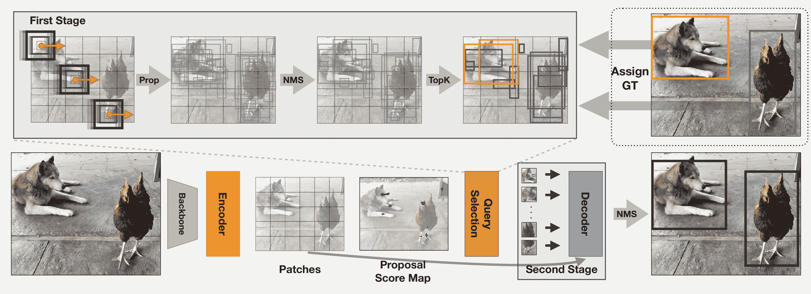

# DETA

> 原始文本：[`huggingface.co/docs/transformers/v4.37.2/en/model_doc/deta`](https://huggingface.co/docs/transformers/v4.37.2/en/model_doc/deta)

## 概述

DETA 模型是由 Jeffrey Ouyang-Zhang、Jang Hyun Cho、Xingyi Zhou、Philipp Krähenbühl 在[NMS Strikes Back](https://arxiv.org/abs/2212.06137)中提出的。DETA（Detection Transformers with Assignment）通过将传统检测器中使用的一对一二部匹配损失替换为使用非极大值抑制（NMS）的一对多标签分配来改进 Deformable DETR，从而实现了高达 2.5 mAP 的显着增益。

论文摘要如下：

*检测变换器（DETR）在训练期间通过一对一的二部匹配直接将查询转换为唯一对象，并实现端到端的目标检测。最近，这些模型在 COCO 上超越了传统的检测器，具有不可否认的优雅。然而，它们在多个设计方面与传统检测器不同，包括模型架构和训练计划，因此一对一匹配的有效性尚未完全理解。在这项工作中，我们在 DETR 中进行了一项严格的比较，与传统检测器中的一对多标签分配相比，传统检测器使用非极大值抑制（NMS）。令人惊讶的是，我们观察到在相同设置下，NMS 中的一对多分配始终优于标准的一对一匹配，获得了高达 2.5 mAP 的显着增益。我们的检测器使用传统的 IoU-based 标签分配训练 Deformable-DETR，在 ResNet50 骨干网络下在 12 个时期（1x 计划）内实现了 50.2 的 COCO mAP，优于此设置中的所有现有传统或基于变换器的检测器。在多个数据集、计划和架构上，我们始终表明二部匹配对于高性能检测变换器是不必要的。此外，我们将检测变换器的成功归因于其富有表现力的变换器架构。*

 DETA 概述。摘自[原始论文](https://arxiv.org/abs/2212.06137)。

此模型由[nielsr](https://huggingface.co/nielsr)贡献。原始代码可以在[这里](https://github.com/jozhang97/DETA)找到。

## 资源

一个官方 Hugging Face 和社区（由🌎表示）资源列表，可帮助您开始使用 DETA。

+   DETA 的演示笔记本可以在[这里](https://github.com/NielsRogge/Transformers-Tutorials/tree/master/DETA)找到。

+   另请参阅：目标检测任务指南

如果您有兴趣提交资源以包含在这里，请随时打开一个 Pull Request，我们将进行审查！资源应该理想地展示一些新东西，而不是复制现有资源。

## DetaConfig

### `class transformers.DetaConfig`

[<来源>](https://github.com/huggingface/transformers/blob/v4.37.2/src/transformers/models/deta/configuration_deta.py#L30)

```py
( backbone_config = None num_queries = 900 max_position_embeddings = 2048 encoder_layers = 6 encoder_ffn_dim = 2048 encoder_attention_heads = 8 decoder_layers = 6 decoder_ffn_dim = 1024 decoder_attention_heads = 8 encoder_layerdrop = 0.0 is_encoder_decoder = True activation_function = 'relu' d_model = 256 dropout = 0.1 attention_dropout = 0.0 activation_dropout = 0.0 init_std = 0.02 init_xavier_std = 1.0 return_intermediate = True auxiliary_loss = False position_embedding_type = 'sine' num_feature_levels = 5 encoder_n_points = 4 decoder_n_points = 4 two_stage = True two_stage_num_proposals = 300 with_box_refine = True assign_first_stage = True assign_second_stage = True class_cost = 1 bbox_cost = 5 giou_cost = 2 mask_loss_coefficient = 1 dice_loss_coefficient = 1 bbox_loss_coefficient = 5 giou_loss_coefficient = 2 eos_coefficient = 0.1 focal_alpha = 0.25 **kwargs )
```

参数

+   `backbone_config`（`PretrainedConfig`或`dict`，*可选*，默认为`ResNetConfig()`）—骨干模型的配置。

+   `num_queries`（`int`，*可选*，默认为 900）—对象查询的数量，即检测槽位。这是 DetaModel 在单个图像中可以检测到的对象的最大数量。如果`two_stage`设置为`True`，则使用`two_stage_num_proposals`。

+   `d_model`（`int`，*可选*，默认为 256）—层的维度。

+   `encoder_layers`（`int`，*可选*，默认为 6）—编码器层数。

+   `decoder_layers`（`int`，*可选*，默认为 6）—解码器层数。

+   `encoder_attention_heads`（`int`，*可选*，默认为 8）—变换器编码器中每个注意力层的注意力头数。

+   `decoder_attention_heads` (`int`, *optional*, defaults to 8) — Transformer 解码器中每个注意力层的注意力头数。

+   `decoder_ffn_dim` (`int`, *optional*, defaults to 2048) — 解码器中“中间”（通常称为前馈）层的维度。

+   `encoder_ffn_dim` (`int`, *optional*, defaults to 2048) — 解码器中“中间”（通常称为前馈）层的维度。

+   `activation_function` (`str` or `function`, *optional*, defaults to `"relu"`) — 编码器和池化器中的非线性激活函数（函数或字符串）。如果是字符串，则支持`"gelu"`、`"relu"`、`"silu"`和`"gelu_new"`。

+   `dropout` (`float`, *optional*, defaults to 0.1) — 嵌入、编码器和池化器中所有全连接层的 dropout 概率。

+   `attention_dropout` (`float`, *optional*, defaults to 0.0) — 注意力概率的 dropout 比率。

+   `activation_dropout` (`float`, *optional*, defaults to 0.0) — 全连接层内激活的 dropout 比率。

+   `init_std` (`float`, *optional*, defaults to 0.02) — 用于初始化所有权重矩阵的 truncated_normal_initializer 的标准差。

+   `init_xavier_std` (`float`, *optional*, defaults to 1) — 用于 HM Attention map 模块中 Xavier 初始化增益的缩放因子。

+   `encoder_layerdrop` (`float`, *optional*, defaults to 0.0) — 编码器的 LayerDrop 概率。有关更多详细信息，请参阅[LayerDrop paper](https://arxiv.org/abs/1909.11556)。

+   `auxiliary_loss` (`bool`, *optional*, defaults to `False`) — 是否使用辅助解码损失（每个解码器层的损失）。

+   `position_embedding_type` (`str`, *optional*, defaults to `"sine"`) — 用于图像特征之上的位置嵌入的类型。可以是`"sine"`或`"learned"`之一。

+   `class_cost` (`float`, *optional*, defaults to 1) — 匈牙利匹配成本中分类错误的相对权重。

+   `bbox_cost` (`float`, *optional*, defaults to 5) — 匈牙利匹配成本中边界框坐标的 L1 误差的相对权重。

+   `giou_cost` (`float`, *optional*, defaults to 2) — 匈牙利匹配成本中边界框广义 IoU 损失的相对权重。

+   `mask_loss_coefficient` (`float`, *optional*, defaults to 1) — Focal loss 在全景分割损失中的相对权重。

+   `dice_loss_coefficient` (`float`, *optional*, defaults to 1) — 全景分割损失中 DICE/F-1 损失的相对权重。

+   `bbox_loss_coefficient` (`float`, *optional*, defaults to 5) — 目标检测损失中 L1 边界框损失的相对权重。

+   `giou_loss_coefficient` (`float`, *optional*, defaults to 2) — 目标检测损失中广义 IoU 损失的相对权重。

+   `eos_coefficient` (`float`, *optional*, defaults to 0.1) — 目标检测损失中“无对象”类的相对分类权重。

+   `num_feature_levels` (`int`, *optional*, defaults to 5) — 输入特征级别的数量。

+   `encoder_n_points` (`int`, *optional*, defaults to 4) — 编码器中每个注意力头的每个特征级别中采样的键的数量。

+   `decoder_n_points` (`int`, *optional*, defaults to 4) — 解码器中每个注意力头的每个特征级别中采样的键的数量。

+   `two_stage` (`bool`, *optional*, defaults to `True`) — 是否应用两阶段可变形 DETR，其中区域提议也是由 DETA 的变体生成的，然后进一步馈入解码器进行迭代边界框细化。

+   `two_stage_num_proposals` (`int`, *optional*, defaults to 300) — 要生成的区域提议数量，如果`two_stage`设置为`True`。

+   `with_box_refine` (`bool`, *optional*, defaults to `True`) — 是否应用迭代边界框细化，其中每个解码器层根据前一层的预测对边界框进行细化。

+   `focal_alpha` (`float`, *optional*, defaults to 0.25) — Focal loss 中的 Alpha 参数。

+   `assign_first_stage` (`bool`, *optional*, defaults to `True`) — 如果重叠大于阈值 0.7，则将每个预测 i 分配给最高重叠的地面真实对象。

+   `assign_second_stage` (`bool`, *optional*, defaults to `True`) — 是否在第二阶段紧随第一阶段分配程序进行第二次分配。

这是一个配置类，用于存储 DetaModel 的配置。它用于根据指定的参数实例化一个 DETA 模型，定义模型架构。使用默认值实例化配置将产生与 DETA [SenseTime/deformable-detr](https://huggingface.co/SenseTime/deformable-detr) 架构类似的配置。

配置对象继承自 PretrainedConfig，可用于控制模型输出。阅读来自 PretrainedConfig 的文档以获取更多信息。

示例：

```py
>>> from transformers import DetaConfig, DetaModel

>>> # Initializing a DETA SenseTime/deformable-detr style configuration
>>> configuration = DetaConfig()

>>> # Initializing a model (with random weights) from the SenseTime/deformable-detr style configuration
>>> model = DetaModel(configuration)

>>> # Accessing the model configuration
>>> configuration = model.config
```

## DetaImageProcessor

### `class transformers.DetaImageProcessor`

[< source >](https://github.com/huggingface/transformers/blob/v4.37.2/src/transformers/models/deta/image_processing_deta.py#L465)

```py
( format: Union = <AnnotationFormat.COCO_DETECTION: 'coco_detection'> do_resize: bool = True size: Dict = None resample: Resampling = <Resampling.BILINEAR: 2> do_rescale: bool = True rescale_factor: Union = 0.00392156862745098 do_normalize: bool = True image_mean: Union = None image_std: Union = None do_pad: bool = True **kwargs )
```

参数

+   `format` (`str`, *optional*, defaults to `"coco_detection"`) — 注释的数据格式。其中之一为`"coco_detection"`或“coco_panoptic”。

+   `do_resize` (`bool`, *optional*, defaults to `True`) — 控制是否将图像的（高度，宽度）尺寸调整为指定的 `size`。可以被 `preprocess` 方法中的 `do_resize` 参数覆盖。

+   `size` (`Dict[str, int]` *optional*, defaults to `{"shortest_edge" -- 800, "longest_edge": 1333}`): 调整大小后的图像（高度，宽度）尺寸。可以被 `preprocess` 方法中的 `size` 参数覆盖。

+   `resample` (`PILImageResampling`, *optional*, defaults to `PILImageResampling.BILINEAR`) — 如果调整图像大小，则使用的重采样滤波器。

+   `do_rescale` (`bool`, *optional*, defaults to `True`) — 控制是否按指定的比例 `rescale_factor` 对图像进行重新缩放。可以被 `preprocess` 方法中的 `do_rescale` 参数覆盖。

+   `rescale_factor` (`int` or `float`, *optional*, defaults to `1/255`) — 如果重新缩放图像，则使用的比例因子。可以被 `preprocess` 方法中的 `rescale_factor` 参数覆盖。 do_normalize — 控制是否对图像进行归一化。可以被 `preprocess` 方法中的 `do_normalize` 参数覆盖。

+   `image_mean` (`float` or `List[float]`, *optional*, defaults to `IMAGENET_DEFAULT_MEAN`) — 在归一化图像时使用的均值。可以是单个值或每个通道的值列表。可以被 `preprocess` 方法中的 `image_mean` 参数覆盖。

+   `image_std` (`float` or `List[float]`, *optional*, defaults to `IMAGENET_DEFAULT_STD`) — 在归一化图像时使用的标准差值。可以是单个值或每个通道的值列表。可以被 `preprocess` 方法中的 `image_std` 参数覆盖。

+   `do_pad` (`bool`, *optional*, defaults to `True`) — 控制是否将图像填充到批处理中最大的图像并创建像素掩码。可以被 `preprocess` 方法中的 `do_pad` 参数覆盖。

构建一个可变形 DETR 图像处理器。

#### `preprocess`

[< source >](https://github.com/huggingface/transformers/blob/v4.37.2/src/transformers/models/deta/image_processing_deta.py#L771)

```py
( images: Union annotations: Union = None return_segmentation_masks: bool = None masks_path: Union = None do_resize: Optional = None size: Optional = None resample = None do_rescale: Optional = None rescale_factor: Union = None do_normalize: Optional = None image_mean: Union = None image_std: Union = None do_pad: Optional = None format: Union = None return_tensors: Union = None data_format: Union = <ChannelDimension.FIRST: 'channels_first'> input_data_format: Union = None **kwargs )
```

参数

+   `images` (`ImageInput`) — 要预处理的图像或图像批处理。期望单个图像或像素值范围从 0 到 255 的图像批处理。如果传入像素值在 0 到 1 之间的图像，请设置 `do_rescale=False`。

+   `annotations`（`List[Dict]`或`List[List[Dict]]`，*可选*）- 与图像或一批图像相关联的注释列表。如果注释用于目标检测，则注释应该是一个带有以下键的字典：

    +   “image_id”（`int`）：图像 ID。

    +   “annotations”（`List[Dict]`）：图像的注释列表。每个注释应该是一个字典。一个图像可能没有注释，此时列表应为空。如果注释用于分割，注释应该是一个带有以下键的字典：

    +   “image_id”（`int`）：图像 ID。

    +   “segments_info”（`List[Dict]`）：图像的段列表。每个段应该是一个字典。一个图像可能没有段，此时列表应为空。

    +   “file_name”（`str`）：图像的文件名。

+   `return_segmentation_masks`（`bool`，*可选*，默认为 self.return_segmentation_masks）- 是否返回分割掩模。

+   `masks_path`（`str`或`pathlib.Path`，*可选*）- 包含分割掩模的目录路径。

+   `do_resize`（`bool`，*可选*，默认为 self.do_resize）- 是否调整图像大小。

+   `size`（`Dict[str, int]`，*可选*，默认为 self.size）- 调整大小后的图像大小。

+   `resample`（`PILImageResampling`，*可选*，默认为 self.resample）- 调整图像大小时使用的重采样滤波器。

+   `do_rescale`（`bool`，*可选*，默认为 self.do_rescale）- 是否重新缩放图像。

+   `rescale_factor`（`float`，*可选*，默认为 self.rescale_factor）- 重新缩放图像时使用的重新缩放因子。

+   `do_normalize`（`bool`，*可选*，默认为 self.do_normalize）- 是否对图像进行归一化。

+   `image_mean`（`float`或`List[float]`，*可选*，默认为 self.image_mean）- 在归一化图像时使用的均值。

+   `image_std`（`float`或`List[float]`，*可选*，默认为 self.image_std）- 在归一化图像时使用的标准差。

+   `do_pad`（`bool`，*可选*，默认为 self.do_pad）- 是否对图像进行填充。

+   `format`（`str`或`AnnotationFormat`，*可选*，默认为 self.format）- 注释的格式。

+   `return_tensors`（`str`或`TensorType`，*可选*，默认为 self.return_tensors）- 要返回的张量类型。如果为`None`，将返回图像列表。

+   `data_format`（`ChannelDimension`或`str`，*可选*，默认为`ChannelDimension.FIRST`）- 输出图像的通道维度格式。可以是以下之一：

    +   `"channels_first"`或`ChannelDimension.FIRST`：图像以（num_channels，height，width）格式。

    +   `"channels_last"`或`ChannelDimension.LAST`：图像以（height，width，num_channels）格式。

    +   未设置：使用输入图像的通道维度格式。

+   `input_data_format`（`ChannelDimension`或`str`，*可选*）- 输入图像的通道维度格式。如果未设置，将从输入图像中推断通道维度格式。可以是以下之一：

    +   `"channels_first"`或`ChannelDimension.FIRST`：图像以（num_channels，height，width）格式。

    +   `"channels_last"`或`ChannelDimension.LAST`：图像以（height，width，num_channels）格式。

    +   `"none"`或`ChannelDimension.NONE`：图像以（height，width）格式。

对图像或一批图像进行预处理，以便模型可以使用。

#### `post_process_object_detection`

[<来源>](https://github.com/huggingface/transformers/blob/v4.37.2/src/transformers/models/deta/image_processing_deta.py#L993)

```py
( outputs threshold: float = 0.5 target_sizes: Union = None nms_threshold: float = 0.7 ) → export const metadata = 'undefined';List[Dict]
```

参数

+   `outputs`（`DetrObjectDetectionOutput`）- 模型的原始输出。

+   `threshold`（`float`，*可选*，默认为 0.5）- 保留目标检测预测的分数阈值。

+   `target_sizes`（`torch.Tensor`或`List[Tuple[int, int]]`，*可选*）- 形状为`(batch_size, 2)`的张量或包含每个图像批次中目标大小（高度，宽度）的元组列表（`Tuple[int, int]`）。如果设置为 None，预测将不会被调整大小。

+   `nms_threshold`（`float`，*可选*，默认为 0.7）- NMS 阈值。

返回

`List[Dict]`

一个字典列表，每个字典包含模型预测的批次中图像的分数、标签和框。

将 DetaForObjectDetection 的输出转换为最终的边界框，格式为(top_left_x, top_left_y, bottom_right_x, bottom_right_y)。仅支持 PyTorch。

## DetaModel

### `class transformers.DetaModel`

[<来源>](https://github.com/huggingface/transformers/blob/v4.37.2/src/transformers/models/deta/modeling_deta.py#L1345)

```py
( config: DetaConfig )
```

参数

+   `config` (DetaConfig) — 模型配置类，包含模型的所有参数。使用配置文件初始化不会加载与模型相关的权重，只会加载配置。查看 from_pretrained()方法以加载模型权重。

裸的 DETA 模型（由骨干和编码器-解码器 Transformer 组成），输出原始隐藏状态，没有特定的头部。

此模型继承自 PreTrainedModel。查看超类文档以获取库为所有模型实现的通用方法（如下载或保存、调整输入嵌入、修剪头等）。

此模型还是一个 PyTorch [torch.nn.Module](https://pytorch.org/docs/stable/nn.html#torch.nn.Module)子类。将其用作常规 PyTorch 模块，并参考 PyTorch 文档以获取有关一般用法和行为的所有相关信息。

#### `forward`

[<来源>](https://github.com/huggingface/transformers/blob/v4.37.2/src/transformers/models/deta/modeling_deta.py#L1515)

```py
( pixel_values: FloatTensor pixel_mask: Optional = None decoder_attention_mask: Optional = None encoder_outputs: Optional = None inputs_embeds: Optional = None decoder_inputs_embeds: Optional = None output_attentions: Optional = None output_hidden_states: Optional = None return_dict: Optional = None ) → export const metadata = 'undefined';transformers.models.deta.modeling_deta.DetaModelOutput or tuple(torch.FloatTensor)
```

参数

+   `pixel_values` (`torch.FloatTensor`，形状为`(batch_size, num_channels, height, width)`) — 像素值。默认情况下将忽略填充。

    像素值可以使用 AutoImageProcessor 获得。有关详细信息，请参阅`AutoImageProcessor.__call__()`。

+   `pixel_mask` (`torch.LongTensor`，形状为`(batch_size, height, width)`，*可选*) — 用于避免在填充像素值上执行注意力的掩码。掩码值选择在`[0, 1]`范围内：

    +   对于真实像素（即`未屏蔽`）为 1，

    +   对于填充像素（即`屏蔽`）为 0。

    什么是注意力掩码？

+   `decoder_attention_mask` (`torch.FloatTensor`，形状为`(batch_size, num_queries)`，*可选*) — 默认情况下不使用。可用于屏蔽对象查询。

+   `encoder_outputs` (`tuple(tuple(torch.FloatTensor)`, *可选*) — 元组包含(`last_hidden_state`，*可选*：`hidden_states`，*可选*：`attentions`) `last_hidden_state`的形状为`(batch_size, sequence_length, hidden_size)`，*可选*) 是编码器最后一层输出的隐藏状态序列。用于解码器的交叉注意力。

+   `inputs_embeds` (`torch.FloatTensor`，形状为`(batch_size, sequence_length, hidden_size)`，*可选*) — 可选地，您可以选择直接传递图像的扁平化表示，而不是传递扁平化特征图（骨干网络和投影层的输出）。

+   `decoder_inputs_embeds` (`torch.FloatTensor`，形状为`(batch_size, num_queries, hidden_size)`，*可选*) — 可选地，您可以选择直接传递嵌入表示，而不是使用零张量初始化查询。

+   `output_attentions` (`bool`, *可选*) — 是否返回所有注意力层的注意力张量。有关更多详细信息，请查看返回张量下的`attentions`。

+   `output_hidden_states` (`bool`, *可选*) — 是否返回所有层的隐藏状态。有关更多详细信息，请查看返回张量下的`hidden_states`。

+   `return_dict`（`bool`，*可选*）— 是否返回一个 ModelOutput 而不是一个普通元组。

返回值

`transformers.models.deta.modeling_deta.DetaModelOutput`或`tuple(torch.FloatTensor)`

一个`transformers.models.deta.modeling_deta.DetaModelOutput`或一个`torch.FloatTensor`元组（如果传递了`return_dict=False`或当`config.return_dict=False`时）包括根据配置（DetaConfig）和输入的不同元素。

+   `init_reference_points`（形状为`(batch_size, num_queries, 4)`的`torch.FloatTensor`）— 通过 Transformer 解码器发送的初始参考点。

+   `last_hidden_state`（形状为`(batch_size, num_queries, hidden_size)`的`torch.FloatTensor`）— 模型解码器最后一层的隐藏状态序列。

+   `intermediate_hidden_states`（形状为`(batch_size, config.decoder_layers, num_queries, hidden_size)`的`torch.FloatTensor`）— 堆叠的中间隐藏状态（解码器每层的输出）。

+   `intermediate_reference_points`（形状为`(batch_size, config.decoder_layers, num_queries, 4)`的`torch.FloatTensor`）— 堆叠的中间参考点（解码器每层的参考点）。

+   `decoder_hidden_states`（`tuple(torch.FloatTensor)`，*可选*，当传递`output_hidden_states=True`或当`config.output_hidden_states=True`时返回）— 形状为`(batch_size, num_queries, hidden_size)`的`torch.FloatTensor`元组（一个用于嵌入的输出 + 一个用于每层的输出）。解码器在每层输出的隐藏状态加上初始嵌入输出。

+   `decoder_attentions`（`tuple(torch.FloatTensor)`，*可选*，当传递`output_attentions=True`或当`config.output_attentions=True`时返回）— 形状为`(batch_size, num_heads, num_queries, num_queries)`的`torch.FloatTensor`元组（每层一个）。解码器的注意力权重，在注意力 softmax 之后，用于计算自注意力头中的加权平均值。

+   `cross_attentions`（`tuple(torch.FloatTensor)`，*可选*，当传递`output_attentions=True`或当`config.output_attentions=True`时返回）— 形状为`(batch_size, num_queries, num_heads, 4, 4)`的`torch.FloatTensor`元组（每层一个）。解码器交叉注意力层的注意力权重，在注意力 softmax 之后，用于计算交叉注意力头中的加权平均值。

+   `encoder_last_hidden_state`（形状为`(batch_size, sequence_length, hidden_size)`的`torch.FloatTensor`，*可选*）— 模型编码器最后一层的隐藏状态序列。

+   `encoder_hidden_states`（`tuple(torch.FloatTensor)`，*可选*，当传递`output_hidden_states=True`或当`config.output_hidden_states=True`时返回）— 形状为`(batch_size, sequence_length, hidden_size)`的`torch.FloatTensor`元组（一个用于嵌入的输出 + 一个用于每层的输出）。编码器在每层输出的隐藏状态加上初始嵌入输出。

+   `encoder_attentions`（`tuple(torch.FloatTensor)`，*可选*，当传递`output_attentions=True`或当`config.output_attentions=True`时返回）— 形状为`(batch_size, num_queries, num_heads, 4, 4)`的`torch.FloatTensor`元组（每层一个）。编码器的注意力权重，在注意力 softmax 之后，用于计算自注意力头中的加权平均值。

+   `enc_outputs_class`（形状为`(batch_size, sequence_length, config.num_labels)`的`torch.FloatTensor`，*可选*，当`config.with_box_refine=True`和`config.two_stage=True`时返回）— 预测的边界框分数，其中选择前`config.two_stage_num_proposals`个得分最高的边界框作为第一阶段的区域提议。边界框二元分类的输出（即前景和背景）。

+   `enc_outputs_coord_logits`（`torch.FloatTensor`，形状为`(batch_size, sequence_length, 4)`，*可选*，当`config.with_box_refine=True`和`config.two_stage=True`时返回）— 第一阶段中预测的边界框坐标的 logits。

+   `output_proposals`（`torch.FloatTensor`，形状为`(batch_size, sequence_length, 4)`，*可选*，当`config.two_stage=True`时返回）— 在 gen_encoder_output_proposals 中提议边界框坐标的 logits。

DetaModel 的前向方法覆盖了`__call__`特殊方法。

虽然前向传递的步骤需要在此函数内定义，但应该在此之后调用`Module`实例，而不是在此处调用，因为前者会负责运行前后处理步骤，而后者会默默地忽略它们。

示例：

```py
>>> from transformers import AutoImageProcessor, DetaModel
>>> from PIL import Image
>>> import requests

>>> url = "http://images.cocodataset.org/val2017/000000039769.jpg"
>>> image = Image.open(requests.get(url, stream=True).raw)

>>> image_processor = AutoImageProcessor.from_pretrained("jozhang97/deta-swin-large-o365")
>>> model = DetaModel.from_pretrained("jozhang97/deta-swin-large-o365", two_stage=False)

>>> inputs = image_processor(images=image, return_tensors="pt")

>>> outputs = model(**inputs)

>>> last_hidden_states = outputs.last_hidden_state
>>> list(last_hidden_states.shape)
[1, 900, 256]
```

## DetaForObjectDetection

### `class transformers.DetaForObjectDetection`

[<来源>](https://github.com/huggingface/transformers/blob/v4.37.2/src/transformers/models/deta/modeling_deta.py#L1762)

```py
( config: DetaConfig )
```

参数

+   `config`（DetaConfig）— 包含模型所有参数的模型配置类。使用配置文件初始化不会加载与模型关联的权重，只加载配置。查看 from_pretrained()方法以加载模型权重。

DETA 模型（由骨干和编码器-解码器 Transformer 组成），顶部带有目标检测头，用于诸如 COCO 检测之类的任务。

这个模型继承自 PreTrainedModel。查看超类文档以了解库实现的所有模型的通用方法（例如下载或保存、调整输入嵌入、修剪头等）。

这个模型也是 PyTorch 的[torch.nn.Module](https://pytorch.org/docs/stable/nn.html#torch.nn.Module)子类。将其用作常规 PyTorch 模块，并参考 PyTorch 文档以获取有关一般用法和行为的所有相关信息。

#### `forward`

[<来源>](https://github.com/huggingface/transformers/blob/v4.37.2/src/transformers/models/deta/modeling_deta.py#L1827)

```py
( pixel_values: FloatTensor pixel_mask: Optional = None decoder_attention_mask: Optional = None encoder_outputs: Optional = None inputs_embeds: Optional = None decoder_inputs_embeds: Optional = None labels: Optional = None output_attentions: Optional = None output_hidden_states: Optional = None return_dict: Optional = None ) → export const metadata = 'undefined';transformers.models.deta.modeling_deta.DetaObjectDetectionOutput or tuple(torch.FloatTensor)
```

参数

+   `pixel_values`（`torch.FloatTensor`，形状为`(batch_size, num_channels, height, width)`）— 像素值。默认情况下将忽略填充。

    像素值可以使用 AutoImageProcessor 获得。查看`AutoImageProcessor.__call__()`以获取详细信息。

+   `pixel_mask`（`torch.LongTensor`，形状为`(batch_size, height, width)`，*可选*）— 用于避免在填充像素值上执行注意力的掩码。掩码值选在`[0, 1]`之间：

    +   1 表示真实像素（即`未被掩码`），

    +   0 表示填充像素（即`已掩码`）。

    什么是注意力掩码？

+   `decoder_attention_mask`（`torch.FloatTensor`，形状为`(batch_size, num_queries)`，*可选*）— 默认情况下不使用。可用于屏蔽对象查询。

+   `encoder_outputs`（`tuple(tuple(torch.FloatTensor)`，*可选*）— 元组包含（`last_hidden_state`，*可选*：`hidden_states`，*可选*：`attentions`）`last_hidden_state`形状为`(batch_size, sequence_length, hidden_size)`，*可选*）是编码器最后一层输出的隐藏状态序列。用于解码器的交叉注意力。

+   `inputs_embeds`（`torch.FloatTensor`，形状为`(batch_size, sequence_length, hidden_size)`，*可选*）— 可选地，可以直接传递图像的扁平特征图（骨干+投影层的输出），而不是传递图像的扁平表示。

+   `decoder_inputs_embeds` (`torch.FloatTensor` of shape `(batch_size, num_queries, hidden_size)`, *optional*) — 可选，可以选择直接传递嵌入表示，而不是用零张量初始化查询。

+   `output_attentions` (`bool`, *optional*) — 是否返回所有注意力层的注意力张量。有关更多详细信息，请参阅返回张量下的`attentions`。

+   `output_hidden_states` (`bool`, *optional*) — 是否返回所有层的隐藏状态。有关更多详细信息，请参阅返回张量下的`hidden_states`。

+   `return_dict` (`bool`, *optional*) — 是否返回 ModelOutput 而不是普通元组。

+   `labels` (`List[Dict]` of len `(batch_size,)`, *optional*) — 用于计算二分匹配损失的标签。字典列表，每个字典至少包含以下 2 个键：'class_labels'和'boxes'（分别是批处理中图像的类标签和边界框）。类标签本身应该是长度为`(图像中边界框数量,)`的`torch.LongTensor`，而边界框是形状为`(图像中边界框数量, 4)`的`torch.FloatTensor`。

返回

`transformers.models.deta.modeling_deta.DetaObjectDetectionOutput`或`tuple(torch.FloatTensor)`

`transformers.models.deta.modeling_deta.DetaObjectDetectionOutput`或`torch.FloatTensor`的元组（如果传递了`return_dict=False`或`config.return_dict=False`时）包括各种元素，具体取决于配置（DetaConfig）和输入。

+   `loss` (`torch.FloatTensor` of shape `(1,)`, *optional*, 当提供`labels`时返回) — 总损失，作为负对数似然（交叉熵）和边界框损失的线性组合。后者被定义为 L1 损失和广义尺度不变 IoU 损失的线性组合。

+   `loss_dict` (`Dict`, *optional*) — 包含各个损失的字典。用于记录。

+   `logits` (`torch.FloatTensor` of shape `(batch_size, num_queries, num_classes + 1)`) — 所有查询的分类 logits（包括无对象）。

+   `pred_boxes` (`torch.FloatTensor` of shape `(batch_size, num_queries, 4)`) — 所有查询的标准化框坐标，表示为（中心 _x，中心 _y，宽度，高度）。这些值在[0, 1]范围内标准化，相对于批处理中每个单独图像的大小（忽略可能的填充）。您可以使用`~DetaProcessor.post_process_object_detection`来检索未标准化的边界框。

+   `auxiliary_outputs` (`list[Dict]`, *optional*) — 可选，仅在辅助损失被激活时返回（即`config.auxiliary_loss`设置为`True`）并提供标签时返回。这是一个包含每个解码器层的上述两个键（`logits`和`pred_boxes`）的字典列表。

+   `last_hidden_state` (`torch.FloatTensor` of shape `(batch_size, num_queries, hidden_size)`, *optional*) — 模型解码器最后一层的隐藏状态序列的输出。

+   `decoder_hidden_states` (`tuple(torch.FloatTensor)`, *optional*, 当传递`output_hidden_states=True`或`config.output_hidden_states=True`时返回) — 形状为`(batch_size, num_queries, hidden_size)`的`torch.FloatTensor`元组（一个用于嵌入的输出 + 一个用于每层的输出）。解码器在每层输出的隐藏状态加上初始嵌入输出。

+   `decoder_attentions` (`tuple(torch.FloatTensor)`, *optional*, 当传递`output_attentions=True`或`config.output_attentions=True`时返回) — 形状为`(batch_size, num_heads, num_queries, num_queries)`的`torch.FloatTensor`元组（每层一个）。解码器的注意力权重，在注意力 softmax 之后，用于计算自注意力头中的加权平均值。

+   `cross_attentions` (`tuple(torch.FloatTensor)`，*可选*，当传递`output_attentions=True`或`config.output_attentions=True`时返回） — 元组的`torch.FloatTensor`（每一层一个）的形状为`(batch_size, num_queries, num_heads, 4, 4)`。解码器的交叉注意力层的注意力权重，在注意力 softmax 之后，用于计算交叉注意力头中的加权平均值。

+   `encoder_last_hidden_state` (`torch.FloatTensor` of shape `(batch_size, sequence_length, hidden_size)`，*可选*） — 模型编码器最后一层的隐藏状态序列。

+   `encoder_hidden_states` (`tuple(torch.FloatTensor)`，*可选*，当传递`output_hidden_states=True`或`config.output_hidden_states=True`时返回） — 元组的`torch.FloatTensor`（一个用于嵌入的输出 + 一个用于每一层的输出）的形状为`(batch_size, sequence_length, hidden_size)`。编码器在每一层输出的隐藏状态加上初始嵌入输出。

+   `encoder_attentions` (`tuple(torch.FloatTensor)`，*可选*，当传递`output_attentions=True`或`config.output_attentions=True`时返回） — 元组的`torch.FloatTensor`（每一层一个）的形状为`(batch_size, sequence_length, num_heads, 4, 4)`。编码器的注意力权重，在注意力 softmax 之后，用于计算自注意力头中的加权平均值。

+   `intermediate_hidden_states` (`torch.FloatTensor` of shape `(batch_size, config.decoder_layers, num_queries, hidden_size)`) — 堆叠的中间隐藏状态（解码器每一层的输出）。

+   `intermediate_reference_points` (`torch.FloatTensor` of shape `(batch_size, config.decoder_layers, num_queries, 4)`) — 堆叠的中间参考点（解码器每一层的参考点）。

+   `init_reference_points` (`torch.FloatTensor` of shape `(batch_size, num_queries, 4)`) — 通过 Transformer 解码器发送的初始参考点。

+   `enc_outputs_class` (`torch.FloatTensor` of shape `(batch_size, sequence_length, config.num_labels)`，*可选*，当`config.with_box_refine=True`和`config.two_stage=True`时返回） — 预测的边界框分数，其中选择前`config.two_stage_num_proposals`个得分最高的边界框作为第一阶段的区域提议。边界框二元分类的输出（即前景和背景）。

+   `enc_outputs_coord_logits` (`torch.FloatTensor` of shape `(batch_size, sequence_length, 4)`，*可选*，当`config.with_box_refine=True`和`config.two_stage=True`时返回） — 第一阶段中预测的边界框坐标的 logits。

+   `output_proposals` (`torch.FloatTensor` of shape `(batch_size, sequence_length, 4)`，*可选*，当`config.two_stage=True`时返回） — 在 gen_encoder_output_proposals 中的提议边界框坐标的 logits。

DetaForObjectDetection 的前向方法，覆盖了`__call__`特殊方法。

虽然前向传递的步骤需要在这个函数中定义，但应该在之后调用`Module`实例，而不是这个函数，因为前者会处理运行前后的处理步骤，而后者会默默地忽略它们。

示例：

```py
>>> from transformers import AutoImageProcessor, DetaForObjectDetection
>>> from PIL import Image
>>> import requests

>>> url = "http://images.cocodataset.org/val2017/000000039769.jpg"
>>> image = Image.open(requests.get(url, stream=True).raw)

>>> image_processor = AutoImageProcessor.from_pretrained("jozhang97/deta-swin-large")
>>> model = DetaForObjectDetection.from_pretrained("jozhang97/deta-swin-large")

>>> inputs = image_processor(images=image, return_tensors="pt")
>>> outputs = model(**inputs)

>>> # convert outputs (bounding boxes and class logits) to Pascal VOC format (xmin, ymin, xmax, ymax)
>>> target_sizes = torch.tensor([image.size[::-1]])
>>> results = image_processor.post_process_object_detection(outputs, threshold=0.5, target_sizes=target_sizes)[
...     0
... ]
>>> for score, label, box in zip(results["scores"], results["labels"], results["boxes"]):
...     box = [round(i, 2) for i in box.tolist()]
...     print(
...         f"Detected {model.config.id2label[label.item()]} with confidence "
...         f"{round(score.item(), 3)} at location {box}"
...     )
Detected cat with confidence 0.683 at location [345.85, 23.68, 639.86, 372.83]
Detected cat with confidence 0.683 at location [8.8, 52.49, 316.93, 473.45]
Detected remote with confidence 0.568 at location [40.02, 73.75, 175.96, 117.33]
Detected remote with confidence 0.546 at location [333.68, 77.13, 370.12, 187.51]
```
