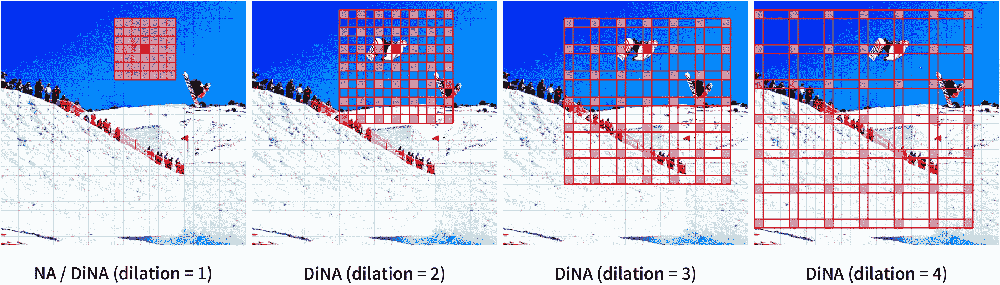

# 扩张邻域注意力变换器

> 原文：[`huggingface.co/docs/transformers/v4.37.2/en/model_doc/dinat`](https://huggingface.co/docs/transformers/v4.37.2/en/model_doc/dinat)

## 概述

DiNAT 是由 Ali Hassani 和 Humphrey Shi 在[扩张邻域注意力变换器](https://arxiv.org/abs/2209.15001)中提出的。

它通过添加扩张邻域注意力模式来扩展 NAT，以捕获全局上下文，并显示出明显的性能改进。

论文摘要如下：

*变换器正在迅速成为跨模态、领域和任务中最广泛应用的深度学习架构之一。在视觉领域，除了对普通变换器的持续努力外，分层变换器也引起了极大关注，这要归功于它们的性能和易于集成到现有框架中。这些模型通常采用局部化注意机制，例如滑动窗口邻域注意力（NA）或 Swin Transformer 的移位窗口自注意力。虽然有效地减少了自注意力的二次复杂度，但局部注意力削弱了自注意力的两个最理想的特性：长距离相互依赖建模和全局感受野。在本文中，我们介绍了扩张邻域注意力（DiNA），这是对 NA 的一种自然、灵活和高效的扩展，可以在不增加额外成本的情况下捕获更多的全局上下文并指数级扩展感受野。NA 的局部注意力和 DiNA 的稀疏全局注意力互补，因此我们引入了扩张邻域注意力变换器（DiNAT），这是一个基于两者构建的新的分层视觉变换器。DiNAT 的变体在强基线模型（如 NAT、Swin 和 ConvNeXt）上取得了显著的改进。我们的大型模型在 COCO 目标检测中比其 Swin 对应物快 1.5%的 box AP，在 COCO 实例分割中比其快 1.3%的 mask AP，在 ADE20K 语义分割中比其快 1.1%的 mIoU。与新框架配对，我们的大型变体是 COCO（58.2 PQ）和 ADE20K（48.5 PQ）的新一代全景分割模型，以及 Cityscapes（44.5 AP）和 ADE20K（35.4 AP）的实例分割模型（无额外数据）。它还与 ADE20K（58.2 mIoU）上的最先进专门的语义分割模型相匹配，并在 Cityscapes（84.5 mIoU）上排名第二（无额外数据）。*

 具有不同扩张值的邻域注意力。摘自[原始论文](https://arxiv.org/abs/2209.15001)。

此模型由[Ali Hassani](https://huggingface.co/alihassanijr)贡献。原始代码可以在[这里](https://github.com/SHI-Labs/Neighborhood-Attention-Transformer)找到。

## 使用提示

DiNAT 可以用作*骨干*。当`output_hidden_states = True`时，它将输出`hidden_states`和`reshaped_hidden_states`。`reshaped_hidden_states`的形状为`(batch, num_channels, height, width)`，而不是`(batch_size, height, width, num_channels)`。

注意：

+   DiNAT 依赖于[NATTEN](https://github.com/SHI-Labs/NATTEN/)对邻域注意力和扩张邻域注意力的实现。您可以通过参考[shi-labs.com/natten](https://shi-labs.com/natten)来安装 Linux 的预构建轮子，或者通过运行`pip install natten`在您的系统上构建。请注意，后者可能需要一些时间来编译。NATTEN 目前不支持 Windows 设备。

+   目前仅支持 4 的补丁大小。

## 资源

一些官方 Hugging Face 和社区（由🌎表示）资源的列表，可帮助您开始使用 DiNAT。

图像分类

+   DinatForImageClassification 由这个[示例脚本](https://github.com/huggingface/transformers/tree/main/examples/pytorch/image-classification)和[笔记本](https://colab.research.google.com/github/huggingface/notebooks/blob/main/examples/image_classification.ipynb)支持。

+   另请参阅：图像分类任务指南

如果您有兴趣提交资源以包含在此处，请随时打开一个 Pull Request，我们将对其进行审查！资源应该展示一些新内容，而不是重复现有资源。

## DinatConfig

### `class transformers.DinatConfig`

[< source >](https://github.com/huggingface/transformers/blob/v4.37.2/src/transformers/models/dinat/configuration_dinat.py#L30)

```py
( patch_size = 4 num_channels = 3 embed_dim = 64 depths = [3, 4, 6, 5] num_heads = [2, 4, 8, 16] kernel_size = 7 dilations = [[1, 8, 1], [1, 4, 1, 4], [1, 2, 1, 2, 1, 2], [1, 1, 1, 1, 1]] mlp_ratio = 3.0 qkv_bias = True hidden_dropout_prob = 0.0 attention_probs_dropout_prob = 0.0 drop_path_rate = 0.1 hidden_act = 'gelu' initializer_range = 0.02 layer_norm_eps = 1e-05 layer_scale_init_value = 0.0 out_features = None out_indices = None **kwargs )
```

参数

+   `patch_size` (`int`, *可选*, 默认为 4) — 每个补丁的大小（分辨率）。注意：目前仅支持补丁大小为 4。

+   `num_channels` (`int`, *可选*, 默认为 3) — 输入通道数。

+   `embed_dim` (`int`, *可选*, 默认为 64) — 补丁嵌入的维度。

+   `depths` (`List[int]`, *可选*, 默认为`[3, 4, 6, 5]`) — 编码器每个级别的层数。

+   `num_heads` (`List[int]`, *可选*, 默认为`[2, 4, 8, 16]`) — Transformer 编码器每层中的注意力头数。

+   `kernel_size` (`int`, *可选*, 默认为 7) — 邻域注意力核大小。

+   `dilations` (`List[List[int]]`, *可选*, 默认为`[[1, 8, 1], [1, 4, 1, 4], [1, 2, 1, 2, 1, 2], [1, 1, 1, 1, 1]]`) — Transformer 编码器中每个 NA 层的扩张值。

+   `mlp_ratio` (`float`, *可选*, 默认为 3.0) — MLP 隐藏维度与嵌入维度的比率。

+   `qkv_bias` (`bool`, *可选*, 默认为`True`) — 是否应向查询、键和值添加可学习偏置。

+   `hidden_dropout_prob` (`float`, *可选*, 默认为 0.0) — 嵌入和编码器中所有全连接层的丢失概率。

+   `attention_probs_dropout_prob` (`float`, *可选*, 默认为 0.0) — 注意力概率的丢失比率。

+   `drop_path_rate` (`float`, *可选*, 默认为 0.1) — 随机深度率。

+   `hidden_act` (`str`或`function`, *可选*, 默认为`"gelu"`) — 编码器中的非线性激活函数（函数或字符串）。如果是字符串，支持`"gelu"`、`"relu"`、`"selu"`和`"gelu_new"`。

+   `initializer_range` (`float`, *可选*, 默认为 0.02) — 用于初始化所有权重矩阵的截断正态初始化器的标准差。

+   `layer_norm_eps` (`float`, *可选*, 默认为 1e-05) — 层归一化层使用的 epsilon。

+   `layer_scale_init_value` (`float`, *可选*, 默认为 0.0) — 层缩放的初始值。如果<=0，则禁用。

+   `out_features` (`List[str]`, *可选*) — 如果用作骨干，要输出的特征列表。可以是`"stem"`、`"stage1"`、`"stage2"`等（取决于模型有多少阶段）。如果未设置且设置了`out_indices`，将默认为相应的阶段。如果未设置且`out_indices`未设置，将默认为最后一个阶段。必须按照`stage_names`属性中定义的顺序。

+   `out_indices` (`List[int]`, *可选*) — 如果用作骨干，要输出的特征的索引列表。可以是 0、1、2 等（取决于模型有多少阶段）。如果未设置且设置了`out_features`，将默认为相应的阶段。如果未设置且`out_features`未设置，将默认为最后一个阶段。必须按照`stage_names`属性中定义的顺序。

这是用于存储 DinatModel 配置的配置类。用于根据指定参数实例化 Dinat 模型，定义模型架构。使用默认值实例化配置将产生类似于 Dinat [shi-labs/dinat-mini-in1k-224](https://huggingface.co/shi-labs/dinat-mini-in1k-224) 架构的配置。

配置对象继承自 PretrainedConfig，可用于控制模型输出。阅读 PretrainedConfig 的文档以获取更多信息。

示例：

```py
>>> from transformers import DinatConfig, DinatModel

>>> # Initializing a Dinat shi-labs/dinat-mini-in1k-224 style configuration
>>> configuration = DinatConfig()

>>> # Initializing a model (with random weights) from the shi-labs/dinat-mini-in1k-224 style configuration
>>> model = DinatModel(configuration)

>>> # Accessing the model configuration
>>> configuration = model.config
```

## DinatModel

### `class transformers.DinatModel`

[< source >](https://github.com/huggingface/transformers/blob/v4.37.2/src/transformers/models/dinat/modeling_dinat.py#L692)

```py
( config add_pooling_layer = True )
```

参数

+   `config` (DinatConfig) — 包含模型所有参数的模型配置类。使用配置文件初始化不会加载与模型相关的权重，只会加载配置。查看 from_pretrained() 方法以加载模型权重。

裸 Dinat 模型变压器输出原始隐藏状态，没有特定的头部。这个模型是 PyTorch [torch.nn.Module](https://pytorch.org/docs/stable/nn.html#torch.nn.Module) 子类。将其用作常规 PyTorch 模块，并参考 PyTorch 文档以获取有关一般用法和行为的所有信息。

#### `forward`

[< source >](https://github.com/huggingface/transformers/blob/v4.37.2/src/transformers/models/dinat/modeling_dinat.py#L727)

```py
( pixel_values: Optional = None output_attentions: Optional = None output_hidden_states: Optional = None return_dict: Optional = None ) → export const metadata = 'undefined';transformers.models.dinat.modeling_dinat.DinatModelOutput or tuple(torch.FloatTensor)
```

参数

+   `pixel_values` (`torch.FloatTensor` of shape `(batch_size, num_channels, height, width)`) — 像素值。可以使用 AutoImageProcessor 获取像素值。详细信息请参阅 ViTImageProcessor.`call`()。

+   `output_attentions` (`bool`, *optional*) — 是否返回所有注意力层的注意力张量。有关更多详细信息，请查看返回张量下的 `attentions`。

+   `output_hidden_states` (`bool`, *optional*) — 是否返回所有层的隐藏状态。有关更多详细信息，请查看返回张量下的 `hidden_states`。

+   `return_dict` (`bool`, *optional*) — 是否返回 ModelOutput 而不是普通元组。

返回

`transformers.models.dinat.modeling_dinat.DinatModelOutput` 或 `tuple(torch.FloatTensor)`

一个 `transformers.models.dinat.modeling_dinat.DinatModelOutput` 或一个 `torch.FloatTensor` 元组（如果传递了 `return_dict=False` 或当 `config.return_dict=False` 时），包括根据配置（DinatConfig）和输入的不同元素。

+   `last_hidden_state` (`torch.FloatTensor` of shape `(batch_size, sequence_length, hidden_size)`) — 模型最后一层的隐藏状态输出序列。

+   `pooler_output` (`torch.FloatTensor` of shape `(batch_size, hidden_size)`, *optional*, returned when `add_pooling_layer=True` is passed) — 最后一层隐藏状态的平均池化。

+   `hidden_states` (`tuple(torch.FloatTensor)`, *optional*, returned when `output_hidden_states=True` is passed or when `config.output_hidden_states=True`) — Tuple of `torch.FloatTensor` (one for the output of the embeddings + one for the output of each stage) of shape `(batch_size, sequence_length, hidden_size)`.

    模型在每一层输出的隐藏状态以及初始嵌入输出。

+   `attentions`（`tuple(torch.FloatTensor)`，*可选*，当传递`output_attentions=True`或`config.output_attentions=True`时返回）— 形状为`(batch_size, num_heads, sequence_length, sequence_length)`的`torch.FloatTensor`元组（每个阶段一个）。

    自注意力头中用于计算加权平均值的注意力 softmax 后的注意力权重。

+   `reshaped_hidden_states`（`tuple(torch.FloatTensor)`，*可选*，当传递`output_hidden_states=True`或`config.output_hidden_states=True`时返回）— 形状为`(batch_size, hidden_size, height, width)`的`torch.FloatTensor`元组（一个用于嵌入的输出 + 一个用于每个阶段的输出）。

    模型在每个层的输出处的隐藏状态以及包括空间维度的初始嵌入输出的重塑。

DinatModel 的前向方法，覆盖`__call__`特殊方法。

虽然前向传递的配方需要在此函数内定义，但应该在此之后调用`Module`实例，而不是这个，因为前者负责运行前处理和后处理步骤，而后者则默默地忽略它们。

示例：

```py
>>> from transformers import AutoImageProcessor, DinatModel
>>> import torch
>>> from datasets import load_dataset

>>> dataset = load_dataset("huggingface/cats-image")
>>> image = dataset["test"]["image"][0]

>>> image_processor = AutoImageProcessor.from_pretrained("shi-labs/dinat-mini-in1k-224")
>>> model = DinatModel.from_pretrained("shi-labs/dinat-mini-in1k-224")

>>> inputs = image_processor(image, return_tensors="pt")

>>> with torch.no_grad():
...     outputs = model(**inputs)

>>> last_hidden_states = outputs.last_hidden_state
>>> list(last_hidden_states.shape)
[1, 7, 7, 512]
```

## DinatForImageClassification

### `class transformers.DinatForImageClassification`

[<来源>](https://github.com/huggingface/transformers/blob/v4.37.2/src/transformers/models/dinat/modeling_dinat.py#L782)

```py
( config )
```

参数

+   `config`（DinatConfig）— 具有模型所有参数的模型配置类。使用配置文件初始化不会加载与模型关联的权重，只加载配置。查看 from_pretrained()方法以加载模型权重。

Dinat 模型变压器，顶部带有图像分类头（在[CLS]标记的最终隐藏状态顶部的线性层），例如用于 ImageNet。

此模型是 PyTorch [torch.nn.Module](https://pytorch.org/docs/stable/nn.html#torch.nn.Module)子类。将其用作常规 PyTorch 模块，并参考 PyTorch 文档以获取与一般用法和行为相关的所有事项。

#### `forward`

[<来源>](https://github.com/huggingface/transformers/blob/v4.37.2/src/transformers/models/dinat/modeling_dinat.py#L806)

```py
( pixel_values: Optional = None labels: Optional = None output_attentions: Optional = None output_hidden_states: Optional = None return_dict: Optional = None ) → export const metadata = 'undefined';transformers.models.dinat.modeling_dinat.DinatImageClassifierOutput or tuple(torch.FloatTensor)
```

参数

+   `pixel_values`（形状为`(batch_size, num_channels, height, width)`的`torch.FloatTensor`）— 像素值。像素值可以使用 AutoImageProcessor 获取。有关详细信息，请参阅 ViTImageProcessor.`call`()。

+   `output_attentions`（`bool`，*可选*）— 是否返回所有注意力层的注意力张量。有关更多详细信息，请参阅返回张量下的`attentions`。

+   `output_hidden_states`（`bool`，*可选*）— 是否返回所有层的隐藏状态。有关更多详细信息，请参阅返回张量下的`hidden_states`。

+   `return_dict`（`bool`，*可选*）— 是否返回 ModelOutput 而不是普通元组。

+   `labels`（形状为`(batch_size,)`的`torch.LongTensor`，*可选*）— 用于计算图像分类/回归损失的标签。索引应在`[0, ..., config.num_labels - 1]`范围内。如果`config.num_labels == 1`，则计算回归损失（均方损失），如果`config.num_labels > 1`，则计算分类损失（交叉熵）。

返回

`transformers.models.dinat.modeling_dinat.DinatImageClassifierOutput`或`tuple(torch.FloatTensor)`

一个`transformers.models.dinat.modeling_dinat.DinatImageClassifierOutput`或一个`torch.FloatTensor`元组（如果传递`return_dict=False`或`config.return_dict=False`）包含根据配置（DinatConfig）和输入的各种元素。

+   `loss`（形状为`(1,)`的`torch.FloatTensor`，*可选*，在提供`labels`时返回） — 分类（如果`config.num_labels==1`则为回归）损失。

+   `logits`（形状为`(batch_size, config.num_labels)`的`torch.FloatTensor`） — 分类（如果`config.num_labels==1`则为回归）分数（SoftMax 之前）。

+   `hidden_states`（`tuple(torch.FloatTensor)`，*可选*，当传递`output_hidden_states=True`或`config.output_hidden_states=True`时返回） — 形状为`(batch_size, sequence_length, hidden_size)`的`torch.FloatTensor`元组（一个用于嵌入的输出 + 一个用于每个阶段的输出）。

    模型在每一层输出的隐藏状态加上初始嵌入输出。

+   `attentions`（`tuple(torch.FloatTensor)`，*可选*，当传递`output_attentions=True`或`config.output_attentions=True`时返回） — 形状为`(batch_size, num_heads, sequence_length, sequence_length)`的`torch.FloatTensor`元组（每个阶段一个）。

    在注意力 softmax 之后的注意力权重，用于计算自注意力头中的加权平均值。

+   `reshaped_hidden_states`（`tuple(torch.FloatTensor)`，*可选*，当传递`output_hidden_states=True`或`config.output_hidden_states=True`时返回） — 形状为`(batch_size, hidden_size, height, width)`的`torch.FloatTensor`元组（一个用于嵌入的输出 + 一个用于每个阶段的输出）。

    模型在每一层输出的隐藏状态加上初始嵌入输出，重塑以包括空间维度。

DinatForImageClassification 的前向方法，覆盖了`__call__`特殊方法。

尽管前向传递的配方需要在此函数内定义，但应该在此之后调用`Module`实例，而不是这个，因为前者负责运行预处理和后处理步骤，而后者则默默地忽略它们。

示例：

```py
>>> from transformers import AutoImageProcessor, DinatForImageClassification
>>> import torch
>>> from datasets import load_dataset

>>> dataset = load_dataset("huggingface/cats-image")
>>> image = dataset["test"]["image"][0]

>>> image_processor = AutoImageProcessor.from_pretrained("shi-labs/dinat-mini-in1k-224")
>>> model = DinatForImageClassification.from_pretrained("shi-labs/dinat-mini-in1k-224")

>>> inputs = image_processor(image, return_tensors="pt")

>>> with torch.no_grad():
...     logits = model(**inputs).logits

>>> # model predicts one of the 1000 ImageNet classes
>>> predicted_label = logits.argmax(-1).item()
>>> print(model.config.id2label[predicted_label])
tabby, tabby cat
```
