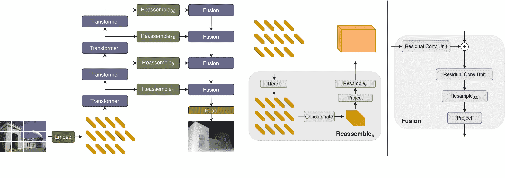

# DPT

> 原始文本：[`huggingface.co/docs/transformers/v4.37.2/en/model_doc/dpt`](https://huggingface.co/docs/transformers/v4.37.2/en/model_doc/dpt)

## 概述

DPT 模型由 René Ranftl、Alexey Bochkovskiy、Vladlen Koltun 在 [Vision Transformers for Dense Prediction](https://arxiv.org/abs/2103.13413) 中提出。DPT 是一个利用 Vision Transformer (ViT) 作为密集预测任务（如语义分割和深度估计）的骨干的模型。

论文摘要如下：

*我们介绍了密集视觉变换器，这是一种利用视觉变换器代替卷积网络作为密集预测任务骨干的架构。我们从视觉变换器的各个阶段汇集令牌，将它们组合成各种分辨率的图像表示，并逐渐将它们结合成使用卷积解码器进行全分辨率预测。变换器骨干以恒定且相对较高的分辨率处理表示，并在每个阶段具有全局感受野。这些特性使得密集视觉变换器在与完全卷积网络相比提供更精细和更全局一致的预测。我们的实验表明，这种架构在密集预测任务上取得了显著的改进，特别是当有大量训练数据可用时。对于单目深度估计，我们观察到与最先进的完全卷积网络相比，性能相对提高了高达 28%。当应用于语义分割时，密集视觉变换器在 ADE20K 上取得了 49.02% mIoU 的新的最先进水平。我们进一步展示，该架构可以在较小的数据集（如 NYUv2、KITTI 和 Pascal Context）上进行微调，也在这些数据集上取得了新的最先进水平。*

 DPT 架构。摘自[原始论文](https://arxiv.org/abs/2103.13413)。

此模型由 [nielsr](https://huggingface.co/nielsr) 贡献。原始代码可在[此处](https://github.com/isl-org/DPT)找到。

## 使用提示

DPT 兼容 `AutoBackbone` 类。这允许使用库中提供的各种计算机视觉骨干（如 `VitDetBackbone` 或 `Dinov2Backbone`）与 DPT 框架一起使用。可以按照以下方式创建它：

```py
from transformers import Dinov2Config, DPTConfig, DPTForDepthEstimation

# initialize with a Transformer-based backbone such as DINOv2
# in that case, we also specify `reshape_hidden_states=False` to get feature maps of shape (batch_size, num_channels, height, width)
backbone_config = Dinov2Config.from_pretrained("facebook/dinov2-base", out_features=["stage1", "stage2", "stage3", "stage4"], reshape_hidden_states=False)

config = DPTConfig(backbone_config=backbone_config)
model = DPTForDepthEstimation(config=config)
```

## 资源

以下是官方 Hugging Face 和社区（🌎 标志）资源列表，可帮助您开始使用 DPT。

+   DPTForDepthEstimation 的演示笔记本可以在[这里](https://github.com/NielsRogge/Transformers-Tutorials/tree/master/DPT)找到。

+   语义分割任务指南

+   单目深度估计任务指南

如果您有兴趣提交资源以包含在此处，请随时提交拉取请求，我们将进行审查！资源应该展示一些新内容，而不是重复现有资源。

## DPTConfig

`transformers.DPTConfig` 类

[< source >](https://github.com/huggingface/transformers/blob/v4.37.2/src/transformers/models/dpt/configuration_dpt.py#L33)

```py
( hidden_size = 768 num_hidden_layers = 12 num_attention_heads = 12 intermediate_size = 3072 hidden_act = 'gelu' hidden_dropout_prob = 0.0 attention_probs_dropout_prob = 0.0 initializer_range = 0.02 layer_norm_eps = 1e-12 image_size = 384 patch_size = 16 num_channels = 3 is_hybrid = False qkv_bias = True backbone_out_indices = [2, 5, 8, 11] readout_type = 'project' reassemble_factors = [4, 2, 1, 0.5] neck_hidden_sizes = [96, 192, 384, 768] fusion_hidden_size = 256 head_in_index = -1 use_batch_norm_in_fusion_residual = False use_bias_in_fusion_residual = None add_projection = False use_auxiliary_head = True auxiliary_loss_weight = 0.4 semantic_loss_ignore_index = 255 semantic_classifier_dropout = 0.1 backbone_featmap_shape = [1, 1024, 24, 24] neck_ignore_stages = [0, 1] backbone_config = None **kwargs )
```

参数

+   `hidden_size` (`int`, *可选*, 默认为 768) — 编码器层和池化层的维度。

+   `num_hidden_layers` (`int`, *可选*, 默认为 12) — Transformer 编码器中的隐藏层数。

+   `num_attention_heads` (`int`, *可选*, 默认为 12) — Transformer 编码器中每个注意力层的注意力头数。

+   `intermediate_size` (`int`, *可选*, 默认为 3072) — Transformer 编码器中“中间”（即前馈）层的维度。

+   `hidden_act` (`str` 或 `function`, *可选*, 默认为 `"gelu"`) — 编码器和池化器中的非线性激活函数（函数或字符串）。如果是字符串，支持 `"gelu"`, `"relu"`, `"selu"` 和 `"gelu_new"`。

+   `hidden_dropout_prob` (`float`, *optional*, defaults to 0.0) — 嵌入、编码器和池化器中所有全连接层的 dropout 概率。

+   `attention_probs_dropout_prob` (`float`, *optional*, defaults to 0.0) — 注意力概率的 dropout 比率。

+   `initializer_range` (`float`, *optional*, defaults to 0.02) — 用于初始化所有权重矩阵的截断正态初始化器的标准差。

+   `layer_norm_eps` (`float`, *optional*, defaults to 1e-12) — 层归一化层使用的 epsilon。

+   `image_size` (`int`, *optional*, defaults to 384) — 每个图像的大小（分辨率）。

+   `patch_size` (`int`, *optional*, defaults to 16) — 每个补丁的大小（分辨率）。

+   `num_channels` (`int`, *optional*, defaults to 3) — 输入通道数。

+   `is_hybrid` (`bool`, *optional*, defaults to `False`) — 是否使用混合主干。在加载 DPT-Hybrid 模型的情况下很有用。

+   `qkv_bias` (`bool`, *optional*, defaults to `True`) — 是否为查询、键和值添加偏置。

+   `backbone_out_indices` (`List[int]`, *optional*, defaults to `[2, 5, 8, 11]`) — 要从主干使用的中间隐藏状态的索引。

+   `readout_type` (`str`, *optional*, defaults to `"project"`) — 处理 ViT 主干中间隐藏状态的读出标记（CLS 标记）时要使用的读出类型。可以是[`"ignore"`, `"add"`, `"project"`]之一。

    +   “ignore” 简单地忽略 CLS 标记。

    +   “add” 通过将 CLS 标记的信息添加到所有其他标记中传递表示。

    +   “project” 通过将读出连接到所有其他标记，然后使用线性层将表示投影到原始特征维度 D，接着使用 GELU 非线性传递信息给其他标记。

+   `reassemble_factors` (`List[int]`, *optional*, defaults to `[4, 2, 1, 0.5]`) — 重组层的上/下采样因子。

+   `neck_hidden_sizes` (`List[str]`, *optional*, defaults to `[96, 192, 384, 768]`) — 要投影到主干特征图的隐藏大小。

+   `fusion_hidden_size` (`int`, *optional*, defaults to 256) — 融合前的通道数。

+   `head_in_index` (`int`, *optional*, defaults to -1) — 在头部中要使用的特征的索引。

+   `use_batch_norm_in_fusion_residual` (`bool`, *optional*, defaults to `False`) — 是否在融合块的预激活残差单元中使用批归一化。

+   `use_bias_in_fusion_residual` (`bool`, *optional*, defaults to `True`) — 是否在融合块的预激活残差单元中使用偏置。

+   `add_projection` (`bool`, *optional*, defaults to `False`) — 是否在深度估计头之前添加投影层。

+   `use_auxiliary_head` (`bool`, *optional*, defaults to `True`) — 训练时是否使用辅助头。

+   `auxiliary_loss_weight` (`float`, *optional*, defaults to 0.4) — 辅助头的交叉熵损失权重。

+   `semantic_loss_ignore_index` (`int`, *optional*, defaults to 255) — 语义分割模型损失函数中被忽略的索引。

+   `semantic_classifier_dropout` (`float`, *optional*, defaults to 0.1) — 语义分类头的 dropout 比率。

+   `backbone_featmap_shape` (`List[int]`, *optional*, defaults to `[1, 1024, 24, 24]`) — 仅用于`hybrid`嵌入类型。主干特征图的形状。

+   `neck_ignore_stages` (`List[int]`, *optional*, defaults to `[0, 1]`) — 仅用于`hybrid`嵌入类型。要忽略的读出层阶段。

+   `backbone_config` (`Union[Dict[str, Any], PretrainedConfig]`, *optional*) — 主干模型的配置。仅在`is_hybrid`为`True`或者想要利用`AutoBackbone` API 时使用。

这是配置类，用于存储 DPTModel 的配置。它用于根据指定的参数实例化一个 DPT 模型，定义模型架构。使用默认值实例化配置将产生类似于[DPT Intel/dpt-large](https://huggingface.co/Intel/dpt-large)架构的配置。

配置对象继承自 PretrainedConfig，可用于控制模型输出。阅读 PretrainedConfig 的文档以获取更多信息。

示例：

```py
>>> from transformers import DPTModel, DPTConfig

>>> # Initializing a DPT dpt-large style configuration
>>> configuration = DPTConfig()

>>> # Initializing a model from the dpt-large style configuration
>>> model = DPTModel(configuration)

>>> # Accessing the model configuration
>>> configuration = model.config
```

#### `to_dict`

[<来源>](https://github.com/huggingface/transformers/blob/v4.37.2/src/transformers/models/dpt/configuration_dpt.py#L247)

```py
( )
```

将此实例序列化为 Python 字典。覆盖默认的 to_dict()。返回：`Dict[str, any]`：构成此配置实例的所有属性的字典，

## DPTFeatureExtractor

### `class transformers.DPTFeatureExtractor`

[<来源>](https://github.com/huggingface/transformers/blob/v4.37.2/src/transformers/models/dpt/feature_extraction_dpt.py#L26)

```py
( *args **kwargs )
```

#### `__call__`

[<来源>](https://github.com/huggingface/transformers/blob/v4.37.2/src/transformers/image_processing_utils.py#L550)

```py
( images **kwargs )
```

预处理图像或一批图像。

#### `post_process_semantic_segmentation`

[<来源>](https://github.com/huggingface/transformers/blob/v4.37.2/src/transformers/models/dpt/image_processing_dpt.py#L422)

```py
( outputs target_sizes: List = None ) → export const metadata = 'undefined';semantic_segmentation
```

参数

+   `outputs`（DPTForSemanticSegmentation）— 模型的原始输出。

+   `target_sizes`（长度为`batch_size`的`List[Tuple]`，*可选*）— 对应于每个预测的请求最终大小（高度，宽度）的元组列表。如果未设置，预测将不会被调整大小。

返回

语义分割

长度为`batch_size`的`List[torch.Tensor]`，其中每个项目是形状为（高度，宽度）的语义分割地图，对应于`target_sizes`条目（如果指定了`target_sizes`）。每个`torch.Tensor`的每个条目对应于语义类别 ID。

将 DPTForSemanticSegmentation 的输出转换为语义分割地图。仅支持 PyTorch。

## DPTImageProcessor

### `class transformers.DPTImageProcessor`

[<来源>](https://github.com/huggingface/transformers/blob/v4.37.2/src/transformers/models/dpt/image_processing_dpt.py#L94)

```py
( do_resize: bool = True size: Dict = None resample: Resampling = <Resampling.BICUBIC: 3> keep_aspect_ratio: bool = False ensure_multiple_of: int = 1 do_rescale: bool = True rescale_factor: Union = 0.00392156862745098 do_normalize: bool = True image_mean: Union = None image_std: Union = None do_pad: bool = False size_divisor: int = None **kwargs )
```

参数

+   `do_resize`（`bool`，*可选*，默认为`True`）— 是否调整图像的（高度，宽度）尺寸。可以被`preprocess`中的`do_resize`覆盖。

+   `size`（`Dict[str, int]` *可选*，默认为`{"height" -- 384, "width": 384}`）：调整大小后的图像尺寸。可以被`preprocess`中的`size`覆盖。

+   `resample`（`PILImageResampling`，*可选*，默认为`Resampling.BICUBIC`）— 如果调整图像大小，则定义要使用的重采样滤波器。可以被`preprocess`中的`resample`覆盖。

+   `keep_aspect_ratio`（`bool`，*可选*，默认为`False`）— 如果为`True`，则将图像调整为保持纵横比的最大可能尺寸。可以被`preprocess`中的`keep_aspect_ratio`覆盖。

+   `ensure_multiple_of`（`int`，*可选*，默认为 1）— 如果`do_resize`为`True`，则将图像调整为此值的倍数。可以被`preprocess`中的`ensure_multiple_of`覆盖。

+   `do_rescale`（`bool`，*可选*，默认为`True`）— 是否按指定比例`rescale_factor`重新缩放图像。可以被`preprocess`中的`do_rescale`覆盖。

+   `rescale_factor` (`int`或`float`，*optional*，默认为`1/255`) — 如果重新缩放图像，则使用的缩放因子。可以被`preprocess`中的`rescale_factor`覆盖。

+   `do_normalize` (`bool`，*optional*，默认为`True`) — 是否对图像进行归一化。可以被`preprocess`方法中的`do_normalize`参数覆盖。

+   `image_mean` (`float`或`List[float]`，*optional*，默认为`IMAGENET_STANDARD_MEAN`) — 如果对图像进行归一化，则使用的均值。这是一个浮点数或与图像通道数相同长度的浮点数列表。可以被`preprocess`方法中的`image_mean`参数覆盖。

+   `image_std` (`float`或`List[float]`，*optional*，默认为`IMAGENET_STANDARD_STD`) — 如果对图像进行归一化，则使用的标准差。这是一个浮点数或与图像通道数相同长度的浮点数列表。可以被`preprocess`方法中的`image_std`参数覆盖。

+   `do_pad` (`bool`，*optional*，默认为`False`) — 是否应用中心填充。这在 DINOv2 论文中引入，该论文将该模型与 DPT 结合使用。

+   `size_divisor` (`int`，*optional*) — 如果`do_pad`为`True`，则填充图像尺寸使其可被该值整除。这在 DINOv2 论文中引入，该论文将该模型与 DPT 结合使用。

构造一个 DPT 图像处理器。

#### `preprocess`

[<来源>](https://github.com/huggingface/transformers/blob/v4.37.2/src/transformers/models/dpt/image_processing_dpt.py#L267)

```py
( images: Union do_resize: bool = None size: int = None keep_aspect_ratio: bool = None ensure_multiple_of: int = None resample: Resampling = None do_rescale: bool = None rescale_factor: float = None do_normalize: bool = None image_mean: Union = None image_std: Union = None do_pad: bool = None size_divisor: int = None return_tensors: Union = None data_format: ChannelDimension = <ChannelDimension.FIRST: 'channels_first'> input_data_format: Union = None **kwargs )
```

参数

+   `images` (`ImageInput`) — 要预处理的图像。期望单个图像或批量图像，像素值范围为 0 到 255。如果传入像素值在 0 到 1 之间的图像，请设置`do_rescale=False`。

+   `do_resize` (`bool`，*optional*，默认为`self.do_resize`) — 是否调整图像大小。

+   `size` (`Dict[str, int]`, *optional*, defaults to `self.size`) — 调整大小后的图像尺寸。如果`keep_aspect_ratio`为`True`，则将图像调整大小为保持纵横比的最大可能尺寸。如果设置了`ensure_multiple_of`，则将图像调整大小为该值的倍数。

+   `keep_aspect_ratio` (`bool`，*optional*，默认为`self.keep_aspect_ratio`) — 是否保持图像的纵横比。如果为 False，则将图像调整大小为（size，size）。如果为 True，则将图像调整大小以保持纵横比，大小将是最大可能的。

+   `ensure_multiple_of` (`int`，*optional*，默认为`self.ensure_multiple_of`) — 确保图像大小是该值的倍数。

+   `resample` (`int`，*optional*，默认为`self.resample`) — 如果调整图像大小，则要使用的重采样滤波器。这可以是枚举`PILImageResampling`之一，仅在`do_resize`设置为`True`时有效。

+   `do_rescale` (`bool`，*optional*，默认为`self.do_rescale`) — 是否将图像值重新缩放在[0 - 1]之间。

+   `rescale_factor` (`float`，*optional*，默认为`self.rescale_factor`) — 如果`do_rescale`设置为`True`，则用于重新缩放图像的缩放因子。

+   `do_normalize` (`bool`，*optional*，默认为`self.do_normalize`) — 是否对图像进行归一化。

+   `image_mean` (`float`或`List[float]`，*optional*，默认为`self.image_mean`) — 图像均值。

+   `image_std` (`float`或`List[float]`，*optional*，默认为`self.image_std`) — 图像标准差。

+   `return_tensors` (`str`或`TensorType`，*optional*) — 要返回的张量类型。可以是以下之一：

    +   未设置：返回一个`np.ndarray`列表。

    +   `TensorType.TENSORFLOW`或`'tf'`：返回类型为`tf.Tensor`的批处理。

    +   `TensorType.PYTORCH`或`'pt'`：返回类型为`torch.Tensor`的批处理。

    +   `TensorType.NUMPY`或`'np'`：返回类型为`np.ndarray`的批处理。

    +   `TensorType.JAX`或`'jax'`：返回类型为`jax.numpy.ndarray`的批处理。

+   `data_format` (`ChannelDimension`或`str`，*optional*，默认为`ChannelDimension.FIRST`) — 输出图像的通道维度格式。可以是以下之一：

    +   `ChannelDimension.FIRST`：图像以（num_channels，height，width）格式。

    +   `ChannelDimension.LAST`: 图像以（高度，宽度，通道数）格式。

+   `input_data_format`（`ChannelDimension` 或 `str`，*可选*）— 输入图像的通道维度格式。如果未设置，将从输入图像中推断通道维度格式。可以是以下之一：

    +   `"channels_first"` 或 `ChannelDimension.FIRST`: 图像以（通道数，高度，宽度）格式。

    +   `"channels_last"` 或 `ChannelDimension.LAST`: 图像以（高度，宽度，通道数）格式。

    +   `"none"` 或 `ChannelDimension.NONE`: 图像以（高度，宽度）格式。

对图像或图像批次进行预处理。

#### `post_process_semantic_segmentation`

[<来源>](https://github.com/huggingface/transformers/blob/v4.37.2/src/transformers/models/dpt/image_processing_dpt.py#L422)

```py
( outputs target_sizes: List = None ) → export const metadata = 'undefined';semantic_segmentation
```

参数

+   `outputs`（DPTForSemanticSegmentation）— 模型的原始输出。

+   `target_sizes`（长度为`batch_size`的 `List[Tuple]`，*可选*）— 与每个预测的请求最终大小（高度，宽度）对应的元组列表。如果未设置，预测将不会被调整大小。

返回

semantic_segmentation

长度为`batch_size`的 `List[torch.Tensor]`，其中每个项目是形状为（高度，宽度）的语义分割地图，对应于 `target_sizes` 条目（如果指定了 `target_sizes`）。每个 `torch.Tensor` 的每个条目对应于一个语义类别 id。

将 DPTForSemanticSegmentation 的输出转换为语义分割地图。仅支持 PyTorch。

## DPTModel

### `class transformers.DPTModel`

[<来源>](https://github.com/huggingface/transformers/blob/v4.37.2/src/transformers/models/dpt/modeling_dpt.py#L869)

```py
( config add_pooling_layer = True )
```

参数

+   `config`（ViTConfig）— 具有模型所有参数的模型配置类。使用配置文件初始化不会加载与模型相关的权重，只加载配置。查看 from_pretrained() 方法以加载模型权重。

裸的 DPT 模型变压器输出原始的隐藏状态，没有特定的头部。这个模型是 PyTorch [torch.nn.Module](https://pytorch.org/docs/stable/nn.html#torch.nn.Module) 的子类。将其用作常规的 PyTorch 模块，并参考 PyTorch 文档以获取有关一般用法和行为的所有相关信息。

#### `forward`

[<来源>](https://github.com/huggingface/transformers/blob/v4.37.2/src/transformers/models/dpt/modeling_dpt.py#L905)

```py
( pixel_values: FloatTensor head_mask: Optional = None output_attentions: Optional = None output_hidden_states: Optional = None return_dict: Optional = None ) → export const metadata = 'undefined';transformers.models.dpt.modeling_dpt.BaseModelOutputWithPoolingAndIntermediateActivations or tuple(torch.FloatTensor)
```

参数

+   `pixel_values`（形状为`(batch_size, num_channels, height, width)`的 `torch.FloatTensor`）— 像素值。可以使用 AutoImageProcessor 获取像素值。有关详细信息，请参阅 DPTImageProcessor.`call`()。

+   `head_mask`（形状为`(num_heads,)`或`(num_layers, num_heads)`的 `torch.FloatTensor`，*可选*）— 用于使自注意力模块的选定头部无效的掩码。掩码值选定在`[0, 1]`之间：

    +   1 表示头部为`未屏蔽`，

    +   0 表示头部为`已屏蔽`。

+   `output_attentions`（`bool`，*可选*）— 是否返回所有注意力层的注意力张量。有关更多详细信息，请参阅返回张量下的 `attentions`。

+   `output_hidden_states`（`bool`，*可选*）— 是否返回所有层的隐藏状态。有关更多详细信息，请参阅返回张量下的 `hidden_states`。

+   `return_dict`（`bool`，*可选*）— 是否返回一个 ModelOutput 而不是一个普通元组。

返回

`transformers.models.dpt.modeling_dpt.BaseModelOutputWithPoolingAndIntermediateActivations` 或 `tuple(torch.FloatTensor)`

一个`transformers.models.dpt.modeling_dpt.BaseModelOutputWithPoolingAndIntermediateActivations`或一个`torch.FloatTensor`元组（如果传递`return_dict=False`或`config.return_dict=False`）包含根据配置（DPTConfig）和输入的各种元素。

+   `last_hidden_state` (`torch.FloatTensor` of shape `(batch_size, sequence_length, hidden_size)`) — 模型最后一层的隐藏状态序列。

+   `pooler_output` (`torch.FloatTensor` of shape `(batch_size, hidden_size)`) — 序列第一个标记（分类标记）的最后一层隐藏状态（经过用于辅助预训练任务的层进一步处理后）的输出。例如，对于 BERT 系列模型，这返回经过线性层和 tanh 激活函数处理后的分类标记。线性层权重是从预训练期间的下一个句子预测（分类）目标中训练的。

+   `hidden_states` (`tuple(torch.FloatTensor)`，*可选*，当传递`output_hidden_states=True`或`config.output_hidden_states=True`时返回） — 形状为`(batch_size, sequence_length, hidden_size)`的`torch.FloatTensor`元组（如果模型有嵌入层，则为嵌入的输出+每层的输出）。

    模型在每一层输出的隐藏状态以及可选的初始嵌入输出。

+   `attentions` (`tuple(torch.FloatTensor)`，*可选*，当传递`output_attentions=True`或`config.output_attentions=True`时返回） — 形状为`(batch_size, num_heads, sequence_length, sequence_length)`的`torch.FloatTensor`元组（每层一个）。

    在注意力 softmax 之后的注意力权重，用于计算自注意力头中的加权平均值。

+   `intermediate_activations` (`tuple(torch.FloatTensor)`，*可选*) — 可用于计算各层模型隐藏状态的中间激活。

DPTModel 的前向方法，覆盖了`__call__`特殊方法。

虽然前向传递的步骤需要在此函数内定义，但应该在此之后调用`Module`实例，而不是在此处调用，因为前者会负责运行预处理和后处理步骤，而后者会默默地忽略它们。

示例：

```py
>>> from transformers import AutoImageProcessor, DPTModel
>>> import torch
>>> from datasets import load_dataset

>>> dataset = load_dataset("huggingface/cats-image")
>>> image = dataset["test"]["image"][0]

>>> image_processor = AutoImageProcessor.from_pretrained("Intel/dpt-large")
>>> model = DPTModel.from_pretrained("Intel/dpt-large")

>>> inputs = image_processor(image, return_tensors="pt")

>>> with torch.no_grad():
...     outputs = model(**inputs)

>>> last_hidden_states = outputs.last_hidden_state
>>> list(last_hidden_states.shape)
[1, 577, 1024]
```

## DPTForDepthEstimation

### `class transformers.DPTForDepthEstimation`

[< source >](https://github.com/huggingface/transformers/blob/v4.37.2/src/transformers/models/dpt/modeling_dpt.py#L1073)

```py
( config )
```

参数

+   `config` (ViTConfig) — 包含模型所有参数的模型配置类。使用配置文件初始化不会加载与模型相关的权重，只会加载配置。查看 from_pretrained()方法以加载模型权重。

带有深度估计头部的 DPT 模型（包含 3 个卷积层），例如用于 KITTI、NYUv2。

这个模型是 PyTorch 的[torch.nn.Module](https://pytorch.org/docs/stable/nn.html#torch.nn.Module)子类。将其用作常规的 PyTorch 模块，并参考 PyTorch 文档以获取与一般用法和行为相关的所有内容。

#### `forward`

[< source >](https://github.com/huggingface/transformers/blob/v4.37.2/src/transformers/models/dpt/modeling_dpt.py#L1098)

```py
( pixel_values: FloatTensor head_mask: Optional = None labels: Optional = None output_attentions: Optional = None output_hidden_states: Optional = None return_dict: Optional = None ) → export const metadata = 'undefined';transformers.modeling_outputs.DepthEstimatorOutput or tuple(torch.FloatTensor)
```

参数

+   `pixel_values` (`torch.FloatTensor` of shape `(batch_size, num_channels, height, width)`) — 像素值。像素值可以使用 AutoImageProcessor 获得。有关详细信息，请参阅 DPTImageProcessor.`call`()。

+   `head_mask`（形状为`(num_heads,)`或`(num_layers, num_heads)`的`torch.FloatTensor`，*可选*）— 用于使自注意力模块中的选定头部失效的掩码。掩码值选择在`[0, 1]`之间：

    +   1 表示头部未被屏蔽，

    +   0 表示头部被屏蔽。

+   `output_attentions`（`bool`，*可选*）— 是否返回所有注意力层的注意力张量。有关更多详细信息，请查看返回张量下的`attentions`。

+   `output_hidden_states`（`bool`，*可选*）— 是否返回所有层的隐藏状态。有关更多详细信息，请查看返回张量下的`hidden_states`。

+   `return_dict`（`bool`，*可选*）— 是否返回 ModelOutput 而不是普通元组。

+   `labels`（形状为`(batch_size, height, width)`的`torch.LongTensor`，*可选*）— 用于计算损失的地面真实深度估计图。

返回

transformers.modeling_outputs.DepthEstimatorOutput 或`tuple(torch.FloatTensor)`

transformers.modeling_outputs.DepthEstimatorOutput 或一个`torch.FloatTensor`元组（如果传递`return_dict=False`或`config.return_dict=False`）包含根据配置（DPTConfig）和输入的不同元素。

+   `loss`（形状为`(1,)`的`torch.FloatTensor`，*可选*，当提供`labels`时返回）— 分类（或如果`config.num_labels==1`则为回归）损失。

+   `predicted_depth`（形状为`(batch_size, height, width)`的`torch.FloatTensor`）— 每个像素的预测深度。

+   `hidden_states`（`tuple(torch.FloatTensor)`，*可选*，当传递`output_hidden_states=True`或`config.output_hidden_states=True`时返回）— 形状为`(batch_size, num_channels, height, width)`的`torch.FloatTensor`元组（如果模型有嵌入层的输出一个，+ 每一层的输出一个）。

    模型在每一层输出的隐藏状态加上可选的初始嵌入输出。

+   `attentions`（`tuple(torch.FloatTensor)`，*可选*，当传递`output_attentions=True`或`config.output_attentions=True`时返回）— 形状为`(batch_size, num_heads, patch_size, sequence_length)`的`torch.FloatTensor`元组（每层一个）。

    在自注意力头中用于计算加权平均值的注意力权重在注意力 softmax 之后。

DPTForDepthEstimation 的前向方法，覆盖`__call__`特殊方法。

虽然前向传递的步骤需要在此函数内定义，但应该在此之后调用`Module`实例，而不是在此处调用，因为前者会负责运行预处理和后处理步骤，而后者会默默地忽略它们。

示例：

```py
>>> from transformers import AutoImageProcessor, DPTForDepthEstimation
>>> import torch
>>> import numpy as np
>>> from PIL import Image
>>> import requests

>>> url = "http://images.cocodataset.org/val2017/000000039769.jpg"
>>> image = Image.open(requests.get(url, stream=True).raw)

>>> image_processor = AutoImageProcessor.from_pretrained("Intel/dpt-large")
>>> model = DPTForDepthEstimation.from_pretrained("Intel/dpt-large")

>>> # prepare image for the model
>>> inputs = image_processor(images=image, return_tensors="pt")

>>> with torch.no_grad():
...     outputs = model(**inputs)
...     predicted_depth = outputs.predicted_depth

>>> # interpolate to original size
>>> prediction = torch.nn.functional.interpolate(
...     predicted_depth.unsqueeze(1),
...     size=image.size[::-1],
...     mode="bicubic",
...     align_corners=False,
... )

>>> # visualize the prediction
>>> output = prediction.squeeze().cpu().numpy()
>>> formatted = (output * 255 / np.max(output)).astype("uint8")
>>> depth = Image.fromarray(formatted)
```

## DPTForSemanticSegmentation

### `class transformers.DPTForSemanticSegmentation`

[<来源>](https://github.com/huggingface/transformers/blob/v4.37.2/src/transformers/models/dpt/modeling_dpt.py#L1259)

```py
( config )
```

参数

+   `config`（ViTConfig）— 具有模型所有参数的模型配置类。使用配置文件初始化不会加载与模型关联的权重，只加载配置。查看 from_pretrained()方法以加载模型权重。

带有语义分割头的 DPT 模型，例如 ADE20k，CityScapes。

这个模型是一个 PyTorch [torch.nn.Module](https://pytorch.org/docs/stable/nn.html#torch.nn.Module)子类。将其用作常规的 PyTorch 模块，并参考 PyTorch 文档以获取有关一般用法和行为的所有相关信息。

`forward`

[<来源>](https://github.com/huggingface/transformers/blob/v4.37.2/src/transformers/models/dpt/modeling_dpt.py#L1281)

```py
( pixel_values: Optional = None head_mask: Optional = None labels: Optional = None output_attentions: Optional = None output_hidden_states: Optional = None return_dict: Optional = None ) → export const metadata = 'undefined';transformers.modeling_outputs.SemanticSegmenterOutput or tuple(torch.FloatTensor)
```

参数

+   `pixel_values` (`torch.FloatTensor`，形状为`(batch_size, num_channels, height, width)`) — 像素值。像素值可以使用 AutoImageProcessor 获取。有关详细信息，请参阅 DPTImageProcessor.`call`()。

+   `head_mask` (`torch.FloatTensor`，形状为`(num_heads,)`或`(num_layers, num_heads)`，*可选*) — 用于使自注意力模块的选定头部失效的掩码。掩码值选定在`[0, 1]`中：

    +   1 表示头部未被遮罩，

    +   0 表示头部被遮罩。

+   `output_attentions` (`bool`，*可选*) — 是否返回所有注意力层的注意力张量。有关更多详细信息，请参阅返回张量下的`attentions`。

+   `output_hidden_states` (`bool`，*可选*) — 是否返回所有层的隐藏状态。有关更多详细信息，请参阅返回张量下的`hidden_states`。

+   `return_dict` (`bool`, *可选*) — 是否返回一个 ModelOutput 而不是一个普通的元组。

+   `labels` (`torch.LongTensor`，形状为`(batch_size, height, width)`，*可选*) — 用于计算损失的地面真实语义分割地图。索引应在`[0, ..., config.num_labels - 1]`中。如果`config.num_labels > 1`，则计算分类损失（交叉熵）。

返回

transformers.modeling_outputs.SemanticSegmenterOutput 或`tuple(torch.FloatTensor)`

一个 transformers.modeling_outputs.SemanticSegmenterOutput 或一个`torch.FloatTensor`元组（如果传递了`return_dict=False`或`config.return_dict=False`）包含各种元素，具体取决于配置（DPTConfig）和输入。

+   `loss` (`torch.FloatTensor`，形状为`(1,)`，*可选*，当提供`labels`时返回） — 分类（或回归，如果`config.num_labels==1`）损失。

+   `logits` (`torch.FloatTensor`，形状为`(batch_size, config.num_labels, logits_height, logits_width)`) — 每个像素的分类分数。

    <tip warning="{true}">返回的 logits 不一定与作为输入传递的`pixel_values`具有相同的大小。这是为了避免进行两次插值并在用户需要将 logits 调整为原始图像大小时丢失一些质量。您应该始终检查您的 logits 形状并根据需要调整大小。</tip>

+   `hidden_states` (`tuple(torch.FloatTensor)`，*可选*，当传递`output_hidden_states=True`或`config.output_hidden_states=True`时返回） — 形状为`(batch_size, patch_size, hidden_size)`的`torch.FloatTensor`元组（如果模型具有嵌入层，则为嵌入的输出的一个+每层输出的一个）。

    模型在每一层输出时的隐藏状态加上可选的初始嵌入输出。

+   `attentions` (`tuple(torch.FloatTensor)`，*可选*，当传递`output_attentions=True`或`config.output_attentions=True`时返回） — 形状为`(batch_size, num_heads, patch_size, sequence_length)`的`torch.FloatTensor`元组（每层一个）。

    注意力 softmax 后的注意力权重，用于计算自注意力头中的加权平均值。

DPTForSemanticSegmentation 的前向方法，覆盖了 `__call__` 特殊方法。

虽然前向传递的步骤需要在这个函数中定义，但应该在此之后调用 `Module` 实例，而不是这个函数，因为前者会处理运行前后处理步骤，而后者会默默地忽略它们。

示例：

```py
>>> from transformers import AutoImageProcessor, DPTForSemanticSegmentation
>>> from PIL import Image
>>> import requests

>>> url = "http://images.cocodataset.org/val2017/000000039769.jpg"
>>> image = Image.open(requests.get(url, stream=True).raw)

>>> image_processor = AutoImageProcessor.from_pretrained("Intel/dpt-large-ade")
>>> model = DPTForSemanticSegmentation.from_pretrained("Intel/dpt-large-ade")

>>> inputs = image_processor(images=image, return_tensors="pt")

>>> outputs = model(**inputs)
>>> logits = outputs.logits
```
