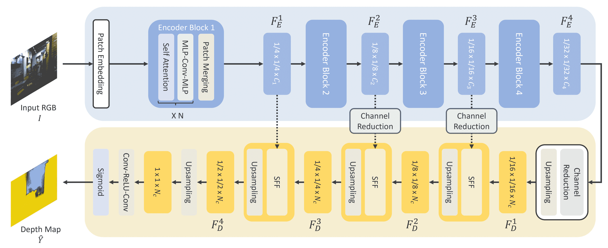

# GLPN

> 原始文本：[`huggingface.co/docs/transformers/v4.37.2/en/model_doc/glpn`](https://huggingface.co/docs/transformers/v4.37.2/en/model_doc/glpn)

这是一个最近推出的模型，因此 API 尚未经过广泛测试。未来可能会有一些错误或轻微的破坏性更改需要修复。如果您发现异常，请提交 [Github Issue](https://github.com/huggingface/transformers/issues/new?assignees=&labels=&template=bug-report.md&title)。

## 概述

GLPN 模型由 Doyeon Kim, Woonghyun Ga, Pyungwhan Ahn, Donggyu Joo, Sehwan Chun, Junmo Kim 在 [Global-Local Path Networks for Monocular Depth Estimation with Vertical CutDepth](https://arxiv.org/abs/2201.07436) 中提出。GLPN 将 SegFormer 的分层混合变压器与轻量级解码器结合，用于单眼深度估计。所提出的解码器显示出比先前提出的解码器更好的性能，且计算复杂度明显较低。

论文摘要如下：

*从单个图像进行深度估计是一个重要的任务，可以应用于计算机视觉的各个领域，并随着卷积神经网络的发展而迅速增长。在本文中，我们提出了一种新颖的结构和训练策略，用于单眼深度估计，以进一步提高网络的预测准确性。我们部署了一个分层变压器编码器来捕获和传达全局上下文，并设计了一个轻量级但功能强大的解码器，以生成估计的深度图，同时考虑局部连接性。通过使用我们提出的选择性特征融合模块在多尺度局部特征和全局解码流之间构建连接路径，网络可以整合两种表示并恢复细节。此外，所提出的解码器显示出比先前提出的解码器更好的性能，且计算复杂度明显较低。此外，我们通过利用深度估计中的一个重要观察结果来改进深度特定的增强方法，以增强模型。我们的网络在具有挑战性的深度数据集 NYU Depth V2 上实现了最先进的性能。已进行了大量实验来验证和展示所提出方法的有效性。最后，我们的模型显示出比其他比较模型更好的泛化能力和鲁棒性。*

 方法概述。摘自 [原始论文](https://arxiv.org/abs/2201.07436)。

此模型由 [nielsr](https://huggingface.co/nielsr) 贡献。原始代码可在 [此处](https://github.com/vinvino02/GLPDepth) 找到。

## 资源

一系列官方 Hugging Face 和社区（由 🌎 表示）资源，可帮助您开始使用 GLPN。

+   GLPNForDepthEstimation 的演示笔记本可以在 [此处](https://github.com/NielsRogge/Transformers-Tutorials/tree/master/GLPN) 找到。

+   单眼深度估计任务指南

## GLPNConfig

### `class transformers.GLPNConfig`

[<来源>](https://github.com/huggingface/transformers/blob/v4.37.2/src/transformers/models/glpn/configuration_glpn.py#L29)

```py
( num_channels = 3 num_encoder_blocks = 4 depths = [2, 2, 2, 2] sr_ratios = [8, 4, 2, 1] hidden_sizes = [32, 64, 160, 256] patch_sizes = [7, 3, 3, 3] strides = [4, 2, 2, 2] num_attention_heads = [1, 2, 5, 8] mlp_ratios = [4, 4, 4, 4] hidden_act = 'gelu' hidden_dropout_prob = 0.0 attention_probs_dropout_prob = 0.0 initializer_range = 0.02 drop_path_rate = 0.1 layer_norm_eps = 1e-06 decoder_hidden_size = 64 max_depth = 10 head_in_index = -1 **kwargs )
```

参数

+   `num_channels` (`int`, *可选*, 默认为 3) — 输入通道数。

+   `num_encoder_blocks` (`int`, *可选*, 默认为 4) — 编码器块的数量（即 Mix Transformer 编码器中的阶段数）。

+   `depths` (`List[int]`, *可选*, 默认为 `[2, 2, 2, 2]`) — 每个编码器块中的层数。

+   `sr_ratios` (`List[int]`, *可选*, 默认为 `[8, 4, 2, 1]`) — 每个编码器块中的序列缩减比率。

+   `hidden_sizes` (`List[int]`, *可选*, 默认为 `[32, 64, 160, 256]`) — 每个编码器块的维度。

+   `patch_sizes` (`List[int]`, *可选*, 默认为 `[7, 3, 3, 3]`) — 每个编码器块之前的补丁大小。

+   `strides` (`List[int]`, *可选*, 默认为 `[4, 2, 2, 2]`) — 每个编码器块之前的步幅。

+   `num_attention_heads` (`List[int]`, *可选*, 默认为 `[1, 2, 5, 8]`) — 每个 Transformer 编码器块中每个注意力层的注意力头数。

+   `mlp_ratios` (`List[int]`, *可选*, 默认为 `[4, 4, 4, 4]`) — 编码器块中 Mix FFN 隐藏层大小与输入层大小的比率。

+   `hidden_act` (`str` 或 `function`, *可选*, 默认为 `"gelu"`) — 编码器和池化器中的非线性激活函数（函数或字符串）。如果是字符串，支持 `"gelu"`, `"relu"`, `"selu"` 和 `"gelu_new"`。

+   `hidden_dropout_prob` (`float`, *可选*, 默认为 0.0) — 嵌入层、编码器和池化器中所有全连接层的丢失概率。

+   `attention_probs_dropout_prob` (`float`, *可选*, 默认为 0.0) — 注意力概率的丢失比率。

+   `initializer_range` (`float`, *可选*, 默认为 0.02) — 用于初始化所有权重矩阵的截断正态初始化器的标准差。

+   `drop_path_rate` (`float`, *可选*, 默认为 0.1) — 用于随机深度的丢失概率，用于 Transformer 编码器块中。

+   `layer_norm_eps` (`float`, *可选*, 默认为 1e-06) — 层归一化层使用的 epsilon。

+   `decoder_hidden_size` (`int`, *可选*, 默认为 64) — 解码器的维度。

+   `max_depth` (`int`, *可选*, 默认为 10) — 解码器的最大深度。

+   `head_in_index` (`int`, *可选*, 默认为 -1) — 用于在头部中使用的特征的索引。

这是用于存储 GLPNModel 配置的配置类。它用于根据指定的参数实例化一个 GLPN 模型，定义模型架构。使用默认值实例化配置将产生类似于 GLPN [vinvino02/glpn-kitti](https://huggingface.co/vinvino02/glpn-kitti) 架构的配置。

配置对象继承自 PretrainedConfig 并可用于控制模型输出。阅读来自 PretrainedConfig 的文档以获取更多信息。

示例:

```py
>>> from transformers import GLPNModel, GLPNConfig

>>> # Initializing a GLPN vinvino02/glpn-kitti style configuration
>>> configuration = GLPNConfig()

>>> # Initializing a model from the vinvino02/glpn-kitti style configuration
>>> model = GLPNModel(configuration)

>>> # Accessing the model configuration
>>> configuration = model.config
```

## GLPNFeatureExtractor

### `class transformers.GLPNFeatureExtractor`

[<来源>](https://github.com/huggingface/transformers/blob/v4.37.2/src/transformers/models/glpn/feature_extraction_glpn.py#L26)

```py
( *args **kwargs )
```

#### `__call__`

[<来源>](https://github.com/huggingface/transformers/blob/v4.37.2/src/transformers/image_processing_utils.py#L550)

```py
( images **kwargs )
```

预处理一张图像或一批图像。

## GLPNImageProcessor

### `class transformers.GLPNImageProcessor`

[<来源>](https://github.com/huggingface/transformers/blob/v4.37.2/src/transformers/models/glpn/image_processing_glpn.py#L40)

```py
( do_resize: bool = True size_divisor: int = 32 resample = <Resampling.BILINEAR: 2> do_rescale: bool = True **kwargs )
```

参数

+   `do_resize` (`bool`, *可选*, 默认为 `True`) — 是否调整图像的（高度，宽度）尺寸，将它们向下舍入到最接近 `size_divisor` 的倍数。可以被 `preprocess` 中的 `do_resize` 覆盖。

+   `size_divisor` (`int`, *可选*, 默认为 32) — 当 `do_resize` 为 `True` 时，图像将被调整大小，使其高度和宽度向下舍入到最接近 `size_divisor` 的倍数。可以被 `preprocess` 中的 `size_divisor` 覆盖。

+   `resample` (`PIL.Image` 重采样滤波器, *可选*, 默认为 `Resampling.BILINEAR`) — 如果调整图像大小，则要使用的重采样滤波器。可以被 `preprocess` 中的 `resample` 覆盖。

+   `do_rescale` (`bool`, *可选*, 默认为 `True`) — 是否应用缩放因子（使像素值在 0 和 1 之间浮动）。可以被 `preprocess` 中的 `do_rescale` 覆盖。

构建一个 GLPN 图像处理器。

#### `preprocess`

[< source >](https://github.com/huggingface/transformers/blob/v4.37.2/src/transformers/models/glpn/image_processing_glpn.py#L124)

```py
( images: Union do_resize: Optional = None size_divisor: Optional = None resample = None do_rescale: Optional = None return_tensors: Union = None data_format: ChannelDimension = <ChannelDimension.FIRST: 'channels_first'> input_data_format: Union = None **kwargs )
```

参数

+   `images`（`PIL.Image.Image` 或 `TensorType` 或 `List[np.ndarray]` 或 `List[TensorType]`）— 要预处理的图像。期望单个或批量图像，像素值范围从 0 到 255。如果传入像素值在 0 到 1 之间的图像，请设置 `do_normalize=False`。

+   `do_resize`（`bool`，*可选*，默认为 `self.do_resize`）— 是否调整输入大小，使得（高度，宽度）维度是 `size_divisor` 的倍数。

+   `size_divisor`（`int`，*可选*，默认为 `self.size_divisor`）— 当 `do_resize` 为 `True` 时，图像被调整大小，使其高度和宽度向下舍入到最接近的 `size_divisor` 的倍数。

+   `resample`（`PIL.Image` 重采样滤波器，*可选*，默认为 `self.resample`）— 如果调整图像大小，则使用的 `PIL.Image` 重采样滤波器，例如 `PILImageResampling.BILINEAR`。仅在 `do_resize` 设置为 `True` 时有效。

+   `do_rescale`（`bool`，*可选*，默认为 `self.do_rescale`）— 是否应用缩放因子（使像素值在 0 到 1 之间）。

+   `return_tensors`（`str` 或 `TensorType`，*可选*）— 要返回的张量类型。可以是以下之一：

    +   `None`: 返回一个 `np.ndarray` 列表。

    +   `TensorType.TENSORFLOW` 或 `'tf'`: 返回类型为 `tf.Tensor` 的批处理。

    +   `TensorType.PYTORCH` 或 `'pt'`: 返回类型为 `torch.Tensor` 的批处理。

    +   `TensorType.NUMPY` 或 `'np'`: 返回类型为 `np.ndarray` 的批处理。

    +   `TensorType.JAX` 或 `'jax'`: 返回类型为 `jax.numpy.ndarray` 的批处理。

+   `data_format`（`ChannelDimension` 或 `str`，*可选*，默认为 `ChannelDimension.FIRST`）— 输出图像的通道维度格式。可以是以下之一：

    +   `ChannelDimension.FIRST`: 图像以（通道数，高度，宽度）格式。

    +   `ChannelDimension.LAST`: 图像以（高度，宽度，通道数）格式。

+   `input_data_format`（`ChannelDimension` 或 `str`，*可选*）— 输入图像的通道维度格式。如果未设置，则从输入图像推断通道维度格式。可以是以下之一：

    +   `"channels_first"` 或 `ChannelDimension.FIRST`: 图像以（通道数，高度，宽度）格式。

    +   `"channels_last"` 或 `ChannelDimension.LAST`: 图像以（高度，宽度，通道数）格式。

    +   `"none"` 或 `ChannelDimension.NONE`: 图像以（高度，宽度）格式。

预处理给定的图像。

## GLPNModel

### `class transformers.GLPNModel`

[< source >](https://github.com/huggingface/transformers/blob/v4.37.2/src/transformers/models/glpn/modeling_glpn.py#L479)

```py
( config )
```

参数

+   `config`（GLPNConfig）— 具有模型所有参数的模型配置类。使用配置文件初始化不会加载与模型关联的权重，只加载配置。查看 from_pretrained() 方法以加载模型权重。

裸的 GLPN 编码器（Mix-Transformer）输出原始隐藏状态，没有特定的顶部头。此模型是 PyTorch [torch.nn.Module](https://pytorch.org/docs/stable/nn.html#torch.nn.Module) 的子类。将其用作常规 PyTorch 模块，并参考 PyTorch 文档以获取有关一般用法和行为的所有相关信息。

#### `forward`

[< source >](https://github.com/huggingface/transformers/blob/v4.37.2/src/transformers/models/glpn/modeling_glpn.py#L503)

```py
( pixel_values: FloatTensor output_attentions: Optional = None output_hidden_states: Optional = None return_dict: Optional = None ) → export const metadata = 'undefined';transformers.modeling_outputs.BaseModelOutput or tuple(torch.FloatTensor)
```

参数

+   `pixel_values`（形状为 `(batch_size, num_channels, height, width)` 的 `torch.FloatTensor`）— 像素值。默认情况下将忽略填充。可以使用 AutoImageProcessor 获取像素值。有关详细信息，请参阅 GLPNImageProcessor.`call`()。

+   `output_attentions`（`bool`，*可选*）— 是否返回所有注意力层的注意力张量。有关更多详细信息，请参阅返回张量下的`attentions`。

+   `output_hidden_states`（`bool`，*可选*）— 是否返回所有层的隐藏状态。有关更多详细信息，请参阅返回张量下的`hidden_states`。

+   `return_dict`（`bool`，*可选*）— 是否返回 ModelOutput 而不是普通元组。

返回

transformers.modeling_outputs.BaseModelOutput 或`tuple(torch.FloatTensor)`

transformers.modeling_outputs.BaseModelOutput 或`torch.FloatTensor`元组（如果传递`return_dict=False`或`config.return_dict=False`时）包含根据配置（GLPNConfig）和输入的不同元素。

+   `last_hidden_state`（形状为`(batch_size, sequence_length, hidden_size)`的`torch.FloatTensor`）— 模型最后一层的隐藏状态序列。

+   `hidden_states`（`tuple(torch.FloatTensor)`，*可选*，当传递`output_hidden_states=True`或`config.output_hidden_states=True`时返回）— 形状为`(batch_size, sequence_length, hidden_size)`的`torch.FloatTensor`元组（如果模型具有嵌入层，则为嵌入输出的一个+每个层的输出一个）。

    模型在每个层的输出处的隐藏状态加上可选的初始嵌入输出。

+   `attentions`（`tuple(torch.FloatTensor)`，*可选*，当传递`output_attentions=True`或`config.output_attentions=True`时返回）— 形状为`(batch_size, num_heads, sequence_length, sequence_length)`的`torch.FloatTensor`元组（每层一个）。

    注意力 softmax 后的注意力权重，用于计算自注意力头中的加权平均值。

GLPNModel 的前向方法，覆盖`__call__`特殊方法。

虽然前向传递的方法需要在此函数内定义，但应该在之后调用`Module`实例，而不是这个，因为前者负责运行预处理和后处理步骤，而后者会默默地忽略它们。

示例：

```py
>>> from transformers import AutoImageProcessor, GLPNModel
>>> import torch
>>> from datasets import load_dataset

>>> dataset = load_dataset("huggingface/cats-image")
>>> image = dataset["test"]["image"][0]

>>> image_processor = AutoImageProcessor.from_pretrained("vinvino02/glpn-kitti")
>>> model = GLPNModel.from_pretrained("vinvino02/glpn-kitti")

>>> inputs = image_processor(image, return_tensors="pt")

>>> with torch.no_grad():
...     outputs = model(**inputs)

>>> last_hidden_states = outputs.last_hidden_state
>>> list(last_hidden_states.shape)
[1, 512, 15, 20]
```

## GLPNForDepthEstimation

### `class transformers.GLPNForDepthEstimation`

[<来源>](https://github.com/huggingface/transformers/blob/v4.37.2/src/transformers/models/glpn/modeling_glpn.py#L680)

```py
( config )
```

参数

+   `config`（GLPNConfig）— 具有模型所有参数的模型配置类。使用配置文件初始化不会加载与模型相关的权重，只加载配置。查看 from_pretrained()方法以加载模型权重。

GLPN 模型变换器，顶部带有轻量级深度估计头，例如适用于 KITTI、NYUv2。此模型是 PyTorch [torch.nn.Module](https://pytorch.org/docs/stable/nn.html#torch.nn.Module)子类。将其用作常规 PyTorch 模块，并参考 PyTorch 文档以获取与一般用法和行为相关的所有内容。

前进

[<来源>](https://github.com/huggingface/transformers/blob/v4.37.2/src/transformers/models/glpn/modeling_glpn.py#L695)

```py
( pixel_values: FloatTensor labels: Optional = None output_attentions: Optional = None output_hidden_states: Optional = None return_dict: Optional = None ) → export const metadata = 'undefined';transformers.modeling_outputs.DepthEstimatorOutput or tuple(torch.FloatTensor)
```

参数

+   `pixel_values`（形状为`(batch_size, num_channels, height, width)`的`torch.FloatTensor`）- 像素值。默认情况下将忽略填充。可以使用 AutoImageProcessor 获取像素值。有关详细信息，请参阅 GLPNImageProcessor.`call`()。

+   `output_attentions`（*可选*，布尔值）- 是否返回所有注意力层的注意力张量。有关更多详细信息，请参阅返回张量中的`attentions`。

+   `output_hidden_states`（*可选*，布尔值）- 是否返回所有层的隐藏状态。有关更多详细信息，请参阅返回张量中的`hidden_states`。

+   `return_dict`（*可选*，布尔值）- 是否返回 ModelOutput 而不是普通元组。

+   `labels`（形状为`(batch_size, height, width)`的`torch.FloatTensor`，*可选*）- 用于计算损失的地面真实深度估计图。

返回

transformers.modeling_outputs.DepthEstimatorOutput 或`tuple(torch.FloatTensor)`

一个 transformers.modeling_outputs.DepthEstimatorOutput 或一个`torch.FloatTensor`元组（如果传递了`return_dict=False`或当`config.return_dict=False`时），包括根据配置（GLPNConfig）和输入的不同元素。

+   `loss`（形状为`(1,)`的`torch.FloatTensor`，*可选*，当提供`labels`时返回）- 分类（如果 config.num_labels==1 则为回归）损失。

+   `predicted_depth`（形状为`(batch_size, height, width)`的`torch.FloatTensor`）- 每个像素的预测深度。

+   `hidden_states`（*可选*，当传递`output_hidden_states=True`或当`config.output_hidden_states=True`时返回）- 形状为`(batch_size, num_channels, height, width)`的`torch.FloatTensor`元组（如果模型有嵌入层，则为嵌入的输出+每层的输出）。

    模型在每一层输出处的隐藏状态以及可选的初始嵌入输出。

+   `attentions`（*可选*，当传递`output_attentions=True`或当`config.output_attentions=True`时返回）- 形状为`(batch_size, num_heads, patch_size, sequence_length)`的`torch.FloatTensor`元组（每层一个）。

    注意力 softmax 后的注意力权重，用于计算自注意力头中的加权平均值。

GLPNForDepthEstimation 的前向方法，覆盖了`__call__`特殊方法。

尽管前向传递的步骤需要在此函数内定义，但应该在此之后调用`Module`实例，而不是在此处调用，因为前者会负责运行预处理和后处理步骤，而后者会默默地忽略它们。

示例：

```py
>>> from transformers import AutoImageProcessor, GLPNForDepthEstimation
>>> import torch
>>> import numpy as np
>>> from PIL import Image
>>> import requests

>>> url = "http://images.cocodataset.org/val2017/000000039769.jpg"
>>> image = Image.open(requests.get(url, stream=True).raw)

>>> image_processor = AutoImageProcessor.from_pretrained("vinvino02/glpn-kitti")
>>> model = GLPNForDepthEstimation.from_pretrained("vinvino02/glpn-kitti")

>>> # prepare image for the model
>>> inputs = image_processor(images=image, return_tensors="pt")

>>> with torch.no_grad():
...     outputs = model(**inputs)
...     predicted_depth = outputs.predicted_depth

>>> # interpolate to original size
>>> prediction = torch.nn.functional.interpolate(
...     predicted_depth.unsqueeze(1),
...     size=image.size[::-1],
...     mode="bicubic",
...     align_corners=False,
... )

>>> # visualize the prediction
>>> output = prediction.squeeze().cpu().numpy()
>>> formatted = (output * 255 / np.max(output)).astype("uint8")
>>> depth = Image.fromarray(formatted)
```
