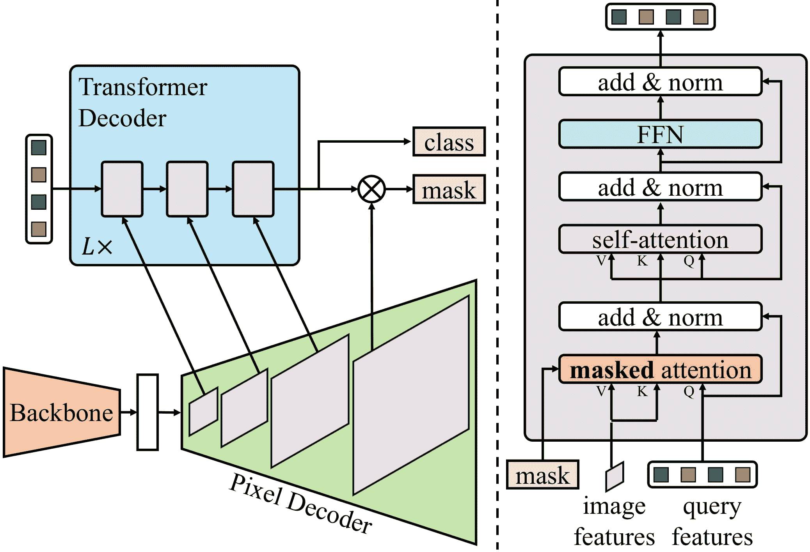

# Mask2Former

> 原文链接：[`huggingface.co/docs/transformers/v4.37.2/en/model_doc/mask2former`](https://huggingface.co/docs/transformers/v4.37.2/en/model_doc/mask2former)

## 概览

Mask2Former 模型是由 Bowen Cheng、Ishan Misra、Alexander G. Schwing、Alexander Kirillov、Rohit Girdhar 在[Masked-attention Mask Transformer for Universal Image Segmentation](https://arxiv.org/abs/2112.01527)中提出的。Mask2Former 是一个统一的全景、实例和语义分割框架，相比于 MaskFormer 具有显著的性能和效率改进。

来自论文的摘要如下：

*图像分割将具有不同语义的像素分组，例如类别或实例成员资格。每种语义选择定义了一个任务。虽然每个任务的语义不同，但当前的研究重点是为每个任务设计专门的架构。我们提出了 Masked-attention Mask Transformer（Mask2Former），这是一种新的架构，能够处理任何图像分割任务（全景、实例或语义）。其关键组件包括掩码注意力，通过限制在预测掩码区域内的交叉注意力来提取局部特征。除了将研究工作量至少减少三倍外，它在四个流行数据集上的表现明显优于最佳专门架构。值得注意的是，Mask2Former 在全景分割（COCO 上的 57.8 PQ）、实例分割（COCO 上的 50.1 AP）和语义分割（ADE20K 上的 57.7 mIoU）方面取得了新的最先进水平。*

 Mask2Former 架构。取自[原始论文](https://arxiv.org/abs/2112.01527)。

这个模型由[Shivalika Singh](https://huggingface.co/shivi)和[Alara Dirik](https://huggingface.co/adirik)贡献。原始代码可以在[这里](https://github.com/facebookresearch/Mask2Former)找到。

## 使用提示

+   Mask2Former 使用与 MaskFormer 相同的预处理和后处理步骤。使用 Mask2FormerImageProcessor 或 AutoImageProcessor 来为模型准备图像和可选目标。

+   要获得最终的分割结果，取决于任务，您可以调用 post_process_semantic_segmentation()或 post_process_instance_segmentation()或 post_process_panoptic_segmentation()。所有这三个任务都可以使用 Mask2FormerForUniversalSegmentation 的输出来解决，全景分割接受一个可选的`label_ids_to_fuse`参数，以将目标对象（例如天空）的实例合并在一起。

## 资源

一系列官方 Hugging Face 和社区（由🌎表示）资源，可帮助您开始使用 Mask2Former。

+   关于在自定义数据上进行推理+微调 Mask2Former 的演示笔记本可以在[这里](https://github.com/NielsRogge/Transformers-Tutorials/tree/master/Mask2Former)找到。

如果您有兴趣提交资源以包含在这里，请随时打开一个 Pull Request，我们将进行审核。资源应该理想地展示一些新东西，而不是重复现有资源。

## Mask2FormerConfig

### `class transformers.Mask2FormerConfig`

[<来源>](https://github.com/huggingface/transformers/blob/v4.37.2/src/transformers/models/mask2former/configuration_mask2former.py#L33)

```py
( backbone_config: Optional = None feature_size: int = 256 mask_feature_size: int = 256 hidden_dim: int = 256 encoder_feedforward_dim: int = 1024 activation_function: str = 'relu' encoder_layers: int = 6 decoder_layers: int = 10 num_attention_heads: int = 8 dropout: float = 0.0 dim_feedforward: int = 2048 pre_norm: bool = False enforce_input_projection: bool = False common_stride: int = 4 ignore_value: int = 255 num_queries: int = 100 no_object_weight: float = 0.1 class_weight: float = 2.0 mask_weight: float = 5.0 dice_weight: float = 5.0 train_num_points: int = 12544 oversample_ratio: float = 3.0 importance_sample_ratio: float = 0.75 init_std: float = 0.02 init_xavier_std: float = 1.0 use_auxiliary_loss: bool = True feature_strides: List = [4, 8, 16, 32] output_auxiliary_logits: bool = None **kwargs )
```

参数

+   `backbone_config` (`PretrainedConfig` or `dict`, *optional*, defaults to `SwinConfig()`) — 主干模型的配置。如果未设置，将使用与`swin-base-patch4-window12-384`对应的配置。

+   `feature_size` (`int`, *optional*, defaults to 256) — 结果特征图的特征（通道）。

+   `mask_feature_size` (`int`, *optional*, defaults to 256) — 掩码的特征大小，此值还将用于指定特征金字塔网络特征的大小。

+   `hidden_dim` (`int`, *optional*, defaults to 256) — 编码器层的维度。

+   `encoder_feedforward_dim` (`int`, *optional*, defaults to 1024) — 用作像素解码器一部分的可变形 detr 编码器的前馈网络维度。

+   `encoder_layers` (`int`, *optional*, defaults to 6) — 用作像素解码器一部分的可变形 detr 编码器中的层数。

+   `decoder_layers` (`int`, *optional*, defaults to 10) — 变压器解码器中的层数。

+   `num_attention_heads` (`int`, *optional*, defaults to 8) — 每个注意力层的注意力头数。

+   `dropout` (`float`, *optional*, defaults to 0.1) — 嵌入层、编码器中所有全连接层的丢失概率。

+   `dim_feedforward` (`int`, *optional*, defaults to 2048) — 变压器解码器中前馈网络的特征维度。

+   `pre_norm` (`bool`, *optional*, defaults to `False`) — 是否在变压器解码器中使用预 LayerNorm。

+   `enforce_input_projection` (`bool`, *optional*, defaults to `False`) — 是否在 Transformer 解码器中添加一个输入投影 1x1 卷积，即使输入通道和隐藏维度相同。

+   `common_stride` (`int`, *optional*, defaults to 4) — 用于确定作为像素解码器一部分使用的 FPN 级别数的参数。

+   `ignore_value` (`int`, *optional*, defaults to 255) — 训练过程中要忽略的类别 ID。

+   `num_queries` (`int`, *optional*, defaults to 100) — 解码器的查询次数。

+   `no_object_weight` (`int`, *optional*, defaults to 0.1) — 用于空（无对象）类的权重。

+   `class_weight` (`int`, *optional*, defaults to 2.0) — 交叉熵损失的权重。

+   `mask_weight` (`int`, *optional*, defaults to 5.0) — 掩码损失的权重。

+   `dice_weight` (`int`, *optional*, defaults to 5.0) — dice 损失的权重。

+   `train_num_points` (`str` or `function`, *optional*, defaults to 12544) — 在损失计算过程中用于采样的点数。

+   `oversample_ratio` (`float`, *optional*, defaults to 3.0) — 用于计算采样点数的过采样参数。

+   `importance_sample_ratio` (`float`, *optional*, defaults to 0.75) — 通过重要性采样抽样的点比例。

+   `init_std` (`float`, *optional*, defaults to 0.02) — 用于初始化所有权重矩阵的截断正态初始化器的标准差。

+   `init_xavier_std` (`float`, *optional*, defaults to 1.0) — 用于 HM 注意力图模块中 Xavier 初始化增益的缩放因子。

+   `use_auxiliary_loss` (`boolean``, *optional*, defaults to` True`) -- 如果`True`，`Mask2FormerForUniversalSegmentationOutput`将包含使用每个解码器阶段的 logits 计算的辅助损失。

+   `feature_strides` (`List[int]`, *optional*, defaults to `[4, 8, 16, 32]`) — 与主干网络生成的特征对应的特征步幅。

+   `output_auxiliary_logits` (`bool`, *optional*) — 模型是否输出其`auxiliary_logits`。

这是一个配置类，用于存储 Mask2FormerModel 的配置。根据指定的参数实例化一个 Mask2Former 模型，定义模型架构。使用默认值实例化配置将产生类似于 Mask2Former [facebook/mask2former-swin-small-coco-instance](https://huggingface.co/facebook/mask2former-swin-small-coco-instance)架构的配置。

配置对象继承自 PretrainedConfig，可用于控制模型输出。阅读 PretrainedConfig 的文档以获取更多信息。

目前，Mask2Former 仅支持 Swin Transformer 作为骨干网络。

示例：

```py
>>> from transformers import Mask2FormerConfig, Mask2FormerModel

>>> # Initializing a Mask2Former facebook/mask2former-swin-small-coco-instance configuration
>>> configuration = Mask2FormerConfig()

>>> # Initializing a model (with random weights) from the facebook/mask2former-swin-small-coco-instance style configuration
>>> model = Mask2FormerModel(configuration)

>>> # Accessing the model configuration
>>> configuration = model.config
```

#### `from_backbone_config`

[<来源>](https://github.com/huggingface/transformers/blob/v4.37.2/src/transformers/models/mask2former/configuration_mask2former.py#L218)

```py
( backbone_config: PretrainedConfig **kwargs ) → export const metadata = 'undefined';Mask2FormerConfig
```

参数

+   `backbone_config`（PretrainedConfig） — 骨干配置。

返回

Mask2FormerConfig

一个配置对象的实例

从预训练的骨干模型配置实例化一个 Mask2FormerConfig（或派生类）。

## MaskFormer 特定输出

### `class transformers.models.mask2former.modeling_mask2former.Mask2FormerModelOutput`

[<来源>](https://github.com/huggingface/transformers/blob/v4.37.2/src/transformers/models/mask2former/modeling_mask2former.py#L145)

```py
( encoder_last_hidden_state: FloatTensor = None pixel_decoder_last_hidden_state: FloatTensor = None transformer_decoder_last_hidden_state: FloatTensor = None encoder_hidden_states: Optional = None pixel_decoder_hidden_states: Optional = None transformer_decoder_hidden_states: Optional = None transformer_decoder_intermediate_states: Tuple = None masks_queries_logits: Tuple = None attentions: Optional = None )
```

参数

+   `encoder_last_hidden_state` (`torch.FloatTensor`，形状为`(batch_size, num_channels, height, width)`，*optional*) — 编码器模型（骨干）最后阶段的最后隐藏状态（最终特征图）。当传递`output_hidden_states=True`时返回。

+   `encoder_hidden_states` (`tuple(torch.FloatTensor)`, *optional*) — 编码器模型在每个阶段输出的隐藏状态（也称为特征图）的元组，形状为`(batch_size, num_channels, height, width)`。当传递`output_hidden_states=True`时返回。

+   `pixel_decoder_last_hidden_state` (`torch.FloatTensor`，形状为`(batch_size, num_channels, height, width)`，*optional*) — 像素解码器模型最后阶段的最后隐藏状态（最终特征图）。

+   `pixel_decoder_hidden_states` (`tuple(torch.FloatTensor)`, *optional*, 当传递`output_hidden_states=True`或`config.output_hidden_states=True`时返回) — 像素解码器模型在每个阶段输出的隐藏状态（也称为特征图）的元组，形状为`(batch_size, num_channels, height, width)`。当传递`output_hidden_states=True`时返回。

+   `transformer_decoder_last_hidden_state` (`tuple(torch.FloatTensor)`) — 变压器解码器的最终输出`(batch_size, sequence_length, hidden_size)`。

+   `transformer_decoder_hidden_states` (`tuple(torch.FloatTensor)`, *optional*) — 变压器解码器在每个阶段输出的隐藏状态（也称为特征图）的元组，形状为`(batch_size, sequence_length, hidden_size)`。当传递`output_hidden_states=True`时返回。

+   `transformer_decoder_intermediate_states` (`tuple(torch.FloatTensor)`，形状为`(num_queries, 1, hidden_size)`) — 中间解码器激活，即每个解码器层的输出，每个都经过了 layernorm。

+   `masks_queries_logits` (`tuple(torch.FloatTensor)`，形状为`(batch_size, num_queries, height, width)`) — transformer 解码器中每层的掩码预测。

+   `attentions` (`tuple(tuple(torch.FloatTensor))`，*可选*，当传递`output_attentions=True`时返回) — 形状为`(batch_size, num_heads, sequence_length, sequence_length)`的元组的元组。transformer 解码器的自注意力权重。

用于 Mask2FormerModel 的输出类。该类返回计算 logits 所需的所有隐藏状态。

### `class transformers.models.mask2former.modeling_mask2former.Mask2FormerForUniversalSegmentationOutput`

[< source >](https://github.com/huggingface/transformers/blob/v4.37.2/src/transformers/models/mask2former/modeling_mask2former.py#L191)

```py
( loss: Optional = None class_queries_logits: FloatTensor = None masks_queries_logits: FloatTensor = None auxiliary_logits: Optional = None encoder_last_hidden_state: FloatTensor = None pixel_decoder_last_hidden_state: FloatTensor = None transformer_decoder_last_hidden_state: FloatTensor = None encoder_hidden_states: Optional = None pixel_decoder_hidden_states: Optional = None transformer_decoder_hidden_states: Optional = None attentions: Optional = None )
```

参数

+   `loss` (`torch.Tensor`，*可选*) — 计算得到的损失，在存在标签时返回。

+   `class_queries_logits` (`torch.FloatTensor`) — 一个形状为`(batch_size, num_queries, num_labels + 1)`的张量，表示每个查询的提议类别。请注意，`+ 1`是因为我们包含了空类别。

+   `masks_queries_logits` (`torch.FloatTensor`) — 一个形状为`(batch_size, num_queries, height, width)`的张量，表示每个查询的提议掩码。

+   `auxiliary_logits` (`List[Dict(str, torch.FloatTensor)]`，*可选*) — transformer 解码器每层的类别和掩码预测的列表。

+   `encoder_last_hidden_state` (`torch.FloatTensor`，形状为`(batch_size, num_channels, height, width)`) — 编码器模型（骨干）最后阶段的最后隐藏状态（最终特征图）。

+   `encoder_hidden_states` (`tuple(torch.FloatTensor)`，*可选*，当传递`output_hidden_states=True`或`config.output_hidden_states=True`时返回) — 形状为`(batch_size, num_channels, height, width)`的元组的`torch.FloatTensor`（一个用于嵌入的输出 + 一个用于每个阶段的输出）。编码器模型在每个阶段输出的隐藏状态（也称为特征图）。

+   `pixel_decoder_last_hidden_state` (`torch.FloatTensor`，形状为`(batch_size, num_channels, height, width)`) — 像素解码器模型最后阶段的最后隐藏状态（最终特征图）。

+   `pixel_decoder_hidden_states` (`tuple(torch.FloatTensor)`，*可选*，当传递`output_hidden_states=True`或`config.output_hidden_states=True`时返回) — 形状为`(batch_size, num_channels, height, width)`的元组的`torch.FloatTensor`（一个用于嵌入的输出 + 一个用于每个阶段的输出）。像素解码器模型在每个阶段输出的隐藏状态（也称为特征图）。

+   `transformer_decoder_last_hidden_state` (`tuple(torch.FloatTensor)`) — transformer 解码器的最终输出`(batch_size, sequence_length, hidden_size)`。

+   `transformer_decoder_hidden_states` (`tuple(torch.FloatTensor)`，*可选*，当传递`output_hidden_states=True`或`config.output_hidden_states=True`时返回) — 形状为`(batch_size, sequence_length, hidden_size)`的元组的`torch.FloatTensor`（一个用于嵌入的输出 + 一个用于每个阶段的输出）。transformer 解码器在每个阶段输出的隐藏状态（也称为特征图）。

+   `attentions` (`tuple(tuple(torch.FloatTensor))`, *可选*, 当传递`output_attentions=True`或`config.output_attentions=True`时返回) — 形状为`(batch_size, num_heads, sequence_length, sequence_length)`的元组的元组。来自 transformer 解码器的自注意力和交叉注意力权重。

`Mask2FormerForUniversalSegmentationOutput`的输出类。

这个输出可以直接传递给 post_process_semantic_segmentation()或 post_process_instance_segmentation()或 post_process_panoptic_segmentation()来计算最终的分割地图。请参阅[`~Mask2FormerImageProcessor]以获取有关用法的详细信息。

## Mask2FormerModel

### `class transformers.Mask2FormerModel`

[<来源>](https://github.com/huggingface/transformers/blob/v4.37.2/src/transformers/models/mask2former/modeling_mask2former.py#L2189)

```py
( config: Mask2FormerConfig )
```

参数

+   `config`（Mask2FormerConfig）— 具有模型所有参数的模型配置类。使用配置文件初始化不会加载与模型相关的权重，只加载配置。查看 from_pretrained()方法以加载模型权重。

裸的 Mask2Former 模型输出原始隐藏状态，没有特定的头部。这个模型是 PyTorch [torch.nn.Module](https://pytorch.org/docs/stable/nn.html#torch.nn.Module)子类。将其用作常规 PyTorch 模块，并参考 PyTorch 文档以获取有关一般用法和行为的所有相关信息。

#### `forward`

[<来源>](https://github.com/huggingface/transformers/blob/v4.37.2/src/transformers/models/mask2former/modeling_mask2former.py#L2203)

```py
( pixel_values: Tensor pixel_mask: Optional = None output_hidden_states: Optional = None output_attentions: Optional = None return_dict: Optional = None ) → export const metadata = 'undefined';transformers.models.mask2former.modeling_mask2former.Mask2FormerModelOutput or tuple(torch.FloatTensor)
```

参数

+   `pixel_values`（`torch.FloatTensor`，形状为`(batch_size, num_channels, height, width)`）— 像素值。像素值可以使用 AutoImageProcessor 获取。有关详细信息，请参阅`AutoImageProcessor.preprocess`。

+   `pixel_mask`（形状为`(batch_size, height, width)`的`torch.LongTensor`，*可选*）— 用于避免在填充像素值上执行注意力的掩码。掩码值选择在`[0, 1]`中：

    +   1 表示真实像素（即`未掩码`），

    +   0 表示填充像素（即`掩码`）。

    什么是注意力掩码？

+   `output_hidden_states`（`bool`，*可选*）— 是否返回所有层的隐藏状态。有关更多详细信息，请参阅返回张量下的`hidden_states`。

+   `output_attentions`（`bool`，*可选*）— 是否返回 Detr 解码器注意力层的注意力张量。

+   `return_dict`（`bool`，*可选*）— 是否返回`~Mask2FormerModelOutput`而不是普通元组。

返回

transformers.models.mask2former.modeling_mask2former.Mask2FormerModelOutput 或`tuple(torch.FloatTensor)`

一个 transformers.models.mask2former.modeling_mask2former.Mask2FormerModelOutput 或一个`torch.FloatTensor`元组（如果传递`return_dict=False`或当`config.return_dict=False`时）包含根据配置（Mask2FormerConfig）和输入的各种元素。

+   `encoder_last_hidden_state`（形状为`(batch_size, num_channels, height, width)`的`torch.FloatTensor`，*可选*）— 编码器模型（骨干）最后阶段的最后隐藏状态（最终特征图）。当传递`output_hidden_states=True`时返回。

+   `encoder_hidden_states`（`tuple(torch.FloatTensor)`，*可选*）— 形状为`(batch_size, num_channels, height, width)`的`torch.FloatTensor`元组（一个用于嵌入的输出 + 一个用于每个阶段的输出）。编码器模型在每个阶段输出的隐藏状态（也称为特征图）。当传递`output_hidden_states=True`时返回。

+   `pixel_decoder_last_hidden_state`（形状为`(batch_size, num_channels, height, width)`的`torch.FloatTensor`，*可选*）— 像素解码器模型最后阶段的最后隐藏状态（最终特征图）。

+   `pixel_decoder_hidden_states`（`tuple(torch.FloatTensor)`，*可选*，当传递`output_hidden_states=True`或`config.output_hidden_states=True`时返回）— 形状为`(batch_size, num_channels, height, width)`的`torch.FloatTensor`元组（一个用于嵌入的输出 + 一个用于每个阶段的输出）。像素解码器模型在每个阶段输出的隐藏状态（也称为特征图）。当传递`output_hidden_states=True`时返回。

+   `transformer_decoder_last_hidden_state`（`tuple(torch.FloatTensor)`）— 变压器解码器的最终输出`(batch_size, sequence_length, hidden_size)`。

+   `transformer_decoder_hidden_states`（`tuple(torch.FloatTensor)`，*可选*）— 形状为`(batch_size, sequence_length, hidden_size)`的`torch.FloatTensor`元组（一个用于嵌入的输出 + 一个用于每个阶段的输出）。变压器解码器在每个阶段输出的隐藏状态（也称为特征图）。当传递`output_hidden_states=True`时返回。

+   `transformer_decoder_intermediate_states`（形状为`(num_queries, 1, hidden_size)`的`tuple(torch.FloatTensor)`) — 中间解码器激活，即每个解码器层的输出，每个都经过了一个 layernorm。

+   `masks_queries_logits`（形状为`(batch_size, num_queries, height, width)`的`tuple(torch.FloatTensor)`) — 变压器解码器中每个层的掩码预测。

+   `attentions`（`tuple(tuple(torch.FloatTensor))`，*可选*，当传递`output_attentions=True`时返回）— 形状为`(batch_size, num_heads, sequence_length, sequence_length)`的`tuple(torch.FloatTensor)`元组（每个层一个）。来自变压器解码器的自注意权重。

`Mask2FormerModelOutput`

Mask2FormerModel 的前向方法，覆盖了`__call__`特殊方法。

虽然前向传递的步骤需要在这个函数内定义，但应该在此之后调用`Module`实例，而不是在此处调用，因为前者负责运行预处理和后处理步骤，而后者会默默地忽略它们。

示例：

```py
>>> import torch
>>> from PIL import Image
>>> import requests
>>> from transformers import AutoImageProcessor, Mask2FormerModel

>>> # load image
>>> url = "http://images.cocodataset.org/val2017/000000039769.jpg"
>>> image = Image.open(requests.get(url, stream=True).raw)

>>> # load image preprocessor and Mask2FormerModel trained on COCO instance segmentation dataset
>>> image_processor = AutoImageProcessor.from_pretrained("facebook/mask2former-swin-small-coco-instance")
>>> model = Mask2FormerModel.from_pretrained("facebook/mask2former-swin-small-coco-instance")
>>> inputs = image_processor(image, return_tensors="pt")

>>> # forward pass
>>> with torch.no_grad():
...     outputs = model(**inputs)

>>> # model outputs last hidden states of shape (batch_size, num_queries, hidden_size)
>>> print(outputs.transformer_decoder_last_hidden_state.shape)
torch.Size([1, 100, 256])
```

## Mask2FormerForUniversalSegmentation

### `class transformers.Mask2FormerForUniversalSegmentation`

[<来源>](https://github.com/huggingface/transformers/blob/v4.37.2/src/transformers/models/mask2former/modeling_mask2former.py#L2293)

```py
( config: Mask2FormerConfig )
```

参数

+   `config`（Mask2FormerConfig）— 具有模型所有参数的模型配置类。使用配置文件初始化不会加载与模型相关的权重，只加载配置。查看 from_pretrained()方法以加载模型权重。

Mask2Former 模型在顶部具有用于实例/语义/全景分割的头。这个模型是 PyTorch 的[torch.nn.Module](https://pytorch.org/docs/stable/nn.html#torch.nn.Module)子类。将其用作常规的 PyTorch 模块，并参考 PyTorch 文档以获取与一般用法和行为相关的所有内容。

#### `forward`

[<来源>](https://github.com/huggingface/transformers/blob/v4.37.2/src/transformers/models/mask2former/modeling_mask2former.py#L2350)

```py
( pixel_values: Tensor mask_labels: Optional = None class_labels: Optional = None pixel_mask: Optional = None output_hidden_states: Optional = None output_auxiliary_logits: Optional = None output_attentions: Optional = None return_dict: Optional = None ) → export const metadata = 'undefined';transformers.models.mask2former.modeling_mask2former.Mask2FormerForUniversalSegmentationOutput or tuple(torch.FloatTensor)
```

参数

+   `pixel_values` (`torch.FloatTensor`，形状为`(batch_size, num_channels, height, width)`) — 像素值。可以使用 AutoImageProcessor 获取像素值。有关详细信息，请参阅`AutoImageProcessor.preprocess`。

+   `pixel_mask` (`torch.LongTensor`，形状为`(batch_size, height, width)`，*optional*) — 避免在填充像素值上执行注意力的掩码。选择的掩码值在`[0, 1]`中：

    +   对于真实像素为 1（即`not masked`），

    +   对于填充像素为 0（即`masked`）。

    什么是注意力掩码？

+   `output_hidden_states` (`bool`, *optional*) — 是否返回所有层的隐藏状态。有关更多详细信息，请参阅返回张量下的`hidden_states`。

+   `output_attentions` (`bool`, *optional*) — 是否返回 Detr 解码器注意力层的注意力张量。

+   `return_dict` (`bool`, *optional*) — 是否返回`~Mask2FormerModelOutput`而不是普通元组。

+   `mask_labels` (`List[torch.Tensor]`, *optional*) — 形状为`(num_labels, height, width)`的掩码标签列表，用于馈送到模型。

+   `class_labels` (`List[torch.LongTensor]`, *optional*) — 形状为`(num_labels, height, width)`的目标类别标签列表，用于馈送到模型。它们标识`mask_labels`的标签，例如，如果`class_labels[i][j]`的标签是`mask_labels[i][j]`。 

返回

transformers.models.mask2former.modeling_mask2former.Mask2FormerForUniversalSegmentationOutput 或`tuple(torch.FloatTensor)`

一个 transformers.models.mask2former.modeling_mask2former.Mask2FormerForUniversalSegmentationOutput 或一个`torch.FloatTensor`元组（如果传递了`return_dict=False`或`config.return_dict=False`时）包含各种元素，这取决于配置（Mask2FormerConfig）和输入。

+   `loss` (`torch.Tensor`, *optional*) — 计算的损失，在存在标签时返回。

+   `class_queries_logits` (`torch.FloatTensor`) — 形状为`(batch_size, num_queries, num_labels + 1)`的张量，表示每个查询的提议类别。请注意，`+ 1`是因为我们包含了空类。

+   `masks_queries_logits` (`torch.FloatTensor`) — 形状为`(batch_size, num_queries, height, width)`的张量，表示每个查询的提议掩码。

+   `auxiliary_logits` (`List[Dict(str, torch.FloatTensor)]`, *optional*) — 来自变压器解码器每一层的类别和掩码预测的列表。

+   `encoder_last_hidden_state` (`torch.FloatTensor`，形状为`(batch_size, num_channels, height, width)`) — 编码器模型（骨干）最后一个阶段的最后隐藏状态（最终特征图）。

+   `encoder_hidden_states` (`tuple(torch.FloatTensor)`, *optional*, 当传递`output_hidden_states=True`或`config.output_hidden_states=True`时返回) — 形状为`(batch_size, num_channels, height, width)`的`torch.FloatTensor`元组。编码器模型在每个阶段输出的隐藏状态（也称为特征图）。

+   `pixel_decoder_last_hidden_state` (`torch.FloatTensor`，形状为`(batch_size, num_channels, height, width)`) — 像素解码器模型最后一个阶段的最后隐藏状态（最终特征图）。

+   `pixel_decoder_hidden_states` (`tuple(torch.FloatTensor)`, *可选*，当传递 `output_hidden_states=True` 或 `config.output_hidden_states=True` 时返回) — 形状为 `(batch_size, num_channels, height, width)` 的 `torch.FloatTensor` 元组。像素解码器模型在每个阶段输出的隐藏状态（也称为特征图）。

+   `transformer_decoder_last_hidden_state` (`tuple(torch.FloatTensor)`) — 变换器解码器的最终输出 `(batch_size, sequence_length, hidden_size)`。

+   `transformer_decoder_hidden_states` (`tuple(torch.FloatTensor)`, *可选*，当传递 `output_hidden_states=True` 或 `config.output_hidden_states=True` 时返回) — 形状为 `(batch_size, sequence_length, hidden_size)` 的 `torch.FloatTensor` 元组。变换器解码器在每个阶段输出的隐藏状态（也称为特征图）。

+   `attentions` (`tuple(tuple(torch.FloatTensor))`, *可选*，当传递 `output_attentions=True` 或 `config.output_attentions=True` 时返回) — 形状为 `(batch_size, num_heads, sequence_length, sequence_length)` 的 `tuple(torch.FloatTensor)` 元组。变换器解码器的自注意力和交叉注意力权重。

`Mask2FormerUniversalSegmentationOutput`

Mask2FormerForUniversalSegmentation 的前向方法，覆盖 `__call__` 特殊方法。

虽然前向传递的步骤需要在此函数内定义，但应该在此之后调用 `Module` 实例，而不是在此处调用，因为前者负责运行预处理和后处理步骤，而后者会默默地忽略它们。

示例：

实例分割示例：

```py
>>> from transformers import AutoImageProcessor, Mask2FormerForUniversalSegmentation
>>> from PIL import Image
>>> import requests
>>> import torch

>>> # Load Mask2Former trained on COCO instance segmentation dataset
>>> image_processor = AutoImageProcessor.from_pretrained("facebook/mask2former-swin-small-coco-instance")
>>> model = Mask2FormerForUniversalSegmentation.from_pretrained(
...     "facebook/mask2former-swin-small-coco-instance"
... )

>>> url = "http://images.cocodataset.org/val2017/000000039769.jpg"
>>> image = Image.open(requests.get(url, stream=True).raw)
>>> inputs = image_processor(image, return_tensors="pt")

>>> with torch.no_grad():
...     outputs = model(**inputs)

>>> # Model predicts class_queries_logits of shape `(batch_size, num_queries)`
>>> # and masks_queries_logits of shape `(batch_size, num_queries, height, width)`
>>> class_queries_logits = outputs.class_queries_logits
>>> masks_queries_logits = outputs.masks_queries_logits

>>> # Perform post-processing to get instance segmentation map
>>> pred_instance_map = image_processor.post_process_semantic_segmentation(
...     outputs, target_sizes=[image.size[::-1]]
... )[0]
>>> print(pred_instance_map.shape)
torch.Size([480, 640])
```

语义分割示例：

```py
>>> from transformers import AutoImageProcessor, Mask2FormerForUniversalSegmentation
>>> from PIL import Image
>>> import requests
>>> import torch

>>> # Load Mask2Former trained on ADE20k semantic segmentation dataset
>>> image_processor = AutoImageProcessor.from_pretrained("facebook/mask2former-swin-small-ade-semantic")
>>> model = Mask2FormerForUniversalSegmentation.from_pretrained("facebook/mask2former-swin-small-ade-semantic")

>>> url = (
...     "https://huggingface.co/datasets/hf-internal-testing/fixtures_ade20k/resolve/main/ADE_val_00000001.jpg"
... )
>>> image = Image.open(requests.get(url, stream=True).raw)
>>> inputs = image_processor(image, return_tensors="pt")

>>> with torch.no_grad():
...     outputs = model(**inputs)

>>> # Model predicts class_queries_logits of shape `(batch_size, num_queries)`
>>> # and masks_queries_logits of shape `(batch_size, num_queries, height, width)`
>>> class_queries_logits = outputs.class_queries_logits
>>> masks_queries_logits = outputs.masks_queries_logits

>>> # Perform post-processing to get semantic segmentation map
>>> pred_semantic_map = image_processor.post_process_semantic_segmentation(
...     outputs, target_sizes=[image.size[::-1]]
... )[0]
>>> print(pred_semantic_map.shape)
torch.Size([512, 683])
```

全景分割示例：

```py
>>> from transformers import AutoImageProcessor, Mask2FormerForUniversalSegmentation
>>> from PIL import Image
>>> import requests
>>> import torch

>>> # Load Mask2Former trained on CityScapes panoptic segmentation dataset
>>> image_processor = AutoImageProcessor.from_pretrained("facebook/mask2former-swin-small-cityscapes-panoptic")
>>> model = Mask2FormerForUniversalSegmentation.from_pretrained(
...     "facebook/mask2former-swin-small-cityscapes-panoptic"
... )

>>> url = "https://cdn-media.huggingface.co/Inference-API/Sample-results-on-the-Cityscapes-dataset-The-above-images-show-how-our-method-can-handle.png"
>>> image = Image.open(requests.get(url, stream=True).raw)
>>> inputs = image_processor(image, return_tensors="pt")

>>> with torch.no_grad():
...     outputs = model(**inputs)

>>> # Model predicts class_queries_logits of shape `(batch_size, num_queries)`
>>> # and masks_queries_logits of shape `(batch_size, num_queries, height, width)`
>>> class_queries_logits = outputs.class_queries_logits
>>> masks_queries_logits = outputs.masks_queries_logits

>>> # Perform post-processing to get panoptic segmentation map
>>> pred_panoptic_map = image_processor.post_process_panoptic_segmentation(
...     outputs, target_sizes=[image.size[::-1]]
... )[0]["segmentation"]
>>> print(pred_panoptic_map.shape)
torch.Size([338, 676])
```

## Mask2FormerImageProcessor

### `class transformers.Mask2FormerImageProcessor`

[< source >](https://github.com/huggingface/transformers/blob/v4.37.2/src/transformers/models/mask2former/image_processing_mask2former.py#L345)

```py
( do_resize: bool = True size: Dict = None size_divisor: int = 32 resample: Resampling = <Resampling.BILINEAR: 2> do_rescale: bool = True rescale_factor: float = 0.00392156862745098 do_normalize: bool = True image_mean: Union = None image_std: Union = None ignore_index: Optional = None reduce_labels: bool = False **kwargs )
```

参数

+   `do_resize` (`bool`, *可选*，默认为 `True`) — 是否将输入调整大小到特定的 `size`。

+   `size` (`int`, *可选*，默认为 800) — 调整输入大小为给定大小。仅在 `do_resize` 设置为 `True` 时有效。如果 size 是一个类似 `(width, height)` 的序列，输出大小将匹配到这个大小。如果 size 是一个整数，图像的较小边将匹配到这个数字。即，如果 `height > width`，那么图像将被重新缩放为 `(size * height / width, size)`。

+   `size_divisor` (`int`, *可选*，默认为 32) — 一些主干网络需要可被某个数字整除的图像。如果未传递，则默认为 Swin Transformer 中使用的值。

+   `resample` (`int`, *可选*，默认为 `Resampling.BILINEAR`) — 可选的重采样滤波器。可以是 `PIL.Image.Resampling.NEAREST`、`PIL.Image.Resampling.BOX`、`PIL.Image.Resampling.BILINEAR`、`PIL.Image.Resampling.HAMMING`、`PIL.Image.Resampling.BICUBIC` 或 `PIL.Image.Resampling.LANCZOS` 中的一个。仅在 `do_resize` 设置为 `True` 时有效。

+   `do_rescale` (`bool`, *可选*，默认为 `True`) — 是否将输入重新缩放到特定的 `scale`。

+   `rescale_factor` (`float`, *可选*，默认为 `1/255`) — 通过给定因子重新缩放输入。仅在 `do_rescale` 设置为 `True` 时有效。

+   `do_normalize` (`bool`, *可选*，默认为 `True`) — 是否对输入进行均值和标准差归一化。

+   `image_mean` (`int`, *可选*，默认为 `[0.485, 0.456, 0.406]`) — 每个通道的均值序列，用于归一化图像。默认为 ImageNet 均值。

+   `image_std` (`int`, *可选*，默认为 `[0.229, 0.224, 0.225]`) — 每个通道的标准差序列，用于归一化图像。默认为 ImageNet 标准差。

+   `ignore_index`（`int`，*可选*）— 在分割图中为背景像素分配的标签。如果提供，用 0（背景）表示的分割图像素将被替换为`ignore_index`。

+   `reduce_labels`（`bool`，*可选*，默认为`False`）— 是否将所有分割图的标签值减 1。通常用于数据集，其中 0 用于背景，并且背景本身不包含在数据集的所有类别中（例如 ADE20k）。背景标签将被替换为`ignore_index`。

构建一个 Mask2Former 图像处理器。该图像处理器可用于为模型准备图像和可选目标。

此图像处理器继承自`BaseImageProcessor`，其中包含大多数主要方法。用户应参考此超类以获取有关这些方法的更多信息。

#### `预处理`

[<来源>](https://github.com/huggingface/transformers/blob/v4.37.2/src/transformers/models/mask2former/image_processing_mask2former.py#L670)

```py
( images: Union segmentation_maps: Union = None instance_id_to_semantic_id: Optional = None do_resize: Optional = None size: Optional = None size_divisor: Optional = None resample: Resampling = None do_rescale: Optional = None rescale_factor: Optional = None do_normalize: Optional = None image_mean: Union = None image_std: Union = None ignore_index: Optional = None reduce_labels: Optional = None return_tensors: Union = None data_format: Union = <ChannelDimension.FIRST: 'channels_first'> input_data_format: Union = None **kwargs )
```

#### `编码输入`

[<来源>](https://github.com/huggingface/transformers/blob/v4.37.2/src/transformers/models/mask2former/image_processing_mask2former.py#L858)

```py
( pixel_values_list: List segmentation_maps: Union = None instance_id_to_semantic_id: Union = None ignore_index: Optional = None reduce_labels: bool = False return_tensors: Union = None input_data_format: Union = None ) → export const metadata = 'undefined';BatchFeature
```

参数

+   `pixel_values_list`（`List[ImageInput]`）— 要填充的图像（像素值）列表。每个图像应该是形状为`(channels, height, width)`的张量。

+   `segmentation_maps`（`ImageInput`，*可选*）— 具有像素级注释的相应语义分割图。

    （`bool`，*可选*，默认为`True`）：是否将图像填充到批次中最大的图像，并创建像素掩码。

    如果保留默认设置，将返回以下像素掩码：

    +   1 表示真实像素（即`未掩码`），

    +   0 表示填充像素（即`masked`）。

+   `instance_id_to_semantic_id`（`List[Dict[int, int]]`或`Dict[int, int]`，*可选*）— 对象实例 id 和类别 id 之间的映射。如果传递，`segmentation_maps`将被视为实例分割图，其中每个像素表示一个实例 id。可以作为一个全局/数据集级别映射的单个字典提供，也可以作为字典列表（每个图像一个），以分别映射每个图像中的实例 id。

+   `return_tensors`（`str`或 TensorType，*可选*）— 如果设置，将返回张量而不是 NumPy 数组。如果设置为`'pt'`，则返回 PyTorch `torch.Tensor`对象。

+   `input_data_format`（`ChannelDimension`或`str`，*可选*）— 输入图像的通道维度格式。如果未提供，将被推断。

返回

BatchFeature

一个 BatchFeature，具有以下字段：

+   `pixel_values` — 要馈送给模型的像素值。

+   `pixel_mask` — 要馈送给模型的像素掩码（当`=True`或`pixel_mask`在`self.model_input_names`中时）。

+   `mask_labels` — 形状为`(labels, height, width)`的可选掩码标签列表，用于馈送给模型（当提供`annotations`时）。

+   `class_labels` — 形状为`(labels)`的可选类别标签列表，用于馈送给模型（当提供`annotations`时）。它们标识`mask_labels`的标签，例如如果`class_labels[i][j]`的标签是`mask_labels[i][j]`。

将图像填充到批次中最大的图像，并创建相应的`pixel_mask`。

Mask2Former 使用掩码分类范式处理语义分割，因此输入分割图将被转换为二进制掩码列表及其相应的标签。让我们看一个例子，假设`segmentation_maps = [[2,6,7,9]]`，输出将包含`mask_labels = [[1,0,0,0],[0,1,0,0],[0,0,1,0],[0,0,0,1]]`（四个二进制掩码）和`class_labels = [2,6,7,9]`，每个掩码的标签。

#### `后处理语义分割`

[< source >](https://github.com/huggingface/transformers/blob/v4.37.2/src/transformers/models/mask2former/image_processing_mask2former.py#L961)

```py
( outputs target_sizes: Optional = None ) → export const metadata = 'undefined';List[torch.Tensor]
```

参数

+   `outputs` (Mask2FormerForUniversalSegmentation) — 模型的原始输出。

+   `target_sizes` (`List[Tuple[int, int]]`, *可选*) — 长度为(batch_size)的列表，其中每个列表项(`Tuple[int, int]]`)对应于每个预测的请求最终大小(高度，宽度)。如果设置为 None，则不会调整预测大小。

返回值

`List[torch.Tensor]`

一个长度为`batch_size`的列表，其中每个项是形状为(高度，宽度)的语义分割地图，对应于 target_sizes 条目(如果指定了`target_sizes`)。每个`torch.Tensor`的每个条目对应于一个语义类别 id。

将 Mask2FormerForUniversalSegmentation 的输出转换为语义分割地图。仅支持 PyTorch。

#### `post_process_instance_segmentation`

[< source >](https://github.com/huggingface/transformers/blob/v4.37.2/src/transformers/models/mask2former/image_processing_mask2former.py#L1016)

```py
( outputs threshold: float = 0.5 mask_threshold: float = 0.5 overlap_mask_area_threshold: float = 0.8 target_sizes: Optional = None return_coco_annotation: Optional = False return_binary_maps: Optional = False ) → export const metadata = 'undefined';List[Dict]
```

参数

+   `outputs` (Mask2FormerForUniversalSegmentation) — 模型的原始输出。

+   `threshold` (`float`, *可选*, 默认为 0.5) — 保留预测实例掩码的概率分数阈值。

+   `mask_threshold` (`float`, *可选*, 默认为 0.5) — 在将预测的掩码转换为二进制值时使用的阈值。

+   `overlap_mask_area_threshold` (`float`, *可选*, 默认为 0.8) — 合并或丢弃每个二进制实例掩码中的小不连续部分的重叠掩码区域阈值。

+   `target_sizes` (`List[Tuple]`, *可选*) — 长度为(batch_size)的列表，其中每个列表项(`Tuple[int, int]]`)对应于每个预测的请求最终大小(高度，宽度)。如果设置为 None，则不会调整预测大小。

+   `return_coco_annotation` (`bool`, *可选*, 默认为`False`) — 如果设置为`True`，则以 COCO 运行长度编码(RLE)格式返回分割地图。 

+   `return_binary_maps` (`bool`, *可选*, 默认为`False`) — 如果设置为`True`，则将分割地图作为二进制分割地图的连接张量返回(每个检测到的实例一个)。

返回值

`List[Dict]`

一个字典列表，每个图像一个字典，每个字典包含两个键：

+   `segmentation` — 形状为`(高度，宽度)`的张量，其中每个像素表示一个`segment_id`或`List[List]`的运行长度编码(RLE)的分割地图，如果 return_coco_annotation 设置为`True`，则设置为`None`，如果没有找到高于`threshold`的掩码。

+   `segments_info` — 包含每个段的额外信息的字典。

    +   `id` — 代表`segment_id`的整数。

    +   `label_id` — 代表与`segment_id`对应的标签/语义类别 id 的整数。

    +   `score` — 具有`segment_id`的段的预测分数。

将`Mask2FormerForUniversalSegmentationOutput`的输出转换为实例分割预测。仅支持 PyTorch。

#### `post_process_panoptic_segmentation`

[< source >](https://github.com/huggingface/transformers/blob/v4.37.2/src/transformers/models/mask2former/image_processing_mask2former.py#L1135)

```py
( outputs threshold: float = 0.5 mask_threshold: float = 0.5 overlap_mask_area_threshold: float = 0.8 label_ids_to_fuse: Optional = None target_sizes: Optional = None ) → export const metadata = 'undefined';List[Dict]
```

参数

+   `outputs` (`Mask2FormerForUniversalSegmentationOutput`) — 来自 Mask2FormerForUniversalSegmentation 的输出。

+   `threshold` (`float`, *可选*, 默认为 0.5) — 保留预测实例掩码的概率分数阈值。

+   `mask_threshold` (`float`, *可选*, 默认为 0.5) — 在将预测的掩码转换为二进制值时使用的阈值。

+   `overlap_mask_area_threshold` (`float`, *optional*, defaults to 0.8) — 重叠掩模面积阈值，用于合并或丢弃每个二进制实例掩模中的小不连续部分。

+   `label_ids_to_fuse` (`Set[int]`, *optional*) — 此状态中的标签将所有实例合并在一起。例如，我们可以说一张图像中只能有一个天空，但可以有几个人，因此天空的标签 ID 将在该集合中，但人的标签 ID 不在其中。

+   `target_sizes` (`List[Tuple]`, *optional*) — 长度为 (batch_size) 的列表，其中每个列表项 (`Tuple[int, int]]`) 对应于批处理中每个预测的请求的最终大小（高度，宽度）。如果留空，则预测将不会被调整大小。

返回值

`List[Dict]`

一个字典列表，每个图像一个字典，每个字典包含两个键：

+   `segmentation` — 形状为 `(height, width)` 的张量，其中每个像素代表一个 `segment_id`，如果未找到掩模则设置为 `None`。如果指定了 `target_sizes`，则将分割调整为相应的 `target_sizes` 条目。

+   `segments_info` — 一个包含每个段的附加信息的字典。

    +   `id` — 代表 `segment_id` 的整数。

    +   `label_id` — 代表与 `segment_id` 对应的标签/语义类别 id 的整数。

    +   `was_fused` — 一个布尔值，如果 `label_id` 在 `label_ids_to_fuse` 中则为 `True`，否则为 `False`。相同类别/标签的多个实例被融合并分配一个单独的 `segment_id`。

    +   `score` — 带有 `segment_id` 的段的预测分数。

将 `Mask2FormerForUniversalSegmentationOutput` 的输出转换为图像全景分割预测。仅支持 PyTorch。
