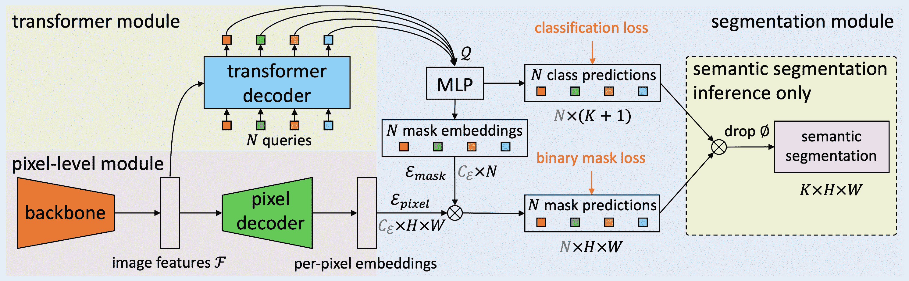

# MaskFormer

> 原文链接：[`huggingface.co/docs/transformers/v4.37.2/en/model_doc/maskformer`](https://huggingface.co/docs/transformers/v4.37.2/en/model_doc/maskformer)

这是一个最近推出的模型，因此 API 尚未经过广泛测试。可能会有一些错误或轻微的破坏性更改，需要在未来修复。如果发现异常，请提交[Github Issue](https://github.com/huggingface/transformers/issues/new?assignees=&labels=&template=bug-report.md&title)。

## 概述

MaskFormer 模型是由 Bowen Cheng、Alexander G. Schwing 和 Alexander Kirillov 在[像素级分类并不是语义分割所需的全部](https://arxiv.org/abs/2107.06278)中提出的。MaskFormer 通过掩码分类范式解决语义分割问题，而不是执行经典的像素级分类。

论文摘要如下：

*现代方法通常将语义分割形式化为每像素分类任务，而实例级分割则通过另一种掩码分类来处理。我们的关键见解：掩码分类足够通用，可以使用完全相同的模型、损失和训练程序以统一的方式解决语义和实例级分割任务。根据这一观察，我们提出了 MaskFormer，一个简单的掩码分类模型，它预测一组二进制掩码，每个掩码与单个全局类别标签预测相关联。总的来说，提出的基于掩码分类的方法简化了语义和全景分割任务的有效方法，并展示了出色的实证结果。特别是，我们观察到当类别数量较大时，MaskFormer 优于每像素分类基线。我们的基于掩码分类的方法优于当前最先进的语义（ADE20K 上的 55.6 mIoU）和全景分割（COCO 上的 52.7 PQ）模型。*

下图展示了 MaskFormer 的架构。摘自[原始论文](https://arxiv.org/abs/2107.06278)。



该模型由[francesco](https://huggingface.co/francesco)贡献。原始代码可以在[这里](https://github.com/facebookresearch/MaskFormer)找到。

## 使用提示

+   MaskFormer 的 Transformer 解码器与 DETR 的解码器相同。在训练过程中，DETR 的作者发现在解码器中使用辅助损失是有帮助的，特别是帮助模型输出每个类别的正确对象数量。如果将 MaskFormerConfig 的参数`use_auxilary_loss`设置为`True`，则在每个解码器层之后添加预测前馈神经网络和匈牙利损失（FFNs 共享参数）。

+   如果要在多个节点上的分布式环境中训练模型，则应在`modeling_maskformer.py`中的`MaskFormerLoss`类中更新`get_num_masks`函数。在多个节点上训练时，应将其设置为所有节点上目标掩码的平均数量，可以在原始实现中看到[这里](https://github.com/facebookresearch/MaskFormer/blob/da3e60d85fdeedcb31476b5edd7d328826ce56cc/mask_former/modeling/criterion.py#L169)。

+   可以使用 MaskFormerImageProcessor 为模型准备图像和可选的目标。

+   要获得最终的分割结果，根据任务，您可以调用 post_process_semantic_segmentation()或 post_process_panoptic_segmentation()。这两个任务都可以使用 MaskFormerForInstanceSegmentation 输出来解决，全景分割接受一个可选的`label_ids_to_fuse`参数，用于将目标对象（例如天空）的实例融合在一起。

## 资源

图像分割

+   所有演示推断以及使用 MaskFormer 在自定义数据上进行微调的笔记本都可以在[这里](https://github.com/NielsRogge/Transformers-Tutorials/tree/master/MaskFormer)找到。

## MaskFormer 特定的输出

### `class transformers.models.maskformer.modeling_maskformer.MaskFormerModelOutput`

[<来源>](https://github.com/huggingface/transformers/blob/v4.37.2/src/transformers/models/maskformer/modeling_maskformer.py#L146)

```py
( encoder_last_hidden_state: Optional = None pixel_decoder_last_hidden_state: Optional = None transformer_decoder_last_hidden_state: Optional = None encoder_hidden_states: Optional = None pixel_decoder_hidden_states: Optional = None transformer_decoder_hidden_states: Optional = None hidden_states: Optional = None attentions: Optional = None )
```

参数

+   `encoder_last_hidden_state` (`torch.FloatTensor`，形状为`(batch_size, num_channels, height, width)`) — 编码器模型（骨干）最后一个阶段的最后隐藏状态（最终特征图）。

+   `pixel_decoder_last_hidden_state` (`torch.FloatTensor`，形状为`(batch_size, num_channels, height, width)`) — 像素解码器模型（FPN）最后一个阶段的最后隐藏状态（最终特征图）。

+   `transformer_decoder_last_hidden_state` (`torch.FloatTensor`，形状为`(batch_size, sequence_length, hidden_size)`) — 变换器解码器模型最后一个阶段的最后隐藏状态（最终特征图）。

+   `encoder_hidden_states` (`tuple(torch.FloatTensor)`, *可选的*, 当传递`output_hidden_states=True`或`config.output_hidden_states=True`时返回) — 形状为`(batch_size, num_channels, height, width)`的`torch.FloatTensor`元组。编码器模型在每个阶段输出的隐藏状态（也称为特征图）。

+   `pixel_decoder_hidden_states` (`tuple(torch.FloatTensor)`, *可选的*, 当传递`output_hidden_states=True`或`config.output_hidden_states=True`时返回) — 形状为`(batch_size, num_channels, height, width)`的`torch.FloatTensor`元组。像素解码器模型在每个阶段输出的隐藏状态（也称为特征图）。

+   `transformer_decoder_hidden_states` (`tuple(torch.FloatTensor)`, *可选的*, 当传递`output_hidden_states=True`或`config.output_hidden_states=True`时返回) — 形状为`(batch_size, sequence_length, hidden_size)`的`torch.FloatTensor`元组。变换器解码器在每个阶段输出的隐藏状态（也称为特征图）。

+   `hidden_states` `tuple(torch.FloatTensor)`，*可选的*，当传递`output_hidden_states=True`或`config.output_hidden_states=True`时返回) — 包含`encoder_hidden_states`、`pixel_decoder_hidden_states`和`decoder_hidden_states`的`torch.FloatTensor`元组。

+   `attentions` (`tuple(torch.FloatTensor)`, *可选的*, 当传递`output_attentions=True`或`config.output_attentions=True`时返回) — 形状为`(batch_size, num_heads, sequence_length, sequence_length)`的`torch.FloatTensor`元组（每层一个）。Detr 解码器中注意力 softmax 后的注意力权重，用于计算自注意力头中的加权平均值。

用于 MaskFormerModel 输出的类。该类返回计算 logits 所需的所有隐藏状态。

### `class transformers.models.maskformer.modeling_maskformer.MaskFormerForInstanceSegmentationOutput`

[< source >](https://github.com/huggingface/transformers/blob/v4.37.2/src/transformers/models/maskformer/modeling_maskformer.py#L189)

```py
( loss: Optional = None class_queries_logits: FloatTensor = None masks_queries_logits: FloatTensor = None auxiliary_logits: FloatTensor = None encoder_last_hidden_state: Optional = None pixel_decoder_last_hidden_state: Optional = None transformer_decoder_last_hidden_state: Optional = None encoder_hidden_states: Optional = None pixel_decoder_hidden_states: Optional = None transformer_decoder_hidden_states: Optional = None hidden_states: Optional = None attentions: Optional = None )
```

参数

+   `loss` (`torch.Tensor`, *可选*) — 计算得到的损失，在存在标签时返回。

+   `class_queries_logits` (`torch.FloatTensor`) — 形状为`(batch_size, num_queries, num_labels + 1)`的张量，表示每个查询的提议类别。请注意`+ 1`是因为我们包含了空类。

+   `masks_queries_logits` (`torch.FloatTensor`) — 形状为`(batch_size, num_queries, height, width)`的张量，表示每个查询的提议掩码。

+   `encoder_last_hidden_state` (`torch.FloatTensor`，形状为`(batch_size, num_channels, height, width)`) — 编码器模型（骨干）最后阶段的最后隐藏状态（最终特征图）。

+   `pixel_decoder_last_hidden_state` (`torch.FloatTensor`，形状为`(batch_size, num_channels, height, width)`) — 像素解码器模型（FPN）最后阶段的最后隐藏状态（最终特征图）。

+   `transformer_decoder_last_hidden_state` (`torch.FloatTensor`，形状为`(batch_size, sequence_length, hidden_size)`) — transformer 解码器模型最后阶段的最后隐藏状态（最终特征图）。

+   `encoder_hidden_states` (`tuple(torch.FloatTensor)`, *可选*, 当传递`output_hidden_states=True`或`config.output_hidden_states=True`时返回) — 形状为`(batch_size, num_channels, height, width)`的`torch.FloatTensor`元组（一个用于嵌入的输出 + 一个用于每个阶段的输出）。编码器模型在每个阶段的输出的隐藏状态（也称为特征图）。

+   `pixel_decoder_hidden_states` (`tuple(torch.FloatTensor)`, *可选*, 当传递`output_hidden_states=True`或`config.output_hidden_states=True`时返回) — 形状为`(batch_size, num_channels, height, width)`的`torch.FloatTensor`元组（一个用于嵌入的输出 + 一个用于每个阶段的输出）。像素解码器模型在每个阶段的输出的隐藏状态（也称为特征图）。

+   `transformer_decoder_hidden_states` (`tuple(torch.FloatTensor)`, *可选*, 当传递`output_hidden_states=True`或`config.output_hidden_states=True`时返回) — 形状为`(batch_size, sequence_length, hidden_size)`的`torch.FloatTensor`元组（一个用于嵌入的输出 + 一个用于每个阶段的输出）。每个阶段的 transformer 解码器的隐藏状态。

+   `hidden_states` (`tuple(torch.FloatTensor)`, *可选*, 当传递`output_hidden_states=True`或`config.output_hidden_states=True`时返回) — 包含`encoder_hidden_states`、`pixel_decoder_hidden_states`和`decoder_hidden_states`的`torch.FloatTensor`元组。

+   `attentions` (`tuple(torch.FloatTensor)`, *可选*, 当传递`output_attentions=True`或`config.output_attentions=True`时返回) — 形状为`(batch_size, num_heads, sequence_length, sequence_length)`的`torch.FloatTensor`元组（每层一个）。Detr 解码器在注意力 softmax 之后的注意力权重，用于计算自注意力头中的加权平均值。

用于 MaskFormerForInstanceSegmentation 的输出类。

此输出可以直接传递给 post_process_semantic_segmentation()或 post_process_instance_segmentation()或 post_process_panoptic_segmentation()，具体取决于任务。有关使用详情，请参阅[`~MaskFormerImageProcessor]。

## MaskFormerConfig

### `class transformers.MaskFormerConfig`

[<来源>](https://github.com/huggingface/transformers/blob/v4.37.2/src/transformers/models/maskformer/configuration_maskformer.py#L35)

```py
( fpn_feature_size: int = 256 mask_feature_size: int = 256 no_object_weight: float = 0.1 use_auxiliary_loss: bool = False backbone_config: Optional = None decoder_config: Optional = None init_std: float = 0.02 init_xavier_std: float = 1.0 dice_weight: float = 1.0 cross_entropy_weight: float = 1.0 mask_weight: float = 20.0 output_auxiliary_logits: Optional = None **kwargs )
```

参数

+   `mask_feature_size` (`int`, *可选*, 默认为 256) — mask 的特征大小，此值还将用于指定特征金字塔网络特征的大小。

+   `no_object_weight` (`float`, *可选*, 默认为 0.1) — 用于应用于空（无对象）类的权重。

+   `use_auxiliary_loss(bool,` *可选*, 默认为 `False`) — 如果为 `True`，`MaskFormerForInstanceSegmentationOutput` 将包含使用每个解码器阶段的 logits 计算的辅助损失。

+   `backbone_config` (`Dict`, *可选*) — 传递给骨干的配置，如果未设置，将使用与`swin-base-patch4-window12-384`对应的配置。

+   `decoder_config` (`Dict`, *可选*) — 传递给变压器解码器模型的配置，如果未设置，则将使用`detr-resnet-50`的基本配置。

+   `init_std` (`float`, *可选*, 默认为 0.02) — 用于初始化所有权重矩阵的截断正态初始化器的标准差。

+   `init_xavier_std` (`float`, *可选*, 默认为 1) — 用于 HM Attention map 模块中 Xavier 初始化增益的缩放因子。

+   `dice_weight` (`float`, *可选*, 默认为 1.0) — dice 损失的权重。

+   `cross_entropy_weight` (`float`, *可选*, 默认为 1.0) — 交叉熵损失的权重。

+   `mask_weight` (`float`, *可选*, 默认为 20.0) — mask 损失的权重。

+   `output_auxiliary_logits` (`bool`, *可选*) — 模型是否输出其`auxiliary_logits`。

引发

`ValueError`

+   `ValueError` — 如果选择的骨干模型类型不在 `["swin"]` 中，或者选择的解码器模型类型不在 `["detr"]` 中

这是一个配置类，用于存储 MaskFormerModel 的配置。它用于根据指定的参数实例化一个 MaskFormer 模型，定义模型架构。使用默认值实例化配置将产生类似于在[ADE20k-150](https://huggingface.co/datasets/scene_parse_150)上训练的 MaskFormer [facebook/maskformer-swin-base-ade](https://huggingface.co/facebook/maskformer-swin-base-ade)架构的配置。

配置对象继承自 PretrainedConfig，可用于控制模型输出。阅读 PretrainedConfig 的文档以获取更多信息。

目前，MaskFormer 仅支持 Swin Transformer 作为骨干网络。

示例：

```py
>>> from transformers import MaskFormerConfig, MaskFormerModel

>>> # Initializing a MaskFormer facebook/maskformer-swin-base-ade configuration
>>> configuration = MaskFormerConfig()

>>> # Initializing a model (with random weights) from the facebook/maskformer-swin-base-ade style configuration
>>> model = MaskFormerModel(configuration)

>>> # Accessing the model configuration
>>> configuration = model.config
```

#### `from_backbone_and_decoder_configs`

[<来源>](https://github.com/huggingface/transformers/blob/v4.37.2/src/transformers/models/maskformer/configuration_maskformer.py#L182)

```py
( backbone_config: PretrainedConfig decoder_config: PretrainedConfig **kwargs ) → export const metadata = 'undefined';MaskFormerConfig
```

参数

+   `backbone_config` (PretrainedConfig) — 骨干配置。

+   `decoder_config`（PretrainedConfig）— 要使用的变压器解码器配置。

返回

MaskFormerConfig

配置对象的一个实例

从预训练的骨干模型配置和 DETR 模型配置实例化一个 MaskFormerConfig（或派生类）。

## MaskFormerImageProcessor

### `class transformers.MaskFormerImageProcessor`

[<来源>](https://github.com/huggingface/transformers/blob/v4.37.2/src/transformers/models/maskformer/image_processing_maskformer.py#L347)

```py
( do_resize: bool = True size: Dict = None size_divisor: int = 32 resample: Resampling = <Resampling.BILINEAR: 2> do_rescale: bool = True rescale_factor: float = 0.00392156862745098 do_normalize: bool = True image_mean: Union = None image_std: Union = None ignore_index: Optional = None do_reduce_labels: bool = False **kwargs )
```

参数

+   `do_resize`（`bool`，*可选*，默认为`True`）— 是否将输入调整大小到特定的`size`。

+   `size`（`int`，*可选*，默认为 800）— 将输入调整大小到给定的大小。仅在`do_resize`设置为`True`时有效。如果 size 是一个类似`(width, height)`的序列，输出大小将匹配到这个。如果 size 是一个整数，图像的较小边将匹配到这个数字。即，如果`height > width`，则图像将重新缩放为`(size * height / width, size)`。

+   `size_divisor`（`int`，*可选*，默认为 32）— 一些骨干需要能够被某个数字整除的图像。如果未传递，则默认为 Swin Transformer 中使用的值。

+   `resample`（`int`，*可选*，默认为`Resampling.BILINEAR`）— 一个可选的重采样滤波器。可以是`PIL.Image.Resampling.NEAREST`、`PIL.Image.Resampling.BOX`、`PIL.Image.Resampling.BILINEAR`、`PIL.Image.Resampling.HAMMING`、`PIL.Image.Resampling.BICUBIC`或`PIL.Image.Resampling.LANCZOS`之一。仅在`do_resize`设置为`True`时有效。

+   `do_rescale`（`bool`，*可选*，默认为`True`）— 是否将输入调整大小到特定的`scale`。

+   `rescale_factor`（`float`，*可选*，默认为`1/255`）— 通过给定的因子重新缩放输入。仅在`do_rescale`设置为`True`时有效。

+   `do_normalize`（`bool`，*可选*，默认为`True`）— 是否对输入进行均值和标准差归一化。

+   `image_mean`（`int`，*可选*，默认为`[0.485, 0.456, 0.406]`）— 每个通道的均值序列，在归一化图像时使用。默认为 ImageNet 均值。

+   `image_std`（`int`，*可选*，默认为`[0.229, 0.224, 0.225]`）— 每个通道的标准差序列，在归一化图像时使用。默认为 ImageNet 标准差。

+   `ignore_index`（`int`，*可选*）— 分割地图中要分配给背景像素的标签。如果提供，用 0（背景）表示的分割地图像素将被替换为`ignore_index`。

+   `do_reduce_labels`（`bool`，*可选*，默认为`False`）— 是否减少所有分割地图的标签值。通常用于数据集中使用 0 表示背景，并且背景本身不包含在数据集的所有类中（例如 ADE20k）。背景标签将被替换为`ignore_index`。

构造一个 MaskFormer 图像处理器。该图像处理器可用于为模型准备图像和可选目标。

该图像处理器继承自`BaseImageProcessor`，其中包含大部分主要方法。用户应参考这个超类以获取有关这些方法的更多信息。

#### `preprocess`

[<来源>](https://github.com/huggingface/transformers/blob/v4.37.2/src/transformers/models/maskformer/image_processing_maskformer.py#L677)

```py
( images: Union segmentation_maps: Union = None instance_id_to_semantic_id: Optional = None do_resize: Optional = None size: Optional = None size_divisor: Optional = None resample: Resampling = None do_rescale: Optional = None rescale_factor: Optional = None do_normalize: Optional = None image_mean: Union = None image_std: Union = None ignore_index: Optional = None do_reduce_labels: Optional = None return_tensors: Union = None data_format: Union = <ChannelDimension.FIRST: 'channels_first'> input_data_format: Union = None **kwargs )
```

#### `encode_inputs`

[<来源>](https://github.com/huggingface/transformers/blob/v4.37.2/src/transformers/models/maskformer/image_processing_maskformer.py#L875)

```py
( pixel_values_list: List segmentation_maps: Union = None instance_id_to_semantic_id: Union = None ignore_index: Optional = None reduce_labels: bool = False return_tensors: Union = None input_data_format: Union = None ) → export const metadata = 'undefined';BatchFeature
```

参数

+   `pixel_values_list`（`List[ImageInput]`）— 要填充的图像（像素值）列表。每个图像应该是形状为`(channels, height, width)`的张量。

+   `segmentation_maps`（`ImageInput`，*可选*）— 具有像素级注释的相应语义分割地图。

    （`bool`，*可选*，默认为`True`）：是否将图像填充到批次中最大的图像，并创建像素掩模。

    如果保持默认设置，将返回像素掩模：

    +   1 表示真实像素（即`未掩模`），

    +   对于填充像素（即`掩模`），值为 0。

+   `instance_id_to_semantic_id`（`List[Dict[int, int]]`或`Dict[int, int]`，*可选*）— 对象实例 ID 和类别 ID 之间的映射。如果传递了此参数，则`segmentation_maps`将被视为实例分割地图，其中每个像素表示一个实例 ID。可以提供一个全局/数据集级别映射的单个字典，或者作为字典列表（每个图像一个），以分别映射每个图像中的实例 ID。

+   `return_tensors`（`str`或 TensorType，*可选*）— 如果设置，将返回张量而不是 NumPy 数组。如果设置为`'pt'`，则返回 PyTorch 的`torch.Tensor`对象。

返回

BatchFeature

具有以下字段的 BatchFeature：

+   `pixel_values` — 用于向模型提供输入的像素值。

+   `pixel_mask` — 用于向模型提供输入的像素掩模（当`=True`或`pixel_mask`在`self.model_input_names`中时）。

+   `mask_labels` — 可选的掩模标签列表，形状为`(labels, height, width)`，用于向模型提供输入（当提供`annotations`时）。

+   `class_labels` — 可选的类标签列表，形状为`(labels)`，用于向模型提供输入（当提供`annotations`时）。它们标识了`mask_labels`的标签，例如`mask_labels[i][j]`的标签为`class_labels[i][j]`。

将图像填充到批次中最大的图像，并创建相应的`pixel_mask`。

MaskFormer 通过掩模分类范式解决语义分割问题，因此输入的分割地图将被转换为二进制掩模列表及其相应的标签。让我们看一个例子，假设`segmentation_maps = [[2,6,7,9]]`，输出将包含`mask_labels = [[1,0,0,0],[0,1,0,0],[0,0,1,0],[0,0,0,1]]`（四个二进制掩模）和`class_labels = [2,6,7,9]`，每个掩模的标签。

#### `post_process_semantic_segmentation`

[< source >](https://github.com/huggingface/transformers/blob/v4.37.2/src/transformers/models/maskformer/image_processing_maskformer.py#L1029)

```py
( outputs target_sizes: Optional = None ) → export const metadata = 'undefined';List[torch.Tensor]
```

参数

+   `outputs`（MaskFormerForInstanceSegmentation）— 模型的原始输出。

+   `target_sizes`（`List[Tuple[int, int]]`，*可选*）— 长度为`batch_size`的列表，其中每个列表项（`Tuple[int, int]]`对应于每个预测的请求最终大小（高度，宽度）。如果保持为 None，则不会调整预测。

返回

`List[torch.Tensor]`

一个长度为`batch_size`的列表，其中每个项目是形状为（高度，宽度）的语义分割地图，对应于目标大小条目（如果指定了`target_sizes`）。每个`torch.Tensor`的每个条目对应于一个语义类别 ID。

将 MaskFormerForInstanceSegmentation 的输出转换为语义分割地图。仅支持 PyTorch。

#### `post_process_instance_segmentation`

[< source >](https://github.com/huggingface/transformers/blob/v4.37.2/src/transformers/models/maskformer/image_processing_maskformer.py#L1079)

```py
( outputs threshold: float = 0.5 mask_threshold: float = 0.5 overlap_mask_area_threshold: float = 0.8 target_sizes: Optional = None return_coco_annotation: Optional = False return_binary_maps: Optional = False ) → export const metadata = 'undefined';List[Dict]
```

参数

+   `outputs`（MaskFormerForInstanceSegmentation）— 模型的原始输出。

+   `threshold`（`float`，*可选*，默认为 0.5）— 保留预测实例掩模的概率分数阈值。

+   `mask_threshold` (`float`, *optional*, defaults to 0.5) — 将预测的掩码转换为二进制值时使用的阈值。

+   `overlap_mask_area_threshold` (`float`, *optional*, defaults to 0.8) — 重叠掩码面积阈值，用于合并或丢弃每个二进制实例掩码中的小断开部分。

+   `target_sizes` (`List[Tuple]`, *optional*) — 长度为（batch_size）的列表，其中每个列表项（`Tuple[int, int]`）对应于每个预测的请求最终大小（高度，宽度）。如果设置为`None`，则不会调整预测大小。

+   `return_coco_annotation` (`bool`, *optional*, defaults to `False`) — 如果设置为`True`，分割地图将以 COCO 运行长度编码（RLE）格式返回。

+   `return_binary_maps` (`bool`, *optional*, defaults to `False`) — 如果设置为`True`，分割地图将作为二进制分割地图的连接张量返回（每个检测到的实例一个）。

返回

`List[Dict]`

一个字典列表，每个图像一个，每个字典包含两个键：

+   `segmentation` — 形状为`(height, width)`的张量，其中每个像素表示`segment_id`或分割地图的`List[List]`运行长度编码（RLE），如果`return_coco_annotation`设置为`True`，则设置为`None`，如果未找到高于`threshold`的掩码。

+   `segments_info` — 包含每个段的附加信息的字典。

    +   `id` — 代表`segment_id`的整数。

    +   `label_id` — 代表与`segment_id`对应的标签/语义类别 ID 的整数。

    +   `score` — 带有`segment_id`的段的预测分数。

将`MaskFormerForInstanceSegmentationOutput`的输出转换为实例分割预测。仅支持 PyTorch。

#### `post_process_panoptic_segmentation`

[< source >](https://github.com/huggingface/transformers/blob/v4.37.2/src/transformers/models/maskformer/image_processing_maskformer.py#L1193)

```py
( outputs threshold: float = 0.5 mask_threshold: float = 0.5 overlap_mask_area_threshold: float = 0.8 label_ids_to_fuse: Optional = None target_sizes: Optional = None ) → export const metadata = 'undefined';List[Dict]
```

参数

+   `outputs` (`MaskFormerForInstanceSegmentationOutput`) — 来自 MaskFormerForInstanceSegmentation 的输出。

+   `threshold` (`float`, *optional*, defaults to 0.5) — 保留预测实例掩码的概率分数阈值。

+   `mask_threshold` (`float`, *optional*, defaults to 0.5) — 将预测的掩码转换为二进制值时使用的阈值。

+   `overlap_mask_area_threshold` (`float`, *optional*, defaults to 0.8) — 重叠掩码面积阈值，用于合并或丢弃每个二进制实例掩码中的小断开部分。

+   `label_ids_to_fuse` (`Set[int]`, *optional*) — 此状态中的标签将使其所有实例被融合在一起。例如，我们可以说一张图像中只能有一个天空，但可以有多个人，因此天空的标签 ID 将在该集合中，但人的标签 ID 不在其中。

+   `target_sizes` (`List[Tuple]`, *optional*) — 长度为（batch_size）的列表，其中每个列表项（`Tuple[int, int]`）对应于批处理中每个预测的请求最终大小（高度，宽度）。如果设置为`None`，则不会调整预测大小。

返回

`List[Dict]`

一个字典列表，每个图像一个，每个字典包含两个键：

+   `segmentation` — 形状为`(height, width)`的张量，其中每个像素表示`segment_id`，如果未找到高于`threshold`的掩码，则设置为`None`。如果指定了`target_sizes`，则将分割调整为相应的`target_sizes`条目。

+   `segments_info` — 包含每个段的附加信息的字典。

    +   `id` — 代表`segment_id`的整数。

    +   `label_id` — 代表与`segment_id`对应的标签/语义类别 ID 的整数。

    +   `was_fused` — 一个布尔值，如果`label_id`在`label_ids_to_fuse`中则为`True`，否则为`False`。相同类别/标签的多个实例被融合并分配一个单独的`segment_id`。

    +   `score` — 带有`segment_id`的段的预测分数。

将`MaskFormerForInstanceSegmentationOutput`的输出转换为图像全景分割预测。仅支持 PyTorch。

## MaskFormerFeatureExtractor

### `class transformers.MaskFormerFeatureExtractor`

[<来源>](https://github.com/huggingface/transformers/blob/v4.37.2/src/transformers/models/maskformer/feature_extraction_maskformer.py#L26)

```py
( *args **kwargs )
```

#### `__call__`

[<来源>](https://github.com/huggingface/transformers/blob/v4.37.2/src/transformers/models/maskformer/image_processing_maskformer.py#L571)

```py
( images segmentation_maps = None **kwargs )
```

#### `encode_inputs`

[<来源>](https://github.com/huggingface/transformers/blob/v4.37.2/src/transformers/models/maskformer/image_processing_maskformer.py#L875)

```py
( pixel_values_list: List segmentation_maps: Union = None instance_id_to_semantic_id: Union = None ignore_index: Optional = None reduce_labels: bool = False return_tensors: Union = None input_data_format: Union = None ) → export const metadata = 'undefined';BatchFeature
```

参数

+   `pixel_values_list`（`List[ImageInput]`） — 要填充的图像（像素值）列表。每个图像应该是形状为`(channels, height, width)`的张量。

+   `segmentation_maps`（`ImageInput`，*可选*） — 具有像素级注释的相应语义分割图。

    （*可选*，默认为`True`）：是否将图像填充到批次中最大的图像并创建像素掩码。

    如果保持默认值，将返回一个像素掩码，即：

    +   1 表示真实像素（即`未被遮罩`），

    +   0 表示填充像素（即`被遮罩`）。

+   `instance_id_to_semantic_id`（`List[Dict[int, int]]`或`Dict[int, int]`，*可选*） — 对象实例 id 和类 id 之间的映射。如果传递，`segmentation_maps`将被视为实例分割图，其中每个像素表示一个实例 id。可以提供为一个包含全局/数据集级映射的单个字典，或者作为字典列表（每个图像一个），以分别映射每个图像中的实例 id。

+   `return_tensors`（`str`或 TensorType，*可选*） — 如果设置，将返回张量而不是 NumPy 数组。如果设置为`'pt'`，则返回 PyTorch 的`torch.Tensor`对象。

返回

BatchFeature

具有以下字段的 BatchFeature：

+   `pixel_values` — 要馈送给模型的像素值。

+   `pixel_mask` — 要馈送给模型的像素掩码（当`=True`或`pixel_mask`在`self.model_input_names`中时）。

+   `mask_labels` — 可选的形状为`(labels, height, width)`的掩码标签列表，用于馈送给模型（当提供`annotations`时）。

+   `class_labels` — 可选的形状为`(labels)`的类标签列表，用于馈送给模型（当提供`annotations`时）。它们标识`mask_labels`的标签，例如如果`class_labels[i][j]`的标签是`mask_labels[i][j]`的标签。

将图像填充到批次中最大的图像，并创建相应的`pixel_mask`。

MaskFormer 使用掩码分类范式解决语义分割问题，因此输入分割图将被转换为二进制掩码列表及其相应的标签。让我们看一个例子，假设`segmentation_maps = [[2,6,7,9]]`，输出将包含`mask_labels = [[1,0,0,0],[0,1,0,0],[0,0,1,0],[0,0,0,1]]`（四个二进制掩码）和`class_labels = [2,6,7,9]`，每个掩码的标签。

#### `post_process_semantic_segmentation`

[<来源>](https://github.com/huggingface/transformers/blob/v4.37.2/src/transformers/models/maskformer/image_processing_maskformer.py#L1029)

```py
( outputs target_sizes: Optional = None ) → export const metadata = 'undefined';List[torch.Tensor]
```

参数

+   `outputs`（MaskFormerForInstanceSegmentation） — 模型的原始输出。

+   `target_sizes`（`List[Tuple[int, int]]`，*可选*） — 长度为`batch_size`的列表，其中每个列表项（`Tuple[int, int]`）对应于每个预测的请求最终大小（高度，宽度）。如果保持为`None`，则不会调整预测大小。

返回

`List[torch.Tensor]`

长度为`batch_size`的列表，其中每个项目是形状为`(height, width)`的语义分割图，对应于`target_sizes`条目（如果指定了`target_sizes`）。每个`torch.Tensor`的每个条目对应于一个语义类别 id。

将 MaskFormerForInstanceSegmentation 的输出转换为语义分割图。仅支持 PyTorch。

#### `post_process_instance_segmentation`

[< source >](https://github.com/huggingface/transformers/blob/v4.37.2/src/transformers/models/maskformer/image_processing_maskformer.py#L1079)

```py
( outputs threshold: float = 0.5 mask_threshold: float = 0.5 overlap_mask_area_threshold: float = 0.8 target_sizes: Optional = None return_coco_annotation: Optional = False return_binary_maps: Optional = False ) → export const metadata = 'undefined';List[Dict]
```

参数

+   `outputs` (MaskFormerForInstanceSegmentation) — 模型的原始输出。

+   `threshold` (`float`, *optional*, defaults to 0.5) — 保留预测实例掩模的概率分数阈值。

+   `mask_threshold` (`float`, *optional*, defaults to 0.5) — 将预测掩模转换为二进制值时使用的阈值。

+   `overlap_mask_area_threshold` (`float`, *optional*, defaults to 0.8) — 合并或丢弃每个二进制实例掩模中的小断开部分的重叠掩模区域阈值。

+   `target_sizes` (`List[Tuple]`, *optional*) — 长度为 (batch_size) 的列表，其中每个列表项 (`Tuple[int, int]]`) 对应于每个预测的请求的请求最终大小（高度，宽度）。如果保持为 None，则不会调整预测大小。

+   `return_coco_annotation` (`bool`, *optional*, defaults to `False`) — 如果设置为 `True`，则以 COCO run-length 编码（RLE）格式返回分割图。

+   `return_binary_maps` (`bool`, *optional*, defaults to `False`) — 如果设置为 `True`，则分割图将作为二进制分割图的连接张量返回（每个检测到的实例一个）。

返回

`List[Dict]`

一个字典列表，每个图像一个字典，每个字典包含两个键：

+   `segmentation` — 形状为 `(height, width)` 的张量，其中每个像素表示 `segment_id` 或分割图的 `List[List]` run-length 编码（RLE），如果 return_coco_annotation 设置为 `True`。如果未找到高于 `threshold` 的掩模，则设置为 `None`。

+   `segments_info` — 包含每个段的其他信息的字典。

    +   `id` — 表示 `segment_id` 的整数。

    +   `label_id` — 表示与 `segment_id` 对应的标签 / 语义类别 ID 的整数。

    +   `score` — 具有 `segment_id` 的段的预测分数。

将 `MaskFormerForInstanceSegmentationOutput` 的输出转换为实例分割预测。仅支持 PyTorch。

#### `post_process_panoptic_segmentation`

[< source >](https://github.com/huggingface/transformers/blob/v4.37.2/src/transformers/models/maskformer/image_processing_maskformer.py#L1193)

```py
( outputs threshold: float = 0.5 mask_threshold: float = 0.5 overlap_mask_area_threshold: float = 0.8 label_ids_to_fuse: Optional = None target_sizes: Optional = None ) → export const metadata = 'undefined';List[Dict]
```

参数

+   `outputs` (`MaskFormerForInstanceSegmentationOutput`) — 来自 MaskFormerForInstanceSegmentation 的输出。

+   `threshold` (`float`, *optional*, defaults to 0.5) — 保留预测实例掩模的概率分数阈值。

+   `mask_threshold` (`float`, *optional*, defaults to 0.5) — 将预测掩模转换为二进制值时使用的阈值。

+   `overlap_mask_area_threshold` (`float`, *optional*, defaults to 0.8) — 合并或丢弃每个二进制实例掩模中的小断开部分的重叠掩模区域阈值。

+   `label_ids_to_fuse` (`Set[int]`, *optional*) — 此状态中的标签将使其所有实例被融合在一起。例如，我们可以说图像中只能有一个天空，但可以有几个人，因此天空的标签 ID 将在该集合中，但人的标签 ID 不在其中。

+   `target_sizes` (`List[Tuple]`, *optional*) — 长度为 (batch_size) 的列表，其中每个列表项 (`Tuple[int, int]]`) 对应于批处理中每个预测的请求的最终大小（高度，宽度）。如果保持为 None，则不会调整预测大小。

返回

`List[Dict]`

一个字典列表，每个图像一个字典，每个字典包含两个键：

+   `segmentation` - 形状为`(height, width)`的张量，其中每个像素表示一个`segment_id`，如果未找到高于`threshold`的掩码，则设置为`None`。如果指定了`target_sizes`，则将分割调整为相应的`target_sizes`条目。

+   `segments_info` - 包含每个段的其他信息的字典。

    +   `id` - 表示`segment_id`的整数。

    +   `label_id` - 表示与`segment_id`对应的标签/语义类别 id 的整数。

    +   `was_fused` - 一个布尔值，如果`label_id`在`label_ids_to_fuse`中，则为`True`，否则为`False`。同一类别/标签的多个实例被融合并分配一个单一的`segment_id`。

    +   `score` - 具有`segment_id`的段的预测分数。

将`MaskFormerForInstanceSegmentationOutput`的输出转换为图像全景分割预测。仅支持 PyTorch。

## MaskFormerModel

### `class transformers.MaskFormerModel`

[<来源>](https://github.com/huggingface/transformers/blob/v4.37.2/src/transformers/models/maskformer/modeling_maskformer.py#L1597)

```py
( config: MaskFormerConfig )
```

参数

+   `config`（MaskFormerConfig）- 具有模型所有参数的模型配置类。使用配置文件初始化不会加载与模型相关的权重，只加载配置。查看 from_pretrained()方法以加载模型权重。

裸的 MaskFormer 模型输出原始隐藏状态，没有特定的头部。此模型是 PyTorch [torch.nn.Module](https://pytorch.org/docs/stable/nn.html#torch.nn.Module)子类。将其用作常规 PyTorch 模块，并参考 PyTorch 文档以获取有关一般用法和行为的所有相关信息。

#### `forward`

[<来源>](https://github.com/huggingface/transformers/blob/v4.37.2/src/transformers/models/maskformer/modeling_maskformer.py#L1611)

```py
( pixel_values: Tensor pixel_mask: Optional = None output_hidden_states: Optional = None output_attentions: Optional = None return_dict: Optional = None ) → export const metadata = 'undefined';transformers.models.maskformer.modeling_maskformer.MaskFormerModelOutput or tuple(torch.FloatTensor)
```

参数

+   `pixel_values`（形状为`(batch_size, num_channels, height, width)`的`torch.FloatTensor`）- 像素值。可以使用 AutoImageProcessor 获取像素值。有关详细信息，请参阅 MaskFormerImageProcessor.`call`()。

+   `pixel_mask`（形状为`(batch_size, height, width)`的`torch.LongTensor`，*可选*）- 避免在填充像素值上执行注意力的掩码。选择的掩码值在`[0, 1]`范围内：

    +   1 表示真实像素（即`未遮罩`），

    +   0 表示填充像素（即`已遮罩`）。

    注意力掩码是什么？

+   `output_hidden_states`（`bool`，*可选*）- 是否返回所有层的隐藏状态。有关更多详细信息，请查看返回张量下的`hidden_states`。

+   `output_attentions`（`bool`，*可选*）- 是否返回 Detr 解码器注意力层的注意力张量。

+   `return_dict`（`bool`，*可选*）- 是否返回`~MaskFormerModelOutput`而不是普通元组。

返回

transformers.models.maskformer.modeling_maskformer.MaskFormerModelOutput 或`tuple(torch.FloatTensor)`

transformers.models.maskformer.modeling_maskformer.MaskFormerModelOutput 或`torch.FloatTensor`元组（如果传递了`return_dict=False`或`config.return_dict=False`时）包含根据配置（MaskFormerConfig）和输入的各种元素。

+   `encoder_last_hidden_state` (`torch.FloatTensor` of shape `(batch_size, num_channels, height, width)`) — 编码器模型（骨干）最后阶段的隐藏状态（最终特征图）。

+   `pixel_decoder_last_hidden_state` (`torch.FloatTensor` of shape `(batch_size, num_channels, height, width)`) — 像素解码器模型（FPN）最后阶段的隐藏状态（最终特征图）。

+   `transformer_decoder_last_hidden_state` (`torch.FloatTensor` of shape `(batch_size, sequence_length, hidden_size)`) — 变压器解码器模型最后阶段的隐藏状态（最终特征图）。

+   `encoder_hidden_states` (`tuple(torch.FloatTensor)`，*可选*，当传递`output_hidden_states=True`或`config.output_hidden_states=True`时返回） — 形状为`(batch_size, num_channels, height, width)`的`torch.FloatTensor`元组。编码器模型在每个阶段输出的隐藏状态（也称为特征图）。

+   `pixel_decoder_hidden_states` (`tuple(torch.FloatTensor)`，*可选*，当传递`output_hidden_states=True`或`config.output_hidden_states=True`时返回） — 形状为`(batch_size, num_channels, height, width)`的`torch.FloatTensor`元组。像素解码器模型在每个阶段输出的隐藏状态（也称为特征图）。

+   `transformer_decoder_hidden_states` (`tuple(torch.FloatTensor)`，*可选*，当传递`output_hidden_states=True`或`config.output_hidden_states=True`时返回） — 形状为`(batch_size, sequence_length, hidden_size)`的`torch.FloatTensor`元组。变压器解码器在每个阶段输出的隐藏状态（也称为特征图）。

+   `hidden_states` `tuple(torch.FloatTensor)`，*可选*，当传递`output_hidden_states=True`或`config.output_hidden_states=True`时返回） — 包含`encoder_hidden_states`、`pixel_decoder_hidden_states`和`decoder_hidden_states`的`torch.FloatTensor`元组

+   `attentions` (`tuple(torch.FloatTensor)`，*可选*，当传递`output_attentions=True`或`config.output_attentions=True`时返回） — 包含每个层的`torch.FloatTensor`元组，形状为`(batch_size, num_heads, sequence_length, sequence_length)`。Detr 解码器在注意力 softmax 之后的注意力权重，用于计算自注意力头中的加权平均值。

MaskFormerModel 的前向方法，覆盖了`__call__`特殊方法。

虽然前向传递的方法需要在此函数内定义，但应该在此之后调用`Module`实例，而不是在此处调用，因为前者会处理运行前处理和后处理步骤，而后者会默默地忽略它们。

示例：

```py
>>> from transformers import AutoImageProcessor, MaskFormerModel
>>> from PIL import Image
>>> import requests

>>> # load MaskFormer fine-tuned on ADE20k semantic segmentation
>>> image_processor = AutoImageProcessor.from_pretrained("facebook/maskformer-swin-base-ade")
>>> model = MaskFormerModel.from_pretrained("facebook/maskformer-swin-base-ade")

>>> url = "http://images.cocodataset.org/val2017/000000039769.jpg"
>>> image = Image.open(requests.get(url, stream=True).raw)

>>> inputs = image_processor(image, return_tensors="pt")

>>> # forward pass
>>> outputs = model(**inputs)

>>> # the decoder of MaskFormer outputs hidden states of shape (batch_size, num_queries, hidden_size)
>>> transformer_decoder_last_hidden_state = outputs.transformer_decoder_last_hidden_state
>>> list(transformer_decoder_last_hidden_state.shape)
[1, 100, 256]
```

## MaskFormerForInstanceSegmentation

### `class transformers.MaskFormerForInstanceSegmentation`

[<来源>](https://github.com/huggingface/transformers/blob/v4.37.2/src/transformers/models/maskformer/modeling_maskformer.py#L1700)

```py
( config: MaskFormerConfig )
```

#### `forward`

[<来源>](https://github.com/huggingface/transformers/blob/v4.37.2/src/transformers/models/maskformer/modeling_maskformer.py#L1795)

```py
( pixel_values: Tensor mask_labels: Optional = None class_labels: Optional = None pixel_mask: Optional = None output_auxiliary_logits: Optional = None output_hidden_states: Optional = None output_attentions: Optional = None return_dict: Optional = None ) → export const metadata = 'undefined';transformers.models.maskformer.modeling_maskformer.MaskFormerForInstanceSegmentationOutput or tuple(torch.FloatTensor)
```

参数

+   `pixel_values` (`torch.FloatTensor` of shape `(batch_size, num_channels, height, width)`) — 像素值。像素值可以使用 AutoImageProcessor 获得。有关详细信息，请参阅 MaskFormerImageProcessor.`call`()。

+   `pixel_mask` (`torch.LongTensor` of shape `(batch_size, height, width)`，*可选*) — 用于避免在填充像素值上执行注意力的掩码。掩码值选在`[0, 1]`之间：

    +   1 代表真实像素（即`未被遮蔽`），

    +   对于填充像素为 0（即`masked`）。

    什么是注意力掩码？

+   `output_hidden_states` (`bool`, *可选*) — 是否返回所有层的隐藏状态。有关更多详细信息，请查看返回张量下的`hidden_states`。

+   `output_attentions` (`bool`, *可选*) — 是否返回 Detr 解码器注意力层的注意力张量。

+   `return_dict` (`bool`, *可选*) — 是否返回`~MaskFormerModelOutput`而不是普通元组。

+   `mask_labels` (`List[torch.Tensor]`, *可选*) — 形状为`(num_labels, height, width)`的掩码标签列表，用于馈送给模型。

+   `class_labels` (`List[torch.LongTensor]`, *可选*) — 形状为`(num_labels, height, width)`的目标类标签列表，用于馈送给模型。它们标识`mask_labels`的标签，例如`class_labels[i][j]`的标签是`mask_labels[i][j]`的标签。

返回

transformers.models.maskformer.modeling_maskformer.MaskFormerForInstanceSegmentationOutput 或`tuple(torch.FloatTensor)`

一个 transformers.models.maskformer.modeling_maskformer.MaskFormerForInstanceSegmentationOutput 或一个`torch.FloatTensor`元组（如果传递`return_dict=False`或`config.return_dict=False`）包含根据配置（MaskFormerConfig）和输入的各种元素。

+   `loss` (`torch.Tensor`, *可选*) — 计算的损失，在存在标签时返回。

+   `class_queries_logits` (`torch.FloatTensor`) — 形状为`(batch_size, num_queries, num_labels + 1)`的张量，表示每个查询的提议类别。注意`+ 1`是因为我们包含了空类。

+   `masks_queries_logits` (`torch.FloatTensor`) — 形状为`(batch_size, num_queries, height, width)`的张量，表示每个查询的提议掩码。

+   `encoder_last_hidden_state` (`torch.FloatTensor` of shape `(batch_size, num_channels, height, width)`) — 编码器模型（骨干）最后一个阶段的最后隐藏状态（最终特征图）。

+   `pixel_decoder_last_hidden_state` (`torch.FloatTensor` of shape `(batch_size, num_channels, height, width)`) — 最后一个阶段像素解码器模型（FPN）的最后隐藏状态（最终特征图）。

+   `transformer_decoder_last_hidden_state` (`torch.FloatTensor` of shape `(batch_size, sequence_length, hidden_size)`) — 变压器解码器模型最后一个阶段的最后隐藏状态（最终特征图）。

+   `encoder_hidden_states` (`tuple(torch.FloatTensor)`, *可选*, 当传递`output_hidden_states=True`或`config.output_hidden_states=True`时返回) — 形状为`(batch_size, num_channels, height, width)`的`torch.FloatTensor`元组。编码器模型在每个阶段输出的隐藏状态（也称为特征图）。

+   `pixel_decoder_hidden_states` (`tuple(torch.FloatTensor)`, *可选*, 当传递`output_hidden_states=True`或`config.output_hidden_states=True`时返回) — 形状为`(batch_size, num_channels, height, width)`的`torch.FloatTensor`元组。像素解码器模型在每个阶段输出的隐藏状态（也称为特征图）。

+   `transformer_decoder_hidden_states` (`tuple(torch.FloatTensor)`, *可选*, 当传递`output_hidden_states=True`或`config.output_hidden_states=True`时返回) — 形状为`(batch_size, sequence_length, hidden_size)`的`torch.FloatTensor`元组。变压器解码器在每个阶段输出的隐藏状态。

+   `hidden_states` `tuple(torch.FloatTensor)`, *optional*, returned when `output_hidden_states=True` is passed or when `config.output_hidden_states=True`) — Tuple of `torch.FloatTensor` containing `encoder_hidden_states`, `pixel_decoder_hidden_states` and `decoder_hidden_states`.

+   `attentions` (`tuple(torch.FloatTensor)`, *optional*, returned when `output_attentions=True` is passed or when `config.output_attentions=True`) — Tuple of `torch.FloatTensor` (one for each layer) of shape `(batch_size, num_heads, sequence_length, sequence_length)`. Attentions weights from Detr’s decoder after the attention softmax, used to compute the weighted average in the self-attention heads.

MaskFormerForInstanceSegmentation 的前向方法，覆盖了`__call__`特殊方法。

尽管前向传递的配方需要在此函数内定义，但应该在此之后调用`Module`实例，而不是这个，因为前者负责运行预处理和后处理步骤，而后者则默默地忽略它们。

示例：

语义分割示例：

```py
>>> from transformers import AutoImageProcessor, MaskFormerForInstanceSegmentation
>>> from PIL import Image
>>> import requests

>>> # load MaskFormer fine-tuned on ADE20k semantic segmentation
>>> image_processor = AutoImageProcessor.from_pretrained("facebook/maskformer-swin-base-ade")
>>> model = MaskFormerForInstanceSegmentation.from_pretrained("facebook/maskformer-swin-base-ade")

>>> url = (
...     "https://huggingface.co/datasets/hf-internal-testing/fixtures_ade20k/resolve/main/ADE_val_00000001.jpg"
... )
>>> image = Image.open(requests.get(url, stream=True).raw)
>>> inputs = image_processor(images=image, return_tensors="pt")

>>> outputs = model(**inputs)
>>> # model predicts class_queries_logits of shape `(batch_size, num_queries)`
>>> # and masks_queries_logits of shape `(batch_size, num_queries, height, width)`
>>> class_queries_logits = outputs.class_queries_logits
>>> masks_queries_logits = outputs.masks_queries_logits

>>> # you can pass them to image_processor for postprocessing
>>> predicted_semantic_map = image_processor.post_process_semantic_segmentation(
...     outputs, target_sizes=[image.size[::-1]]
... )[0]

>>> # we refer to the demo notebooks for visualization (see "Resources" section in the MaskFormer docs)
>>> list(predicted_semantic_map.shape)
[512, 683]
```

全景分割示例：

```py
>>> from transformers import AutoImageProcessor, MaskFormerForInstanceSegmentation
>>> from PIL import Image
>>> import requests

>>> # load MaskFormer fine-tuned on COCO panoptic segmentation
>>> image_processor = AutoImageProcessor.from_pretrained("facebook/maskformer-swin-base-coco")
>>> model = MaskFormerForInstanceSegmentation.from_pretrained("facebook/maskformer-swin-base-coco")

>>> url = "http://images.cocodataset.org/val2017/000000039769.jpg"
>>> image = Image.open(requests.get(url, stream=True).raw)
>>> inputs = image_processor(images=image, return_tensors="pt")

>>> outputs = model(**inputs)
>>> # model predicts class_queries_logits of shape `(batch_size, num_queries)`
>>> # and masks_queries_logits of shape `(batch_size, num_queries, height, width)`
>>> class_queries_logits = outputs.class_queries_logits
>>> masks_queries_logits = outputs.masks_queries_logits

>>> # you can pass them to image_processor for postprocessing
>>> result = image_processor.post_process_panoptic_segmentation(outputs, target_sizes=[image.size[::-1]])[0]

>>> # we refer to the demo notebooks for visualization (see "Resources" section in the MaskFormer docs)
>>> predicted_panoptic_map = result["segmentation"]
>>> list(predicted_panoptic_map.shape)
[480, 640]
```
