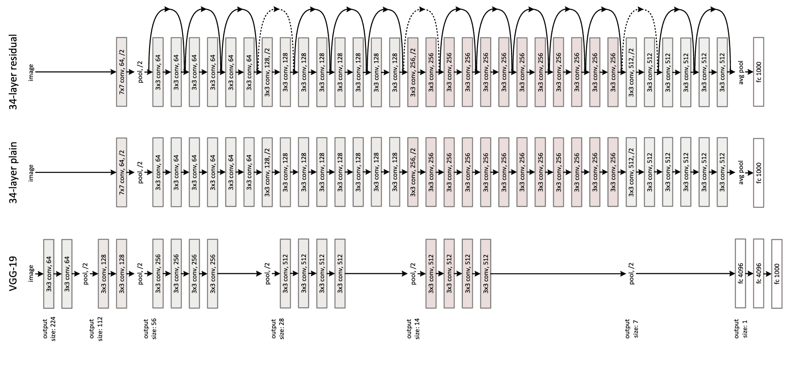

# ResNet

> 原始文本：[`huggingface.co/docs/transformers/v4.37.2/en/model_doc/resnet`](https://huggingface.co/docs/transformers/v4.37.2/en/model_doc/resnet)

## 概述

ResNet 模型是由 Kaiming He、Xiangyu Zhang、Shaoqing Ren 和 Jian Sun 在[图像识别的深度残差学习](https://arxiv.org/abs/1512.03385)中提出的。我们的实现遵循了[Nvidia](https://catalog.ngc.nvidia.com/orgs/nvidia/resources/resnet_50_v1_5_for_pytorch)所做的小改动，我们在瓶颈的`3x3`卷积中应用`stride=2`进行下采样，而不是在第一个`1x1`中。这通常被称为“ResNet v1.5”。

ResNet 引入了残差连接，它们允许训练具有未知层数（高达 1000 层）的网络。ResNet 赢得了 2015 年 ILSVRC 和 COCO 竞赛，这是深度计算机视觉的一个重要里程碑。

论文的摘要如下：

*更深的神经网络更难训练。我们提出了一个残差学习框架，以便训练比以前使用的网络更深的网络变得更容易。我们明确地将层重新构建为学习残差函数，参考层输入，而不是学习无参考的函数。我们提供了全面的实证证据，表明这些残差网络更容易优化，并且可以从明显增加的深度中获得准确性。在 ImageNet 数据集上，我们评估了深度高达 152 层的残差网络---比 VGG 网络深 8 倍，但仍具有较低的复杂性。这些残差网络的集合在 ImageNet 测试集上实现了 3.57%的错误率。这一结果赢得了 ILSVRC 2015 分类任务的第一名。我们还对具有 100 和 1000 层的 CIFAR-10 进行了分析。表示的深度对许多视觉识别任务至关重要。仅仅由于我们极其深的表示，我们在 COCO 目标检测数据集上获得了 28%的相对改进。深度残差网络是我们提交给 ILSVRC 和 COCO 2015 竞赛的基础，我们还在 ImageNet 检测、ImageNet 定位、COCO 检测和 COCO 分割任务上获得了第一名。*

下面的图示了 ResNet 的架构。取自[原始论文](https://arxiv.org/abs/1512.03385)。



这个模型由[Francesco](https://huggingface.co/Francesco)贡献。这个模型的 TensorFlow 版本是由[amyeroberts](https://huggingface.co/amyeroberts)添加的。原始代码可以在[这里](https://github.com/KaimingHe/deep-residual-networks)找到。

## 资源

一个官方 Hugging Face 和社区（由🌎表示）资源列表，帮助您开始使用 ResNet。

图像分类

+   ResNetForImageClassification 由这个[示例脚本](https://github.com/huggingface/transformers/tree/main/examples/pytorch/image-classification)和[笔记本](https://colab.research.google.com/github/huggingface/notebooks/blob/main/examples/image_classification.ipynb)支持。

+   参见：图像分类任务指南

如果您有兴趣提交资源以包含在这里，请随时打开一个拉取请求，我们将对其进行审查！资源应该理想地展示一些新东西，而不是重复现有资源。

## ResNetConfig

### `class transformers.ResNetConfig`

[<来源>](https://github.com/huggingface/transformers/blob/v4.37.2/src/transformers/models/resnet/configuration_resnet.py#L35)

```py
( num_channels = 3 embedding_size = 64 hidden_sizes = [256, 512, 1024, 2048] depths = [3, 4, 6, 3] layer_type = 'bottleneck' hidden_act = 'relu' downsample_in_first_stage = False downsample_in_bottleneck = False out_features = None out_indices = None **kwargs )
```

参数

+   `num_channels` (`int`, *可选*, 默认为 3) — 输入通道数。

+   `embedding_size` (`int`, *可选*, 默认为 64) — 嵌入层的维度（隐藏大小）。

+   `hidden_sizes` (`List[int]`, *可选*, 默认为`[256, 512, 1024, 2048]`) — 每个阶段的维度（隐藏大小）。

+   `depths` (`List[int]`, *可选*, 默认为 `[3, 4, 6, 3]`) — 每个阶段的深度（层数）。

+   `layer_type` (`str`, *可选*, 默认为 `"bottleneck"`) — 要使用的层，可以是 `"basic"`（用于较小的模型，如 resnet-18 或 resnet-34）或 `"bottleneck"`（用于较大的模型，如 resnet-50 及以上）。

+   `hidden_act` (`str`, *可选*, 默认为 `"relu"`) — 每个块中的非线性激活函数。如果是字符串，支持 `"gelu"`, `"relu"`, `"selu"` 和 `"gelu_new"`。

+   `downsample_in_first_stage` (`bool`, *可选*, 默认为 `False`) — 如果为 `True`，第一个阶段将使用 `stride` 为 2 对输入进行下采样。

+   `downsample_in_bottleneck` (`bool`, *可选*, 默认为 `False`) — 如果为 `True`，ResNetBottleNeckLayer 中的第一个 conv 1x1 将使用 `stride` 为 2 对输入进行下采样。

+   `out_features` (`List[str]`, *可选*) — 如果用作主干，要输出的特征列表。可以是 `"stem"`, `"stage1"`, `"stage2"` 等（取决于模型有多少阶段）。如果未设置且设置了 `out_indices`，将默认为相应的阶段。如果未设置且未设置 `out_indices`，将默认为最后一个阶段。必须按照 `stage_names` 属性中定义的顺序。

+   `out_indices` (`List[int]`, *可选*) — 如果用作主干，要输出的特征的索引列表。可以是 0、1、2 等（取决于模型有多少阶段）。如果未设置且设置了 `out_features`，将默认为相应的阶段。如果未设置且未设置 `out_features`，将默认为最后一个阶段。必须按照 `stage_names` 属性中定义的顺序。

这是配置类，用于存储 ResNetModel 的配置。它用于根据指定的参数实例化 ResNet 模型，定义模型架构。使用默认值实例化配置将产生类似于 ResNet [microsoft/resnet-50](https://huggingface.co/microsoft/resnet-50) 架构的配置。

配置对象继承自 PretrainedConfig，可用于控制模型输出。阅读 PretrainedConfig 的文档以获取更多信息。

示例：

```py
>>> from transformers import ResNetConfig, ResNetModel

>>> # Initializing a ResNet resnet-50 style configuration
>>> configuration = ResNetConfig()

>>> # Initializing a model (with random weights) from the resnet-50 style configuration
>>> model = ResNetModel(configuration)

>>> # Accessing the model configuration
>>> configuration = model.config
```

PytorchHide Pytorch 内容

## ResNetModel

### `class transformers.ResNetModel`

[<来源>](https://github.com/huggingface/transformers/blob/v4.37.2/src/transformers/models/resnet/modeling_resnet.py#L311)

```py
( config )
```

参数

+   `config` (ResNetConfig) — 具有模型所有参数的模型配置类。使用配置文件初始化不会加载与模型关联的权重，只会加载配置。查看 from_pretrained() 方法以加载模型权重。

裸的 ResNet 模型输出原始特征，没有特定的头部。这个模型是 PyTorch [torch.nn.Module](https://pytorch.org/docs/stable/nn.html#torch.nn.Module) 的子类。将其用作常规的 PyTorch 模块，并参考 PyTorch 文档以获取有关一般用法和行为的所有相关信息。

#### `forward`

[<来源>](https://github.com/huggingface/transformers/blob/v4.37.2/src/transformers/models/resnet/modeling_resnet.py#L325)

```py
( pixel_values: Tensor output_hidden_states: Optional = None return_dict: Optional = None ) → export const metadata = 'undefined';transformers.modeling_outputs.BaseModelOutputWithPoolingAndNoAttention or tuple(torch.FloatTensor)
```

参数

+   `pixel_values` (`torch.FloatTensor`，形状为 `(batch_size, num_channels, height, width)`) — 像素值。像素值可以使用 AutoImageProcessor 获取。有关详细信息，请参阅 ConvNextImageProcessor.`call`()。

+   `output_hidden_states` (`bool`，*可选*) — 是否返回所有层的隐藏状态。有关更多详细信息，请查看返回张量下的`hidden_states`。

+   `return_dict` (`bool`，*可选*) — 是否返回 ModelOutput 而不是普通元组。

返回

`transformers.modeling_outputs.BaseModelOutputWithPoolingAndNoAttention`或`tuple(torch.FloatTensor)`

一个`transformers.modeling_outputs.BaseModelOutputWithPoolingAndNoAttention`或一个`torch.FloatTensor`元组（如果传递`return_dict=False`或`config.return_dict=False`时）包含各种元素，取决于配置(ResNetConfig)和输入。

+   `last_hidden_state` (`torch.FloatTensor`，形状为`(batch_size, num_channels, height, width)`) — 模型最后一层的隐藏状态序列。

+   `pooler_output` (`torch.FloatTensor`，形状为`(batch_size, hidden_size)`) — 在空间维度上进行池化操作后的最后一层隐藏状态。

+   `hidden_states` (`tuple(torch.FloatTensor)`，*可选*，当传递`output_hidden_states=True`或`config.output_hidden_states=True`时返回) — 形状为`(batch_size, num_channels, height, width)`的`torch.FloatTensor`元组（如果模型有嵌入层，则为嵌入的输出的一个 + 每层的输出的一个）。

    模型在每一层输出的隐藏状态以及可选的初始嵌入输出。

ResNetModel 的前向方法，覆盖了`__call__`特殊方法。

虽然前向传递的方法需要在此函数内定义，但应该在此之后调用`Module`实例，而不是在此处调用，因为前者会处理运行前后处理步骤，而后者会默默地忽略它们。

示例:

```py
>>> from transformers import AutoImageProcessor, ResNetModel
>>> import torch
>>> from datasets import load_dataset

>>> dataset = load_dataset("huggingface/cats-image")
>>> image = dataset["test"]["image"][0]

>>> image_processor = AutoImageProcessor.from_pretrained("microsoft/resnet-50")
>>> model = ResNetModel.from_pretrained("microsoft/resnet-50")

>>> inputs = image_processor(image, return_tensors="pt")

>>> with torch.no_grad():
...     outputs = model(**inputs)

>>> last_hidden_states = outputs.last_hidden_state
>>> list(last_hidden_states.shape)
[1, 2048, 7, 7]
```

## ResNetForImageClassification

### `class transformers.ResNetForImageClassification`

[<来源>](https://github.com/huggingface/transformers/blob/v4.37.2/src/transformers/models/resnet/modeling_resnet.py#L361)

```py
( config )
```

参数

+   `config` (ResNetConfig) — 模型的所有参数的模型配置类。使用配置文件初始化不会加载与模型相关的权重，只会加载配置。查看 from_pretrained()方法以加载模型权重。

带有图像分类头部的 ResNet 模型（在池化特征之上的线性层），例如用于 ImageNet。

这个模型是 PyTorch 的[torch.nn.Module](https://pytorch.org/docs/stable/nn.html#torch.nn.Module)子类。将其用作常规的 PyTorch 模块，并参考 PyTorch 文档以获取有关一般用法和行为的所有相关信息。

#### `forward`

[<来源>](https://github.com/huggingface/transformers/blob/v4.37.2/src/transformers/models/resnet/modeling_resnet.py#L381)

```py
( pixel_values: Optional = None labels: Optional = None output_hidden_states: Optional = None return_dict: Optional = None ) → export const metadata = 'undefined';transformers.modeling_outputs.ImageClassifierOutputWithNoAttention or tuple(torch.FloatTensor)
```

参数

+   `pixel_values` (`torch.FloatTensor`，形状为`(batch_size, num_channels, height, width)`) — 像素值。像素值可以使用 AutoImageProcessor 获取。有关详细信息，请参阅 ConvNextImageProcessor.`call`()。

+   `output_hidden_states` (`bool`，*可选*) — 是否返回所有层的隐藏状态。有关更多详细信息，请查看返回张量下的`hidden_states`。

+   `return_dict` (`bool`，*可选*) — 是否返回 ModelOutput 而不是普通元组。

+   `labels` (`torch.LongTensor`，形状为 `(batch_size,)`，*可选*) — 用于计算图像分类/回归损失的标签。索引应在`[0, ..., config.num_labels - 1]`范围内。如果`config.num_labels > 1`，则计算分类损失（交叉熵）。

返回

transformers.modeling_outputs.ImageClassifierOutputWithNoAttention 或`tuple(torch.FloatTensor)`

一个 transformers.modeling_outputs.ImageClassifierOutputWithNoAttention 或一个`torch.FloatTensor`元组（如果传递了`return_dict=False`或当`config.return_dict=False`时）包含各种元素，这取决于配置（ResNetConfig）和输入。

+   `loss` (`torch.FloatTensor`，形状为 `(1,)`，*可选*，当提供`labels`时返回) — 分类（如果`config.num_labels==1`则为回归）损失。

+   `logits` (`torch.FloatTensor`，形状为 `(batch_size, config.num_labels)`) — 分类（如果`config.num_labels==1`则为回归）得分（SoftMax 之前）。

+   `hidden_states` (`tuple(torch.FloatTensor)`，*可选*，当传递`output_hidden_states=True`或当`config.output_hidden_states=True`时返回) — 形状为 `(batch_size, num_channels, height, width)`的`torch.FloatTensor`元组（如果模型有嵌入层，则为嵌入的输出+每个阶段的输出）。模型在每个阶段输出的隐藏状态（也称为特征图）。

ResNetForImageClassification 的前向方法，覆盖了`__call__`特殊方法。

虽然前向传递的步骤需要在此函数内定义，但应该在此之后调用`Module`实例，而不是在此处调用，因为前者会处理运行前后处理步骤，而后者会默默地忽略它们。

示例：

```py
>>> from transformers import AutoImageProcessor, ResNetForImageClassification
>>> import torch
>>> from datasets import load_dataset

>>> dataset = load_dataset("huggingface/cats-image")
>>> image = dataset["test"]["image"][0]

>>> image_processor = AutoImageProcessor.from_pretrained("microsoft/resnet-50")
>>> model = ResNetForImageClassification.from_pretrained("microsoft/resnet-50")

>>> inputs = image_processor(image, return_tensors="pt")

>>> with torch.no_grad():
...     logits = model(**inputs).logits

>>> # model predicts one of the 1000 ImageNet classes
>>> predicted_label = logits.argmax(-1).item()
>>> print(model.config.id2label[predicted_label])
tiger cat
```

TensorFlowHide TensorFlow 内容

## TFResNetModel

### `class transformers.TFResNetModel`

[<来源>](https://github.com/huggingface/transformers/blob/v4.37.2/src/transformers/models/resnet/modeling_tf_resnet.py#L472)

```py
( config: ResNetConfig **kwargs )
```

参数

+   `config`（ResNetConfig） — 具有模型所有参数的模型配置类。使用配置文件初始化不会加载与模型相关的权重，只加载配置。查看 from_pretrained()方法以加载模型权重。

裸的 ResNet 模型输出原始特征，没有特定的头部。这个模型是 TensorFlow [tf.keras.layers.Layer](https://www.tensorflow.org/api_docs/python/tf/keras/layers/Layer)子类。将其用作常规的 TensorFlow 模块，并参考 TensorFlow 文档以获取与一般用法和行为相关的所有内容。

#### `call`

[<来源>](https://github.com/huggingface/transformers/blob/v4.37.2/src/transformers/models/resnet/modeling_tf_resnet.py#L481)

```py
( pixel_values: Tensor output_hidden_states: Optional = None return_dict: Optional = None training: bool = False ) → export const metadata = 'undefined';transformers.modeling_tf_outputs.TFBaseModelOutputWithPoolingAndNoAttention or tuple(tf.Tensor)
```

参数

+   `pixel_values` (`tf.Tensor`，形状为 `(batch_size, num_channels, height, width)`) — 像素值。可以使用 AutoImageProcessor 获取像素值。有关详细信息，请参阅 ConvNextImageProcessor.`call`()。

+   `output_hidden_states` (`bool`，*可选*) — 是否返回所有层的隐藏状态。有关更多详细信息，请参阅返回张量中的`hidden_states`。

+   `return_dict`（`bool`，*可选*）— 是否返回一个 ModelOutput 而不是一个普通元组。

返回

`transformers.modeling_tf_outputs.TFBaseModelOutputWithPoolingAndNoAttention`或`tuple(tf.Tensor)`

一个`transformers.modeling_tf_outputs.TFBaseModelOutputWithPoolingAndNoAttention`或一个`tf.Tensor`元组（如果传递了`return_dict=False`或`config.return_dict=False`时）包含各种元素，具体取决于配置（ResNetConfig）和输入。

+   `last_hidden_state`（形状为`(batch_size, num_channels, height, width)`的`tf.Tensor`）— 模型最后一层的隐藏状态序列。

+   `pooler_output`（形状为`(batch_size, hidden_size)`的`tf.Tensor`）— 在空间维度上进行池化操作后的最后一层隐藏状态。

+   `hidden_states`（`tuple(tf.Tensor)`，*可选*，当传递`output_hidden_states=True`或`config.output_hidden_states=True`时返回）— 形状为`(batch_size, num_channels, height, width)`的`tf.Tensor`元组（如果模型具有嵌入层，则为嵌入输出的输出+每层的输出）。

    模型在每一层输出处的隐藏状态以及可选的初始嵌入输出。

TFResNetModel 的前向方法，覆盖了`__call__`特殊方法。

虽然前向传递的步骤需要在此函数内定义，但应该在此之后调用`Module`实例，而不是在此处调用，因为前者会处理运行前后处理步骤，而后者会默默地忽略它们。

示例：

```py
>>> from transformers import AutoImageProcessor, TFResNetModel
>>> from datasets import load_dataset

>>> dataset = load_dataset("huggingface/cats-image")
>>> image = dataset["test"]["image"][0]

>>> image_processor = AutoImageProcessor.from_pretrained("microsoft/resnet-50")
>>> model = TFResNetModel.from_pretrained("microsoft/resnet-50")

>>> inputs = image_processor(image, return_tensors="tf")
>>> outputs = model(**inputs)

>>> last_hidden_states = outputs.last_hidden_state
>>> list(last_hidden_states.shape)
[1, 2048, 7, 7]
```

## TFResNetForImageClassification

### `class transformers.TFResNetForImageClassification`

[<来源>](https://github.com/huggingface/transformers/blob/v4.37.2/src/transformers/models/resnet/modeling_tf_resnet.py#L519)

```py
( config: ResNetConfig **kwargs )
```

参数

+   `config`（ResNetConfig）— 具有模型所有参数的模型配置类。使用配置文件初始化不会加载与模型关联的权重，只加载配置。查看 from_pretrained()方法以加载模型权重。

在顶部带有图像分类头部的 ResNet 模型（在池化特征的顶部有一个线性层），例如用于 ImageNet。

该模型是 TensorFlow [tf.keras.layers.Layer](https://www.tensorflow.org/api_docs/python/tf/keras/layers/Layer)子类。将其用作常规的 TensorFlow 模块，并参考 TensorFlow 文档以获取有关一般用法和行为的所有相关信息。

#### `call`

[<来源>](https://github.com/huggingface/transformers/blob/v4.37.2/src/transformers/models/resnet/modeling_tf_resnet.py#L544)

```py
( pixel_values: Tensor = None labels: Tensor = None output_hidden_states: bool = None return_dict: bool = None training: bool = False ) → export const metadata = 'undefined';transformers.modeling_tf_outputs.TFImageClassifierOutputWithNoAttention or tuple(tf.Tensor)
```

参数

+   `pixel_values`（形状为`(batch_size, num_channels, height, width)`的`tf.Tensor`）— 像素值。像素值可以使用 AutoImageProcessor 获取。有关详细信息，请参阅 ConvNextImageProcessor.`call`()。

+   `output_hidden_states`（`bool`，*可选*）— 是否返回所有层的隐藏状态。有关更多详细信息，请参阅返回张量中的`hidden_states`。

+   `return_dict`（`bool`，*可选*）— 是否返回一个 ModelOutput 而不是一个普通元组。

+   `labels`（形状为`(batch_size,)`的`tf.Tensor`，*可选*）— 用于计算图像分类/回归损失的标签。索引应在`[0, ..., config.num_labels - 1]`范围内。如果`config.num_labels > 1`，则计算分类损失（交叉熵）。

返回

`transformers.modeling_tf_outputs.TFImageClassifierOutputWithNoAttention`或`tuple(tf.Tensor)`

一个`transformers.modeling_tf_outputs.TFImageClassifierOutputWithNoAttention`或一个`tf.Tensor`元组（如果传递`return_dict=False`或`config.return_dict=False`时）包含根据配置（ResNetConfig）和输入的不同元素。

+   `loss`（形状为`(1,)`的`tf.Tensor`，*可选*，当提供`labels`时返回） — 分类（如果 config.num_labels==1 则为回归）损失。

+   `logits`（形状为`(batch_size, config.num_labels)`的`tf.Tensor`） — 分类（如果 config.num_labels==1 则为回归）得分（SoftMax 之前）。

+   `hidden_states`（`tuple(tf.Tensor)`，*可选*，当传递`output_hidden_states=True`或`config.output_hidden_states=True`时返回） — 形状为`(batch_size, num_channels, height, width)`的`tf.Tensor`元组（如果模型具有嵌入层，则为嵌入的输出+每个阶段的输出）。模型在每个阶段输出的隐藏状态（也称为特征图）。

TFResNetForImageClassification 的前向方法，覆盖了`__call__`特殊方法。

虽然前向传递的配方需要在此函数内定义，但应该在此之后调用`Module`实例，而不是在此处调用，因为前者负责运行预处理和后处理步骤，而后者则默默地忽略它们。

示例：

```py
>>> from transformers import AutoImageProcessor, TFResNetForImageClassification
>>> import tensorflow as tf
>>> from datasets import load_dataset

>>> dataset = load_dataset("huggingface/cats-image")
>>> image = dataset["test"]["image"][0]

>>> image_processor = AutoImageProcessor.from_pretrained("microsoft/resnet-50")
>>> model = TFResNetForImageClassification.from_pretrained("microsoft/resnet-50")

>>> inputs = image_processor(image, return_tensors="tf")
>>> logits = model(**inputs).logits

>>> # model predicts one of the 1000 ImageNet classes
>>> predicted_label = int(tf.math.argmax(logits, axis=-1))
>>> print(model.config.id2label[predicted_label])
tiger cat
```

JAXHide JAX content

## FlaxResNetModel

### `class transformers.FlaxResNetModel`

[<来源>](https://github.com/huggingface/transformers/blob/v4.37.2/src/transformers/models/resnet/modeling_flax_resnet.py#L576)

```py
( config: ResNetConfig input_shape = (1, 224, 224, 3) seed: int = 0 dtype: dtype = <class 'jax.numpy.float32'> _do_init: bool = True **kwargs )
```

参数

+   `config`（ResNetConfig） — 具有模型所有参数的模型配置类。使用配置文件初始化不会加载与模型关联的权重，只加载配置。查看 from_pretrained()方法以加载模型权重。

+   `dtype` (`jax.numpy.dtype`, *optional*, defaults to `jax.numpy.float32`) — 计算的数据类型。可以是`jax.numpy.float32`、`jax.numpy.float16`（在 GPU 上）和`jax.numpy.bfloat16`（在 TPU 上）之一。

    这可以用于在 GPU 或 TPU 上启用混合精度训练或半精度推断。如果指定，所有计算将使用给定的`dtype`执行。

    `请注意，这仅指定计算的数据类型，不影响模型参数的数据类型。`

    如果您希望更改模型参数的数据类型，请参阅 to_fp16()和 to_bf16()。

裸的 ResNet 模型输出原始特征，没有特定的头部。

此模型继承自 FlaxPreTrainedModel。检查超类文档以获取库为其所有模型实现的通用方法（例如从 PyTorch 模型下载、保存和转换权重）。

此模型还是一个[flax.linen.Module](https://flax.readthedocs.io/en/latest/api_reference/flax.linen/module.html)子类。将其用作常规的 Flax linen 模块，并参考 Flax 文档以获取有关一般用法和行为的所有信息。

最后，此模型支持内在的 JAX 特性，例如：

+   [即时（JIT）编译](https://jax.readthedocs.io/en/latest/jax.html#just-in-time-compilation-jit)

+   [自动微分](https://jax.readthedocs.io/en/latest/jax.html#automatic-differentiation)

+   [矢量化](https://jax.readthedocs.io/en/latest/jax.html#vectorization-vmap)

+   [并行化](https://jax.readthedocs.io/en/latest/jax.html#parallelization-pmap)

#### `__call__`

[<来源>](https://github.com/huggingface/transformers/blob/v4.37.2/src/transformers/models/resnet/modeling_flax_resnet.py#L488)

```py
( pixel_values params: dict = None train: bool = False output_hidden_states: Optional = None return_dict: Optional = None ) → export const metadata = 'undefined';transformers.modeling_flax_outputs.FlaxBaseModelOutputWithPoolingAndNoAttention or tuple(torch.FloatTensor)
```

返回

`transformers.modeling_flax_outputs.FlaxBaseModelOutputWithPoolingAndNoAttention` 或 `tuple(torch.FloatTensor)`

一个 `transformers.modeling_flax_outputs.FlaxBaseModelOutputWithPoolingAndNoAttention` 或一个 `torch.FloatTensor` 元组（如果传递了 `return_dict=False` 或当 `config.return_dict=False` 时），包括根据配置 (`<class 'transformers.models.resnet.configuration_resnet.ResNetConfig'>`) 和输入的不同元素。

+   `last_hidden_state` (`jnp.ndarray` of shape `(batch_size, num_channels, height, width)`) — 模型最后一层输出的隐藏状态序列。

+   `pooler_output` (`jnp.ndarray` of shape `(batch_size, hidden_size)`) — 空间维度上进行池化操作后的最后一层隐藏状态。

+   `hidden_states` (`tuple(jnp.ndarray)`, *optional*, returned when `output_hidden_states=True` is passed or when `config.output_hidden_states=True`) — 模型在每一层输出的隐藏状态的元组，包括可选的初始嵌入输出。

`FlaxResNetPreTrainedModel` 的前向方法，覆盖了 `__call__` 特殊方法。

虽然前向传递的方法需要在此函数内定义，但应该在此之后调用 `Module` 实例，而不是调用此函数，因为前者会处理运行前后处理步骤，而后者会默默地忽略它们。

示例：

```py
>>> from transformers import AutoImageProcessor, FlaxResNetModel
>>> from PIL import Image
>>> import requests

>>> url = "http://images.cocodataset.org/val2017/000000039769.jpg"
>>> image = Image.open(requests.get(url, stream=True).raw)
>>> image_processor = AutoImageProcessor.from_pretrained("microsoft/resnet-50")
>>> model = FlaxResNetModel.from_pretrained("microsoft/resnet-50")
>>> inputs = image_processor(images=image, return_tensors="np")
>>> outputs = model(**inputs)
>>> last_hidden_states = outputs.last_hidden_state
```

## FlaxResNetForImageClassification

### `class transformers.FlaxResNetForImageClassification`

[<来源>](https://github.com/huggingface/transformers/blob/v4.37.2/src/transformers/models/resnet/modeling_flax_resnet.py#L660)

```py
( config: ResNetConfig input_shape = (1, 224, 224, 3) seed: int = 0 dtype: dtype = <class 'jax.numpy.float32'> _do_init: bool = True **kwargs )
```

参数

+   `config` (ResNetConfig) — 具有模型所有参数的模型配置类。使用配置文件初始化不会加载与模型关联的权重，只会加载配置。查看 from_pretrained() 方法以加载模型权重。

+   `dtype` (`jax.numpy.dtype`, *optional*, 默认为 `jax.numpy.float32`) — 计算的数据类型。可以是 `jax.numpy.float32`、`jax.numpy.float16`（在 GPU 上）和 `jax.numpy.bfloat16`（在 TPU 上）之一。

    这可以用于在 GPU 或 TPU 上启用混合精度训练或半精度推断。如果指定了 `dtype`，则所有计算将使用给定的 `dtype` 执行。

    `请注意，这只指定了计算的数据类型，不影响模型参数的数据类型。`

    如果希望更改模型参数的数据类型，请参阅 to_fp16() 和 to_bf16()。

在顶部带有图像分类头的 ResNet 模型（在池化特征之上的线性层），例如用于 ImageNet。

此模型继承自 FlaxPreTrainedModel。查看超类文档以获取库为所有模型实现的通用方法（例如从 PyTorch 模型下载、保存和转换权重）。

此模型也是 [flax.linen.Module](https://flax.readthedocs.io/en/latest/api_reference/flax.linen/module.html) 的子类。将其用作常规的 Flax linen Module，并参考 Flax 文档以获取有关一般用法和行为的所有相关信息。

最后，这个模型支持内在的 JAX 特性，比如：

+   [即时编译（JIT）](https://jax.readthedocs.io/en/latest/jax.html#just-in-time-compilation-jit)

+   [自动微分](https://jax.readthedocs.io/en/latest/jax.html#automatic-differentiation)

+   [向量化](https://jax.readthedocs.io/en/latest/jax.html#vectorization-vmap)

+   [并行化](https://jax.readthedocs.io/en/latest/jax.html#parallelization-pmap)

#### `__call__`

[<来源>](https://github.com/huggingface/transformers/blob/v4.37.2/src/transformers/models/resnet/modeling_flax_resnet.py#L488)

```py
( pixel_values params: dict = None train: bool = False output_hidden_states: Optional = None return_dict: Optional = None ) → export const metadata = 'undefined';transformers.modeling_flax_outputs.FlaxImageClassifierOutputWithNoAttention or tuple(torch.FloatTensor)
```

返回

`transformers.modeling_flax_outputs.FlaxImageClassifierOutputWithNoAttention` 或 `tuple(torch.FloatTensor)`

一个 `transformers.modeling_flax_outputs.FlaxImageClassifierOutputWithNoAttention` 或一个 `torch.FloatTensor` 元组（如果传递了 `return_dict=False` 或当 `config.return_dict=False` 时）包含根据配置（`<class 'transformers.models.resnet.configuration_resnet.ResNetConfig'>`）和输入的不同元素。

+   `logits`（形状为 `(batch_size, config.num_labels)` 的 `jnp.ndarray`） — 分类（如果 `config.num_labels==1` 则为回归）得分（SoftMax 之前）。

+   `hidden_states`（`tuple(jnp.ndarray)`，*可选*，当传递了 `output_hidden_states=True` 或当

+   `config.output_hidden_states=True):` 形状为 `(batch_size, num_channels, height, width)` 的 `jnp.ndarray` 元组（如果模型有嵌入层，则为嵌入的输出 + 每个阶段的输出）。模型在每个阶段输出的隐藏状态（也称为特征图）。

`FlaxResNetPreTrainedModel` 的前向方法，覆盖了 `__call__` 特殊方法。

虽然前向传递的步骤需要在这个函数内定义，但应该在之后调用 `Module` 实例而不是这个函数，因为前者会处理运行前后的处理步骤，而后者会默默地忽略它们。

示例：

```py
>>> from transformers import AutoImageProcessor, FlaxResNetForImageClassification
>>> from PIL import Image
>>> import jax
>>> import requests

>>> url = "http://images.cocodataset.org/val2017/000000039769.jpg"
>>> image = Image.open(requests.get(url, stream=True).raw)

>>> image_processor = AutoImageProcessor.from_pretrained("microsoft/resnet-50")
>>> model = FlaxResNetForImageClassification.from_pretrained("microsoft/resnet-50")

>>> inputs = image_processor(images=image, return_tensors="np")
>>> outputs = model(**inputs)
>>> logits = outputs.logits

>>> # model predicts one of the 1000 ImageNet classes
>>> predicted_class_idx = jax.numpy.argmax(logits, axis=-1)
>>> print("Predicted class:", model.config.id2label[predicted_class_idx.item()])
```
