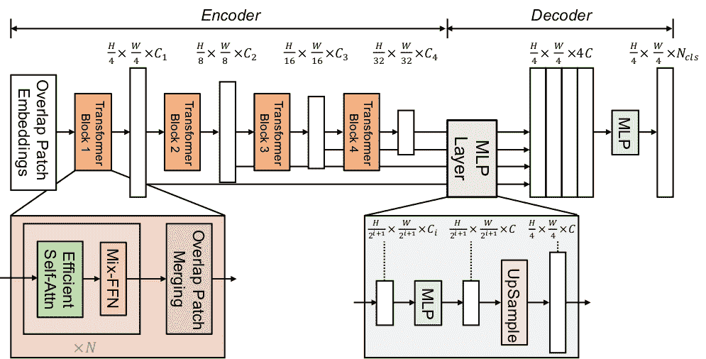

# SegFormer

> 原始文本：[`huggingface.co/docs/transformers/v4.37.2/en/model_doc/segformer`](https://huggingface.co/docs/transformers/v4.37.2/en/model_doc/segformer)

## 概述

SegFormer 模型是由 Enze Xie、Wenhai Wang、Zhiding Yu、Anima Anandkumar、Jose M. Alvarez、Ping Luo 在[SegFormer: Simple and Efficient Design for Semantic Segmentation with Transformers](https://arxiv.org/abs/2105.15203)中提出的。该模型由一个分层 Transformer 编码器和一个轻量级的全 MLP 解码头组成，以在 ADE20K 和 Cityscapes 等图像分割基准上取得出色的结果。

论文摘要如下：

*我们提出了 SegFormer，这是一个简单、高效但功能强大的语义分割框架，将 Transformer 与轻量级多层感知（MLP）解码器统一起来。SegFormer 具有两个吸引人的特点：1）SegFormer 包括一个新颖的分层结构 Transformer 编码器，输出多尺度特征。它不需要位置编码，因此避免了位置代码的插值，这会导致测试分辨率与训练不同时性能下降。2）SegFormer 避免了复杂的解码器。所提出的 MLP 解码器从不同层中聚合信息，从而结合了局部注意力和全局注意力，以生成强大的表示。我们展示了这种简单且轻量级的设计是实现 Transformer 上高效分割的关键。我们将我们的方法扩展到从 SegFormer-B0 到 SegFormer-B5 的一系列模型，达到了比以前更好的性能和效率。例如，SegFormer-B4 在 ADE20K 上达到了 50.3%的 mIoU，参数为 64M，比以前最佳方法小 5 倍，效果提高了 2.2%。我们最好的模型 SegFormer-B5 在 Cityscapes 验证集上达到了 84.0%的 mIoU，并在 Cityscapes-C 上展现出出色的零样本鲁棒性。*

下图展示了 SegFormer 的架构。摘自[原始论文](https://arxiv.org/abs/2105.15203)。



这个模型是由[nielsr](https://huggingface.co/nielsr)贡献的。模型的 TensorFlow 版本是由[sayakpaul](https://huggingface.co/sayakpaul)贡献的。原始代码可以在[这里](https://github.com/NVlabs/SegFormer)找到。

## 使用提示

+   SegFormer 由一个分层 Transformer 编码器和一个轻量级的全 MLP 解码器头组成。SegformerModel 是分层 Transformer 编码器（在论文中也称为 Mix Transformer 或 MiT）。SegformerForSemanticSegmentation 在顶部添加了全 MLP 解码器头，用于执行图像的语义分割。此外，还有 SegformerForImageClassification，可用于对图像进行分类。SegFormer 的作者首先在 ImageNet-1k 上对 Transformer 编码器进行了预训练，以对图像进行分类。接下来，他们丢弃了分类头，并用全 MLP 解码头替换。然后，他们在 ADE20K、Cityscapes 和 COCO-stuff 上一起对模型进行微调，这些是语义分割的重要基准。所有检查点都可以在[hub](https://huggingface.co/models?other=segformer)上找到。

+   使用 SegFormer 的最快方法是查看[示例笔记本](https://github.com/NielsRogge/Transformers-Tutorials/tree/master/SegFormer)（展示了推理和在自定义数据上微调的示例）。也可以查看[博客文章](https://huggingface.co/blog/fine-tune-segformer)介绍 SegFormer 并说明如何在自定义数据上进行微调。

+   TensorFlow 用户应参考[此存储库](https://github.com/deep-diver/segformer-tf-transformers)，展示现成的推理和微调。

+   您也可以查看[Hugging Face Spaces 上的交互式演示](https://huggingface.co/spaces/chansung/segformer-tf-transformers)，尝试在自定义图像上使用 SegFormer 模型。

+   SegFormer 适用于任何输入大小，因为它会填充输入，使其可以被`config.patch_sizes`整除。

+   可以使用 SegformerImageProcessor 为模型准备图像和相应的分割图。请注意，此图像处理器相当基础，不包括原始论文中使用的所有数据增强。原始预处理流程（例如 ADE20k 数据集）可以在[这里](https://github.com/NVlabs/SegFormer/blob/master/local_configs/_base_/datasets/ade20k_repeat.py)找到。最重要的预处理步骤是将图像和分割图随机裁剪和填充到相同大小，例如 512x512 或 640x640，然后进行归一化。

+   还有一件事要记住的是，可以使用`reduce_labels`设置为`True`或`False`来初始化 SegformerImageProcessor。在一些数据集（如 ADE20k）中，0 索引用于背景的注释分割图。但是，ADE20k 不包括其 150 个标签中的“背景”类。因此，`reduce_labels`用于减少所有标签 1，并确保不为背景类计算损失（即，它将注释地图中的 0 替换为 255，这是 SegformerForSemanticSegmentation 使用的损失函数的*ignore_index*）。然而，其他数据集使用 0 索引作为背景类，并将此类包含在所有标签中。在这种情况下，应将`reduce_labels`设置为`False`，因为损失也应计算背景类。

+   与大多数模型一样，SegFormer 有不同的大小，详情可以在下表中找到（取自[原始论文](https://arxiv.org/abs/2105.15203)的表 7）。

| **模型变体** | **深度** | **隐藏大小** | **解码器隐藏大小** | **参数（百万）** | **ImageNet-1k Top 1** |
| :-: | --- | --- | :-: | :-: | :-: |
| MiT-b0 | [2, 2, 2, 2] | [32, 64, 160, 256] | 256 | 3.7 | 70.5 |
| MiT-b1 | [2, 2, 2, 2] | [64, 128, 320, 512] | 256 | 14.0 | 78.7 |
| MiT-b2 | [3, 4, 6, 3] | [64, 128, 320, 512] | 768 | 25.4 | 81.6 |
| MiT-b3 | [3, 4, 18, 3] | [64, 128, 320, 512] | 768 | 45.2 | 83.1 |
| MiT-b4 | [3, 8, 27, 3] | [64, 128, 320, 512] | 768 | 62.6 | 83.6 |
| MiT-b5 | [3, 6, 40, 3] | [64, 128, 320, 512] | 768 | 82.0 | 83.8 |

请注意，上表中的 MiT 指的是 SegFormer 中引入的 Mix Transformer 编码器骨干。有关 SegFormer 在 ADE20k 等分割数据集上的结果，请参阅[论文](https://arxiv.org/abs/2105.15203)。

## 资源

一个官方 Hugging Face 和社区（由🌎表示）资源列表，帮助您开始使用 SegFormer。

图像分类

+   SegformerForImageClassification 由这个[示例脚本](https://github.com/huggingface/transformers/tree/main/examples/pytorch/image-classification)和[笔记本](https://colab.research.google.com/github/huggingface/notebooks/blob/main/examples/image_classification.ipynb)支持。

+   图像分类任务指南

语义分割：

+   SegformerForSemanticSegmentation 由这个[示例脚本](https://github.com/huggingface/transformers/tree/main/examples/pytorch/semantic-segmentation)支持。

+   关于在自定义数据集上微调 SegFormer 的博客可以在[这里](https://huggingface.co/blog/fine-tune-segformer)找到。

+   在 SegFormer 上有更多演示笔记本（包括对自定义数据集的推理和微调），可以在[这里](https://github.com/NielsRogge/Transformers-Tutorials/tree/master/SegFormer)找到。

+   TFSegformerForSemanticSegmentation 由这个[示例笔记本](https://github.com/huggingface/notebooks/blob/main/examples/semantic_segmentation-tf.ipynb)支持。

+   语义分割任务指南

如果您有兴趣提交资源以包含在此处，请随时打开 Pull Request，我们将对其进行审查！资源应该展示一些新东西，而不是重复现有资源。

## SegformerConfig

### `class transformers.SegformerConfig`

[< source >](https://github.com/huggingface/transformers/blob/v4.37.2/src/transformers/models/segformer/configuration_segformer.py#L38)

```py
( num_channels = 3 num_encoder_blocks = 4 depths = [2, 2, 2, 2] sr_ratios = [8, 4, 2, 1] hidden_sizes = [32, 64, 160, 256] patch_sizes = [7, 3, 3, 3] strides = [4, 2, 2, 2] num_attention_heads = [1, 2, 5, 8] mlp_ratios = [4, 4, 4, 4] hidden_act = 'gelu' hidden_dropout_prob = 0.0 attention_probs_dropout_prob = 0.0 classifier_dropout_prob = 0.1 initializer_range = 0.02 drop_path_rate = 0.1 layer_norm_eps = 1e-06 decoder_hidden_size = 256 semantic_loss_ignore_index = 255 **kwargs )
```

参数

+   `num_channels` (`int`, *optional*, defaults to 3) — 输入通道的数量。

+   `num_encoder_blocks` (`int`, *optional*, defaults to 4) — 编码器块的数量（即 Mix Transformer 编码器中的阶段）。

+   `depths` (`List[int]`, *optional*, defaults to `[2, 2, 2, 2]`) — 每个编码器块中的层数。

+   `sr_ratios` (`List[int]`, *optional*, defaults to `[8, 4, 2, 1]`) — 每个编码器块中的序列缩减比率。

+   `hidden_sizes` (`List[int]`, *optional*, defaults to `[32, 64, 160, 256]`) — 每个编码器块的维度。

+   `patch_sizes` (`List[int]`, *optional*, defaults to `[7, 3, 3, 3]`) — 每个编码器块之前的补丁大小。

+   `strides` (`List[int]`, *optional*, defaults to `[4, 2, 2, 2]`) — 每个编码器块之前的步幅。

+   `num_attention_heads` (`List[int]`, *optional*, defaults to `[1, 2, 5, 8]`) — 每个 Transformer 编码器块中每个注意力层的注意力头数量。

+   `mlp_ratios` (`List[int]`, *optional*, defaults to `[4, 4, 4, 4]`) — 编码器块中 Mix FFN 的隐藏层大小与输入层大小的比率。

+   `hidden_act` (`str` or `function`, *optional*, defaults to `"gelu"`) — 编码器和池化器中的非线性激活函数（函数或字符串）。如果是字符串，支持`"gelu"`、`"relu"`、`"selu"`和`"gelu_new"`。

+   `hidden_dropout_prob` (`float`, *optional*, defaults to 0.0) — 嵌入层、编码器和池化器中所有全连接层的 dropout 概率。

+   `attention_probs_dropout_prob` (`float`, *optional*, defaults to 0.0) — 注意力概率的 dropout 比率。

+   `classifier_dropout_prob` (`float`, *optional*, defaults to 0.1) — 分类头之前的 dropout 概率。

+   `initializer_range` (`float`, *optional*, defaults to 0.02) — 用于初始化所有权重矩阵的截断正态初始化器的标准差。

+   `drop_path_rate` (`float`, *optional*, defaults to 0.1) — 随机深度中用于块的 dropout 概率，用于 Transformer 编码器中的块。

+   `layer_norm_eps` (`float`, *optional*, defaults to 1e-06) — 层归一化层使用的 epsilon。

+   `decoder_hidden_size` (`int`, *optional*, defaults to 256) — 所有 MLP 解码头的维度。

+   `semantic_loss_ignore_index` (`int`, *optional*, defaults to 255) — 语义分割模型的损失函数中被忽略的索引。

这是用于存储 SegformerModel 配置的配置类。它用于根据指定的参数实例化 SegFormer 模型，定义模型架构。使用默认值实例化配置将产生类似于 SegFormer [nvidia/segformer-b0-finetuned-ade-512-512](https://huggingface.co/nvidia/segformer-b0-finetuned-ade-512-512)架构的配置。

配置对象继承自 PretrainedConfig，可用于控制模型输出。阅读来自 PretrainedConfig 的文档以获取更多信息。

示例：

```py
>>> from transformers import SegformerModel, SegformerConfig

>>> # Initializing a SegFormer nvidia/segformer-b0-finetuned-ade-512-512 style configuration
>>> configuration = SegformerConfig()

>>> # Initializing a model from the nvidia/segformer-b0-finetuned-ade-512-512 style configuration
>>> model = SegformerModel(configuration)

>>> # Accessing the model configuration
>>> configuration = model.config
```

## SegformerFeatureExtractor

### `class transformers.SegformerFeatureExtractor`

[<来源>](https://github.com/huggingface/transformers/blob/v4.37.2/src/transformers/models/segformer/feature_extraction_segformer.py#L26)

```py
( *args **kwargs )
```

#### `__call__`

[<来源>](https://github.com/huggingface/transformers/blob/v4.37.2/src/transformers/models/segformer/image_processing_segformer.py#L296)

```py
( images segmentation_maps = None **kwargs )
```

对一批图像和可选的分割地图进行预处理。

覆盖`Preprocessor`类的`__call__`方法，以便可以将图像和分割地图作为位置参数传递。

#### `post_process_semantic_segmentation`

[<来源>](https://github.com/huggingface/transformers/blob/v4.37.2/src/transformers/models/segformer/image_processing_segformer.py#L441)

```py
( outputs target_sizes: List = None ) → export const metadata = 'undefined';semantic_segmentation
```

参数

+   `outputs`（SegformerForSemanticSegmentation） — 模型的原始输出。

+   `target_sizes`（长度为`batch_size`的`List[Tuple]`，*可选*） — 每个预测的请求最终大小（高度，宽度）的元组列表。如果未设置，预测将不会被调整大小。

返回

语义分割

长度为`batch_size`的`List[torch.Tensor]`，其中每个项目都是形状为（高度，宽度）的语义分割地图，对应于`target_sizes`条目（如果指定了`target_sizes`）。每个`torch.Tensor`的每个条目对应于一个语义类别 id。

将 SegformerForSemanticSegmentation 的输出转换为语义分割地图。仅支持 PyTorch。

## SegformerImageProcessor

### `class transformers.SegformerImageProcessor`

[<来源>](https://github.com/huggingface/transformers/blob/v4.37.2/src/transformers/models/segformer/image_processing_segformer.py#L49)

```py
( do_resize: bool = True size: Dict = None resample: Resampling = <Resampling.BILINEAR: 2> do_rescale: bool = True rescale_factor: Union = 0.00392156862745098 do_normalize: bool = True image_mean: Union = None image_std: Union = None do_reduce_labels: bool = False **kwargs )
```

参数

+   `do_resize` (`bool`，*可选*，默认为`True`) — 是否将图像的（高度，宽度）维度调整为指定的`（size["height"]，size["width"]）`。可以通过`preprocess`方法中的`do_resize`参数进行覆盖。

+   `size`（`Dict[str, int]` *可选*，默认为`{"height" -- 512, "width": 512}`）：调整大小后的输出图像大小。可以通过`preprocess`方法中的`size`参数进行覆盖。

+   `resample`（`PILImageResampling`，*可选*，默认为`Resampling.BILINEAR`） — 如果调整图像大小，则要使用的重采样滤波器。可以通过`preprocess`方法中的`resample`参数进行覆盖。

+   `do_rescale` (`bool`，*可选*，默认为`True`) — 是否按指定比例`rescale_factor`重新缩放图像。可以通过`preprocess`方法中的`do_rescale`参数进行覆盖。

+   `rescale_factor`（`int`或`float`，*可选*，默认为`1/255`） — 是否对图像进行归一化。可以通过`preprocess`方法中的`do_normalize`参数进行覆盖。

+   `do_normalize` (`bool`，*可选*，默认为`True`) — 是否对图像进行归一化。可以通过`preprocess`方法中的`do_normalize`参数进行覆盖。

+   `image_mean` (`float` 或 `List[float]`, *可选*, 默认为 `IMAGENET_STANDARD_MEAN`) — 如果对图像进行归一化，要使用的均值。这是一个浮点数或与图像通道数相同长度的浮点数列表。可以通过 `preprocess` 方法中的 `image_mean` 参数覆盖。

+   `image_std` (`float` 或 `List[float]`, *可选*, 默认为 `IMAGENET_STANDARD_STD`) — 如果对图像进行归一化，要使用的标准差。这是一个浮点数或与图像通道数相同长度的浮点数列表。可以通过 `preprocess` 方法中的 `image_std` 参数覆盖。

+   `do_reduce_labels` (`bool`, *可选*, 默认为 `False`) — 是否减少分割地图的所有标签值。通常用于数据集中将 0 用于背景，并且背景本身不包含在数据集的所有类中（例如 ADE20k）。背景标签将被替换为 255。可以通过 `preprocess` 方法中的 `do_reduce_labels` 参数覆盖。

构造一个 Segformer 图像处理器。

#### `preprocess`

[<来源>](https://github.com/huggingface/transformers/blob/v4.37.2/src/transformers/models/segformer/image_processing_segformer.py#L305)

```py
( images: Union segmentation_maps: Union = None do_resize: Optional = None size: Optional = None resample: Resampling = None do_rescale: Optional = None rescale_factor: Optional = None do_normalize: Optional = None image_mean: Union = None image_std: Union = None do_reduce_labels: Optional = None return_tensors: Union = None data_format: ChannelDimension = <ChannelDimension.FIRST: 'channels_first'> input_data_format: Union = None **kwargs )
```

参数

+   `images` (`ImageInput`) — 要预处理的图像。期望单个或批量图像，像素值范围为 0 到 255。如果传入像素值在 0 到 1 之间的图像，请设置 `do_rescale=False`。

+   `segmentation_maps` (`ImageInput`, *可选*) — 要预处理的分割地图。

+   `do_resize` (`bool`, *可选*, 默认为 `self.do_resize`) — 是否调整图像大小。

+   `size` (`Dict[str, int]`, *可选*, 默认为 `self.size`) — 应用 `resize` 后的图像大小。

+   `resample` (`int`, *可选*, 默认为 `self.resample`) — 调整图像大小时要使用的重采样滤波器。可以是枚举 `PILImageResampling` 中的一个。仅在 `do_resize` 设置为 `True` 时有效。

+   `do_rescale` (`bool`, *可选*, 默认为 `self.do_rescale`) — 是否将图像值重新缩放为 [0 - 1]。

+   `rescale_factor` (`float`, *可选*, 默认为 `self.rescale_factor`) — 如果 `do_rescale` 设置为 `True`，则按照此因子重新缩放图像。

+   `do_normalize` (`bool`, *可选*, 默认为 `self.do_normalize`) — 是否对图像进行归一化。

+   `image_mean` (`float` 或 `List[float]`, *可选*, 默认为 `self.image_mean`) — 图像均值。

+   `image_std` (`float` 或 `List[float]`, *可选*, 默认为 `self.image_std`) — 图像标准差。

+   `do_reduce_labels` (`bool`, *可选*, 默认为 `self.do_reduce_labels`) — 是否减少分割地图的所有标签值。通常用于数据集中将 0 用于背景，并且背景本身不包含在数据集的所有类中（例如 ADE20k）。背景标签将被替换为 255。

+   `return_tensors` (`str` 或 `TensorType`, *可选*) — 要返回的张量类型。可以是以下之一：

    +   未设置: 返回一个 `np.ndarray` 列表。

    +   `TensorType.TENSORFLOW` 或 `'tf'`: 返回类型为 `tf.Tensor` 的批处理。

    +   `TensorType.PYTORCH` 或 `'pt'`: 返回类型为 `torch.Tensor` 的批处理。

    +   `TensorType.NUMPY` 或 `'np'`: 返回类型为 `np.ndarray` 的批处理。

    +   `TensorType.JAX` 或 `'jax'`: 返回类型为 `jax.numpy.ndarray` 的批处理。

+   `data_format` (`ChannelDimension` 或 `str`, *可选*, 默认为 `ChannelDimension.FIRST`) — 输出图像的通道维度格式。可以是以下之一：

    +   `ChannelDimension.FIRST`: 图像以 (通道数, 高度, 宽度) 格式。

    +   `ChannelDimension.LAST`: 图像以 (高度, 宽度, 通道数) 格式。

+   `input_data_format` (`ChannelDimension` 或 `str`, *可选*) — 输入图像的通道维度格式。如果未设置，则从输入图像中推断通道维度格式。可以是以下之一：

    +   `"channels_first"` 或 `ChannelDimension.FIRST`: 图像以 (通道数, 高度, 宽度) 格式。

    +   `"channels_last"` 或 `ChannelDimension.LAST`: 图像以 (高度, 宽度, 通道数) 格式。

    +   `"none"` 或 `ChannelDimension.NONE`：图像以 (高度，宽度) 格式。

预处理图像或图像批处理。

#### `post_process_semantic_segmentation`

[< source >](https://github.com/huggingface/transformers/blob/v4.37.2/src/transformers/models/segformer/image_processing_segformer.py#L441)

```py
( outputs target_sizes: List = None ) → export const metadata = 'undefined';semantic_segmentation
```

参数

+   `outputs` (SegformerForSemanticSegmentation) — 模型的原始输出。

+   `target_sizes` (`List[Tuple]` of length `batch_size`, *optional*) — 每个预测的请求最终大小（高度，宽度）对应的元组列表。如果未设置，预测将不会被调整大小。

返回

semantic_segmentation

`List[torch.Tensor]` of length `batch_size`，其中每个项目是形状为（高度，宽度）的语义分割地图，对应于 `target_sizes` 条目（如果指定了 `target_sizes`）。每个 `torch.Tensor` 的每个条目对应于一个语义类别 id。

将 SegformerForSemanticSegmentation 的输出转换为语义分割地图。仅支持 PyTorch。

PytorchHide Pytorch content

## SegformerModel

### `class transformers.SegformerModel`

[< source >](https://github.com/huggingface/transformers/blob/v4.37.2/src/transformers/models/segformer/modeling_segformer.py#L506)

```py
( config )
```

参数

+   `config` (SegformerConfig) — 包含模型所有参数的模型配置类。使用配置文件初始化不会加载与模型相关的权重，只会加载配置。查看 from_pretrained() 方法以加载模型权重。

裸的 SegFormer 编码器（Mix-Transformer）输出原始隐藏状态，没有特定的头部。这个模型是一个 PyTorch [torch.nn.Module](https://pytorch.org/docs/stable/nn.html#torch.nn.Module) 子类。将其用作常规的 PyTorch 模块，并参考 PyTorch 文档以获取有关一般用法和行为的所有相关信息。

#### `forward`

[< source >](https://github.com/huggingface/transformers/blob/v4.37.2/src/transformers/models/segformer/modeling_segformer.py#L529)

```py
( pixel_values: FloatTensor output_attentions: Optional = None output_hidden_states: Optional = None return_dict: Optional = None ) → export const metadata = 'undefined';transformers.modeling_outputs.BaseModelOutput or tuple(torch.FloatTensor)
```

参数

+   `pixel_values` (`torch.FloatTensor`，形状为 `(batch_size, num_channels, height, width)`) — 像素值。默认情况下将忽略填充。可以使用 AutoImageProcessor 获取像素值。有关详细信息，请参阅 SegformerImageProcessor.`call`()。

+   `output_attentions` (`bool`, *optional*) — 是否返回所有注意力层的注意力张量。有关更多详细信息，请查看返回的张量下的 `attentions`。

+   `output_hidden_states` (`bool`, *optional*) — 是否返回所有层的隐藏状态。有关更多详细信息，请查看返回的张量下的 `hidden_states`。

+   `return_dict` (`bool`, *optional*) — 是否返回一个 ModelOutput 而不是一个普通元组。

返回

transformers.modeling_outputs.BaseModelOutput 或 `tuple(torch.FloatTensor)`

一个 transformers.modeling_outputs.BaseModelOutput 或一个 `torch.FloatTensor` 元组（如果传递了 `return_dict=False` 或当 `config.return_dict=False` 时）包含根据配置（SegformerConfig）和输入的各种元素。

+   `last_hidden_state` (`torch.FloatTensor`，形状为`(batch_size, sequence_length, hidden_size)`) — 模型最后一层的隐藏状态序列输出。

+   `hidden_states` (`tuple(torch.FloatTensor)`，*可选*，当传递`output_hidden_states=True`或`config.output_hidden_states=True`时返回） — 形状为`(batch_size, sequence_length, hidden_size)`的`torch.FloatTensor`元组（如果模型有嵌入层，则为嵌入输出的一个+每层输出的一个）。

    模型在每一层输出的隐藏状态以及可选的初始嵌入输出。

+   `attentions` (`tuple(torch.FloatTensor)`，*可选*，当传递`output_attentions=True`或`config.output_attentions=True`时返回） — 形状为`(batch_size, num_heads, sequence_length, sequence_length)`的`torch.FloatTensor`元组（每层一个）。

    注意力 softmax 后的注意力权重，用于计算自注意力头中的加权平均值。

SegformerModel 的前向方法，覆盖了`__call__`特殊方法。

虽然前向传递的步骤需要在此函数内定义，但应该在此之后调用`Module`实例，而不是在此处调用，因为前者会处理运行前后处理步骤，而后者会默默地忽略它们。

示例：

```py
>>> from transformers import AutoImageProcessor, SegformerModel
>>> import torch
>>> from datasets import load_dataset

>>> dataset = load_dataset("huggingface/cats-image")
>>> image = dataset["test"]["image"][0]

>>> image_processor = AutoImageProcessor.from_pretrained("nvidia/mit-b0")
>>> model = SegformerModel.from_pretrained("nvidia/mit-b0")

>>> inputs = image_processor(image, return_tensors="pt")

>>> with torch.no_grad():
...     outputs = model(**inputs)

>>> last_hidden_states = outputs.last_hidden_state
>>> list(last_hidden_states.shape)
[1, 256, 16, 16]
```

## SegformerDecodeHead

### `class transformers.SegformerDecodeHead`

[<来源>](https://github.com/huggingface/transformers/blob/v4.37.2/src/transformers/models/segformer/modeling_segformer.py#L681)

```py
( config )
```

#### `forward`

[<来源>](https://github.com/huggingface/transformers/blob/v4.37.2/src/transformers/models/segformer/modeling_segformer.py#L706)

```py
( encoder_hidden_states: FloatTensor )
```

## SegformerForImageClassification

### `class transformers.SegformerForImageClassification`

[<来源>](https://github.com/huggingface/transformers/blob/v4.37.2/src/transformers/models/segformer/modeling_segformer.py#L568)

```py
( config )
```

参数

+   `config`（SegformerConfig） — 具有模型所有参数的模型配置类。使用配置文件初始化不会加载与模型相关的权重，只会加载配置。查看 from_pretrained()方法以加载模型权重。

SegFormer 模型变换器，顶部带有图像分类头（最终隐藏状态的线性层），例如用于 ImageNet。

这个模型是 PyTorch [torch.nn.Module](https://pytorch.org/docs/stable/nn.html#torch.nn.Module) 的子类。将其用作常规的 PyTorch 模块，并参考 PyTorch 文档以获取与一般用法和行为相关的所有内容。

#### `forward`

[<来源>](https://github.com/huggingface/transformers/blob/v4.37.2/src/transformers/models/segformer/modeling_segformer.py#L588)

```py
( pixel_values: Optional = None labels: Optional = None output_attentions: Optional = None output_hidden_states: Optional = None return_dict: Optional = None ) → export const metadata = 'undefined';transformers.models.segformer.modeling_segformer.SegFormerImageClassifierOutput or tuple(torch.FloatTensor)
```

参数

+   `pixel_values` (`torch.FloatTensor`，形状为`(batch_size, num_channels, height, width)`) — 像素值。默认情况下将忽略填充。可以使用 AutoImageProcessor 获取像素值。有关详细信息，请参阅 SegformerImageProcessor.`call`()。

+   `output_attentions` (`bool`，*可选*) — 是否返回所有注意力层的注意力张量。有关更多详细信息，请参阅返回张量中的`attentions`。

+   `output_hidden_states` (`bool`，*可选*) — 是否返回所有层的隐藏状态。有关更多详细信息，请参阅返回张量中的`hidden_states`。

+   `return_dict` (`bool`，*可选*) — 是否返回一个 ModelOutput 而不是一个普通元组。

+   `labels`（形状为`(batch_size,)`的`torch.LongTensor`，*可选*）— 用于计算图像分类/回归损失的标签。索引应在`[0, ..., config.num_labels - 1]`范围内。如果`config.num_labels == 1`，则计算回归损失（均方损失），如果`config.num_labels > 1`，则计算分类损失（交叉熵）。

返回值

`transformers.models.segformer.modeling_segformer.SegFormerImageClassifierOutput`或`tuple(torch.FloatTensor)`

一个`transformers.models.segformer.modeling_segformer.SegFormerImageClassifierOutput`或一个`torch.FloatTensor`元组（如果传递`return_dict=False`或`config.return_dict=False`时）包含各种元素，取决于配置（SegformerConfig）和输入。

+   `loss`（形状为`(1,)`的`torch.FloatTensor`，*可选*，当提供`labels`时返回）— 分类（或回归，如果`config.num_labels==1`）损失。

+   `logits`（形状为`(batch_size, config.num_labels)`的`torch.FloatTensor`）— 分类（或回归，如果`config.num_labels==1`）得分（SoftMax 之前）。

+   `hidden_states`（`tuple(torch.FloatTensor)`，*可选*，当传递`output_hidden_states=True`或`config.output_hidden_states=True`时返回）— 形状为`(batch_size, num_channels, height, width)`的`torch.FloatTensor`元组。模型在每个阶段输出的隐藏状态（也称为特征图）。

+   `attentions`（`tuple(torch.FloatTensor)`，*可选*，当传递`output_attentions=True`或`config.output_attentions=True`时返回）— 形状为`(batch_size, num_heads, patch_size, sequence_length)`的`torch.FloatTensor`元组（每层一个）。

    在自注意力头中用于计算加权平均值的注意力 softmax 之后的注意力权重。

SegformerForImageClassification 的前向方法，覆盖了`__call__`特殊方法。

尽管前向传递的配方需要在此函数内定义，但应该在此之后调用`Module`实例，而不是这个，因为前者负责运行预处理和后处理步骤，而后者则默默地忽略它们。

示例：

```py
>>> from transformers import AutoImageProcessor, SegformerForImageClassification
>>> import torch
>>> from datasets import load_dataset

>>> dataset = load_dataset("huggingface/cats-image")
>>> image = dataset["test"]["image"][0]

>>> image_processor = AutoImageProcessor.from_pretrained("nvidia/mit-b0")
>>> model = SegformerForImageClassification.from_pretrained("nvidia/mit-b0")

>>> inputs = image_processor(image, return_tensors="pt")

>>> with torch.no_grad():
...     logits = model(**inputs).logits

>>> # model predicts one of the 1000 ImageNet classes
>>> predicted_label = logits.argmax(-1).item()
>>> print(model.config.id2label[predicted_label])
tabby, tabby cat
```

## SegformerForSemanticSegmentation

### `class transformers.SegformerForSemanticSegmentation`

[<来源>](https://github.com/huggingface/transformers/blob/v4.37.2/src/transformers/models/segformer/modeling_segformer.py#L739)

```py
( config )
```

参数

+   `config`（SegformerConfig）— 具有模型所有参数的模型配置类。使用配置文件初始化不会加载与模型相关的权重，只会加载配置。查看 from_pretrained()方法以加载模型权重。

SegFormer 模型变换器，顶部带有全 MLP 解码头，例如用于 ADE20k、CityScapes。此模型是 PyTorch [torch.nn.Module](https://pytorch.org/docs/stable/nn.html#torch.nn.Module)子类。将其用作常规 PyTorch 模块，并参考 PyTorch 文档以获取有关一般用法和行为的所有相关信息。

#### `forward`

[<来源>](https://github.com/huggingface/transformers/blob/v4.37.2/src/transformers/models/segformer/modeling_segformer.py#L752)

```py
( pixel_values: FloatTensor labels: Optional = None output_attentions: Optional = None output_hidden_states: Optional = None return_dict: Optional = None ) → export const metadata = 'undefined';transformers.modeling_outputs.SemanticSegmenterOutput or tuple(torch.FloatTensor)
```

参数

+   `pixel_values` (`torch.FloatTensor` of shape `(batch_size, num_channels, height, width)`) — 像素值。默认情况下将忽略填充。可以使用 AutoImageProcessor 获取像素值。有关详细信息，请参阅 SegformerImageProcessor.`call`()。

+   `output_attentions` (`bool`, *optional*) — 是否返回所有注意力层的注意力张量。有关更多详细信息，请参阅返回张量下的`attentions`。

+   `output_hidden_states` (`bool`, *optional*) — 是否返回所有层的隐藏状态。有关更多详细信息，请参阅返回张量下的`hidden_states`。

+   `return_dict` (`bool`, *optional*) — 是否返回 ModelOutput 而不是普通元组。

+   `labels` (`torch.LongTensor` of shape `(batch_size, height, width)`, *optional*) — 用于计算损失的地面真实语义分割地图。索引应在`[0, ..., config.num_labels - 1]`范围内。如果`config.num_labels > 1`，则计算分类损失（交叉熵）。

返回

transformers.modeling_outputs.SemanticSegmenterOutput 或 `tuple(torch.FloatTensor)`

transformers.modeling_outputs.SemanticSegmenterOutput 或一个`torch.FloatTensor`元组（如果传递`return_dict=False`或`config.return_dict=False`时）包含各种元素，取决于配置（SegformerConfig）和输入。

+   `loss` (`torch.FloatTensor` of shape `(1,)`, *optional*, 当提供`labels`时返回) — 分类（如果`config.num_labels==1`则为回归）损失。

+   `logits` (`torch.FloatTensor` of shape `(batch_size, config.num_labels, logits_height, logits_width)`) — 每个像素的分类分数。

    <tip warning="{true}">返回的 logits 不一定与传入的`pixel_values`具有相同的大小。这是为了避免进行两次插值并在用户需要将 logits 调整为原始图像大小时丢失一些质量。您应该始终检查您的 logits 形状并根据需要调整大小。</tip>

+   `hidden_states` (`tuple(torch.FloatTensor)`, *optional*, 当传递`output_hidden_states=True`或`config.output_hidden_states=True`时返回) — 形状为`(batch_size, patch_size, hidden_size)`的`torch.FloatTensor`元组（如果模型有嵌入层，则为嵌入输出的一个 + 每个层的输出的一个）。

    模型在每个层的输出的隐藏状态以及可选的初始嵌入输出。

+   `attentions` (`tuple(torch.FloatTensor)`, *optional*, 当传递`output_attentions=True`或`config.output_attentions=True`时返回) — 形状为`(batch_size, num_heads, patch_size, sequence_length)`的`torch.FloatTensor`元组（每个层一个）。

    在注意力 softmax 之后的注意力权重，用于计算自注意力头中的加权平均值。

SegformerForSemanticSegmentation 的前向方法，覆盖`__call__`特殊方法。

虽然前向传递的步骤需要在此函数内定义，但应该在此之后调用`Module`实例，而不是这个，因为前者负责运行预处理和后处理步骤，而后者会默默地忽略它们。

示例：

```py
>>> from transformers import AutoImageProcessor, SegformerForSemanticSegmentation
>>> from PIL import Image
>>> import requests

>>> image_processor = AutoImageProcessor.from_pretrained("nvidia/segformer-b0-finetuned-ade-512-512")
>>> model = SegformerForSemanticSegmentation.from_pretrained("nvidia/segformer-b0-finetuned-ade-512-512")

>>> url = "http://images.cocodataset.org/val2017/000000039769.jpg"
>>> image = Image.open(requests.get(url, stream=True).raw)

>>> inputs = image_processor(images=image, return_tensors="pt")
>>> outputs = model(**inputs)
>>> logits = outputs.logits  # shape (batch_size, num_labels, height/4, width/4)
>>> list(logits.shape)
[1, 150, 128, 128]
```

TensorFlow 隐藏了 TensorFlow 内容

## TFSegformerDecodeHead

### `class transformers.TFSegformerDecodeHead`

[<来源>](https://github.com/huggingface/transformers/blob/v4.37.2/src/transformers/models/segformer/modeling_tf_segformer.py#L842)

```py
( config: SegformerConfig **kwargs )
```

#### `call`

[<来源>](https://github.com/huggingface/transformers/blob/v4.37.2/src/transformers/models/segformer/modeling_tf_segformer.py#L864)

```py
( encoder_hidden_states: tf.Tensor training: bool = False )
```

## TFSegformerModel

### `class transformers.TFSegformerModel`

[<来源>](https://github.com/huggingface/transformers/blob/v4.37.2/src/transformers/models/segformer/modeling_tf_segformer.py#L693)

```py
( config: SegformerConfig *inputs **kwargs )
```

参数

+   `config` (SegformerConfig) — 具有模型所有参数的模型配置类。使用配置文件初始化不会加载与模型关联的权重，只会加载配置。查看 from_pretrained() 方法以加载模型权重。

裸的 SegFormer 编码器（Mix-Transformer）输出原始隐藏状态，没有特定的头部。此模型继承自 TFPreTrainedModel。检查超类文档以获取库为所有模型实现的通用方法（例如下载或保存、调整输入嵌入、修剪头等）。

这个模型也是一个 [tf.keras.Model](https://www.tensorflow.org/api_docs/python/tf/keras/Model) 的子类。将其用作常规的 TF 2.0 Keras 模型，并参考 TF 2.0 文档以获取有关一般用法和行为的所有相关信息。

#### `call`

[<来源>](https://github.com/huggingface/transformers/blob/v4.37.2/src/transformers/models/segformer/modeling_tf_segformer.py#L705)

```py
( pixel_values: tf.Tensor output_attentions: Optional[bool] = None output_hidden_states: Optional[bool] = None return_dict: Optional[bool] = None training: bool = False ) → export const metadata = 'undefined';transformers.modeling_tf_outputs.TFBaseModelOutput or tuple(tf.Tensor)
```

参数

+   `pixel_values` (`np.ndarray`, `tf.Tensor`, `List[tf.Tensor]` ``Dict[str, tf.Tensor]` 或 `Dict[str, np.ndarray]`，每个示例的形状必须为 `(batch_size, num_channels, height, width)`) — 像素值。像素值可以使用 AutoImageProcessor 获取。有关详细信息，请参见 SegformerImageProcessor.`call`()。

+   `output_attentions` (`bool`, *可选*) — 是否返回所有注意力层的注意力张量。有关更多详细信息，请参见返回张量下的 `attentions`。此参数仅在急切模式下可用，在图模式下将使用配置中的值。

+   `output_hidden_states` (`bool`, *可选*) — 是否返回所有层的隐藏状态。有关更多详细信息，请参见返回张量下的 `hidden_states`。此参数仅在急切模式下可用，在图模式下将使用配置中的值。

+   `return_dict` (`bool`, *可选*) — 是否返回 ModelOutput 而不是普通元组。此参数可以在急切模式下使用，在图模式下该值将始终设置为 True。

+   `training` (`bool`, *可选*，默认为 `False“) — 是否在训练模式下使用模型（一些模块，如 dropout 模块，在训练和评估之间有不同的行为）。

返回

transformers.modeling_tf_outputs.TFBaseModelOutput 或 `tuple(tf.Tensor)`

一个 transformers.modeling_tf_outputs.TFBaseModelOutput 或一个 `tf.Tensor` 元组（如果传递了 `return_dict=False` 或当 `config.return_dict=False` 时）包含各种元素，具体取决于配置（SegformerConfig）和输入。

+   `last_hidden_state` (`tf.Tensor`，形状为`(batch_size, sequence_length, hidden_size)`) — 模型最后一层的隐藏状态序列。

+   `hidden_states` (`tuple(tf.FloatTensor)`，*可选*，当传递`output_hidden_states=True`或`config.output_hidden_states=True`时返回） — 形状为`(batch_size, sequence_length, hidden_size)`的`tf.Tensor`元组（一个用于嵌入的输出 + 一个用于每个层的输出）。

    模型在每个层的输出隐藏状态加上初始嵌入输出。

+   `attentions`（`tuple(tf.Tensor)`，*可选*，当传递`output_attentions=True`或`config.output_attentions=True`时返回） — 形状为`(batch_size, num_heads, sequence_length, sequence_length)`的`tf.Tensor`元组（每个层一个）。

    注意力权重在注意力 softmax 之后，用于计算自注意力头中的加权平均值。

TFSegformerModel 的前向方法，覆盖了`__call__`特殊方法。

虽然前向传递的步骤需要在此函数内定义，但应该在此之后调用`Module`实例，而不是在此处调用，因为前者会负责运行预处理和后处理步骤，而后者会默默地忽略它们。

示例：

```py
>>> from transformers import AutoImageProcessor, TFSegformerModel
>>> from datasets import load_dataset

>>> dataset = load_dataset("huggingface/cats-image")
>>> image = dataset["test"]["image"][0]

>>> image_processor = AutoImageProcessor.from_pretrained("nvidia/mit-b0")
>>> model = TFSegformerModel.from_pretrained("nvidia/mit-b0")

>>> inputs = image_processor(image, return_tensors="tf")
>>> outputs = model(**inputs)

>>> last_hidden_states = outputs.last_hidden_state
>>> list(last_hidden_states.shape)
[1, 256, 16, 16]
```

## TFSegformerForImageClassification

### `class transformers.TFSegformerForImageClassification`

[<来源>](https://github.com/huggingface/transformers/blob/v4.37.2/src/transformers/models/segformer/modeling_tf_segformer.py#L740)

```py
( config: SegformerConfig *inputs **kwargs )
```

参数

+   `config`（SegformerConfig） — 具有模型所有参数的模型配置类。使用配置文件初始化不会加载与模型关联的权重，只会加载配置。查看 from_pretrained()方法以加载模型权重。

SegFormer 模型变压器，顶部带有图像分类头（最终隐藏状态顶部的线性层），例如用于 ImageNet。

此模型继承自 TFPreTrainedModel。检查超类文档以获取库为其所有模型实现的通用方法（例如下载或保存、调整输入嵌入、修剪头等）。

此模型也是[tf.keras.Model](https://www.tensorflow.org/api_docs/python/tf/keras/Model)子类。将其用作常规的 TF 2.0 Keras 模型，并参考 TF 2.0 文档以获取有关一般用法和行为的所有相关信息。

#### `call`

[<来源>](https://github.com/huggingface/transformers/blob/v4.37.2/src/transformers/models/segformer/modeling_tf_segformer.py#L758)

```py
( pixel_values: tf.Tensor | None = None labels: tf.Tensor | None = None output_attentions: Optional[bool] = None output_hidden_states: Optional[bool] = None return_dict: Optional[bool] = None ) → export const metadata = 'undefined';transformers.modeling_tf_outputs.TFSequenceClassifierOutput or tuple(tf.Tensor)
```

参数

+   `pixel_values`（`np.ndarray`、`tf.Tensor`、`List[tf.Tensor]`、`Dict[str, tf.Tensor]`或`Dict[str, np.ndarray]`，每个示例必须具有形状`(batch_size, num_channels, height, width)`） — 像素值。像素值可以使用 AutoImageProcessor 获取。有关详细信息，请参阅 SegformerImageProcessor.`call`()。

+   `output_attentions` (`bool`，*可选*） — 是否返回所有注意力层的注意力张量。有关更多详细信息，请参阅返回张量下的`attentions`。此参数仅在急切模式下使用，在图模式下将使用配置中的值。

+   `output_hidden_states` (`bool`，*可选*） — 是否返回所有层的隐藏状态。有关更多详细信息，请参阅返回张量下的`hidden_states`。此参数仅在急切模式下使用，在图模式下将使用配置中的值。

+   `return_dict`（`bool`，*可选*）— 是否返回 ModelOutput 而不是普通元组。此参数可在急切模式下使用，在图模式下该值将始终设置为 True。

+   `training`（`bool`，*可选*，默认为`False`）— 是否在训练模式下使用模型（一些模块如 dropout 模块在训练和评估之间有不同的行为）。

返回

transformers.modeling_tf_outputs.TFSequenceClassifierOutput 或`tuple(tf.Tensor)`

一个 transformers.modeling_tf_outputs.TFSequenceClassifierOutput 或一个`tf.Tensor`元组（如果传递了`return_dict=False`或当`config.return_dict=False`时）包括根据配置（SegformerConfig）和输入的各种元素。

+   `loss`（形状为`(batch_size, )`的`tf.Tensor`，*可选*，当提供`labels`时返回）— 分类（如果`config.num_labels==1`则为回归）损失。

+   `logits`（形状为`(batch_size, config.num_labels)`的`tf.Tensor`）— 分类（如果`config.num_labels==1`则为回归）得分（SoftMax 之前）。

+   `hidden_states`（`tuple(tf.Tensor)`，*可选*，当传递`output_hidden_states=True`或当`config.output_hidden_states=True`时返回）— 形状为`(batch_size, sequence_length, hidden_size)`的`tf.Tensor`元组（一个用于嵌入的输出+一个用于每一层的输出）。

    模型在每一层输出处的隐藏状态加上初始嵌入输出。

+   `attentions`（`tuple(tf.Tensor)`，*可选*，当传递`output_attentions=True`或当`config.output_attentions=True`时返回）— 形状为`(batch_size, num_heads, sequence_length, sequence_length)`的`tf.Tensor`元组（每层一个）。

    注意力权重在注意力 softmax 之后，用于计算自注意力头中的加权平均值。

TFSegformerForImageClassification 前向方法，覆盖`__call__`特殊方法。

虽然前向传递的方法需要在此函数内定义，但应该在此之后调用`Module`实例，而不是这个，因为前者负责运行预处理和后处理步骤，而后者会默默地忽略它们。

示例：

```py
>>> from transformers import AutoImageProcessor, TFSegformerForImageClassification
>>> import tensorflow as tf
>>> from datasets import load_dataset

>>> dataset = load_dataset("huggingface/cats-image")
>>> image = dataset["test"]["image"][0]

>>> image_processor = AutoImageProcessor.from_pretrained("nvidia/mit-b0")
>>> model = TFSegformerForImageClassification.from_pretrained("nvidia/mit-b0")

>>> inputs = image_processor(image, return_tensors="tf")
>>> logits = model(**inputs).logits

>>> # model predicts one of the 1000 ImageNet classes
>>> predicted_label = int(tf.math.argmax(logits, axis=-1))
>>> print(model.config.id2label[predicted_label])
tabby, tabby cat
```

## TFSegformerForSemanticSegmentation

### `class transformers.TFSegformerForSemanticSegmentation`

[<来源>](https://github.com/huggingface/transformers/blob/v4.37.2/src/transformers/models/segformer/modeling_tf_segformer.py#L917)

```py
( config: SegformerConfig **kwargs )
```

参数

+   `config`（SegformerConfig）— 包含模型所有参数的模型配置类。使用配置文件初始化不会加载与模型相关的权重，只加载配置。查看 from_pretrained()方法以加载模型权重。

SegFormer 模型变压器，顶部带有全 MLP 解码头，例如用于 ADE20k、CityScapes。此模型继承自 TFPreTrainedModel。检查超类文档以获取库为所有模型实现的通用方法（如下载或保存、调整输入嵌入、修剪头等）。

这个模型也是一个[tf.keras.Model](https://www.tensorflow.org/api_docs/python/tf/keras/Model)子类。将其用作常规的 TF 2.0 Keras 模型，并参考 TF 2.0 文档以获取与一般用法和行为相关的所有内容。

#### `call`

[< source >](https://github.com/huggingface/transformers/blob/v4.37.2/src/transformers/models/segformer/modeling_tf_segformer.py#L947)

```py
( pixel_values: tf.Tensor labels: tf.Tensor | None = None output_attentions: Optional[bool] = None output_hidden_states: Optional[bool] = None return_dict: Optional[bool] = None ) → export const metadata = 'undefined';transformers.modeling_tf_outputs.TFSemanticSegmenterOutput or tuple(tf.Tensor)
```

参数

+   `pixel_values` (`np.ndarray`, `tf.Tensor`, `List[tf.Tensor]` ``Dict[str, tf.Tensor]` 或 `Dict[str, np.ndarray]`，每个示例必须具有形状 `(batch_size, num_channels, height, width)`) — 像素值。可以使用 AutoImageProcessor 获取像素值。有关详细信息，请参阅 SegformerImageProcessor.`call`()。

+   `output_attentions` (`bool`，*可选*) — 是否返回所有注意力层的注意力张量。有关更多详细信息，请参阅返回张量下的 `attentions`。此参数仅可在急切模式下使用，在图模式下将使用配置中的值。

+   `output_hidden_states` (`bool`，*可选*) — 是否返回所有层的隐藏状态。有关更多详细信息，请参阅返回张量下的 `hidden_states`。此参数仅可在急切模式下使用，在图模式下将使用配置中的值。

+   `return_dict` (`bool`，*可选*) — 是否返回 ModelOutput 而不是普通元组。此参数可在急切模式下使用，在图模式下该值将始终设置为 True。

+   `training` (`bool`，*可选*，默认为 `False“) — 是否在训练模式下使用模型（某些模块如 dropout 模块在训练和评估之间具有不同的行为）。

+   `labels` (`tf.Tensor`，形状为 `(batch_size, height, width)`，*可选*) — 用于计算损失的地面真实语义分割地图。索引应在 `[0, ..., config.num_labels - 1]` 范围内。如果 `config.num_labels > 1`，则计算（每像素）分类损失（交叉熵）。

返回

`transformers.modeling_tf_outputs.TFSemanticSegmenterOutput` 或 `tuple(tf.Tensor)`

一个 `transformers.modeling_tf_outputs.TFSemanticSegmenterOutput` 或一个 `tf.Tensor` 元组（如果传递 `return_dict=False` 或 `config.return_dict=False`）包含各种元素，具体取决于配置（SegformerConfig）和输入。

+   `loss` (`tf.Tensor`，形状为 `(1,)`，*可选*，当提供 `labels` 时返回) — 分类（如果 `config.num_labels==1` 则为回归）损失。

+   `logits` (`tf.Tensor`，形状为 `(batch_size, config.num_labels, logits_height, logits_width)`) — 每个像素的分类分数。

    <tip warning="{true}">返回的对数不一定与作为输入传递的 `pixel_values` 具有相同的大小。这是为了避免进行两次插值并在用户需要将对数调整为原始图像大小时丢失一些质量。您应始终检查您的对数形状并根据需要调整大小。</tip>

+   `hidden_states` (`tuple(tf.Tensor)`，*可选*，当传递 `output_hidden_states=True` 或 `config.output_hidden_states=True` 时返回) — 形状为 `(batch_size, patch_size, hidden_size)` 的 `tf.Tensor` 元组（如果模型具有嵌入层，则为嵌入的输出 + 每一层的输出）。

    模型在每一层输出的隐藏状态以及可选的初始嵌入输出。

+   `attentions` (`tuple(tf.Tensor)`，*可选*，当传递 `output_attentions=True` 或 `config.output_attentions=True` 时返回) — 形状为 `(batch_size, num_heads, patch_size, sequence_length)` 的 `tf.Tensor` 元组（每个层一个）。

    注意力权重在注意力 softmax 之后，用于计算自注意力头中的加权平均值。

TFSegformerForSemanticSegmentation 的前向方法，覆盖 `__call__` 特殊方法。

尽管前向传播的配方需要在这个函数内定义，但应该在此之后调用`Module`实例，而不是调用此函数，因为前者会负责运行预处理和后处理步骤，而后者会默默地忽略它们。

示例：

```py
>>> from transformers import AutoImageProcessor, TFSegformerForSemanticSegmentation
>>> from PIL import Image
>>> import requests

>>> url = "http://images.cocodataset.org/val2017/000000039769.jpg"
>>> image = Image.open(requests.get(url, stream=True).raw)

>>> image_processor = AutoImageProcessor.from_pretrained("nvidia/segformer-b0-finetuned-ade-512-512")
>>> model = TFSegformerForSemanticSegmentation.from_pretrained("nvidia/segformer-b0-finetuned-ade-512-512")

>>> inputs = image_processor(images=image, return_tensors="tf")
>>> outputs = model(**inputs, training=False)
>>> # logits are of shape (batch_size, num_labels, height/4, width/4)
>>> logits = outputs.logits
>>> list(logits.shape)
[1, 150, 128, 128]
```
