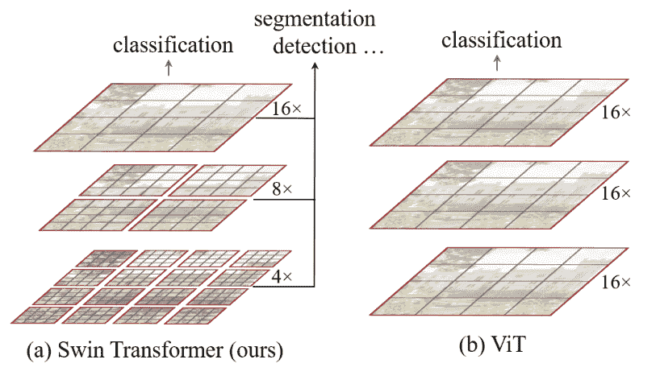

# Swin Transformer

> 原文：[`huggingface.co/docs/transformers/v4.37.2/en/model_doc/swin`](https://huggingface.co/docs/transformers/v4.37.2/en/model_doc/swin)

## 概述

Swin Transformer 是由刘泽、林宇通、曹越、胡涵、魏一轩、张政、林宇、郭百宁在[《Swin Transformer: 使用移位窗口的分层视觉 Transformer》](https://arxiv.org/abs/2103.14030)中提出的。

论文摘要如下：

*本文提出了一种新的视觉 Transformer，称为 Swin Transformer，它能够作为计算机视觉的通用骨干。从语言到视觉的 Transformer 的适应性挑战源于两个领域之间的差异，例如视觉实体的规模变化很大，图像中像素的分辨率与文本中的单词相比要高。为了解决这些差异，我们提出了一种层次化的 Transformer，其表示是通过\bold{S}hifted \bold{win}dows 计算的。移位窗口方案通过将自注意力计算限制在不重叠的局部窗口中，同时允许跨窗口连接，从而带来更高的效率。这种层次化架构具有在各种尺度上建模的灵活性，并且对于图像大小具有线性计算复杂度。Swin Transformer 的这些特性使其与广泛的视觉任务兼容，包括图像分类（在 ImageNet-1K 上的 87.3 top-1 准确率）以及密集预测任务，如目标检测（在 COCO test-dev 上的 58.7 盒子 AP 和 51.1 掩码 AP）和语义分割（在 ADE20K val 上的 53.5 mIoU）。其性能大大超过了以前的最先进技术，COCO 上的+2.7 盒子 AP 和+2.6 掩码 AP，ADE20K 上的+3.2 mIoU，展示了基于 Transformer 的模型作为视觉骨干的潜力。层次设计和移位窗口方法也对所有 MLP 架构有益。*

 Swin Transformer 架构。摘自[原始论文](https://arxiv.org/abs/2102.03334)。

这个模型是由[novice03](https://huggingface.co/novice03)贡献的。这个模型的 Tensorflow 版本是由[amyeroberts](https://huggingface.co/amyeroberts)贡献的。原始代码可以在[这里](https://github.com/microsoft/Swin-Transformer)找到。

## 使用提示

+   Swin 填充输入，支持任何输入高度和宽度（如果可被`32`整除）。

+   Swin 可以用作*骨干*。当 `output_hidden_states = True` 时，它将同时输出 `hidden_states` 和 `reshaped_hidden_states`。`reshaped_hidden_states` 的形状为 `(batch, num_channels, height, width)` 而不是 `(batch_size, sequence_length, num_channels)`。

## 资源

一个官方的 Hugging Face 和社区（由🌎表示）资源列表，帮助您开始使用 Swin Transformer。

图像分类

+   SwinForImageClassification 可以通过这个[示例脚本](https://github.com/huggingface/transformers/tree/main/examples/pytorch/image-classification)和[笔记本](https://colab.research.google.com/github/huggingface/notebooks/blob/main/examples/image_classification.ipynb)来支持。

+   另请参阅：图像分类任务指南

此外：

+   SwinForMaskedImageModeling 可以通过这个[示例脚本](https://github.com/huggingface/transformers/tree/main/examples/pytorch/image-pretraining)来支持。

如果您有兴趣提交资源以包含在此处，请随时提交拉取请求，我们将进行审查！资源应该最好展示一些新东西，而不是重复现有资源。

## SwinConfig

### `class transformers.SwinConfig`

[<来源>](https://github.com/huggingface/transformers/blob/v4.37.2/src/transformers/models/swin/configuration_swin.py#L38)

```py
( image_size = 224 patch_size = 4 num_channels = 3 embed_dim = 96 depths = [2, 2, 6, 2] num_heads = [3, 6, 12, 24] window_size = 7 mlp_ratio = 4.0 qkv_bias = True hidden_dropout_prob = 0.0 attention_probs_dropout_prob = 0.0 drop_path_rate = 0.1 hidden_act = 'gelu' use_absolute_embeddings = False initializer_range = 0.02 layer_norm_eps = 1e-05 encoder_stride = 32 out_features = None out_indices = None **kwargs )
```

参数

+   `image_size` (`int`, *optional*, defaults to 224) — 每个图像的大小（分辨率）。

+   `patch_size` (`int`, *optional*, defaults to 4) — 每个 patch 的大小（分辨率）。

+   `num_channels` (`int`, *optional*, defaults to 3) — 输入通道的数量。

+   `embed_dim` (`int`, *optional*, defaults to 96) — patch 嵌入的维度。

+   `depths` (`list(int)`, *optional*, defaults to `[2, 2, 6, 2]`) — Transformer 编码器中每个层的深度。

+   `num_heads` (`list(int)`, *optional*, defaults to `[3, 6, 12, 24]`) — Transformer 编码器每层中的注意力头数。

+   `window_size` (`int`, *optional*, defaults to 7) — 窗口的大小。

+   `mlp_ratio` (`float`, *optional*, defaults to 4.0) — MLP 隐藏维度与嵌入维度的比率。

+   `qkv_bias` (`bool`, *optional*, defaults to `True`) — 是否应向查询、键和值添加可学习的偏置。

+   `hidden_dropout_prob` (`float`, *optional*, defaults to 0.0) — 嵌入和编码器中所有全连接层的 dropout 概率。

+   `attention_probs_dropout_prob` (`float`, *optional*, defaults to 0.0) — 注意力概率的 dropout 比率。

+   `drop_path_rate` (`float`, *optional*, defaults to 0.1) — 随机深度率。

+   `hidden_act` (`str` or `function`, *optional*, defaults to `"gelu"`) — 编码器中的非线性激活函数（函数或字符串）。如果是字符串，支持`"gelu"`, `"relu"`, `"selu"`和`"gelu_new"`。

+   `use_absolute_embeddings` (`bool`, *optional*, defaults to `False`) — 是否将绝对位置嵌入添加到 patch 嵌入中。

+   `initializer_range` (`float`, *optional*, defaults to 0.02) — 用于初始化所有权重矩阵的 truncated_normal_initializer 的标准差。

+   `layer_norm_eps` (`float`, *optional*, defaults to 1e-05) — 层归一化层使用的 epsilon。

+   `encoder_stride` (`int`, *optional*, defaults to 32) — 用于掩码图像建模中解码器头部增加空间分辨率的因子。

+   `out_features` (`List[str]`, *optional*) — 如果用作 backbone，则输出特征的列表。可以是任何一个`"stem"`, `"stage1"`, `"stage2"`,等（取决于模型有多少阶段）。如果未设置且设置了`out_indices`，将默认为相应的阶段。如果未设置且`out_indices`未设置，将默认为最后一个阶段。必须按照`stage_names`属性中定义的顺序。

+   `out_indices` (`List[int]`, *optional*) — 如果用作 backbone，则输出特征的索引列表。可以是 0, 1, 2 等（取决于模型有多少阶段）。如果未设置且设置了`out_features`，将默认为相应的阶段。如果未设置且`out_features`未设置，将默认为最后一个阶段。必须按照`stage_names`属性中定义的顺序。

这是一个配置类，用于存储 SwinModel 的配置。根据指定的参数实例化一个 Swin 模型，定义模型架构。使用默认值实例化配置将产生类似于[Swin](https://huggingface.co/microsoft/swin-tiny-patch4-window7-224)架构的配置。

配置对象继承自 PretrainedConfig，可用于控制模型输出。阅读 PretrainedConfig 的文档以获取更多信息。

示例：

```py
>>> from transformers import SwinConfig, SwinModel

>>> # Initializing a Swin microsoft/swin-tiny-patch4-window7-224 style configuration
>>> configuration = SwinConfig()

>>> # Initializing a model (with random weights) from the microsoft/swin-tiny-patch4-window7-224 style configuration
>>> model = SwinModel(configuration)

>>> # Accessing the model configuration
>>> configuration = model.config
```

PytorchHide Pytorch content

## SwinModel

### `class transformers.SwinModel`

[< source >](https://github.com/huggingface/transformers/blob/v4.37.2/src/transformers/models/swin/modeling_swin.py#L931)

```py
( config add_pooling_layer = True use_mask_token = False )
```

参数

+   `config` (SwinConfig) — 模型配置类，包含模型的所有参数。使用配置文件初始化不会加载与模型相关的权重，只会加载配置。查看 from_pretrained()方法以加载模型权重。

+   `add_pooling_layer` (`bool`, *可选*, 默认为 `True`) — 是否应用池化层。

+   `use_mask_token` (`bool`, *可选*, 默认为 `False`) — 是否创建和应用嵌入层中的掩码标记。

裸的 Swin 模型变换器，输出原始隐藏状态，没有特定的头部。这个模型是 PyTorch [torch.nn.Module](https://pytorch.org/docs/stable/nn.html#torch.nn.Module) 的子类。将其用作常规的 PyTorch 模块，并参考 PyTorch 文档以获取有关一般用法和行为的所有相关信息。

#### `forward`

[< source >](https://github.com/huggingface/transformers/blob/v4.37.2/src/transformers/models/swin/modeling_swin.py#L968)

```py
( pixel_values: Optional = None bool_masked_pos: Optional = None head_mask: Optional = None output_attentions: Optional = None output_hidden_states: Optional = None return_dict: Optional = None ) → export const metadata = 'undefined';transformers.models.swin.modeling_swin.SwinModelOutput or tuple(torch.FloatTensor)
```

参数

+   `pixel_values` (`torch.FloatTensor`，形状为 `(batch_size, num_channels, height, width)`) — 像素值。像素值可以使用 AutoImageProcessor 获取。查看 ViTImageProcessor.`call`()获取详细信息。

+   `head_mask` (`torch.FloatTensor`，形状为 `(num_heads,)` 或 `(num_layers, num_heads)`，*可选*) — 用于使自注意力模块中选择的头部失效的掩码。在 `[0, 1]` 中选择掩码值：

    +   1 表示头部`未被掩盖`，

    +   0 表示头部`被掩盖`。

+   `output_attentions` (`bool`, *可选*) — 是否返回所有注意力层的注意力张量。有关更多详细信息，请查看返回张量下的 `attentions`。

+   `output_hidden_states` (`bool`, *可选*) — 是否返回所有层的隐藏状态。有关更多详细信息，请查看返回张量下的 `hidden_states`。

+   `return_dict` (`bool`, *可选*) — 是否返回一个 ModelOutput 而不是一个普通的元组。

+   `bool_masked_pos` (`torch.BoolTensor`，形状为 `(batch_size, num_patches)`，*可选*) — 布尔掩码位置。指示哪些补丁被掩盖（1）哪些没有（0）。

返回

`transformers.models.swin.modeling_swin.SwinModelOutput` 或 `tuple(torch.FloatTensor)`

一个 `transformers.models.swin.modeling_swin.SwinModelOutput` 或一个 `torch.FloatTensor` 元组（如果传递 `return_dict=False` 或当 `config.return_dict=False` 时）包含根据配置 (SwinConfig) 和输入的各种元素。

+   `last_hidden_state` (`torch.FloatTensor`，形状为 `(batch_size, sequence_length, hidden_size)`) — 模型最后一层的隐藏状态序列。

+   `pooler_output` (`torch.FloatTensor`，形状为 `(batch_size, hidden_size)`，*可选*，当传递 `add_pooling_layer=True` 时返回) — 最后一层隐藏状态的平均池化。

+   `hidden_states` (`tuple(torch.FloatTensor)`，*可选*，当传递 `output_hidden_states=True` 或当 `config.output_hidden_states=True` 时返回) — 形状为 `(batch_size, sequence_length, hidden_size)` 的 `torch.FloatTensor` 元组（一个用于嵌入输出，一个用于每个阶段的输出）。

    模型在每一层输出的隐藏状态加上初始嵌入输出。

+   `attentions` (`tuple(torch.FloatTensor)`，*可选*，当传递 `output_attentions=True` 或当 `config.output_attentions=True` 时返回) — 形状为 `(batch_size, num_heads, sequence_length, sequence_length)` 的 `torch.FloatTensor` 元组（每个阶段一个）。

    在注意力 softmax 之后的注意力权重，用于计算自注意力头中的加权平均值。

+   `reshaped_hidden_states` (`tuple(torch.FloatTensor)`，*可选*，当传递`output_hidden_states=True`或`config.output_hidden_states=True`时返回) — 形状为`(batch_size, hidden_size, height, width)`的`torch.FloatTensor`元组（一个用于嵌入的输出 + 一个用于每个阶段的输出）。

    模型在每一层输出的隐藏状态以及重塑以包含空间维度的初始嵌入输出。

SwinModel 的前向方法，覆盖了`__call__`特殊方法。

虽然前向传递的步骤需要在此函数内定义，但应该在此之后调用`Module`实例，而不是这个，因为前者负责运行预处理和后处理步骤，而后者会默默地忽略它们。

示例：

```py
>>> from transformers import AutoImageProcessor, SwinModel
>>> import torch
>>> from datasets import load_dataset

>>> dataset = load_dataset("huggingface/cats-image")
>>> image = dataset["test"]["image"][0]

>>> image_processor = AutoImageProcessor.from_pretrained("microsoft/swin-tiny-patch4-window7-224")
>>> model = SwinModel.from_pretrained("microsoft/swin-tiny-patch4-window7-224")

>>> inputs = image_processor(image, return_tensors="pt")

>>> with torch.no_grad():
...     outputs = model(**inputs)

>>> last_hidden_states = outputs.last_hidden_state
>>> list(last_hidden_states.shape)
[1, 49, 768]
```

## SwinForMaskedImageModeling

### `class transformers.SwinForMaskedImageModeling`

[<来源>](https://github.com/huggingface/transformers/blob/v4.37.2/src/transformers/models/swin/modeling_swin.py#L1038)

```py
( config )
```

参数

+   `config` (SwinConfig) — 具有模型所有参数的模型配置类。使用配置文件初始化不会加载与模型关联的权重，只加载配置。查看 from_pretrained()方法以加载模型权重。

Swin 模型在顶部带有解码器，用于对图像进行掩码建模，如[SimMIM](https://arxiv.org/abs/2111.09886)中提出的。

请注意，我们在我们的[示例目录](https://github.com/huggingface/transformers/tree/main/examples/pytorch/image-pretraining)中提供了一个脚本，用于在自定义数据上预训练此模型。

这个模型是一个 PyTorch [torch.nn.Module](https://pytorch.org/docs/stable/nn.html#torch.nn.Module)子类。将其用作常规的 PyTorch 模块，并参考 PyTorch 文档以获取与一般用法和行为相关的所有内容。

#### `forward`

[<来源>](https://github.com/huggingface/transformers/blob/v4.37.2/src/transformers/models/swin/modeling_swin.py#L1067)

```py
( pixel_values: Optional = None bool_masked_pos: Optional = None head_mask: Optional = None output_attentions: Optional = None output_hidden_states: Optional = None return_dict: Optional = None ) → export const metadata = 'undefined';transformers.models.swin.modeling_swin.SwinMaskedImageModelingOutput or tuple(torch.FloatTensor)
```

参数

+   `pixel_values` (`torch.FloatTensor`，形状为`(batch_size, num_channels, height, width)`) — 像素值。可以使用 AutoImageProcessor 获取像素值。有关详细信息，请参阅 ViTImageProcessor.`call`()。

+   `head_mask` (`torch.FloatTensor`，形状为`(num_heads,)`或`(num_layers, num_heads)`，*可选*) — 用于使自注意力模块中选择的头部失效的掩码。掩码值选择在`[0, 1]`之间：

    +   1 表示头部是`未掩码`，

    +   0 表示头部是`掩码`。

+   `output_attentions` (`bool`, *可选*) — 是否返回所有注意力层的注意力张量。有关更多详细信息，请参阅返回张量中的`attentions`。

+   `output_hidden_states` (`bool`, *可选*) — 是否返回所有层的隐藏状态。有关更多详细信息，请参阅返回张量中的`hidden_states`。

+   `return_dict` (`bool`, *可选*) — 是否返回一个 ModelOutput 而不是一个普通的元组。

+   `bool_masked_pos` (`torch.BoolTensor`，形状为`(batch_size, num_patches)`) — 布尔掩码位置。指示哪些补丁被掩盖（1），哪些没有（0）。

返回

`transformers.models.swin.modeling_swin.SwinMaskedImageModelingOutput`或`tuple(torch.FloatTensor)`

一个`transformers.models.swin.modeling_swin.SwinMaskedImageModelingOutput`或一个`torch.FloatTensor`元组（如果传递`return_dict=False`或`config.return_dict=False`）包括根据配置（SwinConfig）和输入的各种元素。

+   `loss` (`torch.FloatTensor`，形状为`(1,)`，*可选*，当提供`bool_masked_pos`时返回) — 掩码图像建模（MLM）损失。

+   `reconstruction` (`torch.FloatTensor`，形状为`(batch_size, num_channels, height, width)`) — 重建的像素值。

+   `hidden_states` (`tuple(torch.FloatTensor)`，*可选*，当传递`output_hidden_states=True`或`config.output_hidden_states=True`时返回) — 形状为`(batch_size, sequence_length, hidden_size)`的`torch.FloatTensor`元组（一个用于嵌入的输出 + 一个用于每个阶段的输出）。

    模型在每一层输出的隐藏状态加上初始嵌入输出。

+   `attentions` (`tuple(torch.FloatTensor)`, *可选*, 当传递`output_attentions=True`或`config.output_attentions=True`时返回) — 形状为`(batch_size, num_heads, sequence_length, sequence_length)`的`torch.FloatTensor`元组（每个阶段一个）。

    在注意力 softmax 之后的注意力权重，用于计算自注意力头中的加权平均值。

+   `reshaped_hidden_states` (`tuple(torch.FloatTensor)`，*可选*，当传递`output_hidden_states=True`或`config.output_hidden_states=True`时返回) — 形状为`(batch_size, hidden_size, height, width)`的`torch.FloatTensor`元组（一个用于嵌入的输出 + 一个用于每个阶段的输出）。

    模型在每一层输出的隐藏状态加上初始嵌入输出，重塑以包括空间维度。

SwinForMaskedImageModeling 的前向方法，覆盖了`__call__`特殊方法。

虽然前向传递的配方需要在此函数内定义，但应该在此之后调用`Module`实例，而不是这个，因为前者负责运行预处理和后处理步骤，而后者会默默地忽略它们。

示例：

```py
>>> from transformers import AutoImageProcessor, SwinForMaskedImageModeling
>>> import torch
>>> from PIL import Image
>>> import requests

>>> url = "http://images.cocodataset.org/val2017/000000039769.jpg"
>>> image = Image.open(requests.get(url, stream=True).raw)

>>> image_processor = AutoImageProcessor.from_pretrained("microsoft/swin-base-simmim-window6-192")
>>> model = SwinForMaskedImageModeling.from_pretrained("microsoft/swin-base-simmim-window6-192")

>>> num_patches = (model.config.image_size // model.config.patch_size) ** 2
>>> pixel_values = image_processor(images=image, return_tensors="pt").pixel_values
>>> # create random boolean mask of shape (batch_size, num_patches)
>>> bool_masked_pos = torch.randint(low=0, high=2, size=(1, num_patches)).bool()

>>> outputs = model(pixel_values, bool_masked_pos=bool_masked_pos)
>>> loss, reconstructed_pixel_values = outputs.loss, outputs.reconstruction
>>> list(reconstructed_pixel_values.shape)
[1, 3, 192, 192]
```

## SwinForImageClassification

### `class transformers.SwinForImageClassification`

[<来源>](https://github.com/huggingface/transformers/blob/v4.37.2/src/transformers/models/swin/modeling_swin.py#L1154)

```py
( config )
```

参数

+   `config`（SwinConfig） — 具有模型所有参数的模型配置类。使用配置文件初始化不会加载与模型相关的权重，只加载配置。查看 from_pretrained()方法以加载模型权重。

Swin 模型变压器，顶部带有图像分类头（在[CLS]标记的最终隐藏状态上的线性层），例如用于 ImageNet。

这个模型是 PyTorch 的[torch.nn.Module](https://pytorch.org/docs/stable/nn.html#torch.nn.Module)子类。将其用作常规的 PyTorch 模块，并参考 PyTorch 文档以获取有关一般用法和行为的所有相关信息。

#### `forward`

[<来源>](https://github.com/huggingface/transformers/blob/v4.37.2/src/transformers/models/swin/modeling_swin.py#L1176)

```py
( pixel_values: Optional = None head_mask: Optional = None labels: Optional = None output_attentions: Optional = None output_hidden_states: Optional = None return_dict: Optional = None ) → export const metadata = 'undefined';transformers.models.swin.modeling_swin.SwinImageClassifierOutput or tuple(torch.FloatTensor)
```

参数

+   `pixel_values` (`torch.FloatTensor`，形状为`(batch_size, num_channels, height, width)`) — 像素值。像素值可以使用 AutoImageProcessor 获取。有关详细信息，请参阅 ViTImageProcessor.`call`()。

+   `head_mask` (`torch.FloatTensor`，形状为`(num_heads,)`或`(num_layers, num_heads)`，*optional*) — 用于使自注意力模块中选择的头部失效的掩码。掩码值选在`[0, 1]`范围内：

    +   1 表示头部未被`masked`。

    +   0 表示头部被`masked`。

+   `output_attentions` (`bool`, *optional*) — 是否返回所有注意力层的注意力张量。有关更多详细信息，请参阅返回张量下的`attentions`。

+   `output_hidden_states` (`bool`, *optional*) — 是否返回所有层的隐藏状态。有关更多详细信息，请参阅返回张量下的`hidden_states`。

+   `return_dict` (`bool`, *optional*) — 是否返回一个 ModelOutput 而不是一个普通元组。

+   `labels` (`torch.LongTensor`，形状为`(batch_size,)`，*optional*) — 用于计算图像分类/回归损失的标签。索引应在`[0, ..., config.num_labels - 1]`范围内。如果`config.num_labels == 1`，则计算回归损失（均方损失），如果`config.num_labels > 1`，则计算分类损失（交叉熵）。

返回

`transformers.models.swin.modeling_swin.SwinImageClassifierOutput`或`tuple(torch.FloatTensor)`

一个`transformers.models.swin.modeling_swin.SwinImageClassifierOutput`或一个`torch.FloatTensor`元组（如果传递`return_dict=False`或`config.return_dict=False`时）包含各种元素，这取决于配置（SwinConfig）和输入。

+   `loss` (`torch.FloatTensor`，形状为`(1,)`，*optional*, 当提供`labels`时返回) — 分类（如果`config.num_labels==1`则为回归）损失。

+   `logits` (`torch.FloatTensor`，形状为`(batch_size, config.num_labels)`) — 分类（如果`config.num_labels==1`则为回归）得分（SoftMax 之前）。

+   `hidden_states` (`tuple(torch.FloatTensor)`, *optional*, 当传递`output_hidden_states=True`或`config.output_hidden_states=True`时返回) — 形状为`(batch_size, sequence_length, hidden_size)`的`torch.FloatTensor`元组。

    模型在每一层输出的隐藏状态以及初始嵌入输出。

+   `attentions` (`tuple(torch.FloatTensor)`, *optional*, 当传递`output_attentions=True`或`config.output_attentions=True`时返回) — 形状为`(batch_size, num_heads, sequence_length, sequence_length)`的`torch.FloatTensor`元组（每个阶段一个）。

    在注意力 softmax 之后的注意力权重，用于计算自注意力头中的加权平均值。

+   `reshaped_hidden_states` (`tuple(torch.FloatTensor)`, *optional*, 当传递`output_hidden_states=True`或`config.output_hidden_states=True`时返回) — 形状为`(batch_size, hidden_size, height, width)`的`torch.FloatTensor`元组。

    模型在每一层输出的隐藏状态以及初始嵌入输出，重塑以包括空间维度。

SwinForImageClassification 的前向方法，覆盖`__call__`特殊方法。

虽然前向传递的方法需要在此函数内定义，但应该在此之后调用`Module`实例，而不是在此处调用，因为前者会负责运行预处理和后处理步骤，而后者会默默地忽略它们。

示例：

```py
>>> from transformers import AutoImageProcessor, SwinForImageClassification
>>> import torch
>>> from datasets import load_dataset

>>> dataset = load_dataset("huggingface/cats-image")
>>> image = dataset["test"]["image"][0]

>>> image_processor = AutoImageProcessor.from_pretrained("microsoft/swin-tiny-patch4-window7-224")
>>> model = SwinForImageClassification.from_pretrained("microsoft/swin-tiny-patch4-window7-224")

>>> inputs = image_processor(image, return_tensors="pt")

>>> with torch.no_grad():
...     logits = model(**inputs).logits

>>> # model predicts one of the 1000 ImageNet classes
>>> predicted_label = logits.argmax(-1).item()
>>> print(model.config.id2label[predicted_label])
tabby, tabby cat
```

TensorFlow 隐藏 TensorFlow 内容

## TFSwinModel

### `class transformers.TFSwinModel`

[< source >](https://github.com/huggingface/transformers/blob/v4.37.2/src/transformers/models/swin/modeling_tf_swin.py#L1309)

```py
( config: SwinConfig add_pooling_layer: bool = True use_mask_token: bool = False **kwargs )
```

参数

+   `config`（SwinConfig） — 具有模型所有参数的模型配置类。使用配置文件初始化不会加载与模型关联的权重，只加载配置。查看 from_pretrained()方法以加载模型权重。

裸 Swin 模型变压器输出原始隐藏状态，没有特定的头部。此模型是 Tensorflow [tf.keras.layers.Layer](https://www.tensorflow.org/api_docs/python/tf/keras/layers/Layer)子类。将其用作常规 Tensorflow 模块，并参考 Tensorflow 文档以获取有关一般用法和行为的所有相关信息。

#### `call`

[<来源>](https://github.com/huggingface/transformers/blob/v4.37.2/src/transformers/models/swin/modeling_tf_swin.py#L1321)

```py
( pixel_values: tf.Tensor | None = None bool_masked_pos: tf.Tensor | None = None head_mask: tf.Tensor | None = None output_attentions: Optional[bool] = None output_hidden_states: Optional[bool] = None return_dict: Optional[bool] = None training: bool = False ) → export const metadata = 'undefined';transformers.models.swin.modeling_tf_swin.TFSwinModelOutput or tuple(tf.Tensor)
```

参数

+   `pixel_values` (`tf.Tensor`，形状为`(batch_size, num_channels, height, width)`) — 像素值。可以使用 AutoImageProcessor 获取像素值。有关详细信息，请参阅 ViTImageProcessor.`call`()。

+   `head_mask` (`tf.Tensor`，形状为`(num_heads,)`或`(num_layers, num_heads)`，*optional*) — 用于使自注意力模块中的选定头部失效的掩码。掩码值选定在`[0, 1]`之间：

    +   1 表示头部未被`masked`。

    +   0 表示头部被`masked`。

+   `output_attentions` (`bool`, *optional*) — 是否返回所有注意力层的注意力张量。有关更多详细信息，请参阅返回张量下的`attentions`。

+   `output_hidden_states` (`bool`, *optional*) — 是否返回所有层的隐藏状态。有关更多详细信息，请参阅返回张量下的`hidden_states`。

+   `return_dict` (`bool`, *optional*) — 是否返回 ModelOutput 而不是普通元组。

+   `bool_masked_pos` (`tf.Tensor`，形状为`(batch_size, num_patches)`，*optional*) — 布尔掩码位置。指示哪些补丁被掩盖（1）哪些没有（0）。

返回

`transformers.models.swin.modeling_tf_swin.TFSwinModelOutput`或`tuple(tf.Tensor)`

一个`transformers.models.swin.modeling_tf_swin.TFSwinModelOutput`或一个`tf.Tensor`元组（如果传递`return_dict=False`或`config.return_dict=False`）包含根据配置（SwinConfig）和输入的不同元素。

+   `last_hidden_state` (`tf.Tensor`，形状为`(batch_size, sequence_length, hidden_size)`) — 模型最后一层的隐藏状态序列。

+   `pooler_output` (`tf.Tensor`，形状为`(batch_size, hidden_size)`，*optional*，当传递`add_pooling_layer=True`时返回) — 最后一层隐藏状态的平均池化。

+   `hidden_states` (`tuple(tf.Tensor)`, *optional*, 当传递`output_hidden_states=True`或`config.output_hidden_states=True`时返回) — 形状为`(batch_size, sequence_length, hidden_size)`的`tf.Tensor`元组（一个用于嵌入的输出 + 一个用于每个阶段的输出）。

    每层模型的隐藏状态加上初始嵌入输出。

+   `attentions` (`tuple(tf.Tensor)`, *optional*, 当传递`output_attentions=True`或`config.output_attentions=True`时返回) — 形状为`(batch_size, num_heads, sequence_length, sequence_length)`的`tf.Tensor`元组（每个阶段一个）。

    在注意力 softmax 之后的注意力权重，用于计算自注意力头中的加权平均值。

+   `reshaped_hidden_states` (`tuple(tf.Tensor)`, *optional*, 当传递 `output_hidden_states=True` 或当 `config.output_hidden_states=True` 时返回) — 形状为 `(batch_size, hidden_size, height, width)` 的 `tf.Tensor` 元组（一个用于嵌入的输出 + 一个用于每个阶段的输出）。

    模型在每个层的输出处的隐藏状态加上初始嵌入输出，重塑以包括空间维度。

TFSwinModel 前向方法，覆盖 `__call__` 特殊方法。

尽管前向传递的配方需要在此函数内定义，但应该在此之后调用 `Module` 实例，而不是在此之后调用，因为前者负责运行预处理和后处理步骤，而后者会默默地忽略它们。

示例：

```py
>>> from transformers import AutoImageProcessor, TFSwinModel
>>> from datasets import load_dataset

>>> dataset = load_dataset("huggingface/cats-image")
>>> image = dataset["test"]["image"][0]

>>> image_processor = AutoImageProcessor.from_pretrained("microsoft/swin-tiny-patch4-window7-224")
>>> model = TFSwinModel.from_pretrained("microsoft/swin-tiny-patch4-window7-224")

>>> inputs = image_processor(image, return_tensors="tf")
>>> outputs = model(**inputs)

>>> last_hidden_states = outputs.last_hidden_state
>>> list(last_hidden_states.shape)
[1, 49, 768]
```

## TFSwinForMaskedImageModeling

### `class transformers.TFSwinForMaskedImageModeling`

[< source >](https://github.com/huggingface/transformers/blob/v4.37.2/src/transformers/models/swin/modeling_tf_swin.py#L1431)

```py
( config: SwinConfig )
```

参数

+   `config` (SwinConfig) — 具有模型所有参数的模型配置类。使用配置文件初始化不会加载与模型关联的权重，只加载配置。查看 from_pretrained() 方法以加载模型权重。

带有解码器的 Swin 模型，用于掩盖图像建模，如 [SimMIM](https://arxiv.org/abs/2111.09886) 中提出的。此模型是一个 Tensorflow [tf.keras.layers.Layer](https://www.tensorflow.org/api_docs/python/tf/keras/layers/Layer) 子类。将其用作常规的 Tensorflow 模块，并参考 Tensorflow 文档以获取与一般用法和行为相关的所有事项。

#### `call`

[< source >](https://github.com/huggingface/transformers/blob/v4.37.2/src/transformers/models/swin/modeling_tf_swin.py#L1444)

```py
( pixel_values: tf.Tensor | None = None bool_masked_pos: tf.Tensor | None = None head_mask: tf.Tensor | None = None output_attentions: Optional[bool] = None output_hidden_states: Optional[bool] = None return_dict: Optional[bool] = None training: bool = False ) → export const metadata = 'undefined';transformers.models.swin.modeling_tf_swin.TFSwinMaskedImageModelingOutput or tuple(tf.Tensor)
```

参数

+   `pixel_values` (`tf.Tensor` of shape `(batch_size, num_channels, height, width)`) — 像素值。可以使用 AutoImageProcessor 获取像素值。有关详细信息，请参阅 ViTImageProcessor.`call`()。

+   `head_mask` (`tf.Tensor` of shape `(num_heads,)` or `(num_layers, num_heads)`, *optional*) — 用于使自注意力模块中选择的头部失效的掩码。掩码值在 `[0, 1]` 中选择：

    +   1 表示头部未被 `掩盖`，

    +   0 表示头部被 `掩盖`。

+   `output_attentions` (`bool`, *optional*) — 是否返回所有注意力层的注意力张量。有关更多详细信息，请参阅返回张量中的 `attentions`。

+   `output_hidden_states` (`bool`, *optional*) — 是否返回所有层的隐藏状态。有关更多详细信息，请参阅返回张量中的 `hidden_states`。

+   `return_dict` (`bool`, *optional*) — 是否返回 ModelOutput 而不是普通元组。

+   `bool_masked_pos` (`tf.Tensor` of shape `(batch_size, num_patches)`) — 布尔掩码位置。指示哪些补丁被掩盖（1）哪些没有（0）。

返回

`transformers.models.swin.modeling_tf_swin.TFSwinMaskedImageModelingOutput` 或 `tuple(tf.Tensor)`

一个 `transformers.models.swin.modeling_tf_swin.TFSwinMaskedImageModelingOutput` 或一个 `tf.Tensor` 元组（如果传递 `return_dict=False` 或当 `config.return_dict=False` 时）包含根据配置（SwinConfig）和输入的不同元素。

+   `loss` (`tf.Tensor` of shape `(1,)`, *optional*, 当提供 `bool_masked_pos` 时返回) — 掩盖图像建模（MLM）损失。

+   `reconstruction` (`tf.Tensor`，形状为`(batch_size, num_channels, height, width)`) — 重构的像素值。

+   `hidden_states` (`tuple(tf.Tensor)`, *optional*, 当传递`output_hidden_states=True`或`config.output_hidden_states=True`时返回) — 形状为`(batch_size, sequence_length, hidden_size)`的`tf.Tensor`元组。

    模型在每一层输出的隐藏状态以及初始嵌入输出的隐藏状态。

+   `attentions` (`tuple(tf.Tensor)`, *optional*, 当传递`output_attentions=True`或`config.output_attentions=True`时返回) — 形状为`(batch_size, num_heads, sequence_length, sequence_length)`的`tf.Tensor`元组。

    在注意力 softmax 之后的注意力权重，用于计算自注意力头中的加权平均值。

+   `reshaped_hidden_states` (`tuple(tf.Tensor)`, *optional*, 当传递`output_hidden_states=True`或`config.output_hidden_states=True`时返回) — 形状为`(batch_size, hidden_size, height, width)`的`tf.Tensor`元组。

    模型在每一层输出的隐藏状态以及初始嵌入输出的隐藏状态，重塑以包括空间维度。

TFSwinForMaskedImageModeling 的前向方法，覆盖了`__call__`特殊方法。

尽管前向传递的方法需要在此函数内定义，但应该在此之后调用`Module`实例，而不是这个，因为前者会处理运行前后处理步骤，而后者会默默地忽略它们。

示例：

```py
>>> from transformers import AutoImageProcessor, TFSwinForMaskedImageModeling
>>> import tensorflow as tf
>>> from PIL import Image
>>> import requests

>>> url = "http://images.cocodataset.org/val2017/000000039769.jpg"
>>> image = Image.open(requests.get(url, stream=True).raw)

>>> image_processor = AutoImageProcessor.from_pretrained("microsoft/swin-tiny-patch4-window7-224")
>>> model = TFSwinForMaskedImageModeling.from_pretrained("microsoft/swin-tiny-patch4-window7-224")

>>> num_patches = (model.config.image_size // model.config.patch_size) ** 2
>>> pixel_values = image_processor(images=image, return_tensors="tf").pixel_values
>>> # create random boolean mask of shape (batch_size, num_patches)
>>> bool_masked_pos = tf.random.uniform((1, num_patches)) >= 0.5

>>> outputs = model(pixel_values, bool_masked_pos=bool_masked_pos)
>>> loss, reconstructed_pixel_values = outputs.loss, outputs.reconstruction
>>> list(reconstructed_pixel_values.shape)
[1, 3, 224, 224]
```

## TFSwinForImageClassification

### `class transformers.TFSwinForImageClassification`

[< source >](https://github.com/huggingface/transformers/blob/v4.37.2/src/transformers/models/swin/modeling_tf_swin.py#L1552)

```py
( config: SwinConfig )
```

参数

+   `config` (SwinConfig) — 具有模型所有参数的模型配置类。使用配置文件初始化不会加载与模型相关的权重，只加载配置。查看 from_pretrained()方法以加载模型权重。

在顶部具有图像分类头部的 Swin 模型变换器（在[CLS]标记的最终隐藏状态之上的线性层），例如用于 ImageNet。

这个模型是一个 Tensorflow [tf.keras.layers.Layer](https://www.tensorflow.org/api_docs/python/tf/keras/layers/Layer)子类。将其用作常规的 Tensorflow 模块，并参考 Tensorflow 文档以获取有关一般用法和行为的所有相关信息。

#### `call`

[< source >](https://github.com/huggingface/transformers/blob/v4.37.2/src/transformers/models/swin/modeling_tf_swin.py#L1573)

```py
( pixel_values: tf.Tensor | None = None head_mask: tf.Tensor | None = None labels: tf.Tensor | None = None output_attentions: Optional[bool] = None output_hidden_states: Optional[bool] = None return_dict: Optional[bool] = None training: bool = False ) → export const metadata = 'undefined';transformers.models.swin.modeling_tf_swin.TFSwinImageClassifierOutput or tuple(tf.Tensor)
```

参数

+   `pixel_values` (`tf.Tensor`，形状为`(batch_size, num_channels, height, width)`) — 像素值。像素值可以使用 AutoImageProcessor 获取。有关详细信息，请参阅 ViTImageProcessor.`call`()。

+   `head_mask` (`tf.Tensor`，形状为`(num_heads,)`或`(num_layers, num_heads)`，*optional*) — 用于使自注意力模块中的选定头部失效的掩码。掩码值选定在`[0, 1]`之间：

    +   1 表示头部未被`masked`，

    +   0 表示头部被`masked`。

+   `output_attentions` (`bool`，*optional*) — 是否返回所有注意力层的注意力张量。有关更多详细信息，请参阅返回张量下的`attentions`。

+   `output_hidden_states` (`bool`, *optional*) — 是否返回所有层的隐藏状态。有关更多详细信息，请参阅返回张量下的`hidden_states`。

+   `return_dict` (`bool`，*可选*) — 是否返回一个 ModelOutput 而不是一个普通的元组。

+   `labels` (`tf.Tensor`，形状为 `(batch_size,)`，*可选*) — 用于计算图像分类/回归损失的标签。索引应在 `[0, ..., config.num_labels - 1]` 范围内。如果 `config.num_labels == 1`，则计算回归损失（均方损失），如果 `config.num_labels > 1`，则计算分类损失（交叉熵）。

返回

`transformers.models.swin.modeling_tf_swin.TFSwinImageClassifierOutput` 或 `tuple(tf.Tensor)`

一个 `transformers.models.swin.modeling_tf_swin.TFSwinImageClassifierOutput` 或一个 `tf.Tensor` 元组（如果传递了 `return_dict=False` 或当 `config.return_dict=False` 时）包含根据配置（SwinConfig）和输入的不同元素。

+   `loss` (`tf.Tensor`，形状为 `(1,)`，*可选*，在提供 `labels` 时返回) — 分类（如果 `config.num_labels==1` 则为回归）损失。

+   `logits` (`tf.Tensor`，形状为 `(batch_size, config.num_labels)`) — 分类（如果 `config.num_labels==1` 则为回归）得分（SoftMax 之前）。

+   `hidden_states` (`tuple(tf.Tensor)`，*可选*，当传递 `output_hidden_states=True` 或当 `config.output_hidden_states=True` 时返回） — 形状为 `(batch_size, sequence_length, hidden_size)` 的 `tf.Tensor` 元组（一个用于嵌入的输出 + 一个用于每个阶段的输出）。

    模型在每一层输出的隐藏状态以及初始嵌入输出。

+   `attentions` (`tuple(tf.Tensor)`，*可选*，当传递 `output_attentions=True` 或当 `config.output_attentions=True` 时返回） — 形状为 `(batch_size, num_heads, sequence_length, sequence_length)` 的 `tf.Tensor` 元组（每个阶段一个）。

    注意力 softmax 后的注意力权重，用于计算自注意力头中的加权平均值。

+   `reshaped_hidden_states` (`tuple(tf.Tensor)`，*可选*，当传递 `output_hidden_states=True` 或当 `config.output_hidden_states=True` 时返回） — 形状为 `(batch_size, hidden_size, height, width)` 的 `tf.Tensor` 元组（一个用于嵌入的输出 + 一个用于每个阶段的输出）。

    模型在每一层输出的隐藏状态以及包含空间维度的初始嵌入输出的重塑。

TFSwinForImageClassification 的前向方法，覆盖了 `__call__` 特殊方法。

虽然前向传递的步骤需要在这个函数内定义，但应该在此之后调用 `Module` 实例，而不是在此处调用，因为前者会负责运行预处理和后处理步骤，而后者会默默地忽略它们。

示例：

```py
>>> from transformers import AutoImageProcessor, TFSwinForImageClassification
>>> import tensorflow as tf
>>> from datasets import load_dataset

>>> dataset = load_dataset("huggingface/cats-image")
>>> image = dataset["test"]["image"][0]

>>> image_processor = AutoImageProcessor.from_pretrained("microsoft/swin-tiny-patch4-window7-224")
>>> model = TFSwinForImageClassification.from_pretrained("microsoft/swin-tiny-patch4-window7-224")

>>> inputs = image_processor(image, return_tensors="tf")
>>> logits = model(**inputs).logits

>>> # model predicts one of the 1000 ImageNet classes
>>> predicted_label = int(tf.math.argmax(logits, axis=-1))
>>> print(model.config.id2label[predicted_label])
tabby, tabby cat
```
