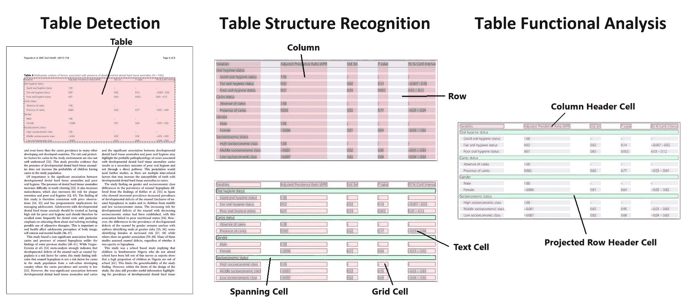

# Table Transformer

> 原文链接：[`huggingface.co/docs/transformers/v4.37.2/en/model_doc/table-transformer`](https://huggingface.co/docs/transformers/v4.37.2/en/model_doc/table-transformer)

## 概述

Table Transformer 模型是由 Brandon Smock、Rohith Pesala 和 Robin Abraham 在 [PubTables-1M: Towards comprehensive table extraction from unstructured documents](https://arxiv.org/abs/2110.00061) 中提出的。作者引入了一个新数据集 PubTables-1M，用于评估从非结构化文档中提取表格、表结构识别和功能分析的进展。作者训练了两个 DETR 模型，一个用于表检测，一个用于表结构识别，被称为 Table Transformers。

论文摘要如下：

*最近，在将机器学习应用于从非结构化文档中推断和提取表结构方面取得了重大进展。然而，最大的挑战之一仍然是在规模上创建具有完整、明确的地面真实数据集。为了解决这个问题，我们开发了一个新的更全面的表提取数据集，名为 PubTables-1M。PubTables-1M 包含来自科学文章的近一百万张表，支持多种输入模态，并包含详细的表头和位置信息，对于各种建模方法都很有用。它还通过一种新颖的规范化过程解决了先前数据集中观察到的地面真实不一致的重要来源，称为过分分割。我们展示这些改进导致训练性能显著提高，并在表结构识别的评估中获得更可靠的模型性能估计。此外，我们展示基于 PubTables-1M 训练的基于 transformer 的目标检测模型在检测、结构识别和功能分析的三个任务中产生出色的结果，而无需为这些任务进行任何特殊定制。*

 表检测和表结构识别的澄清。摘自[原始论文](https://arxiv.org/abs/2110.00061)。

作者发布了两个模型，一个用于[文档中的表检测](https://huggingface.co/microsoft/table-transformer-detection)，一个用于[表结构识别](https://huggingface.co/microsoft/table-transformer-structure-recognition)（识别表中的各行、列等任务）。

此模型由 [nielsr](https://huggingface.co/nielsr) 贡献。原始代码可以在这里找到 [链接](https://github.com/microsoft/table-transformer)。

## 资源

目标检测

+   可以在这里找到 Table Transformer 的演示笔记本 [链接](https://github.com/NielsRogge/Transformers-Tutorials/tree/master/Table%20Transformer)。

+   原来图像的填充对于检测非常重要。可以在这里找到一个有趣的 Github 主题，其中包含作者的回复 [链接](https://github.com/microsoft/table-transformer/issues/68)。

## TableTransformerConfig

### `class transformers.TableTransformerConfig`

[<来源>](https://github.com/huggingface/transformers/blob/v4.37.2/src/transformers/models/table_transformer/configuration_table_transformer.py#L36)

```py
( use_timm_backbone = True backbone_config = None num_channels = 3 num_queries = 100 encoder_layers = 6 encoder_ffn_dim = 2048 encoder_attention_heads = 8 decoder_layers = 6 decoder_ffn_dim = 2048 decoder_attention_heads = 8 encoder_layerdrop = 0.0 decoder_layerdrop = 0.0 is_encoder_decoder = True activation_function = 'relu' d_model = 256 dropout = 0.1 attention_dropout = 0.0 activation_dropout = 0.0 init_std = 0.02 init_xavier_std = 1.0 auxiliary_loss = False position_embedding_type = 'sine' backbone = 'resnet50' use_pretrained_backbone = True dilation = False class_cost = 1 bbox_cost = 5 giou_cost = 2 mask_loss_coefficient = 1 dice_loss_coefficient = 1 bbox_loss_coefficient = 5 giou_loss_coefficient = 2 eos_coefficient = 0.1 **kwargs )
```

参数

+   `use_timm_backbone` (`bool`，*可选*，默认为 `True`) — 是否使用 `timm` 库作为骨干。如果设置为 `False`，将使用 `AutoBackbone` API。

+   `backbone_config` (`PretrainedConfig` 或 `dict`，*可选*) — 骨干模型的配置。仅在设置 `use_timm_backbone` 为 `False` 时使用，此时默认为 `ResNetConfig()`。

+   `num_channels` (`int`，*可选*，默认为 3) — 输入通道数。

+   `num_queries` (`int`, *optional*, 默认为 100) — 对象查询的数量，即检测槽位。这是 TableTransformerModel 在单个图像中可以检测到的对象的最大数量。对于 COCO，我们建议使用 100 个查询。

+   `d_model` (`int`, *optional*, 默认为 256) — 层的维度。

+   `encoder_layers` (`int`, *optional*, 默认为 6) — 编码器层的数量。

+   `decoder_layers` (`int`, *optional*, 默认为 6) — 解码器层的数量。

+   `encoder_attention_heads` (`int`, *optional*, 默认为 8) — Transformer 编码器中每个注意力层的注意力头数。

+   `decoder_attention_heads` (`int`, *optional*, 默认为 8) — Transformer 解码器中每个注意力层的注意力头数。

+   `decoder_ffn_dim` (`int`, *optional*, 默认为 2048) — 解码器中“中间”（通常称为前馈）层的维度。

+   `encoder_ffn_dim` (`int`, *optional*, 默认为 2048) — 解码器中“中间”（通常称为前馈）层的维度。

+   `activation_function` (`str` 或 `function`, *optional*, 默认为 `"relu"`) — 编码器和池化器中的非线性激活函数（函数或字符串）。如果是字符串，支持 `"gelu"`, `"relu"`, `"silu"` 和 `"gelu_new"`。

+   `dropout` (`float`, *optional*, 默认为 0.1) — 嵌入、编码器和池化器中所有全连接层的丢失概率。

+   `attention_dropout` (`float`, *optional*, 默认为 0.0) — 注意力概率的丢失比率。

+   `activation_dropout` (`float`, *optional*, 默认为 0.0) — 全连接层内激活的丢失比率。

+   `init_std` (`float`, *optional*, 默认为 0.02) — 用于初始化所有权重矩阵的截断正态初始化器的标准差。

+   `init_xavier_std` (`float`, *optional*, 默认为 1) — 用于 HM Attention map 模块中的 Xavier 初始化增益的缩放因子。

+   `encoder_layerdrop` (`float`, *optional*, 默认为 0.0) — 编码器的 LayerDrop 概率。更多细节请参阅 LayerDrop 论文)。

+   `decoder_layerdrop` (`float`, *optional*, 默认为 0.0) — 解码器的 LayerDrop 概率。更多细节请参阅 LayerDrop 论文)。

+   `auxiliary_loss` (`bool`, *optional*, 默认为 `False`) — 是否使用辅助解码损失（每个解码器层的损失）。

+   `position_embedding_type` (`str`, *optional*, 默认为 `"sine"`) — 在图像特征之上使用的位置嵌入的类型。可以是 `"sine"` 或 `"learned"` 中的一个。

+   `backbone` (`str`, *optional*, 默认为 `"resnet50"`) — 在 `use_timm_backbone` = `True` 时要使用的卷积主干的名称。支持来自 timm 包的任何卷积主干。有关所有可用模型的列表，请参阅 [此页面](https://rwightman.github.io/pytorch-image-models/#load-a-pretrained-model)。

+   `use_pretrained_backbone` (`bool`, *optional*, 默认为 `True`) — 是否使用主干的预训练权重。仅在 `use_timm_backbone` = `True` 时支持。

+   `dilation` (`bool`, *optional*, 默认为 `False`) — 是否在最后的卷积块（DC5）中用膨胀替代步幅。仅在 `use_timm_backbone` = `True` 时支持。

+   `class_cost` (`float`, *optional*, 默认为 1) — 匈牙利匹配成本中分类错误的相对权重。

+   `bbox_cost` (`float`, *optional*, 默认为 5) — 匈牙利匹配成本中边界框坐标的 L1 误差的相对权重。

+   `giou_cost` (`float`, *optional*, 默认为 2) — 匈牙利匹配成本中边界框广义 IoU 损失的相对权重。

+   `mask_loss_coefficient`（`float`，*可选*，默认为 1）—全景分割损失中 Focal 损失的相对权重。

+   `dice_loss_coefficient`（`float`，*可选*，默认为 1）—DICE/F-1 损失在全景分割损失中的相对权重。

+   `bbox_loss_coefficient`（`float`，*可选*，默认为 5）—目标检测损失中 L1 边界框损失的相对权重。

+   `giou_loss_coefficient`（`float`，*可选*，默认为 2）—广义 IoU 损失在目标检测损失中的相对权重。

+   `eos_coefficient`（`float`，*可选*，默认为 0.1）—目标检测损失中“无对象”类的相对分类权重。

这是配置类，用于存储 TableTransformerModel 的配置。它用于根据指定的参数实例化一个 Table Transformer 模型，定义模型架构。使用默认值实例化配置将产生类似于 Table Transformer [microsoft/table-transformer-detection](https://huggingface.co/microsoft/table-transformer-detection)架构的配置。

配置对象继承自 PretrainedConfig，可用于控制模型输出。阅读 PretrainedConfig 的文档以获取更多信息。

示例：

```py
>>> from transformers import TableTransformerModel, TableTransformerConfig

>>> # Initializing a Table Transformer microsoft/table-transformer-detection style configuration
>>> configuration = TableTransformerConfig()

>>> # Initializing a model from the microsoft/table-transformer-detection style configuration
>>> model = TableTransformerModel(configuration)

>>> # Accessing the model configuration
>>> configuration = model.config
```

## TableTransformerModel

### `class transformers.TableTransformerModel`

[<来源>](https://github.com/huggingface/transformers/blob/v4.37.2/src/transformers/models/table_transformer/modeling_table_transformer.py#L1190)

```py
( config: TableTransformerConfig )
```

参数

+   `config`（TableTransformerConfig）—模型配置类，具有所有模型参数。使用配置文件初始化不会加载与模型关联的权重，只加载配置。查看 from_pretrained()方法以加载模型权重。

裸 Table Transformer 模型（由骨干和编码器-解码器 Transformer 组成），输出原始隐藏状态，没有特定的头部。

此模型继承自 PreTrainedModel。查看超类文档以了解库为所有模型实现的通用方法（例如下载或保存、调整输入嵌入、修剪头等）。

此模型还是 PyTorch [torch.nn.Module](https://pytorch.org/docs/stable/nn.html#torch.nn.Module)子类。将其用作常规 PyTorch 模块，并参考 PyTorch 文档以获取有关一般用法和行为的所有相关信息。

#### `forward`

[<来源>](https://github.com/huggingface/transformers/blob/v4.37.2/src/transformers/models/table_transformer/modeling_table_transformer.py#L1232)

```py
( pixel_values: FloatTensor pixel_mask: Optional = None decoder_attention_mask: Optional = None encoder_outputs: Optional = None inputs_embeds: Optional = None decoder_inputs_embeds: Optional = None output_attentions: Optional = None output_hidden_states: Optional = None return_dict: Optional = None ) → export const metadata = 'undefined';transformers.models.table_transformer.modeling_table_transformer.TableTransformerModelOutput or tuple(torch.FloatTensor)
```

参数

+   `pixel_values`（形状为`(batch_size, num_channels, height, width)`的`torch.FloatTensor`）—像素值。默认情况下将忽略填充。

    可以使用 DetrImageProcessor 获取像素值。有关详细信息，请参阅 DetrImageProcessor.`call`()。

+   `pixel_mask`（形状为`(batch_size, height, width)`的`torch.FloatTensor`，*可选*）—遮罩，避免在填充像素值上执行注意力。遮罩值选择在`[0, 1]`中：

    +   1 表示真实像素（即`未遮罩`），

    +   0 表示填充像素（即`遮罩`）。

    注意力蒙版是什么？

+   `decoder_attention_mask` (`torch.FloatTensor` of shape `(batch_size, num_queries)`, *可选*) — 默认情况下不使用。可用于屏蔽对象查询。

+   `encoder_outputs` (`tuple(tuple(torch.FloatTensor)`, *可选*) — 元组包括(`last_hidden_state`, *可选*: `hidden_states`, *可选*: `attentions`) `last_hidden_state`的形状为`(batch_size, sequence_length, hidden_size)`，*可选*) 是编码器最后一层的隐藏状态序列。用于解码器的交叉注意力。

+   `inputs_embeds` (`torch.FloatTensor` of shape `(batch_size, sequence_length, hidden_size)`, *可选*) — 可选地，您可以选择直接传递图像的扁平化表示，而不是传递扁平化特征图（骨干网络输出+投影层的输出）。

+   `decoder_inputs_embeds` (`torch.FloatTensor` of shape `(batch_size, num_queries, hidden_size)`, *可选*) — 可选地，您可以选择直接传递嵌入表示，而不是用零张量初始化查询。

+   `output_attentions` (`bool`, *可选*) — 是否返回所有注意力层的注意力张量。有关更多详细信息，请参阅返回张量下的`attentions`。

+   `output_hidden_states` (`bool`, *可选*) — 是否返回所有层的隐藏状态。有关更多详细信息，请参阅返回张量下的`hidden_states`。

+   `return_dict` (`bool`, *可选*) — 是否返回 ModelOutput 而不是普通元组。

返回

`transformers.models.table_transformer.modeling_table_transformer.TableTransformerModelOutput` 或 `tuple(torch.FloatTensor)`

一个`transformers.models.table_transformer.modeling_table_transformer.TableTransformerModelOutput`或一个`torch.FloatTensor`元组（如果传递`return_dict=False`或`config.return_dict=False`）包含根据配置（TableTransformerConfig）和输入的不同元素。

+   `last_hidden_state` (`torch.FloatTensor` of shape `(batch_size, sequence_length, hidden_size)`) — 模型解码器最后一层的隐藏状态序列。

+   `decoder_hidden_states` (`tuple(torch.FloatTensor)`, *可选*, 当传递`output_hidden_states=True`或`config.output_hidden_states=True`时返回) — 元组`torch.FloatTensor`（一个用于嵌入输出，一个用于每层输出）的形状为`(batch_size, sequence_length, hidden_size)`。解码器每层输出的隐藏状态加上初始嵌入输出。

+   `decoder_attentions` (`tuple(torch.FloatTensor)`, *可选*, 当传递`output_attentions=True`或`config.output_attentions=True`时返回) — 元组`torch.FloatTensor`（每层一个）的形状为`(batch_size, num_heads, sequence_length, sequence_length)`。解码器的注意力权重，在注意力 softmax 之后，用于计算自注意力头中的加权平均值。

+   `cross_attentions` (`tuple(torch.FloatTensor)`, *可选*, 当传递`output_attentions=True`或`config.output_attentions=True`时返回) — 元组`torch.FloatTensor`（每层一个）的形状为`(batch_size, num_heads, sequence_length, sequence_length)`。解码器的交叉注意力层的注意力权重，在注意力 softmax 之后，用于计算交叉注意力头中的加权平均值。

+   `encoder_last_hidden_state` (`torch.FloatTensor` of shape `(batch_size, sequence_length, hidden_size)`, *可选*) — 模型编码器最后一层的隐藏状态序列。

+   `encoder_hidden_states` (`tuple(torch.FloatTensor)`，*可选*，当传递 `output_hidden_states=True` 或当 `config.output_hidden_states=True` 时返回) — `torch.FloatTensor` 元组（一个用于嵌入的输出 + 一个用于每个层的输出）的形状为 `(batch_size, sequence_length, hidden_size)`。编码器在每个层的隐藏状态加上初始嵌入输出。

+   `encoder_attentions` (`tuple(torch.FloatTensor)`，*可选*，当传递 `output_attentions=True` 或当 `config.output_attentions=True` 时返回) — `torch.FloatTensor` 元组（每个层一个）的形状为 `(batch_size, num_heads, sequence_length, sequence_length)`。编码器的注意力权重，在注意力 softmax 之后使用，用于计算自注意力头中的加权平均值。

+   `intermediate_hidden_states` (`torch.FloatTensor`，形状为 `(config.decoder_layers, batch_size, sequence_length, hidden_size)`，*可选*，当 `config.auxiliary_loss=True` 时返回) — 中间解码器激活，即每个解码器层的输出，每个都经过了一个 layernorm。

TableTransformerModel 的前向方法，覆盖了 `__call__` 特殊方法。

虽然前向传递的步骤需要在这个函数内定义，但应该在此之后调用 `Module` 实例，而不是这个，因为前者会处理运行前后处理步骤，而后者会默默地忽略它们。

示例：

```py
>>> from transformers import AutoImageProcessor, TableTransformerModel
>>> from huggingface_hub import hf_hub_download
>>> from PIL import Image

>>> file_path = hf_hub_download(repo_id="nielsr/example-pdf", repo_type="dataset", filename="example_pdf.png")
>>> image = Image.open(file_path).convert("RGB")

>>> image_processor = AutoImageProcessor.from_pretrained("microsoft/table-transformer-detection")
>>> model = TableTransformerModel.from_pretrained("microsoft/table-transformer-detection")

>>> # prepare image for the model
>>> inputs = image_processor(images=image, return_tensors="pt")

>>> # forward pass
>>> outputs = model(**inputs)

>>> # the last hidden states are the final query embeddings of the Transformer decoder
>>> # these are of shape (batch_size, num_queries, hidden_size)
>>> last_hidden_states = outputs.last_hidden_state
>>> list(last_hidden_states.shape)
[1, 15, 256]
```

## TableTransformerForObjectDetection

### `class transformers.TableTransformerForObjectDetection`

[< source >](https://github.com/huggingface/transformers/blob/v4.37.2/src/transformers/models/table_transformer/modeling_table_transformer.py#L1359)

```py
( config: TableTransformerConfig )
```

参数

+   `config` (TableTransformerConfig) — 具有模型所有参数的模型配置类。使用配置文件初始化不会加载与模型关联的权重，只加载配置。查看 from_pretrained() 方法以加载模型权重。

Table Transformer Model（由主干和编码器-解码器 Transformer 组成），顶部带有目标检测头，用于诸如 COCO 检测之类的任务。

这个模型继承自 PreTrainedModel。查看超类文档以了解库为所有模型实现的通用方法（如下载或保存、调整输入嵌入、修剪头等）。

这个模型也是 PyTorch [torch.nn.Module](https://pytorch.org/docs/stable/nn.html#torch.nn.Module) 的子类。将其用作常规的 PyTorch 模块，并参考 PyTorch 文档以了解所有与一般用法和行为相关的事项。

#### `forward`

[< source >](https://github.com/huggingface/transformers/blob/v4.37.2/src/transformers/models/table_transformer/modeling_table_transformer.py#L1393)

```py
( pixel_values: FloatTensor pixel_mask: Optional = None decoder_attention_mask: Optional = None encoder_outputs: Optional = None inputs_embeds: Optional = None decoder_inputs_embeds: Optional = None labels: Optional = None output_attentions: Optional = None output_hidden_states: Optional = None return_dict: Optional = None ) → export const metadata = 'undefined';transformers.models.table_transformer.modeling_table_transformer.TableTransformerObjectDetectionOutput or tuple(torch.FloatTensor)
```

参数

+   `pixel_values` (`torch.FloatTensor`，形状为 `(batch_size, num_channels, height, width)`) — 像素值。默认情况下将忽略填充。

    可以使用 DetrImageProcessor 获取像素值。有关详细信息，请参阅 DetrImageProcessor.`call`()。

+   `pixel_mask` (`torch.FloatTensor`，形状为 `(batch_size, height, width)`，*可选*) — 遮罩，避免在填充像素值上执行注意力。遮罩值选择在 `[0, 1]` 中：

    +   1 代表真实像素（即 `not masked`），

    +   0 代表填充像素（即 `masked`）。

    什么是注意力遮罩？

+   `decoder_attention_mask` (`torch.FloatTensor` of shape `(batch_size, num_queries)`, *optional*) — 默认情况下不使用。可用于屏蔽对象查询。

+   `encoder_outputs` (`tuple(tuple(torch.FloatTensor)`, *optional*) — 元组包括（`last_hidden_state`，*可选*：`hidden_states`，*可选*：`attentions`）`last_hidden_state`的形状为`(batch_size, sequence_length, hidden_size)`，*可选*是编码器最后一层输出的隐藏状态序列。用于解码器的交叉注意力。

+   `inputs_embeds` (`torch.FloatTensor` of shape `(batch_size, sequence_length, hidden_size)`, *optional*) — 可选，可以选择直接传递图像的扁平化表示，而不是传递骨干网络+投影层的扁平化特征图。

+   `decoder_inputs_embeds` (`torch.FloatTensor` of shape `(batch_size, num_queries, hidden_size)`, *optional*) — 可选，可以选择直接传递嵌入表示，而不是用零张量初始化查询。

+   `output_attentions` (`bool`, *optional*) — 是否返回所有注意力层的注意力张量。有关更多详细信息，请参阅返回张量下的`attentions`。

+   `output_hidden_states` (`bool`, *optional*) — 是否返回所有层的隐藏状态。有关更多详细信息，请参阅返回张量下的`hidden_states`。

+   `return_dict` (`bool`, *optional*) — 是否返回 ModelOutput 而不是普通元组。

+   `labels` (`List[Dict]` of len `(batch_size,)`, *optional*) — 用于计算二分匹配损失的标签。字典列表，每个字典至少包含以下 2 个键：'class_labels'和'boxes'（分别是批次中图像的类标签和边界框）。类标签本身应该是长度为`(图像中边界框的数量,)`的`torch.LongTensor`，而边界框应该是形状为`(图像中边界框的数量, 4)`的`torch.FloatTensor`。

返回

`transformers.models.table_transformer.modeling_table_transformer.TableTransformerObjectDetectionOutput` 或 `tuple(torch.FloatTensor)`

一个`transformers.models.table_transformer.modeling_table_transformer.TableTransformerObjectDetectionOutput`或一个`torch.FloatTensor`的元组（如果传递`return_dict=False`或`config.return_dict=False`时）包含根据配置（TableTransformerConfig）和输入的不同元素。

+   `loss` (`torch.FloatTensor` of shape `(1,)`, *optional*, 当提供`labels`时返回) — 作为负对数似然（交叉熵）和边界框损失的线性组合的总损失。后者被定义为 L1 损失和广义比例不变 IoU 损失的线性组合。

+   `loss_dict` (`Dict`, *optional*) — 包含各个损失的字典。用于记录。

+   `logits` (`torch.FloatTensor` of shape `(batch_size, num_queries, num_classes + 1)`) — 包括无对象在内的所有查询的分类 logits。

+   `pred_boxes` (`torch.FloatTensor` of shape `(batch_size, num_queries, 4)`) — 所有查询的归一化框坐标，表示为（中心 _x，中心 _y，宽度，高度）。这些值在[0, 1]范围内归一化，相对于批次中每个单独图像的大小（忽略可能的填充）。您可以使用`~TableTransformerImageProcessor.post_process_object_detection`来检索未归一化的边界框。

+   `auxiliary_outputs` (`list[Dict]`, *optional*) — 可选，仅在激活辅助损失（即`config.auxiliary_loss`设置为`True`）并提供标签时返回。它是一个字典列表，包含每个解码器层的上述两个键（`logits`和`pred_boxes`）。

+   `last_hidden_state` (`torch.FloatTensor`，形状为`(batch_size, sequence_length, hidden_size)`，*optional*) — 模型解码器最后一层的隐藏状态序列。

+   `decoder_hidden_states` (`tuple(torch.FloatTensor)`，*optional*，当传递`output_hidden_states=True`或`config.output_hidden_states=True`时返回) — `torch.FloatTensor`元组（嵌入输出和每层输出各一个），形状为`(batch_size, sequence_length, hidden_size)`。解码器在每层输出的隐藏状态加上初始嵌入输出。

+   `decoder_attentions` (`tuple(torch.FloatTensor)`，*optional*，当传递`output_attentions=True`或`config.output_attentions=True`时返回) — `torch.FloatTensor`元组（每层一个），形状为`(batch_size, num_heads, sequence_length, sequence_length)`。解码器的注意力权重，在注意力 softmax 之后，用于计算自注意力头中的加权平均值。

+   `cross_attentions` (`tuple(torch.FloatTensor)`，*optional*，当传递`output_attentions=True`或`config.output_attentions=True`时返回) — `torch.FloatTensor`元组（每层一个），形状为`(batch_size, num_heads, sequence_length, sequence_length)`。解码器的交叉注意力层的注意力权重，在注意力 softmax 之后，用于计算交叉注意力头中的加权平均值。

+   `encoder_last_hidden_state` (`torch.FloatTensor`，形状为`(batch_size, sequence_length, hidden_size)`，*optional*) — 模型编码器最后一层的隐藏状态序列。

+   `encoder_hidden_states` (`tuple(torch.FloatTensor)`，*optional*，当传递`output_hidden_states=True`或`config.output_hidden_states=True`时返回) — `torch.FloatTensor`元组（嵌入输出和每层输出各一个），形状为`(batch_size, sequence_length, hidden_size)`。编码器在每层输出的隐藏状态加上初始嵌入输出。

+   `encoder_attentions` (`tuple(torch.FloatTensor)`, *optional*, 当传递`output_attentions=True`或`config.output_attentions=True`时返回) — `torch.FloatTensor`元组（每层一个），形状为`(batch_size, num_heads, sequence_length, sequence_length)`。编码器的注意力权重，在注意力 softmax 之后，用于计算自注意力头中的加权平均值。

TableTransformerForObjectDetection 的前向方法，覆盖了`__call__`特殊方法。

虽然前向传递的步骤需要在此函数内定义，但应该在此之后调用`Module`实例，而不是在此函数内调用，因为前者会处理运行前后处理步骤，而后者会默默地忽略它们。

示例：

```py
>>> from huggingface_hub import hf_hub_download
>>> from transformers import AutoImageProcessor, TableTransformerForObjectDetection
>>> import torch
>>> from PIL import Image

>>> file_path = hf_hub_download(repo_id="nielsr/example-pdf", repo_type="dataset", filename="example_pdf.png")
>>> image = Image.open(file_path).convert("RGB")

>>> image_processor = AutoImageProcessor.from_pretrained("microsoft/table-transformer-detection")
>>> model = TableTransformerForObjectDetection.from_pretrained("microsoft/table-transformer-detection")

>>> inputs = image_processor(images=image, return_tensors="pt")
>>> outputs = model(**inputs)

>>> # convert outputs (bounding boxes and class logits) to Pascal VOC format (xmin, ymin, xmax, ymax)
>>> target_sizes = torch.tensor([image.size[::-1]])
>>> results = image_processor.post_process_object_detection(outputs, threshold=0.9, target_sizes=target_sizes)[
...     0
... ]

>>> for score, label, box in zip(results["scores"], results["labels"], results["boxes"]):
...     box = [round(i, 2) for i in box.tolist()]
...     print(
...         f"Detected {model.config.id2label[label.item()]} with confidence "
...         f"{round(score.item(), 3)} at location {box}"
...     )
Detected table with confidence 1.0 at location [202.1, 210.59, 1119.22, 385.09]
```
