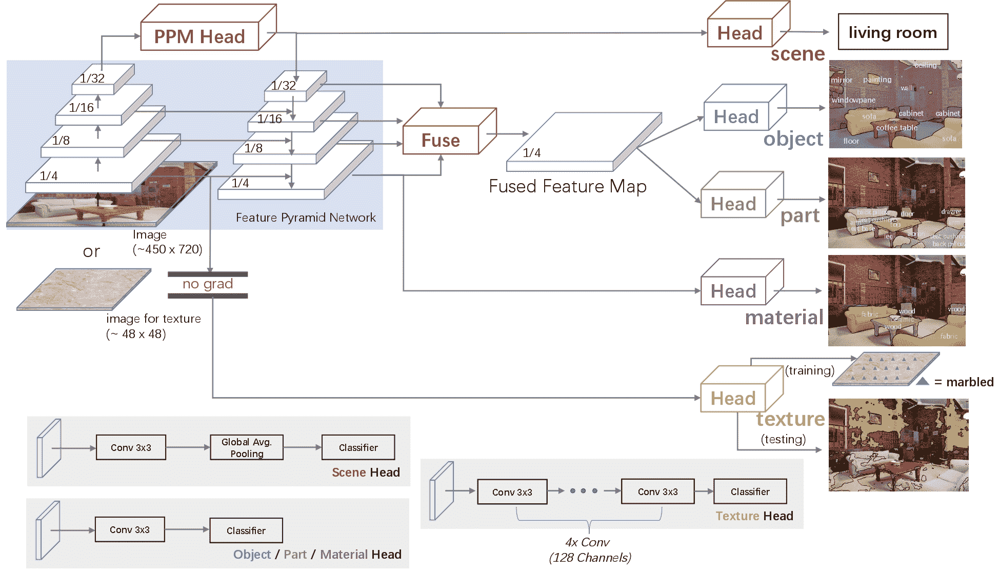

# UPerNet

> [`huggingface.co/docs/transformers/v4.37.2/en/model_doc/upernet`](https://huggingface.co/docs/transformers/v4.37.2/en/model_doc/upernet)

## 概述

UPerNet 模型是由肖特、刘英成、周博磊、姜玉宁、孙坚在[统一感知解析用于场景理解](https://arxiv.org/abs/1807.10221)中提出的。UPerNet 是一个通用框架，可以有效地从图像中分割各种概念，利用任何视觉骨干，如 ConvNeXt 或 Swin。

论文摘要如下：

*人类在多个层次上识别视觉世界：我们轻松地对场景进行分类，并检测其中的对象，同时还识别对象的纹理和表面以及它们不同的组成部分。在本文中，我们研究了一个称为统一感知解析的新任务，该任务要求机器视觉系统从给定图像中尽可能识别尽可能多的视觉概念。开发了一个名为 UPerNet 的多任务框架和训练策略，以从异构图像注释中学习。我们在统一感知解析上对我们的框架进行基准测试，并展示它能够有效地从图像中分割各种概念。训练的网络进一步应用于发现自然场景中的视觉知识。*

 UPerNet 框架。取自[原始论文](https://arxiv.org/abs/1807.10221)。

该模型由[nielsr](https://huggingface.co/nielsr)贡献。原始代码基于 OpenMMLab 的 mmsegmentation [这里](https://github.com/open-mmlab/mmsegmentation/blob/master/mmseg/models/decode_heads/uper_head.py)。

## 使用示例

UPerNet 是语义分割的通用框架。可以与任何视觉骨干一起使用，如：

```py
from transformers import SwinConfig, UperNetConfig, UperNetForSemanticSegmentation

backbone_config = SwinConfig(out_features=["stage1", "stage2", "stage3", "stage4"])

config = UperNetConfig(backbone_config=backbone_config)
model = UperNetForSemanticSegmentation(config)
```

要使用另一个视觉骨干，如 ConvNeXt，只需使用适当的骨干实例化模型：

```py
from transformers import ConvNextConfig, UperNetConfig, UperNetForSemanticSegmentation

backbone_config = ConvNextConfig(out_features=["stage1", "stage2", "stage3", "stage4"])

config = UperNetConfig(backbone_config=backbone_config)
model = UperNetForSemanticSegmentation(config)
```

请注意，这将随机初始化模型的所有权重。

## 资源

官方 Hugging Face 和社区（由🌎表示）资源列表，帮助您开始使用 UPerNet。

+   UPerNet 的演示笔记本可以在[这里](https://github.com/NielsRogge/Transformers-Tutorials/tree/master/UPerNet)找到。

+   UperNetForSemanticSegmentation 由这个[示例脚本](https://github.com/huggingface/transformers/tree/main/examples/pytorch/semantic-segmentation)和[笔记本](https://colab.research.google.com/github/huggingface/notebooks/blob/main/examples/semantic_segmentation.ipynb)支持。

+   另请参阅：语义分割任务指南

如果您有兴趣提交资源以包含在此处，请随时打开一个 Pull Request，我们将进行审查！资源应该展示一些新内容，而不是重复现有资源。

## UperNetConfig

### `class transformers.UperNetConfig`

[<来源>](https://github.com/huggingface/transformers/blob/v4.37.2/src/transformers/models/upernet/configuration_upernet.py#L26)

```py
( backbone_config = None hidden_size = 512 initializer_range = 0.02 pool_scales = [1, 2, 3, 6] use_auxiliary_head = True auxiliary_loss_weight = 0.4 auxiliary_in_channels = 384 auxiliary_channels = 256 auxiliary_num_convs = 1 auxiliary_concat_input = False loss_ignore_index = 255 **kwargs )
```

参数

+   `backbone_config` (`PretrainedConfig`或`dict`, *可选*, 默认为`ResNetConfig()`) — 骨干模型的配置。

+   `hidden_size` (`int`, *可选*, 默认为 512) — 卷积层中隐藏单元的数量。

+   `initializer_range` (`float`, *可选*, 默认为 0.02) — 用于初始化所有权重矩阵的截断正态初始化器的标准差。

+   `pool_scales` (`Tuple[int]`, *可选*, 默认为`[1, 2, 3, 6]`) — 应用于最后特征图的 Pooling Pyramid Module 中使用的池化尺度。

+   `use_auxiliary_head` (`bool`, *可选*, 默认为`True`) — 训练期间是否使用辅助头。

+   `auxiliary_loss_weight` (`float`, *可选*, 默认为 0.4) — 辅助头的交叉熵损失的权重。

+   `auxiliary_channels` (`int`，*可选*，默认为 256) — 辅助头中要使用的通道数。

+   `auxiliary_num_convs` (`int`，*可选*，默认为 1) — 辅助头中要使用的卷积层数。

+   `auxiliary_concat_input` (`bool`，*可选*，默认为`False`) — 是否在分类层之前将辅助头的输出与输入连接。

+   `loss_ignore_index` (`int`，*可选*，默认为 255) — 损失函数忽略的索引。

这是一个配置类，用于存储 UperNetForSemanticSegmentation 的配置。它用于根据指定的参数实例化一个 UperNet 模型，定义模型架构。使用默认值实例化配置将产生类似于 UperNet [openmmlab/upernet-convnext-tiny](https://huggingface.co/openmmlab/upernet-convnext-tiny)架构的配置。

配置对象继承自 PretrainedConfig，可用于控制模型输出。阅读 PretrainedConfig 的文档以获取更多信息。

示例：

```py
>>> from transformers import UperNetConfig, UperNetForSemanticSegmentation

>>> # Initializing a configuration
>>> configuration = UperNetConfig()

>>> # Initializing a model (with random weights) from the configuration
>>> model = UperNetForSemanticSegmentation(configuration)

>>> # Accessing the model configuration
>>> configuration = model.config
```

## UperNetForSemanticSegmentation

### `class transformers.UperNetForSemanticSegmentation`

[<来源>](https://github.com/huggingface/transformers/blob/v4.37.2/src/transformers/models/upernet/modeling_upernet.py#L343)

```py
( config )
```

参数

+   `This`模型是 PyTorch torch.nn.Module 子类。使用

+   `it`作为常规的 PyTorch 模块，并参考 PyTorch 文档以获取有关一般用法和行为的所有相关信息。配置(UperNetConfig)：模型配置类，包含模型的所有参数。使用配置文件初始化不会加载与模型相关的权重，只加载配置。查看 from_pretrained()方法以加载模型权重。

UperNet 框架利用任何视觉骨干，例如 ADE20k，CityScapes。

#### `forward`

[<来源>](https://github.com/huggingface/transformers/blob/v4.37.2/src/transformers/models/upernet/modeling_upernet.py#L360)

```py
( pixel_values: Optional = None output_attentions: Optional = None output_hidden_states: Optional = None labels: Optional = None return_dict: Optional = None ) → export const metadata = 'undefined';transformers.modeling_outputs.SemanticSegmenterOutput or tuple(torch.FloatTensor)
```

参数

+   `pixel_values` (`torch.FloatTensor`，形状为`(batch_size, num_channels, height, width)`) — 像素值。默认情况下会忽略填充。可以使用 AutoImageProcessor 获取像素值。有关详细信息，请参阅 SegformerImageProcessor.`call`()。

+   `output_attentions` (`bool`，*可选*) — 是否返回骨干具有注意力张量的所有注意力层的注意力张量。有关更多详细信息，请参阅返回张量下的`attentions`。

+   `output_hidden_states` (`bool`，*可选*) — 是否返回骨干的所有层的隐藏状态。有关更多详细信息，请参阅返回张量下的`hidden_states`。

+   `return_dict` (`bool`，*可选*) — 是否返回 ModelOutput 而不是普通元组。

+   `labels` (`torch.LongTensor`，形状为`(batch_size, height, width)`，*可选*) — 用于计算损失的地面真实语义分割地图。索引应在`[0, ..., config.num_labels - 1]`范围内。如果`config.num_labels > 1`，则计算分类损失（交叉熵）。

返回

transformers.modeling_outputs.SemanticSegmenterOutput 或 `tuple(torch.FloatTensor)`

一个 transformers.modeling_outputs.SemanticSegmenterOutput 或一个`torch.FloatTensor`元组（如果传递`return_dict=False`或当`config.return_dict=False`时）包含根据配置（UperNetConfig）和输入而异的各种元素。

+   `loss` (`torch.FloatTensor`，形状为`(1,)`, *可选的*, 当提供`labels`时返回) — 分类（如果 config.num_labels==1 则为回归）损失。

+   `logits` (`torch.FloatTensor`，形状为`(batch_size, config.num_labels, logits_height, logits_width)`) — 每个像素的分类分数。

    <tip warning="{true}">返回的 logits 不一定与作为输入传递的`pixel_values`具有相同的大小。这是为了避免进行两次插值并在用户需要将 logits 调整为原始图像大小时丢失一些质量。您应始终检查 logits 的形状并根据需要调整大小。</tip>

+   `hidden_states` (`tuple(torch.FloatTensor)`, *可选的*, 当传递`output_hidden_states=True`或当`config.output_hidden_states=True`时返回) — 形状为`(batch_size, patch_size, hidden_size)`的`torch.FloatTensor`元组（一个用于嵌入的输出，如果模型有嵌入层，+ 一个用于每个层的输出）。

    模型在每个层输出的隐藏状态以及可选的初始嵌入输出。

+   `attentions` (`tuple(torch.FloatTensor)`, *可选的*, 当传递`output_attentions=True`或当`config.output_attentions=True`时返回) — 形状为`(batch_size, num_heads, patch_size, sequence_length)`的`torch.FloatTensor`元组（每个层一个）。

    注意力 softmax 后的注意力权重，用于计算自注意力头中的加权平均值。

UperNetForSemanticSegmentation 的前向方法，覆盖了`__call__`特殊方法。

虽然前向传递的步骤需要在此函数内定义，但应该在此之后调用`Module`实例，而不是在此处调用，因为前者会负责运行预处理和后处理步骤，而后者会默默地忽略它们。

示例:

```py
>>> from transformers import AutoImageProcessor, UperNetForSemanticSegmentation
>>> from PIL import Image
>>> from huggingface_hub import hf_hub_download

>>> image_processor = AutoImageProcessor.from_pretrained("openmmlab/upernet-convnext-tiny")
>>> model = UperNetForSemanticSegmentation.from_pretrained("openmmlab/upernet-convnext-tiny")

>>> filepath = hf_hub_download(
...     repo_id="hf-internal-testing/fixtures_ade20k", filename="ADE_val_00000001.jpg", repo_type="dataset"
... )
>>> image = Image.open(filepath).convert("RGB")

>>> inputs = image_processor(images=image, return_tensors="pt")

>>> outputs = model(**inputs)

>>> logits = outputs.logits  # shape (batch_size, num_labels, height, width)
>>> list(logits.shape)
[1, 150, 512, 512]
```
