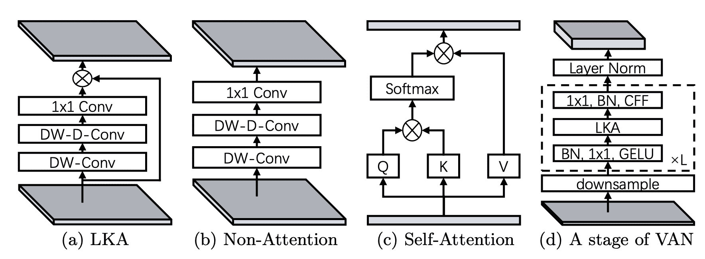

# VAN

> 原文：[`huggingface.co/docs/transformers/v4.37.2/en/model_doc/van`](https://huggingface.co/docs/transformers/v4.37.2/en/model_doc/van)

此模型仅处于维护模式，我们不接受任何更改其代码的新 PR。

如果您在运行此模型时遇到任何问题，请重新安装支持此模型的最后一个版本：v4.30.0。您可以通过运行以下命令来执行：`pip install -U transformers==4.30.0`。

## 概述

VAN 模型是由 Meng-Hao Guo，Cheng-Ze Lu，Zheng-Ning Liu，Ming-Ming Cheng，Shi-Min Hu 在[Visual Attention Network](https://arxiv.org/abs/2202.09741)中提出的。

这篇论文介绍了一种基于卷积操作的新型注意力层，能够捕捉局部和远距离关系。这是通过结合普通和大核卷积层来实现的。后者使用扩张卷积来捕捉远距离的相关性。

论文摘要如下：

*尽管最初设计用于自然语言处理任务，但自注意机制最近在各种计算机视觉领域引起了轰动。然而，图像的 2D 性质为在计算机视觉中应用自注意带来了三个挑战。（1）将图像视为 1D 序列忽略了它们的 2D 结构。（2）二次复杂度对于高分辨率图像来说太昂贵了。（3）它只捕捉了空间适应性，但忽略了通道适应性。在本文中，我们提出了一种新颖的大核注意力（LKA）模块，以在自注意中实现自适应和长距离相关性，同时避免上述问题。我们进一步介绍了一种基于 LKA 的新型神经网络，即 Visual Attention Network（VAN）。尽管非常简单，VAN 在广泛的实验中大幅超越了最先进的视觉 transformers 和卷积神经网络，包括图像分类、目标检测、语义分割、实例分割等。代码可在[此 https URL](https://github.com/Visual-Attention-Network/VAN-Classification)上找到。*

提示：

+   VAN 没有嵌入层，因此`hidden_states`的长度将等于阶段的数量。

下图展示了 Visual Attention Layer 的架构。摘自[原始论文](https://arxiv.org/abs/2202.09741)。



此模型由[Francesco](https://huggingface.co/Francesco)贡献。原始代码可以在[这里](https://github.com/Visual-Attention-Network/VAN-Classification)找到。

## 资源

帮助您开始使用 VAN 的官方 Hugging Face 和社区资源列表（由🌎表示）。

图像分类

+   VanForImageClassification 由这个[示例脚本](https://github.com/huggingface/transformers/tree/main/examples/pytorch/image-classification)和[笔记本](https://colab.research.google.com/github/huggingface/notebooks/blob/main/examples/image_classification.ipynb)支持。

+   另请参阅：图像分类任务指南

如果您有兴趣提交资源以包含在这里，请随时打开一个 Pull Request，我们将进行审查！资源应该展示一些新东西，而不是重复现有资源。

## VanConfig

### `class transformers.VanConfig`

[<来源>](https://github.com/huggingface/transformers/blob/v4.37.2/src/transformers/models/deprecated/van/configuration_van.py#L30)

```py
( image_size = 224 num_channels = 3 patch_sizes = [7, 3, 3, 3] strides = [4, 2, 2, 2] hidden_sizes = [64, 128, 320, 512] depths = [3, 3, 12, 3] mlp_ratios = [8, 8, 4, 4] hidden_act = 'gelu' initializer_range = 0.02 layer_norm_eps = 1e-06 layer_scale_init_value = 0.01 drop_path_rate = 0.0 dropout_rate = 0.0 **kwargs )
```

参数

+   `image_size`（`int`，*可选*，默认为 224）—每个图像的大小（分辨率）。

+   `num_channels`（`int`，*可选*，默认为 3）—输入通道的数量。

+   `patch_sizes`（`List[int]`，*可选*，默认为`[7, 3, 3, 3]`）—每个阶段嵌入层中使用的补丁大小。

+   `strides`（`List[int]`，*可选*，默认为`[4, 2, 2, 2]`）—每个阶段嵌入层中用于下采样输入的步幅大小。

+   `hidden_sizes` (`List[int]`, *optional*, defaults to `[64, 128, 320, 512]`) — 每个阶段的维度（隐藏大小）。

+   `depths` (`List[int]`, *optional*, defaults to `[3, 3, 12, 3]`) — 每个阶段的深度（层数）。

+   `mlp_ratios` (`List[int]`, *optional*, defaults to `[8, 8, 4, 4]`) — 每个阶段 mlp 层的扩展比率。

+   `hidden_act` (`str` or `function`, *optional*, defaults to `"gelu"`) — 每层中的非线性激活函数（函数或字符串）。如果是字符串，支持`"gelu"`、`"relu"`、`"selu"`和`"gelu_new"`。

+   `initializer_range` (`float`, *optional*, defaults to 0.02) — 用于初始化所有权重矩阵的截断正态初始化器的标准差。

+   `layer_norm_eps` (`float`, *optional*, defaults to 1e-06) — 层归一化层使用的 epsilon。

+   `layer_scale_init_value` (`float`, *optional*, defaults to 0.01) — 层缩放的初始值。

+   `drop_path_rate` (`float`, *optional*, defaults to 0.0) — 随机深度的 dropout 概率。

+   `dropout_rate` (`float`, *optional*, defaults to 0.0) — 用于 dropout 的 dropout 概率。

这是用于存储 VanModel 配置的配置类。根据指定的参数实例化 VAN 模型，定义模型架构。使用默认值实例化配置将产生类似于 VAN [Visual-Attention-Network/van-base](https://huggingface.co/Visual-Attention-Network/van-base) 架构的配置。

配置对象继承自 PretrainedConfig，可用于控制模型输出。阅读 PretrainedConfig 的文档以获取更多信息。

示例：

```py
>>> from transformers import VanModel, VanConfig

>>> # Initializing a VAN van-base style configuration
>>> configuration = VanConfig()
>>> # Initializing a model from the van-base style configuration
>>> model = VanModel(configuration)
>>> # Accessing the model configuration
>>> configuration = model.config
```

## VanModel

### `class transformers.VanModel`

[< source >](https://github.com/huggingface/transformers/blob/v4.37.2/src/transformers/models/deprecated/van/modeling_van.py#L416)

```py
( config )
```

参数

+   `config` (VanConfig) — 具有模型所有参数的模型配置类。使用配置文件初始化不会加载与模型相关的权重，只会加载配置。查看 from_pretrained()方法以加载模型权重。

裸的 VAN 模型输出原始特征，没有特定的头部。请注意，VAN 没有嵌入层。此模型是 PyTorch [torch.nn.Module](https://pytorch.org/docs/stable/nn.html#torch.nn.Module)子类。将其用作常规 PyTorch 模块，并参考 PyTorch 文档以获取与一般用法和行为相关的所有事项。

#### `forward`

[< source >](https://github.com/huggingface/transformers/blob/v4.37.2/src/transformers/models/deprecated/van/modeling_van.py#L431)

```py
( pixel_values: Optional output_hidden_states: Optional = None return_dict: Optional = None ) → export const metadata = 'undefined';transformers.modeling_outputs.BaseModelOutputWithPoolingAndNoAttention or tuple(torch.FloatTensor)
```

参数

+   `pixel_values` (`torch.FloatTensor` of shape `(batch_size, num_channels, height, width)`) — 像素值。像素值可以使用 AutoImageProcessor 获取。有关详细信息，请参阅 ConvNextImageProcessor.`call`()。

+   `output_hidden_states` (`bool`, *optional*) — 是否返回所有阶段的隐藏状态。有关更多详细信息，请参阅返回张量下的`hidden_states`。

+   `return_dict` (`bool`, *optional*) — 是否返回 ModelOutput 而不是普通元组。

返回

`transformers.modeling_outputs.BaseModelOutputWithPoolingAndNoAttention` 或 `tuple(torch.FloatTensor)`

`transformers.modeling_outputs.BaseModelOutputWithPoolingAndNoAttention`或`torch.FloatTensor`元组（如果传递了`return_dict=False`或`config.return_dict=False`时）包含根据配置（VanConfig）和输入的各种元素。

+   `last_hidden_state` (`torch.FloatTensor` of shape `(batch_size, num_channels, height, width)`) — 模型最后一层的隐藏状态序列。

+   `pooler_output` (`torch.FloatTensor` of shape `(batch_size, hidden_size)`) — 空间维度上池化操作后的最后一层隐藏状态。

+   `hidden_states` (`tuple(torch.FloatTensor)`, *optional*, 当传递`output_hidden_states=True`或`config.output_hidden_states=True`时返回) — 形状为`(batch_size, num_channels, height, width)`的`torch.FloatTensor`元组（如果模型具有嵌入层的输出，则为嵌入输出的输出+每一层的输出）。

    模型在每一层输出的隐藏状态以及可选的初始嵌入输出。

VanModel 的前向方法，覆盖`__call__`特殊方法。

虽然前向传递的步骤需要在此函数内定义，但应该在此之后调用`Module`实例，而不是在此处调用，因为前者会负责运行预处理和后处理步骤，而后者会默默地忽略它们。

示例：

```py
>>> from transformers import AutoImageProcessor, VanModel
>>> import torch
>>> from datasets import load_dataset

>>> dataset = load_dataset("huggingface/cats-image")
>>> image = dataset["test"]["image"][0]

>>> image_processor = AutoImageProcessor.from_pretrained("Visual-Attention-Network/van-base")
>>> model = VanModel.from_pretrained("Visual-Attention-Network/van-base")

>>> inputs = image_processor(image, return_tensors="pt")

>>> with torch.no_grad():
...     outputs = model(**inputs)

>>> last_hidden_states = outputs.last_hidden_state
>>> list(last_hidden_states.shape)
[1, 512, 7, 7]
```

## VanForImageClassification

### `class transformers.VanForImageClassification`

[< source >](https://github.com/huggingface/transformers/blob/v4.37.2/src/transformers/models/deprecated/van/modeling_van.py#L469)

```py
( config )
```

参数

+   `config` (VanConfig) — 具有模型所有参数的模型配置类。使用配置文件初始化不会加载与模型关联的权重，只会加载配置。查看 from_pretrained()方法以加载模型权重。

带有图像分类头部（在池化特征之上的线性层）的 VAN 模型，例如用于 ImageNet。

该模型是 PyTorch [torch.nn.Module](https://pytorch.org/docs/stable/nn.html#torch.nn.Module)子类。将其用作常规 PyTorch 模块，并参考 PyTorch 文档以获取与一般用法和行为相关的所有事项。

#### `forward`

[< source >](https://github.com/huggingface/transformers/blob/v4.37.2/src/transformers/models/deprecated/van/modeling_van.py#L488)

```py
( pixel_values: Optional = None labels: Optional = None output_hidden_states: Optional = None return_dict: Optional = None ) → export const metadata = 'undefined';transformers.modeling_outputs.ImageClassifierOutputWithNoAttention or tuple(torch.FloatTensor)
```

参数

+   `pixel_values` (`torch.FloatTensor` of shape `(batch_size, num_channels, height, width)`) — 像素值。可以使用 AutoImageProcessor 获取像素值。有关详细信息，请参阅 ConvNextImageProcessor.`call`()。

+   `output_hidden_states` (`bool`, *optional*) — 是否返回所有阶段的隐藏状态。有关更多详细信息，请参阅返回张量下的`hidden_states`。

+   `return_dict` (`bool`, *optional*) — 是否返回 ModelOutput 而不是普通元组。

+   `labels` (`torch.LongTensor` of shape `(batch_size,)`, *optional*) — 用于计算图像分类/回归损失的标签。索引应在`[0, ..., config.num_labels - 1]`范围内。如果`config.num_labels == 1`，则计算回归损失（均方损失），如果`config.num_labels > 1`，则计算分类损失（交叉熵）。

返回

transformers.modeling_outputs.ImageClassifierOutputWithNoAttention 或`tuple(torch.FloatTensor)`

一个 transformers.modeling_outputs.ImageClassifierOutputWithNoAttention 或一个`torch.FloatTensor`元组（如果传递`return_dict=False`或`config.return_dict=False`）包含根据配置（VanConfig）和输入的不同元素。

+   `loss` (`torch.FloatTensor`，形状为`(1,)`, *optional*, 当提供`labels`时返回) — 分类（如果`config.num_labels==1`则为回归）损失。

+   `logits` (`torch.FloatTensor`，形状为`(batch_size, config.num_labels)`) — 分类（如果`config.num_labels==1`则为回归）得分（SoftMax 之前）。

+   `hidden_states` (`tuple(torch.FloatTensor)`, *optional*, 当传递`output_hidden_states=True`或`config.output_hidden_states=True`时返回) — `torch.FloatTensor`元组（如果模型有嵌入层，则为嵌入的输出 + 每个阶段的输出）的形状为`(batch_size, num_channels, height, width)`。模型在每个阶段输出的隐藏状态（也称为特征图）。

VanForImageClassification 的前向方法，覆盖了`__call__`特殊方法。

虽然前向传递的步骤需要在这个函数内定义，但应该在此之后调用`Module`实例，而不是这个函数，因为前者会处理运行前后处理步骤，而后者会默默地忽略它们。

示例：

```py
>>> from transformers import AutoImageProcessor, VanForImageClassification
>>> import torch
>>> from datasets import load_dataset

>>> dataset = load_dataset("huggingface/cats-image")
>>> image = dataset["test"]["image"][0]

>>> image_processor = AutoImageProcessor.from_pretrained("Visual-Attention-Network/van-base")
>>> model = VanForImageClassification.from_pretrained("Visual-Attention-Network/van-base")

>>> inputs = image_processor(image, return_tensors="pt")

>>> with torch.no_grad():
...     logits = model(**inputs).logits

>>> # model predicts one of the 1000 ImageNet classes
>>> predicted_label = logits.argmax(-1).item()
>>> print(model.config.id2label[predicted_label])
tabby, tabby cat
```
