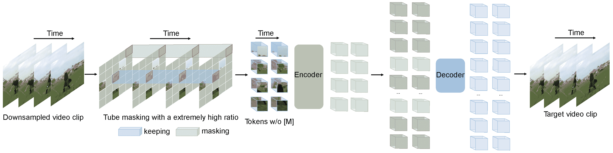

# VideoMAE

> 原文：[`huggingface.co/docs/transformers/v4.37.2/en/model_doc/videomae`](https://huggingface.co/docs/transformers/v4.37.2/en/model_doc/videomae)

## 概述

VideoMAE 模型由 Zhan Tong, Yibing Song, Jue Wang, Limin Wang 在[VideoMAE: Masked Autoencoders are Data-Efficient Learners for Self-Supervised Video Pre-Training](https://arxiv.org/abs/2203.12602)中提出。VideoMAE 将遮罩自动编码器（MAE）扩展到视频，声称在几个视频分类基准上表现出色。

论文摘要如下：

*通常需要在额外大规模数据集上预训练视频变换器，才能在相对小的数据集上实现最佳性能。在本文中，我们展示了视频遮罩自动编码器（VideoMAE）是自监督视频预训练（SSVP）的数据高效学习者。我们受到最近的 ImageMAE 的启发，提出了定制的视频管道遮罩和重建。这些简单的设计对于克服视频重建过程中由时间相关性引起的信息泄漏是有效的。我们在 SSVP 上得出了三个重要发现：（1）极高比例的遮罩比率（即 90% 到 95%）仍然能够产生 VideoMAE 的良好性能。时间上冗余的视频内容使得遮罩比率比图像更高。 （2）VideoMAE 在非常小的数据集上（即约 3k-4k 视频）取得了令人印象深刻的结果，而没有使用任何额外数据。这部分归因于视频重建任务的挑战，以强制进行高级结构学习。 （3）VideoMAE 表明，对于 SSVP，数据质量比数据数量更重要。预训练和目标数据集之间的领域转移是 SSVP 中的重要问题。值得注意的是，我们的 VideoMAE 与基本的 ViT 骨干可以在 Kinects-400 上达到 83.9%，在 Something-Something V2 上达到 75.3%，在 UCF101 上达到 90.8%，在 HMDB51 上达到 61.1%，而没有使用任何额外数据。*

 VideoMAE 预训练。摘自[原始论文](https://arxiv.org/abs/2203.12602)。

此模型由[nielsr](https://huggingface.co/nielsr)贡献。原始代码可在[此处](https://github.com/MCG-NJU/VideoMAE)找到。

## 资源

官方 Hugging Face 和社区（由 🌎 表示）资源列表，可帮助您开始使用 VideoMAE。如果您有兴趣提交资源以包含在此处，请随时提交拉取请求，我们将进行审核！资源应该展示一些新内容，而不是重复现有资源。

**视频分类**

+   [一个笔记本](https://github.com/huggingface/notebooks/blob/main/examples/video_classification.ipynb)，展示如何在自定义数据集上微调 VideoMAE 模型。

+   视频分类任务指南

+   [一个 🤗 空间](https://huggingface.co/spaces/sayakpaul/video-classification-ucf101-subset)，展示如何使用视频分类模型进行推理。

## VideoMAEConfig

### `class transformers.VideoMAEConfig`

[<来源>](https://github.com/huggingface/transformers/blob/v4.37.2/src/transformers/models/videomae/configuration_videomae.py#L28)

```py
( image_size = 224 patch_size = 16 num_channels = 3 num_frames = 16 tubelet_size = 2 hidden_size = 768 num_hidden_layers = 12 num_attention_heads = 12 intermediate_size = 3072 hidden_act = 'gelu' hidden_dropout_prob = 0.0 attention_probs_dropout_prob = 0.0 initializer_range = 0.02 layer_norm_eps = 1e-12 qkv_bias = True use_mean_pooling = True decoder_num_attention_heads = 6 decoder_hidden_size = 384 decoder_num_hidden_layers = 4 decoder_intermediate_size = 1536 norm_pix_loss = True **kwargs )
```

参数

+   `image_size` (`int`, *可选*, 默认为 224) — 每个图像的大小（分辨率）。

+   `patch_size` (`int`, *可选*, 默认为 16) — 每个补丁的大小（分辨率）。

+   `num_channels` (`int`, *可选*, 默认为 3) — 输入通道数量。

+   `num_frames` (`int`, *可选*, 默认为 16) — 每个视频中的帧数。

+   `tubelet_size` (`int`, *可选*, 默认为 2) — 管道大小。

+   `hidden_size` (`int`, *可选*, 默认为 768) — 编码器层和池化层的维度。

+   `num_hidden_layers` (`int`, *可选*, 默认为 12) — Transformer 编码器中的隐藏层数量。

+   `num_attention_heads` (`int`, *optional*, 默认为 12) — Transformer 编码器中每个注意力层的注意力头数量。

+   `intermediate_size` (`int`, *optional*, 默认为 3072) — Transformer 编码器中“中间”（即前馈）层的维度。

+   `hidden_act` (`str`或`function`, *optional*, 默认为`"gelu"`) — 编码器和池化器中的非线性激活函数（函数或字符串）。如果是字符串，支持`"gelu"`、`"relu"`、`"selu"`和`"gelu_new"`。

+   `hidden_dropout_prob` (`float`, *optional*, 默认为 0.0) — 嵌入层、编码器和池化器中所有全连接层的 dropout 概率。

+   `attention_probs_dropout_prob` (`float`, *optional*, 默认为 0.0) — 注意力概率的 dropout 比率。

+   `initializer_range` (`float`, *optional*, 默认为 0.02) — 用于初始化所有权重矩阵的截断正态初始化器的标准差。

+   `layer_norm_eps` (`float`, *optional*, 默认为 1e-12) — 层归一化层使用的 epsilon。

+   `qkv_bias` (`bool`, *optional*, 默认为`True`) — 是否为查询、键和值添加偏置。

+   `use_mean_pooling` (`bool`, *optional*, 默认为`True`) — 是否对最终隐藏状态进行均值池化，而不是使用[CLS]标记的最终隐藏状态。

+   `decoder_num_attention_heads` (`int`, *optional*, 默认为 6) — 解码器中每个注意力层的注意力头数量。

+   `decoder_hidden_size` (`int`, *optional*, 默认为 384) — 解码器的维度。

+   `decoder_num_hidden_layers` (`int`, *optional*, 默认为 4) — 解码器中的隐藏层数量。

+   `decoder_intermediate_size` (`int`, *optional*, 默认为 1536) — 解码器中“中间”（即前馈）层的维度。

+   `norm_pix_loss` (`bool`, *optional*, 默认为`True`) — 是否对目标补丁像素进行归一化。

这是一个配置类，用于存储 VideoMAEModel 的配置。根据指定的参数实例化一个 VideoMAE 模型，定义模型架构。使用默认值实例化配置将产生类似于 VideoMAE[MCG-NJU/videomae-base](https://huggingface.co/MCG-NJU/videomae-base)架构的配置。

配置对象继承自 PretrainedConfig，可用于控制模型输出。阅读 PretrainedConfig 的文档以获取更多信息。

示例:

```py
>>> from transformers import VideoMAEConfig, VideoMAEModel

>>> # Initializing a VideoMAE videomae-base style configuration
>>> configuration = VideoMAEConfig()

>>> # Randomly initializing a model from the configuration
>>> model = VideoMAEModel(configuration)

>>> # Accessing the model configuration
>>> configuration = model.config
```

## VideoMAEFeatureExtractor

### `class transformers.VideoMAEFeatureExtractor`

[<来源>](https://github.com/huggingface/transformers/blob/v4.37.2/src/transformers/models/videomae/feature_extraction_videomae.py#L26)

```py
( *args **kwargs )
```

#### `__call__`

[<来源>](https://github.com/huggingface/transformers/blob/v4.37.2/src/transformers/image_processing_utils.py#L550)

```py
( images **kwargs )
```

预处理一张图像或一批图像。

## VideoMAEImageProcessor

### `class transformers.VideoMAEImageProcessor`

[<来源>](https://github.com/huggingface/transformers/blob/v4.37.2/src/transformers/models/videomae/image_processing_videomae.py#L62)

```py
( do_resize: bool = True size: Dict = None resample: Resampling = <Resampling.BILINEAR: 2> do_center_crop: bool = True crop_size: Dict = None do_rescale: bool = True rescale_factor: Union = 0.00392156862745098 do_normalize: bool = True image_mean: Union = None image_std: Union = None **kwargs )
```

参数

+   `do_resize` (`bool`, *optional*, 默认为`True`) — 是否将图像的（高度，宽度）尺寸调整为指定的`size`。可以被`preprocess`方法中的`do_resize`参数覆盖。

+   `size` (`Dict[str, int]` *optional*, 默认为`{"shortest_edge" -- 224}`): 调整大小后的输出图像尺寸。图像的最短边将被调整为`size["shortest_edge"]`，同时保持原始图像的纵横比。可以被`preprocess`方法中的`size`覆盖。

+   `resample` (`PILImageResampling`, *optional*, 默认为 `Resampling.BILINEAR`) — 如果调整图像大小，则要使用的重采样滤波器。可以被 `preprocess` 方法中的 `resample` 参数覆盖。

+   `do_center_crop` (`bool`, *optional*, 默认为 `True`) — 是否将图像居中裁剪到指定的 `crop_size`。可以被 `preprocess` 方法中的 `do_center_crop` 参数覆盖。

+   `crop_size` (`Dict[str, int]`, *optional*, 默认为 `{"height" -- 224, "width": 224}`): 应用中心裁剪后的图像大小。可以被 `preprocess` 方法中的 `crop_size` 参数覆盖。

+   `do_rescale` (`bool`, *optional*, 默认为 `True`) — 是否按指定比例 `rescale_factor` 重新缩放图像。可以被 `preprocess` 方法中的 `do_rescale` 参数覆盖。

+   `rescale_factor` (`int` 或 `float`, *optional*, 默认为 `1/255`) — 定义要使用的缩放因子，如果重新缩放图像。可以被 `preprocess` 方法中的 `rescale_factor` 参数覆盖。

+   `do_normalize` (`bool`, *optional*, 默认为 `True`) — 是否对图像进行归一化。可以被 `preprocess` 方法中的 `do_normalize` 参数覆盖。

+   `image_mean` (`float` 或 `List[float]`, *optional*, 默认为 `IMAGENET_STANDARD_MEAN`) — 如果归一化图像，则使用的均值。这是一个浮点数或与图像通道数相同长度的浮点数列表。可以被 `preprocess` 方法中的 `image_mean` 参数覆盖。

+   `image_std` (`float` 或 `List[float]`, *optional*, 默认为 `IMAGENET_STANDARD_STD`) — 如果归一化图像，则使用的标准差。这是一个浮点数或与图像通道数相同长度的浮点数列表。可以被 `preprocess` 方法中的 `image_std` 参数覆盖。

构建一个 VideoMAE 图像处理器。

#### `preprocess`

[< source >](https://github.com/huggingface/transformers/blob/v4.37.2/src/transformers/models/videomae/image_processing_videomae.py#L233)

```py
( videos: Union do_resize: bool = None size: Dict = None resample: Resampling = None do_center_crop: bool = None crop_size: Dict = None do_rescale: bool = None rescale_factor: float = None do_normalize: bool = None image_mean: Union = None image_std: Union = None return_tensors: Union = None data_format: ChannelDimension = <ChannelDimension.FIRST: 'channels_first'> input_data_format: Union = None **kwargs )
```

参数

+   `images` (`ImageInput`) — 要预处理的图像。期望单个或批量图像，像素值范围为 0 到 255。如果传入像素值在 0 到 1 之间的图像，请设置 `do_rescale=False`。

+   `do_resize` (`bool`, *optional*, 默认为 `self.do_resize`) — 是否调整图像大小。

+   `size` (`Dict[str, int]`, *optional*, 默认为 `self.size`) — 调整大小后的图像尺寸。

+   `resample` (`PILImageResampling`, *optional*, 默认为 `self.resample`) — 如果调整图像大小，则要使用的重采样滤波器。这可以是枚举 `PILImageResampling` 中的一个，仅在 `do_resize` 设置为 `True` 时有效。

+   `do_center_crop` (`bool`, *optional*, 默认为 `self.do_centre_crop`) — 是否居中裁剪图像。

+   `crop_size` (`Dict[str, int]`, *optional*, 默认为 `self.crop_size`) — 应用中心裁剪后的图像尺寸。

+   `do_rescale` (`bool`, *optional*, 默认为 `self.do_rescale`) — 是否将图像值重新缩放在 [0 - 1] 之间。

+   `rescale_factor` (`float`, *optional*, 默认为 `self.rescale_factor`) — 如果 `do_rescale` 设置为 `True`，则重新缩放图像的缩放因子。

+   `do_normalize` (`bool`, *optional*, 默认为 `self.do_normalize`) — 是否对图像进行归一化。

+   `image_mean` (`float` 或 `List[float]`, *optional*, 默认为 `self.image_mean`) — 图像均值。

+   `image_std` (`float` 或 `List[float]`, *optional*, 默认为 `self.image_std`) — 图像标准差。

+   `return_tensors` (`str` 或 `TensorType`, *optional*) — 要返回的张量类型。可以是以下之一:

    +   未设置: 返回一个 `np.ndarray` 列表。

    +   `TensorType.TENSORFLOW` 或 `'tf'`: 返回类型为 `tf.Tensor` 的批处理。

    +   `TensorType.PYTORCH` 或 `'pt'`: 返回类型为 `torch.Tensor` 的批处理。

    +   `TensorType.NUMPY` 或 `'np'`: 返回类型为 `np.ndarray` 的批处理。

    +   `TensorType.JAX` 或 `'jax'`: 返回类型为 `jax.numpy.ndarray` 的批处理。

+   `data_format`（`ChannelDimension` 或 `str`，*可选*，默认为 `ChannelDimension.FIRST`）— 输出图像的通道维度格式。可以是以下之一：

    +   `ChannelDimension.FIRST`：图像格式为（通道数，高度，宽度）。

    +   `ChannelDimension.LAST`：图像格式为（高度，宽度，通道数）。

    +   未设置：使用推断的输入图像的通道维度格式。

+   `input_data_format`（`ChannelDimension` 或 `str`，*可选*）— 输入图像的通道维度格式。如果未设置，则从输入图像中推断通道维度格式。可以是以下之一：

    +   `"channels_first"` 或 `ChannelDimension.FIRST`：图像格式为（通道数，高度，宽度）。

    +   `"channels_last"` 或 `ChannelDimension.LAST`：图像格式为（高度，宽度，通道数）。

    +   `"none"` 或 `ChannelDimension.NONE`：图像格式为（高度，宽度）。

对图像或图像批次进行预处理。

## VideoMAEModel

### `class transformers.VideoMAEModel`

[<来源>](https://github.com/huggingface/transformers/blob/v4.37.2/src/transformers/models/videomae/modeling_videomae.py#L521)

```py
( config )
```

参数

+   `config`（VideoMAEConfig）— 具有模型所有参数的模型配置类。使用配置文件初始化不会加载与模型相关的权重，只加载配置。查看 from_pretrained() 方法以加载模型权重。

裸的 VideoMAE 模型变压器输出原始隐藏状态，没有特定的头部。此模型是 PyTorch [torch.nn.Module](https://pytorch.org/docs/stable/nn.html#torch.nn.Module) 子类。将其用作常规 PyTorch 模块，并参考 PyTorch 文档以获取有关一般用法和行为的所有相关信息。

#### `forward`

[<来源>](https://github.com/huggingface/transformers/blob/v4.37.2/src/transformers/models/videomae/modeling_videomae.py#L552)

```py
( pixel_values: FloatTensor bool_masked_pos: Optional = None head_mask: Optional = None output_attentions: Optional = None output_hidden_states: Optional = None return_dict: Optional = None ) → export const metadata = 'undefined';transformers.modeling_outputs.BaseModelOutput or tuple(torch.FloatTensor)
```

参数

+   `pixel_values`（形状为 `(batch_size, num_frames, num_channels, height, width)` 的 `torch.FloatTensor`）— 像素值。可以使用 AutoImageProcessor 获取像素值。有关详细信息，请参阅 VideoMAEImageProcessor.`call`()。

+   `head_mask`（形状为 `(num_heads,)` 或 `(num_layers, num_heads)` 的 `torch.FloatTensor`，*可选*）— 用于使自注意力模块中的选定头部失效的掩码。掩码值选定在 `[0, 1]`：

    +   1 表示头部未被掩盖，

    +   0 表示头部被“掩盖”。

+   `output_attentions`（`bool`，*可选*）— 是否返回所有注意力层的注意力张量。有关更多详细信息，请参阅返回张量下的 `attentions`。

+   `output_hidden_states`（`bool`，*可选*）— 是否返回所有层的隐藏状态。有关更多详细信息，请参阅返回张量下的 `hidden_states`。

+   `return_dict`（`bool`，*可选*）— 是否返回 ModelOutput 而不是普通元组。

+   `bool_masked_pos`（形状为 `(batch_size, sequence_length)` 的 `torch.BoolTensor`，*可选*）— 布尔掩码位置。指示哪些补丁被掩盖（1）哪些不被掩盖（0）。批次中的每个视频必须具有相同数量的掩盖补丁。如果为 `None`，则认为所有补丁都被考虑。序列长度为 `(num_frames // tubelet_size) * (image_size // patch_size) ** 2`。

返回

transformers.modeling_outputs.BaseModelOutput 或 `tuple(torch.FloatTensor)`

一个 transformers.modeling_outputs.BaseModelOutput 或一个`torch.FloatTensor`元组（如果传递`return_dict=False`或当`config.return_dict=False`时）包含各种元素，具体取决于配置（VideoMAEConfig）和输入。

+   `last_hidden_state`（形状为`(batch_size, sequence_length, hidden_size)`的`torch.FloatTensor`）- 模型最后一层的隐藏状态序列的输出。

+   `hidden_states`（`tuple(torch.FloatTensor)`，*可选*，当传递`output_hidden_states=True`或当`config.output_hidden_states=True`时返回）- 形状为`(batch_size, sequence_length, hidden_size)`的`torch.FloatTensor`元组（如果模型有嵌入层，则为嵌入的输出和每一层的输出）。

    模型在每一层输出的隐藏状态以及可选的初始嵌入输出。

+   `attentions`（`tuple(torch.FloatTensor)`，*可选*，当传递`output_attentions=True`或当`config.output_attentions=True`时返回）- 形状为`(batch_size, num_heads, sequence_length, sequence_length)`的`torch.FloatTensor`元组（每层一个）。

    在注意力 softmax 之后的注意力权重，用于计算自注意力头中的加权平均值。

VideoMAEModel 的前向方法，覆盖了`__call__`特殊方法。

虽然前向传递的步骤需要在此函数内定义，但应该在此之后调用`Module`实例，而不是在此处调用，因为前者负责运行预处理和后处理步骤，而后者会默默地忽略它们。

示例：

```py
>>> import av
>>> import numpy as np

>>> from transformers import AutoImageProcessor, VideoMAEModel
>>> from huggingface_hub import hf_hub_download

>>> np.random.seed(0)

>>> def read_video_pyav(container, indices):
...     '''
...     Decode the video with PyAV decoder.
...     Args:
...         container (`av.container.input.InputContainer`): PyAV container.
...         indices (`List[int]`): List of frame indices to decode.
...     Returns:
...         result (np.ndarray): np array of decoded frames of shape (num_frames, height, width, 3).
...     '''
...     frames = []
...     container.seek(0)
...     start_index = indices[0]
...     end_index = indices[-1]
...     for i, frame in enumerate(container.decode(video=0)):
...         if i > end_index:
...             break
...         if i >= start_index and i in indices:
...             frames.append(frame)
...     return np.stack([x.to_ndarray(format="rgb24") for x in frames])

>>> def sample_frame_indices(clip_len, frame_sample_rate, seg_len):
...     '''
...     Sample a given number of frame indices from the video.
...     Args:
...         clip_len (`int`): Total number of frames to sample.
...         frame_sample_rate (`int`): Sample every n-th frame.
...         seg_len (`int`): Maximum allowed index of sample's last frame.
...     Returns:
...         indices (`List[int]`): List of sampled frame indices
...     '''
...     converted_len = int(clip_len * frame_sample_rate)
...     end_idx = np.random.randint(converted_len, seg_len)
...     start_idx = end_idx - converted_len
...     indices = np.linspace(start_idx, end_idx, num=clip_len)
...     indices = np.clip(indices, start_idx, end_idx - 1).astype(np.int64)
...     return indices

>>> # video clip consists of 300 frames (10 seconds at 30 FPS)
>>> file_path = hf_hub_download(
...     repo_id="nielsr/video-demo", filename="eating_spaghetti.mp4", repo_type="dataset"
... )
>>> container = av.open(file_path)

>>> # sample 16 frames
>>> indices = sample_frame_indices(clip_len=16, frame_sample_rate=1, seg_len=container.streams.video[0].frames)
>>> video = read_video_pyav(container, indices)

>>> image_processor = AutoImageProcessor.from_pretrained("MCG-NJU/videomae-base")
>>> model = VideoMAEModel.from_pretrained("MCG-NJU/videomae-base")

>>> # prepare video for the model
>>> inputs = image_processor(list(video), return_tensors="pt")

>>> # forward pass
>>> outputs = model(**inputs)
>>> last_hidden_states = outputs.last_hidden_state
>>> list(last_hidden_states.shape)
[1, 1568, 768]
```

## VideoMAEForPreTraining

`VideoMAEForPreTraining`包括顶部的解码器用于自监督预训练。

### `class transformers.VideoMAEForPreTraining`

[<来源>](https://github.com/huggingface/transformers/blob/v4.37.2/src/transformers/models/videomae/modeling_videomae.py#L748)

```py
( config )
```

参数

+   `config`（VideoMAEConfig）- 模型的所有参数的模型配置类。使用配置文件初始化不会加载与模型相关的权重，只会加载配置。查看 from_pretrained()方法以加载模型权重。

带有顶部解码器的 VideoMAE 模型变压器，用于自监督预训练。此模型是 PyTorch [torch.nn.Module](https://pytorch.org/docs/stable/nn.html#torch.nn.Module)子类。将其用作常规 PyTorch 模块，并参考 PyTorch 文档以获取有关一般用法和行为的所有相关信息。

#### `forward`

[<来源>](https://github.com/huggingface/transformers/blob/v4.37.2/src/transformers/models/videomae/modeling_videomae.py#L770)

```py
( pixel_values: FloatTensor bool_masked_pos: BoolTensor head_mask: Optional = None output_attentions: Optional = None output_hidden_states: Optional = None return_dict: Optional = None ) → export const metadata = 'undefined';transformers.models.videomae.modeling_videomae.VideoMAEForPreTrainingOutput or tuple(torch.FloatTensor)
```

参数

+   `pixel_values`（形状为`(batch_size, num_frames, num_channels, height, width)`的`torch.FloatTensor`）- 像素值。可以使用 AutoImageProcessor 获取像素值。有关详细信息，请参阅 VideoMAEImageProcessor.`call`()。

+   `head_mask`（形状为`(num_heads,)`或`(num_layers, num_heads)`的`torch.FloatTensor`，*可选*）- 用于使自注意力模块中选择的头部失效的掩码。掩码值选在`[0, 1]`之间：

    +   1 表示头部未被遮蔽，

    +   0 表示头部被遮蔽。

+   `output_attentions`（`bool`，*可选*）- 是否返回所有注意力层的注意力张量。有关更多详细信息，请查看返回张量下的`attentions`。

+   output_hidden_states（`bool`，*可选*） - 是否返回所有层的隐藏状态。有关更多详细信息，请参阅返回张量下的`hidden_states`。

+   return_dict（`bool`，*可选*） - 是否返回 ModelOutput 而不是普通元组。

+   bool_masked_pos（形状为`(batch_size, sequence_length)`的`torch.BoolTensor`） - 布尔掩码位置。指示哪些补丁被掩盖（1）哪些没有（0）。批次中的每个视频必须具有相同数量的掩码补丁。序列长度为`(num_frames // tubelet_size) * (image_size // patch_size) ** 2`。

返回

`transformers.models.videomae.modeling_videomae.VideoMAEForPreTrainingOutput`或`tuple(torch.FloatTensor)`

一个`transformers.models.videomae.modeling_videomae.VideoMAEForPreTrainingOutput`或一个`torch.FloatTensor`元组（如果传递`return_dict=False`或`config.return_dict=False`），包括根据配置（VideoMAEConfig）和输入的不同元素。

+   loss（形状为`(1,)`的`torch.FloatTensor`） - 像素重建损失。

+   logits（形状为`(batch_size, patch_size ** 2 * num_channels)`的`torch.FloatTensor`） - 像素重建 logits。

+   hidden_states（`tuple(torch.FloatTensor)`，*可选*，当传递`output_hidden_states=True`或`config.output_hidden_states=True`时返回） - 形状为`(batch_size, sequence_length, hidden_size)`的`torch.FloatTensor`元组。模型在每一层的输出的隐藏状态加上初始嵌入输出。

+   attentions（`tuple(torch.FloatTensor)`，*可选*，当传递`output_attentions=True`或`config.output_attentions=True`时返回） - 形状为`(batch_size, num_heads, sequence_length, sequence_length)`的`torch.FloatTensor`元组。注意力 softmax 后的注意力权重，用于计算自注意力头中的加权平均值。

VideoMAEForPreTraining 前向方法，覆盖`__call__`特殊方法。

虽然前向传递的方法需要在此函数内定义，但应该在此之后调用`Module`实例，而不是在此处调用，因为前者负责运行前处理和后处理步骤，而后者会默默地忽略它们。

示例：

```py
>>> from transformers import AutoImageProcessor, VideoMAEForPreTraining
>>> import numpy as np
>>> import torch

>>> num_frames = 16
>>> video = list(np.random.randint(0, 256, (num_frames, 3, 224, 224)))

>>> image_processor = AutoImageProcessor.from_pretrained("MCG-NJU/videomae-base")
>>> model = VideoMAEForPreTraining.from_pretrained("MCG-NJU/videomae-base")

>>> pixel_values = image_processor(video, return_tensors="pt").pixel_values

>>> num_patches_per_frame = (model.config.image_size // model.config.patch_size) ** 2
>>> seq_length = (num_frames // model.config.tubelet_size) * num_patches_per_frame
>>> bool_masked_pos = torch.randint(0, 2, (1, seq_length)).bool()

>>> outputs = model(pixel_values, bool_masked_pos=bool_masked_pos)
>>> loss = outputs.loss
```

## VideoMAEForVideoClassification

视频分类的 VideoMAEForVideoClassification 类

[<来源>](https://github.com/huggingface/transformers/blob/v4.37.2/src/transformers/models/videomae/modeling_videomae.py#L932)

```py
( config )
```

参数

+   config（VideoMAEConfig） - 具有模型所有参数的模型配置类。使用配置文件初始化不会加载与模型关联的权重，只加载配置。查看 from_pretrained()方法以加载模型权重。

VideoMAE 模型变压器，顶部带有视频分类头（所有令牌的平均池化隐藏状态之上的线性层），例如用于 ImageNet。此模型是 PyTorch [torch.nn.Module](https://pytorch.org/docs/stable/nn.html#torch.nn.Module)子类。将其用作常规 PyTorch 模块，并参考 PyTorch 文档以获取有关一般用法和行为的所有相关信息。

#### `forward`

[<来源>](https://github.com/huggingface/transformers/blob/v4.37.2/src/transformers/models/videomae/modeling_videomae.py#L951)

```py
( pixel_values: Optional = None head_mask: Optional = None labels: Optional = None output_attentions: Optional = None output_hidden_states: Optional = None return_dict: Optional = None ) → export const metadata = 'undefined';transformers.modeling_outputs.ImageClassifierOutput or tuple(torch.FloatTensor)
```

参数

+   `pixel_values` (`torch.FloatTensor`，形状为`(batch_size, num_frames, num_channels, height, width)`) — 像素值。像素值可以使用 AutoImageProcessor 获得。有关详细信息，请参阅 VideoMAEImageProcessor.`call`()。

+   `head_mask` (`torch.FloatTensor`，形状为`(num_heads,)`或`(num_layers, num_heads)`，*可选*) — 用于使自注意力模块中选择的头部失效的掩码。掩码值选定在`[0, 1]`之间：

    +   1 表示头部未被`masked`，

    +   0 表示头部被`masked`。

+   `output_attentions` (`bool`，*可选*) — 是否返回所有注意力层的注意力张量。有关更多详细信息，请参阅返回的张量中的`attentions`。

+   `output_hidden_states` (`bool`，*可选*) — 是否返回所有层的隐藏状态。有关更多详细信息，请参阅返回的张量中的`hidden_states`。

+   `return_dict` (`bool`，*可选*) — 是否返回一个 ModelOutput 而不是一个普通元组。

+   `labels` (`torch.LongTensor`，形状为`(batch_size,)`，*可选*) — 用于计算图像分类/回归损失的标签。索引应在`[0, ..., config.num_labels - 1]`范围内。如果`config.num_labels == 1`，则计算回归损失（均方损失），如果`config.num_labels > 1`，则计算分类损失（交叉熵）。

返回值

transformers.modeling_outputs.ImageClassifierOutput 或`tuple(torch.FloatTensor)`

一个 transformers.modeling_outputs.ImageClassifierOutput 或一个`torch.FloatTensor`元组（如果传递了`return_dict=False`或当`config.return_dict=False`时）包含根据配置（VideoMAEConfig）和输入的不同元素。

+   `损失` (`torch.FloatTensor`，形状为`(1,)`，*可选*，在提供`labels`时返回) — 分类（如果`config.num_labels==1`则为回归）损失。

+   `logits` (`torch.FloatTensor`，形状为`(batch_size, config.num_labels)`) — 分类（如果`config.num_labels==1`则为回归）得分（SoftMax 之前）。

+   `hidden_states` (`tuple(torch.FloatTensor)`，*可选*，在传递`output_hidden_states=True`或当`config.output_hidden_states=True`时返回) — 形状为`(batch_size, sequence_length, hidden_size)`的`torch.FloatTensor`元组（如果模型具有嵌入层，则为嵌入的输出+每个阶段的输出）隐藏状态（也称为特征图）在每个阶段的模型输出处。

+   `attentions` (`tuple(torch.FloatTensor)`，*可选*，在传递`output_attentions=True`或当`config.output_attentions=True`时返回) — 形状为`(batch_size, num_heads, patch_size, sequence_length)`的`torch.FloatTensor`元组（每层一个）。

    在注意力 softmax 之后的注意力权重，用于计算自注意力头部的加权平均值。

VideoMAEForVideoClassification 的前向方法，覆盖了`__call__`特殊方法。

虽然前向传递的配方需要在此函数内定义，但应该在此之后调用`Module`实例，而不是在此处调用，因为前者会负责运行预处理和后处理步骤，而后者会默默地忽略它们。

示例：

```py
>>> import av
>>> import torch
>>> import numpy as np

>>> from transformers import AutoImageProcessor, VideoMAEForVideoClassification
>>> from huggingface_hub import hf_hub_download

>>> np.random.seed(0)

>>> def read_video_pyav(container, indices):
...     '''
...     Decode the video with PyAV decoder.
...     Args:
...         container (`av.container.input.InputContainer`): PyAV container.
...         indices (`List[int]`): List of frame indices to decode.
...     Returns:
...         result (np.ndarray): np array of decoded frames of shape (num_frames, height, width, 3).
...     '''
...     frames = []
...     container.seek(0)
...     start_index = indices[0]
...     end_index = indices[-1]
...     for i, frame in enumerate(container.decode(video=0)):
...         if i > end_index:
...             break
...         if i >= start_index and i in indices:
...             frames.append(frame)
...     return np.stack([x.to_ndarray(format="rgb24") for x in frames])

>>> def sample_frame_indices(clip_len, frame_sample_rate, seg_len):
...     '''
...     Sample a given number of frame indices from the video.
...     Args:
...         clip_len (`int`): Total number of frames to sample.
...         frame_sample_rate (`int`): Sample every n-th frame.
...         seg_len (`int`): Maximum allowed index of sample's last frame.
...     Returns:
...         indices (`List[int]`): List of sampled frame indices
...     '''
...     converted_len = int(clip_len * frame_sample_rate)
...     end_idx = np.random.randint(converted_len, seg_len)
...     start_idx = end_idx - converted_len
...     indices = np.linspace(start_idx, end_idx, num=clip_len)
...     indices = np.clip(indices, start_idx, end_idx - 1).astype(np.int64)
...     return indices

>>> # video clip consists of 300 frames (10 seconds at 30 FPS)
>>> file_path = hf_hub_download(
...     repo_id="nielsr/video-demo", filename="eating_spaghetti.mp4", repo_type="dataset"
... )
>>> container = av.open(file_path)

>>> # sample 16 frames
>>> indices = sample_frame_indices(clip_len=16, frame_sample_rate=1, seg_len=container.streams.video[0].frames)
>>> video = read_video_pyav(container, indices)

>>> image_processor = AutoImageProcessor.from_pretrained("MCG-NJU/videomae-base-finetuned-kinetics")
>>> model = VideoMAEForVideoClassification.from_pretrained("MCG-NJU/videomae-base-finetuned-kinetics")

>>> inputs = image_processor(list(video), return_tensors="pt")

>>> with torch.no_grad():
...     outputs = model(**inputs)
...     logits = outputs.logits

>>> # model predicts one of the 400 Kinetics-400 classes
>>> predicted_label = logits.argmax(-1).item()
>>> print(model.config.id2label[predicted_label])
eating spaghetti
```
