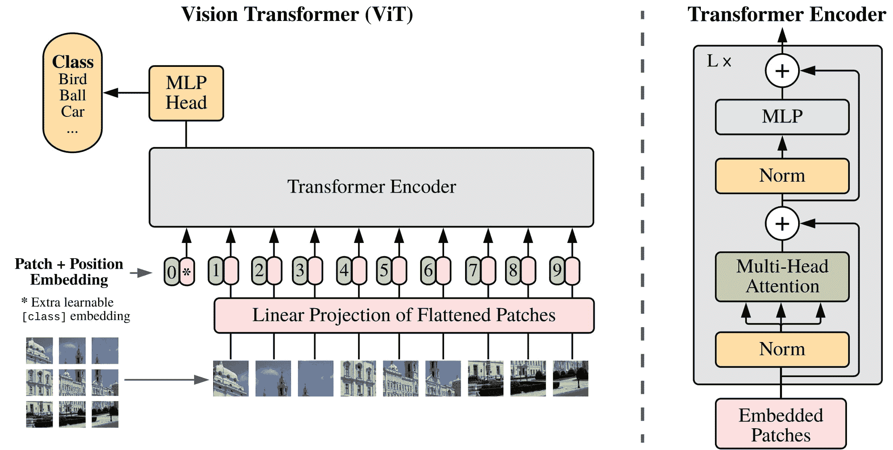

# Vision Transformer（ViT）

> 原始文本：[`huggingface.co/docs/transformers/v4.37.2/en/model_doc/vit`](https://huggingface.co/docs/transformers/v4.37.2/en/model_doc/vit)

## 概述

Vision Transformer（ViT）模型是由 Alexey Dosovitskiy、Lucas Beyer、Alexander Kolesnikov、Dirk Weissenborn、Xiaohua Zhai、Thomas Unterthiner、Mostafa Dehghani、Matthias Minderer、Georg Heigold、Sylvain Gelly、Jakob Uszkoreit、Neil Houlsby 在[一张图值 16x16 个词：用于大规模图像识别的 Transformer](https://arxiv.org/abs/2010.11929)中提出的。这是第一篇成功在 ImageNet 上训练 Transformer 编码器的论文，与熟悉的卷积架构相比取得了非常好的结果。

论文的摘要如下：

*尽管 Transformer 架构已经成为自然语言处理任务的事实标准，但它在计算机视觉中的应用仍然有限。在视觉中，注意力要么与卷积网络一起应用，要么用来替换卷积网络的某些组件，同时保持它们的整体结构。我们表明，在图像分类任务中，这种对 CNN 的依赖是不必要的，直接应用于图像块序列的纯 Transformer 可以在大量数据上进行预训练，并转移到多个中等或小型图像识别基准（ImageNet、CIFAR-100、VTAB 等）时，Vision Transformer（ViT）取得了与最先进的卷积网络相比的优异结果，同时需要较少的计算资源来训练。*

 ViT 架构。摘自[原始论文](https://arxiv.org/abs/2010.11929)。

在原始 Vision Transformer 之后，已经进行了一些后续工作：

+   DeiT（高效数据图像 Transformer）由 Facebook AI 提出。DeiT 模型是经过蒸馏的视觉 Transformer。DeiT 的作者还发布了更高效训练的 ViT 模型，您可以直接将其插入 ViTModel 或 ViTForImageClassification。有 4 个变体可用（3 种不同大小）：*facebook/deit-tiny-patch16-224*、*facebook/deit-small-patch16-224*、*facebook/deit-base-patch16-224*和*facebook/deit-base-patch16-384*。请注意，应使用 DeiTImageProcessor 来为模型准备图像。

+   BEiT（图像 Transformer 的 BERT 预训练）由微软研究院。BEiT 模型通过受 BERT 启发的自监督方法（遮蔽图像建模）和基于 VQ-VAE 的方法，优于使用监督预训练的视觉 Transformer。

+   DINO（一种用于自监督训练的 Vision Transformer 方法）由 Facebook AI 提出。使用 DINO 方法训练的 Vision Transformer 展现出与卷积模型不同的非常有趣的特性。它们能够分割对象，而无需经过训练。可以在[hub](https://huggingface.co/models?other=dino)上找到 DINO 的检查点。

+   MAE（遮蔽自动编码器）由 Facebook AI 提出。通过预训练 Vision Transformer 来重建 75%的遮蔽补丁的像素值（使用不对称的编码器-解码器架构），作者表明，这种简单方法在微调后优于监督预训练。

此模型由[nielsr](https://huggingface.co/nielsr)贡献。原始代码（使用 JAX 编写）可在[此处](https://github.com/google-research/vision_transformer)找到。

请注意，我们从 Ross Wightman 的[timm 库](https://github.com/rwightman/pytorch-image-models)中转换了权重，他已经将权重从 JAX 转换为 PyTorch。感谢他！

## 使用提示

+   为了将图像馈送到 Transformer 编码器中，每个图像被分割成一系列固定大小且不重叠的补丁，然后进行线性嵌入。添加了一个[CLS]标记，用作整个图像的表示，可用于分类。作者还添加了绝对位置嵌入，并将结果向量序列馈送到标准 Transformer 编码器。

+   由于 Vision Transformer 期望每个图像具有相同的大小（分辨率），因此可以使用 ViTImageProcessor 来调整（或重新缩放）和规范化图像以供模型使用。

+   在预训练或微调期间使用的补丁分辨率和图像分辨率反映在每个检查点的名称中。例如，`google/vit-base-patch16-224`指的是一个基本大小的架构，补丁分辨率为 16x16，微调分辨率为 224x224。所有检查点都可以在[hub](https://huggingface.co/models?search=vit)上找到。

+   可用的检查点要么（1）仅在[ImageNet-21k](http://www.image-net.org/)（一个包含 1400 万图像和 21k 类别的集合）上进行了预训练，要么（2）还在[ImageNet](http://www.image-net.org/challenges/LSVRC/2012/)（也称为 ILSVRC 2012，一个包含 130 万图像和 1000 类别的集合）上进行了微调。

+   Vision Transformer 是使用分辨率为 224x224 进行预训练的。在微调期间，通常比预训练使用更高的分辨率有益[(Touvron 等人，2019)](https://arxiv.org/abs/1906.06423)，[(Kolesnikov 等人，2020)](https://arxiv.org/abs/1912.11370)。为了在更高分辨率下微调，作者对预训练的位置嵌入进行了 2D 插值，根据它们在原始图像中的位置。

+   最佳结果是通过监督预训练获得的，这在 NLP 中并非如此。作者还进行了一个实验，使用自监督预训练目标，即掩码补丁预测（受到掩码语言建模的启发）。通过这种方法，较小的 ViT-B/16 模型在 ImageNet 上实现了 79.9%的准确率，比从头开始训练提高了 2%，但仍然落后于监督预训练 4%。

## 资源

关于推理以及在自定义数据上微调 ViT 的演示笔记本可以在[这里](https://github.com/NielsRogge/Transformers-Tutorials/tree/master/VisionTransformer)找到。这里列出了官方 Hugging Face 和社区（由🌎表示）资源的列表，以帮助您开始使用 ViT。如果您有兴趣提交资源以包含在此处，请随时打开一个 Pull Request，我们将对其进行审查！资源应该理想地展示一些新东西，而不是重复现有资源。

`ViTForImageClassification`由以下支持：

图像分类

+   关于如何使用 Hugging Face Transformers 对图像分类进行微调的博客文章

+   关于使用 Hugging Face Transformers 和`Keras`进行图像分类的博客文章

+   关于使用 Hugging Face Transformers 进行图像分类的微调的笔记

+   关于如何使用 Hugging Face Trainer 在 CIFAR-10 上微调 Vision Transformer 的笔记

+   关于如何在 CIFAR-10 上使用 PyTorch Lightning 对 Vision Transformer 进行微调的笔记

⚗️ 优化

+   关于如何使用 Optimum 对 Vision Transformer（ViT）进行量化加速的博客文章

⚡️ 推理

+   一个关于[快速演示：Google Brain 的 Vision Transformer（ViT）](https://github.com/NielsRogge/Transformers-Tutorials/blob/master/VisionTransformer/Quick_demo_of_HuggingFace_version_of_Vision_Transformer_inference.ipynb)的笔记本

🚀 部署

+   一篇关于[在 Hugging Face 中使用 TF Serving 部署 Tensorflow 视觉模型](https://huggingface.co/blog/tf-serving-vision)的博客文章

+   一篇关于[在 Vertex AI 上部署 Hugging Face ViT](https://huggingface.co/blog/deploy-vertex-ai)的博客文章

+   一篇关于[在 Kubernetes 上使用 TF Serving 部署 Hugging Face ViT](https://huggingface.co/blog/deploy-tfserving-kubernetes)的博客文章

## ViTConfig

### `class transformers.ViTConfig`

[<来源>](https://github.com/huggingface/transformers/blob/v4.37.2/src/transformers/models/vit/configuration_vit.py#L35)

```py
( hidden_size = 768 num_hidden_layers = 12 num_attention_heads = 12 intermediate_size = 3072 hidden_act = 'gelu' hidden_dropout_prob = 0.0 attention_probs_dropout_prob = 0.0 initializer_range = 0.02 layer_norm_eps = 1e-12 image_size = 224 patch_size = 16 num_channels = 3 qkv_bias = True encoder_stride = 16 **kwargs )
```

参数

+   `hidden_size` (`int`，*可选*，默认为 768) — 编码器层和池化器层的维度。

+   `num_hidden_layers` (`int`，*可选*，默认为 12) — Transformer 编码器中的隐藏层数量。

+   `num_attention_heads` (`int`，*可选*，默认为 12) — Transformer 编码器中每个注意力层的注意力头数。

+   `intermediate_size` (`int`，*可选*，默认为 3072) — Transformer 编码器中“中间”（即前馈）层的维度。

+   `hidden_act` (`str` 或 `function`，*可选*，默认为 `"gelu"`) — 编码器和池化器中的非线性激活函数（函数或字符串）。如果是字符串，支持 `"gelu"`, `"relu"`, `"selu"` 和 `"gelu_new"`。

+   `hidden_dropout_prob` (`float`，*可选*，默认为 0.0) — 嵌入层、编码器和池化器中所有全连接层的丢失概率。

+   `attention_probs_dropout_prob` (`float`，*可选*，默认为 0.0) — 注意力概率的丢失比率。

+   `initializer_range` (`float`，*可选*，默认为 0.02) — 用于初始化所有权重矩阵的截断正态初始化器的标准差。

+   `layer_norm_eps` (`float`，*可选*，默认为 1e-12) — 层归一化层使用的 epsilon。

+   `image_size` (`int`，*可选*，默认为 224) — 每个图像的大小（分辨率）。

+   `patch_size` (`int`，*可选*，默认为 16) — 每个补丁的大小（分辨率）。

+   `num_channels` (`int`，*可选*，默认为 3) — 输入通道数。

+   `qkv_bias` (`bool`，*可选*，默认为 `True`) — 是否为查询、键和值添加偏置。

+   `encoder_stride` (`int`，*可选*，默认为 16) — 用于在解码器头部增加空间分辨率的因子，用于遮蔽图像建模。

这是用于存储 ViTModel 配置的配置类。它用于根据指定的参数实例化 ViT 模型，定义模型架构。使用默认值实例化配置将产生类似于 ViT [google/vit-base-patch16-224](https://huggingface.co/google/vit-base-patch16-224) 架构的配置。

配置对象继承自 PretrainedConfig，可用于控制模型输出。阅读 PretrainedConfig 的文档以获取更多信息。

示例:

```py
>>> from transformers import ViTConfig, ViTModel

>>> # Initializing a ViT vit-base-patch16-224 style configuration
>>> configuration = ViTConfig()

>>> # Initializing a model (with random weights) from the vit-base-patch16-224 style configuration
>>> model = ViTModel(configuration)

>>> # Accessing the model configuration
>>> configuration = model.config
```

## ViTFeatureExtractor

### `class transformers.ViTFeatureExtractor`

[<来源>](https://github.com/huggingface/transformers/blob/v4.37.2/src/transformers/models/vit/feature_extraction_vit.py#L26)

```py
( *args **kwargs )
```

#### `__call__`

[<来源>](https://github.com/huggingface/transformers/blob/v4.37.2/src/transformers/image_processing_utils.py#L550)

```py
( images **kwargs )
```

预处理一张图像或一批图像。

## ViTImageProcessor

### `class transformers.ViTImageProcessor`

[<来源>](https://github.com/huggingface/transformers/blob/v4.37.2/src/transformers/models/vit/image_processing_vit.py#L41)

```py
( do_resize: bool = True size: Optional = None resample: Resampling = <Resampling.BILINEAR: 2> do_rescale: bool = True rescale_factor: Union = 0.00392156862745098 do_normalize: bool = True image_mean: Union = None image_std: Union = None **kwargs )
```

参数

+   `do_resize` (`bool`，*可选*，默认为 `True`) — 是否将图像的（高度、宽度）尺寸调整为指定的 `(size["height"], size["width"])`。可以被 `preprocess` 方法中的 `do_resize` 参数覆盖。

+   `size` (`dict`，*可选*，默认为 `{"height" -- 224, "width": 224}`): 调整大小后输出图像的尺寸。可以被 `preprocess` 方法中的 `size` 参数覆盖。

+   `resample` (`PILImageResampling`，*可选*，默认为 `Resampling.BILINEAR`) — 如果调整图像大小，则要使用的重采样滤波器。可以被 `preprocess` 方法中的 `resample` 参数覆盖。

+   `do_rescale` (`bool`，*可选*，默认为 `True`) — 是否按指定比例 `rescale_factor` 重新缩放图像。可以被 `preprocess` 方法中的 `do_rescale` 参数覆盖。

+   `rescale_factor` (`int` 或 `float`，*可选*，默认为 `1/255`) — 如果重新缩放图像，则使用的比例因子。可以被 `preprocess` 方法中的 `rescale_factor` 参数覆盖。

+   `do_normalize` (`bool`，*可选*，默认为 `True`) — 是否对图像进行归一化。可以被 `preprocess` 方法中的 `do_normalize` 参数覆盖。

+   `image_mean` (`float` 或 `List[float]`，*可选*，默认为 `IMAGENET_STANDARD_MEAN`) — 如果对图像进行归一化，要使用的均值。这是一个浮点数或与图像通道数相同长度的浮点数列表。可以被 `preprocess` 方法中的 `image_mean` 参数覆盖。

+   `image_std` (`float` 或 `List[float]`，*可选*，默认为 `IMAGENET_STANDARD_STD`) — 如果对图像进行归一化，要使用的标准差。这是一个浮点数或与图像通道数相同长度的浮点数列表。可以被 `preprocess` 方法中的 `image_std` 参数覆盖。

构建一个 ViT 图像处理器。

#### `preprocess`

[< source >](https://github.com/huggingface/transformers/blob/v4.37.2/src/transformers/models/vit/image_processing_vit.py#L146)

```py
( images: Union do_resize: Optional = None size: Dict = None resample: Resampling = None do_rescale: Optional = None rescale_factor: Optional = None do_normalize: Optional = None image_mean: Union = None image_std: Union = None return_tensors: Union = None data_format: Union = <ChannelDimension.FIRST: 'channels_first'> input_data_format: Union = None **kwargs )
```

参数

+   `images` (`ImageInput`) — 要预处理的图像。期望单个图像或批量图像，像素值范围为 0 到 255。如果传入像素值在 0 到 1 之间的图像，请设置 `do_rescale=False`。

+   `do_resize` (`bool`，*可选*，默认为 `self.do_resize`) — 是否调整图像大小。

+   `size` (`Dict[str, int]`，*可选*，默认为 `self.size`) — 格式为 `{"height": h, "width": w}` 的字典，指定调整大小后输出图像的尺寸。

+   `resample` (`PILImageResampling` 滤波器，*可选*，默认为 `self.resample`) — 如果调整图像大小，则要使用的 `PILImageResampling` 滤波器，例如 `PILImageResampling.BILINEAR`。仅在 `do_resize` 设置为 `True` 时有效。

+   `do_rescale` (`bool`，*可选*，默认为 `self.do_rescale`) — 是否将图像值重新缩放在 [0 - 1] 之间。

+   `rescale_factor` (`float`，*可选*，默认为 `self.rescale_factor`) — 如果 `do_rescale` 设置为 `True`，则重新缩放图像的重新缩放因子。

+   `do_normalize` (`bool`，*可选*，默认为 `self.do_normalize`) — 是否对图像进行归一化。

+   `image_mean` (`float` 或 `List[float]`，*可选*，默认为 `self.image_mean`) — 如果 `do_normalize` 设置为 `True`，要使用的图像均值。

+   `image_std` (`float` 或 `List[float]`，*可选*，默认为 `self.image_std`) — 如果 `do_normalize` 设置为 `True`，要使用的图像标准差。

+   `return_tensors` (`str` 或 `TensorType`，*可选*) — 要返回的张量类型。可以是以下之一：

    +   未设置: 返回一个 `np.ndarray` 列表。

    +   `TensorType.TENSORFLOW` 或 `'tf'`: 返回一个类型为 `tf.Tensor` 的批量。

    +   `TensorType.PYTORCH` 或 `'pt'`: 返回一个类型为 `torch.Tensor` 的批量。

    +   `TensorType.NUMPY` 或 `'np'`: 返回一个类型为 `np.ndarray` 的批量。

    +   `TensorType.JAX` 或 `'jax'`: 返回一个类型为 `jax.numpy.ndarray` 的批量。

+   `data_format` (`ChannelDimension` 或 `str`，*可选*，默认为 `ChannelDimension.FIRST`) — 输出图像的通道维度格式。可以是以下之一：

    +   `"channels_first"`或`ChannelDimension.FIRST`：图像以（通道数，高度，宽度）格式。

    +   `"channels_last"`或`ChannelDimension.LAST`：图像以（高度，宽度，通道数）格式。

    +   未设置：使用输入图像的通道维度格式。

+   `input_data_format` (`ChannelDimension`或`str`, *可选*) — 输入图像的通道维度格式。如果未设置，则从输入图像中推断通道维度格式。可以是以下之一：

    +   `"channels_first"`或`ChannelDimension.FIRST`：图像以（通道数，高度，宽度）格式。

    +   `"channels_last"`或`ChannelDimension.LAST`：图像以（高度，宽度，通道数）格式。

    +   `"none"`或`ChannelDimension.NONE`：图像以（高度，宽度）格式。

预处理一张图像或一批图像。

PytorchHide Pytorch 内容

## ViTModel

### `class transformers.ViTModel`

[<来源>](https://github.com/huggingface/transformers/blob/v4.37.2/src/transformers/models/vit/modeling_vit.py#L501)

```py
( config: ViTConfig add_pooling_layer: bool = True use_mask_token: bool = False )
```

参数

+   `config`（ViTConfig） — 具有模型所有参数的模型配置类。使用配置文件初始化不会加载与模型关联的权重，只加载配置。查看 from_pretrained()方法以加载模型权重。

裸 ViT 模型变压器输出原始隐藏状态，没有特定的头部。此模型是 PyTorch [torch.nn.Module](https://pytorch.org/docs/stable/nn.html#torch.nn.Module)子类。将其用作常规 PyTorch 模块，并参考 PyTorch 文档以获取有关一般用法和行为的所有相关信息。

#### `forward`

[<来源>](https://github.com/huggingface/transformers/blob/v4.37.2/src/transformers/models/vit/modeling_vit.py#L530)

```py
( pixel_values: Optional = None bool_masked_pos: Optional = None head_mask: Optional = None output_attentions: Optional = None output_hidden_states: Optional = None interpolate_pos_encoding: Optional = None return_dict: Optional = None ) → export const metadata = 'undefined';transformers.modeling_outputs.BaseModelOutputWithPooling or tuple(torch.FloatTensor)
```

参数

+   `pixel_values` (`torch.FloatTensor`，形状为`(batch_size, num_channels, height, width)`) — 像素值。可以使用 AutoImageProcessor 获取像素值。有关详细信息，请参阅 ViTImageProcessor.`call`()。

+   `head_mask` (`torch.FloatTensor`，形状为`(num_heads,)`或`(num_layers, num_heads)`，*可选*) — 用于使自注意力模块中选择的头部失效的掩码。掩码值选在`[0, 1]`之间：

    +   1 表示头部未被屏蔽，

    +   0 表示头部被屏蔽。

+   `output_attentions` (`bool`, *可选*) — 是否返回所有注意力层的注意力张量。有关更多详细信息，请参阅返回张量下的`attentions`。

+   `output_hidden_states` (`bool`, *可选*) — 是否返回所有层的隐藏状态。有关更多详细信息，请参阅返回张量下的`hidden_states`。

+   `interpolate_pos_encoding` (`bool`, *可选*) — 是否插值预训练位置编码。

+   `return_dict` (`bool`, *可选*) — 是否返回 ModelOutput 而不是普通元组。

+   `bool_masked_pos` (`torch.BoolTensor`，形状为`(batch_size, num_patches)`，*可选*) — 布尔掩码位置。指示哪些补丁被屏蔽（1）哪些没有（0）。

返回

transformers.modeling_outputs.BaseModelOutputWithPooling 或`tuple(torch.FloatTensor)`

一个 transformers.modeling_outputs.BaseModelOutputWithPooling 或一个`torch.FloatTensor`元组（如果传递了`return_dict=False`或`config.return_dict=False`时）包含各种元素，具体取决于配置（ViTConfig）和输入。

+   `last_hidden_state`（形状为`(batch_size, sequence_length, hidden_size)`的`torch.FloatTensor`）— 模型最后一层的隐藏状态序列。

+   `pooler_output`（形状为`(batch_size, hidden_size)`的`torch.FloatTensor`）— 序列的第一个标记（分类标记）的最后一层隐藏状态，在通过用于辅助预训练任务的层进一步处理后。例如，对于 BERT 系列模型，这将返回经过线性层和 tanh 激活函数处理后的分类标记。线性层的权重是在预训练期间从下一个句子预测（分类）目标中训练的。

+   `hidden_states`（`tuple(torch.FloatTensor)`，*可选*，当传递`output_hidden_states=True`或`config.output_hidden_states=True`时返回）— 形状为`(batch_size, sequence_length, hidden_size)`的`torch.FloatTensor`元组（如果模型有嵌入层，则为嵌入输出的一个+每层输出的一个）。

    模型的每一层输出的隐藏状态以及可选的初始嵌入输出。

+   `attentions`（`tuple(torch.FloatTensor)`，*可选*，当传递`output_attentions=True`或`config.output_attentions=True`时返回）— 形状为`(batch_size, num_heads, sequence_length, sequence_length)`的`torch.FloatTensor`元组（每层一个）。

    在自注意力头中使用的注意力 softmax 之后的注意力权重，用于计算加权平均值。

ViTModel 的前向方法，覆盖了`__call__`特殊方法。

尽管前向传递的步骤需要在此函数内定义，但应该在此之后调用`Module`实例，而不是在此处调用，因为前者会负责运行预处理和后处理步骤，而后者会默默地忽略它们。

示例：

```py
>>> from transformers import AutoImageProcessor, ViTModel
>>> import torch
>>> from datasets import load_dataset

>>> dataset = load_dataset("huggingface/cats-image")
>>> image = dataset["test"]["image"][0]

>>> image_processor = AutoImageProcessor.from_pretrained("google/vit-base-patch16-224-in21k")
>>> model = ViTModel.from_pretrained("google/vit-base-patch16-224-in21k")

>>> inputs = image_processor(image, return_tensors="pt")

>>> with torch.no_grad():
...     outputs = model(**inputs)

>>> last_hidden_states = outputs.last_hidden_state
>>> list(last_hidden_states.shape)
[1, 197, 768]
```

## ViTForMaskedImageModeling

### `class transformers.ViTForMaskedImageModeling`

[<来源>](https://github.com/huggingface/transformers/blob/v4.37.2/src/transformers/models/vit/modeling_vit.py#L615)

```py
( config: ViTConfig )
```

参数

+   `config`（ViTConfig）— 具有模型所有参数的模型配置类。使用配置文件初始化不会加载与模型关联的权重，只加载配置。查看 from_pretrained()方法以加载模型权重。

ViT 模型在顶部带有解码器，用于遮罩图像建模，如[SimMIM](https://arxiv.org/abs/2111.09886)中提出的。

请注意，我们在我们的[示例目录](https://github.com/huggingface/transformers/tree/main/examples/pytorch/image-pretraining)中提供了一个脚本，用于在自定义数据上预训练此模型。

此模型是 PyTorch [torch.nn.Module](https://pytorch.org/docs/stable/nn.html#torch.nn.Module)子类。将其用作常规 PyTorch 模块，并参考 PyTorch 文档以获取与一般用法和行为相关的所有事项。

#### `forward`

[<来源>](https://github.com/huggingface/transformers/blob/v4.37.2/src/transformers/models/vit/modeling_vit.py#L645)

```py
( pixel_values: Optional = None bool_masked_pos: Optional = None head_mask: Optional = None output_attentions: Optional = None output_hidden_states: Optional = None interpolate_pos_encoding: Optional = None return_dict: Optional = None ) → export const metadata = 'undefined';transformers.modeling_outputs.MaskedImageModelingOutput or tuple(torch.FloatTensor)
```

参数

+   `pixel_values`（形状为`(batch_size, num_channels, height, width)`的`torch.FloatTensor`）— 像素值。像素值可以使用 AutoImageProcessor 获取。有关详细信息，请参阅 ViTImageProcessor.`call`()。

+   `head_mask`（形状为`(num_heads,)`或`(num_layers, num_heads)`的`torch.FloatTensor`，*可选*）— 用于使自注意力模块中选择的头部失效的掩码。掩码值选择在`[0, 1]`中：

    +   1 表示头部未被`masked`。

    +   0 表示头部被`masked`。

+   `output_attentions` (`bool`，*可选*) — 是否返回所有注意力层的注意力张量。有关更多详细信息，请查看返回张量下的 `attentions`。

+   `output_hidden_states` (`bool`，*可选*) — 是否返回所有层的隐藏状态。有关更多详细信息，请查看返回张量下的 `hidden_states`。

+   `interpolate_pos_encoding` (`bool`, *可选*) — 是否插值预训练位置编码。

+   `return_dict` (`bool`，*可选*) — 是否返回 ModelOutput 而不是普通元组。

+   `bool_masked_pos` (`torch.BoolTensor`，形状为 `(batch_size, num_patches)`) — 布尔掩码位置。指示哪些补丁被掩盖（1）哪些不被掩盖（0）。

返回

`transformers.modeling_outputs.MaskedImageModelingOutput` 或 `tuple(torch.FloatTensor)`

一个 `transformers.modeling_outputs.MaskedImageModelingOutput` 或一个 `torch.FloatTensor` 元组（如果传递了 `return_dict=False` 或当 `config.return_dict=False` 时），包含根据配置（ViTConfig）和输入的不同元素。

+   `loss` (`torch.FloatTensor`，形状为 `(1,)`，*可选*，当提供 `bool_masked_pos` 时返回) — 重构损失。

+   `reconstruction` (`torch.FloatTensor`，形状为 `(batch_size, num_channels, height, width)`) — 重构/完成的图像。

+   `hidden_states` (`tuple(torch.FloatTensor)`，*可选*，当传递 `output_hidden_states=True` 时返回或

+   `when` `config.output_hidden_states=True`) — 形状为 `(batch_size, sequence_length, hidden_size)` 的 `torch.FloatTensor` 元组（如果模型具有嵌入层，则为嵌入的输出 + 每个阶段的输出）。模型在每个阶段输出的隐藏状态（也称为特征图）。

+   `attentions` (`tuple(torch.FloatTensor)`，*可选*，当传递 `output_attentions=True` 时返回或

+   `config.output_attentions=True):` 形状为 `(batch_size, num_heads, patch_size, sequence_length)` 的 `torch.FloatTensor` 元组（每层一个）。注意力 softmax 后的注意力权重，用于计算自注意力头中的加权平均值。

ViTForMaskedImageModeling 的前向方法，覆盖了 `__call__` 特殊方法。

虽然前向传递的步骤需要在此函数内定义，但应该在此之后调用 `Module` 实例，而不是在此处调用，因为前者会负责运行预处理和后处理步骤，而后者会默默地忽略它们。

示例：

```py
>>> from transformers import AutoImageProcessor, ViTForMaskedImageModeling
>>> import torch
>>> from PIL import Image
>>> import requests

>>> url = "http://images.cocodataset.org/val2017/000000039769.jpg"
>>> image = Image.open(requests.get(url, stream=True).raw)

>>> image_processor = AutoImageProcessor.from_pretrained("google/vit-base-patch16-224-in21k")
>>> model = ViTForMaskedImageModeling.from_pretrained("google/vit-base-patch16-224-in21k")

>>> num_patches = (model.config.image_size // model.config.patch_size) ** 2
>>> pixel_values = image_processor(images=image, return_tensors="pt").pixel_values
>>> # create random boolean mask of shape (batch_size, num_patches)
>>> bool_masked_pos = torch.randint(low=0, high=2, size=(1, num_patches)).bool()

>>> outputs = model(pixel_values, bool_masked_pos=bool_masked_pos)
>>> loss, reconstructed_pixel_values = outputs.loss, outputs.reconstruction
>>> list(reconstructed_pixel_values.shape)
[1, 3, 224, 224]
```

## ViTForImageClassification

### `class transformers.ViTForImageClassification`

[< source >](https://github.com/huggingface/transformers/blob/v4.37.2/src/transformers/models/vit/modeling_vit.py#L741)

```py
( config: ViTConfig )
```

参数

+   `config` (ViTConfig) — 模型配置类，包含模型的所有参数。使用配置文件初始化不会加载与模型相关的权重，只加载配置。查看 from_pretrained() 方法以加载模型权重。

ViT 模型变压器，顶部带有图像分类头（在 [CLS] 标记的最终隐藏状态之上的线性层），例如用于 ImageNet。

请注意，可以通过在模型的前向传递中将 `interpolate_pos_encoding` 设置为 `True`，在比模型训练时更高分辨率的图像上对 ViT 进行微调。这将对预训练的位置嵌入进行插值以适应更高分辨率。

这个模型是一个 PyTorch [torch.nn.Module](https://pytorch.org/docs/stable/nn.html#torch.nn.Module) 子类。将其用作常规的 PyTorch 模块，并参考 PyTorch 文档以获取有关一般用法和行为的所有信息。

#### `forward`

[< source >](https://github.com/huggingface/transformers/blob/v4.37.2/src/transformers/models/vit/modeling_vit.py#L769)

```py
( pixel_values: Optional = None head_mask: Optional = None labels: Optional = None output_attentions: Optional = None output_hidden_states: Optional = None interpolate_pos_encoding: Optional = None return_dict: Optional = None ) → export const metadata = 'undefined';transformers.modeling_outputs.ImageClassifierOutput or tuple(torch.FloatTensor)
```

参数

+   `pixel_values`（形状为 `(batch_size, num_channels, height, width)` 的 `torch.FloatTensor`）— 像素值。像素值可以使用 AutoImageProcessor 获取。有关详细信息，请参阅 ViTImageProcessor.`call`()。

+   `head_mask`（形状为 `(num_heads,)` 或 `(num_layers, num_heads)` 的 `torch.FloatTensor`，*可选*）— 用于使自注意力模块中的选定头部失效的掩码。掩码值选定在 `[0, 1]` 中：

    +   1 表示头部未被 `masked`，

    +   0 表示头部被 `masked`。

+   `output_attentions`（`bool`，*可选*）— 是否返回所有注意力层的注意力张量。有关更多详细信息，请参阅返回的张量下的 `attentions`。

+   `output_hidden_states`（`bool`，*可选*）— 是否返回所有层的隐藏状态。有关更多详细信息，请参阅返回的张量下的 `hidden_states`。

+   `interpolate_pos_encoding`（`bool`，*可选*）— 是否插值预训练位置编码。

+   `return_dict`（`bool`，*可选*）— 是否返回 ModelOutput 而不是普通元组。

+   `labels`（形状为 `(batch_size,)` 的 `torch.LongTensor`，*可选*）— 用于计算图像分类/回归损失的标签。索引应在 `[0, ..., config.num_labels - 1]` 中。如果 `config.num_labels == 1`，则计算回归损失（均方损失），如果 `config.num_labels > 1`，则计算分类损失（交叉熵）。

返回

transformers.modeling_outputs.ImageClassifierOutput 或 `tuple(torch.FloatTensor)`

一个 transformers.modeling_outputs.ImageClassifierOutput 或一个 `torch.FloatTensor` 元组（如果传递了 `return_dict=False` 或当 `config.return_dict=False` 时）包括根据配置（ViTConfig）和输入的不同元素。

+   `loss`（形状为 `(1,)` 的 `torch.FloatTensor`，*可选*，当提供 `labels` 时返回）— 分类（如果 `config.num_labels==1` 则为回归）损失。

+   `logits`（形状为 `(batch_size, config.num_labels)` 的 `torch.FloatTensor`）— 分类（如果 `config.num_labels==1` 则为回归）分数（SoftMax 之前）。

+   `hidden_states`（`tuple(torch.FloatTensor)`，*可选*，当传递 `output_hidden_states=True` 或当 `config.output_hidden_states=True` 时返回）— 形状为 `(batch_size, sequence_length, hidden_size)` 的 `torch.FloatTensor` 元组（如果模型有嵌入层，则为嵌入的输出 + 每个阶段的输出）的隐藏状态（也称为特征图）。

+   `attentions`（`tuple(torch.FloatTensor)`，*可选*，当传递 `output_attentions=True` 或当 `config.output_attentions=True` 时返回）— 形状为 `(batch_size, num_heads, patch_size, sequence_length)` 的 `torch.FloatTensor` 元组（每层一个）。

    在自注意力头中用于计算加权平均值的注意力 softmax 后的注意力权重。

ViTForImageClassification 的前向方法，覆盖了 `__call__` 特殊方法。

尽管前向传递的步骤需要在此函数内定义，但应该在此之后调用`Module`实例，而不是调用此函数，因为前者会负责运行预处理和后处理步骤，而后者会默默地忽略它们。

示例：

```py
>>> from transformers import AutoImageProcessor, ViTForImageClassification
>>> import torch
>>> from datasets import load_dataset

>>> dataset = load_dataset("huggingface/cats-image")
>>> image = dataset["test"]["image"][0]

>>> image_processor = AutoImageProcessor.from_pretrained("google/vit-base-patch16-224")
>>> model = ViTForImageClassification.from_pretrained("google/vit-base-patch16-224")

>>> inputs = image_processor(image, return_tensors="pt")

>>> with torch.no_grad():
...     logits = model(**inputs).logits

>>> # model predicts one of the 1000 ImageNet classes
>>> predicted_label = logits.argmax(-1).item()
>>> print(model.config.id2label[predicted_label])
Egyptian cat
```

TensorFlow 隐藏 TensorFlow 内容

## TFViTModel

### `class transformers.TFViTModel`

[<来源>](https://github.com/huggingface/transformers/blob/v4.37.2/src/transformers/models/vit/modeling_tf_vit.py#L740)

```py
( config: ViTConfig *inputs add_pooling_layer = True **kwargs )
```

参数

+   `config`（ViTConfig）- 模型配置类，包含模型的所有参数。使用配置文件初始化不会加载与模型相关的权重，只加载配置。查看 from_pretrained()方法以加载模型权重。

裸 ViT 模型变换器输出原始隐藏状态，没有特定的头部在顶部。

此模型继承自 TFPreTrainedModel。查看超类文档以获取库为所有模型实现的通用方法（例如下载或保存、调整输入嵌入、修剪头等）。

此模型也是[tf.keras.Model](https://www.tensorflow.org/api_docs/python/tf/keras/Model)子类。将其用作常规的 TF 2.0 Keras 模型，并参考 TF 2.0 文档以获取与一般用法和行为相关的所有事项。

`transformers`中的 TensorFlow 模型和层接受两种格式的输入：

+   将所有输入作为关键字参数（类似于 PyTorch 模型），或者

+   将所有输入作为列表、元组或字典放在第一个位置参数中。

支持第二种格式的原因是 Keras 方法在向模型和层传递输入时更喜欢这种格式。由于有这种支持，当使用`model.fit()`等方法时，应该“只需工作” - 只需以`model.fit()`支持的任何格式传递输入和标签！但是，如果您想在 Keras 方法之外使用第二种格式，例如在使用 Keras`Functional` API 创建自己的层或模型时，有三种可能性可用于收集第一个位置参数中的所有输入张量：

+   仅使用`pixel_values`作为单个张量，没有其他内容：`model(pixel_values)`

+   一个长度不定的列表，其中包含一个或多个输入张量，按照文档字符串中给定的顺序：`model([pixel_values, attention_mask])`或`model([pixel_values, attention_mask, token_type_ids])`

+   一个字典，其中包含一个或多个与文档字符串中给定的输入名称相关联的输入张量：`model({"pixel_values": pixel_values, "token_type_ids": token_type_ids})`

请注意，当使用[子类化](https://keras.io/guides/making_new_layers_and_models_via_subclassing/)创建模型和层时，您无需担心这些问题，因为您可以像对待其他 Python 函数一样传递输入！

#### `call`

[<来源>](https://github.com/huggingface/transformers/blob/v4.37.2/src/transformers/models/vit/modeling_tf_vit.py#L750)

```py
( pixel_values: TFModelInputType | None = None head_mask: np.ndarray | tf.Tensor | None = None output_attentions: Optional[bool] = None output_hidden_states: Optional[bool] = None interpolate_pos_encoding: Optional[bool] = None return_dict: Optional[bool] = None training: bool = False ) → export const metadata = 'undefined';transformers.modeling_tf_outputs.TFBaseModelOutputWithPooling or tuple(tf.Tensor)
```

参数

+   `pixel_values`（`np.ndarray`，`tf.Tensor`，`List[tf.Tensor]` ``Dict[str, tf.Tensor]`或`Dict[str, np.ndarray]`，每个示例的形状必须为`(batch_size, num_channels, height, width)`) - 像素值。可以使用 AutoImageProcessor 获取像素值。有关详细信息，请参阅 ViTImageProcessor.`call`()。

+   `head_mask`（形状为`(num_heads,)`或`(num_layers, num_heads)`的`np.ndarray`或`tf.Tensor`，*可选*） - 用于使自注意力模块的选定头部失效的掩码。掩码值选定为`[0, 1]`：

    +   1 表示头部“未屏蔽”,

    +   0 表示头部“已屏蔽”。

+   `output_attentions` (`bool`, *可选*) — 是否返回所有注意力层的注意力张量。有关更多详细信息，请参见返回张量下的`attentions`。此参数仅在急切模式下可用，在图模式下将使用配置中的值。

+   `output_hidden_states` (`bool`, *可选*) — 是否返回所有层的隐藏状态。有关更多详细信息，请参见返回张量下的`hidden_states`。此参数仅在急切模式下可用，在图模式下将使用配置中的值。

+   `interpolate_pos_encoding` (`bool`, *可选*) — 是否插值预训练位置编码。

+   `return_dict` (`bool`, *可选*) — 是否返回 ModelOutput 而不是普通元组。此参数可在急切模式下使用，在图模式下该值将始终设置为 True。

+   `training` (`bool`, *可选*, 默认为`False“) — 是否在训练模式下使用模型（一些模块如 dropout 模块在训练和评估之间有不同的行为）。

返回

transformers.modeling_tf_outputs.TFBaseModelOutputWithPooling 或`tf.Tensor`元组

一个 transformers.modeling_tf_outputs.TFBaseModelOutputWithPooling 或一个`tf.Tensor`元组（如果传递`return_dict=False`或`config.return_dict=False`）包含各种元素，取决于配置（ViTConfig）和输入。

+   `last_hidden_state` (`tf.Tensor`，形状为`(batch_size, sequence_length, hidden_size)`) — 模型最后一层的隐藏状态序列。

+   `pooler_output` (`tf.Tensor`，形状为`(batch_size, hidden_size)`) — 序列第一个标记（分类标记）的最后一层隐藏状态，经过线性层和 Tanh 激活函数进一步处理。线性层的权重是在预训练期间从下一个句子预测（分类）目标中训练的。

    该输出通常*不是*输入语义内容的良好摘要，通常最好对整个输入序列的隐藏状态进行平均或池化。

+   `hidden_states` (`tuple(tf.Tensor)`, *可选*, 当传递`output_hidden_states=True`或`config.output_hidden_states=True`时返回) — 形状为`(batch_size, sequence_length, hidden_size)`的`tf.Tensor`元组（一个用于嵌入的输出 + 一个用于每层的输出）。

    模型在每一层的输出的隐藏状态加上初始嵌入输出。

+   `attentions` (`tuple(tf.Tensor)`, *可选*, 当传递`output_attentions=True`或`config.output_attentions=True`时返回) — 形状为`(batch_size, num_heads, sequence_length, sequence_length)`的`tf.Tensor`元组（每层一个）。

    注意力 softmax 后的注意力权重，用于计算自注意力头中的加权平均值。

TFViTModel 前向方法，覆盖`__call__`特殊方法。

虽然前向传递的方法需要在此函数内定义，但应该在此之后调用`Module`实例，而不是在此处调用，因为前者会负责运行预处理和后处理步骤，而后者会默默地忽略它们。

示例：

```py
>>> from transformers import AutoImageProcessor, TFViTModel
>>> from datasets import load_dataset

>>> dataset = load_dataset("huggingface/cats-image")
>>> image = dataset["test"]["image"][0]

>>> image_processor = AutoImageProcessor.from_pretrained("google/vit-base-patch16-224-in21k")
>>> model = TFViTModel.from_pretrained("google/vit-base-patch16-224-in21k")

>>> inputs = image_processor(image, return_tensors="tf")
>>> outputs = model(**inputs)

>>> last_hidden_states = outputs.last_hidden_state
>>> list(last_hidden_states.shape)
[1, 197, 768]
```

## TFViTForImageClassification

### `class transformers.TFViTForImageClassification`

[<来源>](https://github.com/huggingface/transformers/blob/v4.37.2/src/transformers/models/vit/modeling_tf_vit.py#L819)

```py
( config: ViTConfig *inputs **kwargs )
```

参数

+   `config`（ViTConfig）— 具有模型所有参数的模型配置类。使用配置文件初始化不会加载与模型相关的权重，只会加载配置。查看 from_pretrained()方法以加载模型权重。

ViT 模型变压器，顶部带有一个图像分类头（在[CLS]标记的最终隐藏状态之上的线性层），例如用于 ImageNet。

请注意，可以通过在模型的前向传递中将`interpolate_pos_encoding`设置为`True`来在比其训练时更高分辨率的图像上微调 ViT。这将对预训练的位置嵌入进行插值到更高分辨率。

这个模型继承自 TFPreTrainedModel。查看超类文档以获取库为所有模型实现的通用方法（如下载或保存、调整输入嵌入、修剪头等）。

这个模型也是一个[tf.keras.Model](https://www.tensorflow.org/api_docs/python/tf/keras/Model)子类。将其用作常规的 TF 2.0 Keras 模型，并参考 TF 2.0 文档以获取与一般用法和行为相关的所有内容。

`transformers`中的 TensorFlow 模型和层接受两种格式的输入：

+   将所有输入作为关键字参数（类似于 PyTorch 模型），或

+   将所有输入作为列表、元组或字典放在第一个位置参数中。

支持第二种格式的原因是，当将输入传递给模型和层时，Keras 方法更喜欢这种格式。由于有了这种支持，当使用`model.fit()`等方法时，你应该可以“轻松使用” - 只需以`model.fit()`支持的任何格式传递输入和标签即可！然而，如果你想在 Keras 方法之外使用第二种格式，比如在使用 Keras`Functional`API 创建自己的层或模型时，有三种可能性可以用来收集所有输入张量放在第一个位置参数中：

+   一个只有`pixel_values`的单个张量，没有其他内容：`model(pixel_values)`

+   一个长度不定的列表，其中包含一个或多个输入张量，按照文档字符串中给定的顺序：`model([pixel_values, attention_mask])`或`model([pixel_values, attention_mask, token_type_ids])`

+   一个字典，其中包含一个或多个与文档字符串中给定的输入名称相关联的输入张量：`model({"pixel_values": pixel_values, "token_type_ids": token_type_ids})`

请注意，当使用[子类化](https://keras.io/guides/making_new_layers_and_models_via_subclassing/)创建模型和层时，你不需要担心这些问题，因为你可以像对待其他 Python 函数一样传递输入！

#### `call`

[<来源>](https://github.com/huggingface/transformers/blob/v4.37.2/src/transformers/models/vit/modeling_tf_vit.py#L849)

```py
( pixel_values: TFModelInputType | None = None head_mask: np.ndarray | tf.Tensor | None = None output_attentions: Optional[bool] = None output_hidden_states: Optional[bool] = None interpolate_pos_encoding: Optional[bool] = None return_dict: Optional[bool] = None labels: np.ndarray | tf.Tensor | None = None training: Optional[bool] = False ) → export const metadata = 'undefined';transformers.modeling_tf_outputs.TFSequenceClassifierOutput or tuple(tf.Tensor)
```

参数

+   `pixel_values`（`np.ndarray`、`tf.Tensor`、`List[tf.Tensor]`、`Dict[str, tf.Tensor]`或`Dict[str, np.ndarray]`，每个示例的形状必须为`(batch_size, num_channels, height, width)`）— 像素值。可以使用 AutoImageProcessor 获取像素值。有关详细信息，请参阅 ViTImageProcessor.`call`()。

+   `head_mask`（形状为`(num_heads,)`或`(num_layers, num_heads)`的`np.ndarray`或`tf.Tensor`，*可选*）— 用于使自注意力模块中选择的头部失效的掩码。掩码值选在`[0, 1]`之间：

    +   1 表示头部未被`masked`，

    +   0 表示头部被`masked`。

+   `output_attentions` (`bool`, *可选*) — 是否返回所有注意力层的注意力张量。有关更多详细信息，请参阅返回张量下的 `attentions`。此参数仅在急切模式下可用，在图模式下将使用配置中的值。

+   `output_hidden_states` (`bool`, *可选*) — 是否返回所有层的隐藏状态。有关更多详细信息，请参阅返回张量下的 `hidden_states`。此参数仅在急切模式下可用，在图模式下将使用配置中的值。

+   `interpolate_pos_encoding` (`bool`, *可选*) — 是否插值预训练的位置编码。

+   `return_dict` (`bool`, *可选*) — 是否返回 ModelOutput 而不是普通元组。此参数仅在急切模式下可用，在图模式下该值将始终设置为 True。

+   `training` (`bool`, *可选*, 默认为 `False“) — 是否在训练模式下使用模型（一些模块如 dropout 模块在训练和评估之间有不同的行为）。

+   `labels` (`tf.Tensor` 或形状为 `(batch_size,)` 的 `np.ndarray`，*可选*) — 用于计算图像分类/回归损失的标签。索引应在 `[0, ..., config.num_labels - 1]` 中。如果 `config.num_labels == 1`，则计算回归损失（均方损失），如果 `config.num_labels > 1`，则计算分类损失（交叉熵）。

返回

transformers.modeling_tf_outputs.TFSequenceClassifierOutput 或 `tuple(tf.Tensor)`

一个 transformers.modeling_tf_outputs.TFSequenceClassifierOutput 或一个 `tf.Tensor` 元组（如果传递 `return_dict=False` 或 `config.return_dict=False`）包含根据配置（ViTConfig）和输入的不同元素。

+   `loss` (`tf.Tensor`，形状为 `(batch_size, )`，*可选*，当提供 `labels` 时返回) — 分类（如果 `config.num_labels==1` 则为回归）损失。

+   `logits` (`tf.Tensor`，形状为 `(batch_size, config.num_labels)`) — 分类（如果 `config.num_labels==1` 则为回归）得分（SoftMax 之前）。

+   `hidden_states` (`tuple(tf.Tensor)`，*可选*，当传递 `output_hidden_states=True` 或 `config.output_hidden_states=True` 时返回） — 形状为 `(batch_size, sequence_length, hidden_size)` 的 `tf.Tensor` 元组（一个用于嵌入输出，一个用于每一层的输出）。

    模型在每一层输出的隐藏状态以及初始嵌入输出。

+   `attentions` (`tuple(tf.Tensor)`，*可选*，当传递 `output_attentions=True` 或 `config.output_attentions=True` 时返回） — 形状为 `(batch_size, num_heads, sequence_length, sequence_length)` 的 `tf.Tensor` 元组（每层一个）。

    注意力 softmax 后的注意力权重，用于计算自注意力头中的加权平均值。

TFViTForImageClassification 的前向方法，覆盖了 `__call__` 特殊方法。

虽然前向传递的配方需要在此函数内定义，但应该在此之后调用 `Module` 实例，而不是这个，因为前者负责运行预处理和后处理步骤，而后者会默默地忽略它们。

示例：

```py
>>> from transformers import AutoImageProcessor, TFViTForImageClassification
>>> import tensorflow as tf
>>> from datasets import load_dataset

>>> dataset = load_dataset("huggingface/cats-image")
>>> image = dataset["test"]["image"][0]

>>> image_processor = AutoImageProcessor.from_pretrained("google/vit-base-patch16-224")
>>> model = TFViTForImageClassification.from_pretrained("google/vit-base-patch16-224")

>>> inputs = image_processor(image, return_tensors="tf")
>>> logits = model(**inputs).logits

>>> # model predicts one of the 1000 ImageNet classes
>>> predicted_label = int(tf.math.argmax(logits, axis=-1))
>>> print(model.config.id2label[predicted_label])
Egyptian cat
```

JAXHide JAX 内容

## FlaxVitModel

### `class transformers.FlaxViTModel`

[<来源>](https://github.com/huggingface/transformers/blob/v4.37.2/src/transformers/models/vit/modeling_flax_vit.py#L552)

```py
( config: ViTConfig input_shape = None seed: int = 0 dtype: dtype = <class 'jax.numpy.float32'> _do_init: bool = True **kwargs )
```

参数
