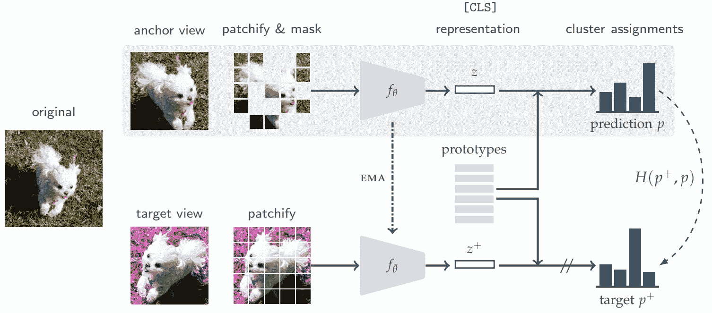

# ViTMSN

> 原文：[`huggingface.co/docs/transformers/v4.37.2/en/model_doc/vit_msn`](https://huggingface.co/docs/transformers/v4.37.2/en/model_doc/vit_msn)

## 概述

ViTMSN 模型是由 Mahmoud Assran、Mathilde Caron、Ishan Misra、Piotr Bojanowski、Florian Bordes、Pascal Vincent、Armand Joulin、Michael Rabbat、Nicolas Ballas 提出的[用于标签高效学习的 Masked Siamese Networks](https://arxiv.org/abs/2204.07141)。该论文提出了一种联合嵌入架构，用于将屏蔽补丁的原型与未屏蔽补丁的原型进行匹配。通过这种设置，他们的方法在低样本和极低样本情况下表现出色。

论文摘要如下：

*我们提出了 Masked Siamese Networks（MSN），这是一个用于学习图像表示的自监督学习框架。我们的方法将包含随机屏蔽补丁的图像视图的表示与原始未屏蔽图像的表示进行匹配。这种自监督预训练策略在应用于 Vision Transformers 时尤其可扩展，因为网络只处理未屏蔽的补丁。因此，MSN 提高了联合嵌入架构的可扩展性，同时产生了高语义级别的表示，在低样本图像分类方面表现出竞争力。例如，在 ImageNet-1K 上，仅使用 5,000 个带注释的图像，我们的基础 MSN 模型实现了 72.4%的 top-1 准确率，而仅使用 1%的 ImageNet-1K 标签，我们实现了 75.7%的 top-1 准确率，为该基准上的自监督学习树立了新的技术水平。*

 MSN 架构。摘自[原始论文。](https://arxiv.org/abs/2204.07141)

此模型由[sayakpaul](https://huggingface.co/sayakpaul)贡献。原始代码可以在[此处](https://github.com/facebookresearch/msn)找到。

## 使用提示

+   MSN（masked siamese networks）是一种用于自监督预训练 Vision Transformers（ViTs）的方法。预训练目标是将分配给图像未屏蔽视图的原型与相同图像的屏蔽视图的原型进行匹配。

+   作者仅发布了骨干（ImageNet-1k 预训练）的预训练权重。因此，要在自己的图像分类数据集上使用，使用从 ViTMSNModel 初始化的 ViTMSNForImageClassification 类。请参考[此笔记本](https://github.com/huggingface/notebooks/blob/main/examples/image_classification.ipynb)进行详细的微调教程。

+   MSN 在低样本和极低样本情况下特别有用。值得注意的是，当微调时，它仅使用 1%的 ImageNet-1K 标签就可以达到 75.7%的 top-1 准确率。

## 资源

官方 Hugging Face 和社区（由🌎表示）资源列表，帮助您开始使用 ViT MSN。

图像分类

+   ViTMSNForImageClassification 由这个[示例脚本](https://github.com/huggingface/transformers/tree/main/examples/pytorch/image-classification)和[笔记本](https://colab.research.google.com/github/huggingface/notebooks/blob/main/examples/image_classification.ipynb)支持。

+   另请参阅：图像分类任务指南

如果您有兴趣提交资源以包含在此处，请随时提交拉取请求，我们将进行审核！资源应该展示出新的东西，而不是重复现有资源。

## ViTMSNConfig

### `class transformers.ViTMSNConfig`

[<来源>](https://github.com/huggingface/transformers/blob/v4.37.2/src/transformers/models/vit_msn/configuration_vit_msn.py#L30)

```py
( hidden_size = 768 num_hidden_layers = 12 num_attention_heads = 12 intermediate_size = 3072 hidden_act = 'gelu' hidden_dropout_prob = 0.0 attention_probs_dropout_prob = 0.0 initializer_range = 0.02 layer_norm_eps = 1e-06 image_size = 224 patch_size = 16 num_channels = 3 qkv_bias = True **kwargs )
```

参数

+   `hidden_size` (`int`, *optional*, defaults to 768) — 编码器层和池化器层的维度。

+   `num_hidden_layers` (`int`, *optional*, defaults to 12) — Transformer 编码器中的隐藏层数量。

+   `num_attention_heads` (`int`, *optional*, defaults to 12) — Transformer 编码器中每个注意力层的注意力头数。

+   `intermediate_size` (`int`, *optional*, defaults to 3072) — Transformer 编码器中“中间”（即前馈）层的维度。

+   `hidden_act` (`str` or `function`, *optional*, defaults to `"gelu"`) — 编码器和池化器中的非线性激活函数（函数或字符串）。如果是字符串，支持`"gelu"`、`"relu"`、`"selu"`和`"gelu_new"`。

+   `hidden_dropout_prob` (`float`, *optional*, defaults to 0.0) — 嵌入、编码器和池化器中所有全连接层的丢弃概率。

+   `attention_probs_dropout_prob` (`float`, *optional*, defaults to 0.0) — 注意力概率的丢弃比率。

+   `initializer_range` (`float`, *optional*, defaults to 0.02) — 用于初始化所有权重矩阵的截断正态初始化器的标准差。

+   `layer_norm_eps` (`float`, *optional*, defaults to 1e-06) — 层归一化层使用的 epsilon。

+   `image_size` (`int`, *optional*, defaults to 224) — 每个图像的大小（分辨率）。

+   `patch_size` (`int`, *optional*, defaults to 16) — 每个补丁的大小（分辨率）。

+   `num_channels` (`int`, *optional*, defaults to 3) — 输入通道的数量。

+   `qkv_bias` (`bool`, *optional*, defaults to `True`) — 是否向查询、键和值添加偏置。

这是用于存储 ViTMSNModel 配置的配置类。根据指定的参数实例化 ViT MSN 模型，定义模型架构。使用默认值实例化配置将产生类似于 ViT [facebook/vit_msn_base](https://huggingface.co/facebook/vit_msn_base) 架构的配置。

配置对象继承自 PretrainedConfig，可用于控制模型输出。阅读 PretrainedConfig 的文档以获取更多信息。

示例：

```py
>>> from transformers import ViTMSNModel, ViTMSNConfig

>>> # Initializing a ViT MSN vit-msn-base style configuration
>>> configuration = ViTConfig()

>>> # Initializing a model from the vit-msn-base style configuration
>>> model = ViTMSNModel(configuration)

>>> # Accessing the model configuration
>>> configuration = model.config
```

## ViTMSNModel

### `class transformers.ViTMSNModel`

[<来源>](https://github.com/huggingface/transformers/blob/v4.37.2/src/transformers/models/vit_msn/modeling_vit_msn.py#L478)

```py
( config: ViTMSNConfig use_mask_token: bool = False )
```

参数

+   `config` (ViTMSNConfig) — 具有模型所有参数的模型配置类。使用配置文件初始化不会加载与模型关联的权重，只会加载配置。查看 from_pretrained() 方法以加载模型权重。

裸的 ViTMSN 模型输出原始隐藏状态，没有特定的头部。这个模型是 PyTorch [torch.nn.Module](https://pytorch.org/docs/stable/nn.html#torch.nn.Module) 的子类。将其用作常规的 PyTorch 模块，并参考 PyTorch 文档以获取有关一般用法和行为的所有信息。

#### `forward`

[<来源>](https://github.com/huggingface/transformers/blob/v4.37.2/src/transformers/models/vit_msn/modeling_vit_msn.py#L506)

```py
( pixel_values: Optional = None bool_masked_pos: Optional = None head_mask: Optional = None output_attentions: Optional = None output_hidden_states: Optional = None interpolate_pos_encoding: Optional = None return_dict: Optional = None ) → export const metadata = 'undefined';transformers.modeling_outputs.BaseModelOutput or tuple(torch.FloatTensor)
```

参数

+   `pixel_values` (`torch.FloatTensor`，形状为`(batch_size, num_channels, height, width)`） — 像素值。可以使用 AutoImageProcessor 获取像素值。有关详细信息，请参阅 ViTImageProcessor.`call`()。

+   `head_mask`（形状为`(num_heads,)`或`(num_layers, num_heads)`的`torch.FloatTensor`，*可选*）— 用于使自注意力模块中选择的头部失效的掩码。在`[0, 1]`中选择的掩码值：

    +   1 表示头部未被遮蔽，

    +   0 表示头部被遮蔽。

+   `output_attentions`（`bool`，*可选*）— 是否返回所有注意力层的注意力张量。有关更多详细信息，请参见返回张量下的`attentions`。

+   `output_hidden_states`（`bool`，*可选*）— 是否返回所有层的隐藏状态。有关更多详细信息，请参见返回张量下的`hidden_states`。

+   `interpolate_pos_encoding`（`bool`，*可选*）— 是否插值预训练位置编码。

+   `return_dict`（`bool`，*可选*）— 是否返回一个 ModelOutput 而不是一个普通元组。

+   `bool_masked_pos`（形状为`(batch_size, num_patches)`的`torch.BoolTensor`，*可选*）— 布尔遮蔽位置。指示哪些补丁被遮蔽（1）哪些没有（0）。

返回

transformers.modeling_outputs.BaseModelOutput 或`tuple(torch.FloatTensor)`

一个 transformers.modeling_outputs.BaseModelOutput 或一个`torch.FloatTensor`元组（如果传递`return_dict=False`或`config.return_dict=False`时）包含根据配置（ViTMSNConfig）和输入不同元素。

+   `last_hidden_state`（形状为`(batch_size, sequence_length, hidden_size)`的`torch.FloatTensor`）— 模型最后一层的隐藏状态序列。

+   `hidden_states`（`tuple(torch.FloatTensor)`，*可选*，当传递`output_hidden_states=True`或`config.output_hidden_states=True`时返回）— 形状为`(batch_size, sequence_length, hidden_size)`的`torch.FloatTensor`元组（如果模型有嵌入层，则为嵌入输出的输出+每层的输出）。

    模型在每一层输出的隐藏状态加上可选的初始嵌入输出。

+   `attentions`（`tuple(torch.FloatTensor)`，*可选*，当传递`output_attentions=True`或`config.output_attentions=True`时返回）— 形状为`(batch_size, num_heads, sequence_length, sequence_length)`的`torch.FloatTensor`元组（每层一个）。

    在注意力 softmax 之后的注意力权重，用于计算自注意力头中的加权平均值。

ViTMSNModel 前向方法，覆盖`__call__`特殊方法。

虽然前向传递的方法需要在此函数内定义，但应该在此之后调用`Module`实例，而不是在此处调用，因为前者负责运行预处理和后处理步骤，而后者会默默地忽略它们。

示例：

```py
>>> from transformers import AutoImageProcessor, ViTMSNModel
>>> import torch
>>> from PIL import Image
>>> import requests

>>> url = "http://images.cocodataset.org/val2017/000000039769.jpg"
>>> image = Image.open(requests.get(url, stream=True).raw)

>>> image_processor = AutoImageProcessor.from_pretrained("facebook/vit-msn-small")
>>> model = ViTMSNModel.from_pretrained("facebook/vit-msn-small")
>>> inputs = image_processor(images=image, return_tensors="pt")
>>> with torch.no_grad():
...     outputs = model(**inputs)
>>> last_hidden_states = outputs.last_hidden_state
```

## ViTMSNForImageClassification

### `class transformers.ViTMSNForImageClassification`

[<来源>](https://github.com/huggingface/transformers/blob/v4.37.2/src/transformers/models/vit_msn/modeling_vit_msn.py#L585)

```py
( config: ViTMSNConfig )
```

参数

+   `config`（ViTMSNConfig）— 具有模型所有参数的模型配置类。使用配置文件初始化不会加载与模型关联的权重，只加载配置。查看 from_pretrained()方法以加载模型权重。

ViTMSN 模型，顶部带有图像分类头，例如用于 ImageNet。

该模型是一个 PyTorch [torch.nn.Module](https://pytorch.org/docs/stable/nn.html#torch.nn.Module)子类。将其用作常规的 PyTorch 模块，并参考 PyTorch 文档以获取与一般用法和行为相关的所有事项。

#### `forward`

[<来源>](https://github.com/huggingface/transformers/blob/v4.37.2/src/transformers/models/vit_msn/modeling_vit_msn.py#L604)

```py
( pixel_values: Optional = None head_mask: Optional = None labels: Optional = None output_attentions: Optional = None output_hidden_states: Optional = None interpolate_pos_encoding: Optional = None return_dict: Optional = None ) → export const metadata = 'undefined';transformers.modeling_outputs.ImageClassifierOutput or tuple(torch.FloatTensor)
```

参数

+   `pixel_values`（`torch.FloatTensor`，形状为`(batch_size, num_channels, height, width)`）— 像素值。可以使用 AutoImageProcessor 获取像素值。有关详细信息，请参阅 ViTImageProcessor.`call`()。

+   `head_mask`（`torch.FloatTensor`，形状为`(num_heads,)`或`(num_layers, num_heads)`，*可选*）— 用于使自注意力模块中选择的头部失效的掩码。掩码值选择在`[0, 1]`之间：

    +   1 表示头部未被`掩码`，

    +   0 表示头部被`掩码`。

+   `output_attentions`（`bool`，*可选*）— 是否返回所有注意力层的注意力张量。有关更多详细信息，请参阅返回张量下的`attentions`。

+   `output_hidden_states`（`bool`，*可选*）— 是否返回所有层的隐藏状态。有关更多详细信息，请参阅返回张量下的`hidden_states`。

+   `interpolate_pos_encoding`（`bool`，*可选*）— 是否插值预训练位置编码。

+   `return_dict`（`bool`，*可选*）— 是否返回一个 ModelOutput 而不是一个普通元组。

返回

transformers.modeling_outputs.ImageClassifierOutput 或`tuple(torch.FloatTensor)`

一个 transformers.modeling_outputs.ImageClassifierOutput 或一个`torch.FloatTensor`元组（如果传递`return_dict=False`或当`config.return_dict=False`时）包含根据配置（ViTMSNConfig）和输入的不同元素。

+   `loss`（形状为`(1,)`的`torch.FloatTensor`，*可选*，当提供`labels`时返回）— 分类（如果`config.num_labels==1`则为回归）损失。

+   `logits`（形状为`(batch_size, config.num_labels)`的`torch.FloatTensor`）— 分类（如果`config.num_labels==1`则为回归）得分（SoftMax 之前）。

+   `hidden_states`（`tuple(torch.FloatTensor)`，*可选*，当传递`output_hidden_states=True`或当`config.output_hidden_states=True`时返回）— 形状为`(batch_size, sequence_length, hidden_size)`的`torch.FloatTensor`元组。模型在每个阶段的输出的隐藏状态（也称为特征图）。

+   `attentions`（`tuple(torch.FloatTensor)`，*可选*，当传递`output_attentions=True`或当`config.output_attentions=True`时返回）— 形状为`(batch_size, num_heads, patch_size, sequence_length)`的`torch.FloatTensor`元组。

    在注意力 softmax 之后的注意力权重，用于计算自注意力头中的加权平均值。

ViTMSNForImageClassification 的前向方法，覆盖了`__call__`特殊方法。

尽管前向传递的方法需要在此函数内定义，但应该在此之后调用`Module`实例，而不是在此处调用，因为前者负责运行预处理和后处理步骤，而后者会默默地忽略它们。

示例：

```py
>>> from transformers import AutoImageProcessor, ViTMSNForImageClassification
>>> import torch
>>> from PIL import Image
>>> import requests

>>> torch.manual_seed(2)
>>> url = "http://images.cocodataset.org/val2017/000000039769.jpg"
>>> image = Image.open(requests.get(url, stream=True).raw)

>>> image_processor = AutoImageProcessor.from_pretrained("facebook/vit-msn-small")
>>> model = ViTMSNForImageClassification.from_pretrained("facebook/vit-msn-small")

>>> inputs = image_processor(images=image, return_tensors="pt")
>>> with torch.no_grad():
...     logits = model(**inputs).logits
>>> # model predicts one of the 1000 ImageNet classes
>>> predicted_label = logits.argmax(-1).item()
>>> print(model.config.id2label[predicted_label])
Kerry blue terrier
```
