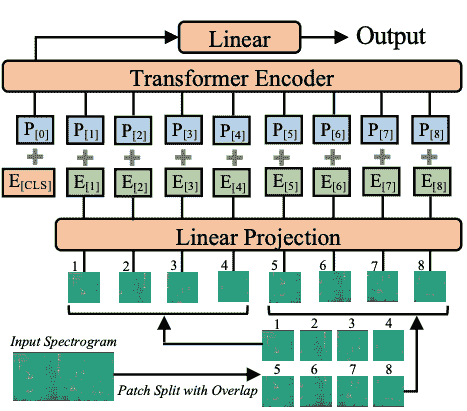

# 音频频谱变换器

> 原始文本：[`huggingface.co/docs/transformers/v4.37.2/en/model_doc/audio-spectrogram-transformer`](https://huggingface.co/docs/transformers/v4.37.2/en/model_doc/audio-spectrogram-transformer)

## 概述

音频频谱变换器模型是由 Yuan Gong、Yu-An Chung、James Glass 在 [AST: 音频频谱变换器](https://arxiv.org/abs/2104.01778) 中提出的。音频频谱变换器将视觉变换器应用于音频，通过将音频转换为图像（频谱图）。该模型在音频分类方面取得了最先进的结果。

该论文的摘要如下：

*在过去的十年中，卷积神经网络（CNN）已被广泛采用作为端到端音频分类模型的主要构建模块，旨在学习从音频频谱到相应标签的直接映射。为了更好地捕获长距离全局上下文，最近的趋势是在 CNN 之上添加自注意机制，形成 CNN-注意混合模型。然而，目前尚不清楚是否依赖于 CNN 是必要的，以及基于注意力的神经网络是否足以在音频分类中获得良好的性能。在本文中，我们通过引入音频频谱变换器（AST）来回答这个问题，这是第一个无卷积、纯注意力的音频分类模型。我们在各种音频分类基准上评估了 AST，在这些基准上取得了新的最先进结果：在 AudioSet 上的 0.485 mAP，在 ESC-50 上的 95.6% 准确率，以及在 Speech Commands V2 上的 98.1% 准确率。*

 音频频谱变换器架构。摘自[原始论文](https://arxiv.org/abs/2104.01778)。

该模型由 [nielsr](https://huggingface.co/nielsr) 贡献。原始代码可以在[这里](https://github.com/YuanGongND/ast)找到。

## 使用提示

+   在自己的数据集上微调音频频谱变换器（AST）时，建议进行输入归一化处理（确保输入的均值为 0，标准差为 0.5）。ASTFeatureExtractor 负责此操作。请注意，默认情况下它使用 AudioSet 的均值和标准差。您可以查看[`ast/src/get_norm_stats.py`](https://github.com/YuanGongND/ast/blob/master/src/get_norm_stats.py)来查看作者如何计算下游数据集的统计信息。

+   请注意，AST 需要一个较低的学习率（作者使用比他们在 [PSLA 论文](https://arxiv.org/abs/2102.01243) 中提出的 CNN 模型小 10 倍的学习率），并且收敛速度很快，因此请为您的任务搜索一个合适的学习率和学习率调度器。

## 资源

一份官方 Hugging Face 和社区（由 🌎 表示）资源列表，可帮助您开始使用音频频谱变换器。

音频分类

+   可以在[此处](https://github.com/NielsRogge/Transformers-Tutorials/tree/master/AST)找到用于音频分类的 AST 推理的笔记本。

+   ASTForAudioClassification 受到这个[示例脚本](https://github.com/huggingface/transformers/tree/main/examples/pytorch/audio-classification)和[笔记本](https://colab.research.google.com/github/huggingface/notebooks/blob/main/examples/audio_classification.ipynb)的支持。

+   另请参阅：音频分类。

如果您有兴趣提交资源以包含在此处，请随时提交拉取请求，我们将进行审查！资源应该理想地展示一些新内容，而不是重复现有资源。

## ASTConfig

### `class transformers.ASTConfig`

[<来源>](https://github.com/huggingface/transformers/blob/v4.37.2/src/transformers/models/audio_spectrogram_transformer/configuration_audio_spectrogram_transformer.py#L31)

```py
( hidden_size = 768 num_hidden_layers = 12 num_attention_heads = 12 intermediate_size = 3072 hidden_act = 'gelu' hidden_dropout_prob = 0.0 attention_probs_dropout_prob = 0.0 initializer_range = 0.02 layer_norm_eps = 1e-12 patch_size = 16 qkv_bias = True frequency_stride = 10 time_stride = 10 max_length = 1024 num_mel_bins = 128 **kwargs )
```

参数

+   `hidden_size` (`int`, *optional*, 默认为 768) — 编码器层和池化器层的维度。

+   `num_hidden_layers` (`int`, *optional*, 默认为 12) — Transformer 编码器中的隐藏层数量。

+   `num_attention_heads` (`int`, *optional*, 默认为 12) — Transformer 编码器中每个注意力层的注意力头数量。

+   `intermediate_size` (`int`, *optional*, 默认为 3072) — Transformer 编码器中“中间”（即前馈）层的维度。

+   `hidden_act` (`str`或`function`, *optional*, 默认为`"gelu"`) — 编码器和池化器中的非线性激活函数（函数或字符串）。如果是字符串，支持`"gelu"`、`"relu"`、`"selu"`和`"gelu_new"`。

+   `hidden_dropout_prob` (`float`, *optional*, 默认为 0.0) — 嵌入层、编码器和池化器中所有全连接层的丢弃概率。

+   `attention_probs_dropout_prob` (`float`, *optional*, 默认为 0.0) — 注意力概率的丢弃比例。

+   `initializer_range` (`float`, *optional*, 默认为 0.02) — 用于初始化所有权重矩阵的截断正态初始化器的标准差。

+   `layer_norm_eps` (`float`, *optional*, 默认为 1e-12) — 层归一化层使用的 epsilon。

+   `patch_size` (`int`, *optional*, 默认为 16) — 每个块的大小（分辨率）。

+   `qkv_bias` (`bool`, *optional*, 默认为`True`) — 是否为查询、键和值添加偏置。

+   `frequency_stride` (`int`, *optional*, 默认为 10) — 在制作频谱图块时使用的频率步幅。

+   `time_stride` (`int`, *optional*, 默认为 10) — 在制作频谱图块时使用的时间步幅。

+   `max_length` (`int`, *optional*, 默认为 1024) — 频谱图的时间维度。

+   `num_mel_bins` (`int`, *optional*, 默认为 128) — 频谱图的频率维度（Mel 频率箱的数量）。

这是用于存储 ASTModel 配置的配置类。它用于根据指定的参数实例化 AST 模型，定义模型架构。使用默认值实例化配置将产生类似于 AST [MIT/ast-finetuned-audioset-10-10-0.4593](https://huggingface.co/MIT/ast-finetuned-audioset-10-10-0.4593) 架构的配置。

配置对象继承自 PretrainedConfig，可用于控制模型输出。阅读 PretrainedConfig 的文档以获取更多信息。

示例：

```py
>>> from transformers import ASTConfig, ASTModel

>>> # Initializing a AST MIT/ast-finetuned-audioset-10-10-0.4593 style configuration
>>> configuration = ASTConfig()

>>> # Initializing a model (with random weights) from the MIT/ast-finetuned-audioset-10-10-0.4593 style configuration
>>> model = ASTModel(configuration)

>>> # Accessing the model configuration
>>> configuration = model.config
```

## ASTFeatureExtractor

### `class transformers.ASTFeatureExtractor`

[<来源>](https://github.com/huggingface/transformers/blob/v4.37.2/src/transformers/models/audio_spectrogram_transformer/feature_extraction_audio_spectrogram_transformer.py#L39)

```py
( feature_size = 1 sampling_rate = 16000 num_mel_bins = 128 max_length = 1024 padding_value = 0.0 do_normalize = True mean = -4.2677393 std = 4.5689974 return_attention_mask = False **kwargs )
```

参数

+   `feature_size` (`int`, *optional*, 默认为 1) — 提取特征的特征维度。

+   `sampling_rate` (`int`, *optional*, 默认为 16000) — 音频文件应数字化的采样率，以赫兹（Hz）表示。

+   `num_mel_bins` (`int`, *optional*, 默认为 128) — Mel 频率箱的数量。

+   `max_length` (`int`, *optional*, 默认为 1024) — 用于填充/截断提取特征的最大长度。

+   `do_normalize` (`bool`, *optional*, 默认为`True`) — 是否归一化对数 Mel 特征使用`mean`和`std`。

+   `mean` (`float`, *optional*, 默认为-4.2677393) — 用于归一化对数 Mel 特征的均值。默认使用 AudioSet 的均值。

+   `std`（`float`，*可选*，默认为 4.5689974）— 用于归一化 log-Mel 特征的标准差值。默认使用 AudioSet 的标准差。

+   `return_attention_mask`（`bool`，*可选*，默认为`False`）— 是否`call`()应返回`attention_mask`。

构建一个音频频谱变换器（AST）特征提取器。

此特征提取器继承自 SequenceFeatureExtractor，其中包含大部分主要方法。用户应参考此超类以获取有关这些方法的更多信息。

这个类从原始语音中提取 mel-filter bank 特征，如果安装了 TorchAudio，则使用 TorchAudio，否则使用 numpy，然后对它们进行填充/截断到固定长度，并使用均值和标准差进行归一化。

#### `__call__`

[<来源>](https://github.com/huggingface/transformers/blob/v4.37.2/src/transformers/models/audio_spectrogram_transformer/feature_extraction_audio_spectrogram_transformer.py#L161)

```py
( raw_speech: Union sampling_rate: Optional = None return_tensors: Union = None **kwargs )
```

参数

+   `raw_speech`（`np.ndarray`，`List[float]`，`List[np.ndarray]`，`List[List[float]]`）— 要填充的序列或批处理序列。每个序列可以是一个 numpy 数组，一个浮点值列表，一个 numpy 数组列表或一个浮点值列表的列表。必须是单声道音频，不是立体声，即每个时间步长一个浮点数。

+   `sampling_rate`（`int`，*可选*）— `raw_speech` 输入采样的采样率。强烈建议在前向调用时传递`sampling_rate`以防止静默错误。

+   `return_tensors`（`str`或 TensorType，*可选*）— 如果设置，将返回张量而不是 Python 整数列表。可接受的值为：

    +   `'tf'`：返回 TensorFlow `tf.constant`对象。

    +   `'pt'`：返回 PyTorch `torch.Tensor`对象。

    +   `'np'`：返回 Numpy `np.ndarray`对象。

用于对一个或多个序列进行特征化和准备模型的主要方法。

## ASTModel

### `class transformers.ASTModel`

[<来源>](https://github.com/huggingface/transformers/blob/v4.37.2/src/transformers/models/audio_spectrogram_transformer/modeling_audio_spectrogram_transformer.py#L430)

```py
( config: ASTConfig )
```

参数

+   `config`（ASTConfig）— 具有模型所有参数的模型配置类。使用配置文件初始化不会加载与模型关联的权重，只会加载配置。查看 from_pretrained()方法以加载模型权重。

裸 AST 模型转换器输出原始隐藏状态，没有特定的头部。此模型是 PyTorch [torch.nn.Module](https://pytorch.org/docs/stable/nn.html#torch.nn.Module)子类。将其用作常规 PyTorch 模块，并参考 PyTorch 文档以获取有关一般用法和行为的所有相关信息。

#### `forward`

[<来源>](https://github.com/huggingface/transformers/blob/v4.37.2/src/transformers/models/audio_spectrogram_transformer/modeling_audio_spectrogram_transformer.py#L458)

```py
( input_values: Optional = None head_mask: Optional = None output_attentions: Optional = None output_hidden_states: Optional = None return_dict: Optional = None ) → export const metadata = 'undefined';transformers.modeling_outputs.BaseModelOutputWithPooling or tuple(torch.FloatTensor)
```

参数

+   `input_values` (`torch.FloatTensor` of shape `(batch_size, max_length, num_mel_bins)`) — 从原始音频波形中提取的浮点值 mel 特征。原始音频波形可以通过将 `.flac` 或 `.wav` 音频文件加载到 `List[float]` 类型的数组或 `numpy.ndarray` 中获得，例如通过声音文件库 (`pip install soundfile`)。要准备好数组以获得 `input_features`，应使用 AutoFeatureExtractor 提取 mel 特征，填充并转换为 `torch.FloatTensor` 类型的张量。参见 `call`()

+   `head_mask` (`torch.FloatTensor` of shape `(num_heads,)` or `(num_layers, num_heads)`, *optional*) — 用于使自注意力模块中选择的头部失效的掩码。掩码值选在 `[0, 1]`：

    +   1 表示头部未被 `掩码`。

    +   0 表示头部被 `掩码`。

+   `output_attentions` (`bool`, *optional*) — 是否返回所有注意力层的注意力张量。有关更多详细信息，请参阅返回张量中的 `attentions`。

+   `output_hidden_states` (`bool`, *optional*) — 是否返回所有层的隐藏状态。有关更多详细信息，请参阅返回张量中的 `hidden_states`。

+   `return_dict` (`bool`, *optional*) — 是否返回 ModelOutput 而不是普通元组。

返回

transformers.modeling_outputs.BaseModelOutputWithPooling 或 `tuple(torch.FloatTensor)`

transformers.modeling_outputs.BaseModelOutputWithPooling 或一个 `torch.FloatTensor` 元组（如果传递了 `return_dict=False` 或当 `config.return_dict=False` 时）包含根据配置（ASTConfig）和输入的各种元素。

+   `last_hidden_state` (`torch.FloatTensor` of shape `(batch_size, sequence_length, hidden_size)`) — 模型最后一层的隐藏状态序列。

+   `pooler_output` (`torch.FloatTensor` of shape `(batch_size, hidden_size)`) — 经过用于辅助预训练任务的层进一步处理后，序列第一个标记（分类标记）的最后一层隐藏状态。例如，对于 BERT 系列模型，这返回经过线性层和双曲正切激活函数处理后的分类标记。线性层的权重是在预训练期间从下一个句子预测（分类）目标中训练的。

+   `hidden_states` (`tuple(torch.FloatTensor)`, *optional*, returned when `output_hidden_states=True` is passed or when `config.output_hidden_states=True`) — Tuple of `torch.FloatTensor` (one for the output of the embeddings, if the model has an embedding layer, + one for the output of each layer) of shape `(batch_size, sequence_length, hidden_size)`。

    模型在每一层输出的隐藏状态以及可选的初始嵌入输出。

+   `attentions` (`tuple(torch.FloatTensor)`, *optional*, returned when `output_attentions=True` is passed or when `config.output_attentions=True`) — Tuple of `torch.FloatTensor` (one for each layer) of shape `(batch_size, num_heads, sequence_length, sequence_length)`。

    自注意力头部中的注意力 softmax 后的注意力权重，用于计算自注意力头部中的加权平均值。

ASTModel 的前向方法，覆盖了 `__call__` 特殊方法。

尽管前向传递的配方需要在此函数内定义，但应该在此之后调用`Module`实例，而不是这个，因为前者负责运行前处理和后处理步骤，而后者则默默地忽略它们。

示例：

```py
>>> from transformers import AutoProcessor, ASTModel
>>> import torch
>>> from datasets import load_dataset

>>> dataset = load_dataset("hf-internal-testing/librispeech_asr_demo", "clean", split="validation")
>>> dataset = dataset.sort("id")
>>> sampling_rate = dataset.features["audio"].sampling_rate

>>> processor = AutoProcessor.from_pretrained("MIT/ast-finetuned-audioset-10-10-0.4593")
>>> model = ASTModel.from_pretrained("MIT/ast-finetuned-audioset-10-10-0.4593")

>>> # audio file is decoded on the fly
>>> inputs = processor(dataset[0]["audio"]["array"], sampling_rate=sampling_rate, return_tensors="pt")
>>> with torch.no_grad():
...     outputs = model(**inputs)

>>> last_hidden_states = outputs.last_hidden_state
>>> list(last_hidden_states.shape)
[1, 1214, 768]
```

## ASTForAudioClassification

### `class transformers.ASTForAudioClassification`

[< source >](https://github.com/huggingface/transformers/blob/v4.37.2/src/transformers/models/audio_spectrogram_transformer/modeling_audio_spectrogram_transformer.py#L527)

```py
( config: ASTConfig )
```

参数

+   `config`（ASTConfig）— 模型配置类，包含模型的所有参数。使用配置文件初始化不会加载与模型相关的权重，只加载配置。查看 from_pretrained()方法以加载模型权重。

在顶部带有音频分类头部的音频频谱变换器模型（在池化输出的顶部有一个线性层），例如用于 AudioSet、Speech Commands v2 等数据集。

这个模型是 PyTorch [torch.nn.Module](https://pytorch.org/docs/stable/nn.html#torch.nn.Module)的子类。将其用作常规的 PyTorch 模块，并参考 PyTorch 文档以获取与一般用法和行为相关的所有内容。

#### `forward`

[< source >](https://github.com/huggingface/transformers/blob/v4.37.2/src/transformers/models/audio_spectrogram_transformer/modeling_audio_spectrogram_transformer.py#L547)

```py
( input_values: Optional = None head_mask: Optional = None labels: Optional = None output_attentions: Optional = None output_hidden_states: Optional = None return_dict: Optional = None ) → export const metadata = 'undefined';transformers.modeling_outputs.SequenceClassifierOutput or tuple(torch.FloatTensor)
```

参数

+   `input_values`（形状为`(batch_size, max_length, num_mel_bins)`的`torch.FloatTensor`）— 从原始音频波形中提取的浮点值 mel 特征。原始音频波形可以通过将`.flac`或`.wav`音频文件加载到`List[float]`类型的数组或`numpy.ndarray`中获得，例如通过 soundfile 库（`pip install soundfile`）。要准备数组为`input_features`，应使用 AutoFeatureExtractor 来提取 mel 特征，填充并转换为`torch.FloatTensor`类型的张量。查看`call`()

+   `head_mask`（形状为`(num_heads,)`或`(num_layers, num_heads)`的`torch.FloatTensor`，*可选*）— 用于使自注意力模块中选择的头部失效的掩码。掩码值选在`[0, 1]`范围内：

    +   1 表示头部是`not masked`，

    +   0 表示头部是`masked`。

+   `output_attentions`（`bool`，*可选*）— 是否返回所有注意力层的注意力张量。有关更多详细信息，请参见返回张量下的`attentions`。

+   `output_hidden_states`（`bool`，*可选*）— 是否返回所有层的隐藏状态。有关更多详细信息，请参见返回张量下的`hidden_states`。

+   `return_dict`（`bool`，*可选*）— 是否返回一个 ModelOutput 而不是一个普通的元组。

+   `labels`（`torch.LongTensor`，形状为`(batch_size,)`，*可选*）— 用于计算音频分类/回归损失的标签。索引应在`[0, ..., config.num_labels - 1]`范围内。如果`config.num_labels == 1`，则计算回归损失（均方损失），如果`config.num_labels > 1`，则计算分类损失（交叉熵）。

返回

transformers.modeling_outputs.SequenceClassifierOutput 或`tuple(torch.FloatTensor)`

一个 transformers.modeling_outputs.SequenceClassifierOutput 或一个`torch.FloatTensor`元组（如果传递了`return_dict=False`或当`config.return_dict=False`时）包含根据配置（ASTConfig）和输入的不同元素。

+   `loss`（形状为`(1,)`的`torch.FloatTensor`，*可选*，当提供`labels`时返回） — 分类（如果`config.num_labels==1`则为回归）损失。

+   `logits`（形状为`(batch_size, config.num_labels)`的`torch.FloatTensor`） — 分类（如果`config.num_labels==1`则为回归）得分（在 SoftMax 之前）。

+   `hidden_states`（`tuple(torch.FloatTensor)`，*可选*，当传递`output_hidden_states=True`或当`config.output_hidden_states=True`时返回） — 形状为`(batch_size, sequence_length, hidden_size)`的`torch.FloatTensor`元组（如果模型有嵌入层，则为嵌入的输出+每层的输出）。

    模型在每一层输出的隐藏状态以及可选的初始嵌入输出。

+   `attentions`（`tuple(torch.FloatTensor)`，*可选*，当传递`output_attentions=True`或当`config.output_attentions=True`时返回） — 形状为`(batch_size, num_heads, sequence_length, sequence_length)`的`torch.FloatTensor`元组（每层一个）。

    注意力 softmax 后的注意力权重，用于计算自注意力头中的加权平均值。

ASTForAudioClassification 的前向方法，覆盖了`__call__`特殊方法。

尽管前向传递的配方需要在此函数内定义，但应该在此之后调用`Module`实例，而不是这个，因为前者负责运行预处理和后处理步骤，而后者则默默地忽略它们。

示例：

```py
>>> from transformers import AutoFeatureExtractor, ASTForAudioClassification
>>> from datasets import load_dataset
>>> import torch

>>> dataset = load_dataset("hf-internal-testing/librispeech_asr_demo", "clean", split="validation")
>>> dataset = dataset.sort("id")
>>> sampling_rate = dataset.features["audio"].sampling_rate

>>> feature_extractor = AutoFeatureExtractor.from_pretrained("MIT/ast-finetuned-audioset-10-10-0.4593")
>>> model = ASTForAudioClassification.from_pretrained("MIT/ast-finetuned-audioset-10-10-0.4593")

>>> # audio file is decoded on the fly
>>> inputs = feature_extractor(dataset[0]["audio"]["array"], sampling_rate=sampling_rate, return_tensors="pt")

>>> with torch.no_grad():
...     logits = model(**inputs).logits

>>> predicted_class_ids = torch.argmax(logits, dim=-1).item()
>>> predicted_label = model.config.id2label[predicted_class_ids]
>>> predicted_label
'Speech'

>>> # compute loss - target_label is e.g. "down"
>>> target_label = model.config.id2label[0]
>>> inputs["labels"] = torch.tensor([model.config.label2id[target_label]])
>>> loss = model(**inputs).loss
>>> round(loss.item(), 2)
0.17
```
