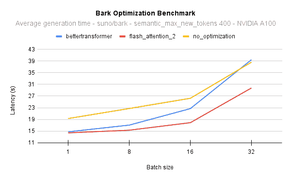

# Bark

> 原始文本：[`huggingface.co/docs/transformers/v4.37.2/en/model_doc/bark`](https://huggingface.co/docs/transformers/v4.37.2/en/model_doc/bark)

## 概述

Bark 是由 Suno AI 提出的基于 Transformer 的文本到语音模型，位于[suno-ai/bark](https://github.com/suno-ai/bark)。

Bark 由 4 个主要模型组成：

+   BarkSemanticModel（也称为“文本”模型）：一个因果自回归 Transformer 模型，其输入为标记化文本，并预测捕捉文本含义的语义文本标记。

+   BarkCoarseModel（也称为“粗声学”模型）：一个因果自回归 Transformer，其输入为 BarkSemanticModel 模型的结果。它旨在预测 EnCodec 所需的前两个音频码本。

+   BarkFineModel（“精细声学”模型），这次是一个非因果自编码器 Transformer，它根据先前码本嵌入的总和迭代预测最后的码本。

+   从 EncodecModel 中预测了所有码本通道后，Bark 使用它来解码输出音频数组。

值得注意的是，前三个模块中的每一个都可以支持条件说话者嵌入，以根据特定预定义的声音来调整输出声音。

此模型由[Yoach Lacombe (ylacombe)](https://huggingface.co/ylacombe)和[Sanchit Gandhi (sanchit-gandhi)](https://github.com/sanchit-gandhi)贡献。原始代码可以在[这里](https://github.com/suno-ai/bark)找到。

### 优化 Bark

Bark 可以通过添加几行额外的代码进行优化，**显著减少其内存占用**并**加速推理**。

#### 使用半精度

通过将模型加载为半精度，可以将推理加速并减少内存占用量 50%。

```py
from transformers import BarkModel
import torch

device = "cuda" if torch.cuda.is_available() else "cpu"
model = BarkModel.from_pretrained("suno/bark-small", torch_dtype=torch.float16).to(device)
```

#### 使用 CPU 卸载

如上所述，Bark 由 4 个子模型组成，在音频生成过程中按顺序调用。换句话说，当一个子模型在使用时，其他子模型处于空闲状态。

如果您正在使用 CUDA 设备，要获得 80%的内存占用减少，一个简单的解决方案是在子模型空闲时将其从 GPU 卸载到 CPU。这个操作称为*CPU 卸载*。您可以使用以下一行代码来实现：

```py
model.enable_cpu_offload()
```

请注意，在使用此功能之前，必须安装🤗 Accelerate。[这里是如何安装它的方法。](https://huggingface.co/docs/accelerate/basic_tutorials/install)

#### 使用 Better Transformer

Better Transformer 是一个🤗 Optimum 功能，可以在后台执行内核融合。您可以获得 20%至 30%的速度提升，而性能不会降低。只需一行代码即可将模型导出到🤗 Better Transformer：

```py
model =  model.to_bettertransformer()
```

请注意，在使用此功能之前，必须安装🤗 Optimum。[这里是如何安装它的方法。](https://huggingface.co/docs/optimum/installation)

#### 使用 Flash Attention 2

Flash Attention 2 是前一个优化的更快、优化版本。

##### 安装

首先，检查您的硬件是否与 Flash Attention 2 兼容。最新的兼容硬件列表可以在[官方文档](https://github.com/Dao-AILab/flash-attention#installation-and-features)中找到。如果您的硬件与 Flash Attention 2 不兼容，您仍然可以通过上面提到的 Better Transformer 支持从注意力内核优化中受益。

接下来，[安装](https://github.com/Dao-AILab/flash-attention#installation-and-features)最新版本的 Flash Attention 2：

```py
pip install -U flash-attn --no-build-isolation
```

##### 用法

要使用 Flash Attention 2 加载模型，我们可以通过在[`.from_pretrained`](https://huggingface.co/docs/transformers/main/en/main_classes/model#transformers.PreTrainedModel.from_pretrained)中传递`attn_implementation="flash_attention_2"`标志来实现。我们还将以半精度（例如`torch.float16`）加载模型，因为这几乎不会对音频质量造成降级，但内存使用量明显降低，推理速度更快：

```py
model = BarkModel.from_pretrained("suno/bark-small", torch_dtype=torch.float16, attn_implementation="flash_attention_2").to(device)
```

##### 性能比较

以下图表显示了原生注意力实现（无优化）与 Better Transformer 和 Flash Attention 2 之间的延迟。在所有情况下，我们在 40GB A100 GPU 上使用 PyTorch 2.1 生成 400 个语义标记。Flash Attention 2 也比 Better Transformer 更快，并且随着批量大小的增加，其性能甚至更好：



举个例子，在 NVIDIA A100 上，当使用批量大小为 16 生成 400 个语义标记时，您可以获得 17 倍的[吞吐量](https://huggingface.co/blog/optimizing-bark#throughput)，并且仍然比使用原生模型实现逐句生成句子快 2 秒。换句话说，所有样本将生成速度提高 17 倍。

在批量大小为 8 时，在 NVIDIA A100 上，Flash Attention 2 也比 Better Transformer 快 10%，在批量大小为 16 时，快 25%。

#### 结合优化技术

您可以结合优化技术，同时使用 CPU 卸载、半精度和 Flash Attention 2（或🤗 Better Transformer）。

```py
from transformers import BarkModel
import torch

device = "cuda" if torch.cuda.is_available() else "cpu"

# load in fp16 and use Flash Attention 2
model = BarkModel.from_pretrained("suno/bark-small", torch_dtype=torch.float16, attn_implementation="flash_attention_2").to(device)

# enable CPU offload
model.enable_cpu_offload()
```

在推理优化技术上了解更多信息[这里](https://huggingface.co/docs/transformers/perf_infer_gpu_one)。

### 使用提示

Suno 提供了多种语言的声音预设库[这里](https://suno-ai.notion.site/8b8e8749ed514b0cbf3f699013548683?v=bc67cff786b04b50b3ceb756fd05f68c)。这些预设也上传到了 hub [这里](https://huggingface.co/suno/bark-small/tree/main/speaker_embeddings) 或 [这里](https://huggingface.co/suno/bark/tree/main/speaker_embeddings)。

```py
>>> from transformers import AutoProcessor, BarkModel

>>> processor = AutoProcessor.from_pretrained("suno/bark")
>>> model = BarkModel.from_pretrained("suno/bark")

>>> voice_preset = "v2/en_speaker_6"

>>> inputs = processor("Hello, my dog is cute", voice_preset=voice_preset)

>>> audio_array = model.generate(**inputs)
>>> audio_array = audio_array.cpu().numpy().squeeze()
```

Bark 可以生成高度逼真的**多语言**语音以及其他音频 - 包括音乐、背景噪音和简单的音效。

```py
>>> # Multilingual speech - simplified Chinese
>>> inputs = processor("惊人的！我会说中文")

>>> # Multilingual speech - French - let's use a voice_preset as well
>>> inputs = processor("Incroyable! Je peux générer du son.", voice_preset="fr_speaker_5")

>>> # Bark can also generate music. You can help it out by adding music notes around your lyrics.
>>> inputs = processor("♪ Hello, my dog is cute ♪")

>>> audio_array = model.generate(**inputs)
>>> audio_array = audio_array.cpu().numpy().squeeze()
```

该模型还可以产生像笑、叹息和哭泣等**非语言交流**。

```py
>>> # Adding non-speech cues to the input text
>>> inputs = processor("Hello uh ... [clears throat], my dog is cute [laughter]")

>>> audio_array = model.generate(**inputs)
>>> audio_array = audio_array.cpu().numpy().squeeze()
```

要保存音频，只需从模型配置中获取采样率和一些 scipy 实用程序：

```py
>>> from scipy.io.wavfile import write as write_wav

>>> # save audio to disk, but first take the sample rate from the model config
>>> sample_rate = model.generation_config.sample_rate
>>> write_wav("bark_generation.wav", sample_rate, audio_array)
```

## BarkConfig

### `class transformers.BarkConfig`

[<来源>](https://github.com/huggingface/transformers/blob/v4.37.2/src/transformers/models/bark/configuration_bark.py#L219)

```py
( semantic_config: Dict = None coarse_acoustics_config: Dict = None fine_acoustics_config: Dict = None codec_config: Dict = None initializer_range = 0.02 **kwargs )
```

参数

+   `semantic_config` (BarkSemanticConfig, *optional*) — 底层语义子模型的配置。

+   `coarse_acoustics_config` (BarkCoarseConfig, *optional*) — 底层粗糙声学子模型的配置。

+   `fine_acoustics_config` (BarkFineConfig, *optional*) — 底层精细声学子模型的配置。

+   `codec_config` (AutoConfig, *optional*) — 底层编解码器子模型的配置。

    示例 —

这是一个配置类，用于存储 BarkModel 的配置。它用于根据指定的子模型配置实例化 Bark 模型，定义模型架构。

使用默认值实例化配置将产生与 Bark [suno/bark](https://huggingface.co/suno/bark)架构类似的配置。

配置对象继承自 PretrainedConfig，可用于控制模型输出。阅读 PretrainedConfig 的文档以获取更多信息。

#### `from_sub_model_configs`

[<来源>](https://github.com/huggingface/transformers/blob/v4.37.2/src/transformers/models/bark/configuration_bark.py#L309)

```py
( semantic_config: BarkSemanticConfig coarse_acoustics_config: BarkCoarseConfig fine_acoustics_config: BarkFineConfig codec_config: PretrainedConfig **kwargs ) → export const metadata = 'undefined';BarkConfig
```

返回

BarkConfig

配置对象的实例

从 bark 子模型配置实例化一个 BarkConfig（或派生类）。

## BarkProcessor

### `class transformers.BarkProcessor`

[<来源>](https://github.com/huggingface/transformers/blob/v4.37.2/src/transformers/models/bark/processing_bark.py#L34)

```py
( tokenizer speaker_embeddings = None )
```

参数

+   `tokenizer` (PreTrainedTokenizer) — PreTrainedTokenizer 的实例。

+   `speaker_embeddings` (`Dict[Dict[str]]`, *可选*) — 可选的嵌套说话者嵌入字典。第一级包含声音预设名称（例如`"en_speaker_4"`）。第二级包含`"semantic_prompt"`、`"coarse_prompt"`和`"fine_prompt"`嵌入。值对应于相应`np.ndarray`的路径。请参阅[此处](https://suno-ai.notion.site/8b8e8749ed514b0cbf3f699013548683?v=bc67cff786b04b50b3ceb756fd05f68c)获取`voice_preset_names`列表。

构建一个 Bark 处理器，将文本标记器和可选的 Bark 声音预设包装成一个处理器。

#### `__call__`

[<来源>](https://github.com/huggingface/transformers/blob/v4.37.2/src/transformers/models/bark/processing_bark.py#L219)

```py
( text = None voice_preset = None return_tensors = 'pt' max_length = 256 add_special_tokens = False return_attention_mask = True return_token_type_ids = False **kwargs ) → export const metadata = 'undefined';Tuple(BatchEncoding, BatchFeature)
```

参数

+   `text` (`str`, `List[str]`, `List[List[str]]`) — 要编码的序列或序列批次。每个序列可以是字符串或字符串列表（预分词字符串）。如果提供的序列是字符串列表（预分词），必须设置`is_split_into_words=True`（以消除与序列批次的歧义）。

+   `voice_preset` (`str`, `Dict[np.ndarray]`) — 声音预设，即说话者嵌入。它可以是有效的 voice_preset 名称，例如`"en_speaker_1"`，或直接是`Bark`的每个子模型的`np.ndarray`嵌入的字典。或者它可以是本地`.npz`单个声音预设的有效文件名。

+   `return_tensors` (`str`或 TensorType, *可选*) — 如果设置，将返回特定框架的张量。可接受的值为：

    +   `'pt'`: 返回 PyTorch `torch.Tensor`对象。

    +   `'np'`: 返回 NumPy `np.ndarray`对象。

返回

元组(BatchEncoding, BatchFeature)

一个元组，由一个 BatchEncoding 组成，即`tokenizer`的输出，以及一个 BatchFeature，即具有正确张量类型的声音预设。

准备模型一个或多个序列的主要方法。此方法将`text`和`kwargs`参数转发给 AutoTokenizer 的`__call__()`以对文本进行编码。该方法还提供了一个声音预设，它是一个数组字典，用于条件化`Bark`的输出。如果`voice_preset`是有效的文件名，则`kwargs`参数将被转发给 tokenizer 和`cached_file`方法。

#### `from_pretrained`

[<来源>](https://github.com/huggingface/transformers/blob/v4.37.2/src/transformers/models/bark/processing_bark.py#L64)

```py
( pretrained_processor_name_or_path speaker_embeddings_dict_path = 'speaker_embeddings_path.json' **kwargs )
```

参数

+   `pretrained_model_name_or_path` (`str` 或 `os.PathLike`) — 这可以是：

    +   一个字符串，预训练的 BarkProcessor 的*模型 ID*，托管在 huggingface.co 上的模型存储库中。有效的模型 ID 可以位于根级别，如 `bert-base-uncased`，或者在用户或组织名称下命名空间化，如 `dbmdz/bert-base-german-cased`。

    +   指向包含使用 save_pretrained() 方法保存的处理器的*目录*路径，例如，`./my_model_directory/`。

+   `speaker_embeddings_dict_path` (`str`, *可选*, 默认为 `"speaker_embeddings_path.json"`) — 包含位于 `pretrained_model_name_or_path` 中的说话者嵌入字典的 `.json` 文件的名称。如果为 `None`，则不加载说话者嵌入。**kwargs — 传递给 `~tokenization_utils_base.PreTrainedTokenizer.from_pretrained` 的额外关键字参数。

实例化一个与预训练模型相关联的 Bark 处理器。

#### `save_pretrained`

[<来源>](https://github.com/huggingface/transformers/blob/v4.37.2/src/transformers/models/bark/processing_bark.py#L118)

```py
( save_directory speaker_embeddings_dict_path = 'speaker_embeddings_path.json' speaker_embeddings_directory = 'speaker_embeddings' push_to_hub: bool = False **kwargs )
```

参数

+   `save_directory` (`str` 或 `os.PathLike`) — 将分词器文件和说话者嵌入保存在其中的目录（如果不存在，将创建目录）。

+   `speaker_embeddings_dict_path` (`str`, *可选*, 默认为 `"speaker_embeddings_path.json"`) — 包含说话者嵌入嵌套路径字典的 `.json` 文件的名称，如果存在，将位于 `pretrained_model_name_or_path/speaker_embeddings_directory` 中。

+   `speaker_embeddings_directory` (`str`, *可选*, 默认为 `"speaker_embeddings/"`) — 说话者嵌入数组将保存在其中的文件夹的名称。

+   `push_to_hub` (`bool`, *可选*, 默认为 `False`) — 是否在保存后将模型推送到 Hugging Face 模型中心。您可以使用 `repo_id` 指定要推送到的存储库（将默认为您的命名空间中的 `save_directory` 名称）。kwargs — 传递给 push_to_hub() 方法的额外关键字参数。

将此处理器的属性（分词器等）保存在指定目录中，以便可以使用 from_pretrained() 方法重新加载。

## BarkModel

### `class transformers.BarkModel`

[<来源>](https://github.com/huggingface/transformers/blob/v4.37.2/src/transformers/models/bark/modeling_bark.py#L1629)

```py
( config )
```

参数

+   `config` (BarkConfig) — 模型配置类，包含模型的所有参数。使用配置文件初始化不会加载与模型相关的权重，只会加载配置。查看 from_pretrained() 方法以加载模型权重。

完整的 Bark 模型，一个由 4 个子模型组成的文本到语音模型：

+   BarkSemanticModel（也称为‘文本’模型）：一个因果自回归变换器模型，以标记化文本作为输入，并预测捕捉文本含义的语义文本标记。

+   BarkCoarseModel（也称为‘粗声学’模型），也是一个因果自回归变换器，它接受上一个模型的结果作为输入。它旨在回归出编码所需的前两个音频码书。

+   BarkFineModel（'fine acoustics'模型），这次是一个非因果自动编码器变压器，它基于前一个码本嵌入的总和来迭代预测最后的码本。

+   从 EncodecModel 中预测出所有码本通道后，Bark 使用它来解码输出音频数组。

值得注意的是，前三个模块中的每一个都可以支持条件说话者嵌入，根据特定预定义的声音来调整输出声音。

该模型继承自 PreTrainedModel。查看超类文档以了解库为所有模型实现的通用方法（例如下载或保存、调整输入嵌入、修剪头等）。

该模型还是一个 PyTorch [torch.nn.Module](https://pytorch.org/docs/stable/nn.html#torch.nn.Module)子类。将其用作常规的 PyTorch 模块，并参考 PyTorch 文档以了解所有与一般用法和行为相关的事项。

#### `generate`

[<来源>](https://github.com/huggingface/transformers/blob/v4.37.2/src/transformers/models/bark/modeling_bark.py#L1737)

```py
( input_ids: Optional = None history_prompt: Optional = None return_output_lengths: Optional = None **kwargs ) → export const metadata = 'undefined';By default
```

参数

+   `input_ids`（形状为（batch_size，seq_len）的`Optional[torch.Tensor]`，*可选*）— 输入 id。将被截断至 256 个标记。请注意，输出音频的长度将与批次中最长的生成长度一样。

+   `history_prompt`（`Optional[Dict[str,torch.Tensor]]`，*可选*）— 可选的`Bark`说话者提示。请注意，目前，该模型每批次只接受一个说话者提示。

+   `kwargs`（*可选*）— 剩余的关键字参数字典。关键字参数有两种类型：

    +   如果没有前缀，它们将作为每个子模型的`generate`方法的`**kwargs`输入。

    +   使用*semantic_*、*coarse_*、*fine_*前缀，它们将作为语义、粗糙和细致的`generate`方法的输入。它优先于没有前缀的关键字。

    这意味着您可以为所有子模型指定一个生成策略，除了一个。

+   `return_output_lengths`（`bool`，*可选*）— 是否返回波形长度。在批处理时很有用。

返回

默认情况下

+   `audio_waveform`（形状为（batch_size，seq_len）的`torch.Tensor`）：生成的音频波形。当`return_output_lengths=True`时：返回一个由以下元组组成：

+   `audio_waveform`（形状为（batch_size，seq_len）的`torch.Tensor`）：生成的音频波形。

+   `output_lengths`（形状为（batch_size）的`torch.Tensor`）：批次中每个波形的长度

从输入提示和一个额外的可选`Bark`说话者提示生成音频。

示例：

```py
>>> from transformers import AutoProcessor, BarkModel

>>> processor = AutoProcessor.from_pretrained("suno/bark-small")
>>> model = BarkModel.from_pretrained("suno/bark-small")

>>> # To add a voice preset, you can pass `voice_preset` to `BarkProcessor.__call__(...)`
>>> voice_preset = "v2/en_speaker_6"

>>> inputs = processor("Hello, my dog is cute, I need him in my life", voice_preset=voice_preset)

>>> audio_array = model.generate(**inputs, semantic_max_new_tokens=100)
>>> audio_array = audio_array.cpu().numpy().squeeze()
```

#### `enable_cpu_offload`

[<来源>](https://github.com/huggingface/transformers/blob/v4.37.2/src/transformers/models/bark/modeling_bark.py#L1680)

```py
( gpu_id: Optional = 0 )
```

参数

+   `gpu_id`（`int`，*可选*，默认为 0）— 子模型将加载和卸载的 GPU id。

使用加速器将所有子模型卸载到 CPU，减少内存使用量，对性能影响较小。该方法在使用时一次将一个完整的子模型移动到 GPU，并且子模型在 GPU 中保持，直到下一个子模型运行。

## BarkSemanticModel

### `class transformers.BarkSemanticModel`

[<来源>](https://github.com/huggingface/transformers/blob/v4.37.2/src/transformers/models/bark/modeling_bark.py#L913)

```py
( config )
```

参数

+   `config`（BarkSemanticConfig）— 具有模型所有参数的模型配置类。使用配置文件初始化不会加载与模型关联的权重，只会加载配置。查看 from_pretrained()方法以加载模型权重。

Bark 语义（或文本）模型。它与粗模型共享相同的架构。这是一个类似于 GPT-2 的自回归模型，顶部带有语言建模头。此模型继承自 PreTrainedModel。检查超类文档以获取库为其所有模型实现的通用方法（例如下载或保存、调整输入嵌入、修剪头等）。

此模型也是 PyTorch [torch.nn.Module](https://pytorch.org/docs/stable/nn.html#torch.nn.Module)子类。将其用作常规 PyTorch 模块，并参考 PyTorch 文档以获取有关一般用法和行为的所有相关信息。

#### `forward`

[<来源>](https://github.com/huggingface/transformers/blob/v4.37.2/src/transformers/models/bark/modeling_bark.py#L749)

```py
( input_ids: Optional = None past_key_values: Optional = None attention_mask: Optional = None position_ids: Optional = None head_mask: Optional = None labels: Optional = None input_embeds: Optional = None use_cache: Optional = None output_attentions: Optional = None output_hidden_states: Optional = None return_dict: Optional = None )
```

参数

+   `input_ids`（形状为`(batch_size, sequence_length)`的`torch.LongTensor`）- 词汇表中输入序列标记的索引。默认情况下，如果提供填充，则将被忽略。可以使用 AutoTokenizer 获取索引。有关详细信息，请参阅 PreTrainedTokenizer.encode()和 PreTrainedTokenizer.`call`()。什么是输入 ID？

+   `past_key_values`（`tuple(tuple(torch.FloatTensor))`，*可选*，当传递了`use_cache`或`config.use_cache=True`时返回）- 长度为`config.n_layers`的`tuple(torch.FloatTensor)`元组，每个元组有 2 个形状为`(batch_size, num_heads, sequence_length, embed_size_per_head)`的张量。

    包含预先计算的隐藏状态（自注意力块中的键和值），可用于加速顺序解码。

    如果使用了`past_key_values`，用户可以选择仅输入最后的`decoder_input_ids`（那些没有将其过去的键值状态提供给此模型的标记），形状为`(batch_size, 1)`，而不是形状为`(batch_size, sequence_length)`的所有`input_ids`。

+   `attention_mask`（形状为`(batch_size, sequence_length)`的`torch.Tensor`，*可选*）- 用于避免在填充标记索引上执行注意力的掩码。掩码值在`[0, 1]`中选择：

    +   对于“未屏蔽”的标记，为 1，

    +   对于“屏蔽”的标记，为 0。

    什么是注意力掩码？

+   `position_ids`（形状为`(batch_size, sequence_length)`的`torch.LongTensor`，*可选*）- 每个输入序列标记在位置嵌入中的位置索引。在范围`[0, config.max_position_embeddings - 1]`中选择。

    什么是位置 ID？

+   `head_mask`（形状为`(encoder_layers, encoder_attention_heads)`的`torch.Tensor`，*可选*）- 用于将编码器中注意力模块的选定头部置零的掩码。掩码值在`[0, 1]`中选择：

    +   1 表示头部未“屏蔽”。

    +   0 表示头部被“屏蔽”。

+   `input_embeds`（形状为`(batch_size, input_sequence_length, hidden_size)`的`torch.FloatTensor`，*可选*）- 可选地，可以直接传递嵌入表示，而不是传递`input_ids`。在这里，由于`Bark`的特殊性，如果使用了`past_key_values`，将忽略`input_embeds`，您必须使用`input_ids`。如果未使用`past_key_values`且`use_cache`设置为`True`，则优先使用`input_embeds`而不是`input_ids`。

+   `use_cache`（`bool`，*可选*）- 如果设置为`True`，将返回`past_key_values`键值状态，并可用于加速解码（参见`past_key_values`）。

+   `output_attentions`（`bool`，*可选*）- 是否返回所有注意力层的注意力张量。有关更多详细信息，请参阅返回的张量下的`attentions`。

+   `output_hidden_states` (`bool`, *optional*) — 是否返回所有层的隐藏状态。有关更多详细信息，请参阅返回张量下的`hidden_states`。

+   `return_dict` (`bool`, *optional*) — 是否返回一个 ModelOutput 而不是一个普通的元组。

BarkCausalModel 的前向方法，覆盖了`__call__`特殊方法。

虽然前向传递的方法需要在此函数内定义，但应该在此之后调用`Module`实例而不是这个，因为前者会处理运行前后处理步骤，而后者会默默地忽略它们。

## BarkCoarseModel

### `class transformers.BarkCoarseModel`

[<来源>](https://github.com/huggingface/transformers/blob/v4.37.2/src/transformers/models/bark/modeling_bark.py#L1022)

```py
( config )
```

参数

+   `config` (BarkCoarseConfig) — 包含模型所有参数的模型配置类。使用配置文件初始化不会加载与模型相关的权重，只会加载配置。查看 from_pretrained()方法以加载模型权重。

Bark 粗糙声学模型。它与语义（或文本）模型共享相同的架构。这是一个类似于 GPT-2 的自回归模型，顶部带有语言建模头。此模型继承自 PreTrainedModel。检查超类文档以获取库为所有模型实现的通用方法（如下载或保存、调整输入嵌入、修剪头等）。

此模型也是 PyTorch [torch.nn.Module](https://pytorch.org/docs/stable/nn.html#torch.nn.Module)子类。将其用作常规 PyTorch 模块，并参考 PyTorch 文档以获取有关一般用法和行为的所有相关信息。

#### `forward`

[<来源>](https://github.com/huggingface/transformers/blob/v4.37.2/src/transformers/models/bark/modeling_bark.py#L749)

```py
( input_ids: Optional = None past_key_values: Optional = None attention_mask: Optional = None position_ids: Optional = None head_mask: Optional = None labels: Optional = None input_embeds: Optional = None use_cache: Optional = None output_attentions: Optional = None output_hidden_states: Optional = None return_dict: Optional = None )
```

参数

+   `input_ids` (`torch.LongTensor`，形状为`(batch_size, sequence_length)`) — 词汇表中输入序列标记的索引。默认情况下将忽略填充。可以使用 AutoTokenizer 获取索引。有关详细信息，请参阅 PreTrainedTokenizer.encode()和 PreTrainedTokenizer.`call`()。什么是输入 ID？

+   `past_key_values` (`tuple(tuple(torch.FloatTensor))`, *optional*, 当传递`use_cache`参数或者`config.use_cache=True`时返回) — 长度为`config.n_layers`的`tuple(torch.FloatTensor)`元组，每个元组有 2 个形状为`(batch_size, num_heads, sequence_length, embed_size_per_head)`的张量。

    包含预先计算的隐藏状态（自注意力块中的键和值），可用于加速顺序解码（查看`past_key_values`输入）。

    如果使用了`past_key_values`，用户可以选择仅输入最后一个形状为`(batch_size, 1)`的`decoder_input_ids`（那些没有将它们的过去键值状态提供给此模型的）而不是所有形状为`(batch_size, sequence_length)`的`input_ids`。

+   `attention_mask` (`torch.Tensor`，形状为`(batch_size, sequence_length)`，*optional*) — 用于避免在填充标记索引上执行注意力的掩码。掩码值选择在`[0, 1]`之间：

    +   对于未被`masked`的标记为 1，

    +   对于被`masked`的标记为 0。

    什么是注意力掩码？

+   `position_ids` (`torch.LongTensor`，形状为`(batch_size, sequence_length)`，*可选*) — 每个输入序列标记在位置嵌入中的位置索引。在范围`[0, config.max_position_embeddings - 1]`中选择。

    什么是位置 ID？

+   `head_mask` (`torch.Tensor`，形状为`(encoder_layers, encoder_attention_heads)`，*可选*) — 用于使编码器中注意力模块的选定头部失效的掩码。掩码值选择在`[0, 1]`中：

    +   1 表示头部是`未屏蔽`。

    +   0 表示头部是`masked`。

+   `input_embeds` (`torch.FloatTensor`，形状为`(batch_size, input_sequence_length, hidden_size)`，*可选*) — 可选择直接传递嵌入表示而不是传递`input_ids`。在这里，由于`Bark`的特殊性，如果使用了`past_key_values`，则将忽略`input_embeds`，必须使用`input_ids`。如果未使用`past_key_values`并且`use_cache`设置为`True`，则优先使用`input_embeds`而不是`input_ids`。

+   `use_cache` (`bool`，*可选*) — 如果设置为`True`，则返回`past_key_values`键值状态，可用于加速解码（参见`past_key_values`）。

+   `output_attentions` (`bool`，*可选*) — 是否返回所有注意力层的注意力张量。有关更多详细信息，请参见返回的张量下的`attentions`。

+   `output_hidden_states` (`bool`，*可选*) — 是否返回所有层的隐藏状态。有关更多详细信息，请参见返回的张量下的`hidden_states`。

+   `return_dict` (`bool`，*可选*) — 是否返回一个 ModelOutput 而不是一个普通的元组。

BarkCausalModel 的前向方法覆盖了`__call__`特殊方法。

虽然前向传递的方法需要在此函数内定义配方，但应该在此之后调用`Module`实例，而不是调用此函数，因为前者负责运行前处理和后处理步骤，而后者会默默地忽略它们。

## BarkFineModel

### `class transformers.BarkFineModel`

[<来源>](https://github.com/huggingface/transformers/blob/v4.37.2/src/transformers/models/bark/modeling_bark.py#L1243)

```py
( config )
```

参数

+   `config` (BarkFineConfig) — 具有模型所有参数的模型配置类。使用配置文件初始化不会加载与模型关联的权重，只加载配置。查看 from_pretrained()方法以加载模型权重。

Bark fine acoustics model. It is a non-causal GPT-like model with `config.n_codes_total` embedding layers and language modeling heads, one for each codebook. This model inherits from PreTrainedModel. Check the superclass documentation for the generic methods the library implements for all its model (such as downloading or saving, resizing the input embeddings, pruning heads etc.)

此模型也是 PyTorch [torch.nn.Module](https://pytorch.org/docs/stable/nn.html#torch.nn.Module)子类。将其用作常规 PyTorch 模块，并参考 PyTorch 文档以获取与一般用法和行为相关的所有事项。

#### `forward`

[<来源>](https://github.com/huggingface/transformers/blob/v4.37.2/src/transformers/models/bark/modeling_bark.py#L1381)

```py
( codebook_idx: int input_ids: Optional = None attention_mask: Optional = None position_ids: Optional = None head_mask: Optional = None labels: Optional = None input_embeds: Optional = None output_attentions: Optional = None output_hidden_states: Optional = None return_dict: Optional = None )
```

参数

+   `codebook_idx` (`int`) — 将被预测的码书的索引。

+   `input_ids` (`torch.LongTensor`，形状为`(batch_size, sequence_length, number_of_codebooks)`） — 输入序列标记在词汇表中的索引。默认情况下将忽略填充。最初，前两个码书的索引是从`coarse`子模型中获取的。其余的通过递归预测前面预测的通道来预测。模型对长度为 1024 的窗口进行预测。

+   `attention_mask` (`torch.Tensor`，形状为`(batch_size, sequence_length)`，*可选*) — 避免在填充标记索引上执行注意力的掩码。掩码值选择在`[0, 1]`范围内：

    +   1 表示`未被 mask`的标记，

    +   0 表示`masked`的标记。

    什么是注意力掩码？

+   `position_ids` (`torch.LongTensor`，形状为`(batch_size, sequence_length)`，*可选*) — 每个输入序列标记在位置嵌入中的位置索引。选择范围为`[0, config.max_position_embeddings - 1]`。 

    什么是位置 ID？

+   `head_mask` (`torch.Tensor`，形状为`(encoder_layers, encoder_attention_heads)`，*可选*) — 在编码器中将注意力模块的选定头部置零的掩码。掩码值选择在`[0, 1]`范围内：

    +   1 表示头部`未被 mask`，

    +   0 表示头部被`masked`。

+   `labels` (`torch.LongTensor`，形状为`(batch_size, sequence_length)`，*可选*) — 尚未实现。

+   `input_embeds` (`torch.FloatTensor`，形状为`(batch_size, input_sequence_length, hidden_size)`，*可选*) — 可选地，您可以选择直接传递嵌入表示而不是传递`input_ids`。如果使用`past_key_values`，则只需输入最后的`input_embeds`（请参见`past_key_values`）。如果您想要更多控制如何将`input_ids`索引转换为相关向量，而不是使用模型的内部嵌入查找矩阵，这将非常有用。

+   `output_attentions` (`bool`, *optional*) — 是否返回所有注意力层的注意力张量。有关更多详细信息，请参见返回张量下的`attentions`。

+   `output_hidden_states` (`bool`, *optional*) — 是否返回所有层的隐藏状态。有关更多详细信息，请参见返回张量下的`hidden_states`。

+   `return_dict` (`bool`，*可选*) — 是否返回 ModelOutput 而不是普通元组。

BarkFineModel 的前向方法，覆盖了`__call__`特殊方法。

虽然前向传递的步骤需要在此函数中定义，但应该在此之后调用`Module`实例，而不是在此处调用，因为前者会负责运行预处理和后处理步骤，而后者会默默地忽略它们。

## BarkCausalModel

### `class transformers.BarkCausalModel`

[<来源>](https://github.com/huggingface/transformers/blob/v4.37.2/src/transformers/models/bark/modeling_bark.py#L658)

```py
( config )
```

#### `forward`

[<来源>](https://github.com/huggingface/transformers/blob/v4.37.2/src/transformers/models/bark/modeling_bark.py#L749)

```py
( input_ids: Optional = None past_key_values: Optional = None attention_mask: Optional = None position_ids: Optional = None head_mask: Optional = None labels: Optional = None input_embeds: Optional = None use_cache: Optional = None output_attentions: Optional = None output_hidden_states: Optional = None return_dict: Optional = None )
```

参数

+   `input_ids` (`torch.LongTensor`，形状为`(batch_size, sequence_length)`) — 输入序列标记在词汇表中的索引。默认情况下将忽略填充。可以使用 AutoTokenizer 获取索引。有关详细信息，请参见 PreTrainedTokenizer.encode()和 PreTrainedTokenizer.`call`()。什么是输入 ID？

+   `past_key_values` (`tuple(tuple(torch.FloatTensor))`，*可选*，当传递了`use_cache`或`config.use_cache=True`时返回) — 长度为`config.n_layers`的`tuple(torch.FloatTensor)`元组，每个元组有两个形状为`(batch_size, num_heads, sequence_length, embed_size_per_head)`的张量。

    包含预先计算的隐藏状态（自注意力块中的键和值），可用于加速顺序解码（参见`past_key_values`输入）。

    如果使用了`past_key_values`，用户可以选择仅输入最后一个形状为`(batch_size, 1)`的`decoder_input_ids`（那些没有将其过去的键值状态传递给该模型的）而不是形状为`(batch_size, sequence_length)`的所有`input_ids`。

+   `attention_mask` (`torch.Tensor`，形状为`(batch_size, sequence_length)`，*可选*) — 用于避免在填充标记索引上执行注意力的掩码。掩码值选择在`[0, 1]`之间：

    +   1 表示标记未被“masked”。

    +   对于被`masked`的标记为 0。

    注意力掩码是什么？

+   `position_ids` (`torch.LongTensor`，形状为`(batch_size, sequence_length)`，*可选*) — 每个输入序列标记在位置嵌入中的位置索引。选择范围为`[0, config.max_position_embeddings - 1]`。

    位置 ID 是什么？

+   `head_mask` (`torch.Tensor`，形状为`(encoder_layers, encoder_attention_heads)`，*可选*) — 用于使编码器中注意力模块的选定头部失效的掩码。掩码值选择在`[0, 1]`之间：

    +   1 表示头部未被“masked”。

    +   0 表示头部被`masked`。

+   `input_embeds` (`torch.FloatTensor`，形状为`(batch_size, input_sequence_length, hidden_size)`，*可选*) — 可选地，可以直接传递嵌入表示而不是传递`input_ids`。在这里，由于`Bark`的特殊性，如果使用了`past_key_values`，将忽略`input_embeds`，必须使用`input_ids`。如果未使用`past_key_values`且`use_cache`设置为`True`，则优先使用`input_embeds`而不是`input_ids`。

+   `use_cache` (`bool`, *可选*) — 如果设置为`True`，将返回`past_key_values`键值状态，并可用于加速解码（参见`past_key_values`）。

+   `output_attentions` (`bool`, *可选*) — 是否返回所有注意力层的注意力张量。有关更多详细信息，请参阅返回张量下的`attentions`。

+   `output_hidden_states` (`bool`, *可选*) — 是否返回所有层的隐藏状态。有关更多详细信息，请参阅返回张量下的`hidden_states`。

+   `return_dict` (`bool`, *可选*) — 是否返回一个 ModelOutput 而不是一个普通元组。

BarkCausalModel 的前向方法，覆盖了`__call__`特殊方法。

尽管前向传递的配方需要在此函数内定义，但应该在此之后调用`Module`实例而不是这个，因为前者负责运行预处理和后处理步骤，而后者会默默地忽略它们。

## BarkCoarseConfig

### `class transformers.BarkCoarseConfig`

[<来源>](https://github.com/huggingface/transformers/blob/v4.37.2/src/transformers/models/bark/configuration_bark.py#L164)

```py
( block_size = 1024 input_vocab_size = 10048 output_vocab_size = 10048 num_layers = 12 num_heads = 12 hidden_size = 768 dropout = 0.0 bias = True initializer_range = 0.02 use_cache = True **kwargs )
```

参数

+   `block_size` (`int`, *可选*, 默认为 1024) — 该模型可能会使用的最大序列长度。通常将其设置为较大的值以防万一（例如，512、1024 或 2048）。

+   `input_vocab_size` (`int`, *可选*, 默认为 10_048) — Bark 子模型的词汇量。定义了在调用 BarkCoarseModel 时可以表示的不同标记数量。默认为 10_048，但应谨慎考虑所选子模型。

+   `output_vocab_size` (`int`, *optional*, 默认为 10_048) — Bark 子模型的输出词汇量。定义了在向前传递 BarkCoarseModel 时可以表示的不同标记数量：`output_ids`。默认为 10_048，但应根据所选子模型慎重考虑。

+   `num_layers` (`int`, *optional*, 默认为 12) — 给定子模型中隐藏层的数量。

+   `num_heads` (`int`, *optional*, 默认为 12) — Transformer 架构中每个注意力层的注意力头数。

+   `hidden_size` (`int`, *optional*, 默认为 768) — 架构中“中间”（通常称为前馈）层的维度。

+   `dropout` (`float`, *optional*, 默认为 0.0) — 嵌入层、编码器和池化器中所有全连接层的丢弃概率。

+   `bias` (`bool`, *optional*, 默认为`True`) — 是否在线性层和层归一化层中使用偏置。

+   `initializer_range` (`float`, *optional*, 默认为 0.02) — 用于初始化所有权重矩阵的截断正态初始化器的标准差。

+   `use_cache` (`bool`, *optional*, 默认为`True`) — 模型是否应返回最后的键/值注意力（并非所有模型都使用）。

这是一个配置类，用于存储 BarkCoarseModel 的配置。根据指定的参数实例化模型，定义模型架构。使用默认值实例化配置将产生与 Bark [suno/bark](https://huggingface.co/suno/bark)架构类似的配置。

配置对象继承自 PretrainedConfig，可用于控制模型输出。阅读 PretrainedConfig 的文档以获取更多信息。

示例：

```py
>>> from transformers import BarkCoarseConfig, BarkCoarseModel

>>> # Initializing a Bark sub-module style configuration
>>> configuration = BarkCoarseConfig()

>>> # Initializing a model (with random weights) from the suno/bark style configuration
>>> model = BarkCoarseModel(configuration)

>>> # Accessing the model configuration
>>> configuration = model.config
```

## BarkFineConfig

### `class transformers.BarkFineConfig`

[<来源>](https://github.com/huggingface/transformers/blob/v4.37.2/src/transformers/models/bark/configuration_bark.py#L186)

```py
( tie_word_embeddings = True n_codes_total = 8 n_codes_given = 1 **kwargs )
```

参数

+   `block_size` (`int`, *optional*, 默认为 1024) — 此模型可能会使用的最大序列长度。通常将其设置为较大的值以防万一（例如，512 或 1024 或 2048）。

+   `input_vocab_size` (`int`, *optional*, 默认为 10_048) — Bark 子模型的词汇量。定义了在调用 BarkFineModel 时可以表示的不同标记数量：`inputs_ids`。默认为 10_048，但应根据所选子模型慎重考虑。

+   `output_vocab_size` (`int`, *optional*, 默认为 10_048) — Bark 子模型的输出词汇量。定义了在向前传递 BarkFineModel 时可以表示的不同标记数量：`output_ids`。默认为 10_048，但应根据所选子模型慎重考虑。

+   `num_layers` (`int`, *optional*, 默认为 12) — 给定子模型中隐藏层的数量。

+   `num_heads` (`int`, *optional*, 默认为 12) — Transformer 架构中每个注意力层的注意力头数。

+   `hidden_size` (`int`, *optional*, 默认为 768) — 架构中“中间”（通常称为前馈）层的维度。

+   `dropout` (`float`, *optional*, 默认为 0.0) — 嵌入层、编码器和池化器中所有全连接层的丢弃概率。

+   `bias` (`bool`, *optional*, 默认为`True`) — 是否在线性层和层归一化层中使用偏置。

+   `initializer_range` (`float`, *optional*, defaults to 0.02) — 用于初始化所有权重矩阵的截断正态初始化器的标准差。

+   `use_cache` (`bool`, *optional*, defaults to `True`) — 模型是否应返回最后的键/值注意力（并非所有模型都使用）。

+   `n_codes_total` (`int`, *optional*, defaults to 8) — 预测的音频码书总数。用于细声学子模型。

+   `n_codes_given` (`int`, *optional*, defaults to 1) — 粗声学子模型中预测的音频码书数量。用于声学子模型。

这是一个配置类，用于存储 BarkFineModel 的配置。根据指定的参数实例化模型，定义模型架构。使用默认值实例化配置将产生类似于 Bark [suno/bark](https://huggingface.co/suno/bark)架构的配置。

配置对象继承自 PretrainedConfig，可用于控制模型输出。阅读 PretrainedConfig 的文档以获取更多信息。

示例：

```py
>>> from transformers import BarkFineConfig, BarkFineModel

>>> # Initializing a Bark sub-module style configuration
>>> configuration = BarkFineConfig()

>>> # Initializing a model (with random weights) from the suno/bark style configuration
>>> model = BarkFineModel(configuration)

>>> # Accessing the model configuration
>>> configuration = model.config
```

## BarkSemanticConfig

### `class transformers.BarkSemanticConfig`

[< source >](https://github.com/huggingface/transformers/blob/v4.37.2/src/transformers/models/bark/configuration_bark.py#L142)

```py
( block_size = 1024 input_vocab_size = 10048 output_vocab_size = 10048 num_layers = 12 num_heads = 12 hidden_size = 768 dropout = 0.0 bias = True initializer_range = 0.02 use_cache = True **kwargs )
```

参数

+   `block_size` (`int`, *optional*, defaults to 1024) — 该模型可能使用的最大序列长度。通常设置为较大的值以防万一（例如，512 或 1024 或 2048）。

+   `input_vocab_size` (`int`, *optional*, defaults to 10_048) — Bark 子模型的词汇量。定义了在调用 BarkSemanticModel 时传递的`inputs_ids`可以表示的不同标记数量。默认为 10_048，但应根据所选子模型慎重考虑。

+   `output_vocab_size` (`int`, *optional*, defaults to 10_048) — Bark 子模型的输出词汇量。定义了在传递 BarkSemanticModel 时`output_ids`可以表示的不同标记数量。默认为 10_048，但应根据所选子模型慎重考虑。

+   `num_layers` (`int`, *optional*, defaults to 12) — 给定子模型中的隐藏层数量。

+   `num_heads` (`int`, *optional*, defaults to 12) — Transformer 架构中每个注意力层的注意力头数。

+   `hidden_size` (`int`, *optional*, defaults to 768) — 架构中“中间”（通常称为前馈）层的维度。

+   `dropout` (`float`, *optional*, defaults to 0.0) — 嵌入层、编码器和池化器中所有全连接层的丢失概率。

+   `bias` (`bool`, *optional*, defaults to `True`) — 是否在线性层和层归一化层中使用偏置。

+   `initializer_range` (`float`, *optional*, defaults to 0.02) — 用于初始化所有权重矩阵的截断正态初始化器的标准差。

+   `use_cache` (`bool`, *optional*, defaults to `True`) — 模型是否应返回最后的键/值注意力（并非所有模型都使用）。

这是一个配置类，用于存储 BarkSemanticModel 的配置。根据指定的参数实例化模型，定义模型架构。使用默认值实例化配置将产生类似于 Bark [suno/bark](https://huggingface.co/suno/bark)架构的配置。

配置对象继承自 PretrainedConfig，可用于控制模型输出。阅读 PretrainedConfig 的文档以获取更多信息。

示例：

```py
>>> from transformers import BarkSemanticConfig, BarkSemanticModel

>>> # Initializing a Bark sub-module style configuration
>>> configuration = BarkSemanticConfig()

>>> # Initializing a model (with random weights) from the suno/bark style configuration
>>> model = BarkSemanticModel(configuration)

>>> # Accessing the model configuration
>>> configuration = model.config
```
