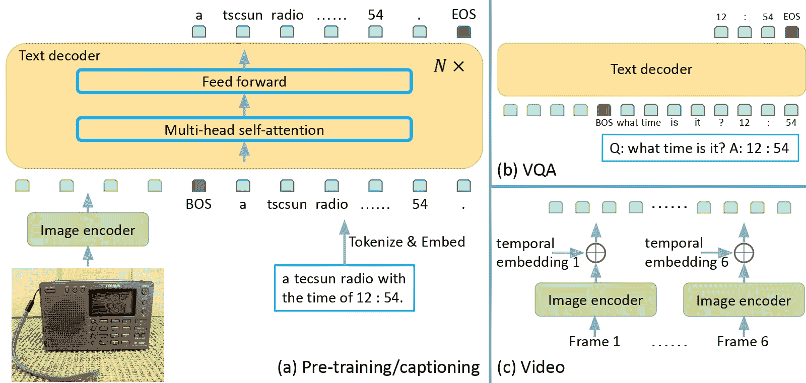

# GIT

> 原始文本：[`huggingface.co/docs/transformers/v4.37.2/en/model_doc/git`](https://huggingface.co/docs/transformers/v4.37.2/en/model_doc/git)

## 概述

GIT 模型是由 Jianfeng Wang、Zhengyuan Yang、Xiaowei Hu、Linjie Li、Kevin Lin、Zhe Gan、Zicheng Liu、Ce Liu、Lijuan Wang 在[《GIT: A Generative Image-to-text Transformer for Vision and Language》](https://arxiv.org/abs/2205.14100)中提出的。GIT 是一种仅解码的 Transformer，利用 CLIP 的视觉编码器来除了文本外还对模型进行视觉输入的条件。该模型在图像字幕和视觉问答基准上取得了最先进的结果。

论文摘要如下：

*在本文中，我们设计并训练了一个生成式图像文本 Transformer，GIT，以统一图像/视频字幕和问题回答等视觉-语言任务。虽然生成模型在预训练和微调之间提供了一致的网络架构，但现有工作通常包含复杂的结构（单/多模态编码器/解码器）并依赖于外部模块，如目标检测器/标记器和光学字符识别（OCR）。在 GIT 中，我们简化了架构，将其作为一个图像编码器和一个文本解码器在单一语言建模任务下。我们还扩大了预训练数据和模型规模以提高模型性能。没有花哨的东西，我们的 GIT 在 12 个具有挑战性的基准上建立了新的最先进技术，差距很大。例如，我们的模型首次在 TextCaps 上超越了人类表现（CIDEr 中的 138.2 vs. 125.5）。此外，我们提出了一种新的基于生成的图像分类和场景文本识别方案，在标准基准上取得了不错的表现。*

 GIT 架构。摘自[原始论文](https://arxiv.org/abs/2205.14100)。

该模型由[nielsr](https://huggingface.co/nielsr)贡献。原始代码可在[此处](https://github.com/microsoft/GenerativeImage2Text)找到。

## 使用提示

+   GIT 的实现方式与 GPT-2 非常相似，唯一的区别在于模型还受到`pixel_values`的影响。

## 资源

官方 Hugging Face 和社区（由🌎表示）资源列表，可帮助您开始使用 GIT。

+   关于在自定义数据上进行推理+微调 GIT 的演示笔记本可以在[此处](https://github.com/NielsRogge/Transformers-Tutorials/tree/master/GIT)找到。

+   另请参阅：因果语言建模任务指南

如果您有兴趣提交资源以包含在此处，请随时提交拉取请求，我们将进行审查。资源应该理想地展示一些新内容，而不是重复现有资源。

## GitVisionConfig

### `class transformers.GitVisionConfig`

[<来源>](https://github.com/huggingface/transformers/blob/v4.37.2/src/transformers/models/git/configuration_git.py#L30)

```py
( hidden_size = 768 intermediate_size = 3072 num_hidden_layers = 12 num_attention_heads = 12 num_channels = 3 image_size = 224 patch_size = 16 hidden_act = 'quick_gelu' layer_norm_eps = 1e-05 attention_dropout = 0.0 initializer_range = 0.02 **kwargs )
```

参数

+   `hidden_size`（`int`，*可选*，默认为 768）— 编码器层和池化器层的维度。

+   `intermediate_size`（`int`，*可选*，默认为 3072）— Transformer 编码器中“中间”（即前馈）层的维度。

+   `num_hidden_layers`（`int`，*可选*，默认为 12）— Transformer 编码器中的隐藏层数。

+   `num_attention_heads`（`int`，*可选*，默认为 12）— Transformer 编码器中每个注意力层的注意力头数。

+   `image_size`（`int`，*可选*，默认为 224）— 每个图像的大小（分辨率）。

+   `patch_size`（`int`，*可选*，默认为 16）— 每个补丁的大小（分辨率）。

+   `hidden_act`（`str`或`function`，*可选*，默认为`"quick_gelu"`）— 编码器和池化器中的非线性激活函数（函数或字符串）。如果是字符串，支持`"gelu"`、`"relu"`、`"selu"`和`"gelu_new"`以及`"quick_gelu"`。

+   `layer_norm_eps` (`float`，*可选*，默认为 1e-5) — 层归一化层使用的 epsilon。

+   `attention_dropout` (`float`，*可选*，默认为 0.0) — 注意力概率的丢弃比率。

+   `initializer_range` (`float`，*可选*，默认为 0.02) — 用于初始化所有权重矩阵的截断正态初始化器的标准差。

这是用于存储 GitVisionModel 配置的配置类。根据指定的参数实例化 GIT 视觉编码器，定义模型架构。使用默认值实例化配置将产生类似于 GIT [microsoft/git-base](https://huggingface.co/microsoft/git-base)架构的视觉编码器的配置。

配置对象继承自 PretrainedConfig，可用于控制模型输出。阅读 PretrainedConfig 的文档以获取更多信息。

示例：

```py
>>> from transformers import GitVisionConfig, GitVisionModel

>>> # Initializing a GitVisionConfig with microsoft/git-base style configuration
>>> configuration = GitVisionConfig()

>>> # Initializing a GitVisionModel (with random weights) from the microsoft/git-base style configuration
>>> model = GitVisionModel(configuration)

>>> # Accessing the model configuration
>>> configuration = model.config
```

## GitVisionModel

### `class transformers.GitVisionModel`

[<来源>](https://github.com/huggingface/transformers/blob/v4.37.2/src/transformers/models/git/modeling_git.py#L962)

```py
( config: GitVisionConfig )
```

参数

+   `config` (GitConfig) — 具有模型所有参数的模型配置类。使用配置文件初始化不会加载与模型关联的权重，只加载配置。查看 from_pretrained()方法以加载模型权重。

CLIP 中使用的视觉模型，在 GIT 中没有顶部的头部或投影。

此模型继承自 PreTrainedModel。检查超类文档以获取库为所有模型实现的通用方法（例如下载或保存、调整输入嵌入、修剪头等）。

此模型还是一个 PyTorch [torch.nn.Module](https://pytorch.org/docs/stable/nn.html#torch.nn.Module)子类。将其用作常规 PyTorch 模块，并参考 PyTorch 文档以获取有关一般用法和行为的所有相关信息。

#### `forward`

[<来源>](https://github.com/huggingface/transformers/blob/v4.37.2/src/transformers/models/git/modeling_git.py#L980)

```py
( pixel_values: Optional = None output_attentions: Optional = None output_hidden_states: Optional = None return_dict: Optional = None ) → export const metadata = 'undefined';transformers.modeling_outputs.BaseModelOutput or tuple(torch.FloatTensor)
```

参数

+   `pixel_values` (`torch.FloatTensor`，形状为`(batch_size, num_channels, height, width)`) — 像素值。默认情况下会忽略填充。可以使用 AutoImageProcessor 获取像素值。有关详细信息，请参阅 CLIPImageProcessor.`call`()。

+   `output_attentions` (`bool`，*可选*) — 是否返回所有注意力层的注意力张量。有关更多详细信息，请参阅返回张量下的`attentions`。

+   `output_hidden_states` (`bool`，*可选*) — 是否返回所有层的隐藏状态。有关更多详细信息，请参阅返回张量下的`hidden_states`。

+   `return_dict` (`bool`，*可选*) — 是否返回 ModelOutput 而不是普通元组。

返回

transformers.modeling_outputs.BaseModelOutput 或`tuple(torch.FloatTensor)`

一个 transformers.modeling_outputs.BaseModelOutput 或一个 `torch.FloatTensor` 元组（如果传递了 `return_dict=False` 或当 `config.return_dict=False` 时）包含根据配置（`<class 'transformers.models.git.configuration_git.GitVisionConfig'>`）和输入的不同元素。

+   `last_hidden_state` (`torch.FloatTensor`，形状为 `(batch_size, sequence_length, hidden_size)`) — 模型最后一层的隐藏状态序列。

+   `hidden_states` (`tuple(torch.FloatTensor)`，*可选*，当传递 `output_hidden_states=True` 或当 `config.output_hidden_states=True` 时返回） — 形状为 `(batch_size, sequence_length, hidden_size)` 的 `torch.FloatTensor` 元组（一个用于嵌入层的输出，如果模型有嵌入层，+ 一个用于每一层的输出）。

    模型在每一层输出的隐藏状态以及可选的初始嵌入输出。

+   `attentions` (`tuple(torch.FloatTensor)`，*可选*，当传递 `output_attentions=True` 或当 `config.output_attentions=True` 时返回） — 形状为 `(batch_size, num_heads, sequence_length, sequence_length)` 的 `torch.FloatTensor` 元组（每层一个）。

    注意力 softmax 后的注意力权重，用于计算自注意力头中的加权平均值。

GitVisionModel 的前向方法，覆盖了 `__call__` 特殊方法。

虽然前向传递的方法需要在此函数内定义，但应该在此之后调用 `Module` 实例，而不是在此处调用，因为前者会负责运行前处理和后处理步骤，而后者会默默地忽略它们。

示例：

```py
>>> from PIL import Image
>>> import requests
>>> from transformers import AutoProcessor, GitVisionModel

>>> processor = AutoProcessor.from_pretrained("microsoft/git-base")
>>> model = GitVisionModel.from_pretrained("microsoft/git-base")

>>> url = "http://images.cocodataset.org/val2017/000000039769.jpg"
>>> image = Image.open(requests.get(url, stream=True).raw)

>>> inputs = processor(images=image, return_tensors="pt")

>>> outputs = model(**inputs)
>>> last_hidden_state = outputs.last_hidden_state
```

## GitConfig

`class transformers.GitConfig`

[< source >](https://github.com/huggingface/transformers/blob/v4.37.2/src/transformers/models/git/configuration_git.py#L128)

```py
( vision_config = None vocab_size = 30522 hidden_size = 768 num_hidden_layers = 6 num_attention_heads = 12 intermediate_size = 3072 hidden_act = 'gelu' hidden_dropout_prob = 0.1 attention_probs_dropout_prob = 0.1 max_position_embeddings = 1024 initializer_range = 0.02 layer_norm_eps = 1e-12 pad_token_id = 0 position_embedding_type = 'absolute' use_cache = True tie_word_embeddings = False bos_token_id = 101 eos_token_id = 102 num_image_with_embedding = None **kwargs )
```

参数

+   `vision_config` (`dict`，*可选*) — 用于初始化 GitVisionConfig 的配置选项字典。

+   `vocab_size` (`int`，*可选*，默认为 30522) — GIT 模型的词汇量大小。定义了在调用 GitModel 时可以由 `inputs_ids` 表示的不同标记数量。

+   `hidden_size` (`int`，*可选*，默认为 768) — 编码器层和池化器层的维度。

+   `num_hidden_layers` (`int`，*可选*，默认为 6) — Transformer 编码器中的隐藏层数量。

+   `num_attention_heads` (`int`，*可选*，默认为 12) — Transformer 编码器中每个注意力层的注意力头数量。

+   `intermediate_size` (`int`，*可选*，默认为 3072) — Transformer 编码器中“中间”（通常称为前馈）层的维度。

+   `hidden_act` (`str` 或 `Callable`，*可选*，默认为 `"gelu"`) — 编码器和池化器中的非线性激活函数（函数或字符串）。如果是字符串，支持 `"gelu"`, `"relu"`, `"silu"` 和 `"gelu_new"`。

+   `hidden_dropout_prob` (`float`，*可选*，默认为 0.1) — 嵌入层、编码器和池化器中所有全连接层的丢弃概率。

+   `attention_probs_dropout_prob` (`float`，*可选*，默认为 0.1) — 注意力概率的丢弃比率。

+   `max_position_embeddings` (`int`，*可选*，默认为 1024) — 此模型可能会使用的最大序列长度。通常将其设置为一个较大的值以防万一（例如，512 或 1024 或 2048）。

+   `initializer_range` (`float`，*可选*，默认为 0.02) — 用于初始化所有权重矩阵的截断正态初始化器的标准差。

+   `layer_norm_eps` (`float`，*可选*，默认为 1e-12) — 层归一化层使用的 epsilon。

+   `position_embedding_type` (`str`, *optional*, defaults to `"absolute"`) — 位置嵌入的类型。选择 `"absolute"`、`"relative_key"`、`"relative_key_query"` 中的一个。对于位置嵌入，请使用 `"absolute"`。有关 `"relative_key"` 的更多信息，请参阅 [Self-Attention with Relative Position Representations (Shaw et al.)](https://arxiv.org/abs/1803.02155)。有关 `"relative_key_query"` 的更多信息，请参阅 [Improve Transformer Models with Better Relative Position Embeddings (Huang et al.)] 中的 *Method 4* (https://arxiv.org/abs/2009.13658)。

+   `use_cache` (`bool`, *optional*, defaults to `True`) — 模型是否应返回最后的键/值注意力（并非所有模型都使用）。

+   `num_image_with_embedding` (`int`, *optional*) — 要添加的时间嵌入数量，如果模型用于视频字幕/VQA。

这是用于存储 GitModel 配置的配置类。它用于根据指定的参数实例化 GIT 模型，定义模型架构。使用默认值实例化配置将产生类似于 GIT [microsoft/git-base](https://huggingface.co/microsoft/git-base) 架构的配置。

配置对象继承自 PretrainedConfig，可用于控制模型输出。阅读 PretrainedConfig 的文档以获取更多信息。

示例：

```py
>>> from transformers import GitConfig, GitModel

>>> # Initializing a GIT microsoft/git-base style configuration
>>> configuration = GitConfig()

>>> # Initializing a model (with random weights) from the microsoft/git-base style configuration
>>> model = GitModel(configuration)

>>> # Accessing the model configuration
>>> configuration = model.config
```

## GitProcessor

### `class transformers.GitProcessor`

[< source >](https://github.com/huggingface/transformers/blob/v4.37.2/src/transformers/models/git/processing_git.py#L23)

```py
( image_processor tokenizer )
```

参数

+   `image_processor` (AutoImageProcessor) — 图像处理器是必需的输入。

+   `tokenizer` (AutoTokenizer) — Tokenizer 是必需的输入。

构建一个 GIT 处理器，将 CLIP 图像处理器和 BERT 分词器包装成单个处理器。

GitProcessor 提供了 CLIPImageProcessor 和 BertTokenizerFast 的所有功能。查看 **call**() 和 `decode()` 以获取更多信息。

#### `__call__`

[< source >](https://github.com/huggingface/transformers/blob/v4.37.2/src/transformers/models/git/processing_git.py#L45)

```py
( text = None images = None return_tensors = None **kwargs ) → export const metadata = 'undefined';BatchEncoding
```

参数

+   `text` (`str`, `List[str]`, `List[List[str]]`) — 要编码的序列或序列批次。每个序列可以是字符串或字符串列表（预分词字符串）。如果序列以字符串列表（预分词）的形式提供，则必须设置 `is_split_into_words=True`（以消除与序列批次的歧义）。

+   `images` (`PIL.Image.Image`, `np.ndarray`, `torch.Tensor`, `List[PIL.Image.Image]`, `List[np.ndarray]`, `List[torch.Tensor]`) — 要准备的图像或图像批次。每个图像可以是 PIL 图像、NumPy 数组或 PyTorch 张量。如果是 NumPy 数组/PyTorch 张量，则每个图像应为形状 (C, H, W)，其中 C 是通道数，H 和 W 是图像高度和宽度。

+   `return_tensors` (`str` 或 TensorType, *optional*) — 如果设置，将返回特定框架的张量。可接受的值为：

    +   `'tf'`: 返回 TensorFlow `tf.constant` 对象。

    +   `'pt'`: 返回 PyTorch `torch.Tensor` 对象。

    +   `'np'`: 返回 NumPy `np.ndarray` 对象。

    +   `'jax'`: 返回 JAX `jnp.ndarray` 对象。

返回

BatchEncoding

一个带有以下字段的 BatchEncoding：

+   `input_ids` — 要提供给模型的标记 id 列表。当`text`不为`None`时返回。

+   `attention_mask` — 指定哪些标记应该被模型关注的索引列表（当`return_attention_mask=True`或者*`attention_mask`*在`self.model_input_names`中，且`text`不为`None`时）。

+   `pixel_values` — 要提供给模型的像素值。当`images`不为`None`时返回。

为模型准备一个或多个序列和图像的主要方法。如果`text`不为`None`，则此方法将`text`和`kwargs`参数转发给 BertTokenizerFast 的**call**()以对文本进行编码。为准备图像，如果`images`不为`None`，则此方法将`images`和`kwrags`参数转发给 CLIPImageProcessor 的**call**()。请参考上述两种方法的文档以获取更多信息。

## GitModel

### `class transformers.GitModel`

[<来源>](https://github.com/huggingface/transformers/blob/v4.37.2/src/transformers/models/git/modeling_git.py#L1033)

```py
( config )
```

参数

+   `config`（GitConfig） — 具有模型所有参数的模型配置类。使用配置文件初始化不会加载与模型关联的权重，只会加载配置。查看 from_pretrained()方法以加载模型权重。

由 CLIP 图像编码器和文本解码器组成的基本 GIT 模型变压器，输出原始隐藏状态，没有特定的头部。

此模型继承自 PreTrainedModel。查看超类文档以获取库为所有模型实现的通用方法（如下载或保存、调整输入嵌入、修剪头等）。

此模型还是 PyTorch [torch.nn.Module](https://pytorch.org/docs/stable/nn.html#torch.nn.Module)子类。将其用作常规 PyTorch 模块，并参考 PyTorch 文档以获取与一般用法和行为相关的所有信息。

#### `forward`

[<来源>](https://github.com/huggingface/transformers/blob/v4.37.2/src/transformers/models/git/modeling_git.py#L1128)

```py
( input_ids: Optional = None attention_mask: Optional = None position_ids: Optional = None pixel_values: Optional = None head_mask: Optional = None inputs_embeds: Optional = None past_key_values: Optional = None use_cache: Optional = None output_attentions: Optional = None output_hidden_states: Optional = None return_dict: Optional = None ) → export const metadata = 'undefined';transformers.modeling_outputs.BaseModelOutputWithPooling or tuple(torch.FloatTensor)
```

参数

+   `input_ids`（形状为`(batch_size, sequence_length)`的`torch.LongTensor`） — 词汇表中输入序列标记的索引。

    可以使用 AutoTokenizer 获取索引。有关详细信息，请参阅 PreTrainedTokenizer.encode()和 PreTrainedTokenizer.`call`()。

    什么是输入 ID？

+   `attention_mask`（形状为`(batch_size, sequence_length)`的`torch.FloatTensor`，*可选*） — 避免在填充标记索引上执行注意力的掩码。选择在`[0, 1]`中的掩码值：

    +   1 表示“未被掩码”的标记，

    +   0 表示“被掩码”的标记。

    什么是注意力掩码？

+   `position_ids`（形状为`(batch_size, sequence_length)`的`torch.LongTensor`，*可选*） — 每个输入序列标记在位置嵌入中的位置索引。在范围`[0, config.max_position_embeddings - 1]`中选择。

    什么是位置 ID？

+   `pixel_values` (`torch.FloatTensor` of shape `(batch_size, num_channels, height, width)`) — 像素值。可以使用 AutoImageProcessor 获取像素值。有关详细信息，请参阅 CLIPImageProcessor.`call`()。

+   `head_mask` (`torch.FloatTensor` of shape `(num_heads,)` or `(num_layers, num_heads)`, *optional*) — 用于使自注意力模块的选定头部失效的掩码。掩码值选定在`[0, 1]`之间：

    +   1 表示头部未被`masked`，

    +   0 表示头部被`masked`。

+   `inputs_embeds` (`torch.FloatTensor` of shape `(batch_size, sequence_length, hidden_size)`, *optional*) — 可选地，可以直接传递嵌入表示，而不是传递`input_ids`。如果您想要更多控制如何将`input_ids`索引转换为相关向量，而不是使用模型的内部嵌入查找矩阵，则这很有用。

+   `output_attentions` (`bool`, *optional*) — 是否返回所有注意力层的注意力张量。有关更多细节，请参阅返回张量中的`attentions`。

+   `output_hidden_states` (`bool`, *optional*) — 是否返回所有层的隐藏状态。有关更多细节，请参阅返回张量中的`hidden_states`。

+   `return_dict` (`bool`, *optional*) — 是否返回 ModelOutput 而不是普通元组。

+   `past_key_values` (`tuple(tuple(torch.FloatTensor))`，长度为`config.n_layers`，每个元组包含 4 个形状为`(batch_size, num_heads, sequence_length - 1, embed_size_per_head)`的张量） — 包含注意力块的预计算的键和值隐藏状态。可用于加速解码。

    如果使用了`past_key_values`，用户可以选择仅输入最后的`decoder_input_ids`（即没有将其过去的键值状态提供给此模型的那些）的形状为`(batch_size, 1)`的张量，而不是形状为`(batch_size, sequence_length)`的所有`decoder_input_ids`。

+   `use_cache` (`bool`, *optional*) — 如果设置为`True`，将返回`past_key_values`键值状态，并可用于加速解码（参见`past_key_values`）。

返回

transformers.modeling_outputs.BaseModelOutputWithPooling 或 `tuple(torch.FloatTensor)`

一个 transformers.modeling_outputs.BaseModelOutputWithPooling 或一个`torch.FloatTensor`元组（如果传递了`return_dict=False`或`config.return_dict=False`时）包含各种元素，取决于配置（GitConfig）和输入。

+   `last_hidden_state` (`torch.FloatTensor` of shape `(batch_size, sequence_length, hidden_size)`) — 模型最后一层的隐藏状态序列。

+   `pooler_output` (`torch.FloatTensor` of shape `(batch_size, hidden_size)`) — 序列的第一个标记（分类标记）的最后一层隐藏状态（经过用于辅助预训练任务的层进一步处理后）。例如，对于 BERT 系列模型，这返回经过线性层和 tanh 激活函数处理后的分类标记。线性层的权重是从预训练期间的下一个句子预测（分类）目标中训练的。

+   `hidden_states` (`tuple(torch.FloatTensor)`, *optional*, 当传递`output_hidden_states=True`或`config.output_hidden_states=True`时返回) — 形状为`(batch_size, sequence_length, hidden_size)`的`torch.FloatTensor`元组（如果模型具有嵌入层的输出，则为嵌入的输出+每个层的输出）。

    模型在每一层输出的隐藏状态以及可选的初始嵌入输出。

+   `attentions` (`tuple(torch.FloatTensor)`, *optional*, 当传递`output_attentions=True`或`config.output_attentions=True`时返回) — 形状为`(batch_size, num_heads, sequence_length, sequence_length)`的`torch.FloatTensor`元组。

    在注意力 softmax 之后的注意力权重，用于计算自注意力头中的加权平均值。

GitModel 的前向方法，覆盖了`__call__`特殊方法。

虽然前向传递的步骤需要在此函数内定义，但应该在此之后调用`Module`实例，而不是在此处调用，因为前者会处理运行前后处理步骤，而后者会默默地忽略它们。

示例：

```py
>>> from transformers import AutoProcessor, AutoModel
>>> import requests
>>> from PIL import Image

>>> processor = AutoProcessor.from_pretrained("microsoft/git-base")
>>> model = AutoModel.from_pretrained("microsoft/git-base")

>>> url = "http://images.cocodataset.org/val2017/000000039769.jpg"
>>> image = Image.open(requests.get(url, stream=True).raw)

>>> text = "this is an image of two cats"

>>> inputs = processor(text, images=image, return_tensors="pt")

>>> outputs = model(**inputs)
>>> last_hidden_state = outputs.last_hidden_state
```

## GitForCausalLM

### `class transformers.GitForCausalLM`

[< source >](https://github.com/huggingface/transformers/blob/v4.37.2/src/transformers/models/git/modeling_git.py#L1297)

```py
( config )
```

参数

+   `config` (GitConfig) — 具有模型所有参数的模型配置类。使用配置文件初始化不会加载与模型相关的权重，只加载配置。查看 from_pretrained()方法以加载模型权重。

带有`语言建模`头部的 GIT 模型，用于自回归语言建模。

此模型继承自 PreTrainedModel。查看超类文档以了解库为所有模型实现的通用方法（如下载或保存、调整输入嵌入、修剪头等）。

此模型也是 PyTorch [torch.nn.Module](https://pytorch.org/docs/stable/nn.html#torch.nn.Module)子类。将其用作常规 PyTorch 模块，并参考 PyTorch 文档以获取有关一般用法和行为的所有相关信息。

#### `forward`

[< source >](https://github.com/huggingface/transformers/blob/v4.37.2/src/transformers/models/git/modeling_git.py#L1318)

```py
( input_ids: Optional = None attention_mask: Optional = None position_ids: Optional = None pixel_values: Optional = None head_mask: Optional = None inputs_embeds: Optional = None labels: Optional = None past_key_values: Optional = None use_cache: Optional = None output_attentions: Optional = None output_hidden_states: Optional = None return_dict: Optional = None ) → export const metadata = 'undefined';transformers.modeling_outputs.CausalLMOutputWithPast or tuple(torch.FloatTensor)
```

参数

+   `input_ids` (`torch.LongTensor` of shape `(batch_size, sequence_length)`) — 词汇表中输入序列标记的索引。

    可以使用 AutoTokenizer 获取索引。查看 PreTrainedTokenizer.encode()和 PreTrainedTokenizer.`call`()获取详细信息。

    什么是输入 ID？

+   `attention_mask` (`torch.FloatTensor` of shape `(batch_size, sequence_length)`, *optional*) — 用于避免在填充标记索引上执行注意力的掩码。掩码值选择在`[0, 1]`之间：

    +   1 表示`未被掩码`的标记，

    +   0 表示`被掩码`的标记。

    什么是注意力掩码？

+   `position_ids` (`torch.LongTensor` of shape `(batch_size, sequence_length)`, *optional*) — 每个输入序列标记在位置嵌入中的位置索引。在范围`[0, config.max_position_embeddings - 1]`中选择。

    什么是位置 ID？

+   `pixel_values` (`torch.FloatTensor` of shape `(batch_size, num_channels, height, width)`) — 像素值。可以使用 AutoImageProcessor 获取像素值。查看 CLIPImageProcessor.`call`()获取详细信息。

+   `head_mask`（形状为`(num_heads,)`或`(num_layers, num_heads)`的`torch.FloatTensor`，*可选*）— 用于使自注意力模块中选择的头部失效的掩码。掩码值在`[0, 1]`中选择：

    +   1 表示头部未被掩盖，

    +   0 表示头部被“掩盖”。

+   `inputs_embeds`（形状为`(batch_size, sequence_length, hidden_size)`的`torch.FloatTensor`，*可选*）— 可选地，您可以选择直接传递嵌入表示，而不是传递`input_ids`。如果您希望更多地控制如何将`input_ids`索引转换为相关向量，而不是模型的内部嵌入查找矩阵，则这很有用。

+   `output_attentions`（`bool`，*可选*）— 是否返回所有注意力层的注意力张量。有关更多详细信息，请参见返回张量下的`attentions`。

+   `output_hidden_states`（`bool`，*可选*）— 是否返回所有层的隐藏状态。有关更多详细信息，请参见返回张量下的`hidden_states`。

+   `return_dict`（`bool`，*可选*）— 是否返回 ModelOutput 而不是普通元组。

+   `labels`（形状为`(batch_size, sequence_length)`的`torch.LongTensor`，*可选*）— 用于计算从左到右的语言建模损失（下一个单词预测）的标签。索引应在`[-100, 0, ..., config.vocab_size]`中（请参见`input_ids`文档字符串）。索引设置为`-100`的标记将被忽略（掩盖），仅对具有标签 n `[0, ..., config.vocab_size]`的标记计算损失

+   `past_key_values`（长度为`config.n_layers`的`tuple(tuple(torch.FloatTensor))`，每个元组包含形状为`(batch_size, num_heads, sequence_length - 1, embed_size_per_head)`的 4 个张量）— 包含注意力块的预计算键和值隐藏状态。可用于加速解码。

    如果使用了`past_key_values`，用户可以选择仅输入最后的`decoder_input_ids`（这些不具有其过去键值状态的模型）的形状为`(batch_size, 1)`的张量，而不是形状为`(batch_size, sequence_length)`的所有`decoder_input_ids`。

+   `use_cache`（`bool`，*可选*）— 如果设置为`True`，则返回`past_key_values`键值状态，并可用于加速解码（请参见`past_key_values`）。

返回

transformers.modeling_outputs.CausalLMOutputWithPast 或`tuple(torch.FloatTensor)`

一个 transformers.modeling_outputs.CausalLMOutputWithPast 或一个`torch.FloatTensor`元组（如果传递了`return_dict=False`或`config.return_dict=False`时）包含根据配置（GitConfig）和输入的各种元素。

+   `loss`（形状为`(1,)`的`torch.FloatTensor`，*可选*，在提供`labels`时返回）— 语言建模损失（用于下一个标记预测）。

+   `logits`（形状为`(batch_size, sequence_length, config.vocab_size)`的`torch.FloatTensor`）— 语言建模头的预测分数（SoftMax 之前每个词汇标记的分数）。

+   `past_key_values`（*可选*，在传递`use_cache=True`或`config.use_cache=True`时返回）— 长度为`config.n_layers`的`tuple(tuple(torch.FloatTensor))`元组，每个元组包含形状为`(batch_size, num_heads, sequence_length, embed_size_per_head)`的 2 个张量）

    包含预计算的隐藏状态（自注意块中的键和值）可用于加速顺序解码（请参见`past_key_values`输入）。

+   `hidden_states`（`tuple(torch.FloatTensor)`，*可选*，当传递`output_hidden_states=True`或`config.output_hidden_states=True`时返回） — 形状为`(batch_size, sequence_length, hidden_size)`的`torch.FloatTensor`元组（一个用于嵌入层的输出，如果模型有嵌入层，+ 一个用于每一层的输出）。

    模型在每一层输出处的隐藏状态以及可选的初始嵌入输出。

+   `attentions`（`tuple(torch.FloatTensor)`，*可选*，当传递`output_attentions=True`或`config.output_attentions=True`时返回） — 形状为`(batch_size, num_heads, sequence_length, sequence_length)`的`torch.FloatTensor`元组（每一层一个）。

    注意力权重在注意力 softmax 之后，用于计算自注意力头中的加权平均值。

GitForCausalLM 的前向方法，覆盖了`__call__`特殊方法。

虽然前向传递的步骤需要在这个函数内定义，但应该在此之后调用`Module`实例，而不是这个函数，因为前者会处理运行前后的处理步骤，而后者会默默地忽略它们。

示例：

图像字幕示例：

```py
>>> from transformers import AutoProcessor, AutoModelForCausalLM
>>> import requests
>>> from PIL import Image

>>> processor = AutoProcessor.from_pretrained("microsoft/git-base-coco")
>>> model = AutoModelForCausalLM.from_pretrained("microsoft/git-base-coco")

>>> url = "http://images.cocodataset.org/val2017/000000039769.jpg"
>>> image = Image.open(requests.get(url, stream=True).raw)

>>> pixel_values = processor(images=image, return_tensors="pt").pixel_values

>>> generated_ids = model.generate(pixel_values=pixel_values, max_length=50)
>>> generated_caption = processor.batch_decode(generated_ids, skip_special_tokens=True)[0]
>>> print(generated_caption)
two cats sleeping on a pink blanket next to remotes.
```

视觉问答（VQA）示例：

```py
>>> from transformers import AutoProcessor, AutoModelForCausalLM
>>> from huggingface_hub import hf_hub_download
>>> from PIL import Image

>>> processor = AutoProcessor.from_pretrained("microsoft/git-base-textvqa")
>>> model = AutoModelForCausalLM.from_pretrained("microsoft/git-base-textvqa")

>>> file_path = hf_hub_download(repo_id="nielsr/textvqa-sample", filename="bus.png", repo_type="dataset")
>>> image = Image.open(file_path).convert("RGB")

>>> pixel_values = processor(images=image, return_tensors="pt").pixel_values

>>> question = "what does the front of the bus say at the top?"

>>> input_ids = processor(text=question, add_special_tokens=False).input_ids
>>> input_ids = [processor.tokenizer.cls_token_id] + input_ids
>>> input_ids = torch.tensor(input_ids).unsqueeze(0)

>>> generated_ids = model.generate(pixel_values=pixel_values, input_ids=input_ids, max_length=50)
>>> print(processor.batch_decode(generated_ids, skip_special_tokens=True))
['what does the front of the bus say at the top? special']
```

视频字幕示例：

```py
>>> import av
>>> import numpy as np
>>> from PIL import Image
>>> from huggingface_hub import hf_hub_download
>>> from transformers import AutoProcessor, AutoModelForCausalLM

>>> processor = AutoProcessor.from_pretrained("microsoft/git-base-vatex")
>>> model = AutoModelForCausalLM.from_pretrained("microsoft/git-base-vatex")

>>> # set seed for reproducability
>>> np.random.seed(45)

>>> def read_video_pyav(container, indices):
...     '''
...     Decode the video with PyAV decoder.
...     Args:
...         container (`av.container.input.InputContainer`): PyAV container.
...         indices (`List[int]`): List of frame indices to decode.
...     Returns:
...         result (np.ndarray): np array of decoded frames of shape (num_frames, height, width, 3).
...     '''
...     frames = []
...     container.seek(0)
...     start_index = indices[0]
...     end_index = indices[-1]
...     for i, frame in enumerate(container.decode(video=0)):
...         if i > end_index:
...             break
...         if i >= start_index and i in indices:
...             frames.append(frame)
...     return np.stack([x.to_ndarray(format="rgb24") for x in frames])

>>> def sample_frame_indices(clip_len, frame_sample_rate, seg_len):
...     '''
...     Sample a given number of frame indices from the video.
...     Args:
...         clip_len (`int`): Total number of frames to sample.
...         frame_sample_rate (`int`): Sample every n-th frame.
...         seg_len (`int`): Maximum allowed index of sample's last frame.
...     Returns:
...         indices (`List[int]`): List of sampled frame indices
...     '''
...     converted_len = int(clip_len * frame_sample_rate)
...     end_idx = np.random.randint(converted_len, seg_len)
...     start_idx = end_idx - converted_len
...     indices = np.linspace(start_idx, end_idx, num=clip_len)
...     indices = np.clip(indices, start_idx, end_idx - 1).astype(np.int64)
...     return indices

>>> # load video
>>> file_path = hf_hub_download(
...     repo_id="nielsr/video-demo", filename="eating_spaghetti.mp4", repo_type="dataset"
... )
>>> container = av.open(file_path)

>>> # sample frames
>>> num_frames = model.config.num_image_with_embedding
>>> indices = sample_frame_indices(
...     clip_len=num_frames, frame_sample_rate=4, seg_len=container.streams.video[0].frames
... )
>>> frames = read_video_pyav(container, indices)

>>> pixel_values = processor(images=list(frames), return_tensors="pt").pixel_values

>>> generated_ids = model.generate(pixel_values=pixel_values, max_length=50)

>>> print("Generated caption:", processor.batch_decode(generated_ids, skip_special_tokens=True))
Generated caption: ['a woman is sitting at a table and she is talking about the food she is holding.']
```
