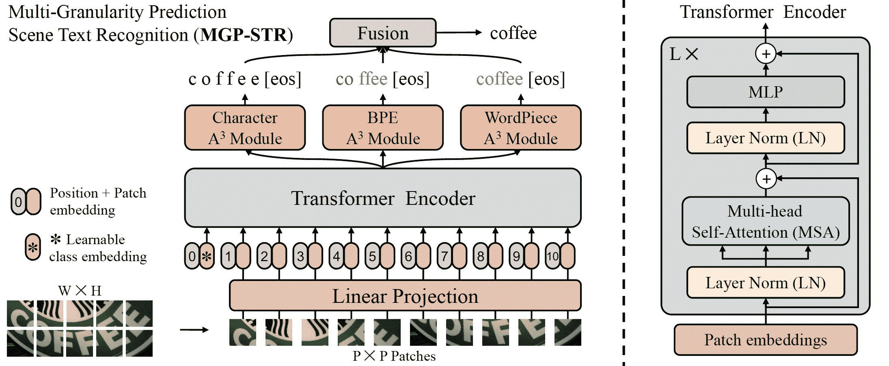

# MGP-STR

> 原始文本：[`huggingface.co/docs/transformers/v4.37.2/en/model_doc/mgp-str`](https://huggingface.co/docs/transformers/v4.37.2/en/model_doc/mgp-str)

## 概述

MGP-STR 模型由 Peng Wang、Cheng Da 和 Cong Yao 在[多粒度预测用于场景文本识别](https://arxiv.org/abs/2209.03592)中提出。MGP-STR 是一个概念上简单但强大的视觉场景文本识别（STR）模型，它建立在视觉 Transformer（ViT）之上。为了整合语言知识，提出了多粒度预测（MGP）策略，以隐式方式将语言模态的信息注入模型中。

论文摘要如下：

*场景文本识别（STR）一直是计算机视觉中的一个活跃研究课题。为了解决这一具有挑战性的问题，已经连续提出了许多创新方法，并且将语言知识整合到 STR 模型中最近成为一个突出的趋势。在这项工作中，我们首先从视觉 Transformer（ViT）的最新进展中汲取灵感，构建了一个概念上简单但强大的视觉 STR 模型，它建立在 ViT 之上，并且在场景文本识别方面优于以前的最先进模型，包括纯视觉模型和语言增强方法。为了整合语言知识，我们进一步提出了一种多粒度预测策略，以隐式方式将语言模态的信息注入模型中，即，除了传统的字符级表示外，还引入了在 NLP 中广泛使用的子词表示（BPE 和 WordPiece）到输出空间中，而不采用独立的语言模型（LM）。由此产生的算法（称为 MGP-STR）能够将 STR 的性能推向更高的水平。具体而言，在标准基准上实现了 93.35%的平均识别准确率。*

 MGP-STR 架构。摘自[原始论文](https://arxiv.org/abs/2209.03592)。

MGP-STR 在两个合成数据集 MJSynth)（MJ）和 SynthText([`www.robots.ox.ac.uk/~vgg/data/scenetext/`](http://www.robots.ox.ac.uk/~vgg/data/scenetext/))（ST）上进行训练，而不在其他数据集上进行微调。它在六个标准拉丁场景文本基准上取得了最先进的结果，包括 3 个常规文本数据集（IC13、SVT、IIIT）和 3 个不规则数据集（IC15、SVTP、CUTE）。该模型由[yuekun](https://huggingface.co/yuekun)贡献。原始代码可以在[这里](https://github.com/AlibabaResearch/AdvancedLiterateMachinery/tree/main/OCR/MGP-STR)找到。

## 推理示例

MgpstrModel 接受图像作为输入，并生成三种类型的预测，代表不同粒度的文本信息。这三种类型的预测被融合以给出最终的预测结果。

ViTImageProcessor 类负责预处理输入图像，MgpstrTokenizer 解码生成的字符标记为目标字符串。MgpstrProcessor 将 ViTImageProcessor 和 MgpstrTokenizer 封装成单个实例，既提取输入特征又解码预测的标记 ID。

+   逐步光学字符识别（OCR）

```py
>>> from transformers import MgpstrProcessor, MgpstrForSceneTextRecognition
>>> import requests
>>> from PIL import Image

>>> processor = MgpstrProcessor.from_pretrained('alibaba-damo/mgp-str-base')
>>> model = MgpstrForSceneTextRecognition.from_pretrained('alibaba-damo/mgp-str-base')

>>> # load image from the IIIT-5k dataset
>>> url = "https://i.postimg.cc/ZKwLg2Gw/367-14.png"
>>> image = Image.open(requests.get(url, stream=True).raw).convert("RGB")

>>> pixel_values = processor(images=image, return_tensors="pt").pixel_values
>>> outputs = model(pixel_values)

>>> generated_text = processor.batch_decode(outputs.logits)['generated_text']
```

## MgpstrConfig

### `class transformers.MgpstrConfig`

[< source >](https://github.com/huggingface/transformers/blob/v4.37.2/src/transformers/models/mgp_str/configuration_mgp_str.py#L28)

```py
( image_size = [32, 128] patch_size = 4 num_channels = 3 max_token_length = 27 num_character_labels = 38 num_bpe_labels = 50257 num_wordpiece_labels = 30522 hidden_size = 768 num_hidden_layers = 12 num_attention_heads = 12 mlp_ratio = 4.0 qkv_bias = True distilled = False layer_norm_eps = 1e-05 drop_rate = 0.0 attn_drop_rate = 0.0 drop_path_rate = 0.0 output_a3_attentions = False initializer_range = 0.02 **kwargs )
```

参数

+   `image_size` (`List[int]`, *optional*, defaults to `[32, 128]`) — 每个图像的大小（分辨率）。

+   `patch_size` (`int`, *optional*, defaults to 4) — 每个补丁的大小（分辨率）。

+   `num_channels` (`int`, *optional*, defaults to 3) — 输入通道数。

+   `max_token_length` (`int`, *optional*, defaults to 27) — 输出标记的最大数量。

+   `num_character_labels` (`int`, *optional*, defaults to 38) — 字符头的类数。

+   `num_bpe_labels` (`int`, *optional*, defaults to 50257) — bpe 头的类数。

+   `num_wordpiece_labels` (`int`, *optional*, defaults to 30522) — wordpiece 头的类数。

+   `hidden_size` (`int`, *optional*, defaults to 768) — 嵌入维度。

+   `num_hidden_layers` (`int`, *optional*, defaults to 12) — Transformer 编码器中的隐藏层数。

+   `num_attention_heads` (`int`, *optional*, defaults to 12) — Transformer 编码器中每个注意力层的注意力头数。

+   `mlp_ratio` (`float`, *optional*, defaults to 4.0) — mlp 隐藏维度与嵌入维度的比率。

+   `qkv_bias` (`bool`, *optional*, defaults to `True`) — 是否为查询、键和值添加偏置。

+   `distilled` (`bool`, *optional*, defaults to `False`) — 模型包括蒸馏令牌和头，如 DeiT 模型。

+   `layer_norm_eps` (`float`, *optional*, defaults to 1e-05) — 层归一化层使用的 epsilon。

+   `drop_rate` (`float`, *optional*, defaults to 0.0) — 嵌入层、编码器中所有全连接层的 dropout 概率。

+   `attn_drop_rate` (`float`, *optional*, defaults to 0.0) — 注意力概率的 dropout 比率。

+   `drop_path_rate` (`float`, *optional*, defaults to 0.0) — 随机深度率。

+   `output_a3_attentions` (`bool`, *optional*, defaults to `False`) — 模型是否返回 A³ 模块的注意力。

+   `initializer_range` (`float`, *optional*, defaults to 0.02) — 用于初始化所有权重矩阵的截断正态初始化器的标准差。

这是一个配置类，用于存储 MgpstrModel 的配置。根据指定的参数实例化一个 MGP-STR 模型，定义模型架构。使用默认值实例化配置将产生类似于 MGP-STR [alibaba-damo/mgp-str-base](https://huggingface.co/alibaba-damo/mgp-str-base)架构的配置。

配置对象继承自 PretrainedConfig，可用于控制模型输出。阅读 PretrainedConfig 的文档以获取更多信息。

示例：

```py
>>> from transformers import MgpstrConfig, MgpstrForSceneTextRecognition

>>> # Initializing a Mgpstr mgp-str-base style configuration
>>> configuration = MgpstrConfig()

>>> # Initializing a model (with random weights) from the mgp-str-base style configuration
>>> model = MgpstrForSceneTextRecognition(configuration)

>>> # Accessing the model configuration
>>> configuration = model.config
```

## MgpstrTokenizer

### `class transformers.MgpstrTokenizer`

[< source >](https://github.com/huggingface/transformers/blob/v4.37.2/src/transformers/models/mgp_str/tokenization_mgp_str.py#L38)

```py
( vocab_file unk_token = '[GO]' bos_token = '[GO]' eos_token = '[s]' pad_token = '[GO]' **kwargs )
```

参数

+   `vocab_file` (`str`) — 词汇表文件路径。

+   `unk_token` (`str`, *optional*, defaults to `"[GO]"`) — 未知标记。词汇表中没有的标记无法转换为 ID，而是设置为此标记。

+   `bos_token` (`str`, *optional*, defaults to `"[GO]"`) — 序列开始标记。

+   `eos_token` (`str`, *optional*, defaults to `"[s]"`) — 序列结束标记。

+   `pad_token` (`str` or `tokenizers.AddedToken`, *optional*, defaults to `"[GO]"`) — 用于使标记数组大小相同以进行批处理的特殊标记。然后将被注意力机制或损失计算忽略。

构建一个 MGP-STR 字符分词器。

此分词器继承自 PreTrainedTokenizer，其中包含大部分主要方法。用户应参考该超类获取有关这些方法的更多信息。

#### `save_vocabulary`

[< source >](https://github.com/huggingface/transformers/blob/v4.37.2/src/transformers/models/mgp_str/tokenization_mgp_str.py#L100)

```py
( save_directory: str filename_prefix: Optional = None )
```

## MgpstrProcessor

### `class transformers.MgpstrProcessor`

[< source >](https://github.com/huggingface/transformers/blob/v4.37.2/src/transformers/models/mgp_str/processing_mgp_str.py#L39)

```py
( image_processor = None tokenizer = None **kwargs )
```

参数

+   `image_processor` (`ViTImageProcessor`, *可选*) — 一个 `ViTImageProcessor` 实例。图像处理器是必需的输入。

+   `tokenizer`（MgpstrTokenizer, *可选*）— Tokenizer 是必需的输入。

构建一个 MGP-STR 处理器，将图像处理器和 MGP-STR 分词器封装成一个单独的

MgpstrProcessor 提供了所有 `ViTImageProcessor` 和 MgpstrTokenizer 的功能。查看 **call**() 和 batch_decode() 获取更多信息。

#### `__call__`

[< source >](https://github.com/huggingface/transformers/blob/v4.37.2/src/transformers/models/mgp_str/processing_mgp_str.py#L79)

```py
( text = None images = None return_tensors = None **kwargs )
```

在正常模式下使用时，此方法将所有参数转发给 ViTImageProcessor 的 **call**() 并返回其输出。如果 `text` 不是 `None`，此方法还将 `text` 和 `kwargs` 参数转发给 MgpstrTokenizer 的 **call**() 来编码文本。更多信息请参考上述方法的文档字符串。

#### `batch_decode`

[< source >](https://github.com/huggingface/transformers/blob/v4.37.2/src/transformers/models/mgp_str/processing_mgp_str.py#L102)

```py
( sequences ) → export const metadata = 'undefined';Dict[str, any]
```

参数

+   `sequences` (`torch.Tensor`) — 分词后输入 id 的列表。

返回

`Dict[str, any]`

所有解码结果的字典。 generated_text (`List[str]`): 融合字符、bpe 和 wp 后的最终结果。 scores (`List[float]`): 融合字符、bpe 和 wp 后的最终分数。 char_preds (`List[str]`): 字符解码句子的列表。 bpe_preds (`List[str]`): bpe 解码句子的列表。 wp_preds (`List[str]`): wp 解码句子的列表。

通过调用 decode 将 token id 的列表转换为字符串列表。

此方法将所有参数转发给 PreTrainedTokenizer 的 batch_decode()。更多信息请参考该方法的文档字符串。

## MgpstrModel

### `class transformers.MgpstrModel`

[< source >](https://github.com/huggingface/transformers/blob/v4.37.2/src/transformers/models/mgp_str/modeling_mgp_str.py#L364)

```py
( config: MgpstrConfig )
```

参数

+   `config` (MgpstrConfig) — 包含模型所有参数的模型配置类。使用配置文件初始化不会加载与模型相关的权重，只会加载配置。查看 from_pretrained() 方法加载模型权重。

裸 MGP-STR 模型变压器输出原始隐藏状态，没有特定的顶部头。此模型是 PyTorch [torch.nn.Module](https://pytorch.org/docs/stable/nn.html#torch.nn.Module)子类。将其用作常规 PyTorch 模块，并参考 PyTorch 文档以获取有关一般用法和行为的所有相关信息。

#### `forward`

[<来源>](https://github.com/huggingface/transformers/blob/v4.37.2/src/transformers/models/mgp_str/modeling_mgp_str.py#L378)

```py
( pixel_values: FloatTensor output_attentions: Optional = None output_hidden_states: Optional = None return_dict: Optional = None )
```

参数

+   `pixel_values` (`torch.FloatTensor` of shape `(batch_size, num_channels, height, width)`) — 像素值。像素值可以使用 AutoImageProcessor 获得。有关详细信息，请参阅 ViTImageProcessor.`call`()。

+   `output_attentions` (`bool`, *optional*) — 是否返回所有注意力层的注意力张量。有关更多详细信息，请查看返回张量下的`attentions`。

+   `output_hidden_states` (`bool`, *optional*) — 是否返回所有层的隐藏状态。有关更多详细信息，请查看返回张量下的`hidden_states`。

+   `return_dict` (`bool`, *optional*) — 是否返回 ModelOutput 而不是普通元组。

MgpstrModel 的前向方法，覆盖`__call__`特殊方法。

尽管前向传递的配方需要在此函数内定义，但应该在此之后调用`Module`实例，而不是在此处调用，因为前者会处理运行前后处理步骤，而后者会默默地忽略它们。

## MgpstrForSceneTextRecognition

### `class transformers.MgpstrForSceneTextRecognition`

[<来源>](https://github.com/huggingface/transformers/blob/v4.37.2/src/transformers/models/mgp_str/modeling_mgp_str.py#L413)

```py
( config: MgpstrConfig )
```

参数

+   `config` (MgpstrConfig) — 具有模型所有参数的模型配置类。使用配置文件初始化不会加载与模型关联的权重，只加载配置。查看 from_pretrained()方法以加载模型权重。

MGP-STR 模型变压器，顶部有三个分类头（三个 A³ 模块和变压器编码器输出顶部的三个线性层），用于场景文本识别（STR）。

此模型是 PyTorch [torch.nn.Module](https://pytorch.org/docs/stable/nn.html#torch.nn.Module)子类。将其用作常规 PyTorch 模块，并参考 PyTorch 文档以获取有关一般用法和行为的所有相关信息。

#### `forward`

[<来源>](https://github.com/huggingface/transformers/blob/v4.37.2/src/transformers/models/mgp_str/modeling_mgp_str.py#L438)

```py
( pixel_values: FloatTensor output_attentions: Optional = None output_a3_attentions: Optional = None output_hidden_states: Optional = None return_dict: Optional = None ) → export const metadata = 'undefined';transformers.models.mgp_str.modeling_mgp_str.MgpstrModelOutput or tuple(torch.FloatTensor)
```

参数

+   `pixel_values` (`torch.FloatTensor` of shape `(batch_size, num_channels, height, width)`) — 像素值。像素值可以使用 AutoImageProcessor 获得。有关详细信息，请参阅 ViTImageProcessor.`call`()。

+   `output_attentions` (`bool`, *optional*) — 是否返回所有注意力层的注意力张量。有关更多详细信息，请查看返回张量下的`attentions`。

+   `output_hidden_states` (`bool`, *optional*) — 是否返回所有层的隐藏状态。有关更多详细信息，请查看返回张量下的`hidden_states`。

+   `return_dict` (`bool`, *optional*) — 是否返回 ModelOutput 而不是普通元组。

+   `output_a3_attentions`（`bool`，*可选*）- 是否返回 a3 模块的注意力张量。有关更多详细信息，请参阅返回张量中的`a3_attentions`。

返回

`transformers.models.mgp_str.modeling_mgp_str.MgpstrModelOutput`或`tuple(torch.FloatTensor)`

一个`transformers.models.mgp_str.modeling_mgp_str.MgpstrModelOutput`或一个`torch.FloatTensor`元组（如果传递了`return_dict=False`或当`config.return_dict=False`时）包括根据配置（`<class 'transformers.models.mgp_str.configuration_mgp_str.MgpstrConfig'>`）和输入的不同元素。

+   `logits`（形状为`(batch_size, config.num_character_labels)`的`tuple(torch.FloatTensor)`）- `torch.FloatTensor`元组（一个用于字符输出的形状为`(batch_size, config.max_token_length, config.num_character_labels)`，+ 一个用于 bpe 输出的形状为`(batch_size, config.max_token_length, config.num_bpe_labels)`，+ 一个用于 wordpiece 输出的形状为`(batch_size, config.max_token_length, config.num_wordpiece_labels)`）。

    字符、bpe 和 wordpiece 的分类分数（SoftMax 之前）。

+   `hidden_states`（`tuple(torch.FloatTensor)`，*可选*，当传递`output_hidden_states=True`或当`config.output_hidden_states=True`时返回）- 形状为`(batch_size, sequence_length, hidden_size)`的`torch.FloatTensor`元组（一个用于嵌入的输出，如果模型有一个嵌入层，+ 一个用于每一层的输出）。

    模型在每一层输出的隐藏状态以及可选的初始嵌入输出。

+   `attentions`（`tuple(torch.FloatTensor)`，*可选*，当传递`output_attentions=True`或当`config.output_attentions=True`时返回）- 形状为`(batch_size, config.max_token_length, sequence_length, sequence_length)`的`torch.FloatTensor`元组（每层一个）。

    注意力 softmax 后的注意力权重，用于计算自注意力头中的加权平均值。

+   `a3_attentions`（`tuple(torch.FloatTensor)`，*可选*，当传递`output_a3_attentions=True`或当`config.output_a3_attentions=True`时返回）- 形状为`(batch_size, config.max_token_length, sequence_length)`的`torch.FloatTensor`元组（一个用于字符的注意力，+ 一个用于 bpe 的注意力，+ 一个用于 wordpiece 的注意力）。

    注意力 softmax 后的注意力权重，用于计算自注意力头中的加权平均值。

MgpstrForSceneTextRecognition 的前向方法，覆盖`__call__`特殊方法。

虽然前向传递的方法需要在此函数内定义，但应该在此之后调用`Module`实例而不是这个，因为前者负责运行预处理和后处理步骤，而后者会默默地忽略它们。

示例：

```py
>>> from transformers import (
...     MgpstrProcessor,
...     MgpstrForSceneTextRecognition,
... )
>>> import requests
>>> from PIL import Image

>>> # load image from the IIIT-5k dataset
>>> url = "https://i.postimg.cc/ZKwLg2Gw/367-14.png"
>>> image = Image.open(requests.get(url, stream=True).raw).convert("RGB")

>>> processor = MgpstrProcessor.from_pretrained("alibaba-damo/mgp-str-base")
>>> pixel_values = processor(images=image, return_tensors="pt").pixel_values

>>> model = MgpstrForSceneTextRecognition.from_pretrained("alibaba-damo/mgp-str-base")

>>> # inference
>>> outputs = model(pixel_values)
>>> out_strs = processor.batch_decode(outputs.logits)
>>> out_strs["generated_text"]
'["ticket"]'
```
