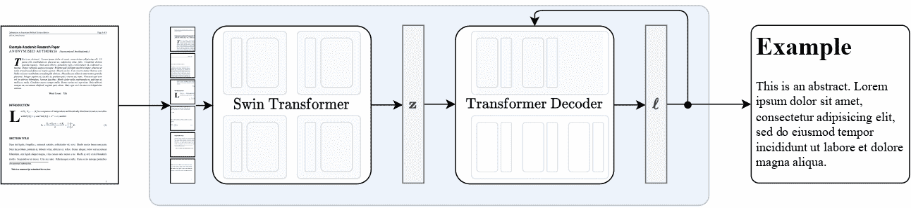

# Nougat

> 原始文本：[`huggingface.co/docs/transformers/v4.37.2/en/model_doc/nougat`](https://huggingface.co/docs/transformers/v4.37.2/en/model_doc/nougat)

## 概述

Nougat 模型是由 Lukas Blecher、Guillem Cucurull、Thomas Scialom、Robert Stojnic 提出的[Nougat: 用于学术文档的神经光学理解](https://arxiv.org/abs/2308.13418)。Nougat 使用与 Donut 相同的架构，即图像 Transformer 编码器和自回归文本 Transformer 解码器，将科学 PDF 转换为标记，使其更易于访问。

论文摘要如下：

*科学知识主要存储在书籍和科学期刊中，通常以 PDF 形式存在。然而，PDF 格式会导致语义信息的丢失，特别是对于数学表达式。我们提出了 Nougat（用于学术文档的神经光学理解），这是一个视觉 Transformer 模型，用于将科学文档进行光学字符识别（OCR）任务，转换为标记语言，并展示了我们的模型在新的科学文档数据集上的有效性。所提出的方法为增强数字时代科学知识的可访问性提供了一个有希望的解决方案，通过弥合人类可读文档和机器可读文本之间的差距。我们发布了模型和代码，以加速未来关于科学文本识别的工作。*

 Nougat 高层概述。摘自[原始论文](https://arxiv.org/abs/2308.13418)。

该模型由[nielsr](https://huggingface.co/nielsr)贡献。原始代码可在[此处](https://github.com/facebookresearch/nougat)找到。

## 使用提示

+   开始使用 Nougat 的最快方法是查看[教程笔记本](https://github.com/NielsRogge/Transformers-Tutorials/tree/master/Nougat)，展示了如何在推理时使用模型以及在自定义数据上进行微调。

+   Nougat 始终在 VisionEncoderDecoder 框架内使用。该模型在架构上与 Donut 相同。

## 推理

Nougat 的`VisionEncoderDecoder`模型接受图像作为输入，并利用 generate()来自动回归生成给定输入图像的文本。

NougatImageProcessor 类负责预处理输入图像，NougatTokenizerFast 解码生成的目标标记为目标字符串。NougatProcessor 将 NougatImageProcessor 和 NougatTokenizerFast 类封装为单个实例，用于提取输入特征和解码预测的标记 ID。

+   逐步 PDF 转录

```py
>>> from huggingface_hub import hf_hub_download
>>> import re
>>> from PIL import Image

>>> from transformers import NougatProcessor, VisionEncoderDecoderModel
>>> from datasets import load_dataset
>>> import torch

>>> processor = NougatProcessor.from_pretrained("facebook/nougat-base")
>>> model = VisionEncoderDecoderModel.from_pretrained("facebook/nougat-base")

>>> device = "cuda" if torch.cuda.is_available() else "cpu"
>>> model.to(device)
>>> # prepare PDF image for the model
>>> filepath = hf_hub_download(repo_id="hf-internal-testing/fixtures_docvqa", filename="nougat_paper.png", repo_type="dataset")
>>> image = Image.open(filepath)
>>> pixel_values = processor(image, return_tensors="pt").pixel_values

>>> # generate transcription (here we only generate 30 tokens)
>>> outputs = model.generate(
...     pixel_values.to(device),
...     min_length=1,
...     max_new_tokens=30,
...     bad_words_ids=[[processor.tokenizer.unk_token_id]],
... )

>>> sequence = processor.batch_decode(outputs, skip_special_tokens=True)[0]
>>> sequence = processor.post_process_generation(sequence, fix_markdown=False)
>>> # note: we're using repr here such for the sake of printing the \n characters, feel free to just print the sequence
>>> print(repr(sequence))
'\n\n# Nougat: Neural Optical Understanding for Academic Documents\n\n Lukas Blecher\n\nCorrespondence to: lblecher@'
```

请查看[模型中心](https://huggingface.co/models?filter=nougat)以查找 Nougat 检查点。

该模型在架构上与 Donut 相同。

## NougatImageProcessor

### `class transformers.NougatImageProcessor`

[<来源>](https://github.com/huggingface/transformers/blob/v4.37.2/src/transformers/models/nougat/image_processing_nougat.py#L57)

```py
( do_crop_margin: bool = True do_resize: bool = True size: Dict = None resample: Resampling = <Resampling.BILINEAR: 2> do_thumbnail: bool = True do_align_long_axis: bool = False do_pad: bool = True do_rescale: bool = True rescale_factor: Union = 0.00392156862745098 do_normalize: bool = True image_mean: Union = None image_std: Union = None **kwargs )
```

参数

+   `do_crop_margin`（`bool`，*可选*，默认为`True`）— 是否裁剪图像边距。

+   `do_resize`（`bool`，*可选*，默认为`True`）— 是否将图像的（高度，宽度）尺寸调整为指定的`size`。可以在`preprocess`方法中通过`do_resize`进行覆盖。

+   `size` (`Dict[str, int]` *可选*, 默认为 `{"height" -- 896, "width": 672}`): 调整大小后的图像尺寸。可以被 `preprocess` 方法中的 `size` 覆盖。

+   `resample` (`PILImageResampling`, *可选*, 默认为 `Resampling.BILINEAR`) — 如果调整图像大小，则使用的重采样滤波器。可以被 `preprocess` 方法中的 `resample` 覆盖。

+   `do_thumbnail` (`bool`, *可选*, 默认为 `True`) — 是否使用缩略图方法调整图像大小。

+   `do_align_long_axis` (`bool`, *可选*, 默认为 `False`) — 是否通过旋转 90 度来使图像的长轴与 `size` 的长轴对齐。

+   `do_pad` (`bool`, *可选*, 默认为 `True`) — 是否将图像填充到批处理中最大的图像尺寸。

+   `do_rescale` (`bool`, *可选*, 默认为 `True`) — 是否按指定比例 `rescale_factor` 重新缩放图像。可以被 `preprocess` 方法中的 `do_rescale` 参数覆盖。

+   `rescale_factor` (`int` 或 `float`, *可选*, 默认为 `1/255`) — 如果重新缩放图像，则使用的缩放因子。可以被 `preprocess` 方法中的 `rescale_factor` 参数覆盖。

+   `do_normalize` (`bool`, *可选*, 默认为 `True`) — 是否对图像进行归一化。可以被 `preprocess` 方法中的 `do_normalize` 覆盖。

+   `image_mean` (`float` 或 `List[float]`, *可选*, 默认为 `IMAGENET_DEFAULT_MEAN`) — 如果归一化图像，则使用的均值。这是一个浮点数或与图像通道数相同长度的浮点数列表。可以被 `preprocess` 方法中的 `image_mean` 参数覆盖。

+   `image_std` (`float` 或 `List[float]`, *可选*, 默认为 `IMAGENET_DEFAULT_STD`) — 图像标准差。

构建 Nougat 图像处理器。

#### `preprocess`

[< source >](https://github.com/huggingface/transformers/blob/v4.37.2/src/transformers/models/nougat/image_processing_nougat.py#L358)

```py
( images: Union do_crop_margin: bool = None do_resize: bool = None size: Dict = None resample: Resampling = None do_thumbnail: bool = None do_align_long_axis: bool = None do_pad: bool = None do_rescale: bool = None rescale_factor: Union = None do_normalize: bool = None image_mean: Union = None image_std: Union = None return_tensors: Union = None data_format: Optional = <ChannelDimension.FIRST: 'channels_first'> input_data_format: Union = None **kwargs )
```

参数

+   `images` (`ImageInput`) — 要预处理的图像。期望单个图像或批处理图像，像素值范围为 0 到 255。

+   `do_crop_margin` (`bool`, *可选*, 默认为 `self.do_crop_margin`) — 是否裁剪图像边缘。

+   `do_resize` (`bool`, *可选*, 默认为 `self.do_resize`) — 是否调整图像大小。

+   `size` (`Dict[str, int]`, *可选*, 默认为 `self.size`) — 调整大小后的图像尺寸。图像的最短边调整为 min(size[“height”], size[“width”])，最长边调整以保持输入的长宽比。

+   `resample` (`int`, *可选*, 默认为 `self.resample`) — 如果调整图像大小，则使用的重采样滤波器。这可以是枚举 `PILImageResampling` 中的一个。仅当 `do_resize` 设置为 `True` 时才会生效。

+   `do_thumbnail` (`bool`, *可选*, 默认为 `self.do_thumbnail`) — 是否使用缩略图方法调整图像大小。

+   `do_align_long_axis` (`bool`, *可选*, 默认为 `self.do_align_long_axis`) — 是否通过旋转 90 度来使图像的长轴与 `size` 的长轴对齐。

+   `do_pad` (`bool`, *可选*, 默认为 `self.do_pad`) — 是否将图像填充到批处理中最大的图像尺寸。

+   `do_rescale` (`bool`, *可选*, 默认为 `self.do_rescale`) — 是否按指定比例 `rescale_factor` 重新缩放图像。

+   `rescale_factor` (`int` 或 `float`, *可选*, 默认为 `self.rescale_factor`) — 如果重新缩放图像，则使用的缩放因子。

+   `do_normalize` (`bool`, *可选*, 默认为 `self.do_normalize`) — 是否对图像进行归一化。

+   `image_mean` (`float` 或 `List[float]`, *可选*, 默认为 `self.image_mean`) — 用于归一化的图像均值。

+   `image_std` (`float` 或 `List[float]`, *可选*, 默认为 `self.image_std`) — 用于归一化的图像标准差。

+   `return_tensors` (`str` 或 `TensorType`, *可选*) — 要返回的张量类型。可以是以下之一:

    +   未设置: 返回 `np.ndarray` 的列表。

    +   `TensorType.TENSORFLOW` 或 `'tf'`: 返回类型为 `tf.Tensor` 的批处理。

    +   `TensorType.PYTORCH` 或 `'pt'`: 返回类型为 `torch.Tensor` 的批处理。

    +   `TensorType.NUMPY` 或 `'np'`: 返回类型为 `np.ndarray` 的批处理。

    +   `TensorType.JAX` 或 `'jax'`: 返回类型为 `jax.numpy.ndarray` 的批处理。

+   `data_format` (`ChannelDimension` 或 `str`, *optional*, 默认为 `ChannelDimension.FIRST`) — 输出图像的通道维度格式。可以是以下之一：

    +   `ChannelDimension.FIRST`: 图像格式为 (num_channels, height, width)。

    +   `ChannelDimension.LAST`: 图像格式为 (height, width, num_channels)。

    +   未设置：默认为输入图像的通道维度格式。

+   `input_data_format` (`ChannelDimension` 或 `str`, *optional*) — 输入图像的通道维度格式。如果未设置，将从输入图像中推断通道维度格式。可以是以下之一：

    +   `"channels_first"` 或 `ChannelDimension.FIRST`: 图像格式为 (num_channels, height, width)。

    +   `"channels_last"` 或 `ChannelDimension.LAST`: 图像格式为 (height, width, num_channels)。

    +   `"none"` 或 `ChannelDimension.NONE`: 图像格式为 (height, width)。

预处理一张图片或一批图片。

## NougatTokenizerFast

### `class transformers.NougatTokenizerFast`

[< source >](https://github.com/huggingface/transformers/blob/v4.37.2/src/transformers/models/nougat/tokenization_nougat_fast.py#L376)

```py
( vocab_file = None tokenizer_file = None clean_up_tokenization_spaces = False unk_token = '<unk>' bos_token = '<s>' eos_token = '</s>' pad_token = '<pad>' **kwargs )
```

参数

+   `vocab_file` (`str`, *optional*) — [SentencePiece](https://github.com/google/sentencepiece) 文件（通常具有 .model 扩展名），其中包含实例化分词器所需的词汇表。

+   `tokenizer_file` (`str`, *optional*) — [tokenizers](https://github.com/huggingface/tokenizers) 文件（通常具有 .json 扩展名），其中包含加载分词器所需的所有内容。

+   `clean_up_tokenization_spaces` (`str`, *optional*, 默认为 `False`) — 解码后是否清除空格，清除包括删除额外空格等潜在瑕疵。

+   `unk_token` (`str`, *optional*, 默认为 `"<unk>"`) — 未知标记。词汇表中不存在的标记无法转换为 ID，而是设置为此标记。

+   `bos_token` (`str`, *optional*, 默认为 `"<s>"`) — 在预训练期间使用的序列开始标记。可用作序列分类器标记。

+   `eos_token` (`str`, *optional*, 默认为 `"</s>"`) — 序列结束标记。

+   `pad_token` (`str`, *optional*, 默认为 `"<pad>"`) — 用于填充的标记，例如在批处理不同长度的序列时使用。

+   `model_max_length` (`int`, *optional*) — 转换器模型输入的最大长度（以标记数计）。当使用 from_pretrained() 加载分词器时，将设置为存储在 `max_model_input_sizes` 中的相关模型的值（请参见上文）。如果未提供值，将默认为 VERY_LARGE_INTEGER (`int(1e30)`）。

+   `padding_side` (`str`, *optional*) — 模型应用填充的侧面。应在 ['right', 'left'] 中选择。默认值从同名的类属性中选择。

+   `truncation_side` (`str`, *optional*) — 模型应用截断的侧面。应在 ['right', 'left'] 中选择。默认值从同名的类属性中选择。

+   `chat_template` (`str`, *optional*) — 一个 Jinja 模板字符串，用于格式化聊天消息列表。详细描述请参见 [`huggingface.co/docs/transformers/chat_templating`](https://huggingface.co/docs/transformers/chat_templating)。

+   `model_input_names` (`List[string]`, *optional*) — 模型前向传递接受的输入列表（如 `"token_type_ids"` 或 `"attention_mask"`）。默认值从同名的类属性中选择。

+   `bos_token` (`str` 或 `tokenizers.AddedToken`, *optional*) — 表示句子开头的特殊标记。将与 `self.bos_token` 和 `self.bos_token_id` 关联。

+   `eos_token`（`str`或`tokenizers.AddedToken`，*可选*）— 代表句子结束的特殊标记。将与`self.eos_token`和`self.eos_token_id`相关联。

+   `unk_token`（`str`或`tokenizers.AddedToken`，*可选*）— 代表词汇外标记的特殊标记。将与`self.unk_token`和`self.unk_token_id`相关联。

+   `sep_token`（`str`或`tokenizers.AddedToken`，*可选*）— 用于在同一输入中分隔两个不同句子的特殊标记（例如 BERT 使用）。将与`self.sep_token`和`self.sep_token_id`相关联。

+   `pad_token`（`str`或`tokenizers.AddedToken`，*可选*）— 用于使标记数组大小相同以进行批处理的特殊标记。然后将被注意机制或损失计算忽略。将与`self.pad_token`和`self.pad_token_id`相关联。

+   `cls_token`（`str`或`tokenizers.AddedToken`，*可选*）— 代表输入类别的特殊标记（例如 BERT 使用）。将与`self.cls_token`和`self.cls_token_id`相关联。

+   `mask_token`（`str`或`tokenizers.AddedToken`，*可选*）— 代表掩码标记的特殊标记（用于掩码语言建模预训练目标，如 BERT）。将与`self.mask_token`和`self.mask_token_id`相关联。

+   `additional_special_tokens`（元组或`str`或`tokenizers.AddedToken`，*可选*）— 一组额外的特殊标记。在这里添加它们以确保在将`skip_special_tokens`设置为 True 时解码时跳过它们。如果它们不是词汇的一部分，它们将被添加到词汇的末尾。

+   `clean_up_tokenization_spaces`（`bool`，*可选*，默认为`True`）— 模型是否应清除在标记化过程中拆分输入文本时添加的空格。

+   `split_special_tokens`（`bool`，*可选*，默认为`False`）— 是否在标记化过程中拆分特殊标记。默认行为是不拆分特殊标记。这意味着如果`<s>`是`bos_token`，那么`tokenizer.tokenize("<s>") = ['<s>`]`。否则，如果`split_special_tokens=True`，那么`tokenizer.tokenize("<s>")`将给出`['<', 's', '>']`。此参数目前仅支持`slow`分词器。

+   `tokenizer_object`（`tokenizers.Tokenizer`）— 来自🤗 tokenizers 的`tokenizers.Tokenizer`对象，用于实例化。有关更多信息，请参阅使用🤗 tokenizers 中的分词器。

+   `tokenizer_file`（`str`）— 代表以前序列化的`tokenizers.Tokenizer`对象的本地 JSON 文件的路径。

Nougat 的快速分词器（由 HuggingFace 分词器库支持）。

这个分词器继承自 PreTrainedTokenizerFast，其中包含大多数主要方法。用户应参考这个超类以获取有关这些方法的更多信息。这个类主要为后处理生成的文本添加了 Nougat 特定的方法。

类属性（由派生类覆盖）

+   `vocab_files_names`（`Dict[str, str]`）— 一个字典，其键是模型所需的每个词汇文件的`__init__`关键字名称，其相关值是用于保存相关文件的文件名（字符串）。

+   `pretrained_vocab_files_map`（`Dict[str, Dict[str, str]]`）— 一个字典，其中高级键是模型所需的每个词汇文件的`__init__`关键字名称，低级别是预训练模型的`short-cut-names`，作为相关值，是与相关预训练词汇文件相关联的`url`。

+   `max_model_input_sizes`（`Dict[str, Optional[int]]`）— 一个字典，其键是预训练模型的`short-cut-names`，其相关值是该模型的序列输入的最大长度，如果模型没有最大输入大小，则为`None`。

+   `pretrained_init_configuration` (`Dict[str, Dict[str, Any]]`) — 一个字典，键为预训练模型的`short-cut-names`，值为传递给加载预训练模型时 tokenizer 类的`__init__`方法的特定参数的字典。

+   `model_input_names` (`List[str]`) — 模型前向传递中预期的输入列表。

+   `padding_side` (`str`) — 模型应该应用填充的默认值。应为`'right'`或`'left'`。

+   `truncation_side` (`str`) — 模型应该应用截断的默认值。应为`'right'`或`'left'`。

#### `correct_tables`

[< source >](https://github.com/huggingface/transformers/blob/v4.37.2/src/transformers/models/nougat/tokenization_nougat_fast.py#L470)

```py
( generation: str ) → export const metadata = 'undefined';str
```

参数

+   `generation` (str) — 要进行后处理的生成文本。

返回

str

后处理的文本。

接受一个生成的字符串，并修复表格/表格，使其符合所需的 Markdown 格式。

示例：

```py
correct_tables("\begin{table} \begin{tabular}{l l} & \ \end{tabular} \end{table}")
"\begin{table}
abular}{l l} & \ \end{tabular}
le}"
```

#### `post_process_generation`

[< source >](https://github.com/huggingface/transformers/blob/v4.37.2/src/transformers/models/nougat/tokenization_nougat_fast.py#L600)

```py
( generation: Union fix_markdown: bool = True num_workers: int = None ) → export const metadata = 'undefined';Union[str, List[str]]
```

参数

+   `generation` (Union[str, List[str]]) — 生成的文本或生成的文本列表。

+   `fix_markdown` (`bool`, *可选*, 默认为 `True`) — 是否执行 Markdown 格式修复。

+   `num_workers` (`int`, *可选*) — 传递给利用多进程的工作人员数量（并行后处理多个文本）。

返回

Union[str, List[str]]

后处理的文本或后处理文本列表。

后处理生成的文本或生成的文本列表。

此函数可用于对生成的文本执行后处理，例如修复 Markdown 格式。

后处理速度较慢，建议使用多进程加快处理速度。

#### `post_process_single`

[< source >](https://github.com/huggingface/transformers/blob/v4.37.2/src/transformers/models/nougat/tokenization_nougat_fast.py#L505)

```py
( generation: str fix_markdown: bool = True ) → export const metadata = 'undefined';str
```

参数

+   `generation` (str) — 要进行后处理的生成文本。

+   `fix_markdown` (bool, optional) — 是否执行 Markdown 格式修复。默认为 True。

返回

str

后处理的文本。

后处理单个生成的文本。此处使用的正则表达式直接来自 Nougat 文章作者。这些表达式已经过注释以确保清晰，并在大多数情况下进行了端到端测试。

#### `remove_hallucinated_references`

[< source >](https://github.com/huggingface/transformers/blob/v4.37.2/src/transformers/models/nougat/tokenization_nougat_fast.py#L440)

```py
( text: str ) → export const metadata = 'undefined';str
```

参数

+   `text` (`str`) — 包含引用的输入文本。

返回

`str`

删除虚构引用的文本。

从文本中删除虚构或缺失的引用。

此函数识别并删除输入文本中标记为缺失或虚构的引用。

## NougatProcessor

### `class transformers.NougatProcessor`

[< source >](https://github.com/huggingface/transformers/blob/v4.37.2/src/transformers/models/nougat/processing_nougat.py#L27)

```py
( image_processor tokenizer )
```

参数

+   `image_processor` (NougatImageProcessor) — 一个 NougatImageProcessor 的实例。图像处理器是必需的输入。

+   `tokenizer` (NougatTokenizerFast) — 一个 NougatTokenizerFast 的实例。分词器是必需的输入。

构建一个 Nougat 处理器，将 Nougat 图像处理器和 Nougat tokenizer 包装成一个单一处理器。

NougatProcessor 提供了 NougatImageProcessor 和 NougatTokenizerFast 的所有功能。有关更多信息，请参考 **call**() 和 decode()。 

#### `__call__`

[< source >](https://github.com/huggingface/transformers/blob/v4.37.2/src/transformers/models/nougat/processing_nougat.py#L49)

```py
( images = None text = None do_crop_margin: bool = None do_resize: bool = None size: Dict = None resample: PILImageResampling = None do_thumbnail: bool = None do_align_long_axis: bool = None do_pad: bool = None do_rescale: bool = None rescale_factor: Union = None do_normalize: bool = None image_mean: Union = None image_std: Union = None data_format: Optional = 'channels_first' input_data_format: Union = None text_pair: Union = None text_target: Union = None text_pair_target: Union = None add_special_tokens: bool = True padding: Union = False truncation: Union = None max_length: Optional = None stride: int = 0 is_split_into_words: bool = False pad_to_multiple_of: Optional = None return_tensors: Union = None return_token_type_ids: Optional = None return_attention_mask: Optional = None return_overflowing_tokens: bool = False return_special_tokens_mask: bool = False return_offsets_mapping: bool = False return_length: bool = False verbose: bool = True )
```

#### `from_pretrained`

[< source >](https://github.com/huggingface/transformers/blob/v4.37.2/src/transformers/processing_utils.py#L406)

```py
( pretrained_model_name_or_path: Union cache_dir: Union = None force_download: bool = False local_files_only: bool = False token: Union = None revision: str = 'main' **kwargs )
```

参数

+   `pretrained_model_name_or_path` (`str` or `os.PathLike`) — 这可以是：

    +   一个字符串，预训练特征提取器的 *模型 id*，托管在 huggingface.co 上的模型存储库中。有效的模型 id 可以位于根级别，如 `bert-base-uncased`，或者在用户或组织名称下命名空间化，如 `dbmdz/bert-base-german-cased`。

    +   一个包含使用 save_pretrained() 方法保存的特征提取器文件的 *目录* 路径，例如 `./my_model_directory/`。

    +   已保存的特征提取器 JSON *文件* 的路径或 URL，例如 `./my_model_directory/preprocessor_config.json`。**kwargs — 传递给 from_pretrained() 和 `~tokenization_utils_base.PreTrainedTokenizer.from_pretrained` 的额外关键字参数。

实例化与预训练模型相关联的处理器。

这个类方法只是调用特征提取器 from_pretrained()、图像处理器 ImageProcessingMixin 和分词器 `~tokenization_utils_base.PreTrainedTokenizer.from_pretrained` 方法。有关更多信息，请参考上述方法的文档字符串。

#### `save_pretrained`

[< source >](https://github.com/huggingface/transformers/blob/v4.37.2/src/transformers/processing_utils.py#L167)

```py
( save_directory push_to_hub: bool = False **kwargs )
```

参数

+   `save_directory` (`str` or `os.PathLike`) — 将保存特征提取器 JSON 文件和分词器文件的目录（如果目录不存在，则将创建）。

+   `push_to_hub` (`bool`, *optional*, defaults to `False`) — 是否在保存模型后将其推送到 Hugging Face 模型中心。您可以使用 `repo_id` 指定要推送到的存储库（将默认为您的命名空间中的 `save_directory` 名称）。

+   `kwargs` (`Dict[str, Any]`, *optional*) — 传递给 push_to_hub() 方法的额外关键字参数。

将此处理器的属性（特征提取器、分词器等）保存在指定的目录中，以便可以使用 from_pretrained() 方法重新加载。

这个类方法只是调用 save_pretrained() 和 save_pretrained()。有关更多信息，请参考上述方法的文档字符串。

#### `batch_decode`

[< source >](https://github.com/huggingface/transformers/blob/v4.37.2/src/transformers/models/nougat/processing_nougat.py#L141)

```py
( *args **kwargs )
```

这个方法将所有参数转发给 NougatTokenizer 的 batch_decode()。请参考此方法的文档字符串以获取更多信息。

#### `解码`

[<来源>](https://github.com/huggingface/transformers/blob/v4.37.2/src/transformers/models/nougat/processing_nougat.py#L148)

```py
( *args **kwargs )
```

这个方法将所有参数转发给 NougatTokenizer 的 decode()。请参考此方法的文档字符串以获取更多信息。

#### `后处理生成`

[<来源>](https://github.com/huggingface/transformers/blob/v4.37.2/src/transformers/models/nougat/processing_nougat.py#L155)

```py
( *args **kwargs )
```

这个方法将所有参数转发给 NougatTokenizer 的`~PreTrainedTokenizer.post_process_generation`。请参考此方法的文档字符串以获取更多信息。
