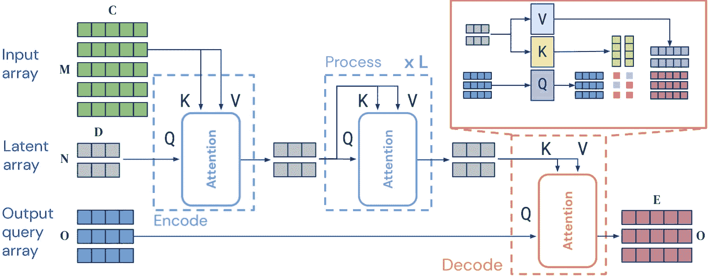

# Perceiver

> 原文链接：[`huggingface.co/docs/transformers/v4.37.2/en/model_doc/perceiver`](https://huggingface.co/docs/transformers/v4.37.2/en/model_doc/perceiver)

## 概述

Perceiver IO 模型由 Andrew Jaegle、Sebastian Borgeaud、Jean-Baptiste Alayrac、Carl Doersch、Catalin Ionescu、David Ding、Skanda Koppula、Daniel Zoran、Andrew Brock、Evan Shelhamer、Olivier Hénaff、Matthew M. Botvinick、Andrew Zisserman、Oriol Vinyals、João Carreira 在《Perceiver IO: A General Architecture for Structured Inputs & Outputs》中提出。

Perceiver IO 是对 Perceiver 的泛化，可以处理任意输出以及任意输入。原始的 Perceiver 只产生单个分类标签。除了分类标签，Perceiver IO 还可以生成（例如）语言、光流和带有音频的多模态视频。这是使用与原始 Perceiver 相同的构建模块完成的。Perceiver IO 的计算复杂度与输入和输出大小呈线性关系，大部分处理发生在潜在空间中，使我们能够处理比标准 Transformer 处理能力更大的输入和输出。这意味着，例如，Perceiver IO 可以直接使用字节执行类似 BERT 的掩码语言建模，而不是使用标记化的输入。

论文的摘要如下：

最近提出的 Perceiver 模型在多个领域（图像、音频、多模态、点云）上取得了良好的结果，同时在计算和内存方面与输入大小呈线性关系。虽然 Perceiver 支持多种类型的输入，但它只能产生非常简单的输出，如类别分数。Perceiver IO 通过学习灵活地查询模型的潜在空间来产生任意大小和语义的输出，克服了这一限制，同时保留了原始模型的吸引人特性。Perceiver IO 仍然将模型深度与数据大小分离，并且仍然与数据大小呈线性关系，但现在是相对于输入和输出大小。完整的 Perceiver IO 模型在具有高度结构化输出空间的任务上取得了强大的结果，例如自然语言和视觉理解、星际争霸 II 以及多任务和多模态领域。作为亮点，Perceiver IO 在 GLUE 语言基准测试中与基于 Transformer 的 BERT 基线相匹配，无需输入标记化，并在 Sintel 光流估计中实现了最先进的性能。

以下是 Perceiver 工作原理的 TLDR：

Transformer 的自注意机制的主要问题是随着序列长度的增加，时间和内存需求呈二次方增长。因此，像 BERT 和 RoBERTa 这样的模型受限于最大 512 个标记的序列长度。Perceiver 旨在通过在一组潜在变量上执行自注意，而不是在输入上执行自注意，从而解决这个问题，并且仅使用输入进行交叉注意力。这样，时间和内存需求不再取决于输入的长度，因为使用固定数量的潜在变量，如 256 或 512。这些变量是随机初始化的，之后通过反向传播进行端到端训练。

在内部，PerceiverModel 将创建潜在变量，其形状为`(batch_size, num_latents, d_latents)`的张量。必须向模型提供输入（可以是文本、图像、音频等），模型将使用这些输入与潜在变量进行交叉注意力。Perceiver 编码器的输出是相同形状的张量。然后可以类似于 BERT，通过沿序列维度取平均值将潜在变量的最后隐藏状态转换为分类 logits，并在其上放置一个线性层，将`d_latents`投影到`num_labels`。

这是原始 Perceiver 论文的想法。但是，它只能输出分类 logits。在后续工作 PerceiverIO 中，他们将其泛化，使模型还可以产生任意大小的输出。你可能会问，如何实现？其实想法相对简单：定义任意大小的输出，然后使用潜在变量的最后隐藏状态执行交叉注意力，使用输出作为查询，潜在变量作为键和值。

那么假设有人想要使用 Perceiver 执行掩码语言建模（类似 BERT）。由于 Perceiver 的输入长度不会影响自注意力层的计算时间，可以提供原始字节，将`inputs`的长度提供给模型为 2048。如果现在屏蔽掉这 2048 个标记中的某些标记，可以将`outputs`定义为形状为：`(batch_size, 2048, 768)`。接下来，使用潜在变量的最终隐藏状态执行交叉注意力以更新`outputs`张量。经过交叉注意力后，仍然有形状为`(batch_size, 2048, 768)`的张量。然后可以在顶部放置一个常规的语言建模头部，将最后一个维度投影到模型的词汇量大小，即创建形状为`(batch_size, 2048, 262)`的 logits（因为 Perceiver 使用 262 个字节 ID 的词汇量大小）。

 Perceiver IO 架构。取自[原始论文](https://arxiv.org/abs/2105.15203)

此模型由[nielsr](https://huggingface.co/nielsr)贡献。原始代码可以在[此处](https://github.com/deepmind/deepmind-research/tree/master/perceiver)找到。

Perceiver **不** 与`torch.nn.DataParallel`一起使用，因为 PyTorch 中存在错误，请参阅[问题＃36035](https://github.com/pytorch/pytorch/issues/36035)

## 资源

+   开始使用 Perceiver 的最快方法是查看[教程笔记本](https://github.com/NielsRogge/Transformers-Tutorials/tree/master/Perceiver)。

+   如果您想要完全了解模型如何工作并在库中实现，请参考[博客文章](https://huggingface.co/blog/perceiver)。请注意，库中提供的模型仅展示了您可以使用 Perceiver 做什么的一些示例。还有许多其他用例，包括问答，命名实体识别，目标检测，音频分类，视频分类等。

+   文本分类任务指南

+   掩码语言建模任务指南

+   图像分类任务指南

## Perceiver 特定的输出

### `class transformers.models.perceiver.modeling_perceiver.PerceiverModelOutput`

[<来源>](https://github.com/huggingface/transformers/blob/v4.37.2/src/transformers/models/perceiver/modeling_perceiver.py#L60)

```py
( logits: FloatTensor = None last_hidden_state: FloatTensor = None hidden_states: Optional = None attentions: Optional = None cross_attentions: Optional = None )
```

参数

+   `logits`（形状为`(batch_size, num_labels)`的`torch.FloatTensor`）—分类（如果`config.num_labels==1`则为回归）得分（SoftMax 之前）。

+   `last_hidden_state`（形状为`(batch_size, sequence_length, hidden_size)`的`torch.FloatTensor`）—模型最后一层的隐藏状态序列。

+   `hidden_states`（`tuple(torch.FloatTensor)`，*可选*，当传递`output_hidden_states=True`或当`config.output_hidden_states=True`时返回）—形状为`(batch_size, sequence_length, hidden_size)`的`torch.FloatTensor`元组（一个用于嵌入的输出+一个用于每个层的输出）。模型在每一层的输出的隐藏状态加上初始嵌入输出。

+   `attentions`（`tuple(torch.FloatTensor)`，*可选*，当传递`output_attentions=True`或当`config.output_attentions=True`时返回）—形状为`(batch_size, num_heads, sequence_length, sequence_length)`的`torch.FloatTensor`元组（每个层一个）。注意力 softmax 后的注意力权重，用于计算自注意力头中的加权平均值。

+   `cross_attentions` (`tuple(torch.FloatTensor)`，*可选*，当传递`output_attentions=True`或`config.output_attentions=True`时返回) — 形状为`(batch_size, num_heads, sequence_length, sequence_length)`的`torch.FloatTensor`元组（每个层一个）。解码器的交叉注意力层的注意力权重，注意力 softmax 后用于计算交叉注意力头中的加权平均值。

Perceiver 基础模型输出的基类，包括潜在的隐藏状态、注意力和交叉注意力。

### `class transformers.models.perceiver.modeling_perceiver.PerceiverDecoderOutput`

[<来源>](https://github.com/huggingface/transformers/blob/v4.37.2/src/transformers/models/perceiver/modeling_perceiver.py#L91)

```py
( logits: FloatTensor = None cross_attentions: Optional = None )
```

参数

+   `logits` (`torch.FloatTensor`，形状为`(batch_size, num_labels)`) — 基本解码器的输出。

+   `cross_attentions` (`tuple(torch.FloatTensor)`，*可选*，当传递`output_attentions=True`或`config.output_attentions=True`时返回) — 形状为`(batch_size, num_heads, sequence_length, sequence_length)`的`torch.FloatTensor`元组（每个层一个）。解码器的交叉注意力层的注意力权重，注意力 softmax 后用于计算交叉注意力头中的加权平均值。

Perceiver 解码器输出的基类，包括潜在的交叉注意力。

### `class transformers.models.perceiver.modeling_perceiver.PerceiverMaskedLMOutput`

[<来源>](https://github.com/huggingface/transformers/blob/v4.37.2/src/transformers/models/perceiver/modeling_perceiver.py#L109)

```py
( loss: Optional = None logits: FloatTensor = None hidden_states: Optional = None attentions: Optional = None cross_attentions: Optional = None )
```

参数

+   `loss` (`torch.FloatTensor`，形状为`(1,)`，*可选*，当提供`labels`时返回) — 掩码语言建模（MLM）损失。

+   `logits` (`torch.FloatTensor`，形状为`(batch_size, sequence_length, config.vocab_size)`) — 语言建模头的预测分数（SoftMax 之前每个词汇标记的分数）。

+   `hidden_states` (`tuple(torch.FloatTensor)`，*可选*，当传递`output_hidden_states=True`或`config.output_hidden_states=True`时返回) — 形状为`(batch_size, sequence_length, hidden_size)`的`torch.FloatTensor`元组（一个用于嵌入的输出 + 一个用于每个层的输出）。模型在每个层的输出的隐藏状态加上初始嵌入输出。

+   `attentions` (`tuple(torch.FloatTensor)`，*可选*，当传递`output_attentions=True`或`config.output_attentions=True`时返回) — 形状为`(batch_size, num_heads, num_latents, num_latents)`的`torch.FloatTensor`元组（每个层一个）。注意力 softmax 后的注意力权重，用于计算自注意力头中的加权平均值。

+   `cross_attentions` (`tuple(torch.FloatTensor)`，*可选*，当传递`output_attentions=True`或`config.output_attentions=True`时返回) — 形状为`(batch_size, num_heads, sequence_length, sequence_length)`的`torch.FloatTensor`元组（每个层一个）。解码器的交叉注意力层的注意力权重，注意力 softmax 后用于计算交叉注意力头中的加权平均值。

Perceiver 掩码语言模型输出的基类。

### `class transformers.models.perceiver.modeling_perceiver.PerceiverClassifierOutput`

[<来源>](https://github.com/huggingface/transformers/blob/v4.37.2/src/transformers/models/perceiver/modeling_perceiver.py#L140)

```py
( loss: Optional = None logits: FloatTensor = None hidden_states: Optional = None attentions: Optional = None cross_attentions: Optional = None )
```

参数

+   `loss` (`torch.FloatTensor`，形状为`(1,)`，*可选*，当提供`labels`时返回) — 分类（如果`config.num_labels==1`则为回归）损失。

+   `logits` (`torch.FloatTensor`，形状为`(batch_size, config.num_labels)`) — 分类（如果`config.num_labels==1`则为回归）分数（SoftMax 之前）。

+   `hidden_states` (`tuple(torch.FloatTensor)`, *可选*, 当传递`output_hidden_states=True`或`config.output_hidden_states=True`时返回) — 形状为`(batch_size, sequence_length, hidden_size)`的`torch.FloatTensor`元组。模型在每一层输出的隐藏状态加上初始嵌入输出。

+   `attentions` (`tuple(torch.FloatTensor)`, *可选*, 当传递`output_attentions=True`或`config.output_attentions=True`时返回) — 形状为`(batch_size, num_heads, sequence_length, sequence_length)`的`torch.FloatTensor`元组（每层一个）。在注意力 softmax 之后的注意力权重，用于计算自注意力头中的加权平均值。

+   `cross_attentions` (`tuple(torch.FloatTensor)`, *可选*, 当传递`output_attentions=True`或`config.output_attentions=True`时返回) — 形状为`(batch_size, num_heads, sequence_length, sequence_length)`的`torch.FloatTensor`元组（每层一个）。解码器的交叉注意力层的注意力权重，在注意力 softmax 之后，用于计算交叉注意力头中的加权平均值。

Perceiver 的序列/图像分类模型、光流和多模态自编码的输出的基类。

## PerceiverConfig

### `class transformers.PerceiverConfig`

[<来源>](https://github.com/huggingface/transformers/blob/v4.37.2/src/transformers/models/perceiver/configuration_perceiver.py#L36)

```py
( num_latents = 256 d_latents = 1280 d_model = 768 num_blocks = 1 num_self_attends_per_block = 26 num_self_attention_heads = 8 num_cross_attention_heads = 8 qk_channels = None v_channels = None cross_attention_shape_for_attention = 'kv' self_attention_widening_factor = 1 cross_attention_widening_factor = 1 hidden_act = 'gelu' attention_probs_dropout_prob = 0.1 initializer_range = 0.02 layer_norm_eps = 1e-12 use_query_residual = True vocab_size = 262 max_position_embeddings = 2048 image_size = 56 train_size = [368, 496] num_frames = 16 audio_samples_per_frame = 1920 samples_per_patch = 16 output_shape = [1, 16, 224, 224] output_num_channels = 512 _label_trainable_num_channels = 1024 **kwargs )
```

参数

+   `num_latents` (`int`, *可选*, 默认为 256) — 潜在嵌入的数量。

+   `d_latents` (`int`, *可选*, 默认为 1280) — 潜在嵌入的维度。

+   `d_model` (`int`, *可选*, 默认为 768) — 输入的维度。仅在使用[*PerceiverTextPreprocessor*]或未提供预处理器时提供。

+   `num_blocks` (`int`, *可选*, 默认为 1) — Transformer 编码器中的块数。

+   `num_self_attends_per_block` (`int`, *可选*, 默认为 26) — 每个块中的自注意力层的数量。

+   `num_self_attention_heads` (`int`, *可选*, 默认为 8) — Transformer 编码器中每个自注意力层的注意力头数。

+   `num_cross_attention_heads` (`int`, *可选*, 默认为 8) — Transformer 编码器中每个交叉注意力层的注意力头数。

+   `qk_channels` (`int`, *可选*) — 在编码器的交叉注意力和自注意力层中应用注意力之前投影查询+键的维度。如果未指定，将默认保留查询的维度。

+   `v_channels` (`int`, *可选*) — 在编码器的交叉注意力和自注意力层中应用注意力之前投影值的维度。如果未指定，将默认保留查询的维度。

+   `cross_attention_shape_for_attention` (`str`, *可选*, 默认为`"kv"`) — 在编码器的交叉注意力层中降采样查询和键时使用的维度。

+   `self_attention_widening_factor` (`int`, *可选*, 默认为 1) — Transformer 编码器中交叉注意力层中前馈层的维度。

+   `cross_attention_widening_factor` (`int`, *可选*, 默认为 1) — Transformer 编码器中自注意力层中前馈层的维度。

+   `hidden_act` (`str`或`function`, *可选*, 默认为`"gelu"`) — 编码器和池化器中的非线性激活函数（函数或字符串）。如果是字符串，支持`"gelu"`、`"relu"`、`"selu"`和`"gelu_new"`。

+   `attention_probs_dropout_prob` (`float`, *可选*, 默认为 0.1) — 注意力概率的丢弃比率。

+   `initializer_range` (`float`, *可选*, 默认为 0.02) — 用于初始化所有权重矩阵的截断正态初始化器的标准差。

+   `layer_norm_eps` (`float`, *可选*, 默认为 1e-12) — 层归一化层使用的 epsilon。

+   `use_query_residual` (`float`, *optional*, defaults to `True`) — 是否在编码器的交叉注意力层中添加查询残差。

+   `vocab_size` (`int`, *optional*, defaults to 262) — 用于掩码语言建模模型的词汇量。

+   `max_position_embeddings` (`int`, *optional*, defaults to 2048) — 掩码语言建模模型可能使用的最大序列长度。通常将其设置为较大的值以防万一（例如，512、1024 或 2048）。

+   `image_size` (`int`, *optional*, defaults to 56) — 预处理后的图像大小，用于 PerceiverForImageClassificationLearned。

+   `train_size` (`List[int]`, *optional*, defaults to `[368, 496]`) — 光流模型图像的训练大小。

+   `num_frames` (`int`, *optional*, defaults to 16) — 多模态自编码模型中使用的视频帧数。

+   `audio_samples_per_frame` (`int`, *optional*, defaults to 1920) — 多模态自编码模型中每帧的音频样本数。

+   `samples_per_patch` (`int`, *optional*, defaults to 16) — 在预处理音频时，每个补丁的音频样本数，用于多模态自编码模型。

+   `output_shape` (`List[int]`, *optional*, defaults to `[1, 16, 224, 224]`) — 多模态自编码模型视频解码器查询的输出形状（批量大小、帧数、高度、宽度）。这不包括通道维度。

+   `output_num_channels` (`int`, *optional*, defaults to 512) — 每个模态解码器的输出通道数。

这是用于存储 PerceiverModel 配置的配置类。它用于根据指定的参数实例化 Perceiver 模型，定义模型架构。使用默认值实例化配置将产生类似于 Perceiver [deepmind/language-perceiver](https://huggingface.co/deepmind/language-perceiver) 架构的配置。

配置对象继承自 PretrainedConfig，可用于控制模型输出。阅读来自 PretrainedConfig 的文档以获取更多信息。

示例：

```py
>>> from transformers import PerceiverModel, PerceiverConfig

>>> # Initializing a Perceiver deepmind/language-perceiver style configuration
>>> configuration = PerceiverConfig()

>>> # Initializing a model from the deepmind/language-perceiver style configuration
>>> model = PerceiverModel(configuration)

>>> # Accessing the model configuration
>>> configuration = model.config
```

## PerceiverTokenizer

### `class transformers.PerceiverTokenizer`

[<来源>](https://github.com/huggingface/transformers/blob/v4.37.2/src/transformers/models/perceiver/tokenization_perceiver.py#L27)

```py
( pad_token = '[PAD]' bos_token = '[BOS]' eos_token = '[EOS]' mask_token = '[MASK]' cls_token = '[CLS]' sep_token = '[SEP]' model_max_length = 2048 **kwargs )
```

参数

+   `pad_token` (`str`, *optional*, defaults to `"[PAD]"`) — 用于填充的标记，例如在批处理不同长度的序列时使用。

+   `bos_token` (`str`, *optional*, defaults to `"[BOS]"`) — BOS 标记（在词汇表中保留，但实际上未使用）。

+   `eos_token` (`str`, *optional*, defaults to `"[EOS]"`) — 序列结束标记（在词汇表中保留，但实际上未使用）。

    在使用特殊标记构建序列时，这不是用于序列结尾的标记。实际使用的标记是 `sep_token`。

+   `mask_token` (`str`, *optional*, defaults to `"[MASK]"`) — MASK 标记，用于掩码语言建模。

+   `cls_token` (`str`, *optional*, defaults to `"[CLS]"`) — CLS 标记（在词汇表中保留，但实际上未使用）。

+   `sep_token` (`str`, *optional*, defaults to `"[SEP]"`) — 用于从两个序列构建序列时使用的分隔符标记。

构建一个 Perceiver 标记器。Perceiver 简单地使用原始字节 utf-8 编码。

此标记器继承自 PreTrainedTokenizer，其中包含大多数主要方法。用户应参考此超类以获取有关这些方法的更多信息。

#### `__call__`

[< source >](https://github.com/huggingface/transformers/blob/v4.37.2/src/transformers/tokenization_utils_base.py#L2729)

```py
( text: Union = None text_pair: Union = None text_target: Union = None text_pair_target: Union = None add_special_tokens: bool = True padding: Union = False truncation: Union = None max_length: Optional = None stride: int = 0 is_split_into_words: bool = False pad_to_multiple_of: Optional = None return_tensors: Union = None return_token_type_ids: Optional = None return_attention_mask: Optional = None return_overflowing_tokens: bool = False return_special_tokens_mask: bool = False return_offsets_mapping: bool = False return_length: bool = False verbose: bool = True **kwargs ) → export const metadata = 'undefined';BatchEncoding
```

参数

+   `text` (`str`, `List[str]`, `List[List[str]]`, *可选*) — 要编码的序列或序列批次。每个序列可以是字符串或字符串列表（预分词字符串）。如果序列以字符串列表（预分词）的形式提供，则必须设置 `is_split_into_words=True`（以消除与序列批次的歧义）。

+   `text_pair` (`str`, `List[str]`, `List[List[str]]`, *可选*) — 要编码的序列或序列批次。每个序列可以是字符串或字符串列表（预分词字符串）。如果序列以字符串列表（预分词）的形式提供，则必须设置 `is_split_into_words=True`（以消除与序列批次的歧义）。

+   `text_target` (`str`, `List[str]`, `List[List[str]]`, *可选*) — 要编码为目标文本的序列或序列批次。每个序列可以是字符串或字符串列表（预分词字符串）。如果序列以字符串列表（预分词）的形式提供，则必须设置 `is_split_into_words=True`（以消除与序列批次的歧义）。

+   `text_pair_target` (`str`, `List[str]`, `List[List[str]]`, *可选*) — 要编码为目标文本的序列或序列批次。每个序列可以是字符串或字符串列表（预分词字符串）。如果序列以字符串列表（预分词）的形式提供，则必须设置 `is_split_into_words=True`（以消除与序列批次的歧义）。

+   `add_special_tokens` (`bool`, *可选*, 默认为 `True`) — 在编码序列时是否添加特殊标记。这将使用底层的 `PretrainedTokenizerBase.build_inputs_with_special_tokens` 函数，该函数定义了自动添加到输入 id 的标记。如果要自动添加 `bos` 或 `eos` 标记，则这很有用。

+   `padding` (`bool`, `str` 或 PaddingStrategy, *可选*, 默认为 `False`) — 激活和控制填充。接受以下值：

    +   `True` 或 `'longest'`: 填充到批次中最长的序列（如果只提供单个序列，则不进行填充）。

    +   `'max_length'`: 填充到指定的最大长度（使用参数 `max_length`）或模型的最大可接受输入长度（如果未提供该参数）。

    +   `False` 或 `'do_not_pad'`（默认）: 不进行填充（即可以输出长度不同的序列批次）。

+   `truncation` (`bool`, `str` 或 TruncationStrategy, *可选*, 默认为 `False`) — 激活和控制截断。接受以下值：

    +   `True` 或 `'longest_first'`: 截断到指定的最大长度（使用参数 `max_length`）或模型的最大可接受输入长度（如果未提供该参数）。如果提供了一对序列（或一批对序列），则将逐标记截断，从一对序列中最长的序列中删除一个标记。

    +   `'only_first'`: 截断到指定的最大长度（使用参数 `max_length`）或模型的最大可接受输入长度（如果未提供该参数）。如果提供了一对序列（或一批对序列），则只会截断第一个序列。

    +   `'only_second'`: 截断到指定的最大长度（使用参数 `max_length`）或模型的最大可接受输入长度（如果未提供该参数）。如果提供了一对序列（或一批对序列），则只会截断第二个序列。

    +   `False` 或 `'do_not_truncate'`（默认）: 不截断（即可以输出长度大于模型最大可接受输入大小的批次）。

+   `max_length` (`int`, *optional*) — 控制截断/填充参数之一使用的最大长度。

    如果未设置或设置为`None`，则如果截断/填充参数之一需要最大长度，则将使用预定义的模型最大长度。如果模型没有特定的最大输入长度（如 XLNet），则将禁用截断/填充到最大长度。

+   `stride` (`int`, *optional*, 默认为 0) — 如果与`max_length`一起设置为一个数字，则当`return_overflowing_tokens=True`时返回的溢出标记将包含截断序列末尾的一些标记，以提供截断和溢出序列之间的一些重叠。此参数的值定义重叠标记的数量。

+   `is_split_into_words` (`bool`, *optional*, 默认为`False`) — 输入是否已经预先标记化（例如，已分割为单词）。如果设置为`True`，分词器会假定输入已经分割为单词（例如，通过在空格上分割），然后对其进行标记化。这对于 NER 或标记分类很有用。

+   `pad_to_multiple_of` (`int`, *optional*) — 如果设置，将填充序列到提供的值的倍数。需要激活`padding`。这对于在具有计算能力`>= 7.5`（Volta）的 NVIDIA 硬件上启用 Tensor Cores 特别有用。

+   `return_tensors` (`str`或 TensorType, *optional*) — 如果设置，将返回张量而不是 Python 整数列表。可接受的值为：

    +   `'tf'`：返回 TensorFlow `tf.constant`对象。

    +   `'pt'`：返回 PyTorch `torch.Tensor`对象。

    +   `'np'`：返回 Numpy `np.ndarray`对象。

+   `return_token_type_ids` (`bool`, *optional*) — 是否返回标记类型 ID。如果保持默认设置，将根据特定分词器的默认值返回标记类型 ID，由`return_outputs`属性定义。

    什么是标记类型 ID？

+   `return_attention_mask` (`bool`, *optional*) — 是否返回注意力掩码。如果保持默认设置，将根据特定分词器的默认值返回注意力掩码，由`return_outputs`属性定义。

    什么是注意力掩码？

+   `return_overflowing_tokens` (`bool`, *optional*, 默认为`False`) — 是否返回溢出的标记序列。如果提供了一对输入 id 序列（或一批对），并且`truncation_strategy = longest_first`或`True`，则会引发错误，而不是返回溢出标记。

+   `return_special_tokens_mask` (`bool`, *optional*, 默认为`False`) — 是否返回特殊标记掩码信息。

+   `return_offsets_mapping` (`bool`, *optional*, 默认为`False`) — 是否返回每个标记的`(char_start, char_end)`。

    这仅适用于继承自 PreTrainedTokenizerFast 的快速分词器，如果使用 Python 的分词器，此方法将引发`NotImplementedError`。

+   `return_length` (`bool`, *optional*, 默认为`False`) — 是否返回编码输入的长度。

+   `verbose` (`bool`, *optional*, 默认为`True`) — 是否打印更多信息和警告。**kwargs — 传递给`self.tokenize()`方法

返回

BatchEncoding

具有以下字段的 BatchEncoding：

+   `input_ids` — 要馈送到模型的标记 id 列表。

    什么是输入 ID？

+   `token_type_ids` — 要馈送到模型的标记类型 id 列表（当`return_token_type_ids=True`或`self.model_input_names`中包含*`token_type_ids`*时）。

    什么是标记类型 ID？

+   `attention_mask` — 指定哪些令牌应该被模型关注的索引列表（当`return_attention_mask=True`或`self.model_input_names`中包含*`attention_mask`*时）。

    什么是注意力掩码？

+   `overflowing_tokens` — 溢出的令牌序列列表（当指定`max_length`并且`return_overflowing_tokens=True`时）。

+   `num_truncated_tokens` — 截断的令牌数（当指定`max_length`并且`return_overflowing_tokens=True`时）。

+   `special_tokens_mask` — 由 0 和 1 组成的列表，其中 1 指定添加的特殊令牌，0 指定常规序列令牌（当`add_special_tokens=True`和`return_special_tokens_mask=True`时）。

+   `length` — 输入的长度（当`return_length=True`时）

用于对一个或多个序列或一个或多个序列对进行标记和准备模型的主要方法。

## 感知器特征提取器

### `class transformers.PerceiverFeatureExtractor`

[<来源>](https://github.com/huggingface/transformers/blob/v4.37.2/src/transformers/models/perceiver/feature_extraction_perceiver.py#L26)

```py
( *args **kwargs )
```

#### `__call__`

[<来源>](https://github.com/huggingface/transformers/blob/v4.37.2/src/transformers/image_processing_utils.py#L550)

```py
( images **kwargs )
```

预处理图像或一批图像。

## 感知器图像处理器

### `class transformers.PerceiverImageProcessor`

[<来源>](https://github.com/huggingface/transformers/blob/v4.37.2/src/transformers/models/perceiver/image_processing_perceiver.py#L46)

```py
( do_center_crop: bool = True crop_size: Dict = None do_resize: bool = True size: Dict = None resample: Resampling = <Resampling.BICUBIC: 3> do_rescale: bool = True rescale_factor: Union = 0.00392156862745098 do_normalize: bool = True image_mean: Union = None image_std: Union = None **kwargs )
```

参数

+   `do_center_crop` (`bool`，`可选`，默认为`True`) — 是否对图像进行中心裁剪。如果输入尺寸小于任何边的`crop_size`，则图像将填充零，然后进行中心裁剪。可以被`preprocess`方法中的`do_center_crop`参数覆盖。

+   `crop_size` (`Dict[str, int]`，*可选*，默认为`{"height" -- 256, "width": 256}`): 应用中心裁剪时的期望输出大小。可以被`preprocess`方法中的`crop_size`参数覆盖。

+   `do_resize` (`bool`，*可选*，默认为`True`) — 是否将图像调整大小为`(size["height"], size["width"])`。可以被`preprocess`方法中的`do_resize`参数覆盖。

+   `size` (`Dict[str, int]` *可选*，默认为`{"height" -- 224, "width": 224}`): 调整大小后的图像尺寸。可以被`preprocess`方法中的`size`参数覆盖。

+   `resample` (`PILImageResampling`，*可选*，默认为`PILImageResampling.BICUBIC`) — 定义在调整图像大小时要使用的重采样滤波器。可以被`preprocess`方法中的`resample`参数覆盖。

+   `do_rescale` (`bool`，*可选*，默认为`True`) — 是否按指定比例`rescale_factor`重新缩放图像。可以被`preprocess`方法中的`do_rescale`参数覆盖。

+   `rescale_factor` (`int`或`float`，*可选*，默认为`1/255`) — 定义重新缩放图像时要使用的比例因子。可以被`preprocess`方法中的`rescale_factor`参数覆盖。do_normalize — 是否对图像进行归一化。可以被`preprocess`方法中的`do_normalize`参数覆盖。

+   `image_mean` (`float`或`List[float]`，*可选*，默认为`IMAGENET_STANDARD_MEAN`) — 如果对图像进行归一化，则使用的均值。这是一个浮点数或与图像通道数相同长度的浮点数列表。可以被`preprocess`方法中的`image_mean`参数覆盖。

+   `image_std` (`float`或`List[float]`，*可选*，默认为`IMAGENET_STANDARD_STD`) — 如果对图像进行归一化，则使用的标准差。这是一个浮点数或与图像通道数相同长度的浮点数列表。可以被`preprocess`方法中的`image_std`参数覆盖。

构建感知器图像处理器。

#### `preprocess`

[<来源>](https://github.com/huggingface/transformers/blob/v4.37.2/src/transformers/models/perceiver/image_processing_perceiver.py#L209)

```py
( images: Union do_center_crop: Optional = None crop_size: Optional = None do_resize: Optional = None size: Optional = None resample: Resampling = None do_rescale: Optional = None rescale_factor: Optional = None do_normalize: Optional = None image_mean: Union = None image_std: Union = None return_tensors: Union = None data_format: ChannelDimension = <ChannelDimension.FIRST: 'channels_first'> input_data_format: Union = None **kwargs )
```

参数

+   `images` (`ImageInput`) — 要预处理的图像。期望单个图像或图像批次，像素值范围为 0 到 255。如果传入像素值在 0 到 1 之间的图像，请设置`do_rescale=False`。

+   `do_center_crop` (`bool`, *optional*, defaults to `self.do_center_crop`) — 是否将图像居中裁剪到`crop_size`。

+   `crop_size` (`Dict[str, int]`, *optional*, defaults to `self.crop_size`) — 应用中心裁剪后的期望输出大小。

+   `do_resize` (`bool`, *optional*, defaults to `self.do_resize`) — 是否调整图像大小。

+   `size` (`Dict[str, int]`, *optional*, defaults to `self.size`) — 调整大小后的图像尺寸。

+   `resample` (`int`, *optional*, defaults to `self.resample`) — 如果调整图像大小，则使用的重采样滤波器。这可以是枚举`PILImageResampling`中的一个。仅在`do_resize`设置为`True`时有效。

+   `do_rescale` (`bool`, *optional*, defaults to `self.do_rescale`) — 是否重新缩放图像。

+   `rescale_factor` (`float`, *optional*, defaults to `self.rescale_factor`) — 如果`do_rescale`设置为`True`，则重新缩放图像的重新缩放因子。

+   `do_normalize` (`bool`, *optional*, defaults to `self.do_normalize`) — 是否对图像进行归一化。

+   `image_mean` (`float` or `List[float]`, *optional*, defaults to `self.image_mean`) — 图像均值。

+   `image_std` (`float` or `List[float]`, *optional*, defaults to `self.image_std`) — 图像标准差。

+   `return_tensors` (`str` or `TensorType`, *optional*) — 要返回的张量类型。可以是以下之一：

    +   未设置：返回一个`np.ndarray`列表。

    +   `TensorType.TENSORFLOW`或`'tf'`: 返回类型为`tf.Tensor`的批次。

    +   `TensorType.PYTORCH`或`'pt'`: 返回类型为`torch.Tensor`的批次。

    +   `TensorType.NUMPY`或`'np'`: 返回类型为`np.ndarray`的批次。

    +   `TensorType.JAX`或`'jax'`: 返回类型为`jax.numpy.ndarray`的批次。

+   `data_format` (`ChannelDimension`或`str`, *optional*, defaults to `ChannelDimension.FIRST`) — 输出图像的通道维度格式。可以是以下之一：

    +   `ChannelDimension.FIRST`: 图像格式为(num_channels, height, width)。

    +   `ChannelDimension.LAST`: 图像格式为(height, width, num_channels)。

+   `input_data_format` (`ChannelDimension`或`str`, *optional*) — 输入图像的通道维度格式。如果未设置，则从输入图像中推断通道维度格式。可以是以下之一：

    +   `"channels_first"`或`ChannelDimension.FIRST`: 图像格式为(num_channels, height, width)。

    +   `"channels_last"`或`ChannelDimension.LAST`: 图像格式为(height, width, num_channels)。

    +   `"none"`或`ChannelDimension.NONE`: 图像格式为(height, width)。

对图像或图像批次进行预处理。

## PerceiverTextPreprocessor

### `class transformers.models.perceiver.modeling_perceiver.PerceiverTextPreprocessor`

[<来源>](https://github.com/huggingface/transformers/blob/v4.37.2/src/transformers/models/perceiver/modeling_perceiver.py#L2846)

```py
( config: PerceiverConfig )
```

参数

+   `config` (PerceiverConfig) — 模型配置。

Perceiver 编码器的文本预处理。可用于嵌入`inputs`并添加位置编码。

嵌入的维度由配置的`d_model`属性确定。

## PerceiverImagePreprocessor

### `class transformers.models.perceiver.modeling_perceiver.PerceiverImagePreprocessor`

[<来源>](https://github.com/huggingface/transformers/blob/v4.37.2/src/transformers/models/perceiver/modeling_perceiver.py#L3003)

```py
( config prep_type = 'conv' spatial_downsample: int = 4 temporal_downsample: int = 1 position_encoding_type: str = 'fourier' in_channels: int = 3 out_channels: int = 64 conv_after_patching: bool = False conv_after_patching_in_channels: int = 54 conv2d_use_batchnorm: bool = True concat_or_add_pos: str = 'concat' project_pos_dim: int = -1 **position_encoding_kwargs )
```

参数

+   `config` ([*PerceiverConfig*]) — 模型配置。

+   `prep_type` (`str`, *optional*, defaults to `"conv"`) — 预处理类型。可以是“conv1x1”，`"conv"`，“patches”，“pixels”。

+   `spatial_downsample` (`int`, *optional*, defaults to 4) — 空间下采样因子。

+   `temporal_downsample` (`int`, *optional*, defaults to 1) — 时间下采样因子（仅在存在时间维度的情况下相关）。

+   `position_encoding_type` (`str`, *可选*, 默认为`"fourier"`) — 位置编码类型。可以是`"fourier"`或“trainable”。

+   `in_channels` (`int`, *可选*, 默认为 3) — 输入中的通道数。

+   `out_channels` (`int`, *可选*, 默认为 64) — 输出中的通道数。

+   `conv_after_patching` (`bool`, *可选*, 默认为`False`) — 是否在修补后应用卷积层。

+   `conv_after_patching_in_channels` (`int`, *可选*, 默认为 54) — 修补后卷积层输入中的通道数。

+   `conv2d_use_batchnorm` (`bool`, *可选*, 默认为`True`) — 是否在卷积层中使用批量归一化。

+   `concat_or_add_pos` (`str`, *可选*, 默认为`"concat"`) — 如何将位置编码连接到输入。可以是`"concat"`或“add”。

+   `project_pos_dim` (`int`, *可选*, 默认为-1) — 要投影到的位置编码的维度。如果为-1，则不应用投影。

+   *`*position_encoding_kwargs` (`Dict`, *可选*) — 位置编码的关键字参数。

感知器编码器的图像预处理。

注意：*out_channels*参数指的是卷积层的输出通道数，如果*prep_type*设置为“conv1x1”或“conv”。如果添加绝对位置嵌入，必须确保位置编码 kwargs 的*num_channels*设置为*out_channels*。

## 感知器独热预处理器

### `class transformers.models.perceiver.modeling_perceiver.PerceiverOneHotPreprocessor`

[<来源>](https://github.com/huggingface/transformers/blob/v4.37.2/src/transformers/models/perceiver/modeling_perceiver.py#L3232)

```py
( config: PerceiverConfig )
```

参数

+   `config` (PerceiverConfig) — 模型配置。

感知器编码器的独热预处理器。可用于向输入添加一个虚拟索引维度。

## 感知器音频预处理器

### `class transformers.models.perceiver.modeling_perceiver.PerceiverAudioPreprocessor`

[<来源>](https://github.com/huggingface/transformers/blob/v4.37.2/src/transformers/models/perceiver/modeling_perceiver.py#L3258)

```py
( config prep_type: str = 'patches' samples_per_patch: int = 96 position_encoding_type: str = 'fourier' concat_or_add_pos: str = 'concat' out_channels = 64 project_pos_dim = -1 **position_encoding_kwargs )
```

参数

+   `config` ([*PerceiverConfig*]) — 模型配置。

+   `prep_type` (`str`, *可选*, 默认为`"patches"`) — 要使用的预处理器类型。仅支持`"patches"`。

+   `samples_per_patch` (`int`, *可选*, 默认为 96) — 每个修补的样本数。

+   `position_encoding_type` (`str`, *可选*, 默认为`"fourier"`) — 要使用的位置编码类型。可以是“trainable”或`"fourier"`。

+   `concat_or_add_pos` (`str`, *可选*, 默认为`"concat"`) — 如何将位置编码连接到输入。可以是`"concat"`或“add”。

+   `out_channels` (`int`, *可选*, 默认为 64) — 输出中的通道数。

+   `project_pos_dim` (`int`, *可选*, 默认为-1) — 要投影到的位置编码的维度。如果为-1，则不应用投影。

+   *`*position_encoding_kwargs` (`Dict`, *可选*) — 位置编码的关键字参数。

感知器编码器的音频预处理。

## 感知器多模态预处理器

### `class transformers.models.perceiver.modeling_perceiver.PerceiverMultimodalPreprocessor`

[<来源>](https://github.com/huggingface/transformers/blob/v4.37.2/src/transformers/models/perceiver/modeling_perceiver.py#L3355)

```py
( modalities: Mapping mask_probs: Optional = None min_padding_size: int = 2 )
```

参数

+   `modalities` (`Mapping[str, PreprocessorType]`) — 将模态名称映射到预处理器的字典。

+   `mask_probs` (`Dict[str, float]`) — 将模态名称映射到该模态的掩蔽概率的字典。

+   `min_padding_size` (`int`, *可选*, 默认为 2) — 所有模态的最小填充大小。最终输出将具有通道数，等于所有模态中最大通道数加上 min_padding_size。

感知器编码器的多模态预处理。

对每个模态进行预处理，然后使用可训练的位置嵌入进行填充，以具有相同数量的通道。

## 感知器投影解码器

### `class transformers.models.perceiver.modeling_perceiver.PerceiverProjectionDecoder`

[< source >](https://github.com/huggingface/transformers/blob/v4.37.2/src/transformers/models/perceiver/modeling_perceiver.py#L2051)

```py
( config )
```

参数

+   `config`（PerceiverConfig）— 模型配置。

基准投影解码器（无交叉注意力）。

## PerceiverBasicDecoder

### `class transformers.models.perceiver.modeling_perceiver.PerceiverBasicDecoder`

[< source >](https://github.com/huggingface/transformers/blob/v4.37.2/src/transformers/models/perceiver/modeling_perceiver.py#L2077)

```py
( config: PerceiverConfig output_num_channels: int position_encoding_type: Optional = 'trainable' output_index_dims: Optional = None num_channels: Optional = 128 subsampled_index_dims: Optional = None qk_channels: Optional = None v_channels: Optional = None num_heads: Optional = 1 widening_factor: Optional = 1 use_query_residual: Optional = False concat_preprocessed_input: Optional = False final_project: Optional = True position_encoding_only: Optional = False **position_encoding_kwargs )
```

参数

+   `config`（[*PerceiverConfig*]）— 模型配置。

+   `output_num_channels`（`int`，*optional*）— 输出中的通道数。仅在设置*final_project*为`True`时使用。

+   `position_encoding_type` (`str`, *optional*, defaults to “trainable”) — 使用的位置编码类型。可以是“trainable”、“fourier”或“none”。

+   `output_index_dims`（`int`，*optional*）— 输出查询的维度数。如果‘position_encoding_type’ == ‘none’，则忽略。

+   `num_channels`（`int`，*optional*，默认为 128）— 解码器查询的通道数。如果‘position_encoding_type’ == ‘none’，则忽略。

+   `qk_channels`（`int`，*optional*）— 交叉注意力层中查询和键的通道数。

+   `v_channels`（`int`，*optional*）— 交叉注意力层中值的通道数。

+   `num_heads`（`int`，*optional*，默认为 1）— 交叉注意力层中的注意力头数。

+   `widening_factor`（`int`，*optional*，默认为 1）— 交叉注意力层的扩展因子。

+   `use_query_residual`（`bool`，*optional*，默认为`False`）— 是否在查询和交叉注意力层的输出之间使用残差连接。

+   `concat_preprocessed_input`（`bool`，*optional*，默认为`False`）— 是否将预处理输入连接到查询。

+   `final_project`（`bool`，*optional*，默认为`True`）— 是否将交叉注意力层的输出投影到目标维度。

+   `position_encoding_only`（`bool`，*optional*，默认为`False`）— 是否仅使用此类来定义输出查询。

基于交叉注意力的解码器。此类可用于使用交叉注意力操作解码潜在状态的最终隐藏状态，其中潜在状态生成键和值。

此类的输出形状取决于如何定义输出查询（也称为解码器查询）。

## PerceiverClassificationDecoder

### `class transformers.models.perceiver.modeling_perceiver.PerceiverClassificationDecoder`

[< source >](https://github.com/huggingface/transformers/blob/v4.37.2/src/transformers/models/perceiver/modeling_perceiver.py#L2263)

```py
( config **decoder_kwargs )
```

参数

+   `config`（PerceiverConfig）— 模型配置。

基于交叉注意力的分类解码器。用于逻辑输出的轻量级`PerceiverBasicDecoder`包装器。将 Perceiver 编码器的输出（形状为（batch_size，num_latents，d_latents））转换为形状为（batch_size，num_labels）的张量。查询的形状为（batch_size，1，num_labels）。

## PerceiverOpticalFlowDecoder

### `class transformers.models.perceiver.modeling_perceiver.PerceiverOpticalFlowDecoder`

[< source >](https://github.com/huggingface/transformers/blob/v4.37.2/src/transformers/models/perceiver/modeling_perceiver.py#L2309)

```py
( config output_image_shape output_num_channels = 2 rescale_factor = 100.0 **decoder_kwargs )
```

基于交叉注意力的光流解码器。

## PerceiverBasicVideoAutoencodingDecoder

### `class transformers.models.perceiver.modeling_perceiver.PerceiverBasicVideoAutoencodingDecoder`

[< source >](https://github.com/huggingface/transformers/blob/v4.37.2/src/transformers/models/perceiver/modeling_perceiver.py#L2344)

```py
( config: PerceiverConfig output_shape: List position_encoding_type: str **decoder_kwargs )
```

参数

+   `config`（[*PerceiverConfig*]）— 模型配置。

+   `output_shape` (`List[int]`) — 输出的形状为(batch_size, num_frames, height, width)，不包括通道维度。

+   `position_encoding_type` (`str`) — 要使用的位置编码类型。可以是“trainable”、“fourier”或“none”。

基于交叉注意力的视频自编码解码器。[*PerceiverBasicDecoder*]的轻量级包装器，具有视频重塑逻辑。

## PerceiverMultimodalDecoder

### `class transformers.models.perceiver.modeling_perceiver.PerceiverMultimodalDecoder`

[<来源>](https://github.com/huggingface/transformers/blob/v4.37.2/src/transformers/models/perceiver/modeling_perceiver.py#L2421)

```py
( config: PerceiverConfig modalities: Dict num_outputs: int output_num_channels: int min_padding_size: Optional = 2 subsampled_index_dims: Optional = None **decoder_kwargs )
```

参数

+   `config` ([*PerceiverConfig*]) — 模型配置。

+   `modalities` (`Dict[str, PerceiverAbstractDecoder]`) — 将模态名称映射到该模态的解码器的字典。

+   `num_outputs` (`int`) — 解码器的输出数量。

+   `output_num_channels` (`int`) — 输出中的通道数。

+   `min_padding_size` (`int`, *optional*, 默认为 2) — 所有模态的最小填充大小。最终输出将具有通道数等于所有模态中最大通道数加上 min_padding_size。

+   `subsampled_index_dims` (`Dict[str, PerceiverAbstractDecoder]`, *optional*) — 将模态名称映射到用于该模态解码器查询的子采样索引维度的字典。

通过组合单模解码器进行多模解码。构造函数的*modalities*参数是一个将模态名称映射到该模态的解码器的字典。该解码器将用于构造该模态的查询。特定于模态的查询使用可训练的特定于模态的参数进行填充，然后沿时间维度连接。

接下来，所有模态之间都有一个共享的交叉注意力操作。

## PerceiverProjectionPostprocessor

### `class transformers.models.perceiver.modeling_perceiver.PerceiverProjectionPostprocessor`

[<来源>](https://github.com/huggingface/transformers/blob/v4.37.2/src/transformers/models/perceiver/modeling_perceiver.py#L2982)

```py
( in_channels: int out_channels: int )
```

参数

+   `in_channels` (`int`) — 输入中的通道数。

+   `out_channels` (`int`) — 输出中的通道数。

Perceiver 的投影后处理。可用于将解码器输出的通道投影到较低的维度。

## PerceiverAudioPostprocessor

### `class transformers.models.perceiver.modeling_perceiver.PerceiverAudioPostprocessor`

[<来源>](https://github.com/huggingface/transformers/blob/v4.37.2/src/transformers/models/perceiver/modeling_perceiver.py#L2955)

```py
( config: PerceiverConfig in_channels: int postproc_type: str = 'patches' )
```

参数

+   `config` ([*PerceiverConfig*]) — 模型配置。

+   `in_channels` (`int`) — 输入中的通道数。

+   `postproc_type` (`str`, *optional*, 默认为`"patches"`) — 要使用的后处理器类型。目前只支持`"patches"`。

Perceiver 的音频后处理。可用于将解码器输出转换为音频特征。

## PerceiverClassificationPostprocessor

### `class transformers.models.perceiver.modeling_perceiver.PerceiverClassificationPostprocessor`

[<来源>](https://github.com/huggingface/transformers/blob/v4.37.2/src/transformers/models/perceiver/modeling_perceiver.py#L2935)

```py
( config: PerceiverConfig in_channels: int )
```

参数

+   `config` ([*PerceiverConfig*]) — 模型配置。

+   `in_channels` (`int`) — 输入中的通道数。

Perceiver 的分类后处理。可用于将解码器输出转换为分类 logits。

## PerceiverMultimodalPostprocessor

### `class transformers.models.perceiver.modeling_perceiver.PerceiverMultimodalPostprocessor`

[<来源>](https://github.com/huggingface/transformers/blob/v4.37.2/src/transformers/models/perceiver/modeling_perceiver.py#L2901)

```py
( modalities: Mapping input_is_dict: bool = False )
```

参数

+   `modalities` (`Mapping[str, PostprocessorType]`) — 将模态名称映射到该模态的后处理器类的字典。

+   `input_is_dict`（`bool`，*可选*，默认为`False`）— 如果为 True，则假定输入为字典结构，并且输出保持相同的字典形状。如果为 False，则输入是一个张量，在后处理过程中由*modality_sizes*切片。

Perceiver 的多模态后处理。可用于将特定于模态的后处理器组合成单个后处理器。

## PerceiverModel

### `class transformers.PerceiverModel`

[<来源>](https://github.com/huggingface/transformers/blob/v4.37.2/src/transformers/models/perceiver/modeling_perceiver.py#L712)

```py
( config decoder = None input_preprocessor: Callable = None output_postprocessor: Callable = None )
```

参数

+   `config`（PerceiverConfig）— 具有模型所有参数的模型配置类。使用配置文件初始化不会加载与模型相关的权重，只会加载配置。查看 from_pretrained()方法以加载模型权重。

+   `decoder`（*DecoderType*，*可选*）— 可选的解码器，用于解码编码器的潜在表示。示例包括*transformers.models.perceiver.modeling_perceiver.PerceiverBasicDecoder*、*transformers.models.perceiver.modeling_perceiver.PerceiverClassificationDecoder*、*transformers.models.perceiver.modeling_perceiver.PerceiverMultimodalDecoder*。

+   `input_preprocessor`（*PreprocessorType*，*可选*）— 可选的输入预处理器。示例包括*transformers.models.perceiver.modeling_perceiver.PerceiverImagePreprocessor*、*transformers.models.perceiver.modeling_perceiver.PerceiverAudioPreprocessor*、*transformers.models.perceiver.modeling_perceiver.PerceiverTextPreprocessor*、*transformers.models.perceiver.modeling_perceiver.PerceiverMultimodalPreprocessor*。

+   `output_postprocessor`（*PostprocessorType*，*可选*）— 可选的输出后处理器。示例包括*transformers.models.perceiver.modeling_perceiver.PerceiverImagePostprocessor*、*transformers.models.perceiver.modeling_perceiver.PerceiverAudioPostprocessor*、*transformers.models.perceiver.modeling_perceiver.PerceiverClassificationPostprocessor*、*transformers.models.perceiver.modeling_perceiver.PerceiverProjectionPostprocessor*、*transformers.models.perceiver.modeling_perceiver.PerceiverMultimodalPostprocessor*。

+   `注意`您可以定义自己的解码器、预处理器和/或后处理器以适应您的用例。—

感知器：一种可扩展的完全注意力架构。此模型是 PyTorch [torch.nn.Module](https://pytorch.org/docs/stable/nn.html#torch.nn.Module)子类。将其用作常规 PyTorch 模块，并参考 PyTorch 文档以获取与一般用法和行为相关的所有事项。

#### `forward`

[<来源>](https://github.com/huggingface/transformers/blob/v4.37.2/src/transformers/models/perceiver/modeling_perceiver.py#L752)

```py
( inputs: FloatTensor attention_mask: Optional = None subsampled_output_points: Optional = None head_mask: Optional = None output_attentions: Optional = None output_hidden_states: Optional = None return_dict: Optional = None ) → export const metadata = 'undefined';transformers.models.perceiver.modeling_perceiver.PerceiverModelOutput or tuple(torch.FloatTensor)
```

参数

+   `inputs`（`torch.FloatTensor`）— 输入到感知器。可以是任何内容：图像、文本、音频、视频等。

+   `attention_mask`（形状为`(batch_size, sequence_length)`的`torch.FloatTensor`，*可选*）— 用于避免在填充标记索引上执行注意力的遮罩。选择在`[0, 1]`范围内的遮罩值：

    +   1 表示未被遮罩的标记，

    +   0 表示被遮罩的标记。

    什么是注意力遮罩？

+   `head_mask`（形状为`(num_heads,)`或`(num_layers, num_heads)`的`torch.FloatTensor`，*可选*）— 用于使自注意力模块的选定头部失效的遮罩。选择在`[0, 1]`范围内的遮罩值：

    +   1 表示头部未被遮罩，

    +   0 表示头部被遮罩。

+   `output_attentions`（`bool`，*可选*）— 是否返回所有注意力层的注意力张量。有关更多详细信息，请参阅返回张量下的`attentions`。

+   `output_hidden_states`（`bool`，*可选*）— 是否返回所有层的隐藏状态。有关更多详细信息，请参阅返回张量下的`hidden_states`。

+   `return_dict`（`bool`，*可选*）- 是否返回 ModelOutput 而不是普通元组。

返回值

transformers.models.perceiver.modeling_perceiver.PerceiverModelOutput 或`tuple(torch.FloatTensor)`

transformers.models.perceiver.modeling_perceiver.PerceiverModelOutput 或一个`torch.FloatTensor`元组（如果传递`return_dict=False`或`config.return_dict=False`时）包含各种元素，取决于配置（PerceiverConfig）和输入。

+   `logits`（形状为`(batch_size, num_labels)`的`torch.FloatTensor`）- 分类（如果 config.num_labels==1 则为回归）得分（SoftMax 之前）。

+   `last_hidden_state`（形状为`(batch_size, sequence_length, hidden_size)`的`torch.FloatTensor`）- 模型最后一层的隐藏状态序列。

+   `hidden_states`（`tuple(torch.FloatTensor)`，*可选*，当传递`output_hidden_states=True`或`config.output_hidden_states=True`时返回）- 形状为`(batch_size, sequence_length, hidden_size)`的`torch.FloatTensor`元组。模型在每一层输出的隐藏状态加上初始嵌入输出。

+   `attentions`（`tuple(torch.FloatTensor)`，*可选*，当传递`output_attentions=True`或`config.output_attentions=True`时返回）- 形状为`(batch_size, num_heads, sequence_length, sequence_length)`的`torch.FloatTensor`元组。注意力 softmax 后的注意力权重，用于计算自注意力头中的加权平均值。

+   `cross_attentions`（`tuple(torch.FloatTensor)`，*可选*，当传递`output_attentions=True`或`config.output_attentions=True`时返回）- 形状为`(batch_size, num_heads, sequence_length, sequence_length)`的`torch.FloatTensor`元组。解码器的交叉注意力层的注意力权重，在注意力 softmax 后，用于计算交叉注意力头中的加权平均值。

PerceiverModel 的前向方法，覆盖了`__call__`特殊方法。

虽然前向传递的步骤需要在此函数内定义，但应该在此之后调用`Module`实例，而不是在此之后调用，因为前者负责运行前处理和后处理步骤，而后者会默默地忽略它们。

示例：

```py
>>> from transformers import PerceiverConfig, PerceiverTokenizer, PerceiverImageProcessor, PerceiverModel
>>> from transformers.models.perceiver.modeling_perceiver import (
...     PerceiverTextPreprocessor,
...     PerceiverImagePreprocessor,
...     PerceiverClassificationDecoder,
... )
>>> import torch
>>> import requests
>>> from PIL import Image

>>> # EXAMPLE 1: using the Perceiver to classify texts
>>> # - we define a TextPreprocessor, which can be used to embed tokens
>>> # - we define a ClassificationDecoder, which can be used to decode the
>>> # final hidden states of the latents to classification logits
>>> # using trainable position embeddings
>>> config = PerceiverConfig()
>>> preprocessor = PerceiverTextPreprocessor(config)
>>> decoder = PerceiverClassificationDecoder(
...     config,
...     num_channels=config.d_latents,
...     trainable_position_encoding_kwargs=dict(num_channels=config.d_latents, index_dims=1),
...     use_query_residual=True,
... )
>>> model = PerceiverModel(config, input_preprocessor=preprocessor, decoder=decoder)

>>> # you can then do a forward pass as follows:
>>> tokenizer = PerceiverTokenizer()
>>> text = "hello world"
>>> inputs = tokenizer(text, return_tensors="pt").input_ids

>>> with torch.no_grad():
...     outputs = model(inputs=inputs)
>>> logits = outputs.logits
>>> list(logits.shape)
[1, 2]

>>> # to train, one can train the model using standard cross-entropy:
>>> criterion = torch.nn.CrossEntropyLoss()

>>> labels = torch.tensor([1])
>>> loss = criterion(logits, labels)

>>> # EXAMPLE 2: using the Perceiver to classify images
>>> # - we define an ImagePreprocessor, which can be used to embed images
>>> config = PerceiverConfig(image_size=224)
>>> preprocessor = PerceiverImagePreprocessor(
...     config,
...     prep_type="conv1x1",
...     spatial_downsample=1,
...     out_channels=256,
...     position_encoding_type="trainable",
...     concat_or_add_pos="concat",
...     project_pos_dim=256,
...     trainable_position_encoding_kwargs=dict(
...         num_channels=256,
...         index_dims=config.image_size**2,
...     ),
... )

>>> model = PerceiverModel(
...     config,
...     input_preprocessor=preprocessor,
...     decoder=PerceiverClassificationDecoder(
...         config,
...         num_channels=config.d_latents,
...         trainable_position_encoding_kwargs=dict(num_channels=config.d_latents, index_dims=1),
...         use_query_residual=True,
...     ),
... )

>>> # you can then do a forward pass as follows:
>>> image_processor = PerceiverImageProcessor()
>>> url = "http://images.cocodataset.org/val2017/000000039769.jpg"
>>> image = Image.open(requests.get(url, stream=True).raw)
>>> inputs = image_processor(image, return_tensors="pt").pixel_values

>>> with torch.no_grad():
...     outputs = model(inputs=inputs)
>>> logits = outputs.logits
>>> list(logits.shape)
[1, 2]

>>> # to train, one can train the model using standard cross-entropy:
>>> criterion = torch.nn.CrossEntropyLoss()

>>> labels = torch.tensor([1])
>>> loss = criterion(logits, labels)
```

## PerceiverForMaskedLM

### `class transformers.PerceiverForMaskedLM`

[<源代码>](https://github.com/huggingface/transformers/blob/v4.37.2/src/transformers/models/perceiver/modeling_perceiver.py#L953)

```py
( config: PerceiverConfig )
```

参数

+   `config`（PerceiverConfig）- 模型的所有参数的模型配置类。使用配置文件初始化不会加载与模型相关的权重，只会加载配置。查看 from_pretrained()方法以加载模型权重。

Perceiver 用于填充语言建模的示例用法。此模型是 PyTorch [torch.nn.Module](https://pytorch.org/docs/stable/nn.html#torch.nn.Module)子类。将其用作常规 PyTorch 模块，并参考 PyTorch 文档以获取与一般用法和行为相关的所有信息。

#### `forward`

[<源代码>](https://github.com/huggingface/transformers/blob/v4.37.2/src/transformers/models/perceiver/modeling_perceiver.py#L986)

```py
( inputs: Optional = None attention_mask: Optional = None head_mask: Optional = None output_attentions: Optional = None output_hidden_states: Optional = None labels: Optional = None return_dict: Optional = None input_ids: Optional = None ) → export const metadata = 'undefined';transformers.models.perceiver.modeling_perceiver.PerceiverMaskedLMOutput or tuple(torch.FloatTensor)
```

参数

+   `inputs` (`torch.FloatTensor`) — 输入到感知器。可以是任何内容：图像、文本、音频、视频等。

+   `attention_mask` (`torch.FloatTensor`，形状为`batch_size, sequence_length`，*optional*) — 用于避免在填充标记索引上执行注意力的掩码。掩码值在`[0, 1]`中选择：

    +   1 表示`not masked`的标记，

    +   0 表示`masked`的标记。

    什么是注意力掩码？

+   `head_mask` (`torch.FloatTensor`，形状为`(num_heads,)`或`(num_layers, num_heads)`，*optional*) — 用于使自注意力模块中选择的头部失效的掩码。掩码值在`[0, 1]`中选择：

    +   1 表示头部是`not masked`，

    +   0 表示头部被`masked`。

+   `output_attentions` (`bool`，*optional*) — 是否返回所有注意力层的注意力张量。有关更多详细信息，请参阅返回张量中的`attentions`。

+   `output_hidden_states` (`bool`，*optional*) — 是否返回所有层的隐藏状态。有关更多详细信息，请参阅返回张量中的`hidden_states`。

+   `return_dict` (`bool`，*optional*) — 是否返回 ModelOutput 而不是普通元组。

+   `labels` (`torch.LongTensor`，形状为`(batch_size, sequence_length)`，*optional*) — 用于计算掩码语言建模损失的标签。索引应在`[-100, 0, ..., config.vocab_size]`内（请参阅`input_ids`文档字符串）。索引设置为`-100`的标记将被忽略（masked），损失仅计算具有标签在`[0, ..., config.vocab_size]`内的标记

返回

transformers.models.perceiver.modeling_perceiver.PerceiverMaskedLMOutput 或`tuple(torch.FloatTensor)`

一个 transformers.models.perceiver.modeling_perceiver.PerceiverMaskedLMOutput 或一个`torch.FloatTensor`元组（如果传递了`return_dict=False`或`config.return_dict=False`）包括根据配置(PerceiverConfig)和输入的各种元素。

+   `loss` (`torch.FloatTensor`，形状为`(1,)`，*optional*, 当提供`labels`时返回) — 掩码语言建模（MLM）损失。

+   `logits` (`torch.FloatTensor`，形状为`(batch_size, sequence_length, config.vocab_size)`) — 语言建模头部的预测分数（SoftMax 之前每个词汇标记的分数）。

+   `hidden_states` (`tuple(torch.FloatTensor)`, *optional*, 当传递`output_hidden_states=True`或`config.output_hidden_states=True`时返回) — 形状为`(batch_size, sequence_length, hidden_size)`的`torch.FloatTensor`元组。每层输出的隐藏状态加上初始嵌入输出。

+   `attentions` (`tuple(torch.FloatTensor)`, *optional*, 当传递`output_attentions=True`或`config.output_attentions=True`时返回) — 形状为`(batch_size, num_heads, num_latents, num_latents)`的`torch.FloatTensor`元组。自注意力头部中的注意力权重 softmax 后，用于计算加权平均值。

+   `cross_attentions` (`tuple(torch.FloatTensor)`, *optional*, 当传递`output_attentions=True`或`config.output_attentions=True`时返回) — 形状为`(batch_size, num_heads, sequence_length, sequence_length)`的`torch.FloatTensor`元组。解码器的交叉注意力层的注意力权重，在注意力 softmax 后使用，用于计算交叉注意力头部中的加权平均值。

PerceiverForMaskedLM 的前向方法，覆盖`__call__`特殊方法。

虽然前向传递的步骤需要在此函数内定义，但应该在此之后调用 `Module` 实例，而不是在此处调用，因为前者会处理运行前后处理步骤，而后者会默默地忽略它们。

示例：

```py
>>> from transformers import AutoTokenizer, PerceiverForMaskedLM
>>> import torch

>>> tokenizer = AutoTokenizer.from_pretrained("deepmind/language-perceiver")
>>> model = PerceiverForMaskedLM.from_pretrained("deepmind/language-perceiver")

>>> # training
>>> text = "This is an incomplete sentence where some words are missing."
>>> inputs = tokenizer(text, padding="max_length", return_tensors="pt")
>>> # mask " missing."
>>> inputs["input_ids"][0, 52:61] = tokenizer.mask_token_id
>>> labels = tokenizer(text, padding="max_length", return_tensors="pt").input_ids

>>> outputs = model(**inputs, labels=labels)
>>> loss = outputs.loss
>>> round(loss.item(), 2)
19.87

>>> logits = outputs.logits
>>> list(logits.shape)
[1, 2048, 262]

>>> # inference
>>> text = "This is an incomplete sentence where some words are missing."
>>> encoding = tokenizer(text, padding="max_length", return_tensors="pt")

>>> # mask bytes corresponding to " missing.". Note that the model performs much better if the masked span starts with a space.
>>> encoding["input_ids"][0, 52:61] = tokenizer.mask_token_id

>>> # forward pass
>>> with torch.no_grad():
...     outputs = model(**encoding)
>>> logits = outputs.logits
>>> list(logits.shape)
[1, 2048, 262]

>>> masked_tokens_predictions = logits[0, 52:61].argmax(dim=-1).tolist()
>>> tokenizer.decode(masked_tokens_predictions)
' missing.'
```

## PerceiverForSequenceClassification

### `class transformers.PerceiverForSequenceClassification`

[< source >](https://github.com/huggingface/transformers/blob/v4.37.2/src/transformers/models/perceiver/modeling_perceiver.py#L1088)

```py
( config )
```

参数

+   `config` (PerceiverConfig) — 具有模型所有参数的模型配置类。使用配置文件初始化不会加载与模型相关的权重，只加载配置。查看 from_pretrained() 方法以加载模型权重。

Perceiver 用于文本分类的示例。这个模型是 PyTorch 的 [torch.nn.Module](https://pytorch.org/docs/stable/nn.html#torch.nn.Module) 子类。将其用作常规的 PyTorch 模块，并参考 PyTorch 文档以获取与一般用法和行为相关的所有内容。

#### `forward`

[< source >](https://github.com/huggingface/transformers/blob/v4.37.2/src/transformers/models/perceiver/modeling_perceiver.py#L1110)

```py
( inputs: Optional = None attention_mask: Optional = None head_mask: Optional = None output_attentions: Optional = None output_hidden_states: Optional = None labels: Optional = None return_dict: Optional = None input_ids: Optional = None ) → export const metadata = 'undefined';transformers.models.perceiver.modeling_perceiver.PerceiverClassifierOutput or tuple(torch.FloatTensor)
```

参数

+   `inputs` (`torch.FloatTensor`) — Perceiver 的输入。可以是任何东西：图像、文本、音频、视频等。

+   `attention_mask` (`torch.FloatTensor`，形状为 `batch_size, sequence_length`，*可选*) — 用于避免在填充标记索引上执行注意力的掩码。掩码值选定在 `[0, 1]`：

    +   1 表示标记未被`masked`，

    +   对于被`masked`的标记为 0。

    什么是注意力掩码？

+   `head_mask` (`torch.FloatTensor`，形状为 `(num_heads,)` 或 `(num_layers, num_heads)`，*可选*) — 用于使自注意力模块中的选定头部失效的掩码。掩码值选定在 `[0, 1]`：

    +   1 表示头部未被`masked`，

    +   0 表示头部被`masked`。

+   `output_attentions` (`bool`，*可选*) — 是否返回所有注意力层的注意力张量。有关更多详细信息，请参阅返回张量下的 `attentions`。

+   `output_hidden_states` (`bool`，*可选*) — 是否返回所有层的隐藏状态。有关更多详细信息，请参阅返回张量下的 `hidden_states`。

+   `return_dict` (`bool`，*可选*) — 是否返回一个 ModelOutput 而不是一个普通的元组。

+   `labels` (`torch.LongTensor`，形状为 `(batch_size,)`，*可选*) — 用于计算分类/回归损失的标签。索引应在 `[0, ..., config.num_labels - 1]`。如果 `config.num_labels == 1`，则计算回归损失（均方损失），如果 `config.num_labels > 1`，则计算分类损失（交叉熵）。

返回值

transformers.models.perceiver.modeling_perceiver.PerceiverClassifierOutput 或者 `tuple(torch.FloatTensor)`

transformers.models.perceiver.modeling_perceiver.PerceiverClassifierOutput 或者一个 `torch.FloatTensor` 元组（如果传递了 `return_dict=False` 或者 `config.return_dict=False`）包含各种元素，取决于配置（PerceiverConfig）和输入。

+   `loss` (`torch.FloatTensor`，形状为 `(1,)`，*可选*，当提供 `labels` 时返回) — 分类（如果 `config.num_labels==1` 则为回归）损失。

+   `logits` (`torch.FloatTensor`，形状为 `(batch_size, config.num_labels)`) — 分类（如果 `config.num_labels==1` 则为回归）分数（SoftMax 之前）。

+   `hidden_states`（`tuple(torch.FloatTensor)`，*可选*，当传递`output_hidden_states=True`或`config.output_hidden_states=True`时返回）- 形状为`(batch_size, sequence_length, hidden_size)`的`torch.FloatTensor`元组（一个用于嵌入的输出 + 一个用于每个层的输出）。模型在每一层的输出的隐藏状态加上初始嵌入输出。

+   `attentions`（`tuple(torch.FloatTensor)`，*可选*，当传递`output_attentions=True`或`config.output_attentions=True`时返回）- 形状为`(batch_size, num_heads, sequence_length, sequence_length)`的`torch.FloatTensor`元组（每层一个）。在注意力 softmax 之后的注意力权重，用于计算自注意力头中的加权平均值。

+   `cross_attentions`（`tuple(torch.FloatTensor)`，*可选*，当传递`output_attentions=True`或`config.output_attentions=True`时返回）- 形状为`(batch_size, num_heads, sequence_length, sequence_length)`的`torch.FloatTensor`元组（每层一个）。解码器的交叉注意力层的注意力权重，在注意力 softmax 之后，用于计算交叉注意力头中的加权平均值。

PerceiverForSequenceClassification 的前向方法，覆盖了`__call__`特殊方法。

尽管前向传递的配方需要在此函数内定义，但应该在此之后调用`Module`实例，而不是这个，因为前者负责运行前处理和后处理步骤，而后者则默默地忽略它们。

示例：

```py
>>> from transformers import AutoTokenizer, PerceiverForSequenceClassification

>>> tokenizer = AutoTokenizer.from_pretrained("deepmind/language-perceiver")
>>> model = PerceiverForSequenceClassification.from_pretrained("deepmind/language-perceiver")

>>> text = "hello world"
>>> inputs = tokenizer(text, return_tensors="pt").input_ids
>>> outputs = model(inputs=inputs)
>>> logits = outputs.logits
>>> list(logits.shape)
[1, 2]
```

## PerceiverForImageClassificationLearned

### `class transformers.PerceiverForImageClassificationLearned`

[<来源>](https://github.com/huggingface/transformers/blob/v4.37.2/src/transformers/models/perceiver/modeling_perceiver.py#L1200)

```py
( config )
```

参数

+   `config`（PerceiverConfig）- 具有模型所有参数的模型配置类。使用配置文件初始化不会加载与模型相关的权重，只加载配置。查看 from_pretrained()方法以加载模型权重。

Perceiver 用于图像分类的示例用法，例如 ImageNet 任务。

该模型使用了学习的位置嵌入。换句话说，该模型没有关于图像结构的特权信息。正如论文中所示，该模型在 ImageNet 上可以达到 72.7 的 top-1 准确率。

PerceiverForImageClassificationLearned 使用 PerceiverImagePreprocessor（使用`prep_type="conv1x1"`）来预处理输入图像，并使用 PerceiverClassificationDecoder 来解码 PerceiverModel 的潜在表示为分类 logits。

该模型是 PyTorch 的[torch.nn.Module](https://pytorch.org/docs/stable/nn.html#torch.nn.Module)子类。将其用作常规的 PyTorch 模块，并参考 PyTorch 文档以获取与一般用法和行为相关的所有事项。

#### `forward`

[<来源>](https://github.com/huggingface/transformers/blob/v4.37.2/src/transformers/models/perceiver/modeling_perceiver.py#L1245)

```py
( inputs: Optional = None attention_mask: Optional = None head_mask: Optional = None output_attentions: Optional = None output_hidden_states: Optional = None labels: Optional = None return_dict: Optional = None pixel_values: Optional = None ) → export const metadata = 'undefined';transformers.models.perceiver.modeling_perceiver.PerceiverClassifierOutput or tuple(torch.FloatTensor)
```

参数

+   `inputs`（`torch.FloatTensor`）- 传递者的输入。可以是任何东西：图像、文本、音频、视频等。

+   `attention_mask`（形状为`batch_size, sequence_length`的`torch.FloatTensor`，*可选*） — 避免在填充标记索引上执行注意力的掩码。选择的掩码值在`[0, 1]`中：

    +   1 表示未被“masked”的标记。

    +   对于被`masked`掩盖的标记。

    什么是注意力掩码？

+   `head_mask`（形状为`(num_heads,)`或`(num_layers, num_heads)`的`torch.FloatTensor`，*可选*） — 用于使自注意力模块的选定头部失效的掩码。选择的掩码值在`[0, 1]`中：

    +   1 表示头部未被“masked”，

    +   0 表示头部被`masked`。

+   `output_attentions`（`bool`，*可选*） — 是否返回所有注意力层的注意力张量。有关更多详细信息，请参阅返回张量下的`attentions`。

+   `output_hidden_states`（`bool`，*可选*） — 是否返回所有层的隐藏状态。有关更多详细信息，请参阅返回张量下的`hidden_states`。

+   `return_dict`（`bool`，*可选*） — 是否返回 ModelOutput 而不是普通元组。

+   `labels`（形状为`(batch_size,)`的`torch.LongTensor`，*可选*） — 用于计算图像分类/回归损失的标签。索引应在`[0, ..., config.num_labels - 1]`中。如果`config.num_labels == 1`，则计算回归损失（均方损失），如果`config.num_labels > 1`，则计算分类损失（交叉熵）。

返回

transformers.models.perceiver.modeling_perceiver.PerceiverClassifierOutput 或`tuple(torch.FloatTensor)`

一个 transformers.models.perceiver.modeling_perceiver.PerceiverClassifierOutput 或一个`torch.FloatTensor`元组（如果传递了`return_dict=False`或当`config.return_dict=False`时）包含各种元素，取决于配置（PerceiverConfig）和输入。

+   `loss`（形状为`(1,)`的`torch.FloatTensor`，*可选*，在提供`labels`时返回） — 分类（如果`config.num_labels==1`则为回归）损失。

+   `logits`（形状为`(batch_size, config.num_labels)`的`torch.FloatTensor`） — 分类（如果`config.num_labels==1`则为回归）分数（SoftMax 之前）。

+   `hidden_states`（`tuple(torch.FloatTensor)`，*可选*，当传递`output_hidden_states=True`或当`config.output_hidden_states=True`时返回） — 形状为`(batch_size, sequence_length, hidden_size)`的`torch.FloatTensor`元组。模型在每一层输出的隐藏状态加上初始嵌入输出。

+   `attentions`（`tuple(torch.FloatTensor)`，*可选*，当传递`output_attentions=True`或当`config.output_attentions=True`时返回） — 形状为`(batch_size, num_heads, sequence_length, sequence_length)`的`torch.FloatTensor`元组。注意力 softmax 之后的注意力权重，用于计算自注意力头中的加权平均值。

+   `cross_attentions`（`tuple(torch.FloatTensor)`，*可选*，当传递`output_attentions=True`或当`config.output_attentions=True`时返回） — 形状为`(batch_size, num_heads, sequence_length, sequence_length)`的`torch.FloatTensor`元组。解码器的交叉注意力层的注意力权重，在注意力 softmax 之后，用于计算交叉注意力头中的加权平均值。

PerceiverForImageClassificationLearned 的前向方法，覆盖了`__call__`特殊方法。

虽然前向传递的步骤需要在此函数内定义，但应该在此之后调用`Module`实例，而不是在此处调用，因为前者会负责运行预处理和后处理步骤，而后者会默默地忽略它们。

示例：

```py
>>> from transformers import AutoImageProcessor, PerceiverForImageClassificationLearned
>>> from PIL import Image
>>> import requests

>>> url = "http://images.cocodataset.org/val2017/000000039769.jpg"
>>> image = Image.open(requests.get(url, stream=True).raw)

>>> image_processor = AutoImageProcessor.from_pretrained("deepmind/vision-perceiver-learned")
>>> model = PerceiverForImageClassificationLearned.from_pretrained("deepmind/vision-perceiver-learned")

>>> inputs = image_processor(images=image, return_tensors="pt").pixel_values
>>> outputs = model(inputs=inputs)
>>> logits = outputs.logits
>>> list(logits.shape)
[1, 1000]

>>> # model predicts one of the 1000 ImageNet classes
>>> predicted_class_idx = logits.argmax(-1).item()
>>> print("Predicted class:", model.config.id2label[predicted_class_idx])
Predicted class: tabby, tabby cat
```

## PerceiverForImageClassificationFourier

### `class transformers.PerceiverForImageClassificationFourier`

[< source >](https://github.com/huggingface/transformers/blob/v4.37.2/src/transformers/models/perceiver/modeling_perceiver.py#L1343)

```py
( config )
```

参数

+   `config`（PerceiverConfig）— 具有模型所有参数的模型配置类。使用配置文件初始化不会加载与模型相关的权重，只会加载配置。查看 from_pretrained()方法以加载模型权重。

使用 Perceiver 进行图像分类的示例，例如 ImageNet 任务。

该模型使用固定的 2D Fourier 位置嵌入。如论文所示，该模型在 ImageNet 上可以达到 79.0 的 top-1 准确率，在大规模数据集（即 JFT）上预训练时可以达到 84.5 的准确率。

PerceiverForImageClassificationLearned 使用 PerceiverImagePreprocessor（使用`prep_type="pixels"`）来预处理输入图像，并使用 PerceiverClassificationDecoder 来解码 PerceiverModel 的潜在表示为分类 logits。

该模型是 PyTorch [torch.nn.Module](https://pytorch.org/docs/stable/nn.html#torch.nn.Module)的子类。将其用作常规 PyTorch 模块，并参考 PyTorch 文档以获取有关一般用法和行为的所有信息。

#### `forward`

[< source >](https://github.com/huggingface/transformers/blob/v4.37.2/src/transformers/models/perceiver/modeling_perceiver.py#L1389)

```py
( inputs: Optional = None attention_mask: Optional = None head_mask: Optional = None output_attentions: Optional = None output_hidden_states: Optional = None labels: Optional = None return_dict: Optional = None pixel_values: Optional = None ) → export const metadata = 'undefined';transformers.models.perceiver.modeling_perceiver.PerceiverClassifierOutput or tuple(torch.FloatTensor)
```

参数

+   `inputs`（`torch.FloatTensor`）— 输入到感知器。可以是任何内容：图像、文本、音频、视频等。

+   `attention_mask`（形状为`batch_size, sequence_length`的`torch.FloatTensor`，*可选*）— 用于避免在填充标记索引上执行注意力的掩码。选择的掩码值为`[0, 1]`：

    +   对于未被掩盖的标记，

    +   0 表示头部被掩盖。

    什么是注意力掩码？

+   `head_mask`（形状为`(num_heads,)`或`(num_layers, num_heads)`的`torch.FloatTensor`，*可选*）— 用于使自注意力模块的选定头部失效的掩码。选择的掩码值为`[0, 1]`：

    +   1 表示头部未被掩盖，

    +   0 表示头部被掩盖。

+   `output_attentions`（`bool`，*可选*）— 是否返回所有注意力层的注意力张量。有关更多详细信息，请查看返回张量下的`attentions`。

+   `output_hidden_states`（`bool`，*可选*）— 是否返回所有层的隐藏状态。有关更多详细信息，请查看返回张量下的`hidden_states`。

+   `return_dict`（`bool`，*可选*）— 是否返回一个 ModelOutput 而不是一个普通元组。

+   `labels`（形状为`(batch_size,)`的`torch.LongTensor`，*可选*）— 用于计算图像分类/回归损失的标签。索引应在`[0, ..., config.num_labels - 1]`范围内。如果`config.num_labels == 1`，则计算回归损失（均方损失），如果`config.num_labels > 1`，则计算分类损失（交叉熵）。

返回

transformers.models.perceiver.modeling_perceiver.PerceiverClassifierOutput 或`tuple(torch.FloatTensor)`

一个 transformers.models.perceiver.modeling_perceiver.PerceiverClassifierOutput 或一个`torch.FloatTensor`元组（如果传递`return_dict=False`或`config.return_dict=False`时）包含根据配置（PerceiverConfig）和输入的各种元素。

+   `loss`（形状为`(1,)`的`torch.FloatTensor`，*可选*，当提供`labels`时返回）- 分类（如果 config.num_labels==1 则为回归）损失。

+   `logits`（形状为`(batch_size, config.num_labels)`的`torch.FloatTensor`）- 分类（如果 config.num_labels==1 则为回归）得分（SoftMax 之前）。

+   `hidden_states`（`tuple(torch.FloatTensor)`，*可选*，当传递`output_hidden_states=True`或`config.output_hidden_states=True`时返回）- 形状为`(batch_size, sequence_length, hidden_size)`的`torch.FloatTensor`元组（一个用于嵌入的输出+一个用于每个层的输出）。模型在每一层输出的隐藏状态加上初始嵌入输出。

+   `attentions`（`tuple(torch.FloatTensor)`，*可选*，当传递`output_attentions=True`或`config.output_attentions=True`时返回）- 形状为`(batch_size, num_heads, sequence_length, sequence_length)`的`torch.FloatTensor`元组（每层一个）。注意力 softmax 之后的注意力权重，用于计算自注意力头中的加权平均值。

+   `cross_attentions`（`tuple(torch.FloatTensor)`，*可选*，当传递`output_attentions=True`或`config.output_attentions=True`时返回）- 形状为`(batch_size, num_heads, sequence_length, sequence_length)`的`torch.FloatTensor`元组（每层一个）。解码器的交叉注意力层的注意力权重，在注意力 softmax 之后，用于计算交叉注意力头中的加权平均值。

PerceiverForImageClassificationFourier 的前向方法，覆盖`__call__`特殊方法。

虽然前向传递的方法需要在此函数内定义，但应该在此之后调用`Module`实例，而不是在此处调用，因为前者会负责运行预处理和后处理步骤，而后者会默默地忽略它们。

示例：

```py
>>> from transformers import AutoImageProcessor, PerceiverForImageClassificationFourier
>>> from PIL import Image
>>> import requests

>>> url = "http://images.cocodataset.org/val2017/000000039769.jpg"
>>> image = Image.open(requests.get(url, stream=True).raw)

>>> image_processor = AutoImageProcessor.from_pretrained("deepmind/vision-perceiver-fourier")
>>> model = PerceiverForImageClassificationFourier.from_pretrained("deepmind/vision-perceiver-fourier")

>>> inputs = image_processor(images=image, return_tensors="pt").pixel_values
>>> outputs = model(inputs=inputs)
>>> logits = outputs.logits
>>> list(logits.shape)
[1, 1000]

>>> # model predicts one of the 1000 ImageNet classes
>>> predicted_class_idx = logits.argmax(-1).item()
>>> print("Predicted class:", model.config.id2label[predicted_class_idx])
Predicted class: tabby, tabby cat
```

## PerceiverForImageClassificationConvProcessing

### `class transformers.PerceiverForImageClassificationConvProcessing`

[< source >](https://github.com/huggingface/transformers/blob/v4.37.2/src/transformers/models/perceiver/modeling_perceiver.py#L1486)

```py
( config )
```

参数

+   `config`（PerceiverConfig）- 具有模型所有参数的模型配置类。使用配置文件初始化不会加载与模型相关的权重，只会加载配置。查看 from_pretrained()方法以加载模型权重。

使用 Perceiver 进行图像分类的示例，用于诸如 ImageNet 之类的任务。

该模型使用 2D conv+maxpool 预处理网络。如论文所示，该模型在 ImageNet 上可以实现 82.1 的 top-1 准确率。

PerceiverForImageClassificationLearned 使用 PerceiverImagePreprocessor（使用 `prep_type="conv"`）来预处理输入图像，并使用 PerceiverClassificationDecoder 来解码 PerceiverModel 的潜在表示为分类 logits。

此模型是 PyTorch [torch.nn.Module](https://pytorch.org/docs/stable/nn.html#torch.nn.Module) 的子类。将其用作常规的 PyTorch 模块，并参考 PyTorch 文档以获取与一般用法和行为相关的所有事项。

#### `forward`

[< source >](https://github.com/huggingface/transformers/blob/v4.37.2/src/transformers/models/perceiver/modeling_perceiver.py#L1533)

```py
( inputs: Optional = None attention_mask: Optional = None head_mask: Optional = None output_attentions: Optional = None output_hidden_states: Optional = None labels: Optional = None return_dict: Optional = None pixel_values: Optional = None ) → export const metadata = 'undefined';transformers.models.perceiver.modeling_perceiver.PerceiverClassifierOutput or tuple(torch.FloatTensor)
```

参数

+   `inputs`（`torch.FloatTensor`）— 输入到感知器。可以是任何内容：图像、文本、音频、视频等。

+   `attention_mask`（`torch.FloatTensor`，形状为 `batch_size, sequence_length`，*可选*）— 用于避免在填充标记索引上执行注意力的掩码。掩码值选在 `[0, 1]`：

    +   1 表示 `未被掩码` 的标记，

    +   0 表示标记 `被掩码`。

    什么是注意力掩码？

+   `head_mask`（`torch.FloatTensor`，形状为 `(num_heads,)` 或 `(num_layers, num_heads)`，*可选*）— 用于使自注意力模块的选定头部失效的掩码。掩码值选在 `[0, 1]`：

    +   1 表示头部 `未被掩码`，

    +   0 表示头部被 `掩码`。

+   `output_attentions`（`bool`，*可选*）— 是否返回所有注意力层的注意力张量。有关更多详细信息，请参阅返回的张量下的 `attentions`。

+   `output_hidden_states`（`bool`，*可选*）— 是否返回所有层的隐藏状态。有关更多详细信息，请参阅返回的张量下的 `hidden_states`。

+   `return_dict`（`bool`，*可选*）— 是否返回 ModelOutput 而不是普通元组。

+   `labels`（`torch.LongTensor`，形状为 `(batch_size,)`，*可选*）— 用于计算图像分类/回归损失的标签。索引应在 `[0, ..., config.num_labels - 1]` 中。如果 `config.num_labels == 1`，则计算回归损失（均方损失），如果 `config.num_labels > 1`，则计算分类损失（交叉熵）。

返回

transformers.models.perceiver.modeling_perceiver.PerceiverClassifierOutput 或 `tuple(torch.FloatTensor)`

一个 transformers.models.perceiver.modeling_perceiver.PerceiverClassifierOutput 或一个 `torch.FloatTensor` 元组（如果传递了 `return_dict=False` 或当 `config.return_dict=False` 时）包含根据配置（PerceiverConfig）和输入的各种元素。

+   `loss`（`torch.FloatTensor`，形状为 `(1,)`，*可选*，在提供 `labels` 时返回）— 分类（或回归，如果 config.num_labels==1）损失。

+   `logits`（`torch.FloatTensor`，形状为 `(batch_size, config.num_labels)`）— 分类（或回归，如果 config.num_labels==1）得分（SoftMax 之前）。

+   `hidden_states`（`tuple(torch.FloatTensor)`，*可选*，当传递`output_hidden_states=True`或`config.output_hidden_states=True`时返回）— 形状为`(batch_size, sequence_length, hidden_size)`的`torch.FloatTensor`元组（一个用于嵌入的输出 + 一个用于每个层的输出）。模型在每个层的输出状态加上初始嵌入输出。

+   `attentions`（`tuple(torch.FloatTensor)`，*可选*，当传递`output_attentions=True`或`config.output_attentions=True`时返回）— 形状为`(batch_size, num_heads, sequence_length, sequence_length)`的`torch.FloatTensor`元组（每层一个）。注意力 softmax 后的注意力权重，用于计算自注意力头中的加权平均值。

+   `cross_attentions`（`tuple(torch.FloatTensor)`，*可选*，当传递`output_attentions=True`或`config.output_attentions=True`时返回）— 形状为`(batch_size, num_heads, sequence_length, sequence_length)`的`torch.FloatTensor`元组（每层一个）。解码器的交叉注意力层的注意力权重，在注意力 softmax 后使用，用于计算交叉注意力头中的加权平均值。

PerceiverForImageClassificationConvProcessing 的前向方法，覆盖了`__call__`特殊方法。

虽然前向传递的步骤需要在此函数内定义，但应该在此之后调用`Module`实例，而不是在此处调用，因为前者会处理运行前后的处理步骤，而后者会默默地忽略它们。

示例：

```py
>>> from transformers import AutoImageProcessor, PerceiverForImageClassificationConvProcessing
>>> from PIL import Image
>>> import requests

>>> url = "http://images.cocodataset.org/val2017/000000039769.jpg"
>>> image = Image.open(requests.get(url, stream=True).raw)

>>> image_processor = AutoImageProcessor.from_pretrained("deepmind/vision-perceiver-conv")
>>> model = PerceiverForImageClassificationConvProcessing.from_pretrained("deepmind/vision-perceiver-conv")

>>> inputs = image_processor(images=image, return_tensors="pt").pixel_values
>>> outputs = model(inputs=inputs)
>>> logits = outputs.logits
>>> list(logits.shape)
[1, 1000]

>>> # model predicts one of the 1000 ImageNet classes
>>> predicted_class_idx = logits.argmax(-1).item()
>>> print("Predicted class:", model.config.id2label[predicted_class_idx])
Predicted class: tabby, tabby cat
```

## PerceiverForOpticalFlow

### `class transformers.PerceiverForOpticalFlow`

[<来源>](https://github.com/huggingface/transformers/blob/v4.37.2/src/transformers/models/perceiver/modeling_perceiver.py#L1630)

```py
( config )
```

参数

+   `config`（PerceiverConfig）— 具有模型所有参数的模型配置类。使用配置文件初始化不会加载与模型相关的权重，只加载配置。查看 from_pretrained()方法以加载模型权重。

Perceiver 用于光流的示例用法，用于 Sintel 和 KITTI 等任务。PerceiverForOpticalFlow 使用 PerceiverImagePreprocessor（带*prep_type=“patches”*）对输入图像进行预处理，并使用 PerceiverOpticalFlowDecoder 来解码 PerceiverModel 的潜在表示。

作为输入，将 2 个连续帧沿通道维度连接起来，并提取每个像素周围的 3 x 3 补丁（导致每个像素有 3 x 3 x 3 x 2 = 54 个值）。使用固定的傅立叶位置编码来编码每个像素在补丁中的位置。接下来，应用 Perceiver 编码器。为了解码，使用与输入相同的编码查询潜在表示。

这个模型是 PyTorch [torch.nn.Module](https://pytorch.org/docs/stable/nn.html#torch.nn.Module)子类。将其用作常规的 PyTorch 模块，并参考 PyTorch 文档以获取与一般用法和行为相关的所有内容。

#### `forward`

[<来源>](https://github.com/huggingface/transformers/blob/v4.37.2/src/transformers/models/perceiver/modeling_perceiver.py#L1694)

```py
( inputs: Optional = None attention_mask: Optional = None head_mask: Optional = None output_attentions: Optional = None output_hidden_states: Optional = None labels: Optional = None return_dict: Optional = None ) → export const metadata = 'undefined';transformers.models.perceiver.modeling_perceiver.PerceiverClassifierOutput or tuple(torch.FloatTensor)
```

参数

+   `inputs`（`torch.FloatTensor`）— 输入到 Perceiver 的输入。可以是任何内容：图像、文本、音频、视频等。

+   `attention_mask` (`torch.FloatTensor` of shape `batch_size, sequence_length`, *optional*) — 用于避免在填充标记索引上执行注意力的掩码。掩码值选在 `[0, 1]` 之间：

    +   1 表示未被掩盖的标记，

    +   0 表示被掩盖的标记。

    什么是注意力掩码？

+   `head_mask` (`torch.FloatTensor` of shape `(num_heads,)` or `(num_layers, num_heads)`, *optional*) — 用于使自注意力模块中选择的头部失效的掩码。掩码值选在 `[0, 1]` 之间：

    +   1 表示头部未被掩盖，

    +   0 表示头部被掩盖。

+   `output_attentions` (`bool`, *optional*) — 是否返回所有注意力层的注意力张量。有关更多详细信息，请参阅返回张量中的 `attentions`。

+   `output_hidden_states` (`bool`, *optional*) — 是否返回所有层的隐藏状态。有关更多详细信息，请参阅返回张量中的 `hidden_states`。

+   `return_dict` (`bool`, *optional*) — 是否返回 ModelOutput 而不是普通元组。

+   `labels` (`torch.LongTensor` of shape `(batch_size,)`, *optional*) — 用于计算光流损失的标签。索引应在 `[0, ..., config.num_labels - 1]` 范围内。

返回值

transformers.models.perceiver.modeling_perceiver.PerceiverClassifierOutput 或 `tuple(torch.FloatTensor)`

一个 transformers.models.perceiver.modeling_perceiver.PerceiverClassifierOutput 或者一个 `torch.FloatTensor` 元组（如果传递 `return_dict=False` 或者 `config.return_dict=False`）包含根据配置（PerceiverConfig）和输入不同的元素。

+   `loss` (`torch.FloatTensor` of shape `(1,)`, *optional*, 当提供 `labels` 时返回) — 分类（如果 `config.num_labels==1` 则为回归）损失。

+   `logits` (`torch.FloatTensor` of shape `(batch_size, config.num_labels)`) — 分类（如果 `config.num_labels==1` 则为回归）得分（SoftMax 之前）。

+   `hidden_states` (`tuple(torch.FloatTensor)`, *optional*, 当传递 `output_hidden_states=True` 或者 `config.output_hidden_states=True` 时返回) — 形状为 `(batch_size, sequence_length, hidden_size)` 的 `torch.FloatTensor` 元组（一个用于嵌入的输出 + 一个用于每层的输出）。模型在每层输出的隐藏状态加上初始嵌入输出。

+   `attentions` (`tuple(torch.FloatTensor)`, *optional*, 当传递 `output_attentions=True` 或者 `config.output_attentions=True` 时返回) — 形状为 `(batch_size, num_heads, sequence_length, sequence_length)` 的 `torch.FloatTensor` 元组（每层一个）。注意力 softmax 之后的注意力权重，用于计算自注意力头中的加权平均值。

+   `cross_attentions` (`tuple(torch.FloatTensor)`, *optional*, 当传递 `output_attentions=True` 或者 `config.output_attentions=True` 时返回) — 形状为 `(batch_size, num_heads, sequence_length, sequence_length)` 的 `torch.FloatTensor` 元组（每层一个）。解码器的交叉注意力层的注意力权重，在注意力 softmax 之后，用于计算交叉注意力头中的加权平均值。

PerceiverForOpticalFlow 的前向方法，覆盖了 `__call__` 特殊方法。

尽管前向传递的步骤需要在此函数内定义，但应该在此之后调用 `Module` 实例，而不是在此处调用，因为前者会负责运行预处理和后处理步骤，而后者会默默地忽略它们。

示例：

```py
>>> from transformers import PerceiverForOpticalFlow
>>> import torch

>>> model = PerceiverForOpticalFlow.from_pretrained("deepmind/optical-flow-perceiver")

>>> # in the Perceiver IO paper, the authors extract a 3 x 3 patch around each pixel,
>>> # leading to 3 x 3 x 3 = 27 values for each pixel (as each pixel also has 3 color channels)
>>> # patches have shape (batch_size, num_frames, num_channels, height, width)
>>> # the authors train on resolutions of 368 x 496
>>> patches = torch.randn(1, 2, 27, 368, 496)
>>> outputs = model(inputs=patches)
>>> logits = outputs.logits
>>> list(logits.shape)
[1, 368, 496, 2]
```

## PerceiverForMultimodalAutoencoding

### `class transformers.PerceiverForMultimodalAutoencoding`

[< source >](https://github.com/huggingface/transformers/blob/v4.37.2/src/transformers/models/perceiver/modeling_perceiver.py#L1759)

```py
( config: PerceiverConfig )
```

参数

+   `config` (PerceiverConfig) — 具有模型所有参数的模型配置类。使用配置文件初始化不会加载与模型相关的权重，只加载配置。查看 from_pretrained() 方法以加载模型权重。

Perceiver 用于多模态（视频）自编码的示例用法，用于类似 Kinetics-700 的任务。

PerceiverForMultimodalAutoencoding 使用 PerceiverMultimodalPreprocessor 来预处理 3 种模态：图像、音频和类标签。该预处理器使用模态特定的预处理器来分别预处理每种模态，然后将它们连接起来。可训练的位置嵌入用于将每种模态填充到相同数量的通道，以便沿着时间维度进行连接。接下来，应用 Perceiver 编码器。

PerceiverMultimodalDecoder 用于解码 PerceiverModel 的潜在表示。该解码器使用每个模态特定的解码器来构建查询。解码器查询是基于预处理后的输入创建的。然而，在单个前向传递中对整个视频进行自编码在计算上是不可行的，因此只使用解码器查询的部分与潜在表示进行交叉注意力。这由每个模态的子采样索引确定，可以作为额外输入提供给 PerceiverForMultimodalAutoencoding 的前向传递。

PerceiverMultimodalDecoder 还会将不同模态的解码器查询填充到相同数量的通道中，以便沿着时间维度进行连接。接下来，执行与 PerceiverModel 的潜在表示的交叉注意力。

最后，`~models.perceiver.modeling_perceiver.PerceiverMultiModalPostprocessor` 用于将此张量转换为实际视频。首先将输出分割为不同的模态，然后为每个模态应用相应的后处理器。

请注意，在评估过程中通过对分类标签进行掩码（即简单地为“标签”模态提供零张量），此自编码模型变为 Kinetics 700 视频分类器。

该模型是 PyTorch [torch.nn.Module](https://pytorch.org/docs/stable/nn.html#torch.nn.Module) 的子类。将其用作常规的 PyTorch 模块，并参考 PyTorch 文档以获取与一般用法和行为相关的所有事项。

#### `forward`

[< source >](https://github.com/huggingface/transformers/blob/v4.37.2/src/transformers/models/perceiver/modeling_perceiver.py#L1905)

```py
( inputs: Optional = None attention_mask: Optional = None subsampled_output_points: Optional = None head_mask: Optional = None output_attentions: Optional = None output_hidden_states: Optional = None labels: Optional = None return_dict: Optional = None ) → export const metadata = 'undefined';transformers.models.perceiver.modeling_perceiver.PerceiverClassifierOutput or tuple(torch.FloatTensor)
```

参数

+   `inputs` (`torch.FloatTensor`) — Perceiver 的输入。可以是任何内容：图像、文本、音频、视频等。

+   `attention_mask` (`torch.FloatTensor` of shape `batch_size, sequence_length`, *optional*) — 用于避免在填充标记索引上执行注意力的掩码。掩码值选择在 `[0, 1]` 之间：

    +   对于未被掩码的标记，值为 1，

    +   对于被`masked`的标记为 0。

    什么是注意力掩码？

+   `head_mask` (`torch.FloatTensor`，形状为`(num_heads,)`或`(num_layers, num_heads)`，*可选*) — 用于使自注意力模块的选定头部失效的掩码。掩码值选定在`[0, 1]`范围内：

    +   1 表示头部未被`masked`，

    +   0 表示头部被`masked`。

+   `output_attentions` (`bool`，*可选*) — 是否返回所有注意力层的注意力张量。有关更多详细信息，请参阅返回张量中的`attentions`。

+   `output_hidden_states` (`bool`，*可选*) — 是否返回所有层的隐藏状态。有关更多详细信息，请参阅返回张量中的`hidden_states`。

+   `return_dict` (`bool`，*可选*) — 是否返回 ModelOutput 而不是普通元组。

+   `labels` (`torch.LongTensor`，形状为`(batch_size,)`，*可选*) — 用于计算图像分类/回归损失的标签。索引应在`[0, ..., config.num_labels - 1]`范围内。如果`config.num_labels == 1`，则计算回归损失（均方损失），如果`config.num_labels > 1`，则计算分类损失（交叉熵）。

返回

transformers.models.perceiver.modeling_perceiver.PerceiverClassifierOutput 或 `tuple(torch.FloatTensor)`

一个 transformers.models.perceiver.modeling_perceiver.PerceiverClassifierOutput 或一个`torch.FloatTensor`元组（如果传递`return_dict=False`或`config.return_dict=False`）包含根据配置（PerceiverConfig）和输入不同元素。

+   `loss` (`torch.FloatTensor`，形状为`(1,)`，*可选*，当提供`labels`时返回) — 分类（如果 config.num_labels==1 则为回归）损失。

+   `logits` (`torch.FloatTensor`，形状为`(batch_size, config.num_labels)`) — 分类（如果 config.num_labels==1 则为回归）得分（SoftMax 之前）。

+   `hidden_states` (`tuple(torch.FloatTensor)`，*可选*，当传递`output_hidden_states=True`或`config.output_hidden_states=True`时返回) — 形状为`(batch_size, sequence_length, hidden_size)`的`torch.FloatTensor`元组（一个用于嵌入的输出 + 一个用于每层的输出）。模型在每层输出的隐藏状态加上初始嵌入输出。

+   `attentions` (`tuple(torch.FloatTensor)`，*可选*，当传递`output_attentions=True`或`config.output_attentions=True`时返回) — 形状为`(batch_size, num_heads, sequence_length, sequence_length)`的`torch.FloatTensor`元组（每层一个）。注意力 softmax 之后的注意力权重，用于计算自注意力头中的加权平均值。

+   `cross_attentions` (`tuple(torch.FloatTensor)`，*可选*，当传递`output_attentions=True`或`config.output_attentions=True`时返回) — 形状为`(batch_size, num_heads, sequence_length, sequence_length)`的`torch.FloatTensor`元组（每层一个）。解码器交叉注意力层的注意力权重，在注意力 softmax 之后，用于计算交叉注意力头中的加权平均值。

PerceiverForMultimodalAutoencoding 的前向方法，覆盖`__call__`特殊方法。

尽管前向传递的步骤需要在此函数内定义，但应该在此之后调用`Module`实例而不是这个，因为前者会处理运行前后处理步骤，而后者会默默地忽略它们。

示例：

```py
>>> from transformers import PerceiverForMultimodalAutoencoding
>>> import torch
>>> import numpy as np

>>> # create multimodal inputs
>>> images = torch.randn((1, 16, 3, 224, 224))
>>> audio = torch.randn((1, 30720, 1))
>>> inputs = dict(image=images, audio=audio, label=torch.zeros((images.shape[0], 700)))

>>> model = PerceiverForMultimodalAutoencoding.from_pretrained("deepmind/multimodal-perceiver")

>>> # in the Perceiver IO paper, videos are auto-encoded in chunks
>>> # each chunk subsamples different index dimensions of the image and audio modality decoder queries
>>> nchunks = 128
>>> image_chunk_size = np.prod((16, 224, 224)) // nchunks
>>> audio_chunk_size = audio.shape[1] // model.config.samples_per_patch // nchunks
>>> # process the first chunk
>>> chunk_idx = 0
>>> subsampling = {
...     "image": torch.arange(image_chunk_size * chunk_idx, image_chunk_size * (chunk_idx + 1)),
...     "audio": torch.arange(audio_chunk_size * chunk_idx, audio_chunk_size * (chunk_idx + 1)),
...     "label": None,
... }

>>> outputs = model(inputs=inputs, subsampled_output_points=subsampling)
>>> logits = outputs.logits
>>> list(logits["audio"].shape)
[1, 240]

>>> list(logits["image"].shape)
[1, 6272, 3]

>>> list(logits["label"].shape)
[1, 700]
```
