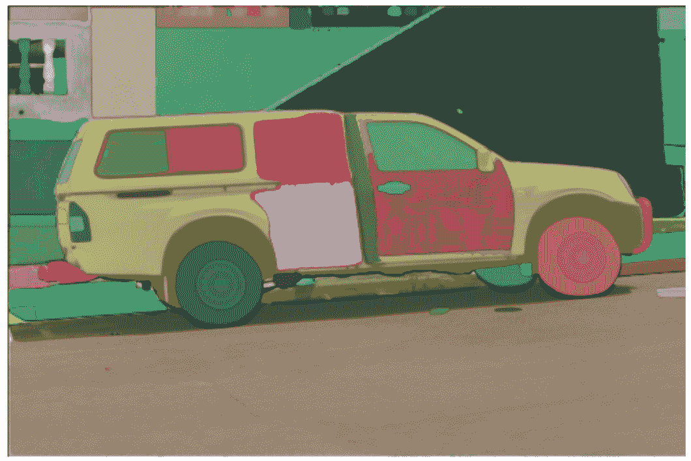

# SAM

> 原始文本：[`huggingface.co/docs/transformers/v4.37.2/en/model_doc/sam`](https://huggingface.co/docs/transformers/v4.37.2/en/model_doc/sam)

## 概述

SAM（Segment Anything Model）是由 Alexander Kirillov、Eric Mintun、Nikhila Ravi、Hanzi Mao、Chloe Rolland、Laura Gustafson、Tete Xiao、Spencer Whitehead、Alex Berg、Wan-Yen Lo、Piotr Dollar、Ross Girshick 在[Segment Anything](https://arxiv.org/pdf/2304.02643v1.pdf)中提出的。

该模型可用于预测给定输入图像的任何感兴趣对象的分割掩模。



论文摘要如下：

*我们介绍了 Segment Anything (SA)项目：一个用于图像分割的新任务、模型和数据集。在数据收集循环中使用我们高效的模型，我们构建了迄今为止最大的分割数据集（远远超过），包括超过 11M 张经过许可和尊重隐私的图像上的 10 亿个掩模。该模型被设计和训练为可提示，因此它可以零样本地转移到新的图像分布和任务。我们评估了它在许多任务上的能力，并发现它的零样本性能令人印象深刻——通常与之前的完全监督结果相竞争甚至更优。我们正在发布 Segment Anything Model (SAM)和相应的数据集（SA-1B），其中包含 10 亿个掩模和 1100 万张图像，网址为[`segment-anything.com`](https://segment-anything.com)，以促进计算机视觉基础模型的研究。*

提示：

+   该模型预测二进制掩模，指示给定图像中感兴趣对象的存在与否。

+   如果提供 2D 点和/或输入边界框，则模型会预测更好的结果。

+   您可以为同一图像提示多个点，并预测单个掩模。

+   目前不支持对模型进行微调

+   根据论文，文本输入也应该得到支持。然而，在撰写本文时，根据[官方存储库](https://github.com/facebookresearch/segment-anything/issues/4#issuecomment-1497626844)似乎不支持。

这个模型是由[ybelkada](https://huggingface.co/ybelkada)和[ArthurZ](https://huggingface.co/ArthurZ)贡献的。原始代码可以在[这里](https://github.com/facebookresearch/segment-anything)找到。

以下是如何在给定图像和 2D 点的情况下运行掩模生成的示例：

```py
import torch
from PIL import Image
import requests
from transformers import SamModel, SamProcessor

device = "cuda" if torch.cuda.is_available() else "cpu"
model = SamModel.from_pretrained("facebook/sam-vit-huge").to(device)
processor = SamProcessor.from_pretrained("facebook/sam-vit-huge")

img_url = "https://huggingface.co/ybelkada/segment-anything/resolve/main/assets/car.png"
raw_image = Image.open(requests.get(img_url, stream=True).raw).convert("RGB")
input_points = [[[450, 600]]]  # 2D location of a window in the image

inputs = processor(raw_image, input_points=input_points, return_tensors="pt").to(device)
with torch.no_grad():
    outputs = model(**inputs)

masks = processor.image_processor.post_process_masks(
    outputs.pred_masks.cpu(), inputs["original_sizes"].cpu(), inputs["reshaped_input_sizes"].cpu()
)
scores = outputs.iou_scores
```

您还可以在处理器中处理自己的掩模以及输入图像，以传递给模型。

```py
import torch
from PIL import Image
import requests
from transformers import SamModel, SamProcessor

device = "cuda" if torch.cuda.is_available() else "cpu"
model = SamModel.from_pretrained("facebook/sam-vit-huge").to(device)
processor = SamProcessor.from_pretrained("facebook/sam-vit-huge")

img_url = "https://huggingface.co/ybelkada/segment-anything/resolve/main/assets/car.png"
raw_image = Image.open(requests.get(img_url, stream=True).raw).convert("RGB")
mask_url = "https://huggingface.co/ybelkada/segment-anything/resolve/main/assets/car.png"
segmentation_map = Image.open(requests.get(mask_url, stream=True).raw).convert("RGB")
input_points = [[[450, 600]]]  # 2D location of a window in the image

inputs = processor(raw_image, input_points=input_points, segmentation_maps=mask, return_tensors="pt").to(device)
with torch.no_grad():
    outputs = model(**inputs)

masks = processor.image_processor.post_process_masks(
    outputs.pred_masks.cpu(), inputs["original_sizes"].cpu(), inputs["reshaped_input_sizes"].cpu()
)
scores = outputs.iou_scores
```

资源：

+   [演示笔记本](https://github.com/huggingface/notebooks/blob/main/examples/segment_anything.ipynb)用于使用模型。

+   [演示笔记本](https://github.com/huggingface/notebooks/blob/main/examples/automatic_mask_generation.ipynb)用于使用自动生成掩模管道。

+   [演示笔记本](https://github.com/NielsRogge/Transformers-Tutorials/blob/master/SAM/Run_inference_with_MedSAM_using_HuggingFace_Transformers.ipynb)用于在医学领域上对 SAM 进行微调的 MedSAM 进行推断。

+   [演示笔记本](https://github.com/NielsRogge/Transformers-Tutorials/blob/master/SAM/Fine_tune_SAM_(segment_anything)_on_a_custom_dataset.ipynb)用于在自定义数据上微调模型。

## SamConfig

### `class transformers.SamConfig`

[<来源>](https://github.com/huggingface/transformers/blob/v4.37.2/src/transformers/models/sam/configuration_sam.py#L237)

```py
( vision_config = None prompt_encoder_config = None mask_decoder_config = None initializer_range = 0.02 **kwargs )
```

参数

+   `vision_config`（Union[`dict`, `SamVisionConfig`]，*可选*）—用于初始化 SamVisionConfig 的配置选项字典。

+   `prompt_encoder_config`（Union[`dict`, `SamPromptEncoderConfig`]，*可选*）—用于初始化 SamPromptEncoderConfig 的配置选项字典。

+   `mask_decoder_config` (Union[`dict`, `SamMaskDecoderConfig`], *optional*) — 用于初始化 SamMaskDecoderConfig 的配置选项字典。

+   `kwargs` (*optional*) — 关键字参数的字典。

SamConfig 是用于存储 SamModel 配置的类。它用于根据指定的参数实例化 SAM 模型，定义视觉模型、提示编码器模型和掩码解码器配置。使用默认值实例化配置将产生类似于 SAM-ViT-H [facebook/sam-vit-huge](https://huggingface.co/facebook/sam-vit-huge) 架构的配置。

配置对象继承自 PretrainedConfig，可用于控制模型输出。阅读来自 PretrainedConfig 的文档以获取更多信息。

示例:

```py
>>> from transformers import (
...     SamVisionConfig,
...     SamPromptEncoderConfig,
...     SamMaskDecoderConfig,
...     SamModel,
... )

>>> # Initializing a SamConfig with `"facebook/sam-vit-huge"` style configuration
>>> configuration = SamConfig()

>>> # Initializing a SamModel (with random weights) from the `"facebook/sam-vit-huge"` style configuration
>>> model = SamModel(configuration)

>>> # Accessing the model configuration
>>> configuration = model.config

>>> # We can also initialize a SamConfig from a SamVisionConfig, SamPromptEncoderConfig, and SamMaskDecoderConfig

>>> # Initializing SAM vision, SAM Q-Former and language model configurations
>>> vision_config = SamVisionConfig()
>>> prompt_encoder_config = SamPromptEncoderConfig()
>>> mask_decoder_config = SamMaskDecoderConfig()

>>> config = SamConfig(vision_config, prompt_encoder_config, mask_decoder_config)
```

## SamVisionConfig

### `class transformers.SamVisionConfig`

[< source >](https://github.com/huggingface/transformers/blob/v4.37.2/src/transformers/models/sam/configuration_sam.py#L139)

```py
( hidden_size = 768 output_channels = 256 num_hidden_layers = 12 num_attention_heads = 12 num_channels = 3 image_size = 1024 patch_size = 16 hidden_act = 'gelu' layer_norm_eps = 1e-06 attention_dropout = 0.0 initializer_range = 1e-10 qkv_bias = True mlp_ratio = 4.0 use_abs_pos = True use_rel_pos = True window_size = 14 global_attn_indexes = [2, 5, 8, 11] num_pos_feats = 128 mlp_dim = None **kwargs )
```

参数

+   `hidden_size` (`int`, *optional*, 默认为 768) — 编码器层和池化层的维度。

+   `output_channels` (`int`, *optional*, 默认为 256) — Patch Encoder 中输出通道的维度。

+   `num_hidden_layers` (`int`, *optional*, 默认为 12) — Transformer 编码器中的隐藏层数量。

+   `num_attention_heads` (`int`, *optional*, 默认为 12) — Transformer 编码器中每个注意力层的注意力头数量。

+   `num_channels` (`int`, *optional*, 默认为 3) — 输入图像中的通道数。

+   `image_size` (`int`, *optional*, 默认为 1024) — 期望的分辨率。调整大小的输入图像的目标尺寸。

+   `patch_size` (`int`, *optional*, 默认为 16) — 从输入图像中提取的补丁的大小。

+   `hidden_act` (`str`, *optional*, 默认为`"gelu"`) — 非线性激活函数（函数或字符串）。

+   `layer_norm_eps` (`float`, *optional*, 默认为 1e-06) — 层归一化层使用的 epsilon。

+   `attention_dropout` (`float`, *optional*, 默认为 0.0) — 注意力概率的丢弃比率。

+   `initializer_range` (`float`, *optional*, 默认为 1e-10) — 用于初始化所有权重矩阵的截断正态初始化器的标准差。

+   `qkv_bias` (`bool`, *optional*, 默认为`True`) — 是否为查询、键、值投影添加偏置。

+   `mlp_ratio` (`float`, *optional*, 默认为 4.0) — mlp 隐藏维度与嵌入维度的比率。

+   `use_abs_pos` (`bool`, *optional*, 默认为`True`) — 是否使用绝对位置嵌入。

+   `use_rel_pos` (`bool`, *optional*, 默认为`True`) — 是否使用相对位置嵌入。

+   `window_size` (`int`, *optional*, 默认为 14) — 相对位置的窗口大小。

+   `global_attn_indexes` (`List[int]`, *optional*, 默认为`[2, 5, 8, 11]`) — 全局注意力层的索引。

+   `num_pos_feats` (`int`, *optional*, 默认为 128) — 位置嵌入的维度。

+   `mlp_dim` (`int`, *optional*) — Transformer 编码器中 MLP 层的维度。如果为 `None`，则默认为 `mlp_ratio * hidden_size`。

这是用于存储 `SamVisionModel` 配置的类。它用于根据指定的参数实例化 SAM 视觉编码器，定义模型架构。使用默认值实例化配置将产生类似于 SAM ViT-h [facebook/sam-vit-huge](https://huggingface.co/facebook/sam-vit-huge) 架构的配置。

配置对象继承自 PretrainedConfig，可用于控制模型输出。阅读 PretrainedConfig 的文档以获取更多信息。

## SamMaskDecoderConfig

### `class transformers.SamMaskDecoderConfig`

[<来源>](https://github.com/huggingface/transformers/blob/v4.37.2/src/transformers/models/sam/configuration_sam.py#L78)

```py
( hidden_size = 256 hidden_act = 'relu' mlp_dim = 2048 num_hidden_layers = 2 num_attention_heads = 8 attention_downsample_rate = 2 num_multimask_outputs = 3 iou_head_depth = 3 iou_head_hidden_dim = 256 layer_norm_eps = 1e-06 **kwargs )
```

参数

+   `hidden_size` (`int`, *可选*, 默认为 256) — 隐藏状态的维度。

+   `hidden_act` (`str`, *可选*, 默认为`"relu"`) — 在`SamMaskDecoder`模块内部使用的非线性激活函数。

+   `mlp_dim` (`int`, *可选*, 默认为 2048) — Transformer 编码器中“中间”（即前馈）层的维度。

+   `num_hidden_layers` (`int`, *可选*, 默认为 2) — Transformer 编码器中的隐藏层数。

+   `num_attention_heads` (`int`, *可选*, 默认为 8) — Transformer 编码器中每个注意力层的注意力头数。

+   `attention_downsample_rate` (`int`, *可选*, 默认为 2) — 注意力层的下采样率。

+   `num_multimask_outputs` (`int`, *可选*, 默认为 3) — `SamMaskDecoder`模块的输出数量。在“Segment Anything”论文中，此值设置为 3。

+   `iou_head_depth` (`int`, *可选*, 默认为 3) — IoU 头模块中的层数。

+   `iou_head_hidden_dim` (`int`, *可选*, 默认为 256) — IoU 头模块中隐藏状态的维度。

+   `layer_norm_eps` (`float`, *可选*, 默认为 1e-06) — 层归一化层使用的 epsilon。

这是用于存储`SamMaskDecoder`配置的配置类。它用于实例化一个 SAM 掩码解码器到指定的参数，定义模型架构。实例化配置默认将产生类似于 SAM-vit-h [facebook/sam-vit-huge](https://huggingface.co/facebook/sam-vit-huge)架构的配置。

配置对象继承自 PretrainedConfig，可用于控制模型输出。阅读 PretrainedConfig 的文档以获取更多信息。

## SamPromptEncoderConfig

### `class transformers.SamPromptEncoderConfig`

[<来源>](https://github.com/huggingface/transformers/blob/v4.37.2/src/transformers/models/sam/configuration_sam.py#L31)

```py
( hidden_size = 256 image_size = 1024 patch_size = 16 mask_input_channels = 16 num_point_embeddings = 4 hidden_act = 'gelu' layer_norm_eps = 1e-06 **kwargs )
```

参数

+   `hidden_size` (`int`, *可选*, 默认为 256) — 隐藏状态的维度。

+   `image_size` (`int`, *可选*, 默认为 1024) — 图像的预期输出分辨率。

+   `patch_size` (`int`, *可选*, 默认为 16) — 每个补丁的大小（分辨率）。

+   `mask_input_channels` (`int`, *可选*, 默认为 16) — 要馈送到`MaskDecoder`模块的通道数。

+   `num_point_embeddings` (`int`, *可选*, 默认为 4) — 要使用的点嵌入数量。

+   `hidden_act` (`str`, *可选*, 默认为`"gelu"`) — 编码器和池化器中的非线性激活函数。

这是用于存储`SamPromptEncoder`配置的配置类。`SamPromptEncoder`模块用于编码输入的 2D 点和边界框。实例化配置默认将产生类似于 SAM-vit-h [facebook/sam-vit-huge](https://huggingface.co/facebook/sam-vit-huge)架构的配置。

配置对象继承自 PretrainedConfig，可用于控制模型输出。阅读 PretrainedConfig 的文档以获取更多信息。

## SamProcessor

### `class transformers.SamProcessor`

[< source >](https://github.com/huggingface/transformers/blob/v4.37.2/src/transformers/models/sam/processing_sam.py#L35)

```py
( image_processor )
```

参数

+   `image_processor` (`SamImageProcessor`) — SamImageProcessor 的一个实例。图像处理器是一个必需的输入。

构造一个 SAM 处理器，将 SAM 图像处理器和 2D 点和边界框处理器包装成一个单一处理器。

SamProcessor 提供了 SamImageProcessor 的所有功能。有关更多信息，请参阅**call**()的文档字符串。

## SamImageProcessor

### `class transformers.SamImageProcessor`

[< source >](https://github.com/huggingface/transformers/blob/v4.37.2/src/transformers/models/sam/image_processing_sam.py#L64)

```py
( do_resize: bool = True size: Dict = None mask_size: Dict = None resample: Resampling = <Resampling.BILINEAR: 2> do_rescale: bool = True rescale_factor: Union = 0.00392156862745098 do_normalize: bool = True image_mean: Union = None image_std: Union = None do_pad: bool = True pad_size: int = None mask_pad_size: int = None do_convert_rgb: bool = True **kwargs )
```

参数

+   `do_resize` (`bool`, *可选*, 默认为 `True`) — 是否将图像的（高度，宽度）尺寸调整为指定的`size`。可以通过`preprocess`方法中的`do_resize`参数进行覆盖。

+   `size` (`dict`, *可选*, 默认为 `{"longest_edge" -- 1024}`): 调整大小后的输出图像大小。将图像的最长边调整为匹配`size["longest_edge"]`，同时保持纵横比。可以通过`preprocess`方法中的`size`参数进行覆盖。

+   `mask_size` (`dict`, *可选*, 默认为 `{"longest_edge" -- 256}`): 调整大小后的输出分割地图大小。将图像的最长边调整为匹配`size["longest_edge"]`，同时保持纵横比。可以通过`preprocess`方法中的`mask_size`参数进行覆盖。

+   `resample` (`PILImageResampling`, *可选*, 默认为 `Resampling.BILINEAR`) — 如果调整图像大小，则使用的重采样滤波器。可以通过`preprocess`方法中的`resample`参数进行覆盖。

+   `do_rescale` (`bool`, *可选*, 默认为 `True`) — 是否按指定比例`rescale_factor`重新缩放图像。可以通过`preprocess`方法中的`do_rescale`参数进行覆盖。

+   `rescale_factor` (`int` 或 `float`, *可选*, 默认为 `1/255`) — 如果重新缩放图像，则使用的比例因子。仅在`do_rescale`设置为`True`时有效。可以通过`preprocess`方法中的`rescale_factor`参数进行覆盖。

+   `do_normalize` (`bool`, *可选*, 默认为 `True`) — 是否对图像进行归一化。可以通过`preprocess`方法中的`do_normalize`参数进行覆盖。可以通过`preprocess`方法中的`do_normalize`参数进行覆盖。

+   `image_mean` (`float` 或 `List[float]`, *可选*, 默认为 `IMAGENET_DEFAULT_MEAN`) — 如果对图像进行归一化，则使用的均值。这是一个浮点数或与图像中通道数相同长度的浮点数列表。可以通过`preprocess`方法中的`image_mean`参数进行覆盖。可以通过`preprocess`方法中的`image_mean`参数进行覆盖。

+   `image_std` (`float` 或 `List[float]`, *可选*, 默认为 `IMAGENET_DEFAULT_STD`) — 如果对图像进行归一化，则使用的标准差。这是一个浮点数或与图像中通道数相同长度的浮点数列表。可以通过`preprocess`方法中的`image_std`参数进行覆盖。可以通过`preprocess`方法中的`image_std`参数进行覆盖。

+   `do_pad` (`bool`, *optional*, 默认为 `True`) — 是否对图像进行填充到指定的 `pad_size`。可以被 `preprocess` 方法中的 `do_pad` 参数覆盖。

+   `pad_size` (`dict`, *optional*, 默认为 `{"height" -- 1024, "width": 1024}`): 填充后的输出图像大小。可以被 `preprocess` 方法中的 `pad_size` 参数覆盖。

+   `mask_pad_size` (`dict`, *optional*, 默认为 `{"height" -- 256, "width": 256}`): 填充后的输出分割地图大小。可以被 `preprocess` 方法中的 `mask_pad_size` 参数覆盖。

+   `do_convert_rgb` (`bool`, *optional*, 默认为 `True`) — 是否将图像转换为 RGB。

构建一个 SAM 图像处理器。

#### `filter_masks`

[< source >](https://github.com/huggingface/transformers/blob/v4.37.2/src/transformers/models/sam/image_processing_sam.py#L805)

```py
( masks iou_scores original_size cropped_box_image pred_iou_thresh = 0.88 stability_score_thresh = 0.95 mask_threshold = 0 stability_score_offset = 1 return_tensors = 'pt' )
```

参数

+   `masks` (`Union[torch.Tensor, tf.Tensor]`) — 输入掩码。

+   `iou_scores` (`Union[torch.Tensor, tf.Tensor]`) — IoU 分数列表。

+   `original_size` (`Tuple[int,int]`) — 原始图像的大小。

+   `cropped_box_image` (`np.array`) — 裁剪后的图像。

+   `pred_iou_thresh` (`float`, *optional*, 默认为 0.88) — iou 分数的阈值。

+   `stability_score_thresh` (`float`, *optional*, 默认为 0.95) — 稳定性分数的阈值。

+   `mask_threshold` (`float`, *optional*, 默认为 0) — 预测掩码的阈值。

+   `stability_score_offset` (`float`, *optional*, 默认为 1) — 在 `_compute_stability_score` 方法中使用的稳定性分数的偏移量。

+   `return_tensors` (`str`, *optional*, 默认为 `pt`) — 如果为 `pt`，返回 `torch.Tensor`。如果为 `tf`，返回 `tf.Tensor`。

通过选择满足几个标准的预测掩码来过滤预测掩码。第一个标准是 iou 分数需要大于 `pred_iou_thresh`。第二个标准是稳定性分数需要大于 `stability_score_thresh`。该方法还将预测掩码转换为边界框，并在必要时填充预测掩码。

#### `generate_crop_boxes`

[< source >](https://github.com/huggingface/transformers/blob/v4.37.2/src/transformers/models/sam/image_processing_sam.py#L740)

```py
( image target_size crop_n_layers: int = 0 overlap_ratio: float = 0.3413333333333333 points_per_crop: Optional = 32 crop_n_points_downscale_factor: Optional = 1 device: Optional = None input_data_format: Union = None return_tensors: str = 'pt' )
```

参数

+   `image` (`np.array`) — 输入原始图像

+   `target_size` (`int`) — 调整大小后的图像目标尺寸

+   `crop_n_layers` (`int`, *optional*, 默认为 0) — 如果 >0，将再次在图像的裁剪上运行掩码预测。设置要运行的层数，其中每一层有 2**i_layer 个图像裁剪。

+   `overlap_ratio` (`float`, *optional*, 默认为 512/1500) — 设置裁剪重叠的程度。在第一层裁剪中，裁剪将以图像长度的这一部分重叠。后续层中，具有更多裁剪的层会缩小这种重叠。

+   `points_per_crop` (`int`, *optional*, 默认为 32) — 每个裁剪中要采样的点数。

+   `crop_n_points_downscale_factor` (`List[int]`, *optional*, 默认为 1) — 第 n 层采样的每边点数按 crop_n_points_downscale_factor**n 缩小。

+   `device` (`torch.device`, *optional*, 默认为 None) — 用于计算的设备。如果为 None，则使用 cpu。

+   `input_data_format` (`str` 或 `ChannelDimension`, *optional*) — 输入图像的通道维度格式。如果未提供，将被推断。

+   `return_tensors` (`str`, *optional*, 默认为 `pt`) — 如果为 `pt`，返回 `torch.Tensor`。如果为 `tf`，返回 `tf.Tensor`。

生成不同尺寸的裁剪框列表。每一层有 (2**i)**2 个框。

#### `pad_image`

[< source >](https://github.com/huggingface/transformers/blob/v4.37.2/src/transformers/models/sam/image_processing_sam.py#L163)

```py
( image: ndarray pad_size: Dict data_format: Union = None input_data_format: Union = None **kwargs )
```

参数

+   `image` (`np.ndarray`) — 需要填充的图像。

+   `pad_size` (`Dict[str, int]`) — 填充后的输出图像大小。

+   `data_format` (`str` 或 `ChannelDimension`, *optional*) — 图像的数据格式。可以是 “channels_first” 或 “channels_last”。如果为 `None`，将使用 `image` 的 `data_format`。

+   `input_data_format` (`str` 或 `ChannelDimension`, *optional*) — 输入图像的通道维度格式。如果未提供，将被推断。

用零填充图像至 `(pad_size["height"], pad_size["width"])`，填充到右侧和底部。

#### `post_process_for_mask_generation`

[<来源>](https://github.com/huggingface/transformers/blob/v4.37.2/src/transformers/models/sam/image_processing_sam.py#L717)

```py
( all_masks all_scores all_boxes crops_nms_thresh return_tensors = 'pt' )
```

参数

+   `all_masks` (`Union[List[torch.Tensor], List[tf.Tensor]]`) — 所有预测的分割掩码列表

+   `all_scores` (`Union[List[torch.Tensor], List[tf.Tensor]]`) — 所有预测的 iou 分数列表

+   `all_boxes` (`Union[List[torch.Tensor], List[tf.Tensor]]`) — 所有预测掩码的边界框列表

+   `crops_nms_thresh` (`float`) — NMS（非最大抑制）算法的阈值。

+   `return_tensors` (`str`, *optional*, 默认为 `pt`) — 如果为 `pt`，返回 `torch.Tensor`。如果为 `tf`，返回 `tf.Tensor`。

对通过调用预测掩码上的非最大抑制算法生成的掩码进行后处理。

#### `post_process_masks`

[<来源>](https://github.com/huggingface/transformers/blob/v4.37.2/src/transformers/models/sam/image_processing_sam.py#L573)

```py
( masks original_sizes reshaped_input_sizes mask_threshold = 0.0 binarize = True pad_size = None return_tensors = 'pt' ) → export const metadata = 'undefined';(Union[torch.Tensor, tf.Tensor])
```

参数

+   `masks` (`Union[List[torch.Tensor], List[np.ndarray], List[tf.Tensor]]`) — 来自 mask_decoder 的批量掩码，格式为 (batch_size, num_channels, height, width)。

+   `original_sizes` (`Union[torch.Tensor, tf.Tensor, List[Tuple[int,int]]]`) — 每个图像在调整大小为模型期望的输入形状之前的原始尺寸，格式为 (height, width)。

+   `reshaped_input_sizes` (`Union[torch.Tensor, tf.Tensor, List[Tuple[int,int]]]`) — 每个图像作为输入模型时的大小，格式为 (height, width)。用于去除填充。

+   `mask_threshold` (`float`, *optional*, 默认为 0.0) — 用于对掩码进行二值化的阈值。

+   `binarize` (`bool`, *optional*, 默认为 `True`) — 是否对掩码进行二值化。

+   `pad_size` (`int`, *optional*, 默认为 `self.pad_size`) — 图像传递给模型之前填充到的目标大小。如果为 None，则假定目标大小为处理器的 `pad_size`。

+   `return_tensors` (`str`, *optional*, 默认为 `"pt"`) — 如果为 `"pt"`，返回 PyTorch 张量。如果为 `"tf"`，返回 TensorFlow 张量。

返回

(`Union[torch.Tensor, tf.Tensor]`)

批量掩码，格式为 (batch_size, num_channels, height, width)，其中 (height, width) 由 original_size 给出。

去除填充并将掩码放大到原始图像大小。

#### `preprocess`

[<来源>](https://github.com/huggingface/transformers/blob/v4.37.2/src/transformers/models/sam/image_processing_sam.py#L389)

```py
( images: Union segmentation_maps: Union = None do_resize: Optional = None size: Optional = None mask_size: Optional = None resample: Optional = None do_rescale: Optional = None rescale_factor: Union = None do_normalize: Optional = None image_mean: Union = None image_std: Union = None do_pad: Optional = None pad_size: Optional = None mask_pad_size: Optional = None do_convert_rgb: Optional = None return_tensors: Union = None data_format: ChannelDimension = <ChannelDimension.FIRST: 'channels_first'> input_data_format: Union = None **kwargs )
```

参数

+   `images` (`ImageInput`) — 要预处理的图像。期望单个图像或批量图像，像素值范围为 0 到 255。如果传入像素值在 0 到 1 之间的图像，请设置 `do_rescale=False`。

+   `segmentation_maps` (`ImageInput`, *optional*) — 要预处理的分割地图。

+   `do_resize` (`bool`, *optional*, 默认为 `self.do_resize`) — 是否调整图像大小。

+   `size` (`Dict[str, int]`, *optional*, 默认为 `self.size`) — 控制 `resize` 后图像的大小。图像的最长边被调整为 `size["longest_edge"]`，同时保持纵横比。

+   `mask_size` (`Dict[str, int]`, *optional*, 默认为 `self.mask_size`) — 控制 `resize` 后分割地图的大小。图像的最长边被调整为 `size["longest_edge"]`，同时保持纵横比。

+   `resample` (`PILImageResampling`, *optional*, 默认为 `self.resample`) — 调整图像大小时要使用的 `PILImageResampling` 过滤器，例如 `PILImageResampling.BILINEAR`。

+   `do_rescale` (`bool`, *optional*, 默认为 `self.do_rescale`) — 是否通过缩放因子重新缩放图像像素值。

+   `rescale_factor` (`int` or `float`, *optional*, defaults to `self.rescale_factor`) — 应用于图像像素值的重新缩放因子。

+   `do_normalize` (`bool`, *optional*, defaults to `self.do_normalize`) — 是否对图像进行归一化。

+   `image_mean` (`float` or `List[float]`, *optional*, defaults to `self.image_mean`) — 如果`do_normalize`设置为`True`，则用于归一化图像的图像均值。

+   `image_std` (`float` or `List[float]`, *optional*, defaults to `self.image_std`) — 如果`do_normalize`设置为`True`，则用于归一化图像的图像标准差。

+   `do_pad` (`bool`, *optional*, defaults to `self.do_pad`) — 是否对图像进行填充。

+   `pad_size` (`Dict[str, int]`, *optional*, defaults to `self.pad_size`) — 控制应用于图像的填充大小。如果设置`do_pad`为`True`，则图像将填充到`pad_size["height"]`和`pad_size["width"]`。

+   `mask_pad_size` (`Dict[str, int]`, *optional*, defaults to `self.mask_pad_size`) — 控制应用于分割地图的填充大小。如果设置`do_pad`为`True`，则图像将填充到`mask_pad_size["height"]`和`mask_pad_size["width"]`。

+   `do_convert_rgb` (`bool`, *optional*, defaults to `self.do_convert_rgb`) — 是否将图像转换为 RGB。

+   `return_tensors` (`str` or `TensorType`, *optional*) — 要返回的张量类型。可以是以下之一：

    +   未设置：返回一个`np.ndarray`列表。

    +   `TensorType.TENSORFLOW` 或 `'tf'`：返回类型为`tf.Tensor`的批次。

    +   `TensorType.PYTORCH` 或 `'pt'`：返回类型为`torch.Tensor`的批次。

    +   `TensorType.NUMPY` 或 `'np'`：返回类型为`np.ndarray`的批次。

    +   `TensorType.JAX` 或 `'jax'`：返回类型为`jax.numpy.ndarray`的批次。

+   `data_format` (`ChannelDimension` or `str`, *optional*, defaults to `ChannelDimension.FIRST`) — 输出图像的通道维度格式。可以是以下之一：

    +   `"channels_first"` 或 `ChannelDimension.FIRST`：图像以(num_channels, height, width)格式。

    +   `"channels_last"` 或 `ChannelDimension.LAST`：图像以(height, width, num_channels)格式。

    +   未设置：使用输入图像的通道维度格式。

+   `input_data_format` (`ChannelDimension` or `str`, *optional*) — 输入图像的通道维度格式。如果未设置，则从输入图像推断通道维度格式。可以是以下之一：

    +   `"channels_first"` 或 `ChannelDimension.FIRST`：图像以(num_channels, height, width)格式。

    +   `"channels_last"` 或 `ChannelDimension.LAST`：图像以(height, width, num_channels)格式。

    +   `"none"` 或 `ChannelDimension.NONE`：图像以(height, width)格式。

预处理图像或图像批次。

#### `resize`

[< source >](https://github.com/huggingface/transformers/blob/v4.37.2/src/transformers/models/sam/image_processing_sam.py#L211)

```py
( image: ndarray size: Dict resample: Resampling = <Resampling.BICUBIC: 3> data_format: Union = None input_data_format: Union = None **kwargs ) → export const metadata = 'undefined';np.ndarray
```

参数

+   `image` (`np.ndarray`) — 要调整大小的图像。

+   `size` (`Dict[str, int]`) — 以`{"longest_edge": int}`格式指定输出图像的大小的字典。图像的最长边将被调整为指定的大小，而另一边将被调整以保持纵横比。resample — 调整图像大小时要使用的`PILImageResampling`滤波器，例如`PILImageResampling.BILINEAR`。

+   `data_format` (`ChannelDimension` or `str`, *optional*) — 输出图像的通道维度格式。如果未设置，则使用输入图像的通道维度格式。可以是以下之一：

    +   `"channels_first"` 或 `ChannelDimension.FIRST`：图像以(num_channels, height, width)格式。

    +   `"channels_last"` 或 `ChannelDimension.LAST`：图像以(height, width, num_channels)格式。

+   `input_data_format` (`ChannelDimension` or `str`, *optional*) — 输入图像的通道维度格式。如果未设置，则从输入图像推断通道维度格式。可以是以下之一：

    +   `"channels_first"` 或 `ChannelDimension.FIRST`：图像以(num_channels, height, width)格式。

    +   `"channels_last"` 或 `ChannelDimension.LAST`：图像以(height, width, num_channels)格式。

返回

`np.ndarray`

调整大小后的图像。

将图像调整大小为`(size["height"], size["width"])`。

## SamModel

### `class transformers.SamModel`

[<来源>](https://github.com/huggingface/transformers/blob/v4.37.2/src/transformers/models/sam/modeling_sam.py#L1180)

```py
( config )
```

参数

+   `config` (SamConfig) — 包含模型所有参数的模型配置类。使用配置文件初始化不会加载与模型关联的权重，只加载配置。查看 from_pretrained()方法以加载模型权重。

用于生成分割掩模的 Segment Anything Model (SAM)，给定输入图像和可选的 2D 位置和边界框。该模型继承自 PreTrainedModel。查看超类文档以了解库为所有模型实现的通用方法（如下载或保存、调整输入嵌入、修剪头等）。

该模型也是 PyTorch [torch.nn.Module](https://pytorch.org/docs/stable/nn.html#torch.nn.Module)子类。将其用作常规 PyTorch 模块，并参考 PyTorch 文档以获取有关一般用法和行为的所有相关信息。

`forward`

[<来源>](https://github.com/huggingface/transformers/blob/v4.37.2/src/transformers/models/sam/modeling_sam.py#L1278)

```py
( pixel_values: Optional = None input_points: Optional = None input_labels: Optional = None input_boxes: Optional = None input_masks: Optional = None image_embeddings: Optional = None multimask_output: bool = True attention_similarity: Optional = None target_embedding: Optional = None output_attentions: Optional = None output_hidden_states: Optional = None return_dict: Optional = None **kwargs )
```

参数

+   `pixel_values` (`torch.FloatTensor`，形状为`(batch_size, num_channels, height, width)`) — 像素值。像素值可以使用 SamProcessor 获得。查看`SamProcessor.__call__()`以获取详细信息。

+   `input_points` (`torch.FloatTensor`，形状为`(batch_size, num_points, 2)`) — 输入 2D 空间点，这由提示编码器用于编码提示。通常会产生更好的结果。点可以通过将列表的列表的列表传递给处理器来获得，处理器将创建相应的维度为 4 的`torch`张量。第一维是图像批处理大小，第二维是点批处理大小（即模型要预测每个输入点的分割掩模数量），第三维是每个分割掩模的点数（可以为单个掩模传递多个点），最后一维是点的 x（垂直）和 y（水平）坐标。如果为每个图像或每个掩模传递了不同数量的点，则处理器将创建“PAD”点，这些点将对应于（0, 0）坐标，并且将跳过这些点的嵌入计算使用标签。

+   `input_labels` (`torch.LongTensor`，形状为`(batch_size, point_batch_size, num_points)`) — 点的输入标签，这由提示编码器用于编码提示。根据官方实现，有 3 种类型的标签

    +   `1`: 该点是包含感兴趣对象的点

    +   `0`: 该点是不包含感兴趣对象的点

    +   `-1`: 该点对应于背景

    我们添加了标签：

    +   `-10`: 该点是填充点，因此应该被提示编码器忽略

    填充标签应该由处理器自动完成。

+   `input_boxes` (`torch.FloatTensor`，形状为`(batch_size, num_boxes, 4)`) — 用于点的输入框，这由提示编码器用于编码提示。通常会产生更好的生成掩模。框可以通过将列表的列表的列表传递给处理器来获得，处理器将生成一个`torch`张量，每个维度分别对应于图像批处理大小、每个图像的框数和框的左上角和右下角点的坐标。按顺序为(`x1`, `y1`, `x2`, `y2`)：

    +   `x1`: 输入框左上角点的 x 坐标

    +   `y1`: 输入框左上角点的 y 坐标

    +   `x2`：输入框右下角点的 x 坐标

    +   `y2`：输入框右下角点的 y 坐标

+   `input_masks` (`torch.FloatTensor`，形状为`(batch_size, image_size, image_size)`) - SAM 模型还接受分割掩码作为输入。掩码将由提示编码器嵌入以生成相应的嵌入，稍后将其馈送到掩码解码器。这些掩码需要用户手动馈送，并且它们的形状必须是(`batch_size`, `image_size`, `image_size`)。

+   `image_embeddings` (`torch.FloatTensor`，形状为`(batch_size, output_channels, window_size, window_size)`) - 图像嵌入，这由掩码解码器用于生成掩码和 iou 分数。为了更高效地计算内存，用户可以首先使用`get_image_embeddings`方法检索图像嵌入，然后将其馈送到`forward`方法，而不是将`pixel_values`馈送到其中。

+   `multimask_output` (`bool`, *可选*) - 在原始实现和论文中，模型总是对每个图像（或每个点/每个边界框，如果相关）输出 3 个掩码。但是，可以通过指定`multimask_output=False`来仅输出一个单独的掩码，该掩码对应于“最佳”掩码。

+   `attention_similarity` (`torch.FloatTensor`，*可选*) - 注意力相似性张量，用于在模型用于个性化时为掩码解码器提供目标引导的注意力，如[PerSAM](https://arxiv.org/abs/2305.03048)中介绍的。

+   `target_embedding` (`torch.FloatTensor`，*可选*) - 目标概念的嵌入，用于在模型用于个性化时为掩码解码器提供目标语义提示，如[PerSAM](https://arxiv.org/abs/2305.03048)中介绍的。

+   `output_attentions` (`bool`, *可选*) - 是否返回所有注意力层的注意力张量。有关更多详细信息，请参阅返回张量下的`attentions`。

+   `output_hidden_states` (`bool`, *可选*) - 是否返回所有层的隐藏状态。有关更多详细信息，请参阅返回张量下的`hidden_states`。

+   `return_dict` (`bool`, *可选*) - 是否返回 ModelOutput 而不是普通元组。

    示例 -

SamModel 的前向方法，覆盖了`__call__`特殊方法。

虽然前向传递的步骤需要在这个函数中定义，但应该在此之后调用`Module`实例，而不是这个，因为前者负责运行前处理和后处理步骤，而后者会默默地忽略它们。

## TFSamModel

### `class transformers.TFSamModel`

[<来源>](https://github.com/huggingface/transformers/blob/v4.37.2/src/transformers/models/sam/modeling_tf_sam.py#L1410)

```py
( config **kwargs )
```

参数

+   `config` (SamConfig) - 包含模型所有参数的模型配置类。使用配置文件初始化不会加载与模型相关的权重，只会加载配置。查看 from_pretrained()方法以加载模型权重。

用于生成分割掩码的 Segment Anything Model (SAM)，给定输入图像和可选的 2D 位置和边界框。该模型继承自 TFPreTrainedModel。查看超类文档以获取库为所有模型实现的通用方法（如下载或保存、调整输入嵌入、修剪头等）。

这个模型也是一个 TensorFlow [tf.keras.Model](https://www.tensorflow.org/api_docs/python/tf/keras/Model)子类。将其用作常规的 TensorFlow 模型，并参考 TensorFlow 文档以获取与一般用法和行为相关的所有事项。

#### `call`

[<来源>](https://github.com/huggingface/transformers/blob/v4.37.2/src/transformers/models/sam/modeling_tf_sam.py#L1505)

```py
( pixel_values: TFModelInputType | None = None input_points: tf.Tensor | None = None input_labels: tf.Tensor | None = None input_boxes: tf.Tensor | None = None input_masks: tf.Tensor | None = None image_embeddings: tf.Tensor | None = None multimask_output: bool = True output_attentions: bool | None = None output_hidden_states: bool | None = None return_dict: bool | None = None training: bool = False **kwargs )
```

参数

+   `pixel_values` (`tf.Tensor`，形状为`(batch_size, num_channels, height, width)`) — 像素值。可以使用 SamProcessor 获取像素值。有关详细信息，请参阅`SamProcessor.__call__()`。

+   `input_points` (`tf.Tensor`，形状为`(batch_size, num_points, 2)`) — 输入的 2D 空间点，这由提示编码器用于编码提示。通常会产生更好的结果。可以通过将列表的列表的列表传递给处理器来获取这些点，处理器将创建相应的维度为 4 的`tf`张量。第一维是图像批处理大小，第二维是点批处理大小（即模型要预测每个输入点的分割掩模数量），第三维是每个分割掩模的点数（可以为单个掩模传递多个点），最后一维是点的 x（垂直）和 y（水平）坐标。如果为每个图像或每个掩模传递了不同数量的点，则处理器将创建对应的“PAD”点，这些点将对应于（0, 0）坐标，并且将跳过这些点的嵌入计算使用标签。

+   `input_labels` (`tf.Tensor`，形状为`(batch_size, point_batch_size, num_points)`) — 点的输入标签，这由提示编码器用于编码提示。根据官方实现，有 3 种类型的标签

    +   `1`：该点是包含感兴趣对象的点

    +   `0`：该点是不包含感兴趣对象的点

    +   `-1`：该点对应于背景

    我们添加了标签：

    +   `-10`：该点是填充点，因此应该被提示编码器忽略。

    填充标签应由处理器自动完成。

+   `input_boxes` (`tf.Tensor`，形状为`(batch_size, num_boxes, 4)`) — 点的输入框，这由提示编码器用于编码提示。通常会产生更好的生成掩模。可以通过将列表的列表的列表传递给处理器来获取这些框，处理器将生成一个`tf`张量，每个维度分别对应于图像批处理大小、每个图像的框数以及框的左上角和右下角点的坐标。顺序为（`x1`、`y1`、`x2`、`y2`）：

    +   `x1`：输入框左上角点的 x 坐标

    +   `y1`：输入框左上角点的 y 坐标

    +   `x2`：输入框右下角点的 x 坐标

    +   `y2`：输入框右下角点的 y 坐标

+   `input_masks` (`tf.Tensor`，形状为`(batch_size, image_size, image_size)`) — SAM 模型还接受分割掩模作为输入。掩模将由提示编码器嵌入以生成相应的嵌入，稍后将馈送给掩模解码器。这些掩模需要用户手动提供，并且它们的形状应为(`batch_size`, `image_size`, `image_size`)。

+   `image_embeddings` (`tf.Tensor`，形状为`(batch_size, output_channels, window_size, window_size)`) — 图像嵌入，这由掩模解码器用于生成掩模和 iou 分数。为了更高效地计算内存，用户可以首先使用`get_image_embeddings`方法检索图像嵌入，然后将其馈送给`call`方法，而不是馈送`pixel_values`。

+   `multimask_output` (`bool`, *optional*) — 在原始实现和论文中，模型始终为每个图像（或每个点/每个边界框，如果相关）输出 3 个掩模。但是，可以通过指定`multimask_output=False`来仅输出一个掩模，该掩模对应于“最佳”掩模。

+   `output_attentions` (`bool`, *optional*) — 是否返回所有注意力层的注意力张量。有关更多详细信息，请参阅返回张量中的`attentions`。

+   `output_hidden_states`（`bool`，*可选*）— 是否返回所有层的隐藏状态。有关更多详细信息，请参见返回张量下的`hidden_states`。

+   `return_dict`（`bool`，*可选*）— 是否返回 ModelOutput 而不是普通元组。

TFSamModel 的前向方法，覆盖了`__call__`特殊方法。

尽管前向传递的配方需要在此函数内定义，但应该在此之后调用`Module`实例，而不是这个，因为前者负责运行预处理和后处理步骤，而后者则默默地忽略它们。
