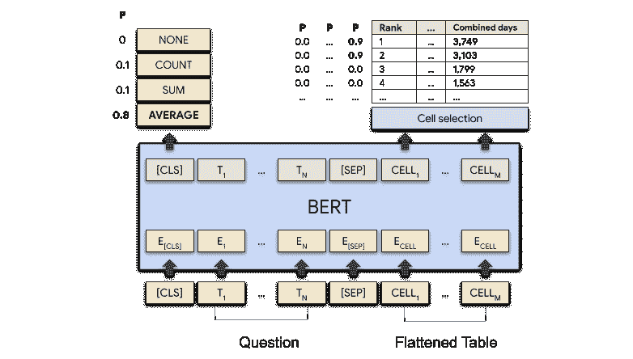

# TAPAS

> 原文链接：[`huggingface.co/docs/transformers/v4.37.2/en/model_doc/tapas`](https://huggingface.co/docs/transformers/v4.37.2/en/model_doc/tapas)

## 概述

TAPAS 模型是由 Jonathan Herzig、Paweł Krzysztof Nowak、Thomas Müller、Francesco Piccinno 和 Julian Martin Eisenschlos 在[通过预训练实现弱监督表格解析的 TAPAS](https://www.aclweb.org/anthology/2020.acl-main.398)中提出的。这是一种基于 BERT 的模型，专门设计（和预训练）用于回答关于表格数据的问题。与 BERT 相比，TAPAS 使用相对位置嵌入，并具有 7 种编码表格结构的标记类型。TAPAS 在大型数据集上进行了掩码语言建模（MLM）目标的预训练，该数据集包含来自英文维基百科和相应文本的数百万个表格。

对于问题回答，TAPAS 在顶部有 2 个头：一个单元选择头和一个聚合头，用于（可选地）在选定的单元之间执行聚合（例如计数或求和）。TAPAS 已在多个数据集上进行了微调：

+   [SQA](https://www.microsoft.com/en-us/download/details.aspx?id=54253)（由微软提供的顺序问答）

+   [WTQ](https://github.com/ppasupat/WikiTableQuestions)（由斯坦福大学提供的维基表问题）

+   [WikiSQL](https://github.com/salesforce/WikiSQL)（由 Salesforce 提供）

它在 SQA 和 WTQ 上取得了最新的成果，同时在 WikiSQL 上的表现与 SOTA 相当，但结构更简单。

该论文的摘要如下：

*对表格进行自然语言问题回答通常被视为语义解析任务。为了减轻完整逻辑形式的收集成本，一种流行的方法是专注于弱监督，包括指示而不是逻辑形式。然而，从弱监督训练语义解析器存在困难，并且生成的逻辑形式仅用作检索指示之前的中间步骤。在本文中，我们提出了 TAPAS，一种在表格上回答问题而无需生成逻辑形式的方法。TAPAS 从弱监督中训练，并通过选择表格单元并可选地应用相应的聚合运算符来预测指示。TAPAS 扩展了 BERT 的架构以对表格进行编码，从维基百科爬取的文本段和表格的有效联合预训练进行初始化，并进行端到端训练。我们在三个不同的语义解析数据集上进行实验，发现 TAPAS 在 SQA 上的最新准确率从 55.1 提高到 67.2，与 WIKISQL 和 WIKITQ 上的最新技术相媲美，但模型结构更简单。我们还发现，在我们的设置中，从 WIKISQL 到 WIKITQ 的转移学习，可以获得 48.7 的准确率，比最新技术高出 4.2 个百分点。*

此外，作者进一步对 TAPAS 进行了预训练，以识别**表格蕴涵**，通过创建一个平衡的数据集，其中包含数百万个自动创建的训练示例，这些示例在微调之前的中间步骤中学习。TAPAS 的作者将这种进一步的预训练称为中间预训练（因为 TAPAS 首先在 MLM 上进行预训练，然后在另一个数据集上进行预训练）。他们发现中间预训练进一步提高了在 SQA 上的性能，实现了新的最新技术，以及在[TabFact](https://github.com/wenhuchen/Table-Fact-Checking)上的最新技术，这是一个包含 16k 维基百科表格的大规模数据集，用于表格蕴涵（二元分类任务）。有关更多详细信息，请参阅他们的后续论文：[通过中间预训练理解表格](https://www.aclweb.org/anthology/2020.findings-emnlp.27/)，作者为 Julian Martin Eisenschlos、Syrine Krichene 和 Thomas Müller。

 TAPAS 架构。摘自[原始博客文章](https://ai.googleblog.com/2020/04/using-neural-networks-to-find-answers.html)。

这个模型是由[nielsr](https://huggingface.co/nielsr)贡献的。这个模型的 Tensorflow 版本是由[kamalkraj](https://huggingface.co/kamalkraj)贡献的。原始代码可以在[这里](https://github.com/google-research/tapas)找到。

## 使用提示

+   TAPAS 默认使用相对位置嵌入（在表格的每个单元格重新启动位置嵌入）。请注意，这是在原始 TAPAS 论文发表后添加的内容。根据作者的说法，这通常会导致略微更好的性能，并且允许您在不耗尽嵌入的情况下编码更长的序列。这反映在 TapasConfig 的`reset_position_index_per_cell`参数中，默认设置为`True`。[hub](https://huggingface.co/models?search=tapas)上提供的默认版本的模型都使用相对位置嵌入。您仍然可以通过在调用`from_pretrained()`方法时传入额外参数`revision="no_reset"`来使用绝对位置嵌入的模型。通常建议在右侧而不是左侧填充输入。

+   TAPAS 基于 BERT，因此例如`TAPAS-base`对应于`BERT-base`架构。当然，`TAPAS-large`将获得最佳性能（论文中报告的结果来自`TAPAS-large`）。各种大小模型的结果显示在[原始 GitHub 存储库](https://github.com/google-research/tapas)上。

+   TAPAS 有在 SQA 上微调的检查点，能够回答与表格相关的问题，这意味着您可以提出后续问题，比如“他多大了？”与之前的问题相关。请注意，在对话设置中，TAPAS 的前向传递有点不同：在这种情况下，您必须逐个向模型提供每个表格-问题对，以便`prev_labels`令牌类型 id 可以被模型的预测`labels`覆盖到前一个问题。查看“用法”部分获取更多信息。

+   TAPAS 类似于 BERT，因此依赖于掩码语言建模（MLM）目标。因此，它在预测掩码标记和 NLU 方面效率很高，但不适用于文本生成。使用因果语言建模（CLM）目标训练的模型在这方面更好。请注意，TAPAS 可以作为 EncoderDecoderModel 框架中的编码器使用，将其与自回归文本解码器（如 GPT-2）结合使用。

## 用法：微调

这里我们解释了如何在自己的数据集上微调 TapasForQuestionAnswering。

**步骤 1：选择三种使用 TAPAS 的方式之一 - 或者进行实验**

基本上，有三种不同的方式可以微调 TapasForQuestionAnswering，对应于 TAPAS 进行微调的不同数据集：

1.  SQA：如果您对在对话设置中与表相关的后续问题感兴趣。例如，如果您首先问“第一个演员的名字是什么？”然后您可以问一个后续问题，比如“他多大了？”。在这里，问题不涉及任何聚合（所有问题都是单元格选择问题）。

1.  WTQ：如果您对在对话设置中提问不感兴趣，而只是提问与表相关的问题，可能涉及聚合，比如计算行数、求和单元格值或平均单元格值。然后，例如您可以问“Cristiano Ronaldo 在他的职业生涯中进球总数是多少？”。这种情况也被称为**弱监督**，因为模型本身必须仅根据问题的答案学习适当的聚合操作符（SUM/COUNT/AVERAGE/NONE）。

1.  WikiSQL-supervised: 这个数据集基于 WikiSQL，模型在训练过程中会得到真实的聚合操作符。这也被称为**强监督**。在这里，学习适当的聚合操作符要容易得多。

总结一下：

| **任务** | **示例数据集** | **描述** |
| --- | --- | --- |
| 对话 | SQA | 仅单元选择问题的对话 |
| 聚合的弱监督 | WTQ | 问题可能涉及聚合，模型必须仅根据答案作为监督来学习这一点 |
| 聚合的强监督 | WikiSQL-supervised | 问题可能涉及聚合，模型必须学习这一点，给出黄金聚合操作符 |

Pytorch 隐藏 Pytorch 内容

使用预训练基础模型和从 hub 随机初始化分类头初始化模型可以按照下面所示进行。

```py
>>> from transformers import TapasConfig, TapasForQuestionAnswering

>>> # for example, the base sized model with default SQA configuration
>>> model = TapasForQuestionAnswering.from_pretrained("google/tapas-base")

>>> # or, the base sized model with WTQ configuration
>>> config = TapasConfig.from_pretrained("google/tapas-base-finetuned-wtq")
>>> model = TapasForQuestionAnswering.from_pretrained("google/tapas-base", config=config)

>>> # or, the base sized model with WikiSQL configuration
>>> config = TapasConfig("google-base-finetuned-wikisql-supervised")
>>> model = TapasForQuestionAnswering.from_pretrained("google/tapas-base", config=config)
```

当然，您不一定要遵循 TAPAS 微调的这三种方式之一。您还可以通过定义初始化 TapasConfig 时想要的任何超参数来进行实验，然后基于该配置创建 TapasForQuestionAnswering。例如，如果您有一个包含对话问题和可能涉及聚合的问题的数据集，那么您可以这样做。这里是一个例子：

```py
>>> from transformers import TapasConfig, TapasForQuestionAnswering

>>> # you can initialize the classification heads any way you want (see docs of TapasConfig)
>>> config = TapasConfig(num_aggregation_labels=3, average_logits_per_cell=True)
>>> # initializing the pre-trained base sized model with our custom classification heads
>>> model = TapasForQuestionAnswering.from_pretrained("google/tapas-base", config=config)
```

TensorFlow 隐藏 TensorFlow 内容

使用预训练基础模型和从 hub 随机初始化分类头初始化模型可以按照下面所示进行。请确保已安装[tensorflow_probability](https://github.com/tensorflow/probability)依赖项：

```py
>>> from transformers import TapasConfig, TFTapasForQuestionAnswering

>>> # for example, the base sized model with default SQA configuration
>>> model = TFTapasForQuestionAnswering.from_pretrained("google/tapas-base")

>>> # or, the base sized model with WTQ configuration
>>> config = TapasConfig.from_pretrained("google/tapas-base-finetuned-wtq")
>>> model = TFTapasForQuestionAnswering.from_pretrained("google/tapas-base", config=config)

>>> # or, the base sized model with WikiSQL configuration
>>> config = TapasConfig("google-base-finetuned-wikisql-supervised")
>>> model = TFTapasForQuestionAnswering.from_pretrained("google/tapas-base", config=config)
```

当然，您不一定要遵循 TAPAS 微调的这三种方式之一。您还可以通过定义初始化 TapasConfig 时想要的任何超参数来进行实验，然后基于该配置创建 TFTapasForQuestionAnswering。例如，如果您有一个包含对话问题和可能涉及聚合的问题的数据集，那么您可以这样做。这里是一个例子：

```py
>>> from transformers import TapasConfig, TFTapasForQuestionAnswering

>>> # you can initialize the classification heads any way you want (see docs of TapasConfig)
>>> config = TapasConfig(num_aggregation_labels=3, average_logits_per_cell=True)
>>> # initializing the pre-trained base sized model with our custom classification heads
>>> model = TFTapasForQuestionAnswering.from_pretrained("google/tapas-base", config=config)
```

您还可以从已经微调的检查点开始。这里需要注意的是，WTQ 上已经微调的检查点由于 L2 损失有些脆弱。有关更多信息，请参见[这里](https://github.com/google-research/tapas/issues/91#issuecomment-735719340)。

要查看 HuggingFace 的 hub 上可用的所有预训练和微调的 TAPAS 检查点，请参见[这里](https://huggingface.co/models?search=tapas)。

**步骤 2：准备您的数据以 SQA 格式**

其次，无论您选择了什么，都应该准备好您的数据集以[SQA](https://www.microsoft.com/en-us/download/details.aspx?id=54253)格式。这种格式是一个带有以下列的 TSV/CSV 文件：

+   `id`：可选，表-问题对的 ID，用于记录目的。

+   `annotator`：可选，注释表-问题对的人的 ID，用于记录目的。

+   `position`: 整数，指示问题是与表相关的第一个、第二个、第三个等等。只有在对话设置（SQA）的情况下才需要（在进行 WTQ/WikiSQL 监督时不需要此列）。

+   `question`: 字符串

+   `table_file`: 字符串，包含表格数据的 csv 文件的名称

+   `answer_coordinates`: 一个或多个元组的列表（每个元组都是答案的单元格坐标，即行列对）

+   `answer_text`: 一个或多个字符串的列表（每个字符串都是答案的一部分单元格值）

+   `aggregation_label`: 聚合运算符的索引。只有在强监督聚合的情况下才需要（WikiSQL 监督的情况）。

+   `float_answer`: 问题的浮点答案，如果有的话（如果没有则为 np.nan）。只有在弱监督聚合的情况下才需要（例如 WTQ 和 WikiSQL）。

表格本身应该存在于一个文件夹中，每个表格都是一个单独的 csv 文件。请注意，TAPAS 算法的作者使用具有一些自动逻辑的转换脚本将其他数据集（WTQ、WikiSQL）转换为 SQA 格式。作者在[这里](https://github.com/google-research/tapas/issues/50#issuecomment-705465960)解释了这一点。可以在[这里](https://github.com/NielsRogge/tapas_utils)找到一个适用于 HuggingFace 实现的此脚本的转换。有趣的是，这些转换脚本并不完美（`answer_coordinates`和`float_answer`字段是基于`answer_text`填充的），这意味着 WTQ 和 WikiSQL 的结果实际上可能会得到改善。

**步骤 3：使用 TapasTokenizer 将数据转换为张量**

Pytorch 隐藏 Pytorch 内容

第三，假设您已经准备好了以 TSV/CSV 格式（以及包含表格数据的相应 CSV 文件）的数据，那么您可以使用 TapasTokenizer 将表格问题对转换为`input_ids`、`attention_mask`、`token_type_ids`等。再次根据您选择的三种情况中的哪一种，TapasForQuestionAnswering 需要不同的输入进行微调：

| **任务** | **所需输入** |
| --- | --- |
| 对话 | `input_ids`，`attention_mask`，`token_type_ids`，`labels` |
| 弱监督聚合 | `input_ids`，`attention_mask`，`token_type_ids`，`labels`，`numeric_values`，`numeric_values_scale`，`float_answer` |
| 强监督聚合 | `input ids`，`attention mask`，`token type ids`，`labels`，`aggregation_labels` |

TapasTokenizer 根据 TSV 文件的`answer_coordinates`和`answer_text`列创建`labels`、`numeric_values`和`numeric_values_scale`。第 2 步的 TSV 文件中已经包含了`float_answer`和`aggregation_labels`。以下是一个示例：

```py
>>> from transformers import TapasTokenizer
>>> import pandas as pd

>>> model_name = "google/tapas-base"
>>> tokenizer = TapasTokenizer.from_pretrained(model_name)

>>> data = {"Actors": ["Brad Pitt", "Leonardo Di Caprio", "George Clooney"], "Number of movies": ["87", "53", "69"]}
>>> queries = [
...     "What is the name of the first actor?",
...     "How many movies has George Clooney played in?",
...     "What is the total number of movies?",
... ]
>>> answer_coordinates = [[(0, 0)], [(2, 1)], [(0, 1), (1, 1), (2, 1)]]
>>> answer_text = [["Brad Pitt"], ["69"], ["209"]]
>>> table = pd.DataFrame.from_dict(data)
>>> inputs = tokenizer(
...     table=table,
...     queries=queries,
...     answer_coordinates=answer_coordinates,
...     answer_text=answer_text,
...     padding="max_length",
...     return_tensors="pt",
... )
>>> inputs
{'input_ids': tensor([[ ... ]]), 'attention_mask': tensor([[...]]), 'token_type_ids': tensor([[[...]]]),
'numeric_values': tensor([[ ... ]]), 'numeric_values_scale: tensor([[ ... ]]), labels: tensor([[ ... ]])}
```

请注意，TapasTokenizer 期望表格数据为**仅文本**。您可以在数据框上使用`.astype(str)`将其转换为仅文本数据。当然，这只是如何对单个训练示例进行编码的示例。建议创建一个数据加载器以迭代处理批次：

```py
>>> import torch
>>> import pandas as pd

>>> tsv_path = "your_path_to_the_tsv_file"
>>> table_csv_path = "your_path_to_a_directory_containing_all_csv_files"

>>> class TableDataset(torch.utils.data.Dataset):
...     def __init__(self, data, tokenizer):
...         self.data = data
...         self.tokenizer = tokenizer

...     def __getitem__(self, idx):
...         item = data.iloc[idx]
...         table = pd.read_csv(table_csv_path + item.table_file).astype(
...             str
...         )  # be sure to make your table data text only
...         encoding = self.tokenizer(
...             table=table,
...             queries=item.question,
...             answer_coordinates=item.answer_coordinates,
...             answer_text=item.answer_text,
...             truncation=True,
...             padding="max_length",
...             return_tensors="pt",
...         )
...         # remove the batch dimension which the tokenizer adds by default
...         encoding = {key: val.squeeze(0) for key, val in encoding.items()}
...         # add the float_answer which is also required (weak supervision for aggregation case)
...         encoding["float_answer"] = torch.tensor(item.float_answer)
...         return encoding

...     def __len__(self):
...         return len(self.data)

>>> data = pd.read_csv(tsv_path, sep="\t")
>>> train_dataset = TableDataset(data, tokenizer)
>>> train_dataloader = torch.utils.data.DataLoader(train_dataset, batch_size=32)
```

TensorFlow 隐藏 TensorFlow 内容

第三，假设您已经准备好了以 TSV/CSV 格式（以及包含表格数据的相应 CSV 文件）的数据，那么您可以使用 TapasTokenizer 将表格问题对转换为`input_ids`、`attention_mask`、`token_type_ids`等。再次根据您选择的三种情况中的哪一种，TFTapasForQuestionAnswering 需要不同的输入进行微调：

| **任务** | **所需输入** |
| --- | --- |
| 会话 | `input_ids`，`attention_mask`，`token_type_ids`，`labels` |
| 聚合的弱监督 | `input_ids`，`attention_mask`，`token_type_ids`，`labels`，`numeric_values`，`numeric_values_scale`，`float_answer` |
| 聚合的强监督 | `input ids`，`attention mask`，`token type ids`，`labels`，`aggregation_labels` |

TapasTokenizer 根据 TSV 文件的`answer_coordinates`和`answer_text`列创建`labels`，`numeric_values`和`numeric_values_scale`。第 2 步的 TSV 文件中已经包含了`float_answer`和`aggregation_labels`。以下是一个示例：

```py
>>> from transformers import TapasTokenizer
>>> import pandas as pd

>>> model_name = "google/tapas-base"
>>> tokenizer = TapasTokenizer.from_pretrained(model_name)

>>> data = {"Actors": ["Brad Pitt", "Leonardo Di Caprio", "George Clooney"], "Number of movies": ["87", "53", "69"]}
>>> queries = [
...     "What is the name of the first actor?",
...     "How many movies has George Clooney played in?",
...     "What is the total number of movies?",
... ]
>>> answer_coordinates = [[(0, 0)], [(2, 1)], [(0, 1), (1, 1), (2, 1)]]
>>> answer_text = [["Brad Pitt"], ["69"], ["209"]]
>>> table = pd.DataFrame.from_dict(data)
>>> inputs = tokenizer(
...     table=table,
...     queries=queries,
...     answer_coordinates=answer_coordinates,
...     answer_text=answer_text,
...     padding="max_length",
...     return_tensors="tf",
... )
>>> inputs
{'input_ids': tensor([[ ... ]]), 'attention_mask': tensor([[...]]), 'token_type_ids': tensor([[[...]]]),
'numeric_values': tensor([[ ... ]]), 'numeric_values_scale: tensor([[ ... ]]), labels: tensor([[ ... ]])}
```

请注意，TapasTokenizer 期望表格数据为**仅文本**。您可以在数据框上使用`.astype(str)`将其转换为仅文本数据。当然，这仅显示了如何对单个训练示例进行编码。建议创建数据加载器以迭代处理批次：

```py
>>> import tensorflow as tf
>>> import pandas as pd

>>> tsv_path = "your_path_to_the_tsv_file"
>>> table_csv_path = "your_path_to_a_directory_containing_all_csv_files"

>>> class TableDataset:
...     def __init__(self, data, tokenizer):
...         self.data = data
...         self.tokenizer = tokenizer

...     def __iter__(self):
...         for idx in range(self.__len__()):
...             item = self.data.iloc[idx]
...             table = pd.read_csv(table_csv_path + item.table_file).astype(
...                 str
...             )  # be sure to make your table data text only
...             encoding = self.tokenizer(
...                 table=table,
...                 queries=item.question,
...                 answer_coordinates=item.answer_coordinates,
...                 answer_text=item.answer_text,
...                 truncation=True,
...                 padding="max_length",
...                 return_tensors="tf",
...             )
...             # remove the batch dimension which the tokenizer adds by default
...             encoding = {key: tf.squeeze(val, 0) for key, val in encoding.items()}
...             # add the float_answer which is also required (weak supervision for aggregation case)
...             encoding["float_answer"] = tf.convert_to_tensor(item.float_answer, dtype=tf.float32)
...             yield encoding["input_ids"], encoding["attention_mask"], encoding["numeric_values"], encoding[
...                 "numeric_values_scale"
...             ], encoding["token_type_ids"], encoding["labels"], encoding["float_answer"]

...     def __len__(self):
...         return len(self.data)

>>> data = pd.read_csv(tsv_path, sep="\t")
>>> train_dataset = TableDataset(data, tokenizer)
>>> output_signature = (
...     tf.TensorSpec(shape=(512,), dtype=tf.int32),
...     tf.TensorSpec(shape=(512,), dtype=tf.int32),
...     tf.TensorSpec(shape=(512,), dtype=tf.float32),
...     tf.TensorSpec(shape=(512,), dtype=tf.float32),
...     tf.TensorSpec(shape=(512, 7), dtype=tf.int32),
...     tf.TensorSpec(shape=(512,), dtype=tf.int32),
...     tf.TensorSpec(shape=(512,), dtype=tf.float32),
... )
>>> train_dataloader = tf.data.Dataset.from_generator(train_dataset, output_signature=output_signature).batch(32)
```

请注意，在这里，我们独立对每个表格-问题对进行编码。只要您的数据集**不是会话式**，这样做就没问题。如果您的数据集涉及会话式问题（例如 SQA），那么您应该首先按表格（按其`position`索引顺序）将`queries`，`answer_coordinates`和`answer_text`分组在一起，并批量对每个表格及其问题进行编码。这将确保`prev_labels`标记类型（请参阅 TapasTokenizer 文档）被正确设置。有关更多信息，请参阅[此笔记本](https://github.com/NielsRogge/Transformers-Tutorials/blob/master/TAPAS/Fine_tuning_TapasForQuestionAnswering_on_SQA.ipynb)。有关使用 TensorFlow 模型的更多信息，请参阅[此笔记本](https://github.com/kamalkraj/Tapas-Tutorial/blob/master/TAPAS/Fine_tuning_TapasForQuestionAnswering_on_SQA.ipynb)。

**步骤 4：训练（微调）模型

Pytorch 隐藏 Pytorch 内容

然后可以按照以下方式对 TapasForQuestionAnswering 进行微调（这里展示了聚合案例的弱监督）：

```py
>>> from transformers import TapasConfig, TapasForQuestionAnswering, AdamW

>>> # this is the default WTQ configuration
>>> config = TapasConfig(
...     num_aggregation_labels=4,
...     use_answer_as_supervision=True,
...     answer_loss_cutoff=0.664694,
...     cell_selection_preference=0.207951,
...     huber_loss_delta=0.121194,
...     init_cell_selection_weights_to_zero=True,
...     select_one_column=True,
...     allow_empty_column_selection=False,
...     temperature=0.0352513,
... )
>>> model = TapasForQuestionAnswering.from_pretrained("google/tapas-base", config=config)

>>> optimizer = AdamW(model.parameters(), lr=5e-5)

>>> model.train()
>>> for epoch in range(2):  # loop over the dataset multiple times
...     for batch in train_dataloader:
...         # get the inputs;
...         input_ids = batch["input_ids"]
...         attention_mask = batch["attention_mask"]
...         token_type_ids = batch["token_type_ids"]
...         labels = batch["labels"]
...         numeric_values = batch["numeric_values"]
...         numeric_values_scale = batch["numeric_values_scale"]
...         float_answer = batch["float_answer"]

...         # zero the parameter gradients
...         optimizer.zero_grad()

...         # forward + backward + optimize
...         outputs = model(
...             input_ids=input_ids,
...             attention_mask=attention_mask,
...             token_type_ids=token_type_ids,
...             labels=labels,
...             numeric_values=numeric_values,
...             numeric_values_scale=numeric_values_scale,
...             float_answer=float_answer,
...         )
...         loss = outputs.loss
...         loss.backward()
...         optimizer.step()
```

TensorFlow 隐藏 TensorFlow 内容

然后可以按照以下方式对 TFTapasForQuestionAnswering 进行微调（这里展示了聚合案例的弱监督）：

```py
>>> import tensorflow as tf
>>> from transformers import TapasConfig, TFTapasForQuestionAnswering

>>> # this is the default WTQ configuration
>>> config = TapasConfig(
...     num_aggregation_labels=4,
...     use_answer_as_supervision=True,
...     answer_loss_cutoff=0.664694,
...     cell_selection_preference=0.207951,
...     huber_loss_delta=0.121194,
...     init_cell_selection_weights_to_zero=True,
...     select_one_column=True,
...     allow_empty_column_selection=False,
...     temperature=0.0352513,
... )
>>> model = TFTapasForQuestionAnswering.from_pretrained("google/tapas-base", config=config)

>>> optimizer = tf.keras.optimizers.Adam(learning_rate=5e-5)

>>> for epoch in range(2):  # loop over the dataset multiple times
...     for batch in train_dataloader:
...         # get the inputs;
...         input_ids = batch[0]
...         attention_mask = batch[1]
...         token_type_ids = batch[4]
...         labels = batch[-1]
...         numeric_values = batch[2]
...         numeric_values_scale = batch[3]
...         float_answer = batch[6]

...         # forward + backward + optimize
...         with tf.GradientTape() as tape:
...             outputs = model(
...                 input_ids=input_ids,
...                 attention_mask=attention_mask,
...                 token_type_ids=token_type_ids,
...                 labels=labels,
...                 numeric_values=numeric_values,
...                 numeric_values_scale=numeric_values_scale,
...                 float_answer=float_answer,
...             )
...         grads = tape.gradient(outputs.loss, model.trainable_weights)
...         optimizer.apply_gradients(zip(grads, model.trainable_weights))
```

## 用法：推断

Pytorch 隐藏 Pytorch 内容

这里我们解释了如何使用 TapasForQuestionAnswering 或 TFTapasForQuestionAnswering 进行推断（即对新数据进行预测）。对于推断，只需向模型提供`input_ids`，`attention_mask`和`token_type_ids`（您可以使用 TapasTokenizer 获取），即可获得 logits。接下来，您可以使用方便的`~models.tapas.tokenization_tapas.convert_logits_to_predictions`方法将其转换为预测坐标和可选的聚合索引。

但是，请注意，推断取决于设置是否为会话式**不同**。在非会话式设置中，可以并行对批次中的所有表格-问题对进行推断。以下是一个示例：

```py
>>> from transformers import TapasTokenizer, TapasForQuestionAnswering
>>> import pandas as pd

>>> model_name = "google/tapas-base-finetuned-wtq"
>>> model = TapasForQuestionAnswering.from_pretrained(model_name)
>>> tokenizer = TapasTokenizer.from_pretrained(model_name)

>>> data = {"Actors": ["Brad Pitt", "Leonardo Di Caprio", "George Clooney"], "Number of movies": ["87", "53", "69"]}
>>> queries = [
...     "What is the name of the first actor?",
...     "How many movies has George Clooney played in?",
...     "What is the total number of movies?",
... ]
>>> table = pd.DataFrame.from_dict(data)
>>> inputs = tokenizer(table=table, queries=queries, padding="max_length", return_tensors="pt")
>>> outputs = model(**inputs)
>>> predicted_answer_coordinates, predicted_aggregation_indices = tokenizer.convert_logits_to_predictions(
...     inputs, outputs.logits.detach(), outputs.logits_aggregation.detach()
... )

>>> # let's print out the results:
>>> id2aggregation = {0: "NONE", 1: "SUM", 2: "AVERAGE", 3: "COUNT"}
>>> aggregation_predictions_string = [id2aggregation[x] for x in predicted_aggregation_indices]

>>> answers = []
>>> for coordinates in predicted_answer_coordinates:
...     if len(coordinates) == 1:
...         # only a single cell:
...         answers.append(table.iat[coordinates[0]])
...     else:
...         # multiple cells
...         cell_values = []
...         for coordinate in coordinates:
...             cell_values.append(table.iat[coordinate])
...         answers.append(", ".join(cell_values))

>>> display(table)
>>> print("")
>>> for query, answer, predicted_agg in zip(queries, answers, aggregation_predictions_string):
...     print(query)
...     if predicted_agg == "NONE":
...         print("Predicted answer: " + answer)
...     else:
...         print("Predicted answer: " + predicted_agg + " > " + answer)
What is the name of the first actor?
Predicted answer: Brad Pitt
How many movies has George Clooney played in?
Predicted answer: COUNT > 69
What is the total number of movies?
Predicted answer: SUM > 87, 53, 69
```

TensorFlow 隐藏 TensorFlow 内容

在这里，我们解释了如何使用 TFTapasForQuestionAnswering 进行推断（即在新数据上进行预测）。对于推断，只需要向模型提供`input_ids`、`attention_mask`和`token_type_ids`（可以使用 TapasTokenizer 获得）即可获得 logits。接下来，您可以使用方便的`~models.tapas.tokenization_tapas.convert_logits_to_predictions`方法将其转换为预测的坐标和可选的聚合索引。

但是，请注意，推断取决于设置是否是对话式。在非对话式设置中，可以并行对批处理中的所有表格-问题对进行推断。以下是一个示例：

```py
>>> from transformers import TapasTokenizer, TFTapasForQuestionAnswering
>>> import pandas as pd

>>> model_name = "google/tapas-base-finetuned-wtq"
>>> model = TFTapasForQuestionAnswering.from_pretrained(model_name)
>>> tokenizer = TapasTokenizer.from_pretrained(model_name)

>>> data = {"Actors": ["Brad Pitt", "Leonardo Di Caprio", "George Clooney"], "Number of movies": ["87", "53", "69"]}
>>> queries = [
...     "What is the name of the first actor?",
...     "How many movies has George Clooney played in?",
...     "What is the total number of movies?",
... ]
>>> table = pd.DataFrame.from_dict(data)
>>> inputs = tokenizer(table=table, queries=queries, padding="max_length", return_tensors="tf")
>>> outputs = model(**inputs)
>>> predicted_answer_coordinates, predicted_aggregation_indices = tokenizer.convert_logits_to_predictions(
...     inputs, outputs.logits, outputs.logits_aggregation
... )

>>> # let's print out the results:
>>> id2aggregation = {0: "NONE", 1: "SUM", 2: "AVERAGE", 3: "COUNT"}
>>> aggregation_predictions_string = [id2aggregation[x] for x in predicted_aggregation_indices]

>>> answers = []
>>> for coordinates in predicted_answer_coordinates:
...     if len(coordinates) == 1:
...         # only a single cell:
...         answers.append(table.iat[coordinates[0]])
...     else:
...         # multiple cells
...         cell_values = []
...         for coordinate in coordinates:
...             cell_values.append(table.iat[coordinate])
...         answers.append(", ".join(cell_values))

>>> display(table)
>>> print("")
>>> for query, answer, predicted_agg in zip(queries, answers, aggregation_predictions_string):
...     print(query)
...     if predicted_agg == "NONE":
...         print("Predicted answer: " + answer)
...     else:
...         print("Predicted answer: " + predicted_agg + " > " + answer)
What is the name of the first actor?
Predicted answer: Brad Pitt
How many movies has George Clooney played in?
Predicted answer: COUNT > 69
What is the total number of movies?
Predicted answer: SUM > 87, 53, 69
```

在对话式设置中，每个表格-问题对必须**顺序**提供给模型，以便前一个表格-问题对的`prev_labels`标记类型可以被前一个表格-问题对的预测`labels`覆盖。再次，更多信息可以在[此笔记本](https://github.com/NielsRogge/Transformers-Tutorials/blob/master/TAPAS/Fine_tuning_TapasForQuestionAnswering_on_SQA.ipynb)（适用于 PyTorch）和[此笔记本](https://github.com/kamalkraj/Tapas-Tutorial/blob/master/TAPAS/Fine_tuning_TapasForQuestionAnswering_on_SQA.ipynb)（适用于 TensorFlow）中找到。

## 资源

+   文本分类任务指南

+   掩码语言建模任务指南

## TAPAS 特定输出

### `class transformers.models.tapas.modeling_tapas.TableQuestionAnsweringOutput`

[<来源>](https://github.com/huggingface/transformers/blob/v4.37.2/src/transformers/models/tapas/modeling_tapas.py#L97)

```py
( loss: Optional = None logits: FloatTensor = None logits_aggregation: FloatTensor = None hidden_states: Optional = None attentions: Optional = None )
```

参数

+   `loss`（形状为`(1,)`的`torch.FloatTensor`，*可选*，当提供`labels`（可能还有`answer`、`aggregation_labels`、`numeric_values`和`numeric_values_scale`）时返回） — 作为分层单元选择对数似然损失和（可选）半监督回归损失以及（可选）聚合的监督损失的总损失。

+   `logits`（形状为`(batch_size, sequence_length)`的`torch.FloatTensor`） — 每个标记的单元选择头的预测分数。

+   `logits_aggregation`（`torch.FloatTensor`，*可选*，形状为`(batch_size, num_aggregation_labels)`） — 每个聚合运算符的聚合头的预测分数。

+   `hidden_states`（`tuple(torch.FloatTensor)`，*可选*，当传递`output_hidden_states=True`或当`config.output_hidden_states=True`时返回） — 形状为`(batch_size, sequence_length, hidden_size)`的`torch.FloatTensor`元组（一个用于嵌入的输出 + 一个用于每层的输出）。模型在每一层的输出的隐藏状态加上初始嵌入输出。

+   `attentions`（`tuple(torch.FloatTensor)`，*可选*，当传递`output_attentions=True`或当`config.output_attentions=True`时返回） — 形状为`(batch_size, num_heads, sequence_length, sequence_length)`的`torch.FloatTensor`元组（每层一个）。在注意力 softmax 之后的注意力权重，用于计算自注意力头中的加权平均值。

TapasForQuestionAnswering 的输出类型。

## TapasConfig

### `class transformers.TapasConfig`

[<来源>](https://github.com/huggingface/transformers/blob/v4.37.2/src/transformers/models/tapas/configuration_tapas.py#L45)

```py
( vocab_size = 30522 hidden_size = 768 num_hidden_layers = 12 num_attention_heads = 12 intermediate_size = 3072 hidden_act = 'gelu' hidden_dropout_prob = 0.1 attention_probs_dropout_prob = 0.1 max_position_embeddings = 1024 type_vocab_sizes = [3, 256, 256, 2, 256, 256, 10] initializer_range = 0.02 layer_norm_eps = 1e-12 pad_token_id = 0 positive_label_weight = 10.0 num_aggregation_labels = 0 aggregation_loss_weight = 1.0 use_answer_as_supervision = None answer_loss_importance = 1.0 use_normalized_answer_loss = False huber_loss_delta = None temperature = 1.0 aggregation_temperature = 1.0 use_gumbel_for_cells = False use_gumbel_for_aggregation = False average_approximation_function = 'ratio' cell_selection_preference = None answer_loss_cutoff = None max_num_rows = 64 max_num_columns = 32 average_logits_per_cell = False select_one_column = True allow_empty_column_selection = False init_cell_selection_weights_to_zero = False reset_position_index_per_cell = True disable_per_token_loss = False aggregation_labels = None no_aggregation_label_index = None **kwargs )
```

参数

+   `vocab_size`（`int`，*可选*，默认为 30522） — TAPAS 模型的词汇表大小。定义了在调用 TapasModel 时可以表示的不同标记的数量。

+   `hidden_size` (`int`, *optional*, 默认为 768) — 编码器层和池化器层的维度。

+   `num_hidden_layers` (`int`, *optional*, 默认为 12) — Transformer 编码器中的隐藏层数量。

+   `num_attention_heads` (`int`, *optional*, 默认为 12) — Transformer 编码器中每个注意力层的注意力头数。

+   `intermediate_size` (`int`, *optional*, 默认为 3072) — Transformer 编码器中“中间”（通常称为前馈）层的维度。

+   `hidden_act` (`str` 或 `Callable`, *optional*, 默认为`"gelu"`) — 编码器和池化器中的非线性激活函数（函数或字符串）。如果是字符串，支持`"gelu"`、`"relu"`、`"swish"`和`"gelu_new"`。

+   `hidden_dropout_prob` (`float`, *optional*, 默认为 0.1) — 嵌入层、编码器和池化器中所有全连接层的 dropout 概率。

+   `attention_probs_dropout_prob` (`float`, *optional*, 默认为 0.1) — 注意力概率的 dropout 比率。

+   `max_position_embeddings` (`int`, *optional*, 默认为 1024) — 该模型可能使用的最大序列长度。通常将其设置为较大的值以防万一（例如 512、1024 或 2048）。

+   `type_vocab_sizes` (`List[int]`, *optional*, 默认为`[3, 256, 256, 2, 256, 256, 10]`) — 在调用 TapasModel 时传递的`token_type_ids`的词汇大小。

+   `initializer_range` (`float`, *optional*, 默认为 0.02) — 用于初始化所有权重矩阵的 truncated_normal_initializer 的标准差。

+   `layer_norm_eps` (`float`, *optional*, 默认为 1e-12) — 层归一化层使用的 epsilon。

+   `positive_label_weight` (`float`, *optional*, 默认为 10.0) — 正标签的权重。

+   `num_aggregation_labels` (`int`, *optional*, 默认为 0) — 要预测的聚合运算符数量。

+   `aggregation_loss_weight` (`float`, *optional*, 默认为 1.0) — 聚合损失的重要性权重。

+   `use_answer_as_supervision` (`bool`, *optional*) — 是否将答案作为聚合示例的唯一监督。

+   `answer_loss_importance` (`float`, *optional*, 默认为 1.0) — 回归损失的重要性权重。

+   `use_normalized_answer_loss` (`bool`, *optional*, 默认为`False`) — 是否通过预测值和期望值的最大值对答案损失进行归一化。

+   `huber_loss_delta` (`float`, *optional*) — 用于计算回归损失的 Delta 参数。

+   `temperature` (`float`, *optional*, 默认为 1.0) — 用于控制（或改变）单元格 logits 概率的偏斜度的值。

+   `aggregation_temperature` (`float`, *optional*, 默认为 1.0) — 缩放聚合 logits 以控制概率的偏斜度。

+   `use_gumbel_for_cells` (`bool`, *optional*, 默认为`False`) — 是否对单元格选择应用 Gumbel-Softmax。

+   `use_gumbel_for_aggregation` (`bool`, *optional*, 默认为`False`) — 是否对聚合选择应用 Gumbel-Softmax。

+   `average_approximation_function` (`string`, *optional*, 默认为`"ratio"`) — 计算弱监督情况下单元格期望平均值的方法。可以选择`"ratio"`、`"first_order"`或`"second_order"`之一。

+   `cell_selection_preference` (`float`, *optional*) — 在模糊情况下对单元格选择的偏好。仅适用于聚合的弱监督情况（WTQ、WikiSQL）。如果聚合概率的总质量（不包括“NONE”运算符）高于此超参数，则对示例进行聚合预测。

+   `answer_loss_cutoff` (`float`, *optional*) — 忽略答案损失大于截断值的示例。

+   `max_num_rows` (`int`, *optional*, 默认为 64) — 最大行数。

+   `max_num_columns` (`int`, *optional*, 默认为 32) — 最大列数。

+   `average_logits_per_cell` (`bool`, *optional*, defaults to `False`) — 是否对每个单元格的 logits 进行平均。

+   `select_one_column` (`bool`, *optional*, defaults to `True`) — 是否限制模型只选择来自单个列的单元格。

+   `allow_empty_column_selection` (`bool`, *optional*, defaults to `False`) — 是否允许不选择任何列。

+   `init_cell_selection_weights_to_zero` (`bool`, *optional*, defaults to `False`) — 是否将单元格选择权重初始化为 0，以便初始概率为 50%。

+   `reset_position_index_per_cell` (`bool`, *optional*, defaults to `True`) — 是否在每个单元格重新开始位置索引（即使用相对位置嵌入）。

+   `disable_per_token_loss` (`bool`, *optional*, defaults to `False`) — 是否禁用对单元格的任何（强或弱）监督。

+   `aggregation_labels` (`Dict[int, label]`, *optional*) — 用于聚合结果的聚合标签。例如，WTQ 模型具有以下聚合标签：`{0: "NONE", 1: "SUM", 2: "AVERAGE", 3: "COUNT"}`

+   `no_aggregation_label_index` (`int`, *optional*) — 如果定义了聚合标签，并且其中一个标签表示“无聚合”，则应将其设置为其索引。例如，WTQ 模型在索引 0 处具有“NONE”聚合标签，因此对于这些模型，应将该值设置为 0。

这是用于存储 TapasModel 配置的配置类。它用于根据指定的参数实例化 TAPAS 模型，定义模型架构。使用默认值实例化配置将产生类似于 TAPAS [google/tapas-base-finetuned-sqa](https://huggingface.co/google/tapas-base-finetuned-sqa)架构的配置。

配置对象继承自`PreTrainedConfig`，可用于控制模型输出。阅读 PretrainedConfig 中的文档以获取更多信息。

除 BERT 外的超参数取自原始实现的 run_task_main.py 和 hparam_utils.py。原始实现可在[`github.com/google-research/tapas/tree/master`](https://github.com/google-research/tapas/tree/master)找到。

示例：

```py
>>> from transformers import TapasModel, TapasConfig

>>> # Initializing a default (SQA) Tapas configuration
>>> configuration = TapasConfig()
>>> # Initializing a model from the configuration
>>> model = TapasModel(configuration)
>>> # Accessing the model configuration
>>> configuration = model.config
```

## TapasTokenizer

### `class transformers.TapasTokenizer`

[< source >](https://github.com/huggingface/transformers/blob/v4.37.2/src/transformers/models/tapas/tokenization_tapas.py#L237)

```py
( vocab_file do_lower_case = True do_basic_tokenize = True never_split = None unk_token = '[UNK]' sep_token = '[SEP]' pad_token = '[PAD]' cls_token = '[CLS]' mask_token = '[MASK]' empty_token = '[EMPTY]' tokenize_chinese_chars = True strip_accents = None cell_trim_length: int = -1 max_column_id: int = None max_row_id: int = None strip_column_names: bool = False update_answer_coordinates: bool = False min_question_length = None max_question_length = None model_max_length: int = 512 additional_special_tokens: Optional = None **kwargs )
```

参数

+   `vocab_file` (`str`) — 包含词汇表的文件。

+   `do_lower_case` (`bool`, *optional*, defaults to `True`) — 在标记化时是否将输入转换为小写。

+   `do_basic_tokenize` (`bool`, *optional*, defaults to `True`) — 在 WordPiece 之前是否进行基本标记化。

+   `never_split` (`Iterable`, *optional*) — 在标记化期间永远不会分割的标记集合。仅在`do_basic_tokenize=True`时才有效。

+   `unk_token` (`str`, *optional*, defaults to `"[UNK]"`) — 未知标记。词汇表中不存在的标记无法转换为 ID，而是设置为此标记。

+   `sep_token` (`str`, *optional*, defaults to `"[SEP]"`) — 分隔符标记，在构建来自多个序列的序列时使用，例如，用于序列分类的两个序列或用于问题回答的文本和问题。它还用作使用特殊标记构建的序列的最后一个标记。

+   `pad_token` (`str`, *optional*, defaults to `"[PAD]"`) — 用于填充的标记，例如在批处理不同长度的序列时使用。

+   `cls_token` (`str`, *optional*, defaults to `"[CLS]"`) — 分类器标记，在进行序列分类（对整个序列进行分类而不是每个标记的分类）时使用。它是使用特殊标记构建的序列的第一个标记。

+   `mask_token` (`str`, *optional*, 默认为 `"[MASK]"`) — 用于屏蔽值的标记。在使用掩码语言建模训练此模型时使用的标记。这是模型将尝试预测的标记。

+   `empty_token` (`str`, *optional*, 默认为 `"[EMPTY]"`) — 用于表格中空单元格值的标记。空单元格值包括""、"n/a"、"nan"和"?"。

+   `tokenize_chinese_chars` (`bool`, *optional*, 默认为 `True`) — 是否对中文字符进行标记。这对于日语可能应该被停用（参见此[问题](https://github.com/huggingface/transformers/issues/328)）。

+   `strip_accents` (`bool`, *optional*) — 是否去除所有重音符号。如果未指定此选项，则将由`lowercase`的值确定（与原始 BERT 相同）。

+   `cell_trim_length` (`int`, *optional*, 默认为 -1) — 如果 > 0：修剪单元格，使长度 <= 此值。还会禁用进一步的单元格修剪，因此应该与`truncation`设置为`True`一起使用。

+   `max_column_id` (`int`, *optional*) — 要提取的最大列 id。

+   `max_row_id` (`int`, *optional*) — 要提取的最大行 id。

+   `strip_column_names` (`bool`, *optional*, 默认为 `False`) — 是否添加空字符串而不是列名。

+   `update_answer_coordinates` (`bool`, *optional*, 默认为 `False`) — 是否重新计算答案文本的答案坐标。

+   `min_question_length` (`int`, *optional*) — 每个问题的最小长度，以标记为单位（否则将被跳过）。

+   `max_question_length` (`int`, *optional*) — 每个问题的最大长度，以标记为单位（否则将被跳过）。

构建一个 TAPAS 分词器。基于 WordPiece。将表格和一个或多个相关句子展平，以供 TAPAS 模型使用。

这个分词器继承自 PreTrainedTokenizer，其中包含大部分主要方法。用户应该参考这个超类以获取有关这些方法的更多信息。TapasTokenizer 创建了几个标记类型 id 来编码表格结构。更准确地说，它按照以下顺序添加了 7 个标记类型 id：`segment_ids`、`column_ids`、`row_ids`、`prev_labels`、`column_ranks`、`inv_column_ranks`和`numeric_relations`：

+   segment_ids: 指示一个标记属于问题（0）还是表格（1）。对于特殊标记和填充，值为 0。

+   column_ids: 指示一个标记属于表格的哪一列（从 1 开始）。对于所有问题标记、特殊标记和填充，值为 0。

+   row_ids: 指示一个标记属于表格的哪一行（从 1 开始）。对于所有问题标记、特殊标记和填充，值为 0。列标题的标记也为 0。

+   prev_labels: 指示一个标记是否是前一个问题的答案的一部分（1）还是不是（0）。在对话设置中很有用（如 SQA）。

+   column_ranks: 指示表格标记相对于列的排名，如果适用的话。例如，如果你有一个列“电影数量”，值为 87、53 和 69，则这些标记的列排名分别为 3、1 和 2。对于所有问题标记、特殊标记和填充，值为 0。

+   inv_column_ranks: 指示表格标记相对于列的逆序排名，如果适用的话。例如，如果你有一个列“电影数量”，值为 87、53 和 69，则这些标记的逆序列排名分别为 1、3 和 2。对于所有问题标记、特殊标记和填充，值为 0。

+   numeric_relations: 指示问题和表格标记之间的数值关系。对于所有问题标记、特殊标记和填充，值为 0。

TapasTokenizer 在表格和相关句子上运行端到端的分词：标点符号拆分和 wordpiece。

#### `__call__`

[<来源>](https://github.com/huggingface/transformers/blob/v4.37.2/src/transformers/models/tapas/tokenization_tapas.py#L588)

```py
( table: pd.DataFrame queries: Union = None answer_coordinates: Union = None answer_text: Union = None add_special_tokens: bool = True padding: Union = False truncation: Union = False max_length: Optional = None pad_to_multiple_of: Optional = None return_tensors: Union = None return_token_type_ids: Optional = None return_attention_mask: Optional = None return_overflowing_tokens: bool = False return_special_tokens_mask: bool = False return_offsets_mapping: bool = False return_length: bool = False verbose: bool = True **kwargs )
```

参数

+   `table` (`pd.DataFrame`) — 包含表格数据的表格。请注意，所有单元格的值必须是文本。在 Pandas 数据帧上使用*.astype(str)*将其转换为字符串。

+   `queries` (`str` 或 `List[str]`) — 与要编码的表格相关的问题或问题批次。请注意，在批处理的情况下，所有问题必须引用**相同**的表格。

+   `answer_coordinates` (`List[Tuple]` 或 `List[List[Tuple]]`, *可选*) — 批次中每个表格-问题对的答案坐标。如果只提供单个表格-问题对，则 answer_coordinates 必须是一个包含一个或多个元组的列表。每个元组必须是（行索引，列索引）对。第一行数据行（而不是列标题行）的索引为 0。第一列的索引为 0。如果提供了一个表格-问题对批次，则 answer_coordinates 必须是一个包含元组列表的列表（每个列表对应一个单个表格-问题对）。

+   `answer_text` (`List[str]` 或 `List[List[str]]`, *可选*) — 批次中每个表格-问题对的答案文本。如果只提供单个表格-问题对，则 answer_text 必须是一个包含一个或多个字符串的列表。每个字符串必须是相应答案坐标的答案文本。如果提供了一个表格-问题对批次，则 answer_coordinates 必须是一个包含元组列表的列表（每个列表对应一个单个表格-问题对）。

+   `add_special_tokens` (`bool`, *可选*, 默认为`True`) — 是否对序列进行编码，相对于其模型的特殊标记。

+   `padding` (`bool`, `str` 或 PaddingStrategy, *可选*, 默认为`False`) — 激活和控制填充。接受以下值：

    +   `True` 或 `'longest'`：填充到批次中最长的序列（如果只提供单个序列，则不填充）。

    +   `'max_length'`：填充到指定长度的最大长度，使用参数`max_length`，或者如果未提供该参数，则填充到模型的最大可接受输入长度。

    +   `False` 或 `'do_not_pad'`（默认）：不填充（即，可以输出具有不同长度序列的批次）。

+   `truncation` (`bool`, `str` 或 `TapasTruncationStrategy`, *可选*, 默认为`False`) — 激活和控制截断。接受以下值：

    +   `True` 或 `'drop_rows_to_fit'`：截断到指定长度的最大长度，或者如果未提供该参数，则截断到模型的最大可接受输入长度。这将逐行截断，从表中删除行。

    +   `False` 或 `'do_not_truncate'`（默认）：不截断（即，可以输出批次，其序列长度大于模型最大可接受的输入大小）。

+   `max_length` (`int`, *可选*) — 控制截断/填充参数使用的最大长度。

    如果未设置或设置为`None`，则如果截断/填充参数需要最大长度，则将使用预定义的模型最大长度。如果模型没有特定的最大输入长度（如 XLNet），则将禁用截断/填充到最大长度。

+   `is_split_into_words` (`bool`, *可选*, 默认为`False`) — 输入是否已经预分词（例如，已分割为单词）。如果设置为`True`，分词器会假定输入已经分割为单词（例如，通过在空格上分割），然后对其进行分词。这对于 NER 或标记分类很有用。

+   `pad_to_multiple_of` (`int`, *可选*) — 如果设置，将填充序列到提供的值的倍数。这对于启用具有计算能力`>= 7.5`（Volta）的 NVIDIA 硬件上的 Tensor Cores 特别有用。

+   `return_tensors` (`str` 或 TensorType, *可选*) — 如果设置，将返回张量而不是 Python 整数列表。可接受的值为：

    +   `'tf'`: 返回 TensorFlow `tf.constant` 对象。

    +   `'pt'`: 返回 PyTorch `torch.Tensor` 对象。

    +   `'np'`: 返回 Numpy `np.ndarray` 对象。

用于对一个或多个与表格相关的序列进行标记化和准备模型的主要方法。

#### `convert_logits_to_predictions`

[< source >](https://github.com/huggingface/transformers/blob/v4.37.2/src/transformers/models/tapas/tokenization_tapas.py#L1951)

```py
( data logits logits_agg = None cell_classification_threshold = 0.5 ) → export const metadata = 'undefined';tuple comprising various elements depending on the inputs
```

参数

+   `data` (`dict`) — 将特征映射到实际值的字典。应使用 TapasTokenizer 创建。

+   `logits` (`torch.Tensor` 或 `tf.Tensor`，形状为 `(batch_size, sequence_length)`) — 包含标记级别上的 logits 的张量。

+   `logits_agg` (`torch.Tensor` 或 `tf.Tensor`，形状为 `(batch_size, num_aggregation_labels)`，*可选*) — 包含聚合 logits 的张量。

+   `cell_classification_threshold` (`float`，*可选*，默认为 0.5) — 用于单元格选择的阈值。所有概率大于此阈值的表格单元格将被选择。

返回

包含各种元素的元组，取决于输入

+   predicted_answer_coordinates (`List[List[[tuple]]`，长度为 `batch_size`)：预测的答案坐标，作为元组列表的列表。列表中的每个元素包含批次中单个示例的预测答案坐标，作为元组列表。每个元组是一个单元格，即 (行索引，列索引)。

+   predicted_aggregation_indices (`List[int]`，长度为 `batch_size`，*可选*，当提供 `logits_aggregation` 时返回): 预测的聚合运算符索引。

将 TapasForQuestionAnswering 的 logits 转换为实际预测的答案坐标和可选的聚合索引。

基于此函数的原始实现可在 [此处](https://github.com/google-research/tapas/blob/4908213eb4df7aa988573350278b44c4dbe3f71b/tapas/experiments/prediction_utils.py#L288) 找到。

#### `save_vocabulary`

[< source >](https://github.com/huggingface/transformers/blob/v4.37.2/src/transformers/models/tapas/tokenization_tapas.py#L456)

```py
( save_directory: str filename_prefix: Optional = None )
```

PytorchHide Pytorch content

## TapasModel

### `class transformers.TapasModel`

[< source >](https://github.com/huggingface/transformers/blob/v4.37.2/src/transformers/models/tapas/modeling_tapas.py#L835)

```py
( config add_pooling_layer = True )
```

参数

+   `config` (TapasConfig) — 具有模型所有参数的模型配置类。使用配置文件初始化不会加载与模型相关的权重，只会加载配置。查看 from_pretrained() 方法以加载模型权重。

裸的 Tapas 模型变换器输出原始隐藏状态，没有特定的头部。此模型继承自 PreTrainedModel。检查超类文档以获取库为所有模型实现的通用方法（如下载或保存、调整输入嵌入、修剪头等）。

这个模型也是一个 PyTorch [torch.nn.Module](https://pytorch.org/docs/stable/nn.html#torch.nn.Module) 子类。将其用作常规的 PyTorch 模块，并参考 PyTorch 文档以获取有关一般用法和行为的所有信息。

这个类与 BertModel 相比有一点小改变，考虑了额外的标记类型 id。

该模型可以作为编码器（仅具有自注意力）以及解码器运行，此时在自注意力层之间添加了一层交叉注意力，遵循[Ashish Vaswani, Noam Shazeer, Niki Parmar, Jakob Uszkoreit, Llion Jones, Aidan N. Gomez, Lukasz Kaiser 和 Illia Polosukhin](https://arxiv.org/abs/1706.03762)描述的架构。

#### `forward`

[< source >](https://github.com/huggingface/transformers/blob/v4.37.2/src/transformers/models/tapas/modeling_tapas.py#L876)

```py
( input_ids: Optional = None attention_mask: Optional = None token_type_ids: Optional = None position_ids: Optional = None head_mask: Optional = None inputs_embeds: Optional = None encoder_hidden_states: Optional = None encoder_attention_mask: Optional = None output_attentions: Optional = None output_hidden_states: Optional = None return_dict: Optional = None ) → export const metadata = 'undefined';transformers.modeling_outputs.BaseModelOutputWithPooling or tuple(torch.FloatTensor)
```

参数

+   `input_ids` (`torch.LongTensor`，形状为`(batch_size, sequence_length)`) — 词汇表中输入序列标记的索引。可以使用 AutoTokenizer 获取索引。有关详细信息，请参见 PreTrainedTokenizer.encode()和 PreTrainedTokenizer.`call`()。

    什么是输入 ID？

+   `attention_mask` (`torch.FloatTensor`，形状为`(batch_size, sequence_length)`，*optional*) — 用于避免在填充标记索引上执行注意力的掩码。掩码值选在`[0, 1]`范围内：

    +   1 表示`未被掩码`的标记，

    +   0 表示`被掩码`的标记。

    什么是注意力掩码？

+   `token_type_ids` (`torch.LongTensor`，形状为`(batch_size, sequence_length, 7)`，*optional*) — 编码表格结构的标记索引。可以使用 AutoTokenizer 获取索引。有关更多信息，请参见此类。

    什么是标记类型 ID？

+   `position_ids` (`torch.LongTensor`，形状为`(batch_size, sequence_length)`，*optional*) — 每个输入序列标记在位置嵌入中的位置索引。如果 TapasConfig 的`reset_position_index_per_cell`设置为`True`，则将使用相对位置嵌入。选在范围`[0, config.max_position_embeddings - 1]`内。

    什么是位置 ID？

+   `head_mask` (`torch.FloatTensor`，形状为`(num_heads,)`或`(num_layers, num_heads)`，*optional*) — 用于使自注意力模块中选择的头部失效的掩码。掩码值选在`[0, 1]`范围内：- 1 表示头部**未被掩码**，- 0 表示头部**被掩码**。

+   `inputs_embeds` (`torch.FloatTensor`，形状为`(batch_size, sequence_length, hidden_size)`，*optional*) — 可选地，您可以选择直接传递嵌入表示而不是传递`input_ids`。如果您想要更多控制如何将`input_ids`索引转换为相关向量，这将非常有用，而不是使用模型的内部嵌入查找矩阵。

+   `output_attentions` (`bool`, *optional*) — 是否返回所有注意力层的注意力张量。有关更多详细信息，请参见返回张量下的`attentions`。

+   `output_hidden_states` (`bool`, *optional*) — 是否返回所有层的隐藏状态。有关更多详细信息，请参见返回张量下的`hidden_states`。

+   `return_dict` (`bool`, *optional*) — 是否返回一个 ModelOutput 而不是一个普通元组。

返回

transformers.modeling_outputs.BaseModelOutputWithPooling 或`tuple(torch.FloatTensor)`

一个 transformers.modeling_outputs.BaseModelOutputWithPooling 或一个`torch.FloatTensor`元组（如果传递`return_dict=False`或当`config.return_dict=False`时）包含根据配置（TapasConfig）和输入的不同元素。

+   `last_hidden_state` (`torch.FloatTensor` of shape `(batch_size, sequence_length, hidden_size)`) — 模型最后一层的隐藏状态序列。

+   `pooler_output` (`torch.FloatTensor` of shape `(batch_size, hidden_size)`) — 经过用于辅助预训练任务的层进一步处理后的序列的第一个标记（分类标记）的最后一层隐藏状态。例如，对于 BERT 系列模型，这将返回经过线性层和 tanh 激活函数处理后的分类标记。线性层的权重是在预训练期间从下一个句子预测（分类）目标中训练的。

+   `hidden_states` (`tuple(torch.FloatTensor)`, *可选的*, 当传递`output_hidden_states=True`或当`config.output_hidden_states=True`时返回) — 形状为`(batch_size, sequence_length, hidden_size)`的`torch.FloatTensor`元组（如果模型有嵌入层，则为嵌入输出的一个+每层输出的一个）。

    模型在每一层的输出的隐藏状态以及可选的初始嵌入输出。

+   `attentions` (`tuple(torch.FloatTensor)`, *可选的*, 当传递`output_attentions=True`或当`config.output_attentions=True`时返回) — 形状为`(batch_size, num_heads, sequence_length, sequence_length)`的`torch.FloatTensor`元组（每层一个）。

    注意力权重在注意力 softmax 之后，用于计算自注意力头中的加权平均值。

TapasModel 的前向方法，覆盖了`__call__`特殊方法。

虽然前向传递的步骤需要在此函数内定义，但应该在此之后调用`Module`实例，而不是在此处调用，因为前者会处理运行前后处理步骤，而后者会默默地忽略它们。

示例：

```py
>>> from transformers import AutoTokenizer, TapasModel
>>> import pandas as pd

>>> tokenizer = AutoTokenizer.from_pretrained("google/tapas-base")
>>> model = TapasModel.from_pretrained("google/tapas-base")

>>> data = {
...     "Actors": ["Brad Pitt", "Leonardo Di Caprio", "George Clooney"],
...     "Age": ["56", "45", "59"],
...     "Number of movies": ["87", "53", "69"],
... }
>>> table = pd.DataFrame.from_dict(data)
>>> queries = ["How many movies has George Clooney played in?", "How old is Brad Pitt?"]

>>> inputs = tokenizer(table=table, queries=queries, padding="max_length", return_tensors="pt")
>>> outputs = model(**inputs)

>>> last_hidden_states = outputs.last_hidden_state
```

## TapasForMaskedLM

### `class transformers.TapasForMaskedLM`

[<来源>](https://github.com/huggingface/transformers/blob/v4.37.2/src/transformers/models/tapas/modeling_tapas.py#L991)

```py
( config )
```

参数

+   `config` (TapasConfig) — 包含模型所有参数的模型配置类。使用配置文件初始化不会加载与模型关联的权重，只会加载配置。查看 from_pretrained()方法以加载模型权重。

在顶部带有`语言建模`头的 Tapas 模型。该模型继承自 PreTrainedModel。检查超类文档以获取库为所有模型实现的通用方法（例如下载或保存、调整输入嵌入、修剪头等）。

这个模型也是一个 PyTorch [torch.nn.Module](https://pytorch.org/docs/stable/nn.html#torch.nn.Module)子类。将其用作常规的 PyTorch 模块，并参考 PyTorch 文档以获取有关一般用法和行为的所有相关信息。

#### `forward`

[<来源>](https://github.com/huggingface/transformers/blob/v4.37.2/src/transformers/models/tapas/modeling_tapas.py#L1012)

```py
( input_ids: Optional = None attention_mask: Optional = None token_type_ids: Optional = None position_ids: Optional = None head_mask: Optional = None inputs_embeds: Optional = None encoder_hidden_states: Optional = None encoder_attention_mask: Optional = None labels: Optional = None output_attentions: Optional = None output_hidden_states: Optional = None return_dict: Optional = None **kwargs ) → export const metadata = 'undefined';transformers.modeling_outputs.MaskedLMOutput or tuple(torch.FloatTensor)
```

参数

+   `input_ids`（形状为`(batch_size, sequence_length)`的`torch.LongTensor`）— 词汇表中输入序列令牌的索引。可以使用 AutoTokenizer 获取索引。有关详细信息，请参见 PreTrainedTokenizer.encode()和 PreTrainedTokenizer.`call`()。

    什么是输入 ID？

+   `attention_mask`（形状为`(batch_size, sequence_length)`的`torch.FloatTensor`，*可选*）— 用于避免在填充令牌索引上执行注意力。掩码值选定在`[0, 1]`范围内：

    +   对于`未被掩码`的令牌为 1，

    +   对于`被掩码`的令牌为 0。

    什么是注意力掩码？

+   `token_type_ids`（形状为`(batch_size, sequence_length, 7)`的`torch.LongTensor`，*可选*）— 编码表格结构的令牌索引。可以使用 AutoTokenizer 获取索引。有关更多信息，请参见此类。

    什么是令牌类型 ID？

+   `position_ids`（形状为`(batch_size, sequence_length)`的`torch.LongTensor`，*可选*）— 每个输入序列令牌在位置嵌入中的位置索引。如果 TapasConfig 的`reset_position_index_per_cell`设置为`True`，将使用相对位置嵌入。在范围`[0, config.max_position_embeddings - 1]`中选择。

    什么是位置 ID？

+   `head_mask`（形状为`(num_heads,)`或`(num_layers, num_heads)`的`torch.FloatTensor`，*可选*）— 用于使自注意力模块中的选定头部失效的掩码。掩码值选定在`[0, 1]`范围内：- 1 表示头部**未被掩码**，- 0 表示头部**被掩码**。

+   `inputs_embeds`（形状为`(batch_size, sequence_length, hidden_size)`的`torch.FloatTensor`，*可选*）— 可选地，您可以选择直接传递嵌入表示而不是传递`input_ids`。如果您希望更多地控制如何将`input_ids`索引转换为相关向量，而不是使用模型的内部嵌入查找矩阵，这将非常有用。

+   `output_attentions`（`bool`，*可选*）— 是否返回所有注意力层的注意力张量。有关更多详细信息，请参见返回张量下的`attentions`。

+   `output_hidden_states`（`bool`，*可选*）— 是否返回所有层的隐藏状态。有关更多详细信息，请参见返回张量下的`hidden_states`。

+   `return_dict`（`bool`，*可选*）— 是否返回一个 ModelOutput 而不是一个普通元组。

+   `labels`（形状为`(batch_size, sequence_length)`的`torch.LongTensor`，*可选*）— 用于计算掩码语言建模损失的标签。索引应在`[-100, 0, ..., config.vocab_size]`范围内（参见`input_ids`文档字符串）。将索引设置为`-100`的令牌将被忽略（掩码），损失仅计算具有标签在`[0, ..., config.vocab_size]`范围内的令牌。

返回

transformers.modeling_outputs.MaskedLMOutput 或`tuple(torch.FloatTensor)`

一个 transformers.modeling_outputs.MaskedLMOutput 或一个`torch.FloatTensor`元组（如果传递了`return_dict=False`或当`config.return_dict=False`时）包含根据配置（TapasConfig）和输入的各种元素。

+   `loss`（形状为`(1,)`的`torch.FloatTensor`，*可选*，在提供`labels`时返回）— 掩码语言建模（MLM）损失。

+   `logits` (`torch.FloatTensor` of shape `(batch_size, sequence_length, config.vocab_size)`) — 语言建模头的预测分数（SoftMax 之前每个词汇标记的分数）。

+   `hidden_states` (`tuple(torch.FloatTensor)`, *optional*, returned when `output_hidden_states=True` is passed or when `config.output_hidden_states=True`) — Tuple of `torch.FloatTensor` (one for the output of the embeddings, if the model has an embedding layer, + one for the output of each layer) of shape `(batch_size, sequence_length, hidden_size)`。

    模型在每一层的输出的隐藏状态以及可选的初始嵌入输出。

+   `attentions` (`tuple(torch.FloatTensor)`, *optional*, returned when `output_attentions=True` is passed or when `config.output_attentions=True`) — Tuple of `torch.FloatTensor` (one for each layer) of shape `(batch_size, num_heads, sequence_length, sequence_length)`。

    在注意力 softmax 之后的注意力权重，用于计算自注意力头中的加权平均值。

TapasForMaskedLM 的前向方法，覆盖了`__call__`特殊方法。

虽然前向传递的步骤需要在此函数内定义，但应该在此之后调用`Module`实例，而不是在此处调用，因为前者会处理运行前后处理步骤，而后者会默默地忽略它们。

示例：

```py
>>> from transformers import AutoTokenizer, TapasForMaskedLM
>>> import pandas as pd

>>> tokenizer = AutoTokenizer.from_pretrained("google/tapas-base")
>>> model = TapasForMaskedLM.from_pretrained("google/tapas-base")

>>> data = {
...     "Actors": ["Brad Pitt", "Leonardo Di Caprio", "George Clooney"],
...     "Age": ["56", "45", "59"],
...     "Number of movies": ["87", "53", "69"],
... }
>>> table = pd.DataFrame.from_dict(data)

>>> inputs = tokenizer(
...     table=table, queries="How many [MASK] has George [MASK] played in?", return_tensors="pt"
... )
>>> labels = tokenizer(
...     table=table, queries="How many movies has George Clooney played in?", return_tensors="pt"
... )["input_ids"]

>>> outputs = model(**inputs, labels=labels)
>>> logits = outputs.logits
```

## TapasForSequenceClassification

### `class transformers.TapasForSequenceClassification`

[<来源>](https://github.com/huggingface/transformers/blob/v4.37.2/src/transformers/models/tapas/modeling_tapas.py#L1446)

```py
( config )
```

参数

+   `config` (TapasConfig) — 包含模型所有参数的模型配置类。使用配置文件初始化不会加载与模型相关的权重，只加载配置。查看 from_pretrained()方法以加载模型权重。

在顶部具有序列分类头的 Tapas 模型（在池化输出的顶部有一个线性层），例如用于表格推理任务的 TabFact（Chen 等，2020）。

该模型继承自 PreTrainedModel。查看超类文档以了解库为所有模型实现的通用方法（例如下载或保存、调整输入嵌入、修剪头等）。

该模型也是 PyTorch [torch.nn.Module](https://pytorch.org/docs/stable/nn.html#torch.nn.Module)子类。将其用作常规 PyTorch 模块，并参考 PyTorch 文档以获取有关一般用法和行为的所有相关信息。

#### `forward`

[<来源>](https://github.com/huggingface/transformers/blob/v4.37.2/src/transformers/models/tapas/modeling_tapas.py#L1465)

```py
( input_ids: Optional = None attention_mask: Optional = None token_type_ids: Optional = None position_ids: Optional = None head_mask: Optional = None inputs_embeds: Optional = None labels: Optional = None output_attentions: Optional = None output_hidden_states: Optional = None return_dict: Optional = None ) → export const metadata = 'undefined';transformers.modeling_outputs.SequenceClassifierOutput or tuple(torch.FloatTensor)
```

参数

+   `input_ids` (`torch.LongTensor` of shape `(batch_size, sequence_length)`) — 词汇表中输入序列标记的索引。可以使用 AutoTokenizer 获取索引。有关详细信息，请参阅 PreTrainedTokenizer.encode()和 PreTrainedTokenizer.`call`()。

    什么是输入 ID？

+   `attention_mask` (`torch.FloatTensor` of shape `(batch_size, sequence_length)`, *optional*) — 用于避免在填充标记索引上执行注意力的掩码。掩码值选在`[0, 1]`之间：

    +   对于未被掩盖的标记，值为 1，

    +   对于被掩盖的标记，值为 0。

    什么是注意力掩码？

+   `token_type_ids` (`torch.LongTensor` of shape `(batch_size, sequence_length, 7)`, *optional*) — 编码表格结构的标记索引。可以使用 AutoTokenizer 获取索引。有关更多信息，请参阅此类。

    什么是 token type IDs?

+   `position_ids` (`torch.LongTensor` of shape `(batch_size, sequence_length)`, *optional*) — 每个输入序列标记在位置嵌入中的位置索引。如果 TapasConfig 的`reset_position_index_per_cell`设置为`True`，将使用相对位置嵌入。选择范围为`[0, config.max_position_embeddings - 1]`。

    什么是 position IDs?

+   `head_mask` (`torch.FloatTensor` of shape `(num_heads,)` or `(num_layers, num_heads)`, *optional*) — 用于使自注意力模块的选定头部无效的掩码。掩码值选择在`[0, 1]`范围内：- 1 表示头部**未被掩码**，- 0 表示头部**被掩码**。

+   `inputs_embeds` (`torch.FloatTensor` of shape `(batch_size, sequence_length, hidden_size)`, *optional*) — 可选地，可以直接传递嵌入表示，而不是传递`input_ids`。如果您想要更多控制如何将`input_ids`索引转换为相关向量，而不是使用模型的内部嵌入查找矩阵，这将非常有用。

+   `output_attentions` (`bool`, *optional*) — 是否返回所有注意力层的注意力张量。有关更多详细信息，请参阅返回张量中的`attentions`。

+   `output_hidden_states` (`bool`, *optional*) — 是否返回所有层的隐藏状态。有关更多详细信息，请参阅返回张量中的`hidden_states`。

+   `return_dict` (`bool`, *optional*) — 是否返回 ModelOutput 而不是普通元组。

+   `labels` (`torch.LongTensor` of shape `(batch_size,)`, *optional*) — 用于计算序列分类/回归损失的标签。索引应在`[0, ..., config.num_labels - 1]`范围内。如果`config.num_labels == 1`，则计算回归损失（均方损失），如果`config.num_labels > 1`，则计算分类损失（交叉熵）。注意：在原始实现中称为“classification_class_index”。

返回

transformers.modeling_outputs.SequenceClassifierOutput 或`tuple(torch.FloatTensor)`

一个 transformers.modeling_outputs.SequenceClassifierOutput 或一个`torch.FloatTensor`元组（如果传递了`return_dict=False`或`config.return_dict=False`时）包含根据配置(TapasConfig)和输入的各种元素。

+   `loss` (`torch.FloatTensor` of shape `(1,)`, *optional*, 当提供`labels`时返回) — 分类（如果 config.num_labels==1 则为回归）损失。

+   `logits` (`torch.FloatTensor` of shape `(batch_size, config.num_labels)`) — 分类（如果 config.num_labels==1 则为回归）得分（SoftMax 之前）。

+   `hidden_states` (`tuple(torch.FloatTensor)`, *optional*, 当传递`output_hidden_states=True`或`config.output_hidden_states=True`时返回) — 形状为`(batch_size, sequence_length, hidden_size)`的`torch.FloatTensor`元组（如果模型具有嵌入层，则为嵌入的输出之一，+ 每层的输出之一）。

    模型在每一层输出的隐藏状态以及可选的初始嵌入输出。

+   `attentions`（`tuple(torch.FloatTensor)`，*可选*，当传递 `output_attentions=True` 或 `config.output_attentions=True` 时返回）— 形状为 `(batch_size, num_heads, sequence_length, sequence_length)` 的 `torch.FloatTensor` 元组（每层一个）。

    在注意力 softmax 后的注意力权重，用于计算自注意力头中的加权平均值。

TapasForSequenceClassification 的前向方法，覆盖了 `__call__` 特殊方法。

虽然前向传递的配方需要在此函数内定义，但应该在此之后调用 `Module` 实例，而不是在此处调用，因为前者会负责运行预处理和后处理步骤，而后者会默默地忽略它们。

示例：

```py
>>> from transformers import AutoTokenizer, TapasForSequenceClassification
>>> import torch
>>> import pandas as pd

>>> tokenizer = AutoTokenizer.from_pretrained("google/tapas-base-finetuned-tabfact")
>>> model = TapasForSequenceClassification.from_pretrained("google/tapas-base-finetuned-tabfact")

>>> data = {
...     "Actors": ["Brad Pitt", "Leonardo Di Caprio", "George Clooney"],
...     "Age": ["56", "45", "59"],
...     "Number of movies": ["87", "53", "69"],
... }
>>> table = pd.DataFrame.from_dict(data)
>>> queries = [
...     "There is only one actor who is 45 years old",
...     "There are 3 actors which played in more than 60 movies",
... ]

>>> inputs = tokenizer(table=table, queries=queries, padding="max_length", return_tensors="pt")
>>> labels = torch.tensor([1, 0])  # 1 means entailed, 0 means refuted

>>> outputs = model(**inputs, labels=labels)
>>> loss = outputs.loss
>>> logits = outputs.logits
```

## TapasForQuestionAnswering

### `class transformers.TapasForQuestionAnswering`

[< source >](https://github.com/huggingface/transformers/blob/v4.37.2/src/transformers/models/tapas/modeling_tapas.py#L1100)

```py
( config: TapasConfig )
```

参数

+   `config`（TapasConfig）— 模型配置类，包含模型的所有参数。使用配置文件初始化不会加载与模型相关的权重，只会加载配置。查看 from_pretrained() 方法以加载模型权重。

Tapas 模型具有用于表格问答任务的单元选择头和可选的聚合头（用于计算 `logits` 和可选的 `logits_aggregation` 的隐藏状态输出上的线性层），例如用于 SQA、WTQ 或 WikiSQL 监督任务。

此模型继承自 PreTrainedModel。查看超类文档以获取库为所有模型实现的通用方法（例如下载或保存、调整输入嵌入、修剪头等）。

此模型也是 PyTorch [torch.nn.Module](https://pytorch.org/docs/stable/nn.html#torch.nn.Module) 的子类。将其用作常规的 PyTorch 模块，并参考 PyTorch 文档以获取有关一般用法和行为的所有相关信息。

#### `前进`

[< source >](https://github.com/huggingface/transformers/blob/v4.37.2/src/transformers/models/tapas/modeling_tapas.py#L1143)

```py
( input_ids: Optional = None attention_mask: Optional = None token_type_ids: Optional = None position_ids: Optional = None head_mask: Optional = None inputs_embeds: Optional = None table_mask: Optional = None labels: Optional = None aggregation_labels: Optional = None float_answer: Optional = None numeric_values: Optional = None numeric_values_scale: Optional = None output_attentions: Optional = None output_hidden_states: Optional = None return_dict: Optional = None ) → export const metadata = 'undefined';transformers.models.tapas.modeling_tapas.TableQuestionAnsweringOutput or tuple(torch.FloatTensor)
```

参数

+   `input_ids`（形状为 `(batch_size, sequence_length)` 的 `torch.LongTensor`）— 词汇表中输入序列标记的索引。可以使用 AutoTokenizer 获取索引。查看 PreTrainedTokenizer.encode() 和 PreTrainedTokenizer.`call`() 获取详细信息。

    什么是输入 ID？

+   `attention_mask`（形状为 `(batch_size, sequence_length)` 的 `torch.FloatTensor`，*可选*）— 用于避免在填充标记索引上执行注意力的掩码。掩码值选在 `[0, 1]`：

    +   对于未被 `masked` 的标记为 1。

    +   对于被 `masked` 的标记为 0。

    什么是注意力掩码？

+   `token_type_ids`（形状为 `(batch_size, sequence_length, 7)` 的 `torch.LongTensor`，*可选*）— 编码表格结构的标记索引。可以使用 AutoTokenizer 获取索引。查看此类获取更多信息。

    什么是标记类型 ID？

+   `position_ids` (`torch.LongTensor` of shape `(batch_size, sequence_length)`, *optional*) — 每个输入序列标记在位置嵌入中的位置索引。如果 TapasConfig 的`reset_position_index_per_cell`设置为`True`，将使用相对位置嵌入。选择范围为`[0, config.max_position_embeddings - 1]`。

    什么是位置 ID？

+   `head_mask` (`torch.FloatTensor` of shape `(num_heads,)` or `(num_layers, num_heads)`, *optional*) — 用于使自注意力模块中的选定头部失效的掩码。选择的掩码值在`[0, 1]`范围内：- 1 表示头部**未被掩码**，- 0 表示头部**被掩码**。

+   `inputs_embeds` (`torch.FloatTensor` of shape `(batch_size, sequence_length, hidden_size)`, *optional*) — 可选地，可以直接传递嵌入表示而不是传递`input_ids`。如果您想要更多控制如何将`input_ids`索引转换为相关向量，而不是使用模型的内部嵌入查找矩阵，这将很有用。

+   `output_attentions` (`bool`, *optional*) — 是否返回所有注意力层的注意力张量。有关更多详细信息，请参见返回的张量下的`attentions`。

+   `output_hidden_states` (`bool`, *optional*) — 是否返回所有层的隐藏状态。有关更多详细信息，请参见返回的张量下的`hidden_states`。

+   `return_dict` (`bool`, *optional*) — 是否返回一个 ModelOutput 而不是一个普通的元组。

+   `table_mask` (`torch.LongTensor` of shape `(batch_size, seq_length)`, *optional*) — 表的掩码。指示哪些标记属于表格（1）。问题标记、表头和填充为 0。

+   `labels` (`torch.LongTensor` of shape `(batch_size, seq_length)`, *optional*) — 用于计算分层单元选择损失的每个标记的标签。这编码了答案在表中出现的位置。可以使用 AutoTokenizer 获得。

    +   1 表示是答案的标记，

    +   0 表示不是答案的标记。

+   `aggregation_labels` (`torch.LongTensor` of shape `(batch_size, )`, *optional*) — 用于计算聚合损失的批次中每个示例的聚合函数索引。索引应在`[0, ..., config.num_aggregation_labels - 1]`范围内。仅在强监督聚合（WikiSQL-supervised）的情况下需要。

+   `float_answer` (`torch.FloatTensor` of shape `(batch_size, )`, *optional*) — 批次中每个示例的浮点答案。对于单元选择问题，设置为*float(‘nan’)*。仅在弱监督（WTQ）的情况下需要计算聚合掩码和回归损失。

+   `numeric_values` (`torch.FloatTensor` of shape `(batch_size, seq_length)`, *optional*) — 每个标记的数值，对于不是数值的标记为 NaN。可以使用 AutoTokenizer 获得。仅在弱监督聚合（WTQ）的情况下需要计算回归损失。

+   `numeric_values_scale` (`torch.FloatTensor` of shape `(batch_size, seq_length)`, *optional*) — 每个标记的数值的规模。可以使用 AutoTokenizer 获得。仅在弱监督聚合（WTQ）的情况下需要计算回归损失。

返回

transformers.models.tapas.modeling_tapas.TableQuestionAnsweringOutput 或 `tuple(torch.FloatTensor)`

一个 transformers.models.tapas.modeling_tapas.TableQuestionAnsweringOutput 或一个`torch.FloatTensor`元组（如果传递了`return_dict=False`或`config.return_dict=False`）包括根据配置（TapasConfig）和输入的不同元素。

+   `loss` (`torch.FloatTensor`，形状为`(1,)`，*可选*，当提供`labels`（可能还有`answer`、`aggregation_labels`、`numeric_values`和`numeric_values_scale`）时返回) — 作为分层单元选择对数似然损失的总和以及（可选）半监督回归损失和（可选）聚合的监督损失的总损失。

+   `logits` (`torch.FloatTensor`，形状为`(batch_size, sequence_length)`) — 每个标记的单元选择头的预测分数。

+   `logits_aggregation` (`torch.FloatTensor`, *可选*, 形状为`(batch_size, num_aggregation_labels)`) — 聚合头的预测分数，对于每个聚合运算符。

+   `hidden_states` (`tuple(torch.FloatTensor)`, *可选*, 当传递`output_hidden_states=True`或`config.output_hidden_states=True`时返回) — `torch.FloatTensor`元组（一个用于嵌入的输出 + 一个用于每一层的输出）的形状为`(batch_size, sequence_length, hidden_size)`。模型在每一层输出的隐藏状态加上初始嵌入输出。

+   `attentions` (`tuple(torch.FloatTensor)`, *可选*, 当传递`output_attentions=True`或`config.output_attentions=True`时返回) — `torch.FloatTensor`元组（每层一个）的形状为`(batch_size, num_heads, sequence_length, sequence_length)`。注意力 softmax 后的注意力权重，用于计算自注意力头中的加权平均值。

TapasForQuestionAnswering 的前向方法，覆盖了`__call__`特殊方法。

虽然前向传递的方法需要在这个函数内定义，但应该在之后调用`Module`实例，而不是这个，因为前者负责运行预处理和后处理步骤，而后者会默默地忽略它们。

示例：

```py
>>> from transformers import AutoTokenizer, TapasForQuestionAnswering
>>> import pandas as pd

>>> tokenizer = AutoTokenizer.from_pretrained("google/tapas-base-finetuned-wtq")
>>> model = TapasForQuestionAnswering.from_pretrained("google/tapas-base-finetuned-wtq")

>>> data = {
...     "Actors": ["Brad Pitt", "Leonardo Di Caprio", "George Clooney"],
...     "Age": ["56", "45", "59"],
...     "Number of movies": ["87", "53", "69"],
... }
>>> table = pd.DataFrame.from_dict(data)
>>> queries = ["How many movies has George Clooney played in?", "How old is Brad Pitt?"]

>>> inputs = tokenizer(table=table, queries=queries, padding="max_length", return_tensors="pt")
>>> outputs = model(**inputs)

>>> logits = outputs.logits
>>> logits_aggregation = outputs.logits_aggregation
```

TensorFlowHide TensorFlow 内容

## TFTapasModel

### `class transformers.TFTapasModel`

[<来源>](https://github.com/huggingface/transformers/blob/v4.37.2/src/transformers/models/tapas/modeling_tf_tapas.py#L1108)

```py
( config: TapasConfig *inputs **kwargs )
```

参数

+   `config` (TapasConfig) — 模型配置类，包含模型的所有参数。使用配置文件初始化不会加载与模型相关的权重，只加载配置。查看 from_pretrained()方法以加载模型权重。

裸的 Tapas 模型变换器输出原始的隐藏状态，没有任何特定的头部。

这个模型继承自 TFPreTrainedModel。查看超类文档以获取库为所有模型实现的通用方法（如下载或保存、调整输入嵌入、修剪头等）。

这个模型也是一个[tf.keras.Model](https://www.tensorflow.org/api_docs/python/tf/keras/Model)子类。将其用作常规的 TF 2.0 Keras 模型，并参考 TF 2.0 文档以获取有关一般用法和行为的所有相关信息。

`transformers`中的 TensorFlow 模型和层接受两种格式的输入：

+   将所有输入作为关键字参数（类似于 PyTorch 模型），或

+   将所有输入作为列表、元组或字典放在第一个位置参数中。

支持第二种格式的原因是，当将输入传递给模型和层时，Keras 方法更喜欢这种格式。由于这种支持，当使用 `model.fit()` 等方法时，您应该可以“轻松使用” - 只需以 `model.fit()` 支持的任何格式传递输入和标签即可！但是，如果您想在 Keras 方法之外使用第二种格式，比如在使用 Keras `Functional` API 创建自己的层或模型时，有三种可能性可以用来收集第一个位置参数中的所有输入张量：

+   只有一个包含 `input_ids` 的张量，没有其他内容：`model(input_ids)`

+   一个长度可变的列表，其中包含一个或多个输入张量，按照文档字符串中给定的顺序：`model([input_ids, attention_mask])` 或 `model([input_ids, attention_mask, token_type_ids])`

+   一个字典，其中包含一个或多个与文档字符串中给定的输入名称相关联的输入张量：`model({"input_ids": input_ids, "token_type_ids": token_type_ids})`

请注意，当使用 [subclassing](https://keras.io/guides/making_new_layers_and_models_via_subclassing/) 创建模型和层时，您无需担心这些内容，因为您可以像对待其他 Python 函数一样传递输入！

#### `call`

[< source >](https://github.com/huggingface/transformers/blob/v4.37.2/src/transformers/models/tapas/modeling_tf_tapas.py#L1118)

```py
( input_ids: TFModelInputType | None = None attention_mask: np.ndarray | tf.Tensor | None = None token_type_ids: np.ndarray | tf.Tensor | None = None position_ids: np.ndarray | tf.Tensor | None = None head_mask: np.ndarray | tf.Tensor | None = None inputs_embeds: np.ndarray | tf.Tensor | None = None output_attentions: Optional[bool] = None output_hidden_states: Optional[bool] = None return_dict: Optional[bool] = None training: Optional[bool] = False ) → export const metadata = 'undefined';transformers.modeling_tf_outputs.TFBaseModelOutputWithPooling or tuple(tf.Tensor)
```

参数

+   `input_ids` (`np.ndarray`, `tf.Tensor`, `List[tf.Tensor]` ``Dict[str, tf.Tensor]` 或 `Dict[str, np.ndarray]`，每个示例的形状必须为 `(batch_size, sequence_length)`) — 词汇表中输入序列标记的索引。

    可以使用 AutoTokenizer 获取索引。有关详细信息，请参阅 PreTrainedTokenizer.`call`() 和 PreTrainedTokenizer.encode()。

    什么是输入 IDs？

+   `attention_mask` (`np.ndarray` 或 `tf.Tensor`，形状为 `(batch_size, sequence_length)`，*可选*) — 避免在填充标记索引上执行注意力的掩码。掩码值选择在 `[0, 1]` 范围内：

    +   对于未被 `masked` 的标记，值为 1。

    +   对于被 `masked` 的标记，值为 0。

    什么是注意力掩码？

+   `token_type_ids` (`np.ndarray` 或 `tf.Tensor`，形状为 `(batch_size, sequence_length, 7)`，*可选*) — 编码表格结构的标记索引。可以使用 AutoTokenizer 获取索引。查看此类以获取更多信息。

    什么是 token type IDs？

+   `position_ids` (`np.ndarray` 或 `tf.Tensor`，形状为 `(batch_size, sequence_length)`，*可选*) — 每个输入序列标记在位置嵌入中的位置索引。如果 TapasConfig 的 `reset_position_index_per_cell` 设置为 `True`，将使用相对位置嵌入。选择范围为 `[0, config.max_position_embeddings - 1]`。

    什么是位置 IDs？

+   `head_mask` (`np.ndarray` 或 `tf.Tensor`，形状为 `(num_heads,)` 或 `(num_layers, num_heads)`，*可选*) — 用于使自注意力模块中的选定头部失效的掩码。掩码值选择在 `[0, 1]` 范围内：

    +   值为 1 表示头部未被 `masked`。

    +   值为 0 表示头部被 `masked`。

+   `inputs_embeds` (`np.ndarray` 或 `tf.Tensor`，形状为 `(batch_size, sequence_length, hidden_size)`，*可选*) — 可选地，您可以选择直接传递嵌入表示，而不是传递 `input_ids`。如果您想要更多控制权来将 `input_ids` 索引转换为相关向量，而不是使用模型的内部嵌入查找矩阵，这将非常有用。

+   `output_attentions` (`bool`, *可选*) — 是否返回所有注意力层的注意力张量。有关更多详细信息，请参见返回张量下的`attentions`。这个参数只能在急切模式下使用，在图模式下，将使用配置中的值。

+   `output_hidden_states` (`bool`, *可选*) — 是否返回所有层的隐藏状态。有关更多详细信息，请参见返回张量下的`hidden_states`。这个参数只能在急切模式下使用，在图模式下，将使用配置中的值。

+   `return_dict` (`bool`, *可选*) — 是否返回一个 ModelOutput 而不是一个普通的元组。这个参数可以在急切模式下使用，在图模式下，该值将始终设置为 True。

+   `training` (`bool`, *可选*, 默认为`False“) — 是否在训练模式下使用模型（一些模块，如 dropout 模块，在训练和评估之间有不同的行为）。

返回

transformers.modeling_tf_outputs.TFBaseModelOutputWithPooling 或`tf.Tensor`元组

一个 transformers.modeling_tf_outputs.TFBaseModelOutputWithPooling 或一个`tf.Tensor`元组（如果传递`return_dict=False`或`config.return_dict=False`）包括根据配置（TapasConfig）和输入的不同元素。

+   `last_hidden_state` (`形状为`(batch_size, sequence_length, hidden_size)`的`tf.Tensor`) — 模型最后一层的隐藏状态的序列。

+   `pooler_output` (`形状为`(batch_size, hidden_size)`的`tf.Tensor`) — 序列第一个标记（分类标记）的最后一层隐藏状态，进一步由一个线性层和一个 Tanh 激活函数处理。线性层的权重是在预训练期间从下一个句子预测（分类）目标中训练的。

    这个输出通常*不*是输入的语义内容的一个好摘要，你通常最好是对整个输入序列的隐藏状态进行平均或汇总。

+   `hidden_states` (`tuple(tf.Tensor)`, *可选*, 当传递`output_hidden_states=True`或`config.output_hidden_states=True`时返回) — 形状为`(batch_size, sequence_length, hidden_size)`的`tf.Tensor`元组（一个用于嵌入的输出 + 一个用于每一层的输出）。

    模型在每一层输出的隐藏状态以及初始嵌入输出。

+   `attentions` (`tuple(tf.Tensor)`, *可选*, 当传递`output_attentions=True`或`config.output_attentions=True`时返回) — 形状为`(batch_size, num_heads, sequence_length, sequence_length)`的`tf.Tensor`元组（每层一个）。

    注意力权重在注意力 softmax 之后，用于计算自注意力头中的加权平均值。

TFTapasModel 的前向方法，覆盖`__call__`特殊方法。

虽然前向传递的方法需要在这个函数内定义，但应该在之后调用`Module`实例，而不是这个，因为前者负责运行预处理和后处理步骤，而后者则默默地忽略它们。

示例：

```py
>>> from transformers import AutoTokenizer, TapasModel
>>> import pandas as pd

>>> tokenizer = AutoTokenizer.from_pretrained("google/tapas-base")
>>> model = TapasModel.from_pretrained("google/tapas-base")

>>> data = {
...     "Actors": ["Brad Pitt", "Leonardo Di Caprio", "George Clooney"],
...     "Age": ["56", "45", "59"],
...     "Number of movies": ["87", "53", "69"],
... }
>>> table = pd.DataFrame.from_dict(data)
>>> queries = ["How many movies has George Clooney played in?", "How old is Brad Pitt?"]

>>> inputs = tokenizer(table=table, queries=queries, padding="max_length", return_tensors="tf")
>>> outputs = model(**inputs)

>>> last_hidden_states = outputs.last_hidden_state
```

## TFTapasForMaskedLM

### `class transformers.TFTapasForMaskedLM`

[<来源>](https://github.com/huggingface/transformers/blob/v4.37.2/src/transformers/models/tapas/modeling_tf_tapas.py#L1183)

```py
( config: TapasConfig *inputs **kwargs )
```

参数

+   `config`（TapasConfig）— 具有模型所有参数的模型配置类。使用配置文件初始化不会加载与模型关联的权重，只加载配置。查看 from_pretrained()方法以加载模型权重。

带有顶部的`语言建模`头的 Tapas 模型。

此模型继承自 TFPreTrainedModel。查看超类文档以获取库为所有模型实现的通用方法（例如下载或保存，调整输入嵌入，修剪头等）。

此模型还是一个[tf.keras.Model](https://www.tensorflow.org/api_docs/python/tf/keras/Model)子类。将其用作常规的 TF 2.0 Keras 模型，并参考 TF 2.0 文档以获取与一般用法和行为相关的所有信息。

`transformers`中的 TensorFlow 模型和层接受两种格式的输入：

+   将所有输入作为关键字参数（类似于 PyTorch 模型），或

+   将所有输入作为列表、元组或字典放在第一个位置参数中。

支持第二种格式的原因是，Keras 方法在将输入传递给模型和层时更喜欢这种格式。由于这种支持，当使用`model.fit()`等方法时，应该可以“正常工作” - 只需以`model.fit()`支持的任何格式传递输入和标签！但是，如果您想在 Keras 方法之外使用第二种格式，比如在使用 Keras`Functional` API 创建自己的层或模型时，有三种可能性可以用来收集第一个位置参数中的所有输入张量：

+   只有一个包含`input_ids`的张量，没有其他内容：`model(input_ids)`

+   一个长度不定的列表，其中包含一个或多个输入张量，按照文档字符串中给定的顺序：`model([input_ids, attention_mask])`或`model([input_ids, attention_mask, token_type_ids])`

+   一个字典，其中包含一个或多个与文档字符串中给定的输入名称相关联的输入张量：`model({"input_ids": input_ids, "token_type_ids": token_type_ids})`

请注意，当使用[子类化](https://keras.io/guides/making_new_layers_and_models_via_subclassing/)创建模型和层时，您无需担心这些问题，因为您可以像对待任何其他 Python 函数一样传递输入！

#### `call`

[<来源>](https://github.com/huggingface/transformers/blob/v4.37.2/src/transformers/models/tapas/modeling_tf_tapas.py#L1200)

```py
( input_ids: TFModelInputType | None = None attention_mask: np.ndarray | tf.Tensor | None = None token_type_ids: np.ndarray | tf.Tensor | None = None position_ids: np.ndarray | tf.Tensor | None = None head_mask: np.ndarray | tf.Tensor | None = None inputs_embeds: np.ndarray | tf.Tensor | None = None output_attentions: Optional[bool] = None output_hidden_states: Optional[bool] = None return_dict: Optional[bool] = None labels: np.ndarray | tf.Tensor | None = None training: Optional[bool] = False ) → export const metadata = 'undefined';transformers.modeling_tf_outputs.TFMaskedLMOutput or tuple(tf.Tensor)
```

参数

+   `input_ids`（`np.ndarray`，`tf.Tensor`，`List[tf.Tensor]`，`Dict[str, tf.Tensor]`或`Dict[str, np.ndarray]`，每个示例的形状必须为`(batch_size, sequence_length)`）— 输入序列标记在词汇表中的索引。

    可以使用 AutoTokenizer 获取索引。查看 PreTrainedTokenizer.`call`()和 PreTrainedTokenizer.encode()以获取详细信息。

    什么是输入 ID？

+   `attention_mask`（形状为`(batch_size, sequence_length)`的`np.ndarray`或`tf.Tensor`，*可选*）— 用于避免在填充标记索引上执行注意力的掩码。选择的掩码值在`[0, 1]`中：

    +   1 用于“未被掩蔽”的标记，

    +   0 用于“被掩蔽”的标记。

    什么是注意力掩码？

+   `token_type_ids`（形状为`(batch_size, sequence_length, 7)`的`np.ndarray`或`tf.Tensor`，*可选*）— 编码表格结构的标记索引。可以使用 AutoTokenizer 获取索引。查看此类以获取更多信息。

    什么是标记类型 ID？

+   `position_ids` (`np.ndarray` 或形状为`(batch_size, sequence_length)`的`tf.Tensor`，*optional*) — 每个输入序列标记在位置嵌入中的位置索引。如果 TapasConfig 的`reset_position_index_per_cell`设置为`True`，将使用相对位置嵌入。在范围`[0, config.max_position_embeddings - 1]`中选择。

    什么是位置 ID？

+   `head_mask` (`np.ndarray` 或形状为`(num_heads,)`或`(num_layers, num_heads)`的`tf.Tensor`，*optional*) — 用于使自注意力模块中的选定头部失效的掩码。掩码值选定在`[0, 1]`之间：

    +   1 表示头部`未被掩码`,

    +   0 表示头部`被掩码`。

+   `inputs_embeds` (`np.ndarray` 或形状为`(batch_size, sequence_length, hidden_size)`的`tf.Tensor`，*optional*) — 可选地，您可以选择直接传递嵌入表示，而不是传递`input_ids`。如果您想要更多控制权来将`input_ids`索引转换为相关向量，这将非常有用，而不是使用模型的内部嵌入查找矩阵。

+   `output_attentions` (`bool`, *optional*) — 是否返回所有注意力层的注意力张量。有关更多详细信息，请参阅返回张量下的`attentions`。此参数仅在急切模式下可用，在图模式下将使用配置中的值。

+   `output_hidden_states` (`bool`, *optional*) — 是否返回所有层的隐藏状态。有关更多详细信息，请参阅返回张量下的`hidden_states`。此参数仅在急切模式下可用，在图模式下将使用配置中的值。

+   `return_dict` (`bool`, *optional*) — 是否返回一个 ModelOutput 而不是一个普通元组。此参数可在急切模式下使用，在图模式下该值将始终设置为 True。

+   `training` (`bool`, *optional*，默认为`False“) — 是否在训练模式下使用模型（一些模块如 dropout 模块在训练和评估之间有不同的行为）。

+   `labels` (`tf.Tensor` 或形状为`(batch_size, sequence_length)`的`np.ndarray`，*optional*) — 用于计算掩码语言建模损失的标签。索引应在`[-100, 0, ..., config.vocab_size]`内（请参阅`input_ids`文档字符串）。索引设置为`-100`的标记将被忽略（掩码），仅对具有标签在`[0, ..., config.vocab_size]`内的标记计算损失。

返回

transformers.modeling_tf_outputs.TFMaskedLMOutput 或 `tuple(tf.Tensor)`

一个 transformers.modeling_tf_outputs.TFMaskedLMOutput 或一个`tf.Tensor`元组（如果传递`return_dict=False`或`config.return_dict=False`时）包含各种元素，具体取决于配置（TapasConfig）和输入。 

+   `loss` (`tf.Tensor`，形状为`(n,)`，*optional*，当提供`labels`时返回，其中 n 是非掩码标签的数量) — 掩码语言建模（MLM）损失。

+   `logits` (`tf.Tensor`，形状为`(batch_size, sequence_length, config.vocab_size)`) — 语言建模头部的预测分数（SoftMax 之前每个词汇标记的分数）。

+   `hidden_states` (`tuple(tf.Tensor)`，*optional*，当传递`output_hidden_states=True`或`config.output_hidden_states=True`时返回） — 形状为`(batch_size, sequence_length, hidden_size)`的`tf.Tensor`元组（一个用于嵌入的输出 + 一个用于每个层的输出）。

    模型在每个层的输出加上初始嵌入输出的隐藏状态。

+   `attentions`（`tuple(tf.Tensor)`，*可选*，当传递`output_attentions=True`或`config.output_attentions=True`时返回） - 形状为`(batch_size, num_heads, sequence_length, sequence_length)`的`tf.Tensor`元组（每层一个）。

    在注意力 softmax 之后的注意力权重，用于计算自注意力头中的加权平均值。

TFTapasForMaskedLM 的前向方法覆盖了`__call__`特殊方法。

尽管前向传递的步骤需要在此函数内定义，但应该在此之后调用`Module`实例，而不是这个，因为前者会负责运行预处理和后处理步骤，而后者会默默地忽略它们。

示例：

```py
>>> from transformers import AutoTokenizer, TapasForMaskedLM
>>> import pandas as pd

>>> tokenizer = AutoTokenizer.from_pretrained("google/tapas-base")
>>> model = TapasForMaskedLM.from_pretrained("google/tapas-base")

>>> data = {
...     "Actors": ["Brad Pitt", "Leonardo Di Caprio", "George Clooney"],
...     "Age": ["56", "45", "59"],
...     "Number of movies": ["87", "53", "69"],
... }
>>> table = pd.DataFrame.from_dict(data)

>>> inputs = tokenizer(
...     table=table, queries="How many [MASK] has George [MASK] played in?", return_tensors="tf"
... )
>>> labels = tokenizer(
...     table=table, queries="How many movies has George Clooney played in?", return_tensors="tf"
... )["input_ids"]

>>> outputs = model(**inputs, labels=labels)
>>> logits = outputs.logits
```

## TFTapasForSequenceClassification

### `class transformers.TFTapasForSequenceClassification`

[<来源>](https://github.com/huggingface/transformers/blob/v4.37.2/src/transformers/models/tapas/modeling_tf_tapas.py#L1730)

```py
( config: TapasConfig *inputs **kwargs )
```

参数

+   `config`（TapasConfig） - 具有模型所有参数的模型配置类。使用配置文件初始化不会加载与模型关联的权重，只会加载配置。查看 from_pretrained()方法以加载模型权重。

在顶部具有序列分类头的 Tapas 模型（在汇总输出的顶部有一个线性层），例如用于表格蕴涵任务，如 TabFact（Chen 等，2020）。

该模型继承自 TFPreTrainedModel。查看超类文档以了解库为所有模型实现的通用方法（例如下载或保存、调整输入嵌入、修剪头等）。

该模型也是一个[tf.keras.Model](https://www.tensorflow.org/api_docs/python/tf/keras/Model)子类。将其用作常规的 TF 2.0 Keras 模型，并参考 TF 2.0 文档以获取与一般用法和行为相关的所有信息。

TensorFlow 模型和`transformers`中的层接受两种格式作为输入：

+   将所有输入作为关键字参数（类似于 PyTorch 模型），或

+   将所有输入作为列表、元组或字典放在第一个位置参数中。

支持第二种格式的原因是，当将输入传递给模型和层时，Keras 方法更喜欢这种格式。由于这种支持，当使用`model.fit()`等方法时，应该“只需工作” - 只需传递您的输入和标签以任何`model.fit()`支持的格式！但是，如果您想在 Keras 方法之外使用第二种格式，例如在使用 Keras`Functional` API 创建自己的层或模型时，有三种可能性可以用来收集所有输入张量在第一个位置参数中：

+   只有一个包含`input_ids`的张量，没有其他内容：`model(input_ids)`

+   一个长度不同的列表，其中包含一个或多个按照文档字符串中给定的顺序的输入张量：`model([input_ids, attention_mask])`或`model([input_ids, attention_mask, token_type_ids])`

+   一个字典，其中包含一个或多个与文档字符串中给定的输入名称相关联的输入张量：`model({"input_ids": input_ids, "token_type_ids": token_type_ids})`

请注意，当使用[子类化](https://keras.io/guides/making_new_layers_and_models_via_subclassing/)创建模型和层时，您无需担心任何这些，因为您可以像对待任何其他 Python 函数一样传递输入！

#### `call`

[<来源>](https://github.com/huggingface/transformers/blob/v4.37.2/src/transformers/models/tapas/modeling_tf_tapas.py#L1749)

```py
( input_ids: TFModelInputType | None = None attention_mask: np.ndarray | tf.Tensor | None = None token_type_ids: np.ndarray | tf.Tensor | None = None position_ids: np.ndarray | tf.Tensor | None = None head_mask: np.ndarray | tf.Tensor | None = None inputs_embeds: np.ndarray | tf.Tensor | None = None output_attentions: Optional[bool] = None output_hidden_states: Optional[bool] = None return_dict: Optional[bool] = None labels: np.ndarray | tf.Tensor | None = None training: Optional[bool] = False ) → export const metadata = 'undefined';transformers.modeling_tf_outputs.TFSequenceClassifierOutput or tuple(tf.Tensor)
```

参数

+   `input_ids` (`np.ndarray`，`tf.Tensor`，`List[tf.Tensor]`，`Dict[str, tf.Tensor]` 或 `Dict[str, np.ndarray]`，每个示例的形状必须为 `(batch_size, num_choices, sequence_length)`） — 词汇表中输入序列标记的索引。

    可以使用 AutoTokenizer 获取索引。查看 PreTrainedTokenizer.`call`() 和 PreTrainedTokenizer.encode() 以获取详细信息。 

    什么是输入 ID？

+   `attention_mask` (`np.ndarray` 或 `tf.Tensor`，形状为 `(batch_size, num_choices, sequence_length)`，*可选*) — 避免在填充标记索引上执行注意力的掩码。掩码值选择在 `[0, 1]`：

    +   对于`未屏蔽`的标记，

    +   0 对于`被屏蔽`的标记。

    什么是注意力掩码？

+   `token_type_ids` (`np.ndarray` 或 `tf.Tensor`，形状为 `(batch_size, num_choices, sequence_length, 7)`，*可选*) — 编码表格结构的标记索引。可以使用 AutoTokenizer 获取索引。查看此类以获取更多信息。

    什么是标记类型 ID？

+   `position_ids` (`np.ndarray` 或 `tf.Tensor`，形状为 `(batch_size, num_choices, sequence_length)`，*可选*) — 每个输入序列标记在位置嵌入中的位置索引。如果 TapasConfig 的 `reset_position_index_per_cell` 设置为 `True`，将使用相对位置嵌入。选择范围为 `[0, config.max_position_embeddings - 1]`。

    什么是位置 ID？

+   `head_mask` (`np.ndarray` 或 `tf.Tensor`，形状为 `(num_heads,)` 或 `(num_layers, num_heads)`，*可选*) — 用于使自注意力模块的选定头部失效的掩码。掩码值选择在 `[0, 1]`：

    +   1 表示头部未被`屏蔽`，

    +   0 表示头部被`屏蔽`。

+   `inputs_embeds` (`np.ndarray` 或 `tf.Tensor`，形状为 `(batch_size, num_choices, sequence_length, hidden_size)`，*可选*) — 可选地，可以直接传递嵌入表示而不是传递 `input_ids`。如果您想要更多控制如何将 `input_ids` 索引转换为相关向量，这将很有用，而不是使用模型的内部嵌入查找矩阵。

+   `output_attentions` (`bool`，*可选*) — 是否返回所有注意力层的注意力张量。查看返回张量中的 `attentions` 以获取更多细节。此参数仅在急切模式下可用，在图模式下将使用配置中的值。

+   `output_hidden_states` (`bool`，*可选*) — 是否返回所有层的隐藏状态。查看返回张量中的 `hidden_states` 以获取更多细节。此参数仅在急切模式下可用，在图模式下将使用配置中的值。

+   `return_dict` (`bool`，*可选*) — 是否返回 ModelOutput 而不是普通元组。此参数可以在急切模式下使用，在图模式下该值将始终设置为 True。

+   `training` (`bool`，*可选*，默认为 `False“) — 是否在训练模式下使用模型（一些模块如丢弃模块在训练和评估之间有不同的行为）。

+   `labels` (`torch.LongTensor`，形状为 `(batch_size,)`，*可选*) — 用于计算序列分类/回归损失的标签。索引应在`[0, ..., config.num_labels - 1]`范围内。如果`config.num_labels == 1`，则计算回归损失（均方损失），如果`config.num_labels > 1`，则计算分类损失（交叉熵）。注意：在原始实现中称为“classification_class_index”。

返回

transformers.modeling_tf_outputs.TFSequenceClassifierOutput 或 `tuple(tf.Tensor)`

一个 transformers.modeling_tf_outputs.TFSequenceClassifierOutput 或者一个`tf.Tensor`元组（如果传入`return_dict=False`或者当`config.return_dict=False`时）包含各种元素，取决于配置（TapasConfig）和输入。

+   `loss` (`tf.Tensor`，形状为 `(batch_size, )`，*可选*，当提供`labels`时返回) — 分类（或者如果`config.num_labels==1`则为回归）损失。

+   `logits` (`tf.Tensor`，形状为 `(batch_size, config.num_labels)`) — 分类（或者如果`config.num_labels==1`则为回归）得分（SoftMax 之前）。

+   `hidden_states` (`tuple(tf.Tensor)`，*可选*，当传入`output_hidden_states=True`或者`config.output_hidden_states=True`时返回) — 形状为`(batch_size, sequence_length, hidden_size)`的`tf.Tensor`元组（一个用于嵌入的输出 + 一个用于每个层的输出）。

    模型在每个层的隐藏状态以及初始嵌入输出。

+   `attentions` (`tuple(tf.Tensor)`，*可选*，当传入`output_attentions=True`或者`config.output_attentions=True`时返回) — 形状为`(batch_size, num_heads, sequence_length, sequence_length)`的`tf.Tensor`元组（每个层一个）。

    注意力 softmax 后的注意力权重，用于计算自注意力头中的加权平均值。

TFTapasForSequenceClassification 的前向方法，覆盖了`__call__`特殊方法。

虽然前向传递的步骤需要在此函数内定义，但应该在此之后调用`Module`实例，而不是在此处调用，因为前者会负责运行预处理和后处理步骤，而后者会默默地忽略它们。

示例：

```py
>>> from transformers import AutoTokenizer, TapasForSequenceClassification
>>> import tensorflow as tf
>>> import pandas as pd

>>> tokenizer = AutoTokenizer.from_pretrained("google/tapas-base-finetuned-tabfact")
>>> model = TapasForSequenceClassification.from_pretrained("google/tapas-base-finetuned-tabfact")

>>> data = {
...     "Actors": ["Brad Pitt", "Leonardo Di Caprio", "George Clooney"],
...     "Age": ["56", "45", "59"],
...     "Number of movies": ["87", "53", "69"],
... }
>>> table = pd.DataFrame.from_dict(data)
>>> queries = [
...     "There is only one actor who is 45 years old",
...     "There are 3 actors which played in more than 60 movies",
... ]

>>> inputs = tokenizer(table=table, queries=queries, padding="max_length", return_tensors="tf")
>>> labels = tf.convert_to_tensor([1, 0])  # 1 means entailed, 0 means refuted

>>> outputs = model(**inputs, labels=labels)
>>> loss = outputs.loss
>>> logits = outputs.logits
```

## TFTapasForQuestionAnswering

### `class transformers.TFTapasForQuestionAnswering`

[< source >](https://github.com/huggingface/transformers/blob/v4.37.2/src/transformers/models/tapas/modeling_tf_tapas.py#L1387)

```py
( config: TapasConfig *inputs **kwargs )
```

参数

+   `config` (TapasConfig) — 包含模型所有参数的模型配置类。使用配置文件初始化不会加载与模型相关的权重，只会加载配置。查看 from_pretrained()方法以加载模型权重。

Tapas 模型，带有单元选择头和可选的聚合头，用于表格上的问答任务（在隐藏状态输出的顶部进行线性层计算`logits`和可选的`logits_aggregation`），例如用于 SQA、WTQ 或 WikiSQL 监督任务。

此模型继承自 TFPreTrainedModel。查看超类文档以了解库为所有模型实现的通用方法（例如下载或保存、调整输入嵌入、修剪头等）。

该模型也是一个[tf.keras.Model](https://www.tensorflow.org/api_docs/python/tf/keras/Model)子类。将其用作常规的 TF 2.0 Keras 模型，并参考 TF 2.0 文档以获取与一般用法和行为相关的所有内容。

`transformers`中的 TensorFlow 模型和层接受两种格式的输入：

+   将所有输入作为关键字参数（类似于 PyTorch 模型），或

+   将所有输入作为列表、元组或字典放在第一个位置参数中。

支持第二种格式的原因是，当将输入传递给模型和层时，Keras 方法更喜欢这种格式。由于有了这种支持，当使用`model.fit()`等方法时，您应该可以“轻松使用” - 只需以`model.fit()`支持的任何格式传递输入和标签即可！但是，如果您想在 Keras 方法之外使用第二种格式，例如在使用 Keras`Functional` API 创建自己的层或模型时，有三种可能性可用于将所有输入张量收集到第一个位置参数中：

+   只有一个张量，其中仅包含`input_ids`，没有其他内容：`model(input_ids)`

+   一个长度可变的列表，其中包含一个或多个按照文档字符串中给定顺序的输入张量：`model([input_ids, attention_mask])` 或 `model([input_ids, attention_mask, token_type_ids])`

+   一个包含一个或多个与文档字符串中给定输入名称相关联的输入张量的字典：`model({"input_ids": input_ids, "token_type_ids": token_type_ids})`

请注意，当使用[子类化](https://keras.io/guides/making_new_layers_and_models_via_subclassing/)创建模型和层时，您无需担心这些内容，因为您可以像对待其他 Python 函数一样传递输入！

#### `call`

[<来源>](https://github.com/huggingface/transformers/blob/v4.37.2/src/transformers/models/tapas/modeling_tf_tapas.py#L1417)

```py
( input_ids: TFModelInputType | None = None attention_mask: np.ndarray | tf.Tensor | None = None token_type_ids: np.ndarray | tf.Tensor | None = None position_ids: np.ndarray | tf.Tensor | None = None head_mask: np.ndarray | tf.Tensor | None = None inputs_embeds: np.ndarray | tf.Tensor | None = None table_mask: np.ndarray | tf.Tensor | None = None aggregation_labels: np.ndarray | tf.Tensor | None = None float_answer: np.ndarray | tf.Tensor | None = None numeric_values: np.ndarray | tf.Tensor | None = None numeric_values_scale: np.ndarray | tf.Tensor | None = None output_attentions: Optional[bool] = None output_hidden_states: Optional[bool] = None return_dict: Optional[bool] = None labels: np.ndarray | tf.Tensor | None = None training: Optional[bool] = False ) → export const metadata = 'undefined';transformers.models.tapas.modeling_tf_tapas.TFTableQuestionAnsweringOutput or tuple(tf.Tensor)
```

参数

+   `input_ids` (`np.ndarray`, `tf.Tensor`, `List[tf.Tensor]` ``Dict[str, tf.Tensor]` 或 `Dict[str, np.ndarray]`，每个示例的形状必须为`(batch_size, sequence_length)`) — 词汇表中输入序列标记的索引。

    可以使用 AutoTokenizer 获取索引。查看 PreTrainedTokenizer.`call`()和 PreTrainedTokenizer.encode()获取详细信息。

    什么是输入 ID？

+   `attention_mask` (`np.ndarray` 或形状为`(batch_size, sequence_length)`的`tf.Tensor`，*可选*) — 避免在填充标记索引上执行注意力的蒙版。蒙版值选择在`[0, 1]`之间：

    +   1 表示标记未被`masked`，

    +   对于被`masked`的标记，值为 0。

    注意力蒙版是什么？

+   `token_type_ids` (`np.ndarray` 或形状为`(batch_size, sequence_length, 7)`的`tf.Tensor`，*可选*) — 编码表格结构的标记索引。可以使用 AutoTokenizer 获取索引。查看此类获取更多信息。

    什么是标记类型 ID？

+   `position_ids` (`np.ndarray` 或形状为`(batch_size, sequence_length)`的`tf.Tensor`，*可选*) — 每个输入序列标记位置的索引在位置嵌入中。如果 TapasConfig 的`reset_position_index_per_cell`设置为`True`，将使用相对位置嵌入。选择范围为`[0, config.max_position_embeddings - 1]`。

    什么是位置 ID？

+   `head_mask` (`np.ndarray` 或形状为`(num_heads,)`或`(num_layers, num_heads)`的`tf.Tensor`，*可选*) — 用于使自注意力模块的选定头部无效的蒙版。蒙版值选择在`[0, 1]`之间：

    +   1 表示头部未被`masked`，

    +   0 表示头部被`masked`。

+   `inputs_embeds` (`np.ndarray`或`tf.Tensor`，形状为`(batch_size, sequence_length, hidden_size)`，*optional*) — 可选地，可以直接传递嵌入表示而不是传递`input_ids`。如果您想要更多控制如何将`input_ids`索引转换为相关向量，而不是模型的内部嵌入查找矩阵，则这很有用。

+   `output_attentions` (`bool`, *optional*) — 是否返回所有注意力层的注意力张量。有关更多详细信息，请参阅返回的张量下的`attentions`。此参数仅在急切模式下可用，在图模式下将使用配置中的值。

+   `output_hidden_states` (`bool`, *optional*) — 是否返回所有层的隐藏状态。有关更多详细信息，请参阅返回的张量下的`hidden_states`。此参数仅在急切模式下可用，在图模式下将使用配置中的值。

+   `return_dict` (`bool`, *optional*) — 是否返回一个 ModelOutput 而不是一个普通的元组。在急切模式下可以使用此参数，在图模式下该值将始终设置为 True。

+   `training` (`bool`, *optional*, 默认为`False“) — 是否在训练模式下使用模型（一些模块如 dropout 模块在训练和评估之间有不同的行为）。

+   `table_mask` (`tf.Tensor`，形状为`(batch_size, seq_length)`，*optional*) — 表的掩码。指示哪些标记属于表格（1）。问题标记、表头和填充为 0。

+   `labels` (`tf.Tensor`，形状为`(batch_size, seq_length)`，*optional*) — 用于计算分层单元选择损失的每个标记的标签。这编码了答案在表中出现的位置。可以使用 AutoTokenizer 获得。

    +   1 表示是答案的一部分，

    +   0 表示不是答案的标记。

+   `aggregation_labels` (`tf.Tensor`，形状为`(batch_size, )`，*optional*) — 用于计算聚合损失的每个示例的聚合函数索引。索引应在`[0, ..., config.num_aggregation_labels - 1]`范围内。仅在强监督的情况下用于聚合（WikiSQL-supervised）。

+   `float_answer` (`tf.Tensor`，形状为`(batch_size, )`，*optional*) — 批次中每个示例的浮点答案。对于单元选择问题，设置为*float('nan')*。仅在弱监督（WTQ）的情况下需要，以计算聚合掩码和回归损失。

+   `numeric_values` (`tf.Tensor`，形状为`(batch_size, seq_length)`，*optional*) — 每个标记的数值，对于不是数值的标记为 NaN。可以使用 AutoTokenizer 获得。仅在弱监督的情况下用于聚合（WTQ）以计算回归损失。

+   `numeric_values_scale` (`tf.Tensor`，形状为`(batch_size, seq_length)`，*optional*) — 每个标记的数值的规模。可以使用 AutoTokenizer 获得。仅在弱监督的情况下用于聚合（WTQ）以计算回归损失。

返回

`transformers.models.tapas.modeling_tf_tapas.TFTableQuestionAnsweringOutput`或`tuple(tf.Tensor)`

一个`transformers.models.tapas.modeling_tf_tapas.TFTableQuestionAnsweringOutput`或一个`tf.Tensor`元组（如果传递了`return_dict=False`或当`config.return_dict=False`时），包括根据配置（TapasConfig）和输入而异的各种元素。

+   `损失` (`tf.Tensor` 的形状为 `(1,)`, *可选的*, 当提供 `labels`（可能还有 `answer`, `aggregation_labels`, `numeric_values` 和 `numeric_values_scale`）时返回) — 总损失，由层次单元选择对数似然损失的总和以及（可选的）半监督回归损失和（可选的）聚合的监督损失组成。

+   `logits` (`tf.Tensor` 的形状为 `(batch_size, sequence_length)`) — 每个标记的单元选择头的预测分数。

+   `logits_aggregation` (`tf.Tensor`, *可选的*, 形状为 `(batch_size, num_aggregation_labels)`) — 每个聚合操作符的聚合头的预测分数。

+   `hidden_states` (`tuple(tf.Tensor)`, *可选的*, 当传递 `output_hidden_states=True` 或 `config.output_hidden_states=True` 时返回) — 形状为 `(batch_size, sequence_length, hidden_size)` 的 `tf.Tensor` 元组。模型在每一层输出的隐藏状态加上初始嵌入输出。

+   `attentions` (`tuple(tf.Tensor)`, *可选的*, 当传递 `output_attentions=True` 或 `config.output_attentions=True` 时返回) — 形状为 `(batch_size, num_heads, sequence_length, sequence_length)` 的 `tf.Tensor` 元组。注意力 softmax 后的注意力权重，用于计算自注意力头中的加权平均值。

TFTapasForQuestionAnswering 前向方法，覆盖了 `__call__` 特殊方法。

虽然前向传递的步骤需要在这个函数内定义，但应该在此之后调用 `Module` 实例，而不是这个函数，因为前者会处理运行前后处理步骤，而后者会默默地忽略它们。

示例:

```py
>>> from transformers import AutoTokenizer, TapasForQuestionAnswering
>>> import pandas as pd

>>> tokenizer = AutoTokenizer.from_pretrained("google/tapas-base-finetuned-wtq")
>>> model = TapasForQuestionAnswering.from_pretrained("google/tapas-base-finetuned-wtq")

>>> data = {
...     "Actors": ["Brad Pitt", "Leonardo Di Caprio", "George Clooney"],
...     "Age": ["56", "45", "59"],
...     "Number of movies": ["87", "53", "69"],
... }
>>> table = pd.DataFrame.from_dict(data)
>>> queries = ["How many movies has George Clooney played in?", "How old is Brad Pitt?"]

>>> inputs = tokenizer(table=table, queries=queries, padding="max_length", return_tensors="tf")
>>> outputs = model(**inputs)

>>> logits = outputs.logits
>>> logits_aggregation = outputs.logits_aggregation
```
