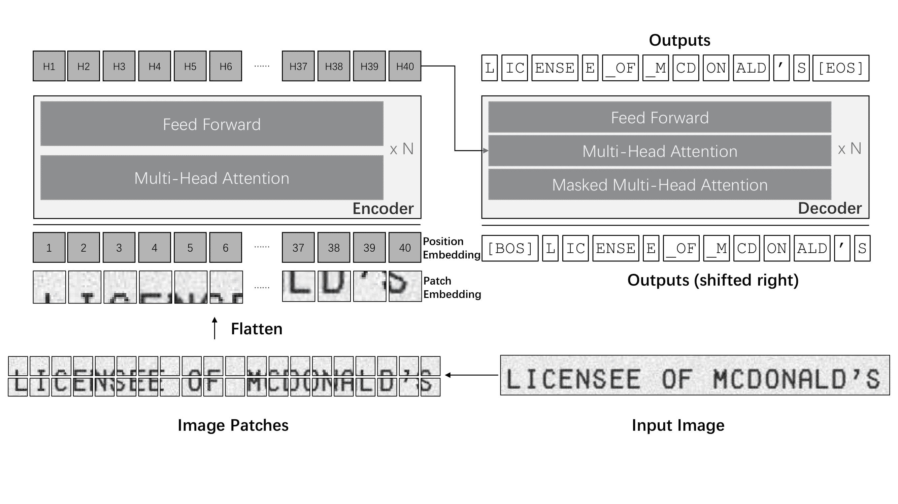

# TrOCR

> 原始文本：[`huggingface.co/docs/transformers/v4.37.2/en/model_doc/trocr`](https://huggingface.co/docs/transformers/v4.37.2/en/model_doc/trocr)

## 概述

TrOCR 模型是由 Minghao Li、Tengchao Lv、Lei Cui、Yijuan Lu、Dinei Florencio、Cha Zhang、Zhoujun Li、Furu Wei 在[TrOCR: Transformer-based Optical Character Recognition with Pre-trained Models](https://arxiv.org/abs/2109.10282)中提出的。TrOCR 包括一个图像 Transformer 编码器和一个自回归文本 Transformer 解码器，用于执行[光学字符识别（OCR）](https://en.wikipedia.org/wiki/Optical_character_recognition)。

论文的摘要如下：

*文本识别是文档数字化的一个长期研究问题。现有的文本识别方法通常基于 CNN 进行图像理解和基于 RNN 进行字符级文本生成。此外，通常需要另一个语言模型作为后处理步骤来提高整体准确性。在本文中，我们提出了一种端到端的文本识别方法，使用预训练的图像 Transformer 和文本 Transformer 模型，即 TrOCR，它利用 Transformer 架构进行图像理解和词片级文本生成。TrOCR 模型简单而有效，可以使用大规模合成数据进行预训练，并使用人工标记的数据集进行微调。实验表明，TrOCR 模型在印刷和手写文本识别任务上优于当前最先进的模型。*

 TrOCR 架构。摘自[原始论文](https://arxiv.org/abs/2109.10282)。

请参考`VisionEncoderDecoder`类如何使用这个模型。

这个模型是由[nielsr](https://huggingface.co/nielsr)贡献的。原始代码可以在[这里](https://github.com/microsoft/unilm/tree/6f60612e7cc86a2a1ae85c47231507a587ab4e01/trocr)找到。

## 使用提示

+   开始使用 TrOCR 的最快方法是查看[教程笔记本](https://github.com/NielsRogge/Transformers-Tutorials/tree/master/TrOCR)，展示了如何在推理时使用模型以及在自定义数据上进行微调。

+   TrOCR 在被微调到下游数据集之前经过 2 个阶段的预训练。它在印刷（例如[SROIE 数据集](https://paperswithcode.com/dataset/sroie)）和手写（例如[IAM 手写数据集](https://fki.tic.heia-fr.ch/databases/iam-handwriting-database%3E)）文本识别任务上取得了最先进的结果。更多信息，请参阅[官方模型](https://huggingface.co/models?other=trocr%3E)。

+   TrOCR 始终在 VisionEncoderDecoder 框架内使用。

## 资源

一个官方的 Hugging Face 和社区资源列表（由🌎表示），帮助您开始使用 TrOCR。如果您有兴趣提交资源以包含在此处，请随时打开一个 Pull Request，我们将进行审核！资源应该展示一些新东西，而不是重复现有资源。

文本分类

+   一个关于[加速文档 AI](https://huggingface.co/blog/document-ai)与 TrOCR 的博客文章。

+   一个关于如何使用 TrOCR 进行[文档 AI](https://github.com/philschmid/document-ai-transformers)的博客文章。

+   一个关于如何使用 Seq2SeqTrainer 在 IAM 手写数据库上[微调 TrOCR](https://colab.research.google.com/github/NielsRogge/Transformers-Tutorials/blob/master/TrOCR/Fine_tune_TrOCR_on_IAM_Handwriting_Database_using_Seq2SeqTrainer.ipynb)的笔记本。

+   一个关于[inference with TrOCR](https://colab.research.google.com/github/NielsRogge/Transformers-Tutorials/blob/master/TrOCR/Inference_with_TrOCR_%2B_Gradio_demo.ipynb)和 Gradio 演示的笔记本。

+   一个关于在 IAM 手写数据库上[微调 TrOCR](https://colab.research.google.com/github/NielsRogge/Transformers-Tutorials/blob/master/TrOCR/Fine_tune_TrOCR_on_IAM_Handwriting_Database_using_native_PyTorch.ipynb)使用原生 PyTorch 的笔记本。

+   关于[在 IAM 测试集上评估 TrOCR](https://colab.research.google.com/github/NielsRogge/Transformers-Tutorials/blob/master/TrOCR/Evaluating_TrOCR_base_handwritten_on_the_IAM_test_set.ipynb)的笔记本。

文本生成

+   [语言建模](https://huggingface.co/docs/transformers/tasks/language_modeling)任务指南。

⚡️ 推理

+   关于[TrOCR 手写字符识别](https://huggingface.co/spaces/nielsr/TrOCR-handwritten)的交互式演示。

## 推理

TrOCR 的`VisionEncoderDecoder`模型接受图像作为输入，并利用 generate()来自回归地生成给定输入图像的文本。

[`ViTImageProcessor`/`DeiTImageProcessor`]类负责预处理输入图像，[`RobertaTokenizer`/`XLMRobertaTokenizer`]解码生成的目标令牌为目标字符串。TrOCRProcessor 将[`ViTImageProcessor`/`DeiTImageProcessor`]和[`RobertaTokenizer`/`XLMRobertaTokenizer`]封装成单个实例，用于提取输入特征和解码预测的令牌 ID。

+   逐步光学字符识别（OCR）

```py
>>> from transformers import TrOCRProcessor, VisionEncoderDecoderModel
>>> import requests
>>> from PIL import Image

>>> processor = TrOCRProcessor.from_pretrained("microsoft/trocr-base-handwritten")
>>> model = VisionEncoderDecoderModel.from_pretrained("microsoft/trocr-base-handwritten")

>>> # load image from the IAM dataset
>>> url = "https://fki.tic.heia-fr.ch/static/img/a01-122-02.jpg"
>>> image = Image.open(requests.get(url, stream=True).raw).convert("RGB")

>>> pixel_values = processor(image, return_tensors="pt").pixel_values
>>> generated_ids = model.generate(pixel_values)

>>> generated_text = processor.batch_decode(generated_ids, skip_special_tokens=True)[0]
```

查看[模型中心](https://huggingface.co/models?filter=trocr)以查找 TrOCR 检查点。

## TrOCRConfig

### `class transformers.TrOCRConfig`

[<来源>](https://github.com/huggingface/transformers/blob/v4.37.2/src/transformers/models/trocr/configuration_trocr.py#L31)

```py
( vocab_size = 50265 d_model = 1024 decoder_layers = 12 decoder_attention_heads = 16 decoder_ffn_dim = 4096 activation_function = 'gelu' max_position_embeddings = 512 dropout = 0.1 attention_dropout = 0.0 activation_dropout = 0.0 decoder_start_token_id = 2 init_std = 0.02 decoder_layerdrop = 0.0 use_cache = True scale_embedding = False use_learned_position_embeddings = True layernorm_embedding = True pad_token_id = 1 bos_token_id = 0 eos_token_id = 2 **kwargs )
```

参数

+   `vocab_size` (`int`, *optional*, defaults to 50265) — TrOCR 模型的词汇量。定义了在调用 TrOCRForCausalLM 时可以表示的不同令牌数量。

+   `d_model` (`int`, *optional*, defaults to 1024) — 层和池化层的维度。

+   `decoder_layers` (`int`, *optional*, defaults to 12) — 解码器层数。

+   `decoder_attention_heads` (`int`, *optional*, defaults to 16) — Transformer 解码器中每个注意力层的注意力头数。

+   `decoder_ffn_dim` (`int`, *optional*, defaults to 4096) — 解码器中“中间”（通常称为前馈）层的维度。

+   `activation_function` (`str` or `function`, *optional*, defaults to `"gelu"`) — 池化器中的非线性激活函数（函数或字符串）。如果是字符串，支持`"gelu"`、`"relu"`、`"silu"`和`"gelu_new"`。

+   `max_position_embeddings` (`int`, *optional*, defaults to 512) — 此模型可能使用的最大序列长度。通常将其设置为较大的值以防万一（例如 512、1024 或 2048）。

+   `dropout` (`float`, *optional*, defaults to 0.1) — 嵌入层和池化器中所有全连接层的丢弃概率。

+   `attention_dropout` (`float`, *optional*, defaults to 0.0) — 注意力概率的丢弃比例。

+   `activation_dropout` (`float`, *optional*, defaults to 0.0) — 全连接层内激活的丢弃比例。

+   `init_std` (`float`, *optional*, defaults to 0.02) — 用于初始化所有权重矩阵的截断正态初始化器的标准差。

+   `decoder_layerdrop` (`float`, *optional*, defaults to 0.0) — 解码器的 LayerDrop 概率。有关更多详细信息，请参阅 LayerDrop 论文)。

+   `use_cache` (`bool`, *optional*, defaults to `True`) — 模型是否应返回最后的键/值注意力（并非所有模型都使用）。

+   `scale_embedding` (`bool`, *optional*, defaults to `False`) — 是否将词嵌入按 sqrt(d_model)进行缩放。

+   `use_learned_position_embeddings` (`bool`, *optional*, defaults to `True`) — 是否使用学习的位置嵌入。如果不是，则将使用正弦位置嵌入。

+   `layernorm_embedding`（`bool`，*可选*，默认为`True`）—是否在单词+位置嵌入后使用 layernorm。

这是配置类，用于存储 TrOCRForCausalLM 的配置。它用于根据指定的参数实例化 TrOCR 模型，定义模型架构。使用默认值实例化配置将产生类似于 TrOCR [microsoft/trocr-base-handwritten](https://huggingface.co/microsoft/trocr-base-handwritten)架构的配置。

配置对象继承自 PretrainedConfig，可用于控制模型输出。阅读 PretrainedConfig 的文档以获取更多信息。

示例：

```py
>>> from transformers import TrOCRConfig, TrOCRForCausalLM

>>> # Initializing a TrOCR-base style configuration
>>> configuration = TrOCRConfig()

>>> # Initializing a model (with random weights) from the TrOCR-base style configuration
>>> model = TrOCRForCausalLM(configuration)

>>> # Accessing the model configuration
>>> configuration = model.config
```

## TrOCRProcessor

### `class transformers.TrOCRProcessor`

[<来源>](https://github.com/huggingface/transformers/blob/v4.37.2/src/transformers/models/trocr/processing_trocr.py#L24)

```py
( image_processor = None tokenizer = None **kwargs )
```

参数

+   `image_processor`（[`ViTImageProcessor`/`DeiTImageProcessor`]，*可选*）—[`ViTImageProcessor`/`DeiTImageProcessor`]的实例。图像处理器是必需的输入。

+   `tokenizer`（[`RobertaTokenizer`/`XLMRobertaTokenizer`]，*可选*）—[`RobertaTokenizer`/`XLMRobertaTokenizer`]的实例。标记器是必需的输入。

构建一个 TrOCR 处理器，将视觉图像处理器和 TrOCR 标记器封装到单个处理器中。

TrOCRProcessor 提供了所有[`ViTImageProcessor`/`DeiTImageProcessor`]和[`RobertaTokenizer`/`XLMRobertaTokenizer`]的功能。查看**call**()和 decode()以获取更多信息。

#### `__call__`

[<来源>](https://github.com/huggingface/transformers/blob/v4.37.2/src/transformers/models/trocr/processing_trocr.py#L63)

```py
( *args **kwargs )
```

在正常模式下使用时，此方法将所有参数转发到 AutoImageProcessor 的`__call__()`并返回其输出。如果在上下文`as_target_processor()`中使用此方法，则将所有参数转发到 TrOCRTokenizer 的`~TrOCRTokenizer.__call__`。请参考上述两种方法的文档获取更多信息。

#### `from_pretrained`

[<来源>](https://github.com/huggingface/transformers/blob/v4.37.2/src/transformers/processing_utils.py#L406)

```py
( pretrained_model_name_or_path: Union cache_dir: Union = None force_download: bool = False local_files_only: bool = False token: Union = None revision: str = 'main' **kwargs )
```

参数

+   `pretrained_model_name_or_path`（`str`或`os.PathLike`）—这可以是：

    +   一个字符串，预训练特征提取器的*模型 ID*，托管在 huggingface.co 上的模型存储库中。有效的模型 ID 可以位于根级别，如`bert-base-uncased`，或命名空间在用户或组织名称下，如`dbmdz/bert-base-german-cased`。

    +   一个*目录*的路径，其中包含使用 save_pretrained()方法保存的特征提取器文件，例如`./my_model_directory/`。

    +   一个保存的特征提取器 JSON *文件*的路径或 URL，例如`./my_model_directory/preprocessor_config.json`。**kwargs —传递给 from_pretrained()和`~tokenization_utils_base.PreTrainedTokenizer.from_pretrained`的额外关键字参数。

实例化与预训练模型相关联的处理器。

这个类方法只是调用特征提取器 from_pretrained()、图像处理器 ImageProcessingMixin 和分词器`~tokenization_utils_base.PreTrainedTokenizer.from_pretrained`方法。有关更多信息，请参阅上述方法的文档字符串。

#### `save_pretrained`

[<来源>](https://github.com/huggingface/transformers/blob/v4.37.2/src/transformers/processing_utils.py#L167)

```py
( save_directory push_to_hub: bool = False **kwargs )
```

参数

+   `save_directory` (`str`或`os.PathLike`) — 特征提取器 JSON 文件和分词器文件将保存在的目录（如果目录不存在将被创建）。

+   `push_to_hub` (`bool`, *可选*, 默认为`False`) — 是否在保存后将模型推送到 Hugging Face 模型中心。您可以使用`repo_id`指定要推送到的存储库（将默认为您命名空间中的`save_directory`名称）。

+   `kwargs` (`Dict[str, Any]`, *可选*) — 传递给 push_to_hub()方法的额外关键字参数。

将此处理器的属性（特征提取器、分词器等）保存在指定目录中，以便可以使用 from_pretrained()方法重新加载。

这个类方法只是调用 save_pretrained()和 save_pretrained()。有关更多信息，请参阅上述方法的文档字符串。

#### `batch_decode`

[<来源>](https://github.com/huggingface/transformers/blob/v4.37.2/src/transformers/models/trocr/processing_trocr.py#L96)

```py
( *args **kwargs )
```

此方法将所有参数转发给 TrOCRTokenizer 的 batch_decode()。有关更多信息，请参阅此方法的文档字符串。

#### `decode`

[<来源>](https://github.com/huggingface/transformers/blob/v4.37.2/src/transformers/models/trocr/processing_trocr.py#L103)

```py
( *args **kwargs )
```

此方法将所有参数转发给 TrOCRTokenizer 的 decode()。有关更多信息，请参阅此方法的文档字符串。

## TrOCRForCausalLM

### `class transformers.TrOCRForCausalLM`

[<来源>](https://github.com/huggingface/transformers/blob/v4.37.2/src/transformers/models/trocr/modeling_trocr.py#L724)

```py
( config )
```

参数

+   `config` (TrOCRConfig) — 包含模型所有参数的模型配置类。使用配置文件初始化不会加载与模型相关的权重，只加载配置。查看 from_pretrained()方法以加载模型权重。

带有语言建模头的 TrOCR 解码器。可用作 EncoderDecoderModel 和`VisionEncoderDecoder`的解码器部分。此模型继承自 PreTrainedModel。检查超类文档以了解库为所有模型实现的通用方法（如下载或保存、调整输入嵌入、修剪头等）。

这个模型也是一个 PyTorch [torch.nn.Module](https://pytorch.org/docs/stable/nn.html#torch.nn.Module)子类。将其用作常规的 PyTorch 模块，并参考 PyTorch 文档以获取与一般用法和行为相关的所有内容。

#### `forward`

[<来源>](https://github.com/huggingface/transformers/blob/v4.37.2/src/transformers/models/trocr/modeling_trocr.py#L762)

```py
( input_ids: Optional = None attention_mask: Optional = None encoder_hidden_states: Optional = None encoder_attention_mask: Optional = None head_mask: Optional = None cross_attn_head_mask: Optional = None past_key_values: Optional = None inputs_embeds: Optional = None labels: Optional = None use_cache: Optional = None output_attentions: Optional = None output_hidden_states: Optional = None return_dict: Optional = None ) → export const metadata = 'undefined';transformers.modeling_outputs.CausalLMOutputWithCrossAttentions or tuple(torch.FloatTensor)
```

参数

+   `input_ids`（形状为`(batch_size, sequence_length)`的`torch.LongTensor`）— 词汇表中输入序列标记的索引。默认情况下将忽略填充。

    可以使用 AutoTokenizer 获取索引。有关详细信息，请参阅 PreTrainedTokenizer.encode()和 PreTrainedTokenizer.`call`()。

    什么是输入 ID？

+   `attention_mask`（形状为`(batch_size, sequence_length)`的`torch.Tensor`，*可选*）— 用于避免在填充标记索引上执行注意力的掩码。掩码值选在`[0, 1]`之间：

    +   1 表示标记是`未被掩码`，

    +   0 表示标记是`被掩码`。

    什么是注意力掩码？

+   `encoder_hidden_states`（形状为`(batch_size, sequence_length, hidden_size)`的`torch.FloatTensor`，*可选*）— 编码器最后一层的隐藏状态序列。如果模型配置为解码器，则在交叉注意力中使用。

+   `encoder_attention_mask`（形状为`(batch_size, sequence_length)`的`torch.FloatTensor`，*可选*）— 用于避免在编码器输入的填充标记索引上执行注意力的掩码。如果模型配置为解码器，则在交叉注意力中使用此掩码。掩码值选在`[0, 1]`之间：

+   `head_mask`（形状为`(decoder_layers, decoder_attention_heads)`的`torch.Tensor`，*可选*）— 用于使注意力模块的选定头部失效的掩码。掩码值选在`[0, 1]`之间：

    +   1 表示头部是`未被掩码`，

    +   0 表示头部是`被掩码`。

+   `cross_attn_head_mask`（形状为`(decoder_layers, decoder_attention_heads)`的`torch.Tensor`，*可选*）— 用于使交叉注意力模块的选定头部失效的掩码。掩码值选在`[0, 1]`之间：

    +   1 表示头部是`未被掩码`，

    +   0 表示头部是`被掩码`。

+   `past_key_values`（`tuple(tuple(torch.FloatTensor))`，*可选*，当传递`use_cache=True`或`config.use_cache=True`时返回）— 长度为`config.n_layers`的`tuple(torch.FloatTensor)`元组，每个元组有 2 个形状为`(batch_size, num_heads, sequence_length, embed_size_per_head)`的张量）和 2 个额外的形状为`(batch_size, num_heads, encoder_sequence_length, embed_size_per_head)`的张量。当模型用作序列到序列模型中的解码器时，这两个额外的张量是必需的。

    包含预先计算的隐藏状态（自注意力块和交叉注意力块中的键和值），可用于加速顺序解码（参见`past_key_values`输入）。

    如果使用`past_key_values`，用户可以选择仅输入最后的`decoder_input_ids`（那些没有将它们的过去键值状态提供给此模型的）形状为`(batch_size, 1)`，而不是形状为`(batch_size, sequence_length)`的所有`decoder_input_ids`。

+   `labels`（形状为`(batch_size, sequence_length)`的`torch.LongTensor`，*可选*）— 用于计算掩码语言建模损失的标签。索引应该在`[0, ..., config.vocab_size]`或-100（参见`input_ids`文档字符串）。将索引设置为`-100`的标记将被忽略（掩码），损失仅计算具有标签在`[0, ..., config.vocab_size]`中的标记。

+   `use_cache`（`bool`，*可选*）— 如果设置为`True`，将返回`past_key_values`键值状态，并可用于加速解码（参见`past_key_values`）。

    +   对于未被`masked`的标记为 1，

    +   对于被`masked`的标记为 0。

+   `output_attentions` (`bool`，*可选*) — 是否返回所有注意力层的注意力张量。有关更多详细信息，请参阅返回张量下的`attentions`。

+   `output_hidden_states` (`bool`，*可选*) — 是否返回所有层的隐藏状态。有关更多详细信息，请参阅返回张量下的`hidden_states`。

+   `return_dict` (`bool`, *optional*) — 是否返回 ModelOutput 而不是普通元组。

返回

transformers.modeling_outputs.CausalLMOutputWithCrossAttentions 或 `tuple(torch.FloatTensor)`

一个 transformers.modeling_outputs.CausalLMOutputWithCrossAttentions 或一个 `torch.FloatTensor` 元组（如果传递`return_dict=False`或`config.return_dict=False`时）包含根据配置（TrOCRConfig）和输入的不同元素。

+   `loss` (`torch.FloatTensor`，形状为`(1,)`，*可选*，当提供`labels`时返回) — 语言建模损失（用于下一个标记预测）。

+   `logits` (`torch.FloatTensor`，形状为`(batch_size, sequence_length, config.vocab_size)`) — 语言建模头的预测分数（SoftMax 之前每个词汇标记的分数）。

+   `hidden_states` (`tuple(torch.FloatTensor)`，*可选*，当传递`output_hidden_states=True`或`config.output_hidden_states=True`时返回） — 形状为`(batch_size, sequence_length, hidden_size)`的`torch.FloatTensor`元组（如果模型有嵌入层，则为嵌入输出的输出 + 每层输出的输出）。

    模型在每一层输出的隐藏状态加上可选的初始嵌入输出。

+   `attentions` (`tuple(torch.FloatTensor)`，*可选*，当传递`output_attentions=True`或`config.output_attentions=True`时返回） — 形状为`(batch_size, num_heads, sequence_length, sequence_length)`的`torch.FloatTensor`元组（每层一个）。

    在注意力 softmax 之后的注意力权重，用于计算自注意力头中的加权平均值。

+   `cross_attentions` (`tuple(torch.FloatTensor)`，*可选*，当传递`output_attentions=True`或`config.output_attentions=True`时返回） — 形状为`(batch_size, num_heads, sequence_length, sequence_length)`的`torch.FloatTensor`元组（每层一个）。

    在注意力 softmax 之后的交叉注意力权重，用于计算交叉注意力头中的加权平均值。

+   `past_key_values` (`tuple(tuple(torch.FloatTensor))`，*可选*，当传递`use_cache=True`或`config.use_cache=True`时返回） — 长度为`config.n_layers`的`torch.FloatTensor`元组的元组，每个元组包含自注意力和交叉注意力层的缓存键、值状态，如果模型用于编码器-解码器设置，则相关。仅在`config.is_decoder = True`时相关。

    包含预先计算的隐藏状态（注意力块中的键和值），可用于加速顺序解码。

示例：

```py
>>> from transformers import (
...     TrOCRConfig,
...     TrOCRProcessor,
...     TrOCRForCausalLM,
...     ViTConfig,
...     ViTModel,
...     VisionEncoderDecoderModel,
... )
>>> import requests
>>> from PIL import Image

>>> # TrOCR is a decoder model and should be used within a VisionEncoderDecoderModel
>>> # init vision2text model with random weights
>>> encoder = ViTModel(ViTConfig())
>>> decoder = TrOCRForCausalLM(TrOCRConfig())
>>> model = VisionEncoderDecoderModel(encoder=encoder, decoder=decoder)

>>> # If you want to start from the pretrained model, load the checkpoint with `VisionEncoderDecoderModel`
>>> processor = TrOCRProcessor.from_pretrained("microsoft/trocr-base-handwritten")
>>> model = VisionEncoderDecoderModel.from_pretrained("microsoft/trocr-base-handwritten")

>>> # load image from the IAM dataset
>>> url = "https://fki.tic.heia-fr.ch/static/img/a01-122-02.jpg"
>>> image = Image.open(requests.get(url, stream=True).raw).convert("RGB")
>>> pixel_values = processor(image, return_tensors="pt").pixel_values
>>> text = "industry, ' Mr. Brown commented icily. ' Let us have a"

>>> # training
>>> model.config.decoder_start_token_id = processor.tokenizer.cls_token_id
>>> model.config.pad_token_id = processor.tokenizer.pad_token_id
>>> model.config.vocab_size = model.config.decoder.vocab_size

>>> labels = processor.tokenizer(text, return_tensors="pt").input_ids
>>> outputs = model(pixel_values, labels=labels)
>>> loss = outputs.loss
>>> round(loss.item(), 2)
5.30

>>> # inference
>>> generated_ids = model.generate(pixel_values)
>>> generated_text = processor.batch_decode(generated_ids, skip_special_tokens=True)[0]
>>> generated_text
'industry, " Mr. Brown commented icily. " Let us have a'
```
