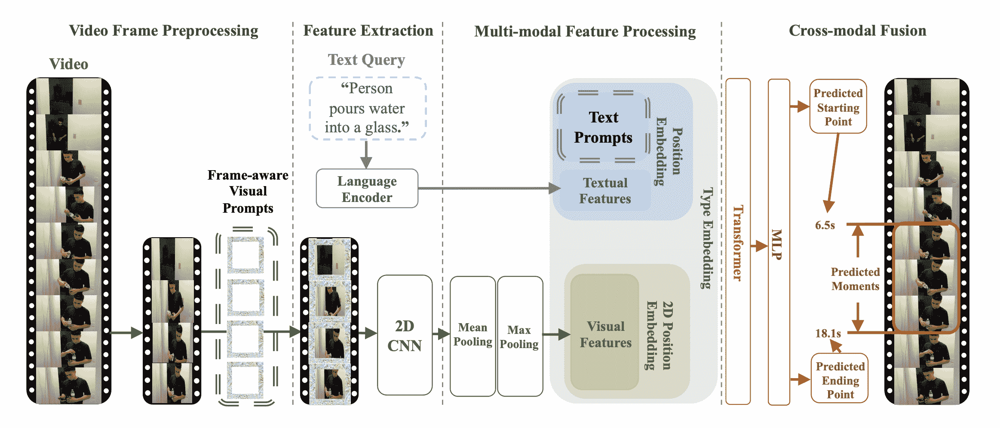

# TVP

> 原文链接：[`huggingface.co/docs/transformers/v4.37.2/en/model_doc/tvp`](https://huggingface.co/docs/transformers/v4.37.2/en/model_doc/tvp)

## 概述

文本视觉提示（TVP）框架是由 Yimeng Zhang，Xin Chen，Jinghan Jia，Sijia Liu，Ke Ding 在论文[Text-Visual Prompting for Efficient 2D Temporal Video Grounding](https://arxiv.org/abs/2303.04995)中提出的。

论文的摘要如下：

*在本文中，我们研究了时间视频定位（TVG）问题，旨在预测长视频中由文本句子描述的时刻的起始/结束时间点。由于精细的 3D 视觉特征，TVG 技术近年来取得了显著进展。然而，3D 卷积神经网络（CNNs）的高复杂性使得提取密集的 3D 视觉特征耗时，需要大量内存和计算资源。为了实现高效的 TVG，我们提出了一种新颖的文本-视觉提示（TVP）框架，将优化的扰动模式（我们称之为“提示”）集成到 TVG 模型的视觉输入和文本特征中。与 3D CNN 形成鲜明对比，我们展示了 TVP 允许我们在 2D TVG 模型中有效地共同训练视觉编码器和语言编码器，并且仅使用低复杂度的稀疏 2D 视觉特征改善了跨模态特征融合的性能。此外，我们提出了一种用于高效学习 TVG 的时间距离 IoU（TDIoU）损失。对两个基准数据集 Charades-STA 和 ActivityNet Captions 数据集的实验经验表明，所提出的 TVP 显著提升了 2D TVG 的性能（例如，在 Charades-STA 上提高了 9.79%，在 ActivityNet Captions 上提高了 30.77%），并且相比使用 3D 视觉特征的 TVG 实现了 5 倍的推理加速。*

这项研究解决了时间视频定位（TVG）问题，即在长视频中准确定位特定事件的开始和结束时间，如文本句子所描述。文本-视觉提示（TVP）被提出以增强 TVG。TVP 涉及将专门设计的模式（称为“提示”）集成到 TVG 模型的视觉（基于图像）和文本（基于单词）输入组件中。这些提示提供额外的时空上下文，提高了模型准确确定视频中事件时间的能力。该方法使用 2D 视觉输入代替 3D 输入。虽然 3D 输入提供更多的时空细节，但处理起来也更耗时。使用 2D 输入与提示方法旨在更有效地提供类似水平的上下文和准确性。

 TVP 架构。摘自[原始论文](https://arxiv.org/abs/2303.04995)

该模型由[Jiqing Feng](https://huggingface.co/Jiqing)贡献。原始代码可以在[这里](https://github.com/intel/TVP)找到。

## 使用提示和示例

提示是经过优化的扰动模式，将添加到输入视频帧或文本特征中。通用集指的是对于任何输入使用完全相同的提示集，这意味着这些提示被一致地添加到所有视频帧和文本特征中，而不考虑输入的内容。

TVP 包括一个视觉编码器和跨模态编码器。一个通用的视觉提示集和文本提示集分别集成到采样的视频帧和文本特征中。特别地，一组不同的视觉提示被应用于一个未修剪视频的均匀采样帧中。

该模型的目标是将可训练的提示集成到视觉输入和文本特征中，以解决时间视频定位（TVG）问题。原则上，可以在提出的架构中应用任何视觉、跨模态编码器。

TvpProcessor 将 BertTokenizer 和 TvpImageProcessor 包装成一个单一实例，分别对文本进行编码和准备图像。

以下示例展示了如何使用 TvpProcessor 和 TvpForVideoGrounding 运行时间视频定位。

```py
import av
import cv2
import numpy as np
import torch
from huggingface_hub import hf_hub_download
from transformers import AutoProcessor, TvpForVideoGrounding

def pyav_decode(container, sampling_rate, num_frames, clip_idx, num_clips, target_fps):
    '''
    Convert the video from its original fps to the target_fps and decode the video with PyAV decoder.
    Args:
        container (container): pyav container.
        sampling_rate (int): frame sampling rate (interval between two sampled frames).
        num_frames (int): number of frames to sample.
        clip_idx (int): if clip_idx is -1, perform random temporal sampling.
            If clip_idx is larger than -1, uniformly split the video to num_clips
            clips, and select the clip_idx-th video clip.
        num_clips (int): overall number of clips to uniformly sample from the given video.
        target_fps (int): the input video may have different fps, convert it to
            the target video fps before frame sampling.
    Returns:
        frames (tensor): decoded frames from the video. Return None if the no
            video stream was found.
        fps (float): the number of frames per second of the video.
    '''
    video = container.streams.video[0]
    fps = float(video.average_rate)
    clip_size = sampling_rate * num_frames / target_fps * fps
    delta = max(num_frames - clip_size, 0)
    start_idx = delta * clip_idx / num_clips
    end_idx = start_idx + clip_size - 1
    timebase = video.duration / num_frames
    video_start_pts = int(start_idx * timebase)
    video_end_pts = int(end_idx * timebase)
    seek_offset = max(video_start_pts - 1024, 0)
    container.seek(seek_offset, any_frame=False, backward=True, stream=video)
    frames = {}
    for frame in container.decode(video=0):
        if frame.pts < video_start_pts:
            continue
        frames[frame.pts] = frame
        if frame.pts > video_end_pts:
            break
    frames = [frames[pts] for pts in sorted(frames)]
    return frames, fps

def decode(container, sampling_rate, num_frames, clip_idx, num_clips, target_fps):
    '''
    Decode the video and perform temporal sampling.
    Args:
        container (container): pyav container.
        sampling_rate (int): frame sampling rate (interval between two sampled frames).
        num_frames (int): number of frames to sample.
        clip_idx (int): if clip_idx is -1, perform random temporal sampling.
            If clip_idx is larger than -1, uniformly split the video to num_clips
            clips, and select the clip_idx-th video clip.
        num_clips (int): overall number of clips to uniformly sample from the given video.
        target_fps (int): the input video may have different fps, convert it to
            the target video fps before frame sampling.
    Returns:
        frames (tensor): decoded frames from the video.
    '''
    assert clip_idx >= -2, "Not a valied clip_idx {}".format(clip_idx)
    frames, fps = pyav_decode(container, sampling_rate, num_frames, clip_idx, num_clips, target_fps)
    clip_size = sampling_rate * num_frames / target_fps * fps
    index = np.linspace(0, clip_size - 1, num_frames)
    index = np.clip(index, 0, len(frames) - 1).astype(np.int64)
    frames = np.array([frames[idx].to_rgb().to_ndarray() for idx in index])
    frames = frames.transpose(0, 3, 1, 2)
    return frames

file = hf_hub_download(repo_id="Intel/tvp_demo", filename="AK2KG.mp4", repo_type="dataset")
model = TvpForVideoGrounding.from_pretrained("Intel/tvp-base")

decoder_kwargs = dict(
    container=av.open(file, metadata_errors="ignore"),
    sampling_rate=1,
    num_frames=model.config.num_frames,
    clip_idx=0,
    num_clips=1,
    target_fps=3,
)
raw_sampled_frms = decode(**decoder_kwargs)

text = "a person is sitting on a bed."
processor = AutoProcessor.from_pretrained("Intel/tvp-base")
model_inputs = processor(
    text=[text], videos=list(raw_sampled_frms), return_tensors="pt", max_text_length=100#, size=size
)

model_inputs["pixel_values"] = model_inputs["pixel_values"].to(model.dtype)
output = model(**model_inputs)

def get_video_duration(filename):
    cap = cv2.VideoCapture(filename)
    if cap.isOpened():
        rate = cap.get(5)
        frame_num = cap.get(7)
        duration = frame_num/rate
        return duration
    return -1

duration = get_video_duration(file)
start, end = processor.post_process_video_grounding(output.logits, duration)

print(f"The time slot of the video corresponding to the text \"{text}\" is from {start}s to {end}s")
```

提示：

+   TVP 的这个实现使用 BertTokenizer 生成文本嵌入和 Resnet-50 模型计算视觉嵌入。

+   已发布预训练 [tvp-base](https://huggingface.co/Intel/tvp-base) 的检查点。

+   请参考 [Table 2](https://arxiv.org/pdf/2303.04995.pdf) 了解 TVP 在时间视频定位任务上的性能。

## TvpConfig

### `class transformers.TvpConfig`

[< source >](https://github.com/huggingface/transformers/blob/v4.37.2/src/transformers/models/tvp/configuration_tvp.py#L32)

```py
( backbone_config = None distance_loss_weight = 1.0 duration_loss_weight = 0.1 visual_prompter_type = 'framepad' visual_prompter_apply = 'replace' visual_prompt_size = 96 max_img_size = 448 num_frames = 48 vocab_size = 30522 hidden_size = 768 intermediate_size = 3072 num_hidden_layers = 12 num_attention_heads = 12 max_position_embeddings = 512 max_grid_col_position_embeddings = 100 max_grid_row_position_embeddings = 100 hidden_dropout_prob = 0.1 hidden_act = 'gelu' layer_norm_eps = 1e-12 initializer_range = 0.02 attention_probs_dropout_prob = 0.1 **kwargs )
```

参数

+   `backbone_config` (`PretrainedConfig` or `dict`, *optional*) — 骨干模型的配置。

+   `distance_loss_weight` (`float`, *optional*, defaults to 1.0) — 距离损失的权重。

+   `duration_loss_weight` (`float`, *optional*, defaults to 0.1) — 持续时间损失的权重。

+   `visual_prompter_type` (`str`, *optional*, defaults to `"framepad"`) — 视觉提示类型。填充的类型。Framepad 表示在每个帧上填充。应为`"framepad"`或“framedownpad”之一。

+   `visual_prompter_apply` (`str`, *optional*, defaults to `"replace"`) — 应用视觉提示的方式。Replace 表示使用提示的值来更改视觉输入中的原始值。应为`"replace"`、“add”或“remove”之一。

+   `visual_prompt_size` (`int`, *optional*, defaults to 96) — 视觉提示的大小。

+   `max_img_size` (`int`, *optional*, defaults to 448) — 帧的最大尺寸。

+   `num_frames` (`int`, *optional*, defaults to 48) — 从视频中提取的帧数。

+   `vocab_size` (`int`, *optional*, defaults to 30522) — Tvp 文本模型的词汇量。定义了在调用 TvpModel 时可以由 `inputs_ids` 表示的不同标记的数量。

+   `hidden_size` (`int`, *optional*, defaults to 768) — 编码器层的维度。

+   `intermediate_size` (`int`, *optional*, defaults to 3072) — Transformer 编码器中“中间”（即前馈）层的维度。

+   `num_hidden_layers` (`int`, *optional*, defaults to 12) — Transformer 编码器中的隐藏层数。

+   `num_attention_heads` (`int`, *optional*, defaults to 12) — Transformer 编码器中每个注意力层的注意力头数。

+   `max_position_embeddings` (`int`, *optional*, defaults to 512) — 模型可能使用的最大序列长度。通常将其设置为一个较大的值以防万一（例如 512、1024 或 2048）。

+   `max_grid_col_position_embeddings` (`int`, *optional*, defaults to 100) — 从视频帧中提取的水平补丁的最大数量。

+   `max_grid_row_position_embeddings` (`int`, *optional*, defaults to 100) — 从视频帧中提取的垂直补丁的最大数量。

+   `hidden_dropout_prob` (`float`, *optional*, defaults to 0.1) — 隐藏层的丢失概率。

+   `hidden_act` (`str` or `function`, *optional*, defaults to `"gelu"`) — 编码器和池化器中的非线性激活函数（函数或字符串）。如果是字符串，支持 `"gelu"`、`"relu"`、`"selu"` 和 `"gelu_new"` `"quick_gelu"`。

+   `layer_norm_eps` (`float`, *optional*, defaults to 1e-12) — 层归一化层使用的 epsilon。

+   `initializer_range` (`float`，*可选*，默认为 0.02) — 用于初始化所有权重矩阵的截断正态初始化器的标准差。

+   `attention_probs_dropout_prob` (`float`，*可选*，默认为 0.1) — 注意力层的丢失概率。

这是一个配置类，用于存储 TvpModel 的配置。它用于根据指定的参数实例化一个 Tvp 模型，定义模型架构。使用默认值实例化配置将产生类似于[Tvp Intel/tvp-base](https://huggingface.co/Intel/tvp-base)架构的配置。

配置对象继承自 PretrainedConfig，可用于控制模型输出。阅读来自 PretrainedConfig 的文档以获取更多信息。

#### `from_backbone_config`

[<来源>](https://github.com/huggingface/transformers/blob/v4.37.2/src/transformers/models/tvp/configuration_tvp.py#L152)

```py
( backbone_config: PretrainedConfig **kwargs ) → export const metadata = 'undefined';TvpConfig
```

参数

+   `backbone_config` (PretrainedConfig) — 骨干配置。

返回

TvpConfig

配置对象的一个实例

从预训练的骨干模型配置实例化一个 TvpConfig（或派生类）。

#### `to_dict`

[<来源>](https://github.com/huggingface/transformers/blob/v4.37.2/src/transformers/models/tvp/configuration_tvp.py#L164)

```py
( ) → export const metadata = 'undefined';Dict[str, any]
```

返回

`Dict[str, any]`

包含构成此配置实例的所有属性的字典，

将此实例序列化为 Python 字典。覆盖默认 to_dict()。

## TvpImageProcessor

### `class transformers.TvpImageProcessor`

[<来源>](https://github.com/huggingface/transformers/blob/v4.37.2/src/transformers/models/tvp/image_processing_tvp.py#L83)

```py
( do_resize: bool = True size: Dict = None resample: Resampling = <Resampling.BILINEAR: 2> do_center_crop: bool = True crop_size: Dict = None do_rescale: bool = True rescale_factor: Union = 0.00392156862745098 do_pad: bool = True pad_size: Dict = None constant_values: Union = 0 pad_mode: PaddingMode = <PaddingMode.CONSTANT: 'constant'> do_normalize: bool = True do_flip_channel_order: bool = True image_mean: Union = None image_std: Union = None **kwargs )
```

参数

+   `do_resize` (`bool`，*可选*，默认为`True`) — 是否将图像的（高度，宽度）尺寸调整为指定的`size`。可以被`preprocess`方法中的`do_resize`参数覆盖。

+   `size` (`Dict[str, int]` *可选*，默认为`{"longest_edge" -- 448}`)：调整大小后的输出图像大小。图像的最长边将被调整为`size["longest_edge"]`，同时保持原始图像的纵横比。可以被`preprocess`方法中的`size`覆盖。

+   `resample` (`PILImageResampling`，*可选*，默认为`Resampling.BILINEAR`) — 如果调整图像大小，则要使用的重采样滤波器。可以被`preprocess`方法中的`resample`参数覆盖。

+   `do_center_crop` (`bool`，*可选*，默认为`True`) — 是否将图像居中裁剪到指定的`crop_size`。可以被`preprocess`方法中的`do_center_crop`参数覆盖。

+   `crop_size` (`Dict[str, int]`，*可选*，默认为`{"height" -- 448, "width": 448}`)：应用中心裁剪后的图像大小。可以被`preprocess`方法中的`crop_size`参数覆盖。

+   `do_rescale` (`bool`，*可选*，默认为`True`) — 是否按指定比例`rescale_factor`重新缩放图像。可以被`preprocess`方法中的`do_rescale`参数覆盖。

+   `rescale_factor` (`int`或`float`，*可选*，默认为`1/255`) — 定义如果重新缩放图像要使用的比例因子。可以被`preprocess`方法中的`rescale_factor`参数覆盖。

+   `do_pad` (`bool`，*可选*，默认为`True`) — 是否填充图像。可以被`preprocess`方法中的`do_pad`参数覆盖。

+   `pad_size`（`Dict[str, int]`，*可选*，默认为`{"height" -- 448, "width": 448}`）：应用填充后图像的大小。可以被`preprocess`方法中的`pad_size`参数覆盖。

+   `constant_values`（`Union[float, Iterable[float]]`，*可选*，默认为 0）— 在填充图像时使用的填充值。

+   `pad_mode`（`PaddingMode`，*可选*，默认为`PaddingMode.CONSTANT`）— 在填充中使用什么样的模式。

+   `do_normalize`（`bool`，*可选*，默认为`True`）— 是否对图像进行归一化。可以被`preprocess`方法中的`do_normalize`参数覆盖。

+   `do_flip_channel_order`（`bool`，*可选*，默认为`True`）— 是否将颜色通道从 RGB 翻转为 BGR。可以被`preprocess`方法中的`do_flip_channel_order`参数覆盖。

+   `image_mean`（`float`或`List[float]`，*可选*，默认为`IMAGENET_STANDARD_MEAN`）— 如果对图像进行归一化，则使用的均值。这是一个浮点数或与图像通道数相同长度的浮点数列表。可以被`preprocess`方法中的`image_mean`参数覆盖。

+   `image_std`（`float`或`List[float]`，*可选*，默认为`IMAGENET_STANDARD_STD`）— 如果对图像进行归一化，则使用的标准差。这是一个浮点数或与图像通道数相同长度的浮点数列表。可以被`preprocess`方法中的`image_std`参数覆盖。

构造一个 Tvp 图像处理器。

#### `preprocess`

[<来源>](https://github.com/huggingface/transformers/blob/v4.37.2/src/transformers/models/tvp/image_processing_tvp.py#L337)

```py
( videos: Union do_resize: bool = None size: Dict = None resample: Resampling = None do_center_crop: bool = None crop_size: Dict = None do_rescale: bool = None rescale_factor: float = None do_pad: bool = None pad_size: Dict = None constant_values: Union = None pad_mode: PaddingMode = None do_normalize: bool = None do_flip_channel_order: bool = None image_mean: Union = None image_std: Union = None return_tensors: Union = None data_format: ChannelDimension = <ChannelDimension.FIRST: 'channels_first'> input_data_format: Union = None **kwargs )
```

参数

+   `videos`（`ImageInput`或`List[ImageInput]`或`List[List[ImageInput]]`）— 要预处理的帧。

+   `do_resize`（`bool`，*可选*，默认为`self.do_resize`）— 是否调整图像大小。

+   `size`（`Dict[str, int]`，*可选*，默认为`self.size`）— 调整大小后图像的大小。

+   `resample`（`PILImageResampling`，*可选*，默认为`self.resample`）— 如果调整图像大小，则使用的重采样滤波器。这可以是枚举`PILImageResampling`之一，仅在`do_resize`设置为`True`时有效。

+   `do_center_crop`（`bool`，*可选*，默认为`self.do_centre_crop`）— 是否对图像进行中心裁剪。

+   `crop_size`（`Dict[str, int]`，*可选*，默认为`self.crop_size`）— 应用中心裁剪后图像的大小。

+   `do_rescale`（`bool`，*可选*，默认为`self.do_rescale`）— 是否将图像值重新缩放在[0 - 1]之间。

+   `rescale_factor`（`float`，*可选*，默认为`self.rescale_factor`）— 如果`do_rescale`设置为`True`，则重新缩放图像的重新缩放因子。

+   `do_pad`（`bool`，*可选*，默认为`True`）— 是否填充图像。可以被`preprocess`方法中的`do_pad`参数覆盖。

+   `pad_size`（`Dict[str, int]`，*可选*，默认为`{"height" -- 448, "width": 448}`）：应用填充后图像的大小。可以被`preprocess`方法中的`pad_size`参数覆盖。

+   `constant_values`（`Union[float, Iterable[float]]`，*可选*，默认为 0）— 在填充图像时使用的填充值。

+   `pad_mode`（`PaddingMode`，*可选*，默认为“PaddingMode.CONSTANT”）— 在填充中使用什么样的模式。

+   `do_normalize`（`bool`，*可选*，默认为`self.do_normalize`）— 是否对图像进行归一化。

+   `do_flip_channel_order`（`bool`，*可选*，默认为`self.do_flip_channel_order`）— 是否翻转图像的通道顺序。

+   `image_mean`（`float`或`List[float]`，*可选*，默认为`self.image_mean`）— 图像均值。

+   `image_std`（`float`或`List[float]`，*可选*，默认为`self.image_std`）— 图像标准差。

+   `return_tensors`（`str`或`TensorType`，*可选*）— 要返回的张量类型。可以是以下之一：

    +   取消：返回一个`np.ndarray`列表。

    +   `TensorType.TENSORFLOW`或`'tf'`：返回类型为`tf.Tensor`的批处理。

    +   `TensorType.PYTORCH`或`'pt'`：返回类型为`torch.Tensor`的批处理。

    +   `TensorType.NUMPY` 或 `'np'`：返回类型为 `np.ndarray` 的批次。

    +   `TensorType.JAX` 或 `'jax'`：返回类型为 `jax.numpy.ndarray` 的批次。

+   `data_format` (`ChannelDimension` 或 `str`，*可选*，默认为 `ChannelDimension.FIRST`) — 输出图像的通道维度格式。可以是以下之一：

    +   `ChannelDimension.FIRST`：图像以 (num_channels, height, width) 格式。

    +   `ChannelDimension.LAST`：图像以 (height, width, num_channels) 格式。

    +   未设置：使用输入图像的推断通道维度格式。

+   `input_data_format` (`ChannelDimension` 或 `str`，*可选*) — 输入图像的通道维度格式。如果未设置，则从输入图像中推断通道维度格式。可以是以下之一：

    +   `"channels_first"` 或 `ChannelDimension.FIRST`：图像以 (num_channels, height, width) 格式。

    +   `"channels_last"` 或 `ChannelDimension.LAST`：图像以 (height, width, num_channels) 格式。

    +   `"none"` 或 `ChannelDimension.NONE`：图像以 (height, width) 格式。

预处理图像或图像批次。

## TvpProcessor

### `class transformers.TvpProcessor`

[< source >](https://github.com/huggingface/transformers/blob/v4.37.2/src/transformers/models/tvp/processing_tvp.py#L24)

```py
( image_processor = None tokenizer = None **kwargs )
```

参数

+   `image_processor` (TvpImageProcessor, *可选*) — 图像处理器是必需的输入。

+   `tokenizer` (BertTokenizerFast, *可选*) — tokenizer 是必需的输入。

构建一个 TVP 处理器，将 TVP 图像处理器和 Bert tokenizer 包装成一个单一处理器。

TvpProcessor 提供了 TvpImageProcessor 和 BertTokenizerFast 的所有功能。查看 **call**() 和 `decode()` 以获取更多信息。

#### `__call__`

[< source >](https://github.com/huggingface/transformers/blob/v4.37.2/src/transformers/models/tvp/processing_tvp.py#L50)

```py
( text = None videos = None return_tensors = None **kwargs ) → export const metadata = 'undefined';BatchEncoding
```

参数

+   `text` (`str`, `List[str]`, `List[List[str]]`) — 要编码的序列或序列批次。每个序列可以是字符串或字符串列表（预分词字符串）。如果将序列提供为字符串列表（预分词），必须设置 `is_split_into_words=True`（以消除与序列批次的歧义）。

+   `videos` (`List[PIL.Image.Image]`, `List[np.ndarray]`, `List[torch.Tensor]`, `List[List[PIL.Image.Image]]`, `List[List[np.ndarrray]]`, — `List[List[torch.Tensor]]`): 要准备的视频或视频批次。每个视频应该是一个帧列表，可以是 PIL 图像或 NumPy 数组。对于 NumPy 数组/PyTorch 张量，每个帧应该是形状为 (H, W, C) 的，其中 H 和 W 是帧的高度和宽度，C 是通道数。

+   `return_tensors` (`str` 或 TensorType, *可选*) — 如果设置，将返回特定框架的张量。可接受的值为：

    +   `'tf'`：返回 TensorFlow `tf.constant` 对象。

    +   `'pt'`：返回 PyTorch `torch.Tensor` 对象。

    +   `'np'`：返回 NumPy `np.ndarray` 对象。

    +   `'jax'`：返回 JAX `jnp.ndarray` 对象。

返回

BatchEncoding

具有以下字段的 BatchEncoding：

+   `input_ids` — 要提供给模型的令牌 id 列表。当 `text` 不是 `None` 时返回。

+   `attention_mask` — 指定哪些令牌应该被模型关注的索引列表（当 `return_attention_mask=True` 或 *`attention_mask`* 在 `self.model_input_names` 中，且 `text` 不是 `None` 时）。

+   `pixel_values` — 要馈送给模型的像素值。当`videos`不为`None`时返回。

准备模型一个或多个序列和图像的主要方法。如果`text`不为`None`，则此方法将`text`和`kwargs`参数转发给 BertTokenizerFast 的**call**()以对文本进行编码。要准备图像，如果`videos`不为`None`，则此方法将`videos`和`kwargs`参数转发给 TvpImageProcessor 的**call**()。有关更多信息，请参阅上述两种方法的文档。

## TvpModel

### `class transformers.TvpModel`

[< source >](https://github.com/huggingface/transformers/blob/v4.37.2/src/transformers/models/tvp/modeling_tvp.py#L692)

```py
( config )
```

参数

+   `config` (TvpConfig) — 具有模型所有参数的模型配置类。使用配置文件初始化不会加载与模型关联的权重，只会加载配置。查看 from_pretrained()方法以加载模型权重。

裸 Tvp 模型输出 BaseModelOutputWithPooling 对象，没有特定的头部。此模型是 PyTorch [torch.nn.Module](https://pytorch.org/docs/stable/nn.html#torch.nn.Module)子类。将其用作常规 PyTorch 模块，并参考 PyTorch 文档以获取有关一般用法和行为的所有相关信息。

#### `forward`

[< source >](https://github.com/huggingface/transformers/blob/v4.37.2/src/transformers/models/tvp/modeling_tvp.py#L726)

```py
( input_ids: Optional = None pixel_values: Optional = None attention_mask: Optional = None head_mask: Optional = None output_attentions: Optional = None output_hidden_states: Optional = None return_dict: Optional = None ) → export const metadata = 'undefined';transformers.modeling_outputs.BaseModelOutputWithPooling or tuple(torch.FloatTensor)
```

参数

+   `input_ids` (`torch.LongTensor`，形状为`(batch_size, sequence_length)`) — 词汇表中输入序列标记的索引。可以使用 AutoTokenizer 获取索引。有关详细信息，请参阅 PreTrainedTokenizer.encode()和 PreTrainedTokenizer.`call`()。什么是输入 ID？

+   `pixel_values` (`torch.FloatTensor`，形状为`(batch_size, num_frames, num_channels, height, width)`) — 像素值。可以使用 TvpImageProcessor 获取像素值。有关详细信息，请参阅 TvpImageProcessor.`call`()。

+   `attention_mask` (`torch.FloatTensor`，形状为`(batch_size, sequence_length)`，*optional*) — 用于避免在填充标记索引上执行注意力的掩码。掩码值选在`[0, 1]`之间：

    +   1 表示`未被掩盖`的标记，

    +   0 表示`被掩盖`的标记。什么是注意力掩码？

+   `head_mask` (`torch.FloatTensor`，形状为`(num_heads,)`或`(num_layers, num_heads)`，*optional*) — 用于使自注意力模块的选定头部失效的掩码。掩码值选在`[0, 1]`之间：

    +   1 表示头部`未被掩盖`，

    +   0 表示头部`被掩盖`。

+   `output_attentions` (`bool`, *optional*) — 是否返回所有注意力层的注意力张量。有关更多详细信息，请参阅返回张量下的`attentions`。

+   `output_hidden_states` (`bool`, *optional*) — 是否返回所有层的隐藏状态。有关更多详细信息，请参阅返回张量下的`hidden_states`。

+   `return_dict` (`bool`, *optional*) — 是否返回 ModelOutput 而不是普通元组。

返回

transformers.modeling_outputs.BaseModelOutputWithPooling 或`torch.FloatTensor`元组

一个 transformers.modeling_outputs.BaseModelOutputWithPooling 或一个`torch.FloatTensor`元组（如果传递`return_dict=False`或`config.return_dict=False`）包含根据配置（`<class 'transformers.models.tvp.configuration_tvp.TvpConfig'>`）和输入的各种元素。

+   `last_hidden_state`（形状为`(batch_size, sequence_length, hidden_size)`的`torch.FloatTensor`）— 模型最后一层的隐藏状态序列。

+   `pooler_output`（形状为`(batch_size, hidden_size)`的`torch.FloatTensor`）— 经过用于辅助预训练任务的层进一步处理后，序列第一个标记（分类标记）的最后一层隐藏状态。例如，对于 BERT 系列模型，这返回经过线性层和 tanh 激活函数处理后的分类标记。线性层的权重是在预训练期间从下一个句子预测（分类）目标中训练的。

+   `hidden_states`（`tuple(torch.FloatTensor)`，*可选*，当传递`output_hidden_states=True`或`config.output_hidden_states=True`时返回）— 形状为`(batch_size, sequence_length, hidden_size)`的`torch.FloatTensor`元组。

    模型在每一层输出的隐藏状态以及可选的初始嵌入输出。

+   `attentions`（`tuple(torch.FloatTensor)`，*可选*，当传递`output_attentions=True`或`config.output_attentions=True`时返回）— 形状为`(batch_size, num_heads, sequence_length, sequence_length)`的`torch.FloatTensor`元组。

    注意力权重在注意力 softmax 之后，用于计算自注意力头中的加权平均值。

TvpModel 的前向方法，覆盖了`__call__`特殊方法。

虽然前向传递的方法需要在此函数内定义，但应该在此之后调用`Module`实例，而不是这个，因为前者负责运行预处理和后处理步骤，而后者会默默地忽略它们。

示例：

```py
>>> import torch
>>> from transformers import AutoConfig, AutoTokenizer, TvpModel

>>> model = TvpModel.from_pretrained("Jiqing/tiny-random-tvp")

>>> tokenizer = AutoTokenizer.from_pretrained("Jiqing/tiny-random-tvp")

>>> pixel_values = torch.rand(1, 1, 3, 448, 448)
>>> text_inputs = tokenizer("This is an example input", return_tensors="pt")
>>> output = model(text_inputs.input_ids, pixel_values, text_inputs.attention_mask)
```

## TvpForVideoGrounding

### `class transformers.TvpForVideoGrounding`

[<来源>](https://github.com/huggingface/transformers/blob/v4.37.2/src/transformers/models/tvp/modeling_tvp.py#L813)

```py
( config )
```

参数

+   `config`（TvpConfig）— 包含模型所有参数的模型配置类。使用配置文件初始化不会加载与模型相关的权重，只加载配置。查看 from_pretrained()方法以加载模型权重。

具有视频定位头的 Tvp 模型，计算 IoU、距离和持续时间损失。

这个模型是 PyTorch [torch.nn.Module](https://pytorch.org/docs/stable/nn.html#torch.nn.Module)子类。将其用作常规 PyTorch 模块，并参考 PyTorch 文档以获取与一般用法和行为相关的所有事项。

#### `forward`

[<来源>](https://github.com/huggingface/transformers/blob/v4.37.2/src/transformers/models/tvp/modeling_tvp.py#L828)

```py
( input_ids: Optional = None pixel_values: Optional = None attention_mask: Optional = None labels: Tuple = None head_mask: Optional = None output_attentions: Optional = None output_hidden_states: Optional = None return_dict: Optional = None ) → export const metadata = 'undefined';transformers.models.tvp.modeling_tvp.TvpVideoGroundingOutput or tuple(torch.FloatTensor)
```

参数

+   `input_ids`（形状为`(batch_size, sequence_length)`的`torch.LongTensor`） — 词汇表中输入序列标记的索引。可以使用 AutoTokenizer 获取索引。有关详细信息，请参阅 PreTrainedTokenizer.encode()和 PreTrainedTokenizer.`call`()。什么是输入 ID？

+   `pixel_values`（形状为`(batch_size, num_frames, num_channels, height, width)`的`torch.FloatTensor`） — 像素值。可以使用 TvpImageProcessor 获取像素值。有关详细信息，请参阅 TvpImageProcessor.`call`()。

+   `attention_mask`（形状为`(batch_size, sequence_length)`的`torch.FloatTensor`，*可选*） — 用于避免在填充标记索引上执行注意力的掩码。在`[0, 1]`中选择的掩码值：

    +   对于未被屏蔽的标记，返回 1，

    +   对于被屏蔽的标记返回 0。什么是注意力掩码？

+   `head_mask`（形状为`(num_heads,)`或`(num_layers, num_heads)`的`torch.FloatTensor`，*可选*） — 用于使自注意力模块中的选定头部失效的掩码。在`[0, 1]`中选择的掩码值：

    +   1 表示头部未被屏蔽，

    +   0 表示头部被屏蔽。

+   `output_attentions`（`bool`，*可选*） — 是否返回所有注意力层的注意力张量。有关更多详细信息，请参阅返回张量下的`attentions`。

+   `output_hidden_states`（`bool`，*可选*） — 是否返回所有层的隐藏状态。有关更多详细信息，请参阅返回张量下的`hidden_states`。

+   `return_dict`（`bool`，*可选*） — 是否返回 ModelOutput 而不是普通元组。

+   `labels`（形状为`(batch_size, 3)`的`torch.FloatTensor`，*可选*） — 标签包含视频的持续时间、开始时间和结束时间，与文本对应。

返回值

`transformers.models.tvp.modeling_tvp.TvpVideoGroundingOutput`或`tuple(torch.FloatTensor)`

一个`transformers.models.tvp.modeling_tvp.TvpVideoGroundingOutput`或一个`torch.FloatTensor`元组（如果传递了`return_dict=False`或`config.return_dict=False`时）包含根据配置（`<class 'transformers.models.tvp.configuration_tvp.TvpConfig'>`）和输入的不同元素。

+   `loss`（形状为`(1,)`的`torch.FloatTensor`，*可选*，当`return_loss`为`True`时返回） — 视频定位的时间距离 IoU 损失。

+   `logits`（形状为`(batch_size, 2)`的`torch.FloatTensor`） — 包含开始时间/持续时间和结束时间/持续时间。这是与输入文本对应的视频的时间段。

+   `hidden_states`（`tuple(torch.FloatTensor)`，*可选*，当传递`output_hidden_states=True`或`config.output_hidden_states=True`时返回） — 形状为`(batch_size, sequence_length, hidden_size)`的`torch.FloatTensor`元组（如果模型有嵌入层，则为嵌入输出的输出+每层的输出）。模型在每一层输出的隐藏状态加上可选的初始嵌入输出。

+   `attentions`（`tuple(torch.FloatTensor)`，*可选*，当传递`output_attentions=True`或`config.output_attentions=True`时返回） — 形状为`(batch_size, num_heads, sequence_length, sequence_length)`的`torch.FloatTensor`元组（每层一个）。

TvpForVideoGrounding 的前向方法，覆盖了`__call__`特殊方法。

尽管前向传播的配方需要在这个函数内定义，但应该在此之后调用`Module`实例，而不是调用此函数，因为前者会负责运行预处理和后处理步骤，而后者会默默地忽略它们。

示例：

```py
>>> import torch
>>> from transformers import AutoConfig, AutoTokenizer, TvpForVideoGrounding

>>> model = TvpForVideoGrounding.from_pretrained("Jiqing/tiny-random-tvp")

>>> tokenizer = AutoTokenizer.from_pretrained("Jiqing/tiny-random-tvp")

>>> pixel_values = torch.rand(1, 1, 3, 448, 448)
>>> text_inputs = tokenizer("This is an example input", return_tensors="pt")
>>> output = model(text_inputs.input_ids, pixel_values, text_inputs.attention_mask)
```
