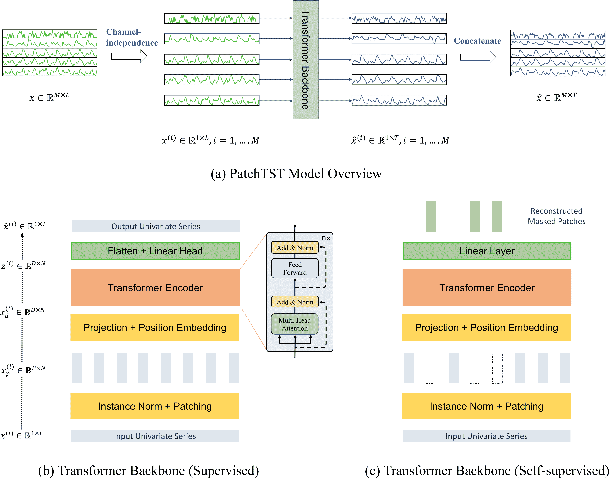

# PatchTST

> 原文链接：[`huggingface.co/docs/transformers/v4.37.2/en/model_doc/patchtst`](https://huggingface.co/docs/transformers/v4.37.2/en/model_doc/patchtst)

## 概述

PatchTST 模型由 Yuqi Nie、Nam H. Nguyen、Phanwadee Sinthong 和 Jayant Kalagnanam 在[A Time Series is Worth 64 Words: Long-term Forecasting with Transformers](https://arxiv.org/abs/2211.14730)中提出。

在高层次上，该模型将时间序列向量化为给定大小的补丁，并通过一个 Transformer 对生成的向量序列进行编码，然后通过适当的头部输出预测长度的预测。该模型如下图所示：



论文摘要如下：

*我们提出了一种用于多变量时间序列预测和自监督表示学习的基于 Transformer 的模型的高效设计。它基于两个关键组件：(i) 将时间序列分割为子系列级别的补丁，这些补丁作为输入标记提供给 Transformer；(ii) 通道独立性，其中每个通道包含一个单变量时间序列，共享相同的嵌入和 Transformer 权重。补丁设计自然具有三重好处：在嵌入中保留局部语义信息；在给定相同回顾窗口的情况下，注意力图的计算和内存使用量呈二次减少；模型可以关注更长的历史。我们的通道独立补丁时间序列 Transformer（PatchTST）可以显著提高长期预测的准确性，与 SOTA 基于 Transformer 的模型相比。我们还将我们的模型应用于自监督预训练任务，并获得出色的微调性能，优于大型数据集上的监督训练。将一个数据集上的掩码预训练表示转移到其他数据集也会产生 SOTA 的预测准确性。*

该模型由[namctin](https://huggingface.co/namctin)、[gsinthong](https://huggingface.co/gsinthong)、[diepi](https://huggingface.co/diepi)、[vijaye12](https://huggingface.co/vijaye12)、[wmgifford](https://huggingface.co/wmgifford)和[kashif](https://huggingface.co/kashif)贡献。原始代码可在[此处](https://github.com/yuqinie98/PatchTST)找到。

## 使用提示

该模型还可用于时间序列分类和时间序列回归。请参阅相应的 PatchTSTForClassification 和 PatchTSTForRegression 类。

## PatchTSTConfig

### `class transformers.PatchTSTConfig`

[<来源>](https://github.com/huggingface/transformers/blob/v4.37.2/src/transformers/models/patchtst/configuration_patchtst.py#L31)

```py
( num_input_channels: int = 1 context_length: int = 32 distribution_output: str = 'student_t' loss: str = 'mse' patch_length: int = 1 patch_stride: int = 1 num_hidden_layers: int = 3 d_model: int = 128 num_attention_heads: int = 4 share_embedding: bool = True channel_attention: bool = False ffn_dim: int = 512 norm_type: str = 'batchnorm' norm_eps: float = 1e-05 attention_dropout: float = 0.0 dropout: float = 0.0 positional_dropout: float = 0.0 path_dropout: float = 0.0 ff_dropout: float = 0.0 bias: bool = True activation_function: str = 'gelu' pre_norm: bool = True positional_encoding_type: str = 'sincos' use_cls_token: bool = False init_std: float = 0.02 share_projection: bool = True scaling: Union = 'std' do_mask_input: Optional = None mask_type: str = 'random' random_mask_ratio: float = 0.5 num_forecast_mask_patches: Union = [2] channel_consistent_masking: Optional = False unmasked_channel_indices: Optional = None mask_value: int = 0 pooling_type: str = 'mean' head_dropout: float = 0.0 prediction_length: int = 24 num_targets: int = 1 output_range: Optional = None num_parallel_samples: int = 100 **kwargs )
```

参数

+   `num_input_channels` (`int`, *optional*, 默认为 1) — 目标变量的大小，默认情况下为单变量目标的 1。在多变量目标的情况下会大于 1。

+   `context_length` (`int`, *optional*, 默认为 32) — 输入序列的上下文长度。

+   `distribution_output` (`str`, *optional*, 默认为`"student_t"`) — 当损失为“nll”时，模型的分布发射头。可以是`"student_t"`、“normal”或“negative_binomial”之一。

+   `loss` (`str`, *optional*, 默认为`"mse"`) — 与`distribution_output`头部对应的模型损失函数。对于参数分布，为负对数似然（“nll”），对于点估计，为均方误差`"mse"`。

+   `patch_length` (`int`, *optional*, 默认为 1) — 定义补丁化过程的补丁长度。

+   `patch_stride` (`int`, *optional*, 默认为 1) — 定义补丁化过程的步幅。

+   `num_hidden_layers` (`int`, *optional*, 默认为 3) — 隐藏层的数量。

+   `d_model` (`int`, *optional*, 默认为 128) — Transformer 层的维度。

+   `num_attention_heads` (`int`, *optional*, 默认为 4) — Transformer 编码器中每个注意力层的注意力头数。

+   `share_embedding` (`bool`, *optional*, 默认为`True`) — 在所有通道之间共享输入嵌入。

+   `channel_attention` (`bool`, *optional*, 默认为`False`) — 激活 Transformer 中的通道注意力块，允许通道相互关注。

+   `ffn_dim` (`int`, *optional*, 默认为 512) — Transformer 编码器中“中间”（通常称为前馈）层的维度。

+   `norm_type` (`str` , *optional*, 默认为`"batchnorm"`) — 每个 Transformer 层的归一化。可以是`"batchnorm"`或`"layernorm"`。

+   `norm_eps` (`float`, *optional*, 默认为 1e-05) — 添加到归一化分母以提高数值稳定性的值。

+   `attention_dropout` (`float`, *optional*, 默认为 0.0) — 注意力概率的 dropout 概率。

+   `dropout` (`float`, *optional*, 默认为 0.0) — Transformer 中所有全连接层的 dropout 概率。

+   `positional_dropout` (`float`, *optional*, 默认为 0.0) — 位置嵌入层中的 dropout 概率。

+   `path_dropout` (`float`, *optional*, 默认为 0.0) — 残差块中的路径 dropout。

+   `ff_dropout` (`float`, *optional*, 默认为 0.0) — 在前馈网络的两层之间使用的 dropout 概率。

+   `bias` (`bool`, *optional*, 默认为`True`) — 是否在前馈网络中添加偏置。

+   `activation_function` (`str`, *optional*, 默认为`"gelu"`) — Transformer 中的非线性激活函数（字符串）。支持`"gelu"`和`"relu"`。

+   `pre_norm` (`bool`, *optional*, 默认为`True`) — 如果`pre_norm`设置为`True`，则在自注意力之前应用归一化。否则，在残差块之后应用归一化。

+   `positional_encoding_type` (`str`, *optional*, 默认为`"sincos"`) — 位置编码。支持选项`"random"`和`"sincos"`。

+   `use_cls_token` (`bool`, *optional*, 默认为`False`) — 是否使用 cls 标记。

+   `init_std` (`float`, *optional*, 默认为 0.02) — 截断正态权重初始化分布的标准差。

+   `share_projection` (`bool`, *optional*, 默认为`True`) — 在预测头部中跨不同通道共享投影层。

+   `scaling` (`Union`, *optional*, 默认为`"std"`) — 是否通过“mean”缩放器、`"std"`缩放器或如果为`None`则不缩放来缩放输入目标。如果为`True`，则缩放器设置为“mean”。

+   `do_mask_input` (`bool`, *optional*) — 在预训练期间应用屏蔽。

+   `mask_type` (`str`, *optional*, 默认为`"random"`) — 屏蔽类型。目前仅支持`"random"`和`"forecast"`。

+   `random_mask_ratio` (`float`, *optional*, 默认为 0.5) — 用于在随机预训练期间屏蔽输入数据的屏蔽比例。

+   `num_forecast_mask_patches` (`int`或`list`, *optional*, 默认为`[2]`) — 每个批次样本末尾要屏蔽的补丁数量。如果是整数，则批次中的所有样本将具有相同数量的屏蔽补丁。如果是列表，则批次中的样本将被随机屏蔽，屏蔽数量由列表中定义。此参数仅用于预测预训练。

+   `channel_consistent_masking` (`bool`, *optional*, 默认为`False`) — 如果通道一致屏蔽为 True，则所有通道将具有相同的屏蔽模式。

+   `unmasked_channel_indices` (`list`, *optional*) — 未在预训练期间屏蔽的通道索引。列表中的值为 1 到`num_input_channels`之间的数字。

+   `mask_value` (`int`, *optional*, 默认为 0) — 屏蔽补丁中的值将被`mask_value`填充。

+   `pooling_type` (`str`, *optional*, 默认为`"mean"`) — 嵌入的池化。支持`"mean"`、`"max"`和`None`。

+   `head_dropout` (`float`, *optional*, 默认为 0.0) — 头部的 dropout 概率。

+   `prediction_length`（`int`，*可选*，默认为 24）— 模型将输出的预测时间范围。

+   `num_targets`（`int`，*可选*，默认为 1）— 回归和分类任务的目标数量。对于分类，它是类的数量。

+   `output_range`（`list`，*可选*）— 回归任务的输出范围。可以设置输出值的范围以强制模型生成在范围内的值。

+   `num_parallel_samples`（`int`，*可选*，默认为 100）— 并行生成的样本数，用于概率预测。

这是配置类，用于存储 PatchTSTModel 的配置。它用于根据指定的参数实例化 PatchTST 模型，定义模型架构。[ibm/patchtst](https://huggingface.co/ibm/patchtst) 架构。

配置对象继承自 PretrainedConfig 可用于控制模型输出。阅读 PretrainedConfig 的文档以获取更多信息。

```py
>>> from transformers import PatchTSTConfig, PatchTSTModel

>>> # Initializing an PatchTST configuration with 12 time steps for prediction
>>> configuration = PatchTSTConfig(prediction_length=12)

>>> # Randomly initializing a model (with random weights) from the configuration
>>> model = PatchTSTModel(configuration)

>>> # Accessing the model configuration
>>> configuration = model.config
```

## PatchTSTModel

### `class transformers.PatchTSTModel`

[< source >](https://github.com/huggingface/transformers/blob/v4.37.2/src/transformers/models/patchtst/modeling_patchtst.py#L1147)

```py
( config: PatchTSTConfig )
```

参数

+   `config`（PatchTSTConfig）— 具有模型所有参数的模型配置类。使用配置文件初始化不会加载与模型关联的权重，只加载配置。查看 from_pretrained() 方法以加载模型权重。

裸 PatchTST 模型输出原始隐藏状态，没有特定的头。该模型继承自 PreTrainedModel。查看超类文档以了解库为所有模型实现的通用方法（如下载或保存、调整输入嵌入、修剪头等）。

该模型也是 PyTorch [torch.nn.Module](https://pytorch.org/docs/stable/nn.html#torch.nn.Module) 的子类。将其用作常规 PyTorch 模块，并参考 PyTorch 文档以获取有关一般用法和行为的所有相关信息。

#### `forward`

[< source >](https://github.com/huggingface/transformers/blob/v4.37.2/src/transformers/models/patchtst/modeling_patchtst.py#L1170)

```py
( past_values: Tensor past_observed_mask: Optional = None future_values: Optional = None output_hidden_states: Optional = None output_attentions: Optional = None return_dict: Optional = None )
```

参数

+   `past_values`（形状为 `(bs, sequence_length, num_input_channels)` 的 `torch.Tensor`，*必需*）— 输入序列到模型

+   `past_observed_mask`（形状为 `(batch_size, sequence_length, num_input_channels)` 的 `torch.BoolTensor`，*可选*）— 布尔掩码，指示哪些 `past_values` 被观察到，哪些是缺失的。掩码值选在 `[0, 1]`：

    +   1 表示 `观察到` 的值，

    +   0 表示 `缺失` 的值（即被零替换的 NaN）。

+   `future_values`（形状为 `(batch_size, prediction_length, num_input_channels)` 的 `torch.BoolTensor`，*可选*）— 与 `past_values` 相关的未来目标值

+   `output_hidden_states`（`bool`，*可选*）— 是否返回所有层的隐藏状态

+   `output_attentions`（`bool`，*可选*）— 是否返回所有层的输出注意力

+   `return_dict`（`bool`，*可选*）— 是否返回 `ModelOutput` 而不是普通元组。

示例：

```py
>>> from huggingface_hub import hf_hub_download
>>> import torch
>>> from transformers import PatchTSTModel

>>> file = hf_hub_download(
...     repo_id="hf-internal-testing/etth1-hourly-batch", filename="train-batch.pt", repo_type="dataset"
... )
>>> batch = torch.load(file)

>>> model = PatchTSTModel.from_pretrained("namctin/patchtst_etth1_pretrain")

>>> # during training, one provides both past and future values
>>> outputs = model(
...     past_values=batch["past_values"],
...     future_values=batch["future_values"],
... )

>>> last_hidden_state = outputs.last_hidden_state
```

## PatchTSTForPrediction

### `class transformers.PatchTSTForPrediction`

[< source >](https://github.com/huggingface/transformers/blob/v4.37.2/src/transformers/models/patchtst/modeling_patchtst.py#L1638)

```py
( config: PatchTSTConfig )
```

参数

+   `config` (PatchTSTConfig) — 具有模型所有参数的模型配置类。使用配置文件初始化不会加载与模型相关的权重，只加载配置。查看 from_pretrained()方法以加载模型权重。

用于预测的 PatchTST 模型。该模型继承自 PreTrainedModel。查看超类文档，了解库实现的所有模型的通用方法（如下载或保存、调整输入嵌入、修剪头等）。

该模型也是 PyTorch [torch.nn.Module](https://pytorch.org/docs/stable/nn.html#torch.nn.Module)子类。将其用作常规 PyTorch 模块，并参考 PyTorch 文档以获取有关一般用法和行为的所有相关信息。

#### `forward`

[<来源>](https://github.com/huggingface/transformers/blob/v4.37.2/src/transformers/models/patchtst/modeling_patchtst.py#L1672)

```py
( past_values: Tensor past_observed_mask: Optional = None future_values: Optional = None output_hidden_states: Optional = None output_attentions: Optional = None return_dict: Optional = None )
```

参数

+   `past_values` (`torch.Tensor`，形状为`(bs, sequence_length, num_input_channels)`，*required*) — 输入序列到模型

+   `past_observed_mask` (`torch.BoolTensor`，形状为`(batch_size, sequence_length, num_input_channels)`，*optional*) — 布尔掩码，指示哪些`past_values`是观察到的，哪些是缺失的。掩码值选在`[0, 1]`范围内：

    +   1 表示`观察到`的值，

    +   0 表示`缺失`的值（即用零替换的 NaN）。

+   `future_values` (`torch.Tensor`，形状为`(bs, forecast_len, num_input_channels)`，*optional*) — 与`past_values`相关联的未来目标值

+   `output_hidden_states` (`bool`, *optional*) — 是否返回所有层的隐藏状态

+   `output_attentions` (`bool`, *optional*) — 是否返回所有层的注意力输出

+   `return_dict` (`bool`, *optional*) — 是否返回`ModelOutput`而不是普通元组。

示例：

```py
>>> from huggingface_hub import hf_hub_download
>>> import torch
>>> from transformers import PatchTSTConfig, PatchTSTForPrediction

>>> file = hf_hub_download(
...     repo_id="hf-internal-testing/etth1-hourly-batch", filename="train-batch.pt", repo_type="dataset"
... )
>>> batch = torch.load(file)

>>> # Prediction task with 7 input channels and prediction length is 96
>>> model = PatchTSTForPrediction.from_pretrained("namctin/patchtst_etth1_forecast")

>>> # during training, one provides both past and future values
>>> outputs = model(
...     past_values=batch["past_values"],
...     future_values=batch["future_values"],
... )

>>> loss = outputs.loss
>>> loss.backward()

>>> # during inference, one only provides past values, the model outputs future values
>>> outputs = model(past_values=batch["past_values"])
>>> prediction_outputs = outputs.prediction_outputs
```

## PatchTSTForClassification

### `class transformers.PatchTSTForClassification`

[<来源>](https://github.com/huggingface/transformers/blob/v4.37.2/src/transformers/models/patchtst/modeling_patchtst.py#L1443)

```py
( config: PatchTSTConfig )
```

参数

+   `config` (PatchTSTConfig) — 具有模型所有参数的模型配置类。使用配置文件初始化不会加载与模型相关的权重，只加载配置。查看 from_pretrained()方法以加载模型权重。

用于分类的 PatchTST 模型。该模型继承自 PreTrainedModel。查看超类文档，了解库实现的所有模型的通用方法（如下载或保存、调整输入嵌入、修剪头等）。

该模型也是 PyTorch [torch.nn.Module](https://pytorch.org/docs/stable/nn.html#torch.nn.Module)子类。将其用作常规 PyTorch 模块，并参考 PyTorch 文档以获取有关一般用法和行为的所有相关信息。

#### `forward`

[<来源>](https://github.com/huggingface/transformers/blob/v4.37.2/src/transformers/models/patchtst/modeling_patchtst.py#L1462)

```py
( past_values: Tensor target_values: Tensor = None past_observed_mask: Optional = None output_hidden_states: Optional = None output_attentions: Optional = None return_dict: Optional = None )
```

参数

+   `past_values` (`torch.Tensor`，形状为`(bs, sequence_length, num_input_channels)`，*required*) — 输入序列到模型

+   `target_values` (`torch.Tensor`, *optional*) — 与`past_values`相关联的标签

+   `past_observed_mask` (`torch.BoolTensor`，形状为`(batch_size, sequence_length, num_input_channels)`，*optional*) — 布尔掩码，指示哪些`past_values`是观察到的，哪些是缺失的。掩码值选在`[0, 1]`范围内：

    +   1 表示值是`observed`，

    +   对于`missing`的值（即被零替换的 NaN）为 0。

+   `output_hidden_states`（`bool`，*可选*）-是否返回所有层的隐藏状态

+   `output_attentions`（`bool`，*可选*）-是否返回所有层的输出注意力

+   `return_dict`（`bool`，*可选*）-是否返回`ModelOutput`而不是普通元组。

示例：

```py
>>> from transformers import PatchTSTConfig, PatchTSTForClassification

>>> # classification task with two input channel2 and 3 classes
>>> config = PatchTSTConfig(
...     num_input_channels=2,
...     num_targets=3,
...     context_length=512,
...     patch_length=12,
...     stride=12,
...     use_cls_token=True,
... )
>>> model = PatchTSTForClassification(config=config)

>>> # during inference, one only provides past values
>>> past_values = torch.randn(20, 512, 2)
>>> outputs = model(past_values=past_values)
>>> labels = outputs.prediction_logits
```

## PatchTSTForPretraining

### `class transformers.PatchTSTForPretraining`

[<来源>](https://github.com/huggingface/transformers/blob/v4.37.2/src/transformers/models/patchtst/modeling_patchtst.py#L1291)

```py
( config: PatchTSTConfig )
```

参数

+   `config`（PatchTSTConfig](/docs/transformers/v4.37.2/en/main_classes/model#transformers.PreTrainedModel.from_pretrained)方法以加载模型权重。

用于预训练模型的 PatchTST。此模型继承自 PreTrainedModel。查看超类文档以了解库为所有模型实现的通用方法（如下载或保存，调整输入嵌入，修剪头等）。

此模型也是 PyTorch [torch.nn.Module](https://pytorch.org/docs/stable/nn.html#torch.nn.Module)子类。将其用作常规 PyTorch 模块，并参考 PyTorch 文档以了解所有与一般使用和行为相关的事项。

#### `forward`

[<来源>](https://github.com/huggingface/transformers/blob/v4.37.2/src/transformers/models/patchtst/modeling_patchtst.py#L1306)

```py
( past_values: Tensor past_observed_mask: Optional = None output_hidden_states: Optional = None output_attentions: Optional = None return_dict: Optional = None )
```

参数

+   `past_values`（形状为`(bs, sequence_length, num_input_channels)`的`torch.Tensor`，*必需*）-输入序列到模型

+   `past_observed_mask`（形状为`(batch_size, sequence_length, num_input_channels)`的`torch.BoolTensor`，*可选*）-布尔掩码，指示哪些`past_values`是观察到的，哪些是缺失的。掩码值选在`[0, 1]`中：

    +   1 表示值是`observed`，

    +   对于`missing`的值（即被零替换的 NaN）为 0。

+   `output_hidden_states`（`bool`，*可选*）-是否返回所有层的隐藏状态

+   `output_attentions`（`bool`，*可选*）-是否返回所有层的输出注意力

+   `return_dict`（`bool`，*可选*）-是否返回`ModelOutput`而不是普通元组。

示例：

```py
>>> from huggingface_hub import hf_hub_download
>>> import torch
>>> from transformers import PatchTSTConfig, PatchTSTForPretraining

>>> file = hf_hub_download(
...     repo_id="hf-internal-testing/etth1-hourly-batch", filename="train-batch.pt", repo_type="dataset"
... )
>>> batch = torch.load(file)

>>> # Config for random mask pretraining
>>> config = PatchTSTConfig(
...     num_input_channels=7,
...     context_length=512,
...     patch_length=12,
...     stride=12,
...     mask_type='random',
...     random_mask_ratio=0.4,
...     use_cls_token=True,
... )
>>> # Config for forecast mask pretraining
>>> config = PatchTSTConfig(
...     num_input_channels=7,
...     context_length=512,
...     patch_length=12,
...     stride=12,
...     mask_type='forecast',
...     num_forecast_mask_patches=5,
...     use_cls_token=True,
... )
>>> model = PatchTSTForPretraining(config)

>>> # during training, one provides both past and future values
>>> outputs = model(past_values=batch["past_values"])

>>> loss = outputs.loss
>>> loss.backward()
```

## PatchTSTForRegression

### `class transformers.PatchTSTForRegression`

[<来源>](https://github.com/huggingface/transformers/blob/v4.37.2/src/transformers/models/patchtst/modeling_patchtst.py#L1884)

```py
( config: PatchTSTConfig )
```

参数

+   `config`（PatchTSTConfig](/docs/transformers/v4.37.2/en/main_classes/model#transformers.PreTrainedModel.from_pretrained)方法以加载模型权重。

用于回归模型的 PatchTST。此模型继承自 PreTrainedModel。查看超类文档以了解库为所有模型实现的通用方法（如下载或保存，调整输入嵌入，修剪头等）。

此模型也是 PyTorch [torch.nn.Module](https://pytorch.org/docs/stable/nn.html#torch.nn.Module)子类。将其用作常规 PyTorch 模块，并参考 PyTorch 文档以了解所有与一般使用和行为相关的事项。

#### `forward`

[<来源>](https://github.com/huggingface/transformers/blob/v4.37.2/src/transformers/models/patchtst/modeling_patchtst.py#L1915)

```py
( past_values: Tensor target_values: Tensor = None past_observed_mask: Optional = None output_hidden_states: Optional = None output_attentions: Optional = None return_dict: Optional = None )
```

参数

+   `past_values` (`torch.Tensor` of shape `(bs, sequence_length, num_input_channels)`, *required*) — 输入模型的序列

+   `target_values` (`torch.Tensor` of shape `(bs, num_input_channels)`) — 与`past_values`相关联的目标值

+   `past_observed_mask` (`torch.BoolTensor` of shape `(batch_size, sequence_length, num_input_channels)`, *optional*) — 布尔掩码，指示哪些`past_values`是观察到的，哪些是缺失的。掩码值选在`[0, 1]`之间：

    +   1 表示观察到的值，

    +   0 表示缺失的值（即被零替换的 NaN）。

+   `output_hidden_states` (`bool`, *optional*) — 是否返回所有层的隐藏状态

+   `output_attentions` (`bool`, *optional*) — 是否返回所有层的输出注意力

+   `return_dict` (`bool`, *optional*) — 是否返回一个`ModelOutput`而不是一个普通的元组。

示例：

```py
>>> from transformers import PatchTSTConfig, PatchTSTForRegression

>>> # Regression task with 6 input channels and regress 2 targets
>>> model = PatchTSTForRegression.from_pretrained("namctin/patchtst_etth1_regression")

>>> # during inference, one only provides past values, the model outputs future values
>>> past_values = torch.randn(20, 512, 6)
>>> outputs = model(past_values=past_values)
>>> regression_outputs = outputs.regression_outputs
```
